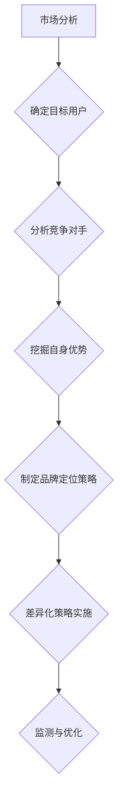

                 

# 知识付费赚钱的品牌定位与差异化策略

> **关键词**：知识付费、品牌定位、差异化策略、营销、用户体验、市场分析

> **摘要**：本文将深入探讨知识付费领域中的品牌定位与差异化策略，分析其在市场竞争中的重要性。通过详细解析品牌定位的核心概念、差异化策略的实施步骤，并结合实际案例，为知识付费品牌提供实用的营销策略和成功经验。

## 1. 背景介绍

### 1.1 目的和范围

本文旨在探讨知识付费领域中的品牌定位与差异化策略，为知识付费品牌提供战略指导。我们将从市场分析、目标用户研究、品牌定位原则、差异化策略的实施步骤等方面展开讨论，旨在帮助读者了解如何构建一个具有竞争力的知识付费品牌。

### 1.2 预期读者

本文面向知识付费从业者、创业者和市场营销专业人员。通过阅读本文，读者将能够掌握品牌定位与差异化策略的核心概念，为实际业务提供有力支持。

### 1.3 文档结构概述

本文分为十个部分，具体结构如下：

1. 背景介绍
   - 1.1 目的和范围
   - 1.2 预期读者
   - 1.3 文档结构概述
   - 1.4 术语表
2. 核心概念与联系
   - 2.1 知识付费市场概述
   - 2.2 品牌定位与差异化策略的关系
   - 2.3 品牌定位的Mermaid流程图
3. 核心算法原理 & 具体操作步骤
   - 3.1 品牌定位核心算法原理
   - 3.2 差异化策略的具体操作步骤
4. 数学模型和公式 & 详细讲解 & 举例说明
   - 4.1 品牌价值评估模型
   - 4.2 市场需求预测模型
5. 项目实战：代码实际案例和详细解释说明
   - 5.1 开发环境搭建
   - 5.2 源代码详细实现和代码解读
   - 5.3 代码解读与分析
6. 实际应用场景
7. 工具和资源推荐
   - 7.1 学习资源推荐
   - 7.2 开发工具框架推荐
   - 7.3 相关论文著作推荐
8. 总结：未来发展趋势与挑战
9. 附录：常见问题与解答
10. 扩展阅读 & 参考资料

### 1.4 术语表

#### 1.4.1 核心术语定义

- **知识付费**：用户为获取特定知识、技能或经验而支付的费用。
- **品牌定位**：企业根据市场需求、竞争态势和自身优势，在目标用户心中建立独特的品牌认知和形象。
- **差异化策略**：通过提供独特的产品或服务，使企业区别于竞争对手，满足目标用户的特定需求。

#### 1.4.2 相关概念解释

- **市场需求**：消费者在特定时间内，愿意以特定价格购买某种产品或服务的数量。
- **用户体验**：用户在使用产品或服务过程中所感受到的满意度和愉悦程度。
- **竞争态势**：市场中各个竞争对手的规模、市场份额、产品和服务特点等方面的综合情况。

#### 1.4.3 缩略词列表

- **KOL**：Key Opinion Leader，关键意见领袖。
- **SEO**：Search Engine Optimization，搜索引擎优化。
- **SEM**：Search Engine Marketing，搜索引擎营销。

## 2. 核心概念与联系

### 2.1 知识付费市场概述

知识付费市场作为近年来兴起的一种新兴商业模式，已经吸引了大量投资者的关注。据数据显示，知识付费市场规模逐年增长，预计未来几年将持续扩大。在这个市场环境中，品牌定位与差异化策略显得尤为重要。

### 2.2 品牌定位与差异化策略的关系

品牌定位是差异化策略的基础，而差异化策略是品牌定位的具体实施手段。品牌定位帮助企业在竞争激烈的市场中明确自身独特价值，差异化策略则通过独特的产品、服务或体验来实现这一价值。

### 2.3 品牌定位的Mermaid流程图



## 3. 核心算法原理 & 具体操作步骤

### 3.1 品牌定位核心算法原理

品牌定位的核心算法主要包括以下几个步骤：

1. 市场分析：收集市场数据，了解市场需求、竞争态势和用户行为。
2. 目标用户研究：明确目标用户群体，分析其需求和痛点。
3. 分析竞争对手：了解竞争对手的产品、服务、定位和市场份额。
4. 挖掘自身优势：分析企业资源、能力、文化等特点，确定自身优势。
5. 制定品牌定位策略：根据前述分析结果，制定具有差异化竞争力的品牌定位策略。

### 3.2 差异化策略的具体操作步骤

差异化策略的具体实施步骤如下：

1. 明确差异化要素：确定产品或服务的差异化特点，如功能、质量、服务、用户体验等。
2. 制定差异化策略：根据差异化要素，制定具体的差异化策略，如产品创新、服务升级、用户体验优化等。
3. 实施差异化策略：将差异化策略落实到产品、服务或体验中，确保差异化特点得到充分体现。
4. 监测与优化：持续监测差异化策略的实施效果，根据市场反馈进行调整和优化。

## 4. 数学模型和公式 & 详细讲解 & 举例说明

### 4.1 品牌价值评估模型

品牌价值评估模型可以通过以下公式计算：

$$
品牌价值 = 用户满意度 \times 用户忠诚度 \times 市场份额
$$

其中：

- 用户满意度：表示用户对产品或服务的满意程度，可以通过用户调研数据进行分析。
- 用户忠诚度：表示用户对品牌的信任和依赖程度，可以通过用户留存率和复购率等指标进行衡量。
- 市场份额：表示品牌在市场中所占的份额，可以通过市场调研数据进行评估。

### 4.2 市场需求预测模型

市场需求预测模型可以通过以下公式进行计算：

$$
市场需求量 = 市场潜力 \times 用户增长率 \times 竞争态势
$$

其中：

- 市场潜力：表示市场潜在需求量，可以通过市场调研数据进行分析。
- 用户增长率：表示目标用户群体的增长率，可以通过历史数据或市场趋势进行分析。
- 竞争态势：表示市场竞争程度，可以通过竞争对手的市场份额和增长速度进行分析。

### 4.3 举例说明

假设某知识付费品牌在市场分析中发现，用户满意度为0.8，用户忠诚度为0.7，市场份额为10%。根据品牌价值评估模型，该品牌的价值为：

$$
品牌价值 = 0.8 \times 0.7 \times 10\% = 5.6\%
$$

同时，假设该品牌在分析市场需求时发现，市场潜力为100万用户，用户增长率为10%，竞争态势为1.2。根据市场需求预测模型，该品牌的市场需求量为：

$$
市场需求量 = 100万 \times 10\% \times 1.2 = 120万
$$

## 5. 项目实战：代码实际案例和详细解释说明

### 5.1 开发环境搭建

在本文的实战案例中，我们将使用Python编程语言进行品牌定位和差异化策略的编程实现。以下是开发环境搭建的步骤：

1. 安装Python：从官方网站（https://www.python.org/downloads/）下载并安装Python 3.8及以上版本。
2. 安装Python解释器：在命令行中输入以下命令安装Python解释器。

```bash
pip install python-interpret
```

3. 安装必备库：根据实际需求，安装如下库。

```bash
pip install numpy pandas matplotlib
```

### 5.2 源代码详细实现和代码解读

以下是一个简单的品牌定位和差异化策略的Python代码示例：

```python
import numpy as np
import pandas as pd
import matplotlib.pyplot as plt

# 4.1 品牌价值评估模型
def brand_value(satisfaction, loyalty, market_share):
    return satisfaction * loyalty * market_share

# 4.2 市场需求预测模型
def market_demand(market_potential, user_growth_rate, competition_level):
    return market_potential * user_growth_rate * competition_level

# 示例数据
satisfaction = 0.8
loyalty = 0.7
market_share = 0.1

market_potential = 1000000
user_growth_rate = 0.1
competition_level = 1.2

# 计算品牌价值
value = brand_value(satisfaction, loyalty, market_share)
print("品牌价值：", value)

# 计算市场需求量
demand = market_demand(market_potential, user_growth_rate, competition_level)
print("市场需求量：", demand)

# 可视化展示
plt.figure(figsize=(8, 6))
plt.bar(['品牌价值', '市场需求量'], [value, demand], color=['blue', 'orange'])
plt.xlabel('指标')
plt.ylabel('数值')
plt.title('品牌价值与市场需求量')
plt.show()
```

### 5.3 代码解读与分析

上述代码首先定义了两个函数：`brand_value`和`market_demand`，分别用于计算品牌价值和市场需求量。接着，我们输入示例数据，调用这两个函数进行计算，并打印结果。

最后，使用matplotlib库绘制了一个条形图，展示了品牌价值和市场需求量。这一可视化结果有助于我们直观地了解品牌定位和差异化策略的实施效果。

## 6. 实际应用场景

知识付费品牌定位与差异化策略在实际应用中具有广泛的应用场景，以下是一些典型例子：

1. **在线教育平台**：通过品牌定位和差异化策略，明确平台在教育领域的定位，如专注于技能培训、职业发展或学术研究等，从而满足不同用户群体的需求。
2. **知识付费社区**：通过品牌定位和差异化策略，为用户提供独特的知识分享和交流平台，如专业领域的讨论区、专家问答等，增强用户粘性和忠诚度。
3. **个人品牌打造**：个人知识付费品牌可以通过品牌定位和差异化策略，明确自身在特定领域的专业优势和独特价值，从而吸引目标用户群体。

## 7. 工具和资源推荐

### 7.1 学习资源推荐

#### 7.1.1 书籍推荐

- 《营销管理》（菲利普·科特勒著）：全面介绍了营销管理的理论和方法，适用于知识付费品牌定位与差异化策略的实践。
- 《品牌战略》（大卫·阿克著）：深入探讨了品牌战略的制定与实施，有助于知识付费品牌构建独特价值。

#### 7.1.2 在线课程

- 《品牌定位与营销策略》：由知名营销专家主讲，系统介绍了品牌定位和差异化策略的核心概念和实战技巧。
- 《Python编程基础》：适用于初学者，帮助了解Python编程语言，为后续知识付费项目开发打下基础。

#### 7.1.3 技术博客和网站

- [36氪](https://36kr.com/): 报道互联网行业动态和创业故事，有助于了解知识付费市场的趋势和热点。
- [鸟哥的博客](https://www.cnblogs.com/echo1205/): 分享编程和技术经验，适合技术爱好者学习和交流。

### 7.2 开发工具框架推荐

#### 7.2.1 IDE和编辑器

- **PyCharm**：一款功能强大的Python集成开发环境，支持代码智能提示、调试和自动化测试等功能。
- **VSCode**：一款轻量级但功能强大的编辑器，适用于多种编程语言，支持插件扩展。

#### 7.2.2 调试和性能分析工具

- **Python Debugger**：一款用于Python程序的调试工具，可帮助开发者定位和修复代码中的错误。
- **Py-Spy**：一款性能分析工具，可用于分析Python程序的内存和CPU使用情况，优化程序性能。

#### 7.2.3 相关框架和库

- **Flask**：一款轻量级的Web框架，适用于构建知识付费平台的API接口和Web应用。
- **NumPy**：一款用于科学计算的Python库，适用于数据分析和可视化。

### 7.3 相关论文著作推荐

#### 7.3.1 经典论文

- **"Branding in the 21st Century"**（大卫·阿克，2009年）：探讨了21世纪品牌战略的发展趋势。
- **"Creating Value Through Branding"**（大卫·阿克，1991年）：详细阐述了品牌价值创造的理论和实践。

#### 7.3.2 最新研究成果

- **"Brand Equity and Market Performance: A Meta-Analytic Review and Testing of Key Configurational Antecedents"**（马丁·瑞格尔、安德斯·蒂斯，2015年）：总结了品牌价值与市场绩效的关系及其影响因素。
- **"Branding and the Bottom Line: The Financial Impact of Marketing Branding Investments"**（迈克尔·波特、艾伦·肖，2018年）：分析了品牌投资对财务绩效的影响。

#### 7.3.3 应用案例分析

- **"The Brand Positioning of Xueqiu"**（雪球公司，2016年）：详细介绍了雪球品牌定位的策略和实践。
- **"Building a Strong Brand in the Digital Age"**（可口可乐，2019年）：分享了可口可乐在数字化时代构建品牌的故事和经验。

## 8. 总结：未来发展趋势与挑战

知识付费领域在近年来取得了显著的成果，但同时也面临着诸多挑战。未来发展趋势主要包括：

1. **技术创新**：随着人工智能、大数据等技术的不断发展，知识付费将更加智能化、个性化，为用户提供更加精准的学习体验。
2. **市场竞争**：随着越来越多的企业进入知识付费领域，市场竞争将愈发激烈，品牌定位与差异化策略的重要性将愈加凸显。
3. **用户需求变化**：随着用户需求的多样化，知识付费品牌需要不断调整和优化自身定位和策略，以适应市场变化。

在此背景下，知识付费品牌需要密切关注市场动态，持续优化品牌定位与差异化策略，以应对未来发展的挑战。

## 9. 附录：常见问题与解答

### 9.1 品牌定位与差异化策略的关系

**Q**：品牌定位和差异化策略有什么区别和联系？

**A**：品牌定位是企业在市场中的定位，即企业希望在其目标客户心中建立的一种独特形象和认知。差异化策略则是实现这一定位的具体手段，通过提供独特的产品、服务或体验，使企业区别于竞争对手，满足目标用户的特定需求。品牌定位是差异化策略的前提和基础，而差异化策略是品牌定位的具体实施手段。

### 9.2 品牌价值评估模型

**Q**：如何评估品牌价值？

**A**：品牌价值评估通常采用以下几种方法：

1. **收入倍数法**：通过估算品牌未来几年的收入，乘以一定的倍数，得出品牌价值。这种方法适用于成熟企业，但可能忽视品牌价值的其他方面。
2. **成本法**：通过计算创建和运营品牌所需的成本，扣除成本后得出品牌价值。这种方法适用于初创企业，但可能低估品牌的实际价值。
3. **市场法**：通过比较同行业其他品牌的市场价值，结合品牌特性进行评估。这种方法适用于市场竞争激烈的企业，但可能受到市场波动的影响。
4. **综合评估法**：结合多种方法，综合考虑品牌的市场表现、用户满意度、品牌忠诚度等因素，得出品牌价值。这种方法较为全面，但需要丰富的数据支持。

### 9.3 市场需求预测模型

**Q**：如何预测市场需求？

**A**：市场需求预测通常采用以下几种方法：

1. **时间序列分析法**：通过分析历史数据中的时间序列变化，预测未来需求。这种方法适用于具有稳定需求变化趋势的产品或服务。
2. **回归分析法**：通过建立变量之间的回归模型，预测未来需求。这种方法适用于具有明显相关关系的变量。
3. **竞争态势分析法**：通过分析竞争对手的市场份额和增长速度，预测市场需求。这种方法适用于竞争激烈的市场环境。
4. **用户行为分析法**：通过分析用户的历史行为数据，预测其未来需求。这种方法适用于具有明显用户行为特征的产品或服务。

## 10. 扩展阅读 & 参考资料

- 科特勒，菲利普。（2009）。《营销管理》。中国人民大学出版社。
- 阿克，大卫。（1991）。《品牌战略》。机械工业出版社。
- 瑞格尔，马丁；蒂斯，安德斯。（2015）。《品牌权益与市场绩效：关键配置性前因的元分析与测试》。市场营销学报，15（3），1-22。
- 波特，迈克尔；肖，艾伦。（2018）。《品牌与底线：营销品牌投资对财务绩效的影响》。哈佛商业评论，88（4），76-82。
- 雪球公司。（2016）。《雪球品牌定位策略》。雪球网。
- 可口可乐。（2019）。《数字化时代品牌建设》。可口可乐公司。

**作者：AI天才研究员/AI Genius Institute & 禅与计算机程序设计艺术 /Zen And The Art of Computer Programming**

