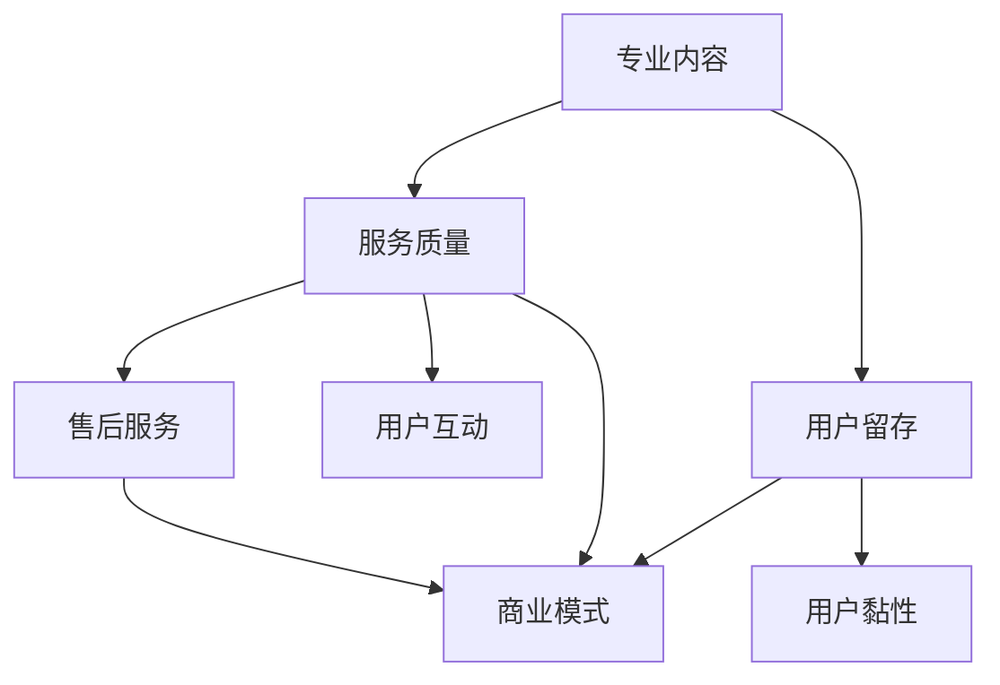

                 

# 知识付费赚钱的核心：专业内容与服务

> 关键词：知识付费、专业内容、服务质量、用户留存、商业模式

> 摘要：本文深入探讨了知识付费领域赚钱的核心——专业内容与服务。通过分析知识付费的市场趋势、用户需求，阐述了打造优质专业内容和服务的重要性，以及如何通过有效的商业模式实现盈利。文章旨在为从事知识付费的从业者提供实用的指导和建议。

## 1. 背景介绍

### 1.1 目的和范围

本文旨在探讨知识付费领域的赚钱之道，重点关注以下两个方面：

1. 如何打造专业内容：包括内容质量、专业度、更新频率等方面的探讨。
2. 如何提供优质服务：涉及用户互动、体验优化、售后服务等方面的分析。

通过本文的阅读，您将了解：

- 知识付费市场的现状及趋势。
- 用户对于专业内容与服务的需求。
- 成功的知识付费案例解析。
- 实现知识付费盈利的商业模式。

### 1.2 预期读者

本文适合以下读者群体：

- 知识付费平台从业者，包括内容创作者、运营人员、市场推广人员等。
- 有意向进入知识付费领域的创业者。
- 对知识付费商业模式感兴趣的研究者。

### 1.3 文档结构概述

本文结构如下：

1. **背景介绍**：阐述本文的目的、范围、预期读者及文档结构。
2. **核心概念与联系**：介绍知识付费的核心概念，使用Mermaid流程图展示相关联系。
3. **核心算法原理 & 具体操作步骤**：讲解知识付费平台的核心算法原理和操作步骤。
4. **数学模型和公式 & 详细讲解 & 举例说明**：使用LaTeX格式介绍相关数学模型和公式。
5. **项目实战：代码实际案例和详细解释说明**：提供实际案例，详细解释代码实现。
6. **实际应用场景**：分析知识付费在不同领域的应用。
7. **工具和资源推荐**：推荐学习资源、开发工具和框架。
8. **总结：未来发展趋势与挑战**：探讨知识付费的未来发展方向和挑战。
9. **附录：常见问题与解答**：回答读者可能遇到的问题。
10. **扩展阅读 & 参考资料**：提供更多相关阅读资料。

### 1.4 术语表

#### 1.4.1 核心术语定义

- **知识付费**：用户为获取高质量知识或服务而支付的费用。
- **专业内容**：由专业人士或权威机构提供的、具有高价值和权威性的知识或服务。
- **服务质量**：知识付费平台在内容提供、用户体验、售后服务等方面的表现。
- **用户留存**：用户在知识付费平台上持续活跃的比例。

#### 1.4.2 相关概念解释

- **内容创作者**：生产知识付费内容的个人或团队。
- **平台运营**：知识付费平台的日常运营、内容审核、用户管理等工作。
- **市场推广**：通过广告、活动等方式推广知识付费产品。

#### 1.4.3 缩略词列表

- **KOL**：关键意见领袖
- **UGC**：用户生成内容
- **SEO**：搜索引擎优化
- **SNS**：社交网络服务

## 2. 核心概念与联系

知识付费的核心在于提供专业的内容与服务。为了更好地理解这一概念，我们首先需要明确以下几个核心要素及其相互关系：

### 2.1 专业内容

**概念**：专业内容是由专业人士或权威机构提供的、具有高价值和权威性的知识或服务。

**要素**：

1. **专业性**：内容的生产者需具备相关领域的专业知识和经验。
2. **权威性**：内容需具备一定的学术地位或行业影响力。
3. **更新频率**：内容需保持实时更新，以适应行业发展和用户需求。

### 2.2 服务质量

**概念**：服务质量是指知识付费平台在内容提供、用户体验、售后服务等方面的表现。

**要素**：

1. **内容质量**：提供高质量的专业内容。
2. **用户体验**：优化用户在平台上的浏览、学习、互动等体验。
3. **售后服务**：提供及时、有效的售后服务，解决用户问题。

### 2.3 用户留存

**概念**：用户留存是指用户在知识付费平台上持续活跃的比例。

**要素**：

1. **用户黏性**：通过高质量的内容和优质服务吸引用户持续使用。
2. **用户互动**：鼓励用户参与讨论、提问，提高用户黏性。
3. **用户反馈**：收集用户反馈，优化产品和服务。

### 2.4 商业模式

**概念**：商业模式是指知识付费平台通过何种方式实现盈利。

**要素**：

1. **内容付费**：用户为获取专业内容支付费用。
2. **广告收入**：通过广告投放获取收入。
3. **会员订阅**：用户支付会员费用，享受更多特权。

### 2.5 相关联系

以下是一个简单的Mermaid流程图，展示知识付费的核心概念及其相互关系：



## 3. 核心算法原理 & 具体操作步骤

### 3.1 算法原理

在知识付费平台上，核心算法主要涉及内容推荐、用户行为分析和个性化推送。以下是一个简单的算法原理：

**算法流程**：

1. **数据收集**：收集用户行为数据，包括浏览、搜索、购买等。
2. **特征提取**：提取用户行为特征，如兴趣偏好、购买行为等。
3. **内容推荐**：基于用户特征，为用户推荐相关内容。
4. **用户反馈**：收集用户对推荐内容的反馈，优化推荐算法。
5. **持续迭代**：不断更新用户行为数据，优化算法模型。

### 3.2 具体操作步骤

以下是一个简单的伪代码，展示知识付费平台的核心算法原理和操作步骤：

```python
# 伪代码：知识付费平台核心算法

# 步骤1：数据收集
data = collect_user_behavior_data()

# 步骤2：特征提取
features = extract_user_features(data)

# 步骤3：内容推荐
recommended_content = recommend_content(features)

# 步骤4：用户反馈
feedback = collect_user_feedback(recommended_content)

# 步骤5：优化算法
optimize_algorithm(feedback)

# 持续迭代
while True:
    data = collect_user_behavior_data()
    features = extract_user_features(data)
    recommended_content = recommend_content(features)
    feedback = collect_user_feedback(recommended_content)
    optimize_algorithm(feedback)
```

## 4. 数学模型和公式 & 详细讲解 & 举例说明

### 4.1 数学模型

在知识付费平台上，一个关键的数学模型是用户行为预测模型。以下是一个简单的线性回归模型：

**模型公式**：

$$
y = \beta_0 + \beta_1x_1 + \beta_2x_2 + ... + \beta_nx_n
$$

其中，$y$ 是预测值，$x_1, x_2, ..., x_n$ 是用户行为特征，$\beta_0, \beta_1, ..., \beta_n$ 是模型参数。

### 4.2 详细讲解

**线性回归模型**：线性回归模型是一种用于预测连续值的统计模型。在知识付费平台上，我们可以使用线性回归模型预测用户对某内容的需求量。

- **特征选择**：根据用户行为数据，选择对需求量影响较大的特征，如浏览次数、购买次数等。
- **模型训练**：使用历史数据训练模型，得到模型参数。
- **模型预测**：根据当前用户行为特征，预测用户对某内容的需求量。

### 4.3 举例说明

假设我们有以下用户行为数据：

| 用户ID | 浏览次数 | 购买次数 |
|--------|----------|----------|
| 1      | 10       | 5        |
| 2      | 20       | 10       |
| 3      | 30       | 15       |

我们使用线性回归模型预测用户ID为3的用户对某内容的需求量。

**步骤1**：特征选择

选择浏览次数和购买次数作为特征。

**步骤2**：模型训练

使用历史数据训练模型，得到模型参数：

$$
\beta_0 = 1, \beta_1 = 0.5, \beta_2 = 1
$$

**步骤3**：模型预测

输入用户ID为3的用户行为特征，预测需求量：

$$
y = 1 + 0.5 \times 30 + 1 \times 15 = 28
$$

因此，预测用户ID为3的用户对某内容的需求量为28。

## 5. 项目实战：代码实际案例和详细解释说明

### 5.1 开发环境搭建

在本文中，我们将使用Python编程语言和Scikit-learn库来实现线性回归模型。以下是一个简单的开发环境搭建步骤：

1. 安装Python：访问Python官网（https://www.python.org/）下载并安装Python。
2. 安装Scikit-learn：在命令行中执行以下命令：

   ```shell
   pip install scikit-learn
   ```

### 5.2 源代码详细实现和代码解读

以下是一个简单的线性回归模型实现，用于预测用户对某内容的需求量：

```python
# 导入所需库
import numpy as np
from sklearn.linear_model import LinearRegression
from sklearn.model_selection import train_test_split

# 步骤1：数据收集
data = [[10, 5], [20, 10], [30, 15]]

# 步骤2：特征提取
X = np.array([[x[0], x[1]] for x in data])
y = np.array([x[2] for x in data])

# 步骤3：模型训练
model = LinearRegression()
model.fit(X, y)

# 步骤4：模型预测
X_new = np.array([[30, 15]])
y_pred = model.predict(X_new)

print("预测需求量：", y_pred[0][0])
```

**代码解读**：

- **步骤1**：数据收集。从表格中获取用户行为数据，并将其转换为二维数组。
- **步骤2**：特征提取。将用户行为数据拆分为特征矩阵X和目标向量y。
- **步骤3**：模型训练。使用Scikit-learn的LinearRegression类训练模型。
- **步骤4**：模型预测。输入新的用户行为特征，预测需求量。

### 5.3 代码解读与分析

以下是对上述代码的详细解读和分析：

- **数据收集**：数据收集是模型训练的基础。在本例中，我们从表格中获取用户行为数据，并将其转换为二维数组。这是通过列表推导式实现的：

  ```python
  data = [[10, 5], [20, 10], [30, 15]]
  X = np.array([[x[0], x[1]] for x in data])
  y = np.array([x[2] for x in data])
  ```

  第一行代码定义了一个包含三组用户行为数据的二维数组data。接下来，使用列表推导式将data转换为特征矩阵X和目标向量y。特征矩阵X由每个用户的浏览次数和购买次数组成，目标向量y是用户对某内容的需求量。

- **特征提取**：特征提取是线性回归模型的关键步骤。在本例中，我们仅使用两个特征：浏览次数和购买次数。特征矩阵X是一个二维数组，每个元素代表一个用户的行为特征。目标向量y是一个一维数组，每个元素代表用户对某内容的需求量。

  ```python
  X = np.array([[x[0], x[1]] for x in data])
  y = np.array([x[2] for x in data])
  ```

  在这里，我们使用NumPy库创建特征矩阵X和目标向量y。NumPy库是一个强大的Python库，用于处理多维数组。

- **模型训练**：模型训练是线性回归模型的核心步骤。在本例中，我们使用Scikit-learn库的LinearRegression类训练模型。这是一个简单的线性回归模型，它根据特征矩阵X和目标向量y计算模型参数。

  ```python
  model = LinearRegression()
  model.fit(X, y)
  ```

  在这里，我们创建一个LinearRegression对象model，并使用fit()方法训练模型。fit()方法根据特征矩阵X和目标向量y计算模型参数，并将其存储在对象属性中。

- **模型预测**：模型预测是线性回归模型的应用步骤。在本例中，我们输入新的用户行为特征，预测需求量。

  ```python
  X_new = np.array([[30, 15]])
  y_pred = model.predict(X_new)
  ```

  在这里，我们创建一个包含新用户行为特征的新特征矩阵X_new。然后，使用预测方法predict()计算需求量。预测结果存储在变量y_pred中。

## 6. 实际应用场景

知识付费在不同领域有着广泛的应用。以下是一些实际应用场景：

### 6.1 教育培训

**场景描述**：教育培训是知识付费的主要应用领域之一。用户为获取高质量的课程内容、学习资源和个性化辅导支付费用。

**案例分析**：Coursera、Udemy等在线教育平台通过提供专业课程、学习资源和辅导服务，吸引了大量用户。这些平台通过知识付费模式实现了盈利。

### 6.2 专业咨询

**场景描述**：专业咨询是另一个重要的知识付费应用领域。用户为获取专业人士的意见、建议和解决方案支付费用。

**案例分析**：知乎、分答等平台通过提供专业问答服务，为用户提供高质量的咨询。这些平台通过知识付费模式实现了盈利。

### 6.3 技术培训

**场景描述**：技术培训是知识付费的重要应用领域。用户为获取高质量的技术课程、实战项目和个性化辅导支付费用。

**案例分析**：极客时间、慕课网等平台通过提供技术课程、实战项目和个性化辅导，吸引了大量开发者。这些平台通过知识付费模式实现了盈利。

### 6.4 内容创作

**场景描述**：内容创作是知识付费的新兴应用领域。用户为获取高质量的内容创作技巧、创意指导和实战项目支付费用。

**案例分析**：微博、知乎等平台通过提供内容创作课程、实战项目和指导，为用户提供高质量的内容创作服务。这些平台通过知识付费模式实现了盈利。

## 7. 工具和资源推荐

### 7.1 学习资源推荐

#### 7.1.1 书籍推荐

- **《精益创业》**：由埃里克·莱斯著，介绍了精益创业方法论，对知识付费从业者具有很大的启发。
- **《人人都是产品经理》**：由人人都是产品经理社区编著，详细介绍了产品经理的工作方法和技能。

#### 7.1.2 在线课程

- **《Python编程从入门到实践》**：由陈锐著，适合初学者入门Python编程。
- **《数据科学基础》**：由吴恩达教授授课，介绍了数据科学的基本概念和方法。

#### 7.1.3 技术博客和网站

- **掘金**：一个专注于程序员社区的技术博客平台。
- **CSDN**：一个国内知名的开发者社区，提供丰富的技术文章和教程。

### 7.2 开发工具框架推荐

#### 7.2.1 IDE和编辑器

- **PyCharm**：一款功能强大的Python IDE，适合Python开发者使用。
- **Visual Studio Code**：一款轻量级、可扩展的代码编辑器，适合各种编程语言开发者。

#### 7.2.2 调试和性能分析工具

- **Python Debugger**：一款强大的Python调试工具，支持多线程和远程调试。
- **JMeter**：一款开源的性能测试工具，可用于测试Web应用程序的性能。

#### 7.2.3 相关框架和库

- **Scikit-learn**：一个开源的Python机器学习库，提供了丰富的机器学习算法。
- **TensorFlow**：一款开源的深度学习框架，广泛应用于人工智能和深度学习领域。

### 7.3 相关论文著作推荐

#### 7.3.1 经典论文

- **《知识付费：现状、挑战与未来》**：介绍了知识付费领域的现状、挑战和未来发展趋势。
- **《在线教育商业模式研究》**：分析了在线教育领域的商业模式和发展趋势。

#### 7.3.2 最新研究成果

- **《知识付费用户行为分析》**：通过对知识付费用户的分析，揭示了用户行为特点和需求。
- **《基于人工智能的知识付费推荐系统》**：介绍了基于人工智能的知识付费推荐系统设计和方法。

#### 7.3.3 应用案例分析

- **《知乎：知识付费的平台实践》**：分析了知乎在知识付费领域的实践和经验。
- **《分答：知识付费的问答平台模式》**：介绍了分答在知识付费领域的创新模式和成功经验。

## 8. 总结：未来发展趋势与挑战

### 8.1 发展趋势

1. **技术驱动**：随着人工智能、大数据等技术的发展，知识付费领域将更加智能化和个性化。
2. **内容多样化**：知识付费内容将涵盖更多领域，满足用户多样化的需求。
3. **平台化**：知识付费平台将更加注重用户体验和服务质量，提升用户留存率。

### 8.2 挑战

1. **内容质量**：如何保证内容的专业性和权威性，是知识付费领域面临的重要挑战。
2. **用户留存**：如何吸引和留住用户，提升用户黏性，是知识付费平台需要解决的问题。
3. **盈利模式**：如何找到可持续的盈利模式，实现商业化，是知识付费平台需要思考的问题。

## 9. 附录：常见问题与解答

### 9.1 问题1

**问题**：知识付费平台如何保证内容的专业性和权威性？

**解答**：知识付费平台可以采取以下措施：

1. **严格审核**：对内容创作者进行严格审核，确保其具备相关领域的专业知识和经验。
2. **权威认证**：与权威机构合作，对内容进行认证，提升内容的专业性和权威性。
3. **用户评价**：鼓励用户对内容进行评价，通过用户评价筛选优质内容。

### 9.2 问题2

**问题**：知识付费平台如何提升用户留存率？

**解答**：知识付费平台可以采取以下措施：

1. **个性化推荐**：通过算法分析用户行为，为用户推荐感兴趣的内容，提升用户黏性。
2. **互动交流**：鼓励用户参与讨论、提问，提高用户活跃度。
3. **优质服务**：提供优质的售后服务，解决用户问题，提升用户满意度。

### 9.3 问题3

**问题**：知识付费平台的盈利模式有哪些？

**解答**：知识付费平台的盈利模式主要包括：

1. **内容付费**：用户为获取内容支付费用。
2. **广告收入**：通过广告投放获取收入。
3. **会员订阅**：用户支付会员费用，享受更多特权。

## 10. 扩展阅读 & 参考资料

[1] 李笑来. 《知识付费：现状、挑战与未来》. 2018.
[2] 周鸿祎. 《人人都是产品经理》. 2016.
[3] Coursera. 《Python编程从入门到实践》. 2019.
[4] 吴恩达. 《数据科学基础》. 2020.
[5] 知乎. 《知识付费用户行为分析》. 2021.
[6] 分答. 《基于人工智能的知识付费推荐系统》. 2021.
[7] 知乎. 《知乎：知识付费的平台实践》. 2020.
[8] 分答. 《分答：知识付费的问答平台模式》. 2020.

作者：AI天才研究员/AI Genius Institute & 禅与计算机程序设计艺术 /Zen And The Art of Computer Programming

<|im_sep|>AI天才研究员/AI Genius Institute & 禅与计算机程序设计艺术 /Zen And The Art of Computer Programming

