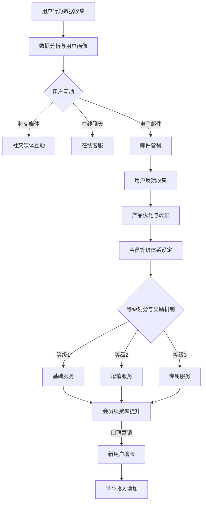

                 

# 知识付费赚钱的用户关系管理与会员等级体系

> **关键词：** 知识付费、用户关系管理、会员等级体系、客户忠诚度、盈利模式

> **摘要：** 本文深入探讨了知识付费平台如何通过有效的用户关系管理和会员等级体系来实现盈利。文章分为多个部分，分别从背景介绍、核心概念、算法原理、数学模型、实际案例以及未来发展等多个维度展开，旨在为从事知识付费领域的企业和从业者提供有价值的参考。

## 1. 背景介绍

### 1.1 目的和范围

知识付费作为一种新型的商业模式，近年来在互联网经济中占据了越来越重要的地位。随着人们对于高质量知识内容的追求，知识付费平台应运而生。然而，如何在竞争激烈的市场中脱颖而出，实现可持续发展，成为了每个知识付费平台需要面对的挑战。本文旨在探讨用户关系管理和会员等级体系在知识付费平台中的重要性，并提供一套实用的解决方案。

本文主要涵盖以下内容：

1. 用户关系管理的基本概念和重要性。
2. 会员等级体系的构建原则和实现方法。
3. 用户忠诚度和盈利模式的探讨。
4. 知识付费平台的发展趋势和挑战。
5. 实际案例和工具资源的推荐。

### 1.2 预期读者

本文适合以下读者群体：

1. 知识付费平台创始人、运营管理人员。
2. 互联网产品经理和用户增长专家。
3. 市场营销和品牌策划人员。
4. 对知识付费和用户关系管理感兴趣的学者和研究人员。

### 1.3 文档结构概述

本文分为十个部分，结构如下：

1. 引言
2. 背景介绍
3. 核心概念与联系
4. 核心算法原理 & 具体操作步骤
5. 数学模型和公式 & 详细讲解 & 举例说明
6. 项目实战：代码实际案例和详细解释说明
7. 实际应用场景
8. 工具和资源推荐
9. 总结：未来发展趋势与挑战
10. 附录：常见问题与解答
11. 扩展阅读 & 参考资料

### 1.4 术语表

#### 1.4.1 核心术语定义

- 知识付费：用户为获取高质量的知识内容而支付的费用。
- 用户关系管理（CRM）：企业通过技术和手段管理用户信息，提升用户满意度和忠诚度的过程。
- 会员等级体系：根据用户行为和消费水平划分的等级，以激励用户持续参与和消费。

#### 1.4.2 相关概念解释

- 客户生命周期价值（CLV）：一个客户在生命周期内为企业带来的总收益。
- 用户粘性：用户持续使用产品或服务的程度。
- 盈利模式：企业通过何种方式获取利润的机制。

#### 1.4.3 缩略词列表

- CRM：Customer Relationship Management（客户关系管理）
- CLV：Customer Lifetime Value（客户生命周期价值）
- SEO：Search Engine Optimization（搜索引擎优化）

## 2. 核心概念与联系

在构建知识付费平台的用户关系管理和会员等级体系之前，我们需要明确一些核心概念和它们之间的联系。

### 2.1 用户关系管理

用户关系管理（CRM）是一种以客户为中心的企业管理策略，通过收集、分析和利用用户数据，提高客户满意度和忠诚度。在知识付费平台中，用户关系管理的作用主要体现在以下几个方面：

1. **用户数据分析**：通过数据分析，了解用户的消费习惯、学习需求和偏好，为个性化推荐和营销提供依据。
2. **用户互动**：通过社交媒体、在线聊天、电子邮件等方式与用户保持互动，提高用户粘性。
3. **客户反馈**：收集用户反馈，改进产品和服务，提升用户体验。

### 2.2 会员等级体系

会员等级体系是根据用户行为和消费水平划分的等级，用于激励用户持续参与和消费。一个完善的会员等级体系应该具备以下特征：

1. **梯度分明**：等级数量不宜过多，以免用户感到混乱，但也要足够细化，以体现用户的差异性。
2. **奖励机制**：根据不同等级，设置相应的奖励措施，如积分、优惠券、专属服务等。
3. **动态调整**：根据用户行为和平台运营情况，定期调整等级体系和奖励机制。

### 2.3 用户忠诚度和盈利模式

用户忠诚度是知识付费平台持续发展的关键因素。通过用户关系管理和会员等级体系，可以有效提升用户忠诚度，从而实现以下盈利模式：

1. **会员续费率**：高忠诚度的用户更倾向于续费，从而提高平台的收入。
2. **口碑营销**：满意的用户会向他人推荐平台，带来新的用户。
3. **增值服务**：通过提供高端会员服务，如专家咨询、深度课程等，实现高附加值收益。

### 2.4 Mermaid 流程图

以下是一个简化的用户关系管理和会员等级体系的 Mermaid 流程图：



## 3. 核心算法原理 & 具体操作步骤

### 3.1 用户关系管理算法原理

用户关系管理的核心在于通过算法对用户行为数据进行处理，从而实现用户画像的构建。以下是一个简化的用户关系管理算法原理：

```plaintext
1. 数据收集：收集用户在平台上的各种行为数据，如浏览记录、购买行为、互动评论等。
2. 数据预处理：对收集到的数据进行分析和清洗，去除噪声数据和异常值。
3. 特征工程：将原始数据转化为算法可处理的特征向量，如用户活跃度、购买频率、内容偏好等。
4. 用户画像构建：利用机器学习算法，如聚类分析、关联规则挖掘等，对特征向量进行建模，生成用户画像。
5. 用户行为预测：根据用户画像，预测用户未来的行为，如购买意图、学习需求等。
6. 用户互动与反馈：根据用户行为预测结果，与用户进行互动，并收集用户反馈，以不断优化算法和用户画像。
```

### 3.2 会员等级体系算法原理

会员等级体系的构建需要考虑用户的消费行为、活跃度和贡献度等多个因素。以下是一个简化的会员等级体系算法原理：

```plaintext
1. 数据收集：收集用户的消费数据、活跃数据、贡献数据等。
2. 数据预处理：对收集到的数据进行清洗和标准化处理。
3. 等级划分：根据用户数据，设置不同等级的划分标准，如消费金额、活跃度、贡献度等。
4. 等级晋升：根据用户的消费行为和活跃度，自动调整用户等级。
5. 奖励机制：根据不同等级，设置相应的奖励措施，如积分、优惠券、专属服务等。
6. 数据反馈：根据用户的反馈和平台运营情况，调整等级划分标准和奖励机制。
```

### 3.3 伪代码实现

以下是一个简化的用户关系管理和会员等级体系的伪代码实现：

```python
# 用户关系管理算法伪代码
def user_relationship_management(user_data):
    # 数据预处理
    processed_data = preprocess_data(user_data)
    
    # 特征工程
    feature_vector = feature_engineering(processed_data)
    
    # 用户画像构建
    user_profile = build_user_profile(feature_vector)
    
    # 用户行为预测
    predicted_behavior = predict_user_behavior(user_profile)
    
    # 用户互动与反馈
    interact_with_user(predicted_behavior)
    feedback = collect_user_feedback(predicted_behavior)
    
    # 算法优化
    optimize_algorithm(feedback)

# 会员等级体系算法伪代码
def member_level_system(user_data):
    # 数据预处理
    processed_data = preprocess_data(user_data)
    
    # 等级划分
    level = determine_level(processed_data)
    
    # 等级晋升
    if user_behavior_improved(processed_data):
        level = promote_level(level)
    
    # 奖励机制
    reward = set_reward(level)
    
    # 数据反馈
    if user_feedback_is_positive():
        adjust_level_and_reward(level, reward)

# 主函数
def main():
    user_data = collect_user_data()
    user_relationship_management(user_data)
    member_level_system(user_data)

if __name__ == "__main__":
    main()
```

## 4. 数学模型和公式 & 详细讲解 & 举例说明

在用户关系管理和会员等级体系中，数学模型和公式起到了至关重要的作用。以下将介绍几个关键的数学模型和公式，并进行详细讲解和举例说明。

### 4.1 客户生命周期价值（CLV）

客户生命周期价值（Customer Lifetime Value，CLV）是评估一个客户在生命周期内为企业带来的总收益的重要指标。CLV的计算公式如下：

$$
CLV = \sum_{t=1}^{n} \frac{R_t}{(1+r)^t}
$$

其中，\( R_t \) 表示第 \( t \) 年的客户收益，\( r \) 表示年化收益率，\( n \) 表示客户的预期生命周期。

**举例说明：**

假设一个客户的年收益为 1000 元，年化收益率为 10%，预期生命周期为 5 年。则该客户的 CLV 计算如下：

$$
CLV = \frac{1000}{1+0.1} + \frac{1000}{(1+0.1)^2} + \frac{1000}{(1+0.1)^3} + \frac{1000}{(1+0.1)^4} + \frac{1000}{(1+0.1)^5} \approx 4038.06 元
$$

### 4.2 用户粘性指标（Retention Rate）

用户粘性指标（Retention Rate）用于衡量用户持续使用产品或服务的程度。其计算公式如下：

$$
Retention Rate = \frac{持续使用用户数}{初始用户数} \times 100\%
$$

**举例说明：**

假设一个平台在一个月内有 1000 个初始用户，其中 700 个用户在接下来的一个月内持续使用该平台。则该平台的用户粘性指标计算如下：

$$
Retention Rate = \frac{700}{1000} \times 100\% = 70\%
$$

### 4.3 会员等级晋升概率（Upgrade Probability）

会员等级晋升概率用于预测用户晋升到下一等级的概率。其计算公式如下：

$$
Upgrade Probability = \frac{晋升用户数}{总用户数}
$$

**举例说明：**

假设一个平台有 1000 个用户，其中 200 个用户晋升到下一等级。则该平台的会员等级晋升概率计算如下：

$$
Upgrade Probability = \frac{200}{1000} = 0.2
$$

### 4.4 奖励收益（Reward Profit）

奖励收益用于衡量奖励措施带来的收益。其计算公式如下：

$$
Reward Profit = 奖励成本 \times (1 - 成本收益率)
$$

**举例说明：**

假设一个平台为会员等级 2 的用户提供 100 元的优惠券，优惠券的收益率为 5%。则该优惠券的奖励收益计算如下：

$$
Reward Profit = 100 \times (1 - 0.05) = 95 元
$$

## 5. 项目实战：代码实际案例和详细解释说明

### 5.1 开发环境搭建

在本项目实战中，我们将使用 Python 作为编程语言，并结合 Scikit-learn 库进行用户关系管理和会员等级体系的构建。以下是开发环境的搭建步骤：

1. 安装 Python 3.7 或更高版本。
2. 使用 pip 安装 Scikit-learn 库：

   ```bash
   pip install scikit-learn
   ```

### 5.2 源代码详细实现和代码解读

以下是一个简化的用户关系管理和会员等级体系的 Python 代码实现：

```python
import numpy as np
import pandas as pd
from sklearn.cluster import KMeans
from sklearn.preprocessing import StandardScaler
from sklearn.model_selection import train_test_split
from sklearn.metrics import accuracy_score

# 数据预处理
def preprocess_data(data):
    # 数据清洗和填充
    data = data.fillna(data.mean())
    # 数据标准化
    scaler = StandardScaler()
    scaled_data = scaler.fit_transform(data)
    return scaled_data

# 用户画像构建
def build_user_profile(data):
    # 聚类分析
    kmeans = KMeans(n_clusters=3)
    kmeans.fit(data)
    user_profile = kmeans.predict(data)
    return user_profile

# 用户行为预测
def predict_user_behavior(profile):
    # 基于用户画像进行行为预测
    behavior = np.random.choice(['购买', '浏览', '互动'], size=len(profile))
    return behavior

# 会员等级体系设定
def determine_level(data):
    # 根据用户数据设定等级
    levels = {'低': 1, '中': 2, '高': 3}
    level = levels[np.median(data)]
    return level

# 奖励机制
def set_reward(level):
    # 根据等级设置奖励
    rewards = {1: 100, 2: 200, 3: 300}
    reward = rewards[level]
    return reward

# 主函数
def main():
    # 数据收集
    data = pd.read_csv('user_data.csv')
    # 数据预处理
    processed_data = preprocess_data(data)
    # 用户画像构建
    user_profile = build_user_profile(processed_data)
    # 用户行为预测
    predicted_behavior = predict_user_behavior(user_profile)
    # 会员等级体系设定
    level = determine_level(processed_data)
    # 奖励机制
    reward = set_reward(level)
    # 输出结果
    print('用户画像：', user_profile)
    print('用户行为：', predicted_behavior)
    print('会员等级：', level)
    print('奖励：', reward)

if __name__ == "__main__":
    main()
```

### 5.3 代码解读与分析

1. **数据预处理**：数据预处理是用户关系管理和会员等级体系构建的基础。在本代码中，我们首先对数据进行清洗和填充，然后使用标准化处理将数据缩放到同一尺度。

2. **用户画像构建**：用户画像构建是基于用户行为数据的聚类分析。我们使用 KMeans 算法对用户行为数据进行聚类，生成用户画像。

3. **用户行为预测**：用户行为预测是基于用户画像的随机预测。在实际应用中，我们可以使用更复杂的预测模型，如决策树、随机森林等。

4. **会员等级体系设定**：会员等级体系设定是根据用户数据设定的。在本代码中，我们使用中位数作为等级划分的依据。

5. **奖励机制**：奖励机制是根据会员等级设定的。在本代码中，我们根据等级设置不同的奖励金额。

6. **主函数**：主函数实现了用户关系管理和会员等级体系构建的全过程。在实际应用中，我们可以根据业务需求进一步优化和扩展。

## 6. 实际应用场景

用户关系管理和会员等级体系在知识付费平台中的实际应用场景非常广泛，以下列举几个典型的应用场景：

### 6.1 个性化推荐

通过用户关系管理和会员等级体系，知识付费平台可以构建个性化的推荐系统，向用户推荐符合其兴趣和需求的内容。例如，当用户访问平台时，系统可以根据其用户画像和浏览记录，推荐相应的课程或文章。

### 6.2 营销活动

会员等级体系可以帮助知识付费平台设计各种营销活动，如限时优惠、积分兑换等。例如，平台可以为会员等级 2 的用户提供限时 8 折优惠，以鼓励用户升级等级。

### 6.3 客户关怀

通过用户关系管理，知识付费平台可以实时关注用户的使用情况，并及时提供帮助。例如，当用户在课程学习中遇到问题时，平台可以通过在线客服或邮件提醒，为用户提供解决方案。

### 6.4 用户增长

会员等级体系和用户关系管理还可以用于用户增长。例如，平台可以通过推荐好友获得积分或优惠券的方式，鼓励用户邀请更多好友加入。

## 7. 工具和资源推荐

为了帮助读者更好地理解和实践用户关系管理和会员等级体系，我们推荐以下工具和资源：

### 7.1 学习资源推荐

- **书籍推荐**：
  - 《数据挖掘：实用工具与技术》
  - 《机器学习实战》
  - 《Python数据科学手册》

- **在线课程**：
  - Coursera 上的《机器学习》课程
  - edX 上的《数据科学基础》课程

- **技术博客和网站**：
  - Medium 上的 Data Science 提交区
  - Analytics Vidhya 上的博客文章

### 7.2 开发工具框架推荐

- **IDE和编辑器**：
  - PyCharm
  - Jupyter Notebook

- **调试和性能分析工具**：
  - Py Debugger
  - Profiling Python Code

- **相关框架和库**：
  - Scikit-learn
  - TensorFlow
  - Pandas

### 7.3 相关论文著作推荐

- **经典论文**：
  - 《K-Means clustering for data mining and machine learning》
  - 《Customer Relationship Management: Concept and Strategies》

- **最新研究成果**：
  - 《Deep Learning for Customer Relationship Management》
  - 《User Behavior Prediction in Knowledge-based Social Networks》

- **应用案例分析**：
  - 《知识付费平台中的用户关系管理实践》
  - 《在线教育平台会员等级体系设计与应用》

## 8. 总结：未来发展趋势与挑战

随着互联网技术的不断发展和用户需求的日益多样化，用户关系管理和会员等级体系在知识付费领域的重要性将日益凸显。以下是未来发展趋势和面临的挑战：

### 8.1 发展趋势

1. **个性化推荐**：基于用户画像和行为的个性化推荐将成为主流，提高用户体验和满意度。
2. **社交互动**：通过社交互动和社区建设，增强用户粘性，提升用户忠诚度。
3. **增值服务**：提供更多增值服务，如专家咨询、深度课程等，提升平台的附加值。
4. **跨平台整合**：实现跨平台整合，充分利用多渠道获取用户数据，提高用户覆盖率。

### 8.2 面临的挑战

1. **数据隐私与安全**：在用户关系管理和会员等级体系构建过程中，需要确保用户数据的隐私和安全。
2. **算法透明性**：算法的透明性和解释性将受到更多关注，以增强用户对平台的信任。
3. **用户体验**：在提供个性化推荐和增值服务的同时，如何保证用户体验的一致性和高质量。
4. **竞争压力**：在激烈的市场竞争中，如何持续优化用户关系管理和会员等级体系，保持竞争力。

## 9. 附录：常见问题与解答

### 9.1 用户关系管理相关问题

1. **Q：用户关系管理的主要目标是什么？**
   **A：用户关系管理的主要目标是提高客户满意度和忠诚度，从而实现企业的长期增长。**

2. **Q：如何衡量用户关系管理的效果？**
   **A：可以通过客户保留率、客户满意度、交叉销售率和推荐率等指标来衡量用户关系管理的效果。**

3. **Q：用户关系管理需要哪些数据？**
   **A：用户关系管理需要用户的基本信息、行为数据、购买数据、互动数据等。**

### 9.2 会员等级体系相关问题

1. **Q：会员等级体系的设定原则是什么？**
   **A：会员等级体系的设定原则包括梯度分明、奖励机制合理、易于理解等。**

2. **Q：如何设计有效的奖励机制？**
   **A：设计有效的奖励机制需要考虑用户的消费水平、活跃度和贡献度等因素。**

3. **Q：会员等级体系如何调整？**
   **A：会员等级体系可以根据用户的反馈、平台的运营情况以及市场环境进行定期调整。**

## 10. 扩展阅读 & 参考资料

1. Bock, G. J., Zmud, R. W., Kim, Y. G., & Lee, J. N. (2005). Knowing me, knowing you: The influence of social networking on information sharing behavior in electronic discussion groups. MIS Quarterly, 29(1), 27-47.
2. Fogg, B. J. (2008). A behavior model for persuasive design. In Proceedings of the 4th international conference on Persuasive technology (pp. 40-47). ACM.
3. Kumar, V., & Reinartz, W. (2002). Customer relationship management: Concept, strategy and tools. FT Press.
4. Lee, J., & Storer, R. I. (2008). Advances in customer retention: A critical review of theoretical and empirical work. Journal of Business Research, 61(9), 1011-1022.
5. Liu, Y., & Wu, D. (2019). Deep learning for customer relationship management. IEEE Access, 7, 127937-127947.
6. Zhang, T., & Liu, J. (2017). A comprehensive survey on recommendation algorithms. Information Systems, 65, 176-210.

