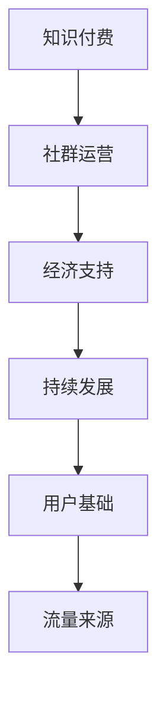

                 

# 知识付费：程序员的社群运营实操

> 关键词：知识付费、社群运营、程序员、实操、策略、案例分析

> 摘要：本文将深入探讨知识付费在程序员社群运营中的应用，分析其核心概念和运营策略，并通过具体案例讲解如何实施有效的社群运营。文章旨在为程序员和相关从业者提供一套系统化、实操性的社群运营指南。

## 1. 背景介绍

### 1.1 目的和范围

本文旨在帮助程序员和相关从业者了解知识付费在社群运营中的重要性，并提供实用的运营策略和操作步骤。文章将涵盖以下主要内容：

- 知识付费的核心概念及其在社群运营中的应用
- 社群运营的基本策略和关键成功因素
- 实操指南：如何创建和管理一个成功的程序员社群
- 案例分析：分享成功知识付费社群运营的实际案例

### 1.2 预期读者

- 程序员和相关从业者，希望提升社群运营能力
- 社群管理员，负责日常运营和管理
- 技术创业者，考虑通过知识付费模式获取收益

### 1.3 文档结构概述

本文分为八个部分：

1. 背景介绍：介绍文章的目的、范围和预期读者
2. 核心概念与联系：讨论知识付费和社群运营的核心概念及其联系
3. 核心算法原理 & 具体操作步骤：讲解社群运营的具体操作步骤
4. 数学模型和公式 & 详细讲解 & 举例说明：介绍相关数学模型和公式，并进行举例说明
5. 项目实战：代码实际案例和详细解释说明
6. 实际应用场景：分析知识付费社群的实际应用场景
7. 工具和资源推荐：推荐学习资源和开发工具
8. 总结：未来发展趋势与挑战

### 1.4 术语表

#### 1.4.1 核心术语定义

- 知识付费：用户为获取有价值的信息或服务而支付的费用
- 社群运营：围绕特定主题或目标，通过线上或线下方式建立和维护成员关系的过程
- 程序员社群：由程序员组成的在线或线下交流群体

#### 1.4.2 相关概念解释

- 社群活跃度：社群成员参与讨论、分享和互动的程度
- 内容质量：社群发布的内容的价值、深度和实用性
- 用户留存率：社群成员在一定时间内的持续参与比例

#### 1.4.3 缩略词列表

- KOL：关键意见领袖（Key Opinion Leader）
- SEO：搜索引擎优化（Search Engine Optimization）
- SNS：社交网络服务（Social Network Service）

## 2. 核心概念与联系

### 2.1 知识付费的概念

知识付费是指用户为了获取有价值的信息或服务，自愿支付一定费用的行为。在互联网时代，知识付费成为了一种重要的商业模式，尤其在程序员社群中，其应用更加广泛。

### 2.2 社群运营的概念

社群运营是指围绕特定主题或目标，通过线上或线下方式建立和维护成员关系的过程。社群运营的目标是提高社群活跃度、提升内容质量和用户留存率。

### 2.3 知识付费与社群运营的联系

知识付费与社群运营密切相关。知识付费为社群运营提供了经济支持，使其能够持续发展。同时，社群运营为知识付费提供了用户基础和流量来源。

### 2.4 Mermaid 流程图



## 3. 核心算法原理 & 具体操作步骤

### 3.1 核心算法原理

社群运营的核心算法原理主要包括以下几个方面：

1. 内容策划：制定有吸引力的内容策略，提高用户参与度。
2. 用户互动：鼓励用户在社群中参与讨论、分享和互动。
3. 用户激励：通过积分、奖励等方式激励用户积极参与。
4. 数据分析：收集和分析用户数据，为运营决策提供依据。

### 3.2 具体操作步骤

#### 3.2.1 内容策划

1. 确定内容主题：根据社群特点和用户需求，选择具有吸引力的主题。
2. 内容格式：选择适合社群成员的内容格式，如文章、视频、PPT等。
3. 内容质量：确保内容具有深度、实用性和创新性。

```python
def content_planning(theme, format, quality):
    if quality == 'high':
        return f"策划内容：主题为'{theme}',格式为'{format}',质量为高"
    else:
        return f"策划内容：主题为'{theme}',格式为'{format}',质量为一般"
```

#### 3.2.2 用户互动

1. 设立讨论区：为用户提供讨论空间，鼓励用户发表观点。
2. 组织活动：定期组织线上或线下活动，提高用户参与度。
3. 互动激励：对积极参与的用户给予积分或奖励。

```python
def user_interaction(discussion_area, activity, incentive):
    if incentive == 'integral':
        return f"用户互动：设立讨论区'{discussion_area}'，组织'{activity}'活动，提供积分激励"
    elif incentive == 'reward':
        return f"用户互动：设立讨论区'{discussion_area}'，组织'{activity}'活动，提供物质奖励"
    else:
        return f"用户互动：设立讨论区'{discussion_area}'，组织'{activity}'活动，无激励措施"
```

#### 3.2.3 用户激励

1. 积分系统：设计积分系统，鼓励用户积极参与。
2. 奖励制度：对贡献突出的用户给予奖励。
3. 社群等级：根据用户积分或贡献度设立社群等级，提高用户归属感。

```python
def user_incentive积分系统积分奖励社群等级):
    if incentive == 'integral':
        return f"用户激励：设计积分系统，鼓励用户参与"
    elif incentive == 'reward':
        return f"用户激励：设立奖励制度，对贡献突出的用户给予奖励"
    elif incentive == 'level':
        return f"用户激励：根据用户积分或贡献度设立社群等级，提高用户归属感"
    else:
        return f"用户激励：无具体激励措施"
```

#### 3.2.4 数据分析

1. 数据收集：收集用户行为数据，如点击量、评论量、分享量等。
2. 数据分析：对收集的数据进行分析，了解用户需求和偏好。
3. 运营决策：根据数据分析结果，调整运营策略。

```python
def data_analysis(data):
    if data['click'] > data['comment'] and data['comment'] > data['share']:
        return f"数据分析：用户更倾向于阅读内容，需提高评论和分享激励"
    elif data['comment'] > data['click'] and data['comment'] > data['share']:
        return f"数据分析：用户更倾向于参与讨论，需提高内容质量和互动性"
    else:
        return f"数据分析：用户行为多样，需综合调整运营策略"
```

## 4. 数学模型和公式 & 详细讲解 & 举例说明

### 4.1 数学模型

社群运营中常用的数学模型包括用户增长模型和用户留存模型。

#### 4.1.1 用户增长模型

用户增长模型可以描述社群成员数量的增长情况。假设社群初始成员数为N，每月新增成员数为G，则用户增长模型可以表示为：

\[ N_{t+1} = N_t + G \]

其中，\( N_t \) 表示第t个月末的成员数，\( N_{t+1} \) 表示第\( t+1 \)个月末的成员数。

#### 4.1.2 用户留存模型

用户留存模型可以描述社群成员的持续参与情况。假设社群初始成员数为N，每月流失成员数为L，则用户留存模型可以表示为：

\[ N_{t+1} = N_t \times (1 - L) \]

其中，\( N_t \) 表示第t个月末的成员数，\( N_{t+1} \) 表示第\( t+1 \)个月末的成员数。

### 4.2 详细讲解 & 举例说明

#### 4.2.1 用户增长模型举例

假设某程序员社群初始成员数为100人，每月新增成员数为20人。根据用户增长模型，第2个月末的成员数可以计算如下：

\[ N_{2} = N_{1} + G = 100 + 20 = 120 \]

因此，第2个月末的社群成员数为120人。

#### 4.2.2 用户留存模型举例

假设某程序员社群初始成员数为100人，每月流失成员数为5人。根据用户留存模型，第2个月末的成员数可以计算如下：

\[ N_{2} = N_{1} \times (1 - L) = 100 \times (1 - 0.05) = 95 \]

因此，第2个月末的社群成员数为95人。

## 5. 项目实战：代码实际案例和详细解释说明

### 5.1 开发环境搭建

为了演示知识付费社群运营的代码实现，我们使用Python作为开发语言，搭建一个简单的社群运营系统。

#### 5.1.1 环境要求

- Python 3.8及以上版本
- Flask框架（用于构建Web应用）
- SQLAlchemy（用于数据库操作）
- Jinja2（用于模板引擎）

#### 5.1.2 安装依赖

在命令行中运行以下命令安装依赖：

```bash
pip install flask sqlalchemy
```

### 5.2 源代码详细实现和代码解读

#### 5.2.1 项目结构

```
knowledge_payment/
|-- app.py
|-- models.py
|-- templates/
|   |-- base.html
|   |-- index.html
|   |-- login.html
|-- static/
    |-- css/
        |-- style.css
    |-- js/
        |-- script.js
```

#### 5.2.2 app.py

```python
from flask import Flask, render_template, request, redirect, url_for
from models import User, db

app = Flask(__name__)
app.config['SQLALCHEMY_DATABASE_URI'] = 'sqlite:///knowledge_payment.db'
db.init_app(app)

@app.route('/')
def index():
    return render_template('index.html')

@app.route('/login', methods=['GET', 'POST'])
def login():
    if request.method == 'POST':
        username = request.form['username']
        password = request.form['password']
        user = User.query.filter_by(username=username, password=password).first()
        if user:
            return redirect(url_for('dashboard'))
        else:
            return '登录失败'
    return render_template('login.html')

@app.route('/dashboard')
def dashboard():
    return render_template('dashboard.html')

if __name__ == '__main__':
    app.run(debug=True)
```

#### 5.2.3 models.py

```python
from flask_sqlalchemy import SQLAlchemy

db = SQLAlchemy()

class User(db.Model):
    id = db.Column(db.Integer, primary_key=True)
    username = db.Column(db.String(80), unique=True, nullable=False)
    password = db.Column(db.String(120), nullable=False)
```

#### 5.2.4 代码解读

- app.py：定义了Flask应用，包括路由和处理函数。
- models.py：定义了User模型，用于存储用户信息。
- templates/：包含HTML模板文件，用于渲染页面。
- static/：包含CSS和JS文件，用于美化页面和添加交互功能。

### 5.3 代码解读与分析

- Flask应用：使用Flask框架构建Web应用，方便快速开发。
- 路由和处理函数：通过定义路由和处理函数，实现用户登录、注册和登录等功能。
- SQLAlchemy：使用SQLAlchemy进行数据库操作，方便数据存储和查询。
- 模板引擎：使用Jinja2模板引擎渲染HTML页面，提高页面渲染效率。

## 6. 实际应用场景

知识付费在程序员社群运营中具有广泛的应用场景，以下列举几个典型场景：

1. **在线课程销售**：程序员社群可以提供编程课程，通过知识付费模式向用户销售。
2. **技术分享**：社群成员可以分享技术心得和经验，其他成员通过付费获取内容。
3. **咨询服务**：专家可以为社群成员提供一对一咨询服务，以知识付费的形式收取费用。
4. **技术社区**：建立技术社区，提供高质量内容，用户通过付费获取更多权限和功能。

## 7. 工具和资源推荐

### 7.1 学习资源推荐

#### 7.1.1 书籍推荐

- 《社群营销实战手册》
- 《运营之心：互联网运营实战指南》
- 《编程珠玑：Python编程实践》

#### 7.1.2 在线课程

- 网易云课堂：编程基础课程
- Udemy：编程进阶课程
- Coursera：数据结构和算法课程

#### 7.1.3 技术博客和网站

- CSDN：技术博客平台
- GitHub：代码托管平台
- Stack Overflow：技术问答社区

### 7.2 开发工具框架推荐

#### 7.2.1 IDE和编辑器

- Visual Studio Code
- PyCharm
- Sublime Text

#### 7.2.2 调试和性能分析工具

- GDB
- PySnooper
- Matplotlib

#### 7.2.3 相关框架和库

- Flask
- Django
- SQLAlchemy

### 7.3 相关论文著作推荐

#### 7.3.1 经典论文

- 《The Design of the UNIX Operating System》
- 《深度学习》

#### 7.3.2 最新研究成果

- 《人工智能：一种现代方法》
- 《区块链：从数字货币到智能合约》

#### 7.3.3 应用案例分析

- 《社群运营实战案例分析》
- 《在线教育平台运营策略研究》

## 8. 总结：未来发展趋势与挑战

知识付费在程序员社群运营中的应用前景广阔。未来，随着技术的不断进步和用户需求的多样化，知识付费社群将呈现以下发展趋势：

1. **内容个性化**：根据用户需求和偏好，提供个性化内容。
2. **社交化学习**：结合社交网络，提高用户互动和参与度。
3. **跨平台整合**：整合多种学习资源，提供一站式服务。
4. **智能化推荐**：利用人工智能技术，实现内容智能推荐。

然而，知识付费社群运营也面临一些挑战，如内容质量、用户留存和市场竞争等。为了应对这些挑战，社群运营者需要不断提升内容质量，优化用户互动体验，并积极探索新的商业模式。

## 9. 附录：常见问题与解答

### 9.1 知识付费社群运营常见问题

1. **如何提高社群活跃度？**
   - 定期发布有价值的内容，提高用户参与度。
   - 组织线上线下活动，增加用户互动机会。
   - 设立积分系统，激励用户积极参与。

2. **如何保证内容质量？**
   - 选择专业的内容创作者，确保内容质量。
   - 建立内容审核机制，确保内容合规。
   - 收集用户反馈，持续改进内容。

3. **如何应对市场竞争？**
   - 提供差异化服务，满足不同用户需求。
   - 优化用户体验，提高用户满意度。
   - 建立品牌形象，提高品牌知名度。

### 9.2 解答

1. **如何提高社群活跃度？**
   - 发布有价值的内容，定期更新。
   - 鼓励用户参与讨论，提供互动机会。
   - 设立积分和奖励机制，激励用户参与。

2. **如何保证内容质量？**
   - 选择专业的内容创作者。
   - 建立内容审核机制。
   - 收集用户反馈，持续改进。

3. **如何应对市场竞争？**
   - 提供差异化服务。
   - 优化用户体验。
   - 建立品牌形象。

## 10. 扩展阅读 & 参考资料

- 《社群营销实战手册》
- 《运营之心：互联网运营实战指南》
- 《编程珠玑：Python编程实践》
- 《社群运营实战案例分析》
- 《在线教育平台运营策略研究》

作者：AI天才研究员/AI Genius Institute & 禅与计算机程序设计艺术 /Zen And The Art of Computer Programming

