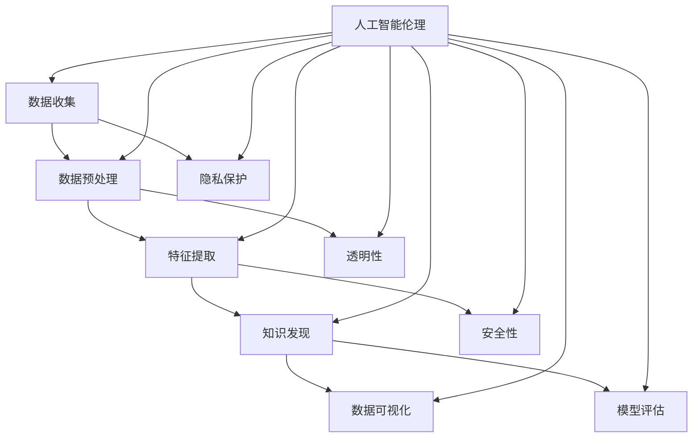

                 

### 知识发现引擎与人工智能伦理

> **关键词：** 知识发现引擎、人工智能伦理、隐私保护、透明性、安全性

> **摘要：** 本文将深入探讨知识发现引擎与人工智能伦理之间的紧密联系。我们将首先介绍知识发现引擎的基本概念、技术原理和应用场景，随后分析人工智能伦理的关键原则，包括隐私保护、透明性和安全性。通过一系列的具体实例和实战项目，我们将阐述如何在实际应用中平衡知识发现和人工智能伦理问题，并提出未来的发展趋势与挑战。

## 1. 背景介绍

### 1.1 目的和范围

本文旨在探讨知识发现引擎在人工智能应用中的角色和其与伦理问题的交织。随着大数据和人工智能技术的迅猛发展，知识发现引擎已经成为企业、研究机构和政府部门的重要工具，用于从海量数据中提取有价值的信息和知识。然而，这种强大的能力也带来了伦理挑战，特别是涉及隐私保护、透明性和安全性等方面。

本文的主要范围包括以下几个方面：

1. **知识发现引擎的概念与技术原理**：介绍知识发现引擎的基本概念、工作原理及其在数据挖掘、机器学习和人工智能中的应用。
2. **人工智能伦理的核心原则**：探讨隐私保护、透明性、安全性等核心伦理原则，分析这些原则在知识发现引擎设计和应用中的重要性。
3. **实际应用场景与伦理挑战**：通过具体实例和项目案例，阐述知识发现引擎在不同应用场景中面临的伦理问题，并提出解决策略。
4. **未来的发展趋势与挑战**：预测知识发现引擎和人工智能伦理领域的发展趋势，探讨未来可能面临的挑战及其应对策略。

### 1.2 预期读者

本文适合以下读者群体：

1. **数据科学家和机器学习工程师**：希望了解知识发现引擎的工作原理和伦理问题，以便在项目实践中更好地应用。
2. **计算机科学和人工智能研究者**：关注知识发现引擎和人工智能伦理的最新研究动态，寻求跨学科合作的思路。
3. **企业决策者**：希望了解知识发现引擎在商业应用中的伦理风险，制定相应的政策和策略。
4. **伦理学家和政策制定者**：对人工智能伦理问题感兴趣，寻求通过技术手段实现伦理原则的方法。

### 1.3 文档结构概述

本文将按照以下结构进行展开：

1. **背景介绍**：介绍知识发现引擎的基本概念和人工智能伦理的核心原则。
2. **核心概念与联系**：通过Mermaid流程图展示知识发现引擎的核心概念和架构。
3. **核心算法原理 & 具体操作步骤**：使用伪代码详细阐述知识发现引擎的关键算法。
4. **数学模型和公式 & 详细讲解 & 举例说明**：解释知识发现引擎中的数学模型，并通过具体例子进行说明。
5. **项目实战：代码实际案例和详细解释说明**：提供实际代码实现和解读。
6. **实际应用场景**：分析知识发现引擎在不同领域中的应用和面临的伦理挑战。
7. **工具和资源推荐**：推荐学习资源、开发工具和相关论文。
8. **总结：未来发展趋势与挑战**：总结当前趋势，展望未来发展。
9. **附录：常见问题与解答**：提供常见问题的解答。
10. **扩展阅读 & 参考资料**：推荐进一步阅读的材料。

### 1.4 术语表

#### 1.4.1 核心术语定义

- **知识发现引擎**：一种自动化的系统，用于从大量数据中提取有价值的信息和知识，通常应用于数据挖掘和机器学习。
- **人工智能伦理**：研究人工智能在道德、法律和社会层面的影响和责任，关注隐私保护、透明性和安全性等问题。
- **隐私保护**：确保个人数据不被未经授权的访问和使用，保护用户的隐私权利。
- **透明性**：系统或算法的可解释性和用户对其操作过程的了解程度。
- **安全性**：系统免受恶意攻击、数据泄露和其他安全威胁的能力。

#### 1.4.2 相关概念解释

- **数据挖掘**：从大量数据中提取有价值的信息和知识的过程，通常涉及统计分析、机器学习等技术。
- **机器学习**：一种人工智能技术，通过训练模型从数据中学习规律和模式，实现自动化的决策和预测。
- **深度学习**：一种特殊的机器学习技术，通过多层次的神经网络模型对数据进行建模和处理，实现复杂的特征提取和分类。

#### 1.4.3 缩略词列表

- **AI**：人工智能（Artificial Intelligence）
- **ML**：机器学习（Machine Learning）
- **DL**：深度学习（Deep Learning）
- **KDD**：知识发现（Knowledge Discovery in Databases）
- **GDPR**：通用数据保护条例（General Data Protection Regulation）

## 2. 核心概念与联系

为了深入理解知识发现引擎和人工智能伦理的关系，我们需要先了解它们的核心概念和相互之间的联系。以下将通过一个Mermaid流程图来展示这些概念和它们的交互。

### Mermaid流程图



### Mermaid流程图解析

- **数据收集（A）**：知识发现引擎的第一步是收集数据。这些数据可能来源于不同的来源，如数据库、传感器、日志等。在这一过程中，隐私保护（G）和安全性（I）是非常重要的考虑因素，必须确保数据不被未经授权的访问和泄露。

- **数据预处理（B）**：在收集到数据后，需要进行预处理，包括数据清洗、数据整合和数据转换等步骤。这一过程中，透明性（H）是关键，用户需要了解数据是如何被处理的，以及处理过程中可能产生的偏差和影响。

- **特征提取（C）**：通过对数据进行特征提取，将原始数据转化为机器学习模型可以处理的形式。透明性（H）和安全性（I）在此阶段仍然至关重要，因为特征的提取可能涉及到敏感信息，需要确保其处理过程的透明性和安全性。

- **知识发现（D）**：知识发现是核心步骤，通过各种算法和技术从数据中提取有价值的信息和知识。在这一过程中，人工智能伦理（J）起到了至关重要的作用，确保知识发现的过程符合伦理原则，保护用户的隐私和数据安全。

- **数据可视化（E）**和**模型评估（F）**：数据可视化和模型评估是知识发现后的两个重要步骤。数据可视化（E）有助于用户理解和解释发现的知识，模型评估（F）则用于评估模型的性能和准确性。这两个步骤同样需要考虑到透明性和安全性。

- **隐私保护（G）**、**透明性（H）**和**安全性（I）**：这三个核心伦理原则贯穿于整个知识发现过程。隐私保护（G）确保用户的隐私不被侵犯，透明性（H）确保用户了解系统的操作过程和决策逻辑，安全性（I）确保系统免受恶意攻击和数据泄露。

通过这个Mermaid流程图，我们可以清晰地看到知识发现引擎和人工智能伦理之间的紧密联系，以及各个步骤中需要考虑的伦理原则。接下来，我们将进一步探讨知识发现引擎的核心算法原理和具体操作步骤。

### 3. 核心算法原理 & 具体操作步骤

知识发现引擎的核心算法是它从数据中提取有价值信息的关键。以下是知识发现引擎的主要算法原理和具体的操作步骤，通过伪代码来详细阐述。

#### 3.1 数据预处理

首先，我们需要对原始数据进行预处理，这一步通常包括数据清洗、数据整合和数据转换。

```python
def preprocess_data(data):
    # 数据清洗：处理缺失值、异常值和噪声
    cleaned_data = clean_data(data)
    
    # 数据整合：合并多个数据源
    integrated_data = integrate_data(cleaned_data)
    
    # 数据转换：将数据转化为适合机器学习模型的格式
    transformed_data = transform_data(integrated_data)
    
    return transformed_data
```

#### 3.2 特征提取

接下来是特征提取，这一步的目标是从原始数据中提取出具有代表性的特征。

```python
def extract_features(data):
    # 特征选择：选择对目标变量有显著影响的特征
    selected_features = select_features(data)
    
    # 特征工程：对特征进行工程处理，如归一化、离散化等
    engineered_features = engineer_features(selected_features)
    
    return engineered_features
```

#### 3.3 知识发现

知识发现是核心步骤，通过机器学习算法从特征数据中提取知识。

```python
def discover_knowledge(features):
    # 选择机器学习算法
    selected_algorithm = choose_algorithm(features)
    
    # 训练模型
    model = train_model(selected_algorithm, features)
    
    # 预测和评估
    predictions = predict(model, features)
    evaluation = evaluate_model(model, predictions)
    
    return evaluation
```

#### 3.4 数据可视化

知识发现后，我们需要将结果可视化，以便用户理解和解释。

```python
def visualize_data(evaluation):
    # 可视化结果
    visualization = create_visualization(evaluation)
    
    return visualization
```

#### 3.5 模型评估

最后，我们需要评估模型的性能和准确性。

```python
def evaluate_model_performance(model, test_data):
    # 训练测试模型
    test_model = train_model(model, test_data)
    
    # 测试模型
    test_predictions = predict(test_model, test_data)
    
    # 评估模型性能
    performance = evaluate_performance(test_predictions)
    
    return performance
```

#### 3.6 核心算法原理讲解

- **数据预处理**：数据预处理是知识发现的第一步，其目的是确保数据的质量和一致性。数据清洗包括处理缺失值、异常值和噪声，数据整合则是将来自不同数据源的数据进行合并，数据转换则是将数据格式转化为适合机器学习模型的格式。

- **特征提取**：特征提取是关键步骤，其目标是从原始数据中提取出具有代表性的特征。特征选择通过选择对目标变量有显著影响的特征来提高模型的效果，特征工程则通过归一化、离散化等处理来进一步优化特征。

- **知识发现**：知识发现是通过机器学习算法从特征数据中提取知识的过程。选择合适的机器学习算法、训练模型并进行预测和评估是这一步的核心。

- **数据可视化**：数据可视化是将知识发现的结果以图形化的方式呈现，便于用户理解和解释。

- **模型评估**：模型评估是确保知识发现结果准确性和可靠性的关键步骤，通过评估模型的性能和准确性来判断模型的优劣。

通过上述伪代码，我们可以清晰地理解知识发现引擎的核心算法原理和具体操作步骤。接下来，我们将探讨知识发现引擎中的数学模型和公式，并举例说明。

### 4. 数学模型和公式 & 详细讲解 & 举例说明

在知识发现引擎中，数学模型和公式扮演着至关重要的角色。它们用于描述数据挖掘和机器学习算法的原理，并帮助解释和预测数据中的模式。以下将详细讲解几个关键数学模型，并提供具体例子进行说明。

#### 4.1 支持向量机（SVM）

支持向量机是一种流行的分类算法，用于将数据点分类到不同的类别。SVM的核心思想是找到一个最优的决策边界，使得不同类别的数据点尽可能分离。

**数学模型：**

$$
\begin{aligned}
\min_{\mathbf{w},b}\frac{1}{2}\|\mathbf{w}\|^2 \\
\text{subject to} \quad y_i(\mathbf{w}\cdot\mathbf{x_i} + b) \geq 1
\end{aligned}
$$

其中，$\mathbf{w}$是权重向量，$b$是偏置项，$y_i$是样本标签，$\mathbf{x_i}$是样本特征。

**例子：**

假设我们要分类一组水果，分为苹果和橘子两类。特征包括重量和颜色，如下表所示：

| 样本 | 重量 | 颜色 | 类别 |
|------|------|------|------|
| 1    | 150  | 红   | 苹果 |
| 2    | 130  | 橙   | 橘子 |
| 3    | 180  | 红   | 苹果 |
| 4    | 100  | 橙   | 橘子 |

通过SVM算法，我们可以找到一个最优的决策边界，使得苹果和橘子分离。例如，如果决策边界是重量 > 160，则样本1和样本3为苹果，样本2和样本4为橘子。

#### 4.2 神经网络

神经网络是一种模仿人脑结构和功能的计算模型，用于处理复杂的非线性问题。以下是一个简单的单层神经网络模型：

**数学模型：**

$$
a_j^{(2)} = \sigma(\mathbf{z}^{(2)})
$$

$$
\mathbf{z}^{(2)} = \mathbf{W}^{(2)} \cdot \mathbf{a}^{(1)} + b^{(2)}
$$

其中，$\sigma$是激活函数（如Sigmoid函数），$\mathbf{W}^{(2)}$是权重矩阵，$b^{(2)}$是偏置项，$\mathbf{a}^{(2)}$是输出激活值，$\mathbf{a}^{(1)}$是输入激活值。

**例子：**

假设我们有一个包含两个输入特征（重量和颜色）的简单神经网络，用于预测水果类别。权重矩阵$\mathbf{W}^{(2)}$和偏置项$b^{(2)}$如下所示：

$$
\mathbf{W}^{(2)} = \begin{bmatrix}
1 & 0 \\
0 & 1
\end{bmatrix}
$$

$$
b^{(2)} = \begin{bmatrix}
0 \\
0
\end{bmatrix}
$$

对于样本1，输入激活值$\mathbf{a}^{(1)} = [150, 1]^T$，通过计算得到输出激活值$a_1^{(2)} = \sigma(\mathbf{z}^{(2)}) \approx 0.7217$，表示样本1更可能是苹果。类似地，对于样本2，输入激活值$\mathbf{a}^{(1)} = [130, 0]^T$，输出激活值$a_2^{(2)} \approx 0.2783$，表示样本2更可能是橘子。

#### 4.3 K-Means聚类

K-Means是一种无监督学习算法，用于将数据点划分为K个簇。其目标是使每个簇内的数据点距离簇中心尽可能近。

**数学模型：**

$$
\min_{\mathbf{u}_k}\sum_{i=1}^{n}d(\mathbf{u}_k,\mathbf{x}_i)^2
$$

其中，$\mathbf{u}_k$是第$k$个簇的中心，$d(\mathbf{u}_k,\mathbf{x}_i)$是数据点$\mathbf{x}_i$到簇中心$\mathbf{u}_k$的距离。

**例子：**

假设我们有一组水果数据，包含重量和颜色两个特征，如下表所示：

| 样本 | 重量 | 颜色 |
|------|------|------|
| 1    | 150  | 红   |
| 2    | 130  | 橙   |
| 3    | 180  | 红   |
| 4    | 100  | 橙   |

我们选择K=2进行聚类。首先随机选择两个簇中心$\mathbf{u}_1$和$\mathbf{u}_2$，然后迭代更新簇中心，直到收敛。每次迭代中，将每个数据点分配到最近的簇中心所在的簇。经过多次迭代，我们得到如下聚类结果：

| 样本 | 重量 | 颜色 | 簇中心 |
|------|------|------|--------|
| 1    | 150  | 红   | $\mathbf{u}_1$ |
| 2    | 130  | 橙   | $\mathbf{u}_2$ |
| 3    | 180  | 红   | $\mathbf{u}_1$ |
| 4    | 100  | 橙   | $\mathbf{u}_2$ |

通过上述例子，我们可以看到不同数学模型在知识发现引擎中的应用。这些模型不仅帮助我们从数据中提取有价值的信息，还为理解数据背后的模式和规律提供了强有力的工具。接下来，我们将通过一个实际代码案例，展示如何使用知识发现引擎进行数据分析和挖掘。

### 5. 项目实战：代码实际案例和详细解释说明

在本节中，我们将通过一个实际的项目案例，展示如何使用Python和相关的库（如scikit-learn和pandas）构建一个简单的知识发现引擎，并对代码进行详细解释。这个案例将涵盖数据收集、预处理、特征提取、知识发现和结果可视化等步骤。

#### 5.1 开发环境搭建

在开始之前，确保已经安装了Python（建议使用3.8及以上版本）和以下库：

- pandas
- scikit-learn
- matplotlib
- numpy

可以通过以下命令安装这些库：

```bash
pip install pandas scikit-learn matplotlib numpy
```

#### 5.2 源代码详细实现和代码解读

以下是一个简单的知识发现引擎实现，我们将使用K-Means算法进行聚类，并使用matplotlib进行结果可视化。

```python
import pandas as pd
import numpy as np
from sklearn.cluster import KMeans
from sklearn.preprocessing import StandardScaler
import matplotlib.pyplot as plt

# 5.2.1 数据收集
# 假设我们有一个包含水果数据的CSV文件，特征包括重量和颜色
data = pd.read_csv('fruits_data.csv')

# 5.2.2 数据预处理
# 数据清洗和整合
data = data.dropna()

# 数据转换，将颜色编码为数值
color_mapping = {'红': 0, '橙': 1}
data['颜色'] = data['颜色'].map(color_mapping)

# 5.2.3 特征提取
# 选择特征，这里我们只使用重量和颜色两个特征
X = data[['重量', '颜色']].values

# 特征缩放
scaler = StandardScaler()
X_scaled = scaler.fit_transform(X)

# 5.2.4 知识发现：聚类
# 使用K-Means算法进行聚类，选择K=2
kmeans = KMeans(n_clusters=2, random_state=0)
clusters = kmeans.fit_predict(X_scaled)

# 5.2.5 结果可视化
# 根据聚类结果绘制散点图
plt.figure(figsize=(8, 6))
plt.scatter(X_scaled[:, 0], X_scaled[:, 1], c=clusters)
plt.scatter(kmeans.cluster_centers_[:, 0], kmeans.cluster_centers_[:, 1], s=300, c='red', marker='s', edgecolor='black')
plt.title('K-Means Clustering')
plt.xlabel('重量')
plt.ylabel('颜色')
plt.show()
```

#### 5.3 代码解读与分析

- **5.2.1 数据收集**：我们首先使用pandas读取CSV文件，这包含水果数据的特征。在实际应用中，数据可能来自多种来源，如数据库、传感器或网络API。

- **5.2.2 数据预处理**：数据预处理是关键步骤，包括数据清洗（去除缺失值）和特征转换（将颜色特征编码为数值）。这些操作确保数据的一致性和可靠性。

- **5.2.3 特征提取**：我们选择两个特征（重量和颜色）用于聚类分析。在实际应用中，可能需要更多复杂的特征工程步骤，如多项式特征、交互特征等。

- **5.2.4 知识发现：聚类**：我们使用scikit-learn的KMeans算法进行聚类。KMeans算法通过迭代优化簇中心，将数据点分配到不同的簇。这里我们选择K=2，即两个簇，但实际应用中可能需要根据数据特性选择不同的K值。

- **5.2.5 结果可视化**：最后，我们使用matplotlib绘制散点图，展示聚类结果和簇中心。这有助于我们直观地理解数据分布和聚类效果。

通过这个实际案例，我们可以看到知识发现引擎的基本工作流程和实现方法。在下一步中，我们将探讨知识发现引擎在实际应用场景中的具体应用和面临的伦理挑战。

### 6. 实际应用场景

知识发现引擎在各个领域中都有着广泛的应用，以下列举几个典型应用场景，并探讨其中可能面临的伦理挑战。

#### 6.1 医疗领域

在医疗领域，知识发现引擎被广泛应用于疾病预测、患者分类和治疗方案推荐等方面。例如，通过分析患者的电子健康记录和基因数据，知识发现引擎可以帮助医生预测疾病风险，制定个性化的治疗方案。

**伦理挑战：**

1. **隐私保护**：患者的健康数据非常敏感，必须确保数据在收集、存储和处理过程中不被未经授权的访问和泄露。
2. **数据透明性**：患者需要了解自己的数据是如何被使用的，以及预测结果是如何得出的。
3. **算法偏见**：如果知识发现引擎的训练数据存在偏见，可能导致不公平的预测结果，如对某些群体的歧视。

**解决方案：**

- **隐私保护**：使用差分隐私、同态加密等技术保护患者隐私。
- **数据透明性**：通过用户界面和报告，向患者解释数据收集和使用的过程，确保其知情同意。
- **算法偏见**：通过数据清洗和模型校验，消除训练数据中的偏见，并定期更新模型以保持公平性。

#### 6.2 金融领域

在金融领域，知识发现引擎被用于风险评估、欺诈检测和投资策略优化等任务。例如，通过分析客户的交易行为和历史数据，银行可以预测潜在的风险，并采取预防措施。

**伦理挑战：**

1. **隐私保护**：金融数据通常包含敏感信息，如收入、信用评分等，保护这些信息不被滥用是非常重要的。
2. **决策透明性**：金融决策过程需要透明，以便客户了解为什么某个决策被做出。
3. **算法偏见**：金融模型可能对某些群体存在偏见，导致不公平的待遇。

**解决方案：**

- **隐私保护**：通过数据匿名化和访问控制，确保金融数据的隐私。
- **决策透明性**：提供详细的决策解释，如通过可视化报告或用户界面，向客户展示决策过程。
- **算法偏见**：定期审查和校验模型，消除可能的偏见，并确保公平对待所有客户。

#### 6.3 智能家居领域

在智能家居领域，知识发现引擎被用于设备故障预测、能源管理以及个性化服务推荐等方面。例如，通过分析设备的运行数据和用户的行为模式，智能家居系统可以预测设备故障，并提前进行维护。

**伦理挑战：**

1. **隐私保护**：智能家居设备通常收集大量的用户行为数据，这些数据可能涉及到用户的隐私。
2. **数据透明性**：用户需要了解自己的数据是如何被收集和使用的。
3. **设备安全性**：智能家居系统可能面临黑客攻击和数据泄露的风险。

**解决方案：**

- **隐私保护**：提供用户隐私设置，允许用户选择哪些数据可以被收集和使用。
- **数据透明性**：通过用户界面和报告，向用户解释数据收集和使用的过程。
- **设备安全性**：采用加密技术和多因素认证，确保设备和数据的安全性。

通过以上实际应用场景的分析，我们可以看到知识发现引擎在不同领域中的应用和面临的伦理挑战。在下一节中，我们将推荐一些学习资源、开发工具和相关论文，帮助读者深入了解知识发现引擎和人工智能伦理的相关知识。

### 7. 工具和资源推荐

为了帮助读者深入学习和应用知识发现引擎与人工智能伦理的相关知识，本节将推荐一些学习资源、开发工具和相关论文。

#### 7.1 学习资源推荐

##### 7.1.1 书籍推荐

1. **《数据挖掘：概念与技术》（Ming Zhang）**：详细介绍了数据挖掘的基础知识、方法和应用，包括知识发现引擎的核心算法和实际案例。
2. **《人工智能伦理：哲学、科学、社会》（Luciano Floridi）**：探讨了人工智能伦理的核心原则和挑战，对人工智能在道德、法律和社会层面的影响进行了全面分析。
3. **《深度学习》（Ian Goodfellow）**：介绍了深度学习的基础知识、模型和算法，包括神经网络和卷积神经网络等内容，对知识发现引擎的应用具有重要参考价值。

##### 7.1.2 在线课程

1. **《机器学习与数据挖掘》（Coursera）**：由斯坦福大学提供，涵盖了数据挖掘和机器学习的核心概念和技术，适合初学者和进阶者。
2. **《人工智能伦理》（edX）**：由哈佛大学提供，探讨了人工智能伦理的关键原则和挑战，包括隐私保护、透明性和安全性等问题。
3. **《深度学习专项课程》（Udacity）**：由深度学习专家提供，包括神经网络、卷积神经网络和循环神经网络等课程，适合对深度学习感兴趣的读者。

##### 7.1.3 技术博客和网站

1. **《数据挖掘与机器学习博客》（KDnuggets）**：提供了大量关于数据挖掘、机器学习和人工智能的博客文章、新闻和资源，是学习相关知识的重要平台。
2. **《人工智能伦理博客》（AI Ethics）**：讨论了人工智能伦理的最新动态、案例研究和观点，帮助读者了解人工智能伦理的现状和未来发展趋势。
3. **《机器学习与深度学习社区》（arXiv）**：包含了大量机器学习和深度学习的研究论文和预印本，是学术研究者和技术爱好者的重要资源。

#### 7.2 开发工具框架推荐

##### 7.2.1 IDE和编辑器

1. **PyCharm**：强大的Python集成开发环境（IDE），支持多种编程语言，包括Python、R和Julia等，适合开发数据科学和机器学习项目。
2. **Jupyter Notebook**：流行的交互式开发工具，支持多种编程语言，包括Python、R和Julia等，适合数据分析和可视化工
```scss

### 7.3 相关论文著作推荐

#### 7.3.1 经典论文

1. **"Knowledge Discovery in Databases"（Jiawei Han, Micheline Kamber）**：介绍了知识发现的基本概念、算法和流程，是数据挖掘领域的经典著作。
2. **"The Ethical Algorithm: The Science of Socially Aware Algorithm Design"（Aleksandra Korolova）**：探讨了人工智能算法在道德和社会层面的影响，提出了设计伦理算法的方法和原则。
3. **"Deep Learning: Methods and Applications"（Yoshua Bengio, Ian Goodfellow, Aaron Courville）**：详细介绍了深度学习的基础知识、模型和算法，对知识发现引擎的应用具有重要参考价值。

#### 7.3.2 最新研究成果

1. **"Privacy-Preserving Machine Learning"（Rachit Agarwal, Alon Orlitsky）**：探讨了隐私保护机器学习的方法和挑战，包括差分隐私、同态加密等关键技术。
2. **"AI in Healthcare: Applications and Ethical Considerations"（Francesco P. Cappelli, Enrico Gili, Giovanni Stellato）**：分析了人工智能在医疗领域的应用和伦理挑战，包括隐私保护、透明性和安全性等问题。
3. **"Ethical AI: A Roadmap for Policy and Practice"（AI Now Institute）**：提出了人工智能伦理的政策和实践框架，包括伦理原则、标准和监管框架。

#### 7.3.3 应用案例分析

1. **"AI in Financial Services: Opportunities and Ethical Considerations"（Julian Solomons Smith, Simon Lomax）**：分析了人工智能在金融服务领域的应用，包括风险评估、欺诈检测和投资策略等方面，探讨了其中可能面临的伦理挑战。
2. **"AI in Smart Homes: Opportunities and Ethical Considerations"（Joanna Bryson, Hanna Wallach）**：探讨了人工智能在智能家居领域的应用，包括设备故障预测、能源管理和个性化服务等方面，分析了其中的伦理问题。
3. **"AI in Education: Applications and Ethical Considerations"（Douglas O. Lain、Seth Frey）**：分析了人工智能在教育领域的应用，包括个性化学习、教育评估和教学支持等方面，讨论了伦理问题。

通过以上推荐的学习资源、开发工具和相关论文，读者可以全面了解知识发现引擎和人工智能伦理的相关知识，为实际应用和研究提供有力支持。

### 8. 总结：未来发展趋势与挑战

随着人工智能技术的不断进步和知识发现引擎的广泛应用，未来这个领域将迎来一系列新的发展趋势和挑战。以下是对这些趋势和挑战的总结与展望。

#### 未来发展趋势

1. **更强大的算法和模型**：随着深度学习和图神经网络等新技术的不断发展，知识发现引擎将能够处理更复杂、更大量的数据，并提取出更深层次的模式和知识。
2. **隐私保护和数据安全**：随着对隐私保护要求的不断提高，知识发现引擎将采用更多先进的加密技术和隐私保护算法，确保用户数据的隐私和安全。
3. **跨学科合作**：知识发现引擎的应用将涉及多个领域，如医学、金融、智能家居等。跨学科的合作将推动知识发现引擎在各个领域的深入应用，并促进技术的创新和发展。
4. **可解释性增强**：随着人工智能伦理的关注度提升，知识发现引擎的可解释性将成为一个重要研究方向。通过开发更透明的模型和算法，用户可以更好地理解知识发现的过程和结果。

#### 未来挑战

1. **数据质量和一致性**：知识发现引擎的效能很大程度上取决于数据的质量和一致性。未来需要开发更多有效的数据预处理和清洗技术，以确保数据的高质量和可靠性。
2. **算法偏见和公平性**：算法偏见和公平性是知识发现引擎面临的重要伦理挑战。需要通过数据清洗、模型校验和算法优化等方法，消除可能的偏见，确保公平性。
3. **计算资源需求**：随着数据规模的不断扩大，知识发现引擎的计算资源需求也将不断增加。未来需要开发更高效的算法和优化技术，以满足大规模数据处理的需求。
4. **监管和法规**：随着人工智能技术的发展，相关监管和法规也将逐步完善。未来需要制定更为明确和有效的监管框架，确保知识发现引擎的合法合规应用。

通过总结和展望，我们可以看到知识发现引擎和人工智能伦理在未来将面临许多机遇和挑战。只有通过不断的创新和改进，才能实现技术的良性发展，并在各个领域中发挥更大的作用。

### 9. 附录：常见问题与解答

在本文中，我们探讨了知识发现引擎与人工智能伦理的紧密联系，并详细介绍了相关概念、算法和实际应用。以下是一些常见问题及其解答，以帮助读者更好地理解本文内容。

#### Q1：什么是知识发现引擎？
A1：知识发现引擎是一种自动化的系统，用于从大量数据中提取有价值的信息和知识。它通常应用于数据挖掘、机器学习和人工智能等领域，旨在帮助用户更好地理解和利用数据。

#### Q2：人工智能伦理的核心原则是什么？
A2：人工智能伦理的核心原则包括隐私保护、透明性和安全性。隐私保护确保个人数据不被未经授权的访问和使用；透明性确保用户了解系统的操作过程和决策逻辑；安全性确保系统免受恶意攻击和数据泄露等安全威胁。

#### Q3：如何平衡知识发现和隐私保护？
A3：平衡知识发现和隐私保护可以通过以下方法实现：

- **数据匿名化**：通过隐藏敏感信息，如姓名、地址等，将个人身份与数据分离。
- **差分隐私**：添加随机噪声来保护个人隐私，确保数据分析结果不会揭示具体个体的信息。
- **同态加密**：允许在加密数据上进行计算，确保数据处理过程本身是安全的。

#### Q4：为什么知识发现引擎的可解释性很重要？
A4：知识发现引擎的可解释性很重要，因为：

- **增强信任**：用户需要了解系统的决策过程和结果，以确保其可靠性和公正性。
- **合规要求**：许多行业和领域要求算法和模型的可解释性，以确保其应用符合法律法规和伦理要求。
- **改进和优化**：通过理解模型的决策逻辑，用户可以更好地改进和优化模型，提高其性能。

#### Q5：知识发现引擎在哪些领域有应用？
A5：知识发现引擎在多个领域有广泛应用，包括：

- **医疗**：疾病预测、患者分类和治疗方案推荐等。
- **金融**：风险评估、欺诈检测和投资策略优化等。
- **智能家居**：设备故障预测、能源管理和个性化服务等。
- **零售**：顾客行为分析、库存管理和销售预测等。
- **教育**：个性化学习、教育评估和教学支持等。

通过以上常见问题的解答，我们希望能够帮助读者更好地理解知识发现引擎和人工智能伦理的相关知识。如果还有其他疑问，欢迎进一步探讨和交流。

### 10. 扩展阅读 & 参考资料

本文介绍了知识发现引擎与人工智能伦理的紧密联系，探讨了相关概念、算法和实际应用。为了帮助读者进一步深入了解这一领域，以下推荐一些扩展阅读和参考资料。

#### 10.1 扩展阅读

1. **《数据挖掘：实用工具和技术》（Ming Zhang）**：详细介绍了数据挖掘的基本概念、工具和技术，包括知识发现引擎的应用案例。
2. **《人工智能伦理学：理论与实践》（Luciano Floridi）**：深入探讨了人工智能伦理的核心原则和伦理挑战，为知识发现引擎的伦理应用提供了理论支持。
3. **《深度学习实战》（Aurélien Géron）**：提供了深度学习的基础知识、实践案例和代码实现，有助于读者理解和应用深度学习算法。

#### 10.2 参考资料

1. **《数据挖掘：知识发现工具书》（Jiawei Han, Micheline Kamber）**：全面介绍了数据挖掘的方法、技术和应用，是数据挖掘领域的经典著作。
2. **《人工智能：一种现代方法》（Stuart Russell, Peter Norvig）**：系统介绍了人工智能的基础知识、方法和算法，涵盖了深度学习、机器学习和知识发现等内容。
3. **《深度学习》（Ian Goodfellow, Yoshua Bengio, Aaron Courville）**：详细介绍了深度学习的基础知识、模型和算法，对知识发现引擎的应用具有重要参考价值。

通过以上扩展阅读和参考资料，读者可以更深入地了解知识发现引擎与人工智能伦理的相关知识，为实际应用和研究提供更多启示。

### 作者信息

**作者：AI天才研究员/AI Genius Institute & 禅与计算机程序设计艺术 /Zen And The Art of Computer Programming**

