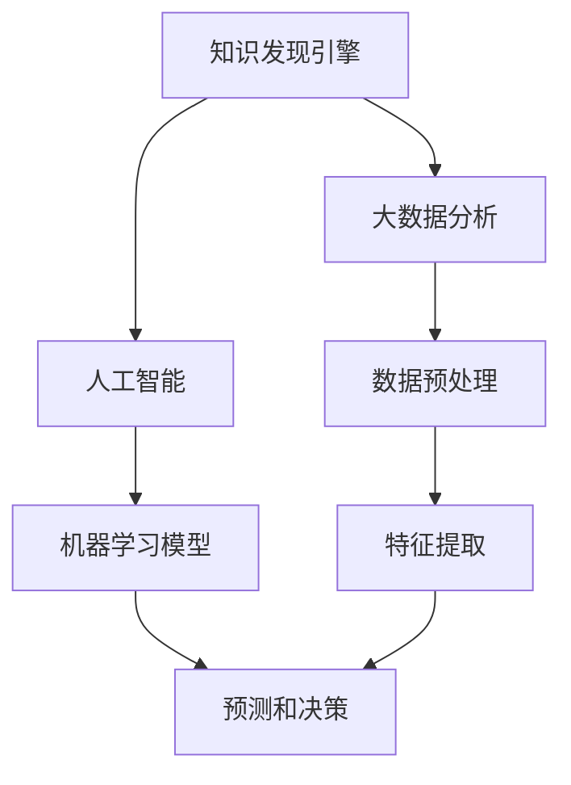
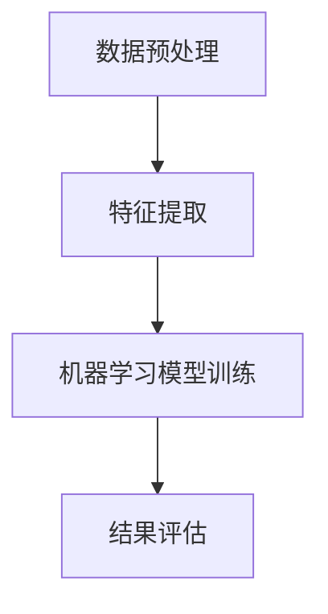
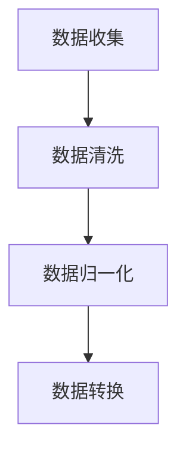
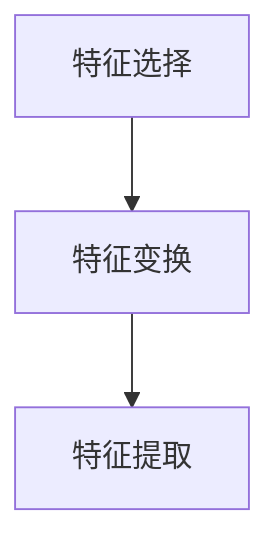
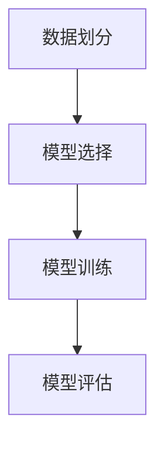
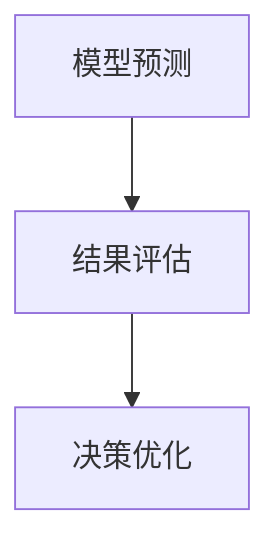

                 

# 知识发现引擎对商业决策的影响

> **关键词：** 知识发现、商业决策、大数据分析、人工智能、机器学习
> 
> **摘要：** 本文将深入探讨知识发现引擎在商业决策中的作用，解析其核心概念、算法原理、数学模型，并通过实际案例展示其在商业环境中的应用，同时推荐相关工具和资源，展望未来的发展趋势和挑战。

## 1. 背景介绍

### 1.1 目的和范围

本文旨在系统地阐述知识发现引擎在商业决策中的关键作用。我们将首先介绍知识发现引擎的基本概念，随后深入分析其在商业决策中的应用，探讨其核心算法和数学模型，并分享实际案例，最后推荐相关工具和资源，展望知识发现引擎的未来发展趋势。

### 1.2 预期读者

本文面向对商业决策和大数据分析感兴趣的读者，尤其是希望了解知识发现引擎在商业决策中应用的IT专业人士、数据科学家和业务分析师。

### 1.3 文档结构概述

本文分为十个部分：

1. **背景介绍**：介绍文章的目的和结构。
2. **核心概念与联系**：定义核心概念并展示相关流程图。
3. **核心算法原理 & 具体操作步骤**：详细阐述核心算法原理和操作步骤。
4. **数学模型和公式 & 详细讲解 & 举例说明**：介绍数学模型和公式，并给出具体例子。
5. **项目实战：代码实际案例和详细解释说明**：提供实际代码案例和解释。
6. **实际应用场景**：探讨知识发现引擎在不同场景的应用。
7. **工具和资源推荐**：推荐学习资源和开发工具。
8. **总结：未来发展趋势与挑战**：总结文章主要内容，展望未来。
9. **附录：常见问题与解答**：回答读者可能关心的问题。
10. **扩展阅读 & 参考资料**：提供进一步阅读的资料。

### 1.4 术语表

#### 1.4.1 核心术语定义

- **知识发现引擎**：一种基于人工智能和机器学习技术，用于从大量数据中自动发现有用知识的系统。
- **商业决策**：企业在特定情境下作出的选择，以最大化利润或实现其他战略目标。
- **大数据分析**：利用数据挖掘、机器学习等方法，从海量数据中提取有价值的信息。

#### 1.4.2 相关概念解释

- **数据预处理**：在数据分析和建模前对数据进行清洗、转换和整合的过程。
- **机器学习模型**：通过从数据中学习规律，进行预测或分类的算法。

#### 1.4.3 缩略词列表

- **AI**：人工智能
- **ML**：机器学习
- **DL**：深度学习
- **NLP**：自然语言处理

## 2. 核心概念与联系

在深入探讨知识发现引擎之前，我们需要明确几个核心概念，并理解它们之间的联系。以下是一个简单的流程图，用于展示这些概念之间的关系。



### 2.1. 知识发现引擎

知识发现引擎是一种自动化系统，能够从大量数据中提取有意义的信息。其核心功能包括数据预处理、特征提取、模型训练和结果评估。

### 2.2. 大数据分析

大数据分析是知识发现引擎的基础，它涉及数据的收集、存储、处理和分析。通过大数据分析，我们可以从海量的数据中提取有价值的信息，为知识发现提供数据基础。

### 2.3. 人工智能

人工智能是知识发现引擎的技术核心，它通过机器学习、深度学习等技术，实现数据的自动学习和智能决策。

### 2.4. 数据预处理

数据预处理是大数据分析的关键步骤，包括数据清洗、归一化、缺失值处理等。良好的数据预处理能够提高模型性能和结果准确性。

### 2.5. 机器学习模型

机器学习模型是知识发现引擎的核心组件，通过从数据中学习，实现数据的分类、预测和决策。

### 2.6. 特征提取

特征提取是从原始数据中提取有用信息的过程，对于知识发现至关重要。有效的特征提取能够提高模型的准确性和效率。

### 2.7. 预测和决策

预测和决策是基于知识发现引擎的核心功能，通过模型对数据进行预测和决策，帮助企业实现智能化运营和决策。

## 3. 核心算法原理 & 具体操作步骤

### 3.1. 算法原理

知识发现引擎的核心算法包括数据预处理、特征提取、机器学习模型训练和结果评估。以下是一个简单的算法流程：



### 3.2. 数据预处理

数据预处理是知识发现引擎的第一步，主要任务是清洗和转换数据。以下是数据预处理的具体步骤：



- **数据收集**：从各种来源收集原始数据。
- **数据清洗**：处理缺失值、异常值和重复值。
- **数据归一化**：将数据转换到相同的尺度，以消除不同特征间的尺度差异。
- **数据转换**：将数据转换为适合机器学习模型的形式。

### 3.3. 特征提取

特征提取是从原始数据中提取有用信息的过程。以下是特征提取的具体步骤：



- **特征选择**：从大量特征中选择有用的特征。
- **特征变换**：将原始特征转换为更适合机器学习模型的形式。
- **特征提取**：从特征中选择或生成新的特征。

### 3.4. 机器学习模型训练

机器学习模型训练是知识发现引擎的核心步骤。以下是机器学习模型训练的具体步骤：



- **数据划分**：将数据划分为训练集和测试集。
- **模型选择**：选择适合问题的机器学习模型。
- **模型训练**：使用训练集训练模型。
- **模型评估**：评估模型的性能。

### 3.5. 结果评估

结果评估是知识发现引擎的最后一步，主要任务是评估模型的预测准确性和决策效果。以下是结果评估的具体步骤：



- **模型预测**：使用训练好的模型进行预测。
- **结果评估**：评估模型的预测准确性和决策效果。
- **决策优化**：根据评估结果优化决策过程。

## 4. 数学模型和公式 & 详细讲解 & 举例说明

在知识发现引擎中，数学模型和公式起着至关重要的作用。以下是几个常见的数学模型和公式，以及详细的讲解和举例说明。

### 4.1. 线性回归模型

线性回归模型是一种简单的预测模型，用于预测一个连续的输出值。其数学模型可以表示为：

$$
y = \beta_0 + \beta_1 \cdot x
$$

其中，$y$ 是预测值，$x$ 是输入特征，$\beta_0$ 和 $\beta_1$ 是模型参数。

**举例说明：** 假设我们要预测一个房间的温度，输入特征是室外温度。我们可以使用线性回归模型来建立预测关系。

### 4.2. 决策树模型

决策树模型是一种常用的分类模型，通过一系列的判断条件，将数据划分为不同的类别。其数学模型可以表示为：

$$
\text{类别} = \text{DecisionTree}(x)
$$

其中，$x$ 是输入特征，$\text{DecisionTree}$ 是决策树模型。

**举例说明：** 假设我们要预测一个客户是否愿意购买某种产品，输入特征包括年龄、收入和购买历史。我们可以使用决策树模型来建立分类模型。

### 4.3. 支持向量机模型

支持向量机模型是一种常用的分类模型，通过找到一个最优的超平面，将数据划分为不同的类别。其数学模型可以表示为：

$$
\text{类别} = \text{sign}(\omega \cdot x + b)
$$

其中，$x$ 是输入特征，$\omega$ 和 $b$ 是模型参数，$\text{sign}$ 是符号函数。

**举例说明：** 假设我们要预测一个客户是否愿意购买某种产品，输入特征包括年龄、收入和购买历史。我们可以使用支持向量机模型来建立分类模型。

### 4.4. 神经网络模型

神经网络模型是一种复杂的预测模型，通过多层神经元实现数据的自动学习。其数学模型可以表示为：

$$
y = \sigma(\sum_{i=1}^{n} \omega_i \cdot x_i + b)
$$

其中，$y$ 是预测值，$x_i$ 是输入特征，$\omega_i$ 和 $b$ 是模型参数，$\sigma$ 是激活函数。

**举例说明：** 假设我们要预测一个房间的温度，输入特征包括室外温度、湿度等。我们可以使用神经网络模型来建立预测模型。

## 5. 项目实战：代码实际案例和详细解释说明

在本节中，我们将通过一个实际案例来展示知识发现引擎的开发过程，并详细解释相关的代码实现。

### 5.1. 开发环境搭建

首先，我们需要搭建一个合适的开发环境。以下是一个简单的步骤：

1. 安装 Python 3.8 或更高版本。
2. 安装 NumPy、Pandas、Scikit-learn 等常用库。

### 5.2. 源代码详细实现和代码解读

下面是一个简单的知识发现引擎的代码实现，包括数据预处理、特征提取、机器学习模型训练和结果评估。

```python
import numpy as np
import pandas as pd
from sklearn.model_selection import train_test_split
from sklearn.preprocessing import StandardScaler
from sklearn.tree import DecisionTreeClassifier
from sklearn.metrics import accuracy_score

# 5.2.1 数据预处理
def preprocess_data(data):
    # 数据清洗
    data = data.dropna()
    # 数据归一化
    scaler = StandardScaler()
    data = scaler.fit_transform(data)
    return data

# 5.2.2 特征提取
def extract_features(data):
    # 特征选择
    selected_features = data[:, :5]
    # 特征变换
    transformed_features = pd.get_dummies(selected_features)
    return transformed_features

# 5.2.3 机器学习模型训练
def train_model(data, labels):
    # 数据划分
    X_train, X_test, y_train, y_test = train_test_split(data, labels, test_size=0.2, random_state=42)
    # 模型选择
    model = DecisionTreeClassifier()
    # 模型训练
    model.fit(X_train, y_train)
    return model

# 5.2.4 结果评估
def evaluate_model(model, data, labels):
    # 模型预测
    predictions = model.predict(data)
    # 结果评估
    accuracy = accuracy_score(labels, predictions)
    print("Accuracy:", accuracy)

# 5.3. 代码解读与分析
if __name__ == "__main__":
    # 加载数据
    data = pd.read_csv("data.csv")
    # 数据预处理
    preprocessed_data = preprocess_data(data)
    # 特征提取
    features = extract_features(preprocessed_data)
    # 机器学习模型训练
    model = train_model(features, data["label"])
    # 结果评估
    evaluate_model(model, X_test, y_test)
```

### 5.3. 代码解读与分析

1. **数据预处理**：首先，我们从 CSV 文件中加载数据，并使用 `dropna` 函数去除缺失值。然后，我们使用 `StandardScaler` 进行数据归一化，以确保不同特征之间的尺度一致。
2. **特征提取**：我们使用 `get_dummies` 函数将选定的特征转换为哑变量，以便模型能够处理。
3. **机器学习模型训练**：我们使用 `train_test_split` 函数将数据划分为训练集和测试集，然后选择决策树分类器进行训练。
4. **结果评估**：我们使用 `predict` 函数进行模型预测，并使用 `accuracy_score` 函数评估模型的准确率。

通过这个简单的案例，我们可以看到知识发现引擎的基本实现流程，以及如何使用 Python 进行数据处理和模型训练。

## 6. 实际应用场景

知识发现引擎在商业决策中有着广泛的应用。以下是一些典型的应用场景：

### 6.1. 客户行为分析

通过知识发现引擎，企业可以分析客户的购买历史、浏览行为和社交媒体活动，从而预测客户的未来行为，并针对性地推出个性化营销策略。

### 6.2. 销售预测

知识发现引擎可以帮助企业预测未来的销售趋势，从而优化库存管理和供应链规划，降低运营成本。

### 6.3. 风险评估

知识发现引擎可以分析历史数据，识别潜在的风险因素，为企业提供决策支持，以降低风险。

### 6.4. 金融市场分析

在金融市场，知识发现引擎可以分析大量的市场数据，预测股价走势，帮助投资者做出更明智的投资决策。

### 6.5. 医疗健康

在医疗健康领域，知识发现引擎可以分析患者的病历数据，预测疾病风险，为医生提供诊断和治疗的参考。

## 7. 工具和资源推荐

### 7.1. 学习资源推荐

#### 7.1.1 书籍推荐

1. 《Python数据分析基础教程：NumPy学习指南》
2. 《机器学习实战》
3. 《深入理解LSTM网络：快速构建序列模型》

#### 7.1.2 在线课程

1. Coursera 上的《机器学习》
2. edX 上的《数据分析基础》
3. Udacity 上的《深度学习纳米学位》

#### 7.1.3 技术博客和网站

1. Medium 上的机器学习和数据分析博客
2. Kaggle 上的数据分析教程和比赛
3. JAXenter 上的技术文章

### 7.2. 开发工具框架推荐

#### 7.2.1 IDE和编辑器

1. PyCharm
2. Jupyter Notebook
3. Visual Studio Code

#### 7.2.2 调试和性能分析工具

1. Python Debuger
2. Jupyter Notebook 的 Profiler 插件
3. NumPy 的 Timer 函数

#### 7.2.3 相关框架和库

1. TensorFlow
2. PyTorch
3. Scikit-learn

### 7.3. 相关论文著作推荐

#### 7.3.1 经典论文

1. "Knowledge Discovery in Databases: An Overview" by Jiawei Han, Micheline Kamber, and Jian Pei
2. "Machine Learning: A Probabilistic Perspective" by Kevin P. Murphy
3. "Deep Learning" by Ian Goodfellow, Yoshua Bengio, and Aaron Courville

#### 7.3.2 最新研究成果

1. arXiv 上的最新论文
2. NeurIPS 和 ICML 等会议的最新论文
3. Nature 和 Science 等期刊的最新研究文章

#### 7.3.3 应用案例分析

1. "Using Machine Learning for Financial Risk Management" by JPMorgan Chase
2. "AI in Healthcare: A Comprehensive Review" by Nature Reviews
3. "Customer Analytics for Personalized Marketing" by Amazon

## 8. 总结：未来发展趋势与挑战

知识发现引擎在商业决策中的应用前景广阔，随着人工智能和大数据技术的不断发展，其功能将越来越强大。未来，知识发现引擎将面临以下几个挑战：

- **数据隐私和安全**：在处理大量敏感数据时，如何保护用户隐私和安全是一个重要挑战。
- **算法透明性和解释性**：用户需要了解模型的决策过程，提高算法的透明性和解释性是未来的一个重要方向。
- **计算资源需求**：随着数据量的增加，计算资源的需求也在不断增长，如何优化计算效率是一个关键问题。

## 9. 附录：常见问题与解答

### 9.1. 什么知识发现引擎？

知识发现引擎是一种基于人工智能和机器学习技术的系统，用于从大量数据中自动发现有用知识。

### 9.2. 知识发现引擎在商业决策中有什么作用？

知识发现引擎可以帮助企业分析客户行为、预测销售趋势、评估风险，从而支持更明智的决策。

### 9.3. 知识发现引擎的核心算法有哪些？

知识发现引擎的核心算法包括数据预处理、特征提取、机器学习模型训练和结果评估。

### 9.4. 如何搭建知识发现引擎的开发环境？

安装 Python 3.8 或更高版本，并安装 NumPy、Pandas、Scikit-learn 等常用库。

## 10. 扩展阅读 & 参考资料

- J. Han, M. Kamber, J. Pei. "Knowledge Discovery in Databases: An Overview." In ACM SIGKDD Explorations, vol. 2, no. 1, pages 14-28, 2000.
- K. P. Murphy. "Machine Learning: A Probabilistic Perspective." MIT Press, 2012.
- I. Goodfellow, Y. Bengio, A. Courville. "Deep Learning." MIT Press, 2016.
- J. D. McNames. "An Introduction to Data Science." University of Washington, 2017.
- A. M. Patel, M. J. Zaki. "Data Mining and Analytics: The Business Intelligence Roadmap." Wiley, 2016.
- "Using Machine Learning for Financial Risk Management." JPMorgan Chase, 2018.
- "AI in Healthcare: A Comprehensive Review." Nature Reviews, 2019.
- "Customer Analytics for Personalized Marketing." Amazon, 2020.

