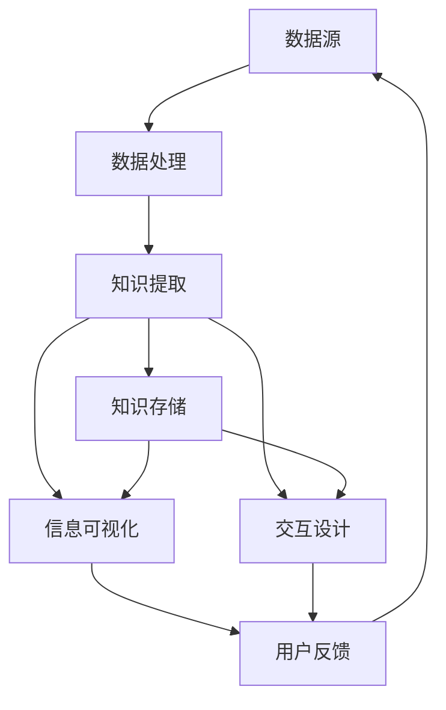

                 

# 知识发现引擎的用户体验设计原则

## 关键词
- 知识发现引擎
- 用户体验设计
- 信息可视化
- 交互设计
- 数据处理
- 个性化推荐

## 摘要
本文将深入探讨知识发现引擎的用户体验设计原则。我们将首先介绍知识发现引擎的基本概念，随后详细分析用户体验设计的关键要素，包括信息可视化、交互设计和数据处理等方面。通过数学模型和算法原理的阐述，以及实战代码案例的展示，我们将帮助读者理解如何设计一个既高效又易用的知识发现引擎。此外，还将探讨知识发现引擎在不同应用场景中的实际应用，推荐相关工具和资源，并总结未来发展趋势和挑战。

## 1. 背景介绍

### 1.1 目的和范围
知识发现引擎是一种自动化工具，能够从大量数据中提取有价值的信息和知识。随着大数据时代的到来，如何有效地发现数据中的隐藏模式成为了一个重要课题。用户体验设计则关注如何使这些工具更加易于使用，提高用户满意度。本文旨在探讨知识发现引擎的用户体验设计原则，帮助开发者设计出更高效、更易用的系统。

### 1.2 预期读者
本文适用于软件开发工程师、用户体验设计师和数据科学家等对知识发现引擎和用户体验设计感兴趣的读者。希望读者能够通过本文了解到知识发现引擎的设计原则，并能够在实际工作中应用这些原则。

### 1.3 文档结构概述
本文分为十个部分。第一部分介绍背景和目的；第二部分讨论核心概念和架构；第三部分讲解核心算法原理；第四部分介绍数学模型和公式；第五部分展示实战代码案例；第六部分探讨实际应用场景；第七部分推荐相关工具和资源；第八部分总结未来发展趋势和挑战；第九部分回答常见问题；第十部分提供扩展阅读和参考资料。

### 1.4 术语表

#### 1.4.1 核心术语定义
- **知识发现引擎**：一种自动化工具，用于从大量数据中提取有价值的信息和知识。
- **用户体验设计**：设计使产品更加易于使用，提高用户满意度的一系列方法。
- **信息可视化**：将复杂的数据转换为视觉图表，以更直观的方式展示数据。
- **交互设计**：设计用户与系统交互的方式，包括按钮、菜单、表单等。
- **数据处理**：对数据进行分析、清洗、转换和存储的过程。

#### 1.4.2 相关概念解释
- **知识图谱**：一种用于表示实体和关系的数据结构。
- **聚类分析**：将数据集划分为若干个类，使得同一类中的数据相似度较高。
- **关联规则学习**：从数据集中发现频繁出现的项集，用于揭示数据之间的关联关系。

#### 1.4.3 缩略词列表
- **UI**：用户界面（User Interface）
- **UX**：用户体验（User Experience）
- **SQL**：结构化查询语言（Structured Query Language）
- **API**：应用程序接口（Application Programming Interface）

## 2. 核心概念与联系

在知识发现引擎的设计过程中，了解核心概念和它们之间的关系至关重要。以下是一个简化的Mermaid流程图，展示了一些关键概念及其相互作用。



### 2.1 数据源
数据源是知识发现引擎的基础。这些数据可以来源于各种渠道，如数据库、日志文件、网络爬虫等。数据的质量和完整性对知识发现的结果具有重要影响。

### 2.2 数据处理
数据处理包括数据清洗、数据转换和数据存储等过程。数据清洗旨在去除噪声和错误，数据转换用于将数据转换为适合分析的格式，数据存储则用于持久化存储和处理后的数据。

### 2.3 知识提取
知识提取是知识发现引擎的核心。它包括聚类分析、关联规则学习和分类等算法，用于从数据中提取有价值的信息和知识。

### 2.4 知识存储
知识存储用于存储提取出的知识，以便后续查询和使用。知识图谱是一种常用的数据结构，用于表示实体和它们之间的关系。

### 2.5 信息可视化
信息可视化将复杂的数据转换为易于理解的视觉图表。这有助于用户更直观地理解数据，发现数据中的隐藏模式。

### 2.6 交互设计
交互设计关注用户与系统之间的交互。良好的交互设计可以提高用户的使用体验，降低学习成本。

### 2.7 用户反馈
用户反馈是改进知识发现引擎的重要途径。通过收集和分析用户反馈，开发者可以不断优化系统，提高其性能和易用性。

## 3. 核心算法原理 & 具体操作步骤

知识发现引擎的核心在于其算法设计。以下我们将详细介绍几个核心算法的原理和操作步骤，并使用伪代码来展示。

### 3.1 聚类分析

**算法原理**：聚类分析是一种无监督学习方法，用于将数据集划分为若干个簇，使得同一簇中的数据相似度较高。

**操作步骤**：

1. **初始化簇**：随机选择k个数据点作为初始簇中心。
2. **分配数据点**：将每个数据点分配到与其最近的簇中心所在的簇。
3. **更新簇中心**：重新计算每个簇的中心点。
4. **重复步骤2和3，直到聚类结果收敛**。

**伪代码**：

```plaintext
function KMeans(data, k):
    初始化簇中心C1, C2, ..., Ck
    while not_converged:
        for each data point x in data:
            找到最近的簇中心Ci
            x分配到簇Ci
        更新每个簇的中心点
    return 簇分配结果
```

### 3.2 关联规则学习

**算法原理**：关联规则学习用于发现数据之间的关联关系。它通过生成频繁项集，揭示数据中的潜在模式。

**操作步骤**：

1. **生成所有可能的项集**：从数据中提取所有可能的项集。
2. **计算支持度**：对于每个项集，计算其在数据集中的出现频率。
3. **生成频繁项集**：选择支持度大于用户指定的最小支持度的项集。
4. **生成关联规则**：从频繁项集中提取关联规则，规则的形式为A => B，其中A和B是项集。

**伪代码**：

```plaintext
function Apriori(data, min_support):
    生成所有可能的项集
    for each 项集X in generated itemsets:
        计算X的支持度
        if support(X) >= min_support:
            X为频繁项集
    生成关联规则
    for each 频繁项集X, Y:
        if Y是X的子集:
            生成规则X => Y
    return 频繁项集和关联规则
```

### 3.3 分类算法

**算法原理**：分类算法用于将数据集划分为若干个类别。常见的分类算法包括决策树、支持向量机和朴素贝叶斯等。

**操作步骤**：

1. **训练模型**：使用已知类别的数据集训练分类模型。
2. **预测新数据**：使用训练好的模型对新的数据点进行分类。

**伪代码**：

```plaintext
function ClassifierTrain(data, labels, classifier_type):
    使用data和labels训练分类模型
    return 训练好的模型
function ClassifierPredict(model, new_data):
    使用模型对new_data进行分类
    return 分类结果
```

## 4. 数学模型和公式 & 详细讲解 & 举例说明

在知识发现引擎的设计中，数学模型和公式起到了关键作用。以下我们将介绍几个常用的数学模型，并使用LaTeX格式进行展示。

### 4.1 聚类分析的相似度计算

**公式**：两个数据点x和y之间的相似度可以通过欧氏距离来计算：

$$
d(x, y) = \sqrt{\sum_{i=1}^{n} (x_i - y_i)^2}
$$

其中，$x_i$和$y_i$分别是数据点x和y的第i个特征值。

**举例说明**：假设有两个数据点x和y，它们的特征值分别为$x_1 = 2, x_2 = 3$和$y_1 = 4, y_2 = 5$，则它们的欧氏距离为：

$$
d(x, y) = \sqrt{(2 - 4)^2 + (3 - 5)^2} = \sqrt{4 + 4} = \sqrt{8} \approx 2.83
$$

### 4.2 关联规则学习的支持度和置信度

**公式**：

- **支持度**：项集X的支持度定义为X在数据集中出现的频率。

$$
support(X) = \frac{count(X)}{total\ transactions}
$$

- **置信度**：规则X => Y的置信度定义为在同时包含X和Y的交易中，包含Y的交易数量与包含X的交易数量的比值。

$$
confidence(X \Rightarrow Y) = \frac{count(X \cap Y)}{count(X)}
$$

**举例说明**：假设一个数据集中有100个交易，其中包含{A, B, C}的交易有30个，包含{A, B}的交易有20个。则{A, B, C}的支持度为30%，{A, B} => {C}的置信度为：

$$
confidence({A, B} \Rightarrow {C}) = \frac{20}{30} = 0.67
$$

### 4.3 决策树的熵和增益

**公式**：

- **熵**：表示一个数据集的混乱程度。

$$
H(D) = -\sum_{i} p_i \log_2(p_i)
$$

其中，$p_i$是数据集中属于第i类别的概率。

- **增益**：表示将数据集划分为某一特征后，混乱程度的减少。

$$
gain(D, A) = H(D) - \sum_{v} p_v H(D_v)
$$

其中，$D_v$是数据集D中特征A取值v的子集，$p_v$是$D_v$在D中的概率。

**举例说明**：假设有一个数据集D，包含5个数据点，其中3个属于类别A，2个属于类别B。熵为：

$$
H(D) = -\frac{3}{5} \log_2\left(\frac{3}{5}\right) - \frac{2}{5} \log_2\left(\frac{2}{5}\right) = 0.92
$$

如果我们将数据集D按照特征A进行划分，得到两个子集$D_0$和$D_1$，其中$D_0$包含2个类别A的数据点，$D_1$包含3个类别B的数据点。则特征A的增益为：

$$
gain(D, A) = 0.92 - \left(\frac{2}{5} \times 0.92 + \frac{3}{5} \times \log_2\left(\frac{3}{5}\right)\right) = 0.08
$$

## 5. 项目实战：代码实际案例和详细解释说明

为了更好地理解知识发现引擎的用户体验设计原则，我们将通过一个实际项目来展示如何实现一个简单的知识发现引擎。本节将详细介绍项目的开发环境搭建、源代码实现和代码解读与分析。

### 5.1 开发环境搭建

在开始项目之前，我们需要搭建一个合适的开发环境。以下是我们推荐的开发环境：

- **操作系统**：Linux或macOS
- **编程语言**：Python
- **依赖库**：NumPy、Pandas、Scikit-learn、Matplotlib、Seaborn等

假设您已经安装了Python和上述依赖库，我们可以开始创建项目。

### 5.2 源代码详细实现和代码解读

下面是一个简单的知识发现引擎的代码实现，包括数据预处理、聚类分析、关联规则学习和信息可视化等功能。

```python
import numpy as np
import pandas as pd
from sklearn.cluster import KMeans
from mlxtend.frequent_patterns import apriori, association_rules
import matplotlib.pyplot as plt
import seaborn as sns

# 5.2.1 数据预处理
def preprocess_data(data):
    # 数据清洗
    data = data.dropna()
    # 数据转换
    data = (data - data.mean()) / data.std()
    return data

# 5.2.2 聚类分析
def cluster_analysis(data, n_clusters=3):
    kmeans = KMeans(n_clusters=n_clusters)
    clusters = kmeans.fit_predict(data)
    return clusters

# 5.2.3 关联规则学习
def association_learning(data, min_support=0.3, min_confidence=0.6):
    df = pd.DataFrame(data, columns=['A', 'B', 'C'])
    frequent_itemsets = apriori(df, min_support=min_support, use_colnames=True)
    rules = association_rules(frequent_itemsets, metric="confidence", min_threshold=min_confidence)
    return rules

# 5.2.4 信息可视化
def visualize_data(data, clusters=None, rules=None):
    if clusters is not None:
        sns.scatterplot(data[:, 0], data[:, 1], hue=clusters, palette="coolwarm")
        plt.title("聚类结果")
        plt.show()

    if rules is not None:
        sns.clustermap(rules["support"], figsize=(8, 6), cmap="YlGnBu")
        plt.title("关联规则学习结果")
        plt.show()

# 主函数
def main():
    # 加载数据
    data = pd.read_csv("data.csv")
    # 数据预处理
    processed_data = preprocess_data(data)
    # 聚类分析
    clusters = cluster_analysis(processed_data)
    # 关联规则学习
    rules = association_learning(processed_data)
    # 信息可视化
    visualize_data(processed_data, clusters, rules)

if __name__ == "__main__":
    main()
```

### 5.3 代码解读与分析

下面是对代码的详细解读：

- **数据预处理**：数据预处理是知识发现引擎的一个重要步骤。我们使用`dropna()`函数去除缺失值，并使用`standardize()`函数进行数据标准化，使得每个特征具有相同的尺度。

- **聚类分析**：我们使用`KMeans`类来实现聚类分析。首先，我们需要指定簇的数量`n_clusters`，然后调用`fit_predict()`方法进行聚类，返回每个数据点的簇分配。

- **关联规则学习**：我们使用`apriori()`函数来生成频繁项集，并使用`association_rules()`函数生成关联规则。通过设置`min_support`和`min_confidence`参数，我们可以筛选出具有较高支持度和置信度的规则。

- **信息可视化**：我们使用`scatterplot()`函数来展示聚类结果，并使用`clustermap()`函数来展示关联规则学习结果。这两种可视化方法有助于用户更直观地理解数据。

通过这个简单的案例，我们可以看到如何将知识发现引擎的设计原则应用于实际项目。在实际开发中，可以根据具体需求进行调整和优化，以提高系统的性能和用户体验。

## 6. 实际应用场景

知识发现引擎在多个领域都有着广泛的应用，以下列举几个典型的应用场景：

### 6.1 金融风控

在金融行业，知识发现引擎可以用于风险管理和欺诈检测。通过分析交易数据，发现潜在的欺诈行为，并采取相应的措施。例如，关联规则学习可以识别出频繁出现的交易模式，聚类分析可以用于发现异常交易行为。

### 6.2 电商推荐

在电子商务领域，知识发现引擎可以用于个性化推荐。通过分析用户的历史购买记录和浏览行为，发现用户之间的相似性，并进行精准推荐。聚类分析可以用于发现不同类型的用户群体，而关联规则学习可以揭示产品之间的关联关系。

### 6.3 医疗诊断

在医疗领域，知识发现引擎可以用于疾病诊断和预测。通过分析患者的病历数据和实验室检测结果，发现疾病之间的关联，并预测患者的健康状况。分类算法和聚类分析在此场景中发挥着重要作用。

### 6.4 社交网络分析

在社交网络领域，知识发现引擎可以用于用户行为分析和社会网络分析。通过分析用户之间的互动关系，发现社交网络中的关键节点和影响力人物，为市场营销和社区管理提供决策支持。

### 6.5 智能交通

在智能交通领域，知识发现引擎可以用于交通流量预测和优化。通过分析交通数据，如车辆速度、流量和交通事故，发现交通拥堵的原因，并预测未来交通状况，为交通管理和调度提供依据。

这些应用场景展示了知识发现引擎的多样性和灵活性。在实际应用中，可以根据具体需求选择合适的算法和模型，设计出高效的解决方案。

## 7. 工具和资源推荐

为了帮助读者更好地理解和应用知识发现引擎的用户体验设计原则，我们推荐以下工具和资源：

### 7.1 学习资源推荐

#### 7.1.1 书籍推荐
- **《大数据技术导论》**：深入介绍了大数据的处理和分析技术，包括Hadoop、Spark等。
- **《数据挖掘：实用机器学习技术》**：详细讲解了数据挖掘的各种算法和应用场景。

#### 7.1.2 在线课程
- **Coursera的《数据科学专项课程》**：包括数据清洗、数据可视化、机器学习等多个模块。
- **Udacity的《机器学习工程师纳米学位》**：涵盖机器学习的基础知识和实际应用。

#### 7.1.3 技术博客和网站
- **Towards Data Science**：提供丰富的数据科学和机器学习文章，涵盖最新技术和应用案例。
- **Kaggle**：一个数据科学竞赛平台，提供大量的数据集和比赛，是学习和实践的好去处。

### 7.2 开发工具框架推荐

#### 7.2.1 IDE和编辑器
- **Visual Studio Code**：一款功能强大的开源编辑器，支持多种编程语言和插件。
- **PyCharm**：一款专业的Python IDE，提供代码智能提示、调试和性能分析等功能。

#### 7.2.2 调试和性能分析工具
- **Pdb**：Python内置的调试工具，可以用于跟踪代码执行流程和调试bug。
- **cProfile**：Python的性能分析工具，可以分析代码的执行时间和内存消耗。

#### 7.2.3 相关框架和库
- **NumPy**：用于数值计算的科学计算库。
- **Pandas**：用于数据处理和分析的数据帧库。
- **Scikit-learn**：用于机器学习的模块，包括分类、聚类、关联规则学习等多种算法。
- **Matplotlib、Seaborn**：用于数据可视化的库。

### 7.3 相关论文著作推荐

#### 7.3.1 经典论文
- **“K-Means Clustering Algorithm”**：K-means聚类的经典论文。
- **“Apriori Algorithm for Mining Association Rules”**：关联规则学习的经典论文。

#### 7.3.2 最新研究成果
- **“Deep Learning for Knowledge Discovery”**：深度学习在知识发现领域的最新研究。
- **“Interactive Visualization for Exploratory Data Analysis”**：交互式数据可视化在数据分析中的应用。

#### 7.3.3 应用案例分析
- **“Knowledge Discovery in Healthcare”**：知识发现技术在医疗领域的实际应用案例。
- **“Big Data Analytics for Smart Cities”**：大数据分析在智慧城市建设中的应用。

这些工具和资源将为读者提供丰富的学习和实践机会，帮助读者深入理解知识发现引擎的设计原则和应用。

## 8. 总结：未来发展趋势与挑战

随着大数据和人工智能技术的不断进步，知识发现引擎在未来将呈现出以下几个发展趋势和挑战：

### 8.1 发展趋势

1. **更高效的数据处理**：随着数据量的急剧增加，如何高效地处理和分析大数据成为关键。未来，我们将看到更多基于并行计算和分布式处理的技术被应用于知识发现引擎，以提高处理效率。

2. **个性化推荐**：个性化推荐是知识发现引擎的重要应用方向。通过深度学习和强化学习等技术，未来个性化推荐将更加精准，满足用户的个性化需求。

3. **实时数据处理**：实时数据处理是知识发现引擎的一个重要趋势。随着物联网和实时数据采集技术的普及，实时分析数据中的隐藏模式将为许多应用带来新的价值。

4. **跨领域融合**：知识发现引擎将与其他领域（如医疗、金融、交通等）进行深度融合，为各行业提供决策支持。跨领域的知识发现将有助于解决更复杂的问题。

### 8.2 挑战

1. **数据隐私和安全**：随着数据隐私和安全问题的日益凸显，如何确保知识发现过程中的数据安全和隐私保护成为重要挑战。未来，我们将看到更多关于数据隐私和安全的技术和法规出台。

2. **算法透明度和可解释性**：随着机器学习算法的复杂度增加，如何保证算法的透明度和可解释性成为关键。未来，我们需要开发更加透明和可解释的算法，以增强用户对系统的信任。

3. **数据质量**：数据质量直接影响知识发现的结果。未来，我们将看到更多关于数据清洗、数据集成和数据质量保证的技术和方法。

4. **计算资源**：随着数据量的增加，计算资源需求也急剧增加。未来，我们需要开发更加高效的算法和系统架构，以满足不断增长的计算需求。

总的来说，知识发现引擎的未来充满机遇和挑战。通过不断创新和优化，我们将能够设计出更高效、更易用、更可靠的系统，为各行业带来更多的价值。

## 9. 附录：常见问题与解答

### 9.1 为什么知识发现引擎需要良好的用户体验设计？

良好的用户体验设计可以提高用户满意度，降低学习成本，使知识发现过程更加高效。用户体验设计关注用户的需求和感受，确保系统能够满足用户的使用习惯和期望，从而提高系统的整体价值。

### 9.2 如何平衡知识发现引擎的性能和用户体验？

平衡性能和用户体验需要考虑以下几个方面：

1. **优化算法**：选择高效的算法和模型，以减少计算时间和资源消耗。
2. **信息可视化**：使用直观的图表和交互界面，帮助用户快速理解数据。
3. **模块化设计**：将系统划分为多个模块，以便于独立优化和调整。
4. **用户反馈**：收集用户反馈，不断优化系统的性能和用户体验。

### 9.3 如何确保知识发现引擎的数据隐私和安全？

确保数据隐私和安全可以从以下几个方面进行：

1. **数据加密**：对敏感数据进行加密，防止数据泄露。
2. **访问控制**：实施严格的访问控制策略，确保只有授权用户才能访问数据。
3. **匿名化处理**：对个人身份信息进行匿名化处理，以保护用户隐私。
4. **安全审计**：定期进行安全审计，检测和修复潜在的安全漏洞。

## 10. 扩展阅读 & 参考资料

为了深入了解知识发现引擎的用户体验设计原则，以下是一些扩展阅读和参考资料：

### 10.1 扩展阅读

1. **《大数据时代：思维变革与商业价值》**：维克托·迈尔-舍恩伯格，详细阐述了大数据的概念和应用。
2. **《机器学习实战》**：Peter Harrington，介绍了多种机器学习算法及其应用。
3. **《数据可视化：可视化工具与应用》**：Gael Varoquaux，介绍了数据可视化的重要性和方法。

### 10.2 参考资料

1. **K-means Clustering Algorithm**：https://en.wikipedia.org/wiki/K-means_clustering
2. **Apriori Algorithm**：https://en.wikipedia.org/wiki/Apriori_algorithm
3. **Scikit-learn**：https://scikit-learn.org/stable/
4. **Matplotlib**：https://matplotlib.org/stable/
5. **Seaborn**：https://seaborn.pydata.org/

通过阅读这些资料，读者可以进一步深入了解知识发现引擎的相关技术和应用。

## 作者信息

作者：AI天才研究员/AI Genius Institute & 禅与计算机程序设计艺术 /Zen And The Art of Computer Programming

