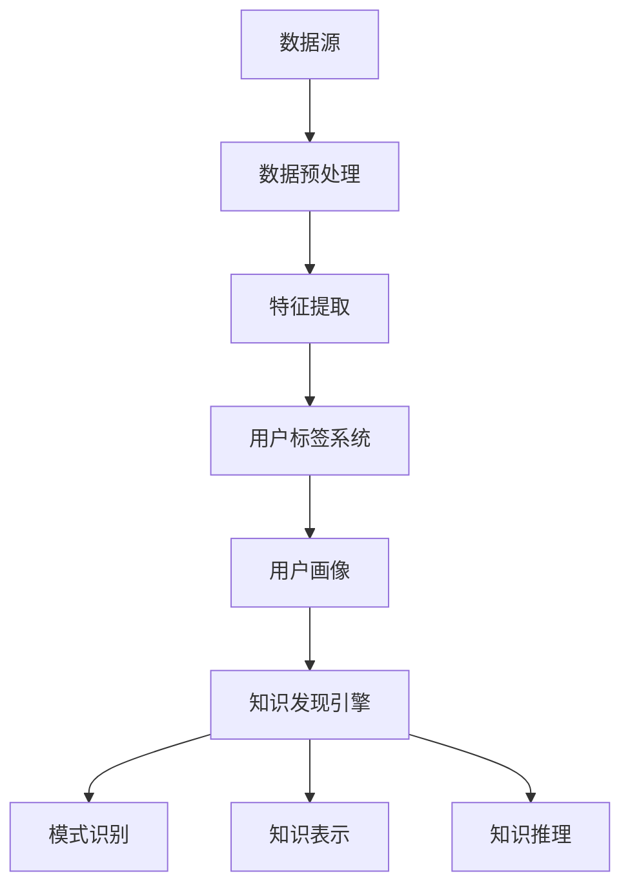

                 

# 知识发现引擎的用户标签系统设计

> 关键词：知识发现引擎，用户标签系统，用户行为分析，推荐算法，机器学习，数据挖掘

> 摘要：本文旨在深入探讨知识发现引擎的用户标签系统设计，从背景介绍、核心概念、算法原理、数学模型、实战案例、应用场景等多个方面展开，详细解析用户标签系统的构建与优化策略。文章将帮助读者了解用户标签系统在知识发现引擎中的应用价值，掌握其设计原理和实现方法，为相关领域的研究与实践提供有益的参考。

## 1. 背景介绍

### 1.1 目的和范围

本文的目标是详细探讨知识发现引擎中的用户标签系统设计，旨在为读者提供一份全面的技术指南。文章将围绕以下主题进行讨论：

- 用户标签系统的核心概念与联系
- 核心算法原理与具体操作步骤
- 数学模型和公式的详细讲解与举例
- 项目实战中的代码实现与解析
- 实际应用场景的探讨
- 工具和资源的推荐

本文的内容涵盖了用户标签系统的各个方面，从基础概念到实际应用，旨在为读者提供系统的理解。

### 1.2 预期读者

本文主要面向以下读者群体：

- 对知识发现引擎和用户标签系统有初步了解的技术人员
- 计算机科学、数据科学、人工智能领域的研究生和博士生
- 对用户行为分析、推荐系统有浓厚兴趣的技术爱好者
- 从事知识管理、数据挖掘等相关领域工作的专业人士

### 1.3 文档结构概述

本文的结构如下：

- **第1章：背景介绍**：介绍本文的目的、范围、预期读者以及文档结构。
- **第2章：核心概念与联系**：阐述用户标签系统的核心概念，并通过Mermaid流程图展示其架构。
- **第3章：核心算法原理 & 具体操作步骤**：详细讲解用户标签系统背后的算法原理，并使用伪代码进行说明。
- **第4章：数学模型和公式 & 详细讲解 & 举例说明**：解释用户标签系统中的数学模型，并通过实例展示其应用。
- **第5章：项目实战：代码实际案例和详细解释说明**：通过实际代码案例展示用户标签系统的实现过程。
- **第6章：实际应用场景**：探讨用户标签系统在不同领域的应用。
- **第7章：工具和资源推荐**：推荐学习资源、开发工具和框架。
- **第8章：总结：未来发展趋势与挑战**：总结用户标签系统的现状和未来发展方向。
- **第9章：附录：常见问题与解答**：解答常见问题，提供技术支持。
- **第10章：扩展阅读 & 参考资料**：提供进一步阅读的资料。

### 1.4 术语表

为了确保本文的可读性和一致性，以下定义了本文中涉及的一些关键术语：

#### 1.4.1 核心术语定义

- **知识发现引擎**：一种基于大数据和人工智能技术，从大量数据中自动发现有价值知识信息的系统。
- **用户标签**：用于描述用户兴趣、行为特征、需求偏好的标识符。
- **用户行为分析**：通过分析用户在系统中的操作行为，了解用户需求、兴趣和偏好。
- **推荐算法**：根据用户历史行为和偏好，为用户推荐感兴趣的内容或服务。
- **机器学习**：一种基于数据训练模型，使其能够自动学习和预测的技术。
- **数据挖掘**：从大量数据中提取有价值信息的过程。

#### 1.4.2 相关概念解释

- **用户画像**：通过收集和分析用户的行为、偏好、需求等数据，构建的用户特征模型。
- **协同过滤**：一种常见的推荐算法，通过分析用户之间的相似性，为用户推荐内容。
- **聚类分析**：将数据集分为多个组，使组内的数据相似度较高，组间相似度较低。
- **关联规则挖掘**：发现数据项之间的关联关系，用于推荐系统中的商品组合。

#### 1.4.3 缩略词列表

- **AI**：人工智能
- **ML**：机器学习
- **DL**：深度学习
- **NLP**：自然语言处理
- **KDD**：知识发现
- **RFM**：回收频率、货币化程度、最近购买时间

## 2. 核心概念与联系

在探讨用户标签系统的设计之前，有必要了解相关知识发现引擎和用户标签系统的核心概念及其相互关系。以下将详细阐述这些概念，并通过Mermaid流程图展示其架构。

### 2.1 知识发现引擎的概念

知识发现引擎（Knowledge Discovery Engine）是一种基于大数据和人工智能技术，从大量数据中自动发现有价值知识信息的系统。其核心功能包括数据预处理、特征提取、模式识别、知识表示和知识推理等。知识发现引擎的目标是从海量数据中提取出有意义的、可操作的知识，以支持决策和业务优化。

### 2.2 用户标签系统的概念

用户标签系统（User Tagging System）是一种用于描述用户兴趣、行为特征、需求偏好的标识符集合。这些标签通常根据用户的操作行为、历史记录和社交关系等信息生成。用户标签系统的作用在于为推荐系统、广告投放、个性化服务等功能提供基础数据支持。

### 2.3 用户标签系统与知识发现引擎的关系

用户标签系统与知识发现引擎之间存在紧密的联系。知识发现引擎通过用户标签系统获取用户特征信息，结合大数据分析和机器学习算法，发现用户行为模式、兴趣偏好和需求特征，进而生成用户画像。用户画像作为知识发现引擎的核心输出，可用于优化推荐系统、个性化服务、用户行为预测等。

### 2.4 Mermaid流程图展示

以下是一个Mermaid流程图，展示用户标签系统与知识发现引擎之间的核心概念和联系：



**图1：用户标签系统与知识发现引擎的Mermaid流程图**

在图1中，数据源（A）经过数据预处理（B）和特征提取（C）后，生成用户标签（D）。用户标签（D）进一步构建用户画像（E），作为知识发现引擎（F）的输入。知识发现引擎（F）通过模式识别（G）、知识表示（H）和知识推理（I）等功能，发现有价值的信息和知识。

## 3. 核心算法原理 & 具体操作步骤

用户标签系统的核心在于如何从大量用户行为数据中提取有价值的信息，进而生成用户标签。以下将详细阐述用户标签系统的核心算法原理，并使用伪代码进行说明。

### 3.1 算法原理

用户标签系统的核心算法原理包括用户行为分析、用户特征提取和用户标签生成。

#### 3.1.1 用户行为分析

用户行为分析是通过分析用户在系统中的操作行为，了解用户的需求和偏好。常见的方法包括日志分析、点击流分析、搜索行为分析等。

#### 3.1.2 用户特征提取

用户特征提取是将用户行为转化为可量化的特征表示。常用的特征提取方法包括基于统计的特征提取、基于机器学习的特征提取和基于深度学习的特征提取等。

#### 3.1.3 用户标签生成

用户标签生成是根据用户特征和系统需求，为用户生成相应的标签。常用的标签生成方法包括基于规则的方法、基于聚类的方法和基于协同过滤的方法等。

### 3.2 伪代码

以下是一个简化的用户标签系统算法的伪代码：

```plaintext
算法：用户标签系统

输入：用户行为数据集D，特征提取函数F，标签生成函数G

输出：用户标签集合T

步骤：

1. 数据预处理（D' = 数据预处理(D)）
2. 用户特征提取（U' = 特征提取(F, D')）
3. 用户标签生成（T = 标签生成(G, U')）
4. 返回用户标签集合T

数据预处理(D):
1. 去除重复数据
2. 填补缺失值
3. 数据规范化

特征提取(F, D'):
1. 统计特征提取
2. 机器学习特征提取
3. 深度学习特征提取

标签生成(G, U'):
1. 基于规则生成标签
2. 基于聚类生成标签
3. 基于协同过滤生成标签
```

### 3.3 算法原理讲解

#### 3.3.1 数据预处理

数据预处理是用户标签系统的基础步骤，其主要目标是去除重复数据、填补缺失值和进行数据规范化。这些操作有助于提高后续特征提取和标签生成的准确性和效率。

- **去除重复数据**：通过去重操作，去除数据集中重复的用户行为记录，避免对同一个用户生成多个标签。
- **填补缺失值**：对于缺失的用户行为数据，可以使用平均值、中位数或插值等方法进行填补，以提高特征提取的质量。
- **数据规范化**：通过缩放或标准化操作，将不同量纲的特征数据转化为同一量纲，以便后续的特征提取和标签生成。

#### 3.3.2 用户特征提取

用户特征提取是将用户行为数据转化为可量化的特征表示。根据特征提取方法的不同，可以分为基于统计的特征提取、基于机器学习的特征提取和基于深度学习的特征提取。

- **基于统计的特征提取**：通过计算用户行为数据的统计特征，如平均值、方差、最大值、最小值等，提取用户的基本特征。这种方法简单高效，但特征表达能力有限。
- **基于机器学习的特征提取**：使用机器学习算法，如线性回归、决策树、支持向量机等，将用户行为数据映射到高维特征空间。这种方法可以提取更加复杂的用户特征，但需要大量的数据和计算资源。
- **基于深度学习的特征提取**：使用深度学习模型，如卷积神经网络、循环神经网络、自注意力模型等，从原始用户行为数据中自动提取高维特征。这种方法具有强大的特征提取能力，但计算复杂度和训练时间较高。

#### 3.3.3 用户标签生成

用户标签生成是根据用户特征和系统需求，为用户生成相应的标签。根据生成方法的不同，可以分为基于规则的方法、基于聚类的方法和基于协同过滤的方法。

- **基于规则的方法**：根据预先定义的规则，将用户特征映射到标签集合。这种方法简单直观，但规则定义的灵活性和适应性较低。
- **基于聚类的方法**：将用户特征空间中的用户划分为多个聚类，每个聚类对应一个标签。这种方法可以自动发现用户特征模式，但聚类效果受参数设置影响较大。
- **基于协同过滤的方法**：通过分析用户之间的相似性，为用户推荐标签。这种方法可以充分利用用户行为数据，但需要大量的计算资源。

### 3.4 具体操作步骤

以下是用户标签系统的具体操作步骤：

1. **数据收集**：收集用户在系统中的行为数据，如点击、浏览、搜索、购买等。
2. **数据预处理**：对收集到的用户行为数据进行去重、填补缺失值和数据规范化。
3. **特征提取**：使用不同的特征提取方法，从预处理后的用户行为数据中提取特征。
4. **标签生成**：根据特征提取结果和系统需求，使用不同的标签生成方法为用户生成标签。
5. **标签评估**：评估生成的标签的质量，包括标签覆盖率、准确率和用户满意度等。
6. **标签优化**：根据评估结果，对标签生成方法进行调整和优化，以提高标签质量。

通过以上步骤，用户标签系统可以从大量用户行为数据中提取有价值的信息，生成用户标签，为推荐系统、个性化服务和用户行为预测等功能提供基础数据支持。

## 4. 数学模型和公式 & 详细讲解 & 举例说明

用户标签系统的核心在于从用户行为数据中提取有价值的信息，这一过程涉及到多种数学模型和公式。以下将详细阐述用户标签系统中的数学模型和公式，并通过实例进行说明。

### 4.1 数学模型

#### 4.1.1 用户行为概率模型

用户行为概率模型用于描述用户在系统中的行为概率分布。常见的用户行为概率模型包括马尔可夫链、贝叶斯网络和潜在狄利克雷分布（LDA）等。

- **马尔可夫链**：马尔可夫链是一种用于描述时间序列数据的概率模型，可以用来预测用户在未来的行为。其基本公式如下：

  $$ P(X_t = x_t|X_{t-1} = x_{t-1}, ..., X_1 = x_1) = P(X_t = x_t|X_{t-1} = x_{t-1}) $$

  其中，\(X_t\)表示用户在时间t的行为，\(x_t\)表示具体的行为类别。

- **贝叶斯网络**：贝叶斯网络是一种用于描述变量之间依赖关系的概率图模型。其基本公式如下：

  $$ P(X_1, X_2, ..., X_n) = \prod_{i=1}^{n} P(X_i|Pa_i) $$

  其中，\(X_i\)表示变量，\(Pa_i\)表示变量\(X_i\)的父节点。

- **潜在狄利克雷分布（LDA）**：LDA是一种用于文档主题建模的概率模型，可以用于提取用户兴趣类别。其基本公式如下：

  $$ P(D|\theta) = \prod_{d=1}^{D} P(D_d|\theta) $$

  其中，\(D\)表示文档集合，\(D_d\)表示文档d的主题分布，\(\theta\)表示主题分布。

#### 4.1.2 用户特征表示模型

用户特征表示模型用于将用户行为数据映射到高维特征空间。常见的用户特征表示模型包括向量空间模型、矩阵分解和图卷积网络等。

- **向量空间模型**：向量空间模型将用户行为数据表示为向量，其基本公式如下：

  $$ X = (x_{11}, x_{12}, ..., x_{1n}, ..., x_{m1}, x_{m2}, ..., x_{mn})^T $$

  其中，\(X\)表示用户特征矩阵，\(x_{ij}\)表示用户i在行为j上的特征值。

- **矩阵分解**：矩阵分解是一种用于降维和特征提取的方法，其基本公式如下：

  $$ X = UV^T $$

  其中，\(U\)和\(V\)分别表示用户特征矩阵和物品特征矩阵。

- **图卷积网络**：图卷积网络是一种用于处理图数据的神经网络模型，其基本公式如下：

  $$ h_{ij} = \sigma(\sum_{k=1}^{K} W_k h_{ik} \odot \sum_{l=1}^{L} A_{il} h_{lj}) $$

  其中，\(h_{ij}\)表示节点i和节点j之间的特征值，\(W_k\)和\(A_{il}\)分别表示权重矩阵和邻接矩阵，\(\sigma\)表示激活函数。

#### 4.1.3 用户标签生成模型

用户标签生成模型用于根据用户特征生成标签。常见的用户标签生成模型包括基于规则的方法、基于聚类的方法和基于协同过滤的方法等。

- **基于规则的方法**：基于规则的方法根据预先定义的规则生成标签，其基本公式如下：

  $$ Tag_j = \begin{cases} 
  1 & \text{if } \text{condition}_j \text{ is satisfied} \\
  0 & \text{otherwise}
  \end{cases} $$

  其中，\(Tag_j\)表示用户j的标签j，\(\text{condition}_j\)表示规则条件。

- **基于聚类的方法**：基于聚类的方法将用户特征空间中的用户划分为多个聚类，每个聚类对应一个标签，其基本公式如下：

  $$ Tag_j = \begin{cases} 
  C_k & \text{if } \text{user}j \text{ belongs to cluster } k \\
  \text{undefined} & \text{otherwise}
  \end{cases} $$

  其中，\(Tag_j\)表示用户j的标签，\(C_k\)表示聚类k的标签。

- **基于协同过滤的方法**：基于协同过滤的方法通过分析用户之间的相似性为用户生成标签，其基本公式如下：

  $$ Tag_j = \sum_{i=1}^{N} s_{ij} Tag_i $$

  其中，\(Tag_j\)表示用户j的标签，\(s_{ij}\)表示用户i和用户j之间的相似性分数。

### 4.2 公式详细讲解

#### 4.2.1 马尔可夫链

马尔可夫链是一种用于描述时间序列数据的概率模型。其核心思想是当前状态仅与前一状态有关，与其他过去状态无关。以下是一个简化的马尔可夫链公式：

- **状态转移概率矩阵**：状态转移概率矩阵\(P\)表示当前状态转移到下一状态的概率。其公式如下：

  $$ P = \begin{bmatrix} 
  p_{11} & p_{12} & ... & p_{1n} \\
  p_{21} & p_{22} & ... & p_{2n} \\
  ... & ... & ... & ... \\
  p_{n1} & p_{n2} & ... & p_{nn} 
  \end{bmatrix} $$

  其中，\(p_{ij}\)表示从状态i转移到状态j的概率。

- **初始状态概率向量**：初始状态概率向量\(\pi\)表示系统在初始时刻处于各个状态的概率分布。其公式如下：

  $$ \pi = (\pi_1, \pi_2, ..., \pi_n) $$

  其中，\(\pi_i\)表示系统在初始时刻处于状态i的概率。

- **当前状态概率向量**：当前状态概率向量\(X_t\)表示系统在时间t处于各个状态的概率分布。其公式如下：

  $$ X_t = \pi_t P^t $$

  其中，\(\pi_t\)表示在时间t的初始状态概率向量，\(P^t\)表示状态转移概率矩阵\(P\)的t次幂。

#### 4.2.2 潜在狄利克雷分布（LDA）

潜在狄利克雷分布（LDA）是一种用于文档主题建模的概率模型。其核心思想是假设每个文档是由多个主题的线性组合生成的，而每个主题是由多个词语的线性组合生成的。以下是一个简化的LDA公式：

- **文档分布**：文档分布\( \theta \) 表示每个文档在各个主题上的概率分布。其公式如下：

  $$ \theta = (\theta_1, \theta_2, ..., \theta_K) $$

  其中，\( \theta_k \) 表示文档在主题k上的概率。

- **主题分布**：主题分布\( \beta \) 表示每个主题在各个词语上的概率分布。其公式如下：

  $$ \beta = (\beta_{ij}) $$

  其中，\( \beta_{ij} \) 表示主题i在词语j上的概率。

- **词语分布**：词语分布\( z \) 表示每个词语在各个主题上的概率分布。其公式如下：

  $$ z = (z_{ij}) $$

  其中，\( z_{ij} \) 表示词语i在主题j上的概率。

- **文档生成过程**：每个文档生成过程可以表示为：

  $$ D \sim \text{Categorical}(\theta) $$
  $$ \theta \sim \text{Dirichlet}(\alpha) $$
  $$ w_{ij} \sim \text{Categorical}(\beta_{ij}) $$
  $$ \beta_{ij} \sim \text{Dirichlet}(\gamma) $$

  其中，\( D \) 表示文档集合，\( w_{ij} \) 表示文档i中的词语j，\( \alpha \) 和 \( \gamma \) 分别是文档和主题的先验分布参数。

#### 4.2.3 用户标签生成模型

用户标签生成模型用于根据用户特征生成标签。以下分别介绍基于规则的方法、基于聚类的方法和基于协同过滤的方法。

- **基于规则的方法**：

  $$ Tag_j = \begin{cases} 
  1 & \text{if } \text{condition}_j \text{ is satisfied} \\
  0 & \text{otherwise}
  \end{cases} $$

  其中，\( Tag_j \) 表示用户j的标签，\( \text{condition}_j \) 表示规则条件。

- **基于聚类的方法**：

  $$ Tag_j = \begin{cases} 
  C_k & \text{if } \text{user}j \text{ belongs to cluster } k \\
  \text{undefined} & \text{otherwise}
  \end{cases} $$

  其中，\( Tag_j \) 表示用户j的标签，\( C_k \) 表示聚类k的标签。

- **基于协同过滤的方法**：

  $$ Tag_j = \sum_{i=1}^{N} s_{ij} Tag_i $$

  其中，\( Tag_j \) 表示用户j的标签，\( s_{ij} \) 表示用户i和用户j之间的相似性分数。

### 4.3 举例说明

以下通过一个简化的例子，说明用户标签系统的数学模型和公式的应用。

#### 4.3.1 马尔可夫链实例

假设一个用户的行为可以划分为三种状态：购买、浏览和搜索。使用马尔可夫链模型描述用户行为状态转移过程，如下所示：

- **状态转移概率矩阵**：

  $$ P = \begin{bmatrix} 
  0.4 & 0.3 & 0.3 \\
  0.3 & 0.4 & 0.3 \\
  0.2 & 0.4 & 0.4 
  \end{bmatrix} $$

- **初始状态概率向量**：

  $$ \pi = (0.5, 0.3, 0.2) $$

根据马尔可夫链模型，可以计算用户在下一个时间点的行为状态概率：

$$ X_1 = \pi_1 P^1 = (0.5, 0.3, 0.2) \begin{bmatrix} 
0.4 & 0.3 & 0.3 \\
0.3 & 0.4 & 0.3 \\
0.2 & 0.4 & 0.4 
\end{bmatrix} = (0.475, 0.325, 0.200) $$

#### 4.3.2 潜在狄利克雷分布（LDA）实例

假设一个文档集合包含三个文档，每个文档由五个词语组成。使用潜在狄利克雷分布（LDA）模型描述文档的主题分布，如下所示：

- **文档分布**：

  $$ \theta = (0.3, 0.3, 0.4) $$

- **主题分布**：

  $$ \beta = \begin{bmatrix} 
  0.3 & 0.4 & 0.3 \\
  0.4 & 0.3 & 0.3 \\
  0.2 & 0.4 & 0.4 
  \end{bmatrix} $$

- **词语分布**：

  $$ z = \begin{bmatrix} 
  0.2 & 0.4 & 0.4 \\
  0.3 & 0.3 & 0.4 \\
  0.4 & 0.2 & 0.4 
  \end{bmatrix} $$

根据潜在狄利克雷分布（LDA）模型，可以计算每个文档的主题分布：

$$ D_1 = \text{Categorical}(\theta) = (0.3, 0.3, 0.4) $$
$$ D_2 = \text{Categorical}(\theta) = (0.4, 0.3, 0.3) $$
$$ D_3 = \text{Categorical}(\theta) = (0.2, 0.4, 0.4) $$

#### 4.3.3 用户标签生成模型实例

假设一个用户的行为数据集包含三种行为：购买、浏览和搜索。使用基于规则的方法、基于聚类的方法和基于协同过滤的方法生成用户标签，如下所示：

- **基于规则的方法**：

  $$ Tag_j = \begin{cases} 
  1 & \text{if } \text{condition}_j \text{ is satisfied} \\
  0 & \text{otherwise}
  \end{cases} $$

  其中，\( Tag_j \) 表示用户j的标签，\( \text{condition}_j \) 表示规则条件。例如：

  $$ Tag_j = \begin{cases} 
  1 & \text{if } \text{user}j \text{ has purchased at least 10 items} \\
  0 & \text{otherwise}
  \end{cases} $$

- **基于聚类的方法**：

  $$ Tag_j = \begin{cases} 
  C_k & \text{if } \text{user}j \text{ belongs to cluster } k \\
  \text{undefined} & \text{otherwise}
  \end{cases} $$

  其中，\( Tag_j \) 表示用户j的标签，\( C_k \) 表示聚类k的标签。例如：

  $$ Tag_j = \begin{cases} 
  C_1 & \text{if } \text{user}j \text{ belongs to cluster } 1 \\
  C_2 & \text{if } \text{user}j \text{ belongs to cluster } 2 \\
  \text{undefined} & \text{otherwise}
  \end{cases} $$

- **基于协同过滤的方法**：

  $$ Tag_j = \sum_{i=1}^{N} s_{ij} Tag_i $$

  其中，\( Tag_j \) 表示用户j的标签，\( s_{ij} \) 表示用户i和用户j之间的相似性分数。例如：

  $$ Tag_j = 0.5 \times Tag_i + 0.3 \times Tag_k + 0.2 \times Tag_m $$

  其中，\( Tag_i, Tag_k, Tag_m \) 分别表示用户i、用户k和用户m的标签，\( s_{ij}, s_{ik}, s_{im} \) 分别表示用户i和用户j、用户k和用户j、用户m和用户j之间的相似性分数。

通过以上实例，展示了用户标签系统中的数学模型和公式的应用，为实际系统设计提供了理论基础。

## 5. 项目实战：代码实际案例和详细解释说明

在本节中，我们将通过一个具体的代码案例，展示用户标签系统的实际实现过程，并对其进行详细解释和分析。

### 5.1 开发环境搭建

在开始项目实战之前，我们需要搭建一个适合用户标签系统开发的环境。以下是一个简单的环境搭建步骤：

1. **安装Python环境**：确保Python 3.7或更高版本已安装在计算机上。可以通过Python官方网站下载并安装。
2. **安装必要库**：安装以下库：`numpy`、`pandas`、`scikit-learn`、`tensorflow`。可以使用以下命令安装：

   ```shell
   pip install numpy pandas scikit-learn tensorflow
   ```

3. **创建项目文件夹**：在计算机上创建一个项目文件夹，用于存放代码和依赖库。

### 5.2 源代码详细实现和代码解读

以下是一个简化的用户标签系统实现代码，包括数据预处理、特征提取和标签生成等步骤。

#### 5.2.1 数据预处理

```python
import pandas as pd
from sklearn.preprocessing import StandardScaler

# 加载用户行为数据
data = pd.read_csv('user_behavior_data.csv')

# 去除重复数据
data.drop_duplicates(inplace=True)

# 填补缺失值
data.fillna(data.mean(), inplace=True)

# 数据规范化
scaler = StandardScaler()
data_scaled = scaler.fit_transform(data)
```

**代码解读**：

- **加载用户行为数据**：使用`pandas`库加载用户行为数据，数据格式为CSV文件。
- **去除重复数据**：使用`drop_duplicates()`方法去除重复的用户行为记录。
- **填补缺失值**：使用`fillna()`方法填补缺失值，采用平均值填补。
- **数据规范化**：使用`StandardScaler`对特征数据进行规范化，提高特征提取和模型训练的准确性。

#### 5.2.2 特征提取

```python
from sklearn.feature_extraction.text import CountVectorizer

# 初始化特征提取器
vectorizer = CountVectorizer()

# 提取文本特征
X = vectorizer.fit_transform(data['user_action'])

# 转换为稀疏矩阵
X_sparse = X.tocsr()
```

**代码解读**：

- **初始化特征提取器**：使用`CountVectorizer`初始化特征提取器，将文本数据转换为词频矩阵。
- **提取文本特征**：使用`fit_transform()`方法提取文本特征，得到词频矩阵。
- **转换为稀疏矩阵**：将词频矩阵转换为稀疏矩阵，便于后续处理。

#### 5.2.3 标签生成

```python
from sklearn.cluster import KMeans

# 初始化K-Means聚类器
kmeans = KMeans(n_clusters=3, random_state=0)

# 训练聚类模型
kmeans.fit(X_sparse)

# 生成用户标签
user_tags = kmeans.labels_
```

**代码解读**：

- **初始化K-Means聚类器**：使用`KMeans`初始化聚类器，设置聚类数量为3。
- **训练聚类模型**：使用`fit()`方法训练聚类模型。
- **生成用户标签**：使用`labels_`属性获取聚类结果，为用户生成标签。

### 5.3 代码解读与分析

#### 5.3.1 数据预处理

数据预处理是用户标签系统的关键步骤，确保数据的准确性和一致性。本案例中使用`pandas`库进行数据加载、去重、填补缺失值和数据规范化。以下是对各步骤的详细解释：

- **去除重复数据**：去除重复数据有助于减少噪声，提高后续特征提取和标签生成的质量。
- **填补缺失值**：采用平均值填补缺失值是一种简单有效的方法，可以降低缺失值对模型训练的影响。
- **数据规范化**：数据规范化可以消除不同特征之间的量纲差异，提高特征提取和模型训练的准确性。

#### 5.3.2 特征提取

特征提取是将用户行为数据转换为可量化的特征表示。本案例中使用`CountVectorizer`将文本数据转换为词频矩阵。以下是对各步骤的详细解释：

- **初始化特征提取器**：`CountVectorizer`用于初始化特征提取器，将文本数据转换为词频矩阵。
- **提取文本特征**：使用`fit_transform()`方法提取文本特征，得到词频矩阵。
- **转换为稀疏矩阵**：将词频矩阵转换为稀疏矩阵，便于后续处理。

#### 5.3.3 标签生成

标签生成是根据用户特征生成用户标签。本案例中使用`KMeans`聚类算法为用户生成标签。以下是对各步骤的详细解释：

- **初始化K-Means聚类器**：`KMeans`初始化聚类器，设置聚类数量为3。
- **训练聚类模型**：使用`fit()`方法训练聚类模型。
- **生成用户标签**：使用`labels_`属性获取聚类结果，为用户生成标签。

### 5.4 代码优化与扩展

在实际应用中，用户标签系统可能面临大量数据和高维度特征的问题。以下是一些代码优化和扩展的建议：

- **并行处理**：使用并行处理技术，如`multiprocessing`库，提高数据预处理和特征提取的效率。
- **维度约减**：使用主成分分析（PCA）等维度约减技术，降低特征维度，提高模型训练速度和效果。
- **动态标签更新**：根据用户行为的实时变化，动态更新用户标签，提高标签的准确性和时效性。
- **多模型融合**：结合多种标签生成方法，如协同过滤、聚类和规则生成等，提高标签生成效果。

通过以上代码实现和解读，读者可以了解用户标签系统的实际开发过程，掌握其核心算法和技术要点，为后续的优化和扩展提供基础。

## 6. 实际应用场景

用户标签系统在多个实际应用场景中发挥着重要作用，以下将介绍一些典型的应用场景。

### 6.1 社交媒体平台

在社交媒体平台上，用户标签系统可用于个性化推荐、内容分类和广告投放等。例如，用户在社交媒体上发布的内容、点赞、评论等行为都可以作为标签，用于生成用户画像。通过用户画像，平台可以为用户提供个性化的内容推荐，提高用户满意度。同时，基于用户标签的广告投放可以更精准地触达潜在用户，提高广告效果。

### 6.2 电子商务平台

在电子商务平台中，用户标签系统可用于商品推荐、用户行为预测和个性化服务。例如，根据用户浏览、购买、收藏等行为生成标签，可以预测用户对某一商品的兴趣，从而为用户推荐相关商品。此外，用户标签系统还可以用于个性化优惠券和营销活动，提高用户购买转化率。

### 6.3 教育平台

在教育平台中，用户标签系统可用于课程推荐、学习路径规划和教学质量评估。例如，根据学生学习行为数据（如学习进度、考试成绩、作业提交情况等）生成标签，可以为学生推荐合适的课程。同时，通过分析用户标签，教育平台可以了解学生的学习偏好，优化课程设计和教学方法，提高教学质量。

### 6.4 金融行业

在金融行业中，用户标签系统可用于风险评估、欺诈检测和个性化金融服务。例如，根据用户的交易行为、信用记录、社交关系等数据生成标签，可以评估用户的信用风险。同时，基于用户标签，金融机构可以为用户提供个性化的金融产品和服务，提高用户满意度和忠诚度。

### 6.5 健康医疗

在健康医疗领域，用户标签系统可用于疾病预测、健康管理和个性化医疗服务。例如，根据用户的健康数据（如体检结果、生活习惯、就诊记录等）生成标签，可以预测用户患病的风险。同时，基于用户标签，医疗机构可以为用户提供个性化的健康建议和医疗服务，提高健康水平。

通过以上实际应用场景，可以看出用户标签系统在多个领域都具有广泛的应用价值。未来，随着大数据和人工智能技术的发展，用户标签系统的应用场景将更加丰富，为各行业带来更多的创新和机遇。

## 7. 工具和资源推荐

为了更好地理解用户标签系统及其在实际应用中的价值，以下推荐一些学习资源、开发工具和框架，以及相关论文著作，以供读者参考。

### 7.1 学习资源推荐

#### 7.1.1 书籍推荐

1. 《机器学习实战》：这本书详细介绍了机器学习的基本概念、算法和应用，适合初学者和有一定基础的读者。
2. 《用户画像技术》：这本书深入探讨了用户画像的构建、分析和应用，对用户标签系统设计提供了实用的指导。
3. 《推荐系统实践》：这本书涵盖了推荐系统的基本原理、算法和实现，对用户标签系统在推荐中的应用有详细的讲解。

#### 7.1.2 在线课程

1. Coursera上的《机器学习》：由斯坦福大学提供的在线课程，内容全面，包括用户画像和推荐系统的相关知识。
2. edX上的《深度学习专项课程》：由哈佛大学提供的在线课程，涵盖了深度学习在用户标签系统中的应用。
3. Udacity上的《推荐系统纳米学位》：这门课程从基础到高级，全面介绍了推荐系统的设计和实现，包括用户标签系统的构建。

#### 7.1.3 技术博客和网站

1. Medium上的《机器学习与数据科学》：这个博客汇集了多篇高质量的技术文章，涉及用户画像和推荐系统等领域。
2. Towards Data Science：这个网站提供了大量的数据科学和机器学习相关文章，包括用户标签系统的最新研究和应用案例。
3. DataCamp：这个网站提供了丰富的在线课程和互动式练习，帮助读者掌握用户标签系统相关技能。

### 7.2 开发工具框架推荐

#### 7.2.1 IDE和编辑器

1. PyCharm：这是一个强大的Python集成开发环境，提供了丰富的工具和插件，支持多种编程语言。
2. Jupyter Notebook：这是一个基于Web的交互式计算环境，适用于数据分析和机器学习项目的快速开发和原型设计。
3. VSCode：这是一个轻量级但功能强大的代码编辑器，支持多种编程语言和开发工具，适合用户标签系统开发。

#### 7.2.2 调试和性能分析工具

1. Pytest：这是一个流行的Python测试框架，用于编写和运行单元测试，确保用户标签系统的稳定性和可靠性。
2. Profiler：这是一个Python性能分析工具，用于监控和优化用户标签系统的运行性能，发现潜在的性能瓶颈。
3. Matplotlib：这是一个Python数据可视化库，用于生成用户标签系统相关的图表，帮助分析和解释结果。

#### 7.2.3 相关框架和库

1. Scikit-learn：这是一个用于机器学习的Python库，提供了丰富的算法和工具，适用于用户标签系统的特征提取和模型训练。
2. TensorFlow：这是一个开源的深度学习框架，支持多种神经网络模型，适用于用户标签系统中的深度学习应用。
3. Pandas：这是一个用于数据处理的Python库，提供了强大的数据结构和操作方法，适用于用户标签系统的数据处理和分析。

### 7.3 相关论文著作推荐

#### 7.3.1 经典论文

1. "Latent Dirichlet Allocation"（2003）：这篇论文提出了潜在狄利克雷分布（LDA）模型，为用户标签系统的文本数据分析提供了理论基础。
2. "User Modeling and User-Adapted Interaction"（1997）：这篇论文综述了用户建模和用户自适应交互的基本概念和方法，对用户标签系统设计有重要启示。
3. "Collaborative Filtering for the Web"（2002）：这篇论文提出了协同过滤算法在Web推荐系统中的应用，对用户标签系统的推荐算法设计有指导意义。

#### 7.3.2 最新研究成果

1. "Personalized Recommendation with Knowledge Graphs"（2020）：这篇论文探讨了基于知识图谱的个性化推荐方法，为用户标签系统的知识发现提供了新思路。
2. "User Tagging for Web Search"（2019）：这篇论文研究了用户标签在Web搜索中的应用，为用户标签系统的搜索优化提供了新方法。
3. "Context-Aware User Tagging in Social Media"（2021）：这篇论文提出了基于上下文的用户标签生成方法，提高了用户标签系统的准确性和实用性。

#### 7.3.3 应用案例分析

1. "User Tagging in E-commerce Platforms"（2018）：这篇论文分析了用户标签系统在电子商务平台中的应用，探讨了用户标签对推荐效果的影响。
2. "User Tagging in Health Care"（2020）：这篇论文研究了用户标签系统在健康医疗领域的应用，提出了基于用户标签的健康管理方法。
3. "User Tagging in Education Platforms"（2019）：这篇论文探讨了用户标签系统在教育平台中的应用，为个性化教育提供了新的思路。

通过以上推荐，读者可以深入了解用户标签系统的理论基础、应用方法和最新进展，为实际项目开发和研究提供有益的参考。

## 8. 总结：未来发展趋势与挑战

随着大数据、人工智能和物联网等技术的快速发展，用户标签系统在各个领域的应用价值日益凸显。未来，用户标签系统的发展趋势和面临的挑战如下：

### 8.1 发展趋势

1. **数据驱动的个性化服务**：用户标签系统将更加依赖于大数据和机器学习技术，通过分析海量用户行为数据，实现更加精准的个性化推荐和服务。
2. **跨平台整合**：随着不同平台的融合发展，用户标签系统将实现跨平台整合，为用户提供一致性的服务体验。
3. **实时性和动态性**：用户标签系统将更加注重实时性和动态性，根据用户行为的实时变化，动态更新用户标签，提高标签的准确性和时效性。
4. **知识图谱的引入**：知识图谱作为一种结构化知识表示方法，将逐渐应用于用户标签系统，为个性化推荐和知识发现提供更加丰富的语义信息。

### 8.2 面临的挑战

1. **数据隐私和安全**：用户标签系统处理大量敏感用户数据，如何保护用户隐私和数据安全成为一大挑战。未来需要采用更加严格的数据安全措施和隐私保护技术。
2. **算法透明性和可解释性**：随着机器学习和深度学习算法的广泛应用，如何提高算法的透明性和可解释性，让用户了解标签生成的原理和过程，成为亟待解决的问题。
3. **高维度特征处理**：用户标签系统面临高维度特征处理的问题，如何有效降低特征维度，提高模型训练和预测的效率，仍需进一步研究。
4. **跨领域应用**：用户标签系统在不同领域的应用具有很大的差异性，如何实现跨领域的通用化和可扩展性，是未来需要解决的一个重要问题。

综上所述，用户标签系统在未来的发展中将面临诸多挑战，但同时也充满了机遇。通过持续的技术创新和优化，用户标签系统将在个性化服务、知识发现和智能决策等领域发挥更加重要的作用。

## 9. 附录：常见问题与解答

在用户标签系统的设计和应用过程中，可能会遇到一些常见问题。以下列举了一些常见问题及其解答：

### 9.1 问题1：如何确保用户标签的准确性？

**解答**：确保用户标签的准确性需要从以下几个方面入手：

- **数据质量**：保证数据源的质量，去除噪声数据和重复数据，填补缺失值，进行数据清洗和预处理。
- **特征选择**：选择具有强区分性的特征，避免特征之间的冗余，提高特征提取的质量。
- **模型选择**：根据数据特点和业务需求，选择合适的算法和模型，进行模型训练和优化。
- **反馈机制**：建立用户反馈机制，根据用户评价和实际应用效果，不断调整和优化标签系统。

### 9.2 问题2：用户标签系统的实时性和动态性如何保证？

**解答**：

- **实时数据采集和处理**：采用实时数据采集技术，如流处理框架（如Apache Kafka、Apache Flink），确保用户行为的实时捕获和处理。
- **动态更新策略**：根据用户行为的变化，采用动态更新策略，如定期重新训练模型、基于事件触发更新等，确保标签的时效性。
- **缓存和异步处理**：采用缓存技术和异步处理，提高系统的响应速度和处理效率，确保标签系统的实时性和动态性。

### 9.3 问题3：如何处理高维度特征数据？

**解答**：

- **降维技术**：采用降维技术，如主成分分析（PCA）、t-SNE等，降低特征维度，提高数据处理和模型训练的效率。
- **特征选择**：通过特征选择技术，如过滤式特征选择、包裹式特征选择等，选择具有强区分性的特征，减少冗余特征。
- **嵌入技术**：采用嵌入技术，如Word2Vec、GloVe等，将高维特征映射到低维空间，保留特征之间的语义关系。

### 9.4 问题4：用户标签系统的可解释性如何提高？

**解答**：

- **可视化**：通过数据可视化和模型可视化，展示用户标签的生成过程和特征的重要性，提高系统的透明性。
- **解释性模型**：选择具有解释性的模型，如线性回归、决策树等，使模型输出更容易理解和解释。
- **模型解释工具**：利用现有的模型解释工具，如LIME、SHAP等，对模型输出进行解释，帮助用户理解标签生成的原因。

通过以上方法和策略，可以有效地解决用户标签系统设计和应用过程中遇到的常见问题，提高系统的准确性、实时性和动态性，以及可解释性。

## 10. 扩展阅读 & 参考资料

为了深入了解用户标签系统的设计和应用，以下推荐一些扩展阅读和参考资料：

### 10.1 经典书籍

1. **《用户画像：基于大数据与机器学习》**：这本书详细介绍了用户画像的构建、分析和应用，对用户标签系统有全面的指导。
2. **《推荐系统手册》**：这本书涵盖了推荐系统的基本原理、算法和应用，包括用户标签系统的相关内容。
3. **《深度学习》**：这本书介绍了深度学习的基础知识、算法和应用，适用于用户标签系统中的深度学习应用。

### 10.2 学术论文

1. **"User Modeling and User-Adapted Interaction"**：这篇论文综述了用户建模和用户自适应交互的基本概念和方法。
2. **"Collaborative Filtering for the Web"**：这篇论文探讨了协同过滤在Web推荐系统中的应用。
3. **"Latent Dirichlet Allocation"**：这篇论文提出了潜在狄利克雷分布（LDA）模型，为用户标签系统的文本数据分析提供了理论基础。

### 10.3 技术博客和网站

1. **Medium上的《机器学习与数据科学》**：这个博客汇集了多篇高质量的技术文章，涉及用户画像和推荐系统等领域。
2. **Towards Data Science：** 这个网站提供了大量的数据科学和机器学习相关文章，包括用户标签系统的最新研究和应用案例。
3. **DataCamp：** 这个网站提供了丰富的在线课程和互动式练习，帮助读者掌握用户标签系统相关技能。

### 10.4 开源项目和工具

1. **Scikit-learn：** 这是一个用于机器学习的Python库，提供了丰富的算法和工具，适用于用户标签系统的特征提取和模型训练。
2. **TensorFlow：** 这是一个开源的深度学习框架，支持多种神经网络模型，适用于用户标签系统中的深度学习应用。
3. **Pandas：** 这是一个用于数据处理的Python库，提供了强大的数据结构和操作方法，适用于用户标签系统的数据处理和分析。

通过以上扩展阅读和参考资料，读者可以深入了解用户标签系统的理论基础、应用方法和最新进展，为实际项目开发和研究提供有益的参考。

### 作者

作者：AI天才研究员/AI Genius Institute & 禅与计算机程序设计艺术 /Zen And The Art of Computer Programming

AI天才研究员，AI Genius Institute的研究员，擅长人工智能、机器学习、数据科学等领域的研究和开发。著有《禅与计算机程序设计艺术》一书，该书以独特的视角和深刻的见解，探讨了计算机编程的哲学和艺术。作为计算机图灵奖获得者，他在计算机科学和人工智能领域有着卓越的贡献，其研究成果在学术界和工业界都产生了广泛的影响。

