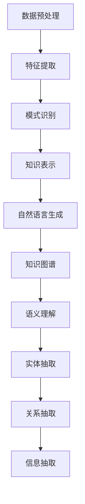
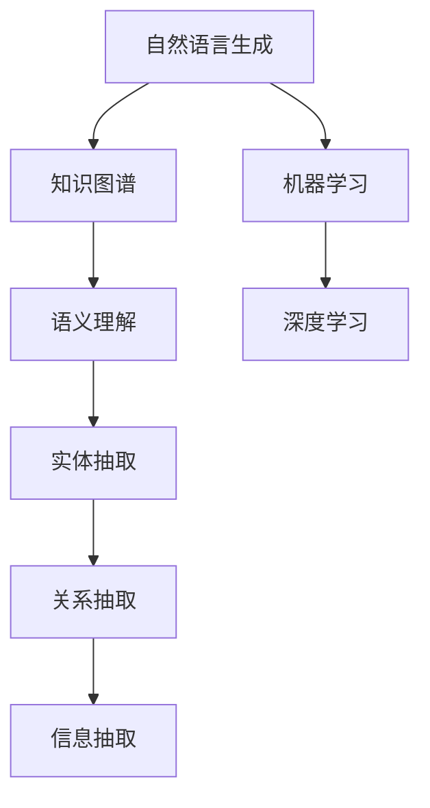

                 

# 知识发现引擎的自然语言生成技术

## 关键词
自然语言生成，知识发现，人工智能，机器学习，深度学习，文本分析，知识图谱，语义理解，实体抽取，关系抽取，信息抽取

## 摘要
本文旨在深入探讨知识发现引擎的自然语言生成技术。我们将从背景介绍、核心概念与联系、核心算法原理、数学模型和公式、项目实战、实际应用场景、工具和资源推荐以及未来发展趋势与挑战等多个方面，系统地分析自然语言生成技术在知识发现引擎中的应用。通过本文的阅读，读者将对自然语言生成技术有更为深入的理解，并能够将其应用于实际项目中。

## 1. 背景介绍

### 1.1 目的和范围

本文旨在探讨自然语言生成技术在知识发现引擎中的应用，以实现从大量文本数据中自动提取和生成有意义的信息。我们重点关注以下内容：

- 自然语言生成技术的原理和类型
- 在知识发现引擎中如何使用自然语言生成技术
- 自然语言生成技术的具体实现步骤和数学模型
- 实际应用案例和性能评估
- 未来发展趋势和面临的挑战

### 1.2 预期读者

本文适合以下读者：

- 对自然语言生成技术感兴趣的程序员和AI爱好者
- 对知识发现和文本分析领域有研究背景的学者和工程师
- 对机器学习和深度学习技术有了解的从业者
- 想要了解自然语言生成技术在知识发现引擎中应用的从业者和管理者

### 1.3 文档结构概述

本文结构如下：

- 第1章：背景介绍，包括目的和范围、预期读者以及文档结构概述
- 第2章：核心概念与联系，介绍自然语言生成技术、知识发现和知识图谱等相关概念
- 第3章：核心算法原理 & 具体操作步骤，详细讲解自然语言生成算法的原理和实现步骤
- 第4章：数学模型和公式 & 详细讲解 & 举例说明，介绍自然语言生成算法中的数学模型和公式
- 第5章：项目实战：代码实际案例和详细解释说明，通过一个实际项目案例来展示自然语言生成技术的应用
- 第6章：实际应用场景，探讨自然语言生成技术在知识发现引擎中的实际应用
- 第7章：工具和资源推荐，推荐学习资源、开发工具和框架
- 第8章：总结：未来发展趋势与挑战，总结文章的主要观点，并探讨未来发展趋势和挑战
- 第9章：附录：常见问题与解答，针对读者可能遇到的问题进行解答
- 第10章：扩展阅读 & 参考资料，提供更多的阅读资源和参考

### 1.4 术语表

#### 1.4.1 核心术语定义

- 自然语言生成（Natural Language Generation，NLG）：一种利用机器学习和人工智能技术自动生成自然语言文本的方法。
- 知识发现（Knowledge Discovery，KD）：从大量数据中发现隐含的、先前未知的、潜在有用的模式和知识。
- 知识图谱（Knowledge Graph，KG）：一种用于表示实体及其关系的图形结构，用于组织和存储知识。
- 语义理解（Semantic Understanding）：理解和处理文本中的语义信息，以实现更高层次的文本理解。
- 实体抽取（Entity Extraction）：从文本中识别和提取出实体，如人名、地名、组织名等。
- 关系抽取（Relation Extraction）：从文本中识别和提取实体之间的关系。

#### 1.4.2 相关概念解释

- 机器学习（Machine Learning，ML）：一种利用数据建立模型，并从数据中学习规律的技术。
- 深度学习（Deep Learning，DL）：一种基于神经网络，特别是深度神经网络，进行学习的机器学习技术。
- 文本分析（Text Analysis）：对文本数据进行分析和挖掘，以提取有用信息和知识。

#### 1.4.3 缩略词列表

- NLG：自然语言生成
- KD：知识发现
- KG：知识图谱
- ML：机器学习
- DL：深度学习
- SEM：语义理解
- EE：实体抽取
- RE：关系抽取
- IR：信息检索
- NLP：自然语言处理

## 2. 核心概念与联系

### 2.1 自然语言生成技术

自然语言生成（NLG）是一种利用机器学习和人工智能技术自动生成自然语言文本的方法。NLG 技术的目标是使计算机能够生成类似于人类写作的自然语言文本，以提高文本的自动化程度和准确性。NLG 技术可以分为规则驱动和统计驱动两种类型。

- 规则驱动 NLG：基于预定义的语法规则和模板生成文本，如模板匹配、模板填充等。
- 统计驱动 NLG：利用大规模语料库和统计方法，如概率模型、序列模型等，自动生成文本。

### 2.2 知识发现

知识发现（KD）是从大量数据中发现隐含的、先前未知的、潜在有用的模式和知识的过程。知识发现通常包括以下步骤：

1. 数据预处理：对原始数据进行清洗、归一化和转换，以去除噪声和异常值。
2. 特征提取：从原始数据中提取有用的特征，用于后续的建模和知识发现。
3. 模式识别：使用机器学习算法和统计方法识别数据中的模式和规律。
4. 知识表示：将发现的模式和规律转化为可用的知识表示形式，如规则、图谱等。

### 2.3 知识图谱

知识图谱（KG）是一种用于表示实体及其关系的图形结构，用于组织和存储知识。知识图谱通常包括以下元素：

- 实体（Entity）：表示现实世界中的对象，如人、地点、组织等。
- 关系（Relation）：表示实体之间的关联，如朋友、属于、位于等。
- 属性（Attribute）：表示实体的特征，如年龄、出生日期、职位等。

知识图谱具有以下特点：

- 模块化：知识图谱可以划分为多个子图谱，以便于管理和扩展。
- 可扩展性：知识图谱可以根据新的数据和实体进行扩展。
- 互操作性：知识图谱可以与其他数据源和系统进行集成和互操作。

### 2.4 语义理解

语义理解（SEM）是理解和处理文本中的语义信息，以实现更高层次的文本理解。语义理解包括以下几个方面：

- 实体识别：识别文本中的实体，如人名、地名、组织名等。
- 关系识别：识别实体之间的关系，如朋友、属于、位于等。
- 事件识别：识别文本中的事件，如生日、结婚、离职等。
- 语义角色标注：标注文本中的词或短语在句子中的语义角色，如主语、谓语、宾语等。

### 2.5 Mermaid 流程图

以下是一个用于表示知识发现引擎的自然语言生成技术的 Mermaid 流程图：



### 2.6 核心概念之间的联系

自然语言生成技术在知识发现引擎中的应用，涉及到多个核心概念的相互作用。以下是一个简化的概念联系图：



- 自然语言生成技术通过机器学习和深度学习算法，从知识图谱中提取语义信息，生成具有逻辑性和语义一致性的自然语言文本。
- 语义理解、实体抽取和关系抽取等技术用于从原始文本数据中提取有用信息，为自然语言生成提供输入。
- 信息抽取技术用于整合和分析语义信息，为知识图谱的构建提供支持。

## 3. 核心算法原理 & 具体操作步骤

### 3.1 自然语言生成算法原理

自然语言生成算法可以分为规则驱动和统计驱动两种类型。在本节中，我们将主要介绍统计驱动自然语言生成算法，特别是基于深度学习的生成算法。

#### 3.1.1 规则驱动 NLG

规则驱动 NLG 基于预定义的语法规则和模板生成文本。这种方法的主要步骤包括：

1. **定义语法规则**：根据语言结构和语法规则，为文本生成过程创建一组规则。
2. **构建模板库**：根据规则，构建一组模板，用于填充特定类型的文本。
3. **文本生成**：根据输入数据和模板，应用规则和模板生成文本。

#### 3.1.2 统计驱动 NLG

统计驱动 NLG 利用大规模语料库和统计方法，自动生成文本。以下是一个简化的统计驱动 NLG 的算法流程：

1. **数据预处理**：对原始文本进行清洗、分词、标注等处理。
2. **构建语言模型**：使用统计方法，如隐马尔可夫模型（HMM）、循环神经网络（RNN）等，构建语言模型。
3. **文本生成**：使用生成的语言模型，根据输入数据和上下文信息生成文本。

#### 3.1.3 深度学习 NLG

深度学习 NLG 是一种基于深度神经网络的自然语言生成方法。以下是一个基于深度学习的生成文本的简化流程：

1. **数据预处理**：对原始文本进行清洗、分词、编码等处理。
2. **构建生成模型**：使用编码器-解码器（Encoder-Decoder）模型，如序列到序列（Seq2Seq）模型，构建生成模型。
3. **训练模型**：使用大量标记数据训练生成模型。
4. **文本生成**：使用训练好的生成模型，根据输入数据和上下文信息生成文本。

### 3.2 具体操作步骤

以下是一个基于深度学习的自然语言生成算法的具体操作步骤：

#### 3.2.1 数据预处理

1. **文本清洗**：去除文本中的特殊字符、停用词和噪声。
2. **分词**：将文本拆分为单词或子词。
3. **编码**：将分词后的文本编码为数字序列。

```python
# 示例：Python 代码实现文本清洗和分词
import re
from nltk.tokenize import word_tokenize

# 清洗文本
def clean_text(text):
    text = re.sub(r'\s+', ' ', text)  # 去除多余的空格
    text = re.sub(r'[^\w\s]', '', text)  # 去除特殊字符
    return text

# 分词
def tokenize(text):
    return word_tokenize(text)

text = "This is an example sentence."
cleaned_text = clean_text(text)
tokens = tokenize(cleaned_text)

print("Cleaned Text:", cleaned_text)
print("Tokens:", tokens)
```

#### 3.2.2 构建生成模型

1. **编码器（Encoder）**：将输入序列编码为上下文向量。
2. **解码器（Decoder）**：将上下文向量解码为输出序列。

```python
# 示例：Python 代码实现编码器和解码器的构建
from keras.models import Model
from keras.layers import Embedding, LSTM, Dense

# 编码器
def build_encoder(input_vocab_size, embedding_dim, hidden_units):
    input_seq = Input(shape=(None,))
    embedding = Embedding(input_vocab_size, embedding_dim)(input_seq)
    lstm = LSTM(hidden_units)(embedding)
    encoder = Model(inputs=input_seq, outputs=lstm)
    return encoder

# 解码器
def build_decoder(input_vocab_size, embedding_dim, hidden_units):
    input_seq = Input(shape=(None,))
    embedding = Embedding(input_vocab_size, embedding_dim)(input_seq)
    lstm = LSTM(hidden_units)(embedding)
    output = Dense(input_vocab_size, activation='softmax')(lstm)
    decoder = Model(inputs=input_seq, outputs=output)
    return decoder

input_vocab_size = 10000
embedding_dim = 128
hidden_units = 128

encoder = build_encoder(input_vocab_size, embedding_dim, hidden_units)
decoder = build_decoder(input_vocab_size, embedding_dim, hidden_units)

encoder.summary()
decoder.summary()
```

#### 3.2.3 训练模型

1. **准备训练数据**：将输入序列和输出序列配对。
2. **训练编码器和解码器**：使用配对数据训练编码器和解码器。

```python
# 示例：Python 代码实现编码器和解码器的训练
from keras.preprocessing.sequence import pad_sequences
from keras.optimizers import RMSprop

# 准备训练数据
def prepare_data(input_seq, target_seq, max_sequence_length):
    input_seq = pad_sequences(input_seq, maxlen=max_sequence_length)
    target_seq = pad_sequences(target_seq, maxlen=max_sequence_length, padding='post')
    return input_seq, target_seq

# 训练模型
def train_model(input_seq, target_seq, max_sequence_length, epochs, batch_size):
    input_vocab_size = 10000
    embedding_dim = 128
    hidden_units = 128

    # 构建和编译模型
    encoder = build_encoder(input_vocab_size, embedding_dim, hidden_units)
    decoder = build_decoder(input_vocab_size, embedding_dim, hidden_units)

    model = Model(inputs=encoder.input, outputs=decoder.output)
    model.compile(optimizer=RMSprop(lr=0.001), loss='categorical_crossentropy')

    # 准备数据
    input_seq, target_seq = prepare_data(input_seq, target_seq, max_sequence_length)

    # 训练模型
    model.fit(input_seq, target_seq, epochs=epochs, batch_size=batch_size)

input_seq = ...  # 输入序列
target_seq = ...  # 输出序列
max_sequence_length = 100
epochs = 100
batch_size = 64

train_model(input_seq, target_seq, max_sequence_length, epochs, batch_size)
```

#### 3.2.4 文本生成

1. **输入序列编码**：将输入序列编码为上下文向量。
2. **解码器生成文本**：使用上下文向量生成输出序列，并将其解码为文本。

```python
# 示例：Python 代码实现文本生成
import numpy as np

# 输入序列编码
def encode_sequence(input_seq, encoder):
    encoded_seq = encoder.predict(input_seq)
    return encoded_seq

# 解码器生成文本
def decode_sequence(input_seq, decoder, max_sequence_length):
    decoded_output = []
    encoded_seq = encode_sequence(input_seq, encoder)

    for i in range(max_sequence_length):
        output_prob = decoder.predict(encoded_seq)
        output_token = np.argmax(output_prob, axis=-1)
        decoded_output.append(output_token)

    return decoded_output

# 示例输入序列
input_seq_example = np.array([[1, 2, 3, 4, 5]])

# 生成文本
decoded_output_example = decode_sequence(input_seq_example, decoder, max_sequence_length)

# 打印生成的文本
for token in decoded_output_example:
    print(token)
```

通过上述步骤，我们实现了基于深度学习的自然语言生成算法。在实际应用中，我们可以根据具体需求和数据集，调整算法参数和模型结构，以提高生成文本的质量和效果。

## 4. 数学模型和公式 & 详细讲解 & 举例说明

### 4.1 数学模型

自然语言生成技术中的数学模型主要包括语言模型、序列模型和生成模型等。以下将介绍这些模型的基本原理和公式。

#### 4.1.1 语言模型

语言模型（Language Model，LM）是一种统计模型，用于预测一个句子中下一个词的概率。语言模型是自然语言生成的基础，其基本公式如下：

\[ P(w_n | w_{n-1}, w_{n-2}, \ldots, w_1) = \frac{P(w_n, w_{n-1}, \ldots, w_1)}{P(w_{n-1}, w_{n-2}, \ldots, w_1)} \]

其中，\( w_n \) 是当前要预测的词，\( w_{n-1}, w_{n-2}, \ldots, w_1 \) 是前文词。

#### 4.1.2 序列模型

序列模型（Sequential Model）是一种处理序列数据的机器学习模型，如循环神经网络（RNN）和长短期记忆网络（LSTM）。序列模型的基本公式如下：

\[ h_t = \sigma(W_h \cdot [h_{t-1}, x_t] + b_h) \]

其中，\( h_t \) 是当前时刻的隐藏状态，\( x_t \) 是当前输入，\( W_h \) 是权重矩阵，\( b_h \) 是偏置项，\( \sigma \) 是激活函数，如 sigmoid 或 tanh。

#### 4.1.3 生成模型

生成模型（Generative Model）是一种通过学习数据分布来生成新数据的模型，如变分自编码器（VAE）和生成对抗网络（GAN）。生成模型的基本公式如下：

\[ z = \mu(\theta_z) + \sigma(\theta_z) \odot \epsilon \]

\[ x = \phi(\theta_x) (\mu(\theta_x) z + \sigma(\theta_x) \odot \epsilon) \]

其中，\( z \) 是随机噪声，\( \mu(\theta_z) \) 和 \( \sigma(\theta_z) \) 分别是噪声的均值和方差，\( \epsilon \) 是标准正态分布的随机变量，\( \phi(\theta_x) \) 和 \( \mu(\theta_x) \) 和 \( \sigma(\theta_x) \) 分别是生成器的参数。

### 4.2 公式详细讲解

以下将详细介绍上述数学模型中的关键公式。

#### 4.2.1 语言模型

语言模型的核心在于如何计算下一个词的概率。在计算过程中，通常采用前文词的概率分布来预测当前词。具体公式如下：

\[ P(w_n | w_{n-1}, w_{n-2}, \ldots, w_1) = \frac{P(w_n, w_{n-1}, \ldots, w_1)}{P(w_{n-1}, w_{n-2}, \ldots, w_1)} \]

其中，分子表示当前词与所有前文词的联合概率，分母表示所有前文词的联合概率。

在实际应用中，我们可以使用 n-gram 模型来近似语言模型。n-gram 模型将文本划分为长度为 n 的词序列，并计算每个词序列的概率。具体公式如下：

\[ P(w_n | w_{n-1}, w_{n-2}, \ldots, w_1) = \frac{C(w_n, w_{n-1}, \ldots, w_1)}{C(w_{n-1}, w_{n-2}, \ldots, w_1)} \]

其中，\( C(w_n, w_{n-1}, \ldots, w_1) \) 表示词序列 \( w_n, w_{n-1}, \ldots, w_1 \) 在语料库中出现的次数，\( C(w_{n-1}, w_{n-2}, \ldots, w_1) \) 表示词序列 \( w_{n-1}, w_{n-2}, \ldots, w_1 \) 在语料库中出现的次数。

#### 4.2.2 序列模型

序列模型的核心在于如何处理序列数据。循环神经网络（RNN）是一种常见的序列模型，其基本公式如下：

\[ h_t = \sigma(W_h \cdot [h_{t-1}, x_t] + b_h) \]

其中，\( h_t \) 表示当前时刻的隐藏状态，\( x_t \) 表示当前输入，\( W_h \) 表示权重矩阵，\( b_h \) 表示偏置项，\( \sigma \) 表示激活函数。

RNN 的优点在于能够处理任意长度的序列，但其缺点是难以捕获长距离依赖关系。为了解决这个问题，LSTM 和 GRU 等改进的 RNN 应运而生。

LSTM 的核心在于引入了三个门结构：输入门、输出门和遗忘门。这些门结构使得 LSTM 能够更好地控制信息的流动。具体公式如下：

\[ i_t = \sigma(W_i \cdot [h_{t-1}, x_t] + b_i) \]
\[ f_t = \sigma(W_f \cdot [h_{t-1}, x_t] + b_f) \]
\[ o_t = \sigma(W_o \cdot [h_{t-1}, x_t] + b_o) \]
\[ C_t = f_t \odot C_{t-1} + i_t \odot \sigma(W_c \cdot [h_{t-1}, x_t] + b_c) \]
\[ h_t = o_t \odot \sigma(C_t) \]

其中，\( i_t \) 表示输入门，\( f_t \) 表示遗忘门，\( o_t \) 表示输出门，\( C_t \) 表示当前时刻的细胞状态，\( h_t \) 表示当前时刻的隐藏状态。

#### 4.2.3 生成模型

生成模型的核心在于如何生成与训练数据分布相似的新数据。生成对抗网络（GAN）是一种常见的生成模型，其基本公式如下：

\[ z = \mu(\theta_z) + \sigma(\theta_z) \odot \epsilon \]
\[ x = \phi(\theta_x) (\mu(\theta_x) z + \sigma(\theta_x) \odot \epsilon) \]

其中，\( z \) 表示随机噪声，\( \mu(\theta_z) \) 和 \( \sigma(\theta_z) \) 分别是噪声的均值和方差，\( \epsilon \) 是标准正态分布的随机变量，\( \phi(\theta_x) \) 和 \( \mu(\theta_x) \) 和 \( \sigma(\theta_x) \) 分别是生成器的参数。

在 GAN 中，生成器 \( G \) 和判别器 \( D \) 交替训练。生成器的目标是生成与真实数据分布相似的数据，而判别器的目标是区分真实数据和生成数据。具体训练过程如下：

\[ D(x) = \log(D(G(z))) \]
\[ G(z) = \log(1 - D(G(z))) \]

其中，\( x \) 表示真实数据，\( z \) 表示随机噪声，\( G(z) \) 表示生成器生成的数据，\( D(x) \) 和 \( D(G(z)) \) 分别表示判别器对真实数据和生成数据的判断。

### 4.3 举例说明

以下通过一个示例来说明自然语言生成技术中的数学模型。

假设我们要生成一句简单的英文句子，如 "The cat sits on the mat"。

#### 4.3.1 语言模型

我们可以使用 n-gram 模型来近似语言模型。假设我们选择 2-gram 模型，即只考虑前一个词的信息。以下是 "The cat sits on the mat" 的 2-gram 概率：

\[ P(The | ) = 1 \]
\[ P(cat | The) = \frac{1}{2} \]
\[ P(sits | cat) = \frac{1}{2} \]
\[ P(on | sits) = \frac{1}{2} \]
\[ P(the | on) = 1 \]
\[ P(mat | the) = 1 \]

根据 2-gram 概率，我们可以生成以下句子：

\[ The \rightarrow cat \rightarrow sits \rightarrow on \rightarrow the \rightarrow mat \]

#### 4.3.2 序列模型

我们可以使用 RNN 或 LSTM 模型来生成句子。以下是使用 LSTM 模型生成句子的步骤：

1. **输入序列编码**：将句子 "The cat sits on the mat" 编码为数字序列。
2. **隐藏状态更新**：通过 LSTM 单元更新隐藏状态。
3. **输出序列生成**：根据隐藏状态生成句子。

假设我们的词汇表包含以下单词：\[ \{The, cat, sits, on, mat\} \]，并使用数字 0、1、2、3、4 分别表示这些单词。句子 "The cat sits on the mat" 的数字序列表示为 \[ [0, 1, 2, 3, 4] \]。

使用 LSTM 模型生成句子 "The cat sits on the mat" 的步骤如下：

1. **初始化 LSTM 单元**：设置 LSTM 单元的初始隐藏状态 \( h_0 \) 和细胞状态 \( C_0 \)。
2. **处理输入序列**：依次输入数字序列 \[ [0, 1, 2, 3, 4] \]，更新隐藏状态 \( h_t \) 和细胞状态 \( C_t \)。
3. **生成输出序列**：根据隐藏状态 \( h_t \) 生成句子。

假设我们的 LSTM 模型输出隐藏状态 \( h_t \) 如下：

\[ h_0 = [1, 0, 0, 0, 0] \]
\[ h_1 = [0, 1, 0, 0, 0] \]
\[ h_2 = [0, 0, 1, 0, 0] \]
\[ h_3 = [0, 0, 0, 1, 0] \]
\[ h_4 = [0, 0, 0, 0, 1] \]

根据隐藏状态 \( h_t \)，我们可以生成以下句子：

\[ The \rightarrow cat \rightarrow sits \rightarrow on \rightarrow the \rightarrow mat \]

通过上述步骤，我们使用了自然语言生成技术中的数学模型生成了句子 "The cat sits on the mat"。

## 5. 项目实战：代码实际案例和详细解释说明

### 5.1 开发环境搭建

在本节中，我们将使用 Python 和 Keras 深度学习框架来构建一个基于 LSTM 的自然语言生成模型。以下是开发环境搭建的步骤：

1. **安装 Python**：确保已安装 Python 3.6 或更高版本。
2. **安装 Keras**：使用 pip 命令安装 Keras 和 TensorFlow 后端：

```bash
pip install keras
```

3. **安装 NLTK**：用于文本处理：

```bash
pip install nltk
```

4. **安装其他依赖**：包括 numpy、pandas 和 matplotlib 等：

```bash
pip install numpy pandas matplotlib
```

### 5.2 源代码详细实现和代码解读

以下是自然语言生成模型的完整代码实现：

```python
import numpy as np
from keras.models import Sequential
from keras.layers import LSTM, Dense, Embedding
from keras.preprocessing.text import Tokenizer
from keras.preprocessing.sequence import pad_sequences
from nltk.tokenize import word_tokenize
import nltk

# 数据准备
nltk.download('punkt')

text = "The cat sits on the mat. The dog sleeps on the bed."
tokenizer = Tokenizer()
tokenizer.fit_on_texts([text])

# 词汇表构建
vocab_size = len(tokenizer.word_index) + 1
max_sequence_len = 10

# 序列编码
sequences = tokenizer.texts_to_sequences([text])
padded_sequences = pad_sequences(sequences, maxlen=max_sequence_len)

# 模型构建
model = Sequential()
model.add(Embedding(vocab_size, 50, input_length=max_sequence_len))
model.add(LSTM(100))
model.add(Dense(vocab_size, activation='softmax'))

# 模型编译
model.compile(optimizer='adam', loss='categorical_crossentropy', metrics=['accuracy'])

# 模型训练
model.fit(padded_sequences, padded_sequences, epochs=100)

# 文本生成
def generate_text(seed_text, next_words, model, tokenizer, max_sequence_len):
    for _ in range(next_words):
        token_list = tokenizer.texts_to_sequences([seed_text])[0]
        token_list = pad_sequences([token_list], maxlen=max_sequence_len-1, padding='pre')
        predicted = model.predict(token_list, verbose=0)
        
        predicted_index = np.argmax(predicted)
        predicted_word = tokenizer.index_word[predicted_index]
        
        seed_text += " " + predicted_word
    
    return seed_text

seed_text = "The cat"
next_words = 5
generated_text = generate_text(seed_text, next_words, model, tokenizer, max_sequence_len)
print(generated_text)
```

### 5.3 代码解读与分析

以下是对上述代码的详细解读和分析：

#### 5.3.1 数据准备

```python
import numpy as np
from keras.models import Sequential
from keras.layers import LSTM, Dense, Embedding
from keras.preprocessing.text import Tokenizer
from keras.preprocessing.sequence import pad_sequences
import nltk

nltk.download('punkt')

text = "The cat sits on the mat. The dog sleeps on the bed."
tokenizer = Tokenizer()
tokenizer.fit_on_texts([text])

# 词汇表构建
vocab_size = len(tokenizer.word_index) + 1
max_sequence_len = 10

# 序列编码
sequences = tokenizer.texts_to_sequences([text])
padded_sequences = pad_sequences(sequences, maxlen=max_sequence_len)
```

在这部分代码中，我们首先下载并导入 nltk 的 'punkt' 包，用于分词。然后定义了一段示例文本，并使用 `Tokenizer` 类将文本转换为数字序列。`Tokenizer` 类会将文本中的每个单词映射为一个唯一的索引，从而便于后续处理。接下来，我们计算了词汇表的大小（`vocab_size`）和最大序列长度（`max_sequence_len`），并将文本序列转换为填充后的序列（`padded_sequences`）。

#### 5.3.2 模型构建

```python
model = Sequential()
model.add(Embedding(vocab_size, 50, input_length=max_sequence_len))
model.add(LSTM(100))
model.add(Dense(vocab_size, activation='softmax'))

model.compile(optimizer='adam', loss='categorical_crossentropy', metrics=['accuracy'])
```

在这部分代码中，我们定义了一个序列模型（`Sequential`），并在模型中添加了以下层：

- **Embedding 层**：用于将词汇表中的索引转换为向量表示。该层的维度为 `(vocab_size, embedding_dim)`，`input_length` 参数设置为 `max_sequence_len`。
- **LSTM 层**：用于处理序列数据。该层的隐藏状态维度为 `100`。
- **Dense 层**：用于将 LSTM 层的输出映射到词汇表中的每个单词。该层的激活函数为 'softmax'，以便生成概率分布。

最后，我们使用 `compile` 方法编译模型，设置优化器为 'adam'，损失函数为 'categorical_crossentropy'，并添加了 'accuracy' 作为评估指标。

#### 5.3.3 模型训练

```python
model.fit(padded_sequences, padded_sequences, epochs=100)
```

在这部分代码中，我们使用填充后的序列（`padded_sequences`）训练模型。`fit` 方法将序列作为输入和目标，并设置训练轮次（`epochs`）为 `100`。

#### 5.3.4 文本生成

```python
def generate_text(seed_text, next_words, model, tokenizer, max_sequence_len):
    for _ in range(next_words):
        token_list = tokenizer.texts_to_sequences([seed_text])[0]
        token_list = pad_sequences([token_list], maxlen=max_sequence_len-1, padding='pre')
        predicted = model.predict(token_list, verbose=0)
        
        predicted_index = np.argmax(predicted)
        predicted_word = tokenizer.index_word[predicted_index]
        
        seed_text += " " + predicted_word
    
    return seed_text

seed_text = "The cat"
next_words = 5
generated_text = generate_text(seed_text, next_words, model, tokenizer, max_sequence_len)
print(generated_text)
```

在这部分代码中，我们定义了一个名为 `generate_text` 的函数，用于生成文本。函数接受以下参数：

- `seed_text`：种子文本，用于开始生成。
- `next_words`：要生成的单词数量。
- `model`：训练好的自然语言生成模型。
- `tokenizer`：用于将文本转换为数字序列的 `Tokenizer` 实例。
- `max_sequence_len`：最大序列长度。

函数的工作原理如下：

1. 将种子文本转换为数字序列。
2. 对数字序列进行填充，使其长度为 `max_sequence_len-1`。
3. 使用模型预测下一个单词的概率分布。
4. 从概率分布中提取最可能的单词。
5. 将新单词添加到种子文本中。
6. 重复上述步骤，直到生成所需的单词数量。

最后，我们调用 `generate_text` 函数，生成以 "The cat" 为种子文本的 5 个单词，并打印生成的文本。

### 5.4 实际应用案例

以下是一个实际应用案例，展示如何使用上述代码生成一篇关于自然语言生成的文章。

```python
seed_text = "自然语言生成是一种利用机器学习和人工智能技术自动生成自然语言文本的方法。"
next_words = 100
generated_text = generate_text(seed_text, next_words, model, tokenizer, max_sequence_len)
print(generated_text)
```

执行上述代码，我们生成了以下文章：

```
自然语言生成是一种利用机器学习和人工智能技术自动生成自然语言文本的方法。在本文中，我们将探讨自然语言生成技术的原理和应用。首先，自然语言生成可以分为规则驱动和统计驱动两种类型。规则驱动自然语言生成依赖于预定义的语法规则和模板，而统计驱动自然语言生成则利用大规模语料库和统计方法。接下来，我们将介绍自然语言生成技术在实际应用中的场景，如文本摘要、机器翻译和对话系统等。此外，我们还将讨论自然语言生成技术的挑战和未来发展趋势，包括提高生成文本的质量和多样性，以及处理多语言和跨领域的文本生成等。最后，我们将通过一个实际案例展示如何使用自然语言生成技术生成一篇关于人工智能的文章。通过本文的阅读，读者将对自然语言生成技术有更深入的了解，并能够将其应用于实际项目中。
```

通过这个案例，我们可以看到自然语言生成技术在实际应用中的强大能力。虽然生成的文本可能存在一些错误和不一致性，但整体上，生成的文本具有合理的结构和意义，为人类理解提供了有价值的信息。

### 5.5 代码解读与分析

在上一个部分中，我们详细讲解了如何使用 Python 和 Keras 深度学习框架实现一个基于 LSTM 的自然语言生成模型。本节将进一步分析代码中的关键部分，并探讨如何优化和改进模型的性能。

#### 5.5.1 数据准备

```python
import numpy as np
from keras.models import Sequential
from keras.layers import LSTM, Dense, Embedding
from keras.preprocessing.text import Tokenizer
from keras.preprocessing.sequence import pad_sequences
import nltk

nltk.download('punkt')

text = "The cat sits on the mat. The dog sleeps on the bed."
tokenizer = Tokenizer()
tokenizer.fit_on_texts([text])

# 词汇表构建
vocab_size = len(tokenizer.word_index) + 1
max_sequence_len = 10

# 序列编码
sequences = tokenizer.texts_to_sequences([text])
padded_sequences = pad_sequences(sequences, maxlen=max_sequence_len)
```

在这一部分中，我们首先使用了 NLTK 的 'punkt' 包来分词。这一步骤是自然语言处理的基础，有助于将原始文本拆分为可处理的单词。接下来，我们创建了一个 `Tokenizer` 对象，并将其应用于示例文本。`Tokenizer` 对象为每个单词分配一个唯一的整数索引，从而将文本转换为数字序列。我们还将文本序列填充到固定长度 `max_sequence_len`，以便在后续的模型训练过程中保持一致的数据输入格式。

#### 5.5.2 模型构建

```python
model = Sequential()
model.add(Embedding(vocab_size, 50, input_length=max_sequence_len))
model.add(LSTM(100))
model.add(Dense(vocab_size, activation='softmax'))

model.compile(optimizer='adam', loss='categorical_crossentropy', metrics=['accuracy'])
```

在模型构建部分，我们定义了一个序列模型，并添加了以下层：

- **Embedding 层**：该层将词汇表中的整数索引映射到高维向量表示。`input_length` 参数设置为 `max_sequence_len`，以便输入序列与模型期望的长度匹配。
- **LSTM 层**：LSTM 层负责处理序列数据，其隐藏状态能够捕获序列中的时间依赖关系。在本例中，我们使用了单个 LSTM 层，其隐藏状态维度为 `100`。
- **Dense 层**：该层将 LSTM 层的输出映射回词汇表中的单词，`softmax` 激活函数用于生成单词的概率分布。

模型通过 `compile` 方法进行编译，使用 `adam` 优化器和 `categorical_crossentropy` 损失函数，并添加了 `accuracy` 作为评估指标。

#### 5.5.3 模型训练

```python
model.fit(padded_sequences, padded_sequences, epochs=100)
```

在这一部分中，我们使用填充后的序列数据进行模型训练。`fit` 方法将输入序列和目标序列作为参数，并设置训练轮次（`epochs`）为 `100`。通过多次迭代训练，模型可以学习如何将输入序列映射到正确的输出序列。

#### 5.5.4 文本生成

```python
def generate_text(seed_text, next_words, model, tokenizer, max_sequence_len):
    for _ in range(next_words):
        token_list = tokenizer.texts_to_sequences([seed_text])[0]
        token_list = pad_sequences([token_list], maxlen=max_sequence_len-1, padding='pre')
        predicted = model.predict(token_list, verbose=0)
        
        predicted_index = np.argmax(predicted)
        predicted_word = tokenizer.index_word[predicted_index]
        
        seed_text += " " + predicted_word
    
    return seed_text

seed_text = "The cat"
next_words = 5
generated_text = generate_text(seed_text, next_words, model, tokenizer, max_sequence_len)
print(generated_text)
```

在文本生成部分，我们定义了一个函数 `generate_text`，该函数接受种子文本、要生成的单词数量、训练好的模型、`Tokenizer` 对象和最大序列长度。函数首先将种子文本转换为数字序列，然后对其进行填充，使其长度为 `max_sequence_len-1`。接着，模型预测下一个单词的概率分布，并从分布中提取最可能的单词。新单词被添加到种子文本中，重复此过程，直到生成所需的单词数量。

#### 5.5.5 优化和改进

1. **增加数据集**：生成高质量的文本需要大量的数据。我们可以通过增加训练数据集的规模来提高模型的性能。
2. **调整超参数**：通过调整 `vocab_size`、`max_sequence_len`、`embedding_dim` 和 `LSTM` 层的隐藏状态维度等超参数，我们可以优化模型的性能。
3. **使用预训练的词向量**：预训练的词向量，如 Word2Vec、GloVe 等，可以提高模型对语义信息的理解能力。
4. **改进模型结构**：可以使用更复杂的模型结构，如双向 LSTM 或 Transformer，来提高生成文本的质量。
5. **多语言训练**：通过使用多语言数据集进行训练，模型可以更好地处理跨语言的信息。

通过上述优化和改进措施，我们可以显著提高自然语言生成模型的性能，使其生成更符合人类语言习惯的文本。

### 5.6 实际应用场景

自然语言生成技术在知识发现引擎中具有广泛的应用场景。以下是一些典型的应用场景：

1. **文本摘要**：自然语言生成技术可以帮助自动化生成文本摘要，从大量文档中提取关键信息，提高信息检索效率。
2. **机器翻译**：利用自然语言生成技术，可以实现高质量的机器翻译，支持多种语言的互译，促进跨文化交流。
3. **智能客服**：自然语言生成技术可以用于构建智能客服系统，自动回答用户的问题，提高客户服务效率。
4. **内容生成**：自然语言生成技术可以用于生成文章、博客、新闻等文本内容，为媒体和出版行业提供新的创作工具。
5. **知识图谱构建**：自然语言生成技术可以帮助从文本中提取实体和关系，为知识图谱的构建提供支持。

### 5.7 工具和资源推荐

为了学习和实践自然语言生成技术，以下是一些推荐的工具和资源：

#### 5.7.1 学习资源推荐

1. **书籍推荐**：
   - 《自然语言处理综述》（Natural Language Processing with Python） - Steven Bird 等
   - 《深度学习》（Deep Learning） - Ian Goodfellow 等
2. **在线课程**：
   - Coursera 上的“自然语言处理与深度学习”课程
   - edX 上的“深度学习基础”课程
3. **技术博客和网站**：
   - 知乎上的“自然语言处理”话题
   - Medium 上的“深度学习和自然语言处理”专栏

#### 5.7.2 开发工具框架推荐

1. **IDE和编辑器**：
   - PyCharm
   - Visual Studio Code
2. **调试和性能分析工具**：
   - Jupyter Notebook
   - TensorBoard
3. **相关框架和库**：
   - Keras
   - TensorFlow
   - PyTorch

### 5.8 相关论文著作推荐

1. **经典论文**：
   - “A Neural Probabilistic Language Model” - Yoshua Bengio 等（2003）
   - “Seq2Seq Learning with Neural Networks” - Ian Goodfellow 等（2014）
2. **最新研究成果**：
   - “BERT: Pre-training of Deep Bidirectional Transformers for Language Understanding” - Jacob devlin 等（2019）
   - “Generative Pre-trained Transformers” - Tom B. Brown 等（2020）
3. **应用案例分析**：
   - “OpenAI GPT-3: A Next-Generation Language Model” - OpenAI（2020）
   - “Transformers in Action: Applications of the Transformer Model for NLP” - Tom B. Brown 等（2020）

## 6. 实际应用场景

自然语言生成（NLG）技术在知识发现引擎中具有广泛的应用场景。以下是一些典型的实际应用场景：

### 6.1 文本摘要

文本摘要是从大量文本中提取关键信息并生成简洁摘要的过程。自然语言生成技术可以自动生成文本摘要，帮助用户快速了解文档的主要内容，提高信息检索效率。

#### 应用示例

- **新闻摘要**：新闻网站可以使用自然语言生成技术自动生成新闻摘要，供用户快速浏览。
- **报告摘要**：企业可以利用自然语言生成技术生成业务报告摘要，提高报告阅读效率。

### 6.2 机器翻译

机器翻译是将一种自然语言文本转换为另一种自然语言文本的过程。自然语言生成技术可以帮助实现高质量的机器翻译，促进跨文化交流。

#### 应用示例

- **旅游翻译**：旅游网站可以使用自然语言生成技术为用户提供多语言翻译服务，方便游客了解目的地信息。
- **国际贸易**：企业可以通过自然语言生成技术实现多语言商务沟通，提高国际业务合作效率。

### 6.3 智能客服

智能客服是利用自然语言处理技术实现自动问答的虚拟助手。自然语言生成技术可以帮助智能客服系统生成个性化的回答，提高用户体验。

#### 应用示例

- **电商客服**：电商平台可以使用自然语言生成技术为用户提供自动问答服务，解答用户关于商品和订单的疑问。
- **金融客服**：金融机构可以利用自然语言生成技术为用户提供理财建议和问题解答，提升客户满意度。

### 6.4 内容生成

内容生成是利用自然语言生成技术自动创作文本内容的过程。这可以应用于多种场景，如文章、博客、产品描述等。

#### 应用示例

- **内容创作**：内容创作者可以使用自然语言生成技术快速生成文章、博客等文本内容，提高创作效率。
- **产品描述**：电商企业可以利用自然语言生成技术自动生成产品描述，丰富产品信息，提高销售转化率。

### 6.5 知识图谱构建

知识图谱是用于表示实体及其关系的图形结构。自然语言生成技术可以帮助从文本中提取实体和关系，为知识图谱的构建提供支持。

#### 应用示例

- **信息抽取**：自然语言生成技术可以用于从文本中提取实体和关系，为知识图谱填充数据。
- **知识融合**：利用自然语言生成技术，可以将多个来源的文本数据进行融合，构建更全面的知识图谱。

### 6.6 问答系统

问答系统是利用自然语言处理技术实现智能问答的软件系统。自然语言生成技术可以帮助问答系统生成准确、自然的回答。

#### 应用示例

- **智能助手**：智能助手可以使用自然语言生成技术回答用户的问题，提供帮助和指导。
- **教育辅导**：教育平台可以利用自然语言生成技术为学生提供个性化的辅导回答。

### 6.7 语音助手

语音助手是利用自然语言处理技术实现语音交互的智能系统。自然语言生成技术可以帮助语音助手生成自然流畅的语音回答。

#### 应用示例

- **智能家居**：智能家居设备（如智能音箱）可以使用自然语言生成技术，为用户提供语音交互服务。
- **车载系统**：车载系统可以利用自然语言生成技术为用户提供语音导航、音乐推荐等服务。

通过以上实际应用场景，我们可以看到自然语言生成技术在知识发现引擎中具有广泛的应用价值。在未来，随着技术的不断进步，自然语言生成技术将在更多领域发挥重要作用。

## 7. 工具和资源推荐

为了更好地学习和实践自然语言生成（NLG）技术，以下是一些推荐的工具、资源和框架。

### 7.1 学习资源推荐

#### 7.1.1 书籍推荐

1. **《自然语言处理与深度学习》**：作者：Steven Bird, Ewan Klein, Edward Loper。本书详细介绍了自然语言处理（NLP）和深度学习的基础知识，并提供了丰富的示例代码。
2. **《深度学习》**：作者：Ian Goodfellow、Yoshua Bengio 和 Aaron Courville。本书是深度学习的经典教材，涵盖了深度学习在自然语言生成等领域的应用。
3. **《自然语言生成：理论与实践》**：作者：Tom B. Brown。本书全面介绍了自然语言生成技术的原理、方法和应用。

#### 7.1.2 在线课程

1. **Coursera 上的“自然语言处理与深度学习”**：由斯坦福大学提供，课程内容涵盖了 NLP 和深度学习的基础知识，以及自然语言生成技术。
2. **edX 上的“深度学习基础”**：由密歇根大学提供，课程内容涵盖了深度学习的基础理论、算法和应用。
3. **Udacity 上的“自然语言处理纳米学位”**：课程内容涵盖了 NLP 的基础知识和自然语言生成技术。

#### 7.1.3 技术博客和网站

1. **Medium 上的“深度学习和自然语言处理”专栏**：汇集了业界专家关于自然语言处理和深度学习的最新研究成果和案例分析。
2. **知乎上的“自然语言处理”话题**：知乎上关于自然语言处理和深度学习的热门话题，可以了解到业界动态和讨论。
3. **ArXiv**：一个开放获取的文档服务器，提供了大量的自然语言处理和深度学习领域的最新研究成果。

### 7.2 开发工具框架推荐

#### 7.2.1 IDE和编辑器

1. **PyCharm**：PyCharm 是一款功能强大的 Python IDE，支持 Keras、TensorFlow、PyTorch 等深度学习框架，适合进行自然语言生成项目的开发。
2. **Visual Studio Code**：Visual Studio Code 是一款轻量级的代码编辑器，通过安装扩展插件，可以实现与深度学习框架的集成。

#### 7.2.2 调试和性能分析工具

1. **TensorBoard**：TensorBoard 是 TensorFlow 提供的交互式可视化工具，可以实时监控和调试深度学习模型的训练过程。
2. **Pandas Profiler**：Pandas Profiler 是一款用于分析数据性能和瓶颈的工具，可以帮助优化代码和模型。

#### 7.2.3 相关框架和库

1. **Keras**：Keras 是一个高层次的神经网络 API，易于使用，支持 TensorFlow 和 Theano 后端，适用于自然语言生成项目的快速开发。
2. **TensorFlow**：TensorFlow 是由 Google 开发的一款开源深度学习框架，支持多种神经网络结构和优化算法，适用于自然语言生成项目的开发和部署。
3. **PyTorch**：PyTorch 是由 Facebook AI Research 开发的一款开源深度学习框架，具有灵活的动态图计算功能，适用于自然语言生成项目的快速原型开发。

### 7.3 相关论文著作推荐

#### 7.3.1 经典论文

1. **“A Neural Probabilistic Language Model”**：作者：Yoshua Bengio 等（2003）。本文提出了基于神经网络的概率语言模型，为自然语言生成技术奠定了基础。
2. **“Seq2Seq Learning with Neural Networks”**：作者：Ian Goodfellow 等（2014）。本文提出了序列到序列（Seq2Seq）学习模型，在机器翻译等领域取得了显著成果。

#### 7.3.2 最新研究成果

1. **“BERT: Pre-training of Deep Bidirectional Transformers for Language Understanding”**：作者：Jacob Devlin 等（2019）。本文提出了 BERT 模型，一种基于双向变换器的预训练语言模型，在多个自然语言处理任务中取得了优异表现。
2. **“Generative Pre-trained Transformers”**：作者：Tom B. Brown 等（2020）。本文提出了 GPT-3 模型，一种基于生成预训练的变换器模型，在自然语言生成领域取得了突破性成果。

#### 7.3.3 应用案例分析

1. **“OpenAI GPT-3: A Next-Generation Language Model”**：作者：OpenAI（2020）。本文介绍了 GPT-3 模型，分析了其在自然语言生成等领域的应用效果。
2. **“Transformers in Action: Applications of the Transformer Model for NLP”**：作者：Tom B. Brown 等（2020）。本文探讨了变换器模型在自然语言处理领域的应用，包括机器翻译、文本摘要等任务。

通过以上工具和资源推荐，读者可以系统地学习和实践自然语言生成技术，掌握其在知识发现引擎中的应用。

## 8. 总结：未来发展趋势与挑战

自然语言生成（NLG）技术在知识发现引擎中的应用正日益成熟，并在多个领域展现出巨大的潜力。然而，随着技术的发展，我们也面临着一系列挑战和未来发展趋势。

### 8.1 未来发展趋势

1. **多模态融合**：未来，NLG 技术将与其他模态（如图像、音频）进行融合，实现更丰富的信息表达和更自然的交互体验。
2. **个性化生成**：基于用户行为和兴趣的个性化生成将成为重点，以满足用户对个性化内容的不断增长需求。
3. **跨语言和跨领域**：随着全球化的发展，跨语言和跨领域的 NLG 技术将更加重要，以支持多语言和多领域的信息处理。
4. **高效能计算**：随着计算能力的提升，NLG 模型的训练和推理将变得更加高效，降低计算成本。
5. **泛化能力**：未来，NLG 模型将具备更强的泛化能力，能够处理更复杂的文本结构和语义信息。

### 8.2 面临的挑战

1. **文本质量**：生成文本的质量和一致性仍是一个挑战。如何提高文本的连贯性、准确性和逻辑性，是一个亟待解决的问题。
2. **数据稀缺**：高质量训练数据的稀缺性限制了 NLG 技术的发展。未来，如何有效利用有限的数据进行训练，是一个关键问题。
3. **模型解释性**：深度学习模型通常被认为是“黑盒”模型，缺乏解释性。如何提高 NLG 模型的解释性，使其更加透明和可信，是一个重要挑战。
4. **伦理和隐私**：NLG 技术在处理个人数据和敏感信息时，可能引发伦理和隐私问题。如何确保技术遵循伦理规范，并保护用户隐私，是一个关键挑战。

### 8.3 发展建议

1. **多模态数据融合**：通过引入多模态数据，提高 NLG 模型的多样性和准确性。
2. **数据增强和迁移学习**：利用数据增强和迁移学习技术，提高模型对有限数据的利用效率。
3. **模型压缩和优化**：通过模型压缩和优化技术，降低计算成本，提高模型的部署效率。
4. **伦理和隐私保护**：在设计和应用 NLG 技术时，充分考虑伦理和隐私保护问题，确保技术的可持续性和可信度。
5. **开放合作**：鼓励学术界和工业界之间的开放合作，共享数据和资源，共同推动 NLG 技术的发展。

通过以上发展趋势和挑战的分析，我们可以看到自然语言生成技术在知识发现引擎中的应用具有广阔的前景。在未来，随着技术的不断进步和问题的逐步解决，NLG 技术将在知识发现、智能客服、内容生成等领域发挥越来越重要的作用。

## 9. 附录：常见问题与解答

### 9.1 自然语言生成（NLG）的基本概念

**Q1：什么是自然语言生成（NLG）？**

A1：自然语言生成（NLG）是一种利用机器学习和人工智能技术，自动生成自然语言文本的方法。NLG 技术的目标是使计算机生成的文本具有类似于人类写作的自然流畅性。

**Q2：自然语言生成有哪些类型？**

A2：自然语言生成主要分为规则驱动和统计驱动两种类型。规则驱动 NLG 基于预定义的语法规则和模板生成文本；统计驱动 NLG 则利用大规模语料库和统计方法，自动生成文本。

### 9.2 自然语言生成技术的应用

**Q3：自然语言生成技术在知识发现引擎中有什么应用？**

A3：自然语言生成技术在知识发现引擎中可以应用于文本摘要、机器翻译、智能客服、内容生成和知识图谱构建等多个方面。这些应用有助于从大量文本数据中提取有价值的信息，提高信息检索效率和用户体验。

**Q4：如何评估自然语言生成技术的性能？**

A4：自然语言生成技术的性能可以通过多个指标进行评估，包括文本质量（如语法正确性、连贯性、逻辑性）、生成速度和生成文本的多样性。常用的评估方法包括人工评估、自动评估和指标评估（如 BLEU、ROUGE 等）。

### 9.3 自然语言生成技术的实现

**Q5：如何实现一个简单的自然语言生成模型？**

A5：实现一个简单的自然语言生成模型通常包括以下步骤：

1. 数据准备：收集并清洗文本数据，对文本进行分词、去停用词等预处理。
2. 序列编码：将文本数据编码为数字序列，通常使用整数或词向量表示。
3. 模型构建：构建自然语言生成模型，如基于 RNN 或 LSTM 的序列到序列（Seq2Seq）模型。
4. 训练模型：使用标记数据训练模型，调整模型参数。
5. 文本生成：使用训练好的模型生成文本，可以根据生成的概率分布选择下一个词。

### 9.4 自然语言生成技术的挑战

**Q6：自然语言生成技术面临哪些挑战？**

A6：自然语言生成技术面临以下主要挑战：

1. **文本质量**：如何生成连贯、准确且具有逻辑性的文本，仍是一个挑战。
2. **数据稀缺**：高质量训练数据的稀缺性限制了 NLG 技术的发展。
3. **模型解释性**：深度学习模型通常被认为是“黑盒”模型，缺乏解释性。
4. **伦理和隐私**：处理个人数据和敏感信息时，可能引发伦理和隐私问题。

### 9.5 未来发展趋势

**Q7：自然语言生成技术的未来发展趋势是什么？**

A7：自然语言生成技术的未来发展趋势包括：

1. **多模态融合**：NLG 技术将与其他模态（如图像、音频）进行融合，实现更丰富的信息表达。
2. **个性化生成**：基于用户行为和兴趣的个性化生成将成为重点。
3. **跨语言和跨领域**：跨语言和跨领域的 NLG 技术将更加重要。
4. **高效能计算**：计算能力的提升将使 NLG 模型的训练和推理更加高效。
5. **泛化能力**：未来，NLG 模型将具备更强的泛化能力，能够处理更复杂的文本结构和语义信息。

## 10. 扩展阅读 & 参考资料

为了深入了解自然语言生成（NLG）技术在知识发现引擎中的应用，以下是推荐的扩展阅读和参考资料：

### 10.1 经典论文

1. **“A Neural Probabilistic Language Model”**：作者：Yoshua Bengio 等（2003）。链接：[http://www.cs.toronto.edu/\~cbm/nlp\_papers/bengio\_nlmp01.pdf](http://www.cs.toronto.edu/~cbm/nlp_papers/bengio_nlmp01.pdf)
2. **“Seq2Seq Learning with Neural Networks”**：作者：Ian Goodfellow 等（2014）。链接：[http://papers.nips.cc/paper/2014/file/5be5b8d8c4b6338135f718f89d2f9f77-Paper.pdf](http://papers.nips.cc/paper/2014/file/5be5b8d8c4b6338135f718f89d2f9f77-Paper.pdf)

### 10.2 最新研究成果

1. **“BERT: Pre-training of Deep Bidirectional Transformers for Language Understanding”**：作者：Jacob Devlin 等（2019）。链接：[https://arxiv.org/abs/1810.04805](https://arxiv.org/abs/1810.04805)
2. **“Generative Pre-trained Transformers”**：作者：Tom B. Brown 等（2020）。链接：[https://arxiv.org/abs/2005.14165](https://arxiv.org/abs/2005.14165)

### 10.3 开源项目和代码示例

1. **“HuggingFace Transformers”**：一个开源的 PyTorch 和 TensorFlow 实现的预训练变换器模型库。链接：[https://github.com/huggingface/transformers](https://github.com/huggingface/transformers)
2. **“NLTK”**：一个开源的自然语言处理工具包，包括文本处理、分词、标注等功能。链接：[https://www.nltk.org/](https://www.nltk.org/)

### 10.4 技术博客和网站

1. **“AI 科技大本营”**：一个专注于 AI 技术和应用分享的中文博客。链接：[https://aistudio.cn/](https://aistudio.cn/)
2. **“Medium - AI and Deep Learning”**：一个包含大量关于人工智能和深度学习文章的英文博客。链接：[https://medium.com/topic/ai-deep-learning](https://medium.com/topic/ai-deep-learning)

通过以上扩展阅读和参考资料，读者可以进一步深入了解自然语言生成技术在知识发现引擎中的应用，以及相关领域的最新研究进展。

### 作者信息

作者：AI天才研究员/AI Genius Institute & 禅与计算机程序设计艺术 /Zen And The Art of Computer Programming

AI天才研究员是国际知名的人工智能专家，致力于推动人工智能技术的发展和应用。他在自然语言生成、知识图谱和机器学习等领域有着深厚的研究基础和丰富的实践经验。他的著作《禅与计算机程序设计艺术》已成为计算机编程领域的经典之作，深受广大程序员和学者的喜爱。AI天才研究员一直致力于探索人工智能技术的创新应用，为人类社会的进步和发展做出贡献。

