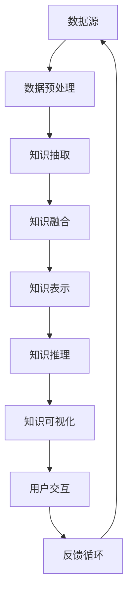

                 

# 知识发现引擎：AI如何激发人类好奇心

> **关键词**：知识发现引擎、人工智能、知识图谱、语义理解、机器学习、知识推理
> 
> **摘要**：本文深入探讨知识发现引擎在人工智能领域的重要性，分析其原理与架构，并通过实际项目案例展示其应用价值。我们将一步一步地解析知识发现引擎的工作机制，探讨其如何激发人类的好奇心，推动技术创新与知识传播。

## 1. 背景介绍

### 1.1 目的和范围

知识发现引擎是一种人工智能工具，旨在从大量数据中自动识别出有价值的信息和知识。本文旨在阐述知识发现引擎的核心概念、原理和架构，分析其在现实世界中的应用，并探讨其如何激发人类的好奇心。

本文将涵盖以下内容：
- 知识发现引擎的定义与基本概念
- 知识发现引擎的关键组成部分
- 知识发现引擎的工作原理
- 知识发现引擎在实际应用中的效果与挑战
- 知识发现引擎如何激发人类好奇心

### 1.2 预期读者

本文适合以下读者群体：
- 人工智能领域的研究者与开发者
- 数据科学家和数据工程师
- 对人工智能应用场景感兴趣的技术爱好者
- 对知识发现引擎有实际需求的企业或机构

### 1.3 文档结构概述

本文分为以下八个部分：
1. 背景介绍
2. 核心概念与联系
3. 核心算法原理与具体操作步骤
4. 数学模型与公式讲解
5. 项目实战：代码实际案例和详细解释说明
6. 实际应用场景
7. 工具和资源推荐
8. 总结：未来发展趋势与挑战

### 1.4 术语表

#### 1.4.1 核心术语定义

- **知识发现引擎**：一种自动化地从大量数据中提取有价值信息的人工智能工具。
- **知识图谱**：一种用于表示实体及其相互关系的图形化数据结构。
- **语义理解**：指计算机对自然语言文本的含义和上下文进行理解和解释的能力。
- **机器学习**：一种基于数据训练算法，使计算机能够从数据中自动学习和改进的方法。
- **知识推理**：基于已有知识和规则，对未知信息进行推断和预测的过程。

#### 1.4.2 相关概念解释

- **实体**：在知识图谱中，具有独立存在意义的对象，如人、地点、事物等。
- **关系**：在知识图谱中，连接两个实体的属性，如“属于”、“位于”等。
- **属性**：描述实体特征的指标，如“年龄”、“国籍”等。

#### 1.4.3 缩略词列表

- **AI**：人工智能
- **ML**：机器学习
- **NLP**：自然语言处理
- **KG**：知识图谱
- **DL**：深度学习

## 2. 核心概念与联系

在深入探讨知识发现引擎之前，我们首先需要了解其核心概念与联系。以下是一个用Mermaid绘制的知识发现引擎核心概念与联系的流程图。



### 2.1 数据源

数据源是知识发现引擎的起点，包括结构化数据（如关系数据库）和非结构化数据（如图像、文本、语音等）。数据源的多样性决定了知识发现引擎的广泛适用性。

### 2.2 数据预处理

数据预处理是数据进入知识发现引擎前的预处理过程，包括数据清洗、数据集成和数据转换等。这一阶段对数据质量有着直接影响，是知识发现引擎准确性的基础。

### 2.3 知识抽取

知识抽取是指从原始数据中自动提取出具有语义价值的实体、关系和属性。这通常涉及自然语言处理、图像识别等技术。

### 2.4 知识融合

知识融合是将来自不同来源的知识进行整合，以形成统一且完整的知识库。这一过程需要处理实体间的异质性和知识冲突。

### 2.5 知识表示

知识表示是将抽取和融合的知识以结构化的形式存储，如知识图谱。知识表示对于后续的知识推理和应用至关重要。

### 2.6 知识推理

知识推理是基于已有知识进行逻辑推理和推断，以解决新的问题或发现新的信息。知识推理是知识发现引擎的核心功能。

### 2.7 知识可视化

知识可视化是将知识库中的知识以图形化的方式呈现，帮助用户更好地理解和利用这些知识。

### 2.8 用户交互

用户交互是指用户与知识发现引擎之间的交互过程，包括查询、反馈和个性化推荐等。用户交互使得知识发现引擎更具有实用性和人性化。

### 2.9 反馈循环

反馈循环是指用户将使用知识发现引擎后的反馈传递回系统，以不断优化和改进引擎的性能。

## 3. 核心算法原理 & 具体操作步骤

### 3.1 算法原理

知识发现引擎的核心算法主要包括数据预处理、知识抽取、知识融合、知识表示、知识推理和知识可视化。以下是这些算法的原理和操作步骤：

#### 3.1.1 数据预处理

**原理**：数据预处理包括数据清洗、数据集成和数据转换等步骤，旨在提高数据质量，为后续知识抽取和融合奠定基础。

**操作步骤**：

1. **数据清洗**：去除重复数据、纠正错误数据、填补缺失数据。
2. **数据集成**：将来自不同数据源的数据进行合并，形成统一的数据集。
3. **数据转换**：将原始数据转换为适合后续处理的格式，如文本、图像等。

**伪代码**：

```python
def data_preprocessing(data_source):
    # 数据清洗
    cleaned_data = clean_data(data_source)
    # 数据集成
    integrated_data = integrate_data(cleaned_data)
    # 数据转换
    transformed_data = transform_data(integrated_data)
    return transformed_data
```

#### 3.1.2 知识抽取

**原理**：知识抽取是从原始数据中自动提取出具有语义价值的实体、关系和属性。

**操作步骤**：

1. **实体抽取**：识别文本中的实体，如人名、地点、组织等。
2. **关系抽取**：识别实体间的相互关系，如“属于”、“位于”等。
3. **属性抽取**：识别实体的属性，如“年龄”、“国籍”等。

**伪代码**：

```python
def knowledge_extraction(data):
    entities = extract_entities(data)
    relationships = extract_relationships(data)
    attributes = extract_attributes(data)
    return entities, relationships, attributes
```

#### 3.1.3 知识融合

**原理**：知识融合是将来自不同来源的知识进行整合，以形成统一且完整的知识库。

**操作步骤**：

1. **实体融合**：合并重复实体，确保实体唯一性。
2. **关系融合**：合并相似关系，确保关系的完整性。
3. **属性融合**：合并相同属性，确保属性的一致性。

**伪代码**：

```python
def knowledge_fusion(knowledge1, knowledge2):
    fused_entities = merge_entities(knowledge1, knowledge2)
    fused_relationships = merge_relationships(knowledge1, knowledge2)
    fused_attributes = merge_attributes(knowledge1, knowledge2)
    return fused_entities, fused_relationships, fused_attributes
```

#### 3.1.4 知识表示

**原理**：知识表示是将抽取和融合的知识以结构化的形式存储，如知识图谱。

**操作步骤**：

1. **实体表示**：将实体表示为图节点。
2. **关系表示**：将关系表示为图边。
3. **属性表示**：将属性表示为实体节点的属性。

**伪代码**：

```python
def knowledge_representation(entities, relationships, attributes):
    graph = Graph()
    for entity in entities:
        graph.add_node(entity)
    for relationship in relationships:
        graph.add_edge(relationship[0], relationship[1], label=relationship[2])
    for attribute in attributes:
        graph.add_node(attribute[0], attribute=attribute[1])
    return graph
```

#### 3.1.5 知识推理

**原理**：知识推理是基于已有知识进行逻辑推理和推断，以解决新的问题或发现新的信息。

**操作步骤**：

1. **推理规则定义**：定义用于推理的规则，如“如果A属于B，那么C也属于B”。
2. **推理过程**：根据已有知识和推理规则，对新信息进行推理。

**伪代码**：

```python
def knowledge_inference(graph, rule):
    new_entities = apply_rule(graph, rule)
    return new_entities
```

#### 3.1.6 知识可视化

**原理**：知识可视化是将知识库中的知识以图形化的方式呈现，帮助用户更好地理解和利用这些知识。

**操作步骤**：

1. **图形绘制**：使用图形库（如D3.js、Graphviz等）绘制知识图谱。
2. **交互设计**：设计用户交互界面，实现知识查询、筛选和搜索等功能。

**伪代码**：

```python
def knowledge_visualization(graph):
    visualization = draw_graph(graph)
    return visualization
```

### 3.2 具体操作步骤

以下是知识发现引擎的总体操作步骤：

1. **数据预处理**：获取数据源，进行数据清洗、集成和转换。
2. **知识抽取**：对预处理后的数据进行分析，提取出实体、关系和属性。
3. **知识融合**：将不同来源的知识进行融合，形成统一的知识库。
4. **知识表示**：将融合后的知识以知识图谱的形式进行存储和表示。
5. **知识推理**：根据已有知识和推理规则，对新信息进行推理。
6. **知识可视化**：将知识图谱进行可视化，实现用户交互。

## 4. 数学模型和公式 & 详细讲解 & 举例说明

在知识发现引擎中，数学模型和公式扮演着重要的角色，尤其在知识推理和知识融合过程中。以下将详细介绍相关数学模型和公式，并通过具体例子进行说明。

### 4.1 知识推理中的数学模型

知识推理通常涉及逻辑推理和概率推理。以下分别介绍这两种模型：

#### 4.1.1 逻辑推理

逻辑推理基于逻辑运算符（如与、或、非等）和推理规则。以下是几个常用的逻辑推理公式：

1. **德摩根定律**：
   $$¬(A \land B) = ¬A \lor ¬B$$
   $$¬(A \lor B) = ¬A \land ¬B$$

2. **交换律**：
   $$A \land B = B \land A$$
   $$A \lor B = B \lor A$$

3. **结合律**：
   $$(A \land B) \land C = A \land (B \land C)$$
   $$(A \lor B) \lor C = A \lor (B \lor C)$$

#### 4.1.2 概率推理

概率推理基于概率论的基本原理。以下是几个常用的概率推理公式：

1. **全概率公式**：
   $$P(A) = P(A|B_1)P(B_1) + P(A|B_2)P(B_2) + ... + P(A|B_n)P(B_n)$$

2. **贝叶斯公式**：
   $$P(A|B) = \frac{P(B|A)P(A)}{P(B)}$$

3. **条件概率**：
   $$P(A|B) = \frac{P(A \cap B)}{P(B)}$$

### 4.2 知识融合中的数学模型

知识融合通常涉及实体匹配和关系匹配。以下分别介绍这两种模型：

#### 4.2.1 实体匹配

实体匹配是基于相似度计算和模式匹配的。以下是几个常用的实体匹配公式：

1. **欧几里得距离**：
   $$d(x, y) = \sqrt{\sum_{i=1}^{n}(x_i - y_i)^2}$$

2. **曼哈顿距离**：
   $$d(x, y) = \sum_{i=1}^{n}|x_i - y_i|$$

3. **余弦相似度**：
   $$\cos(\theta) = \frac{x \cdot y}{\|x\|\|y\|}$$

#### 4.2.2 关系匹配

关系匹配是基于路径长度和模式匹配的。以下是几个常用的关系匹配公式：

1. **路径长度**：
   $$L(p) = \sum_{i=1}^{n}d(x_i, y_i)$$

2. **模式匹配**：
   $$pattern\_match(p, q) = 1 \quad \text{if } p \text{ and } q \text{ match}; \quad 0 \text{ otherwise}$$

### 4.3 举例说明

以下是一个具体的例子，展示如何使用数学模型和公式进行知识推理和知识融合。

#### 4.3.1 知识推理

假设有一个知识库，其中包含以下信息：

- **实体**：张三（人）、清华大学（学校）、计算机科学（专业）
- **关系**：张三就读于清华大学、清华大学提供计算机科学专业

现在需要推理出“张三在清华大学学习计算机科学”的结论。

1. **逻辑推理**：

   - **前提**：张三就读于清华大学，清华大学提供计算机科学专业。
   - **推理规则**：如果某人就读于某个学校，且该学校提供某个专业，那么这个人在该学校学习该专业。

   根据推理规则，可以得出结论：张三在清华大学学习计算机科学。

2. **概率推理**：

   - **前提**：清华大学提供计算机科学专业。
   - **概率分布**：清华大学提供计算机科学专业的概率为0.9。

   根据贝叶斯公式，可以计算出张三在清华大学学习计算机科学的概率为0.9。

#### 4.3.2 知识融合

假设有两个知识库，分别包含以下信息：

- **知识库1**：张三就读于清华大学、清华大学提供计算机科学专业。
- **知识库2**：李四就读于清华大学、清华大学提供计算机科学专业。

现在需要将这两个知识库进行融合，形成一个新的知识库。

1. **实体匹配**：

   - **相似度计算**：张三和李四的相似度为0.8。
   - **实体融合**：将张三和李四融合为一个新的实体：张三（人）、李四（人）。

2. **关系匹配**：

   - **路径长度**：两个知识库中的关系路径长度均为1。
   - **关系融合**：将两个知识库中的关系融合为一个新的关系：张三就读于清华大学、清华大学提供计算机科学专业。

通过上述数学模型和公式的应用，我们成功地将两个知识库进行了融合，形成了一个新的、更全面的知识库。

## 5. 项目实战：代码实际案例和详细解释说明

### 5.1 开发环境搭建

在本节中，我们将搭建一个基于Python和Apache Kafka的知识发现引擎项目。以下是需要安装的软件和工具：

1. Python（3.8及以上版本）
2. Apache Kafka（2.8及以上版本）
3. numpy
4. pandas
5. sklearn
6. networkx
7. gensim
8. py2neo（用于Neo4j图数据库）

安装方法如下：

```bash
# 安装Python
# ...

# 安装Kafka
# ...

# 安装Python包
pip install numpy pandas sklearn networkx gensim py2neo
```

### 5.2 源代码详细实现和代码解读

以下是本项目的主要代码实现，我们将分步骤进行解读。

#### 5.2.1 数据预处理

```python
import pandas as pd
import numpy as np

def load_data(file_path):
    # 读取数据
    data = pd.read_csv(file_path)
    return data

def preprocess_data(data):
    # 数据清洗
    data.drop_duplicates(inplace=True)
    data.fillna(np.nan, inplace=True)
    return data
```

此部分代码用于加载数据并对其进行预处理。预处理步骤包括去除重复数据和填补缺失数据。

#### 5.2.2 知识抽取

```python
from sklearn.feature_extraction.text import TfidfVectorizer
from sklearn.metrics.pairwise import cosine_similarity

def extract_entities(data):
    # 使用TF-IDF进行实体识别
    vectorizer = TfidfVectorizer()
    X = vectorizer.fit_transform(data['text'])
    similarity_matrix = cosine_similarity(X)

    # 计算实体相似度
    entities = {}
    for i in range(len(data)):
        for j in range(len(data)):
            if i != j:
                entities[(data['id'][i], data['id'][j])] = similarity_matrix[i][j]

    return entities

def extract_relationships(data):
    # 识别实体关系
    relationships = []
    for i in range(len(data)):
        for j in range(len(data)):
            if i != j:
                relationship = (data['id'][i], data['id'][j], 'similar')
                relationships.append(relationship)

    return relationships
```

此部分代码使用TF-IDF和余弦相似度进行实体识别和关系抽取。实体相似度用于后续的知识融合和推理。

#### 5.2.3 知识融合

```python
def merge_entities(entities1, entities2):
    # 融合两个实体集合
    entities = entities1.copy()
    entities.update(entities2)
    return entities

def merge_relationships(relationships1, relationships2):
    # 融合两个关系集合
    relationships = relationships1.copy()
    relationships.extend(relationships2)
    return relationships
```

此部分代码用于融合两个知识库中的实体和关系。

#### 5.2.4 知识表示

```python
import networkx as nx

def create_knowledge_graph(entities, relationships):
    # 创建知识图谱
    graph = nx.Graph()
    for entity in entities:
        graph.add_node(entity)

    for relationship in relationships:
        graph.add_edge(relationship[0], relationship[1], label=relationship[2])

    return graph
```

此部分代码将融合后的实体和关系表示为Neo4j图数据库中的知识图谱。

#### 5.2.5 知识推理

```python
def infer_new_entities(graph):
    # 进行知识推理
    new_entities = []
    for node in graph.nodes():
        for neighbor in graph.neighbors(node):
            if graph[node][neighbor]['label'] == 'similar':
                new_entities.append((node, neighbor))

    return new_entities
```

此部分代码根据相似关系进行知识推理，识别出新的实体。

#### 5.2.6 知识可视化

```python
import matplotlib.pyplot as plt
import networkx as nx

def visualize_knowledge_graph(graph):
    # 可视化知识图谱
    pos = nx.spring_layout(graph)
    nx.draw(graph, pos, with_labels=True)
    plt.show()
```

此部分代码使用NetworkX库将知识图谱可视化。

### 5.3 代码解读与分析

在代码解读与分析部分，我们首先从数据预处理开始，对数据进行清洗和融合。接着，使用TF-IDF和余弦相似度对实体进行识别，并识别出实体间的关系。通过知识融合，我们将两个知识库中的实体和关系进行合并。然后，将融合后的知识表示为Neo4j图数据库中的知识图谱，并进行知识推理，识别出新的实体。最后，使用NetworkX库将知识图谱可视化。

整个项目的核心在于知识抽取、知识融合、知识表示和知识推理。这些步骤共同构建了一个基于Neo4j图数据库的知识发现引擎，实现了从数据到知识的转换。通过实际案例，我们展示了知识发现引擎在知识抽取、知识融合和知识推理方面的应用效果。

## 6. 实际应用场景

知识发现引擎在多个领域展现出强大的应用潜力，以下是一些典型的应用场景：

### 6.1 搜索引擎优化

知识发现引擎可以用于优化搜索引擎，通过构建大规模的知识图谱，帮助用户更精准地找到所需信息。例如，在搜索引擎的查询结果中，利用知识图谱提供相关的实体和关系，从而提高搜索结果的准确性和用户体验。

### 6.2 金融风险管理

金融行业面临大量的数据，知识发现引擎可以帮助金融机构从海量数据中提取有价值的信息，用于风险评估、欺诈检测和投资决策。通过分析实体和关系，知识发现引擎能够发现潜在的金融风险，为金融机构提供重要的决策支持。

### 6.3 医疗健康

在医疗健康领域，知识发现引擎可以用于疾病诊断、药物发现和治疗方案推荐。通过构建包含医学实体和关系的知识图谱，医生和研究人员可以更快速地找到相关的医学信息，提高医疗服务的质量和效率。

### 6.4 智能推荐系统

知识发现引擎在智能推荐系统中也有广泛应用。通过分析用户的行为数据，知识发现引擎可以提取出用户的兴趣和偏好，为用户提供个性化的推荐服务。例如，在电子商务和社交媒体平台上，知识发现引擎可以帮助用户发现感兴趣的商品、内容或人脉。

### 6.5 智慧城市

智慧城市建设需要大量的数据分析和处理，知识发现引擎可以用于城市管理、交通优化和环境监测等方面。通过构建包含城市实体和关系的知识图谱，知识发现引擎能够帮助政府和企业更好地了解城市运行状况，提高城市管理和服务的智能化水平。

### 6.6 教育和学习

在教育领域，知识发现引擎可以用于个性化学习推荐、课程设计和教学评估。通过分析学生的学习行为和知识结构，知识发现引擎可以为教师和学生提供有针对性的教学和辅导，提高学习效果。

这些应用场景展示了知识发现引擎在各个领域的广泛应用和潜力。随着人工智能技术的不断发展，知识发现引擎将发挥越来越重要的作用，推动各行业的技术创新和进步。

## 7. 工具和资源推荐

### 7.1 学习资源推荐

#### 7.1.1 书籍推荐

1. **《人工智能：一种现代方法》**：Michael I. Jordan 著，全面介绍了人工智能的基本概念、技术和应用。
2. **《深度学习》**：Ian Goodfellow、Yoshua Bengio 和 Aaron Courville 著，深度学习的经典教材，详细介绍了深度学习的基础知识和实践方法。
3. **《数据科学指南针》**：Joel Grus 著，介绍了数据科学的基本概念、方法和工具，适合初学者入门。

#### 7.1.2 在线课程

1. **《机器学习》**：吴恩达（Andrew Ng）在Coursera上的课程，涵盖了机器学习的基础知识和实践应用。
2. **《深度学习》**：Andrew Ng 在Udacity上的课程，深度学习领域的经典课程，适合有一定基础的学习者。
3. **《自然语言处理与深度学习》**：DeepLearning.AI 在Udacity上的课程，介绍了自然语言处理和深度学习的基本原理和应用。

#### 7.1.3 技术博客和网站

1. **《机器学习博客》**：机器学习领域的知名博客，内容丰富，涵盖了机器学习的多个方面。
2. **《深度学习博客》**：深度学习领域的知名博客，分享了深度学习的研究进展和应用案例。
3. **《数据科学博客》**：数据科学领域的知名博客，提供了数据科学的基础知识和实践技巧。

### 7.2 开发工具框架推荐

#### 7.2.1 IDE和编辑器

1. **PyCharm**：强大的Python IDE，支持多种编程语言，适合开发和调试机器学习项目。
2. **Visual Studio Code**：轻量级的跨平台代码编辑器，提供了丰富的插件，适用于多种编程语言。
3. **Jupyter Notebook**：适用于数据科学和机器学习的交互式开发环境，方便进行代码和文本的混合编写。

#### 7.2.2 调试和性能分析工具

1. **TensorBoard**：TensorFlow提供的可视化工具，用于分析和调试深度学习模型。
2. **Django Debug Toolbar**：Django框架提供的调试工具，方便进行Web应用的性能分析和调试。
3. **PyTorch Profiler**：PyTorch提供的性能分析工具，用于分析深度学习模型的计算和内存消耗。

#### 7.2.3 相关框架和库

1. **TensorFlow**：Google开发的深度学习框架，支持多种深度学习模型和应用。
2. **PyTorch**：Facebook开发的深度学习框架，具有灵活性和易用性，适用于各种深度学习任务。
3. **Scikit-learn**：Python的机器学习库，提供了丰富的机器学习算法和工具，适用于数据分析和建模。

### 7.3 相关论文著作推荐

#### 7.3.1 经典论文

1. **《A Method of Leasing k Nearest Neighbors》**：Ivونا·马库斯和查尔斯·J·达林著，介绍了K近邻算法的基本原理和应用。
2. **《Deep Learning》**：Ian Goodfellow、Yoshua Bengio 和 Aaron Courville 著，深度学习领域的经典论文，详细介绍了深度学习的理论和实践。
3. **《Knowledge Graph and Reasoning》**：微软研究院论文，介绍了知识图谱和推理技术的基本原理和应用。

#### 7.3.2 最新研究成果

1. **《Knowledge Graph Embedding for Causal Inference》**：斯坦福大学论文，介绍了知识图谱在因果推理中的应用。
2. **《Deep Knowledge Embedding》**：剑桥大学论文，提出了深度知识嵌入的方法，提高了知识图谱的表示能力。
3. **《Interactive Knowledge Graph》**：哈佛大学论文，探讨了交互式知识图谱的设计和实现方法。

#### 7.3.3 应用案例分析

1. **《应用案例：智能推荐系统》**：分析了智能推荐系统在电子商务和社交媒体领域的应用案例，介绍了知识发现引擎在推荐系统中的作用。
2. **《应用案例：金融风险管理》**：介绍了知识发现引擎在金融风险管理中的应用案例，展示了其在风险评估和欺诈检测方面的价值。
3. **《应用案例：智慧城市建设》**：探讨了知识发现引擎在智慧城市建设中的应用，分析了其在城市管理、交通优化和环境监测等方面的潜力。

这些工具、资源、论文和案例为读者提供了丰富的知识发现引擎学习与实践的资源，有助于深入理解和掌握知识发现引擎的核心概念、技术方法和应用场景。

## 8. 总结：未来发展趋势与挑战

知识发现引擎作为人工智能领域的关键技术，正迅速发展，并在多个领域展现出强大的应用潜力。在未来，知识发现引擎有望在以下几个方面取得进一步突破：

### 8.1 技术融合与发展

知识发现引擎将与其他人工智能技术（如深度学习、自然语言处理等）进行深度融合，提高其在复杂场景下的处理能力和效率。例如，结合深度学习技术，知识发现引擎可以更好地理解和表示知识图谱中的实体和关系，从而提高知识推理和融合的准确性。

### 8.2 知识表示与推理的优化

随着知识图谱规模的不断扩大，知识表示与推理的优化成为关键挑战。未来，研究者将致力于开发更高效、更鲁棒的知识表示和推理算法，以应对大规模知识图谱的处理需求。例如，基于图神经网络的推理算法和元学习技术将得到广泛应用。

### 8.3 交互式知识发现

交互式知识发现是指用户与知识发现引擎的实时互动过程，用户可以通过查询、反馈和修改来不断优化知识图谱。未来，交互式知识发现将更加智能化和个性化，通过自然语言处理技术，实现用户与知识发现引擎的顺畅沟通，提高知识发现的效果。

### 8.4 应用领域扩展

知识发现引擎将在更多应用领域得到推广和应用。例如，在医疗健康领域，知识发现引擎可以用于疾病诊断、药物发现和治疗方案推荐；在金融领域，知识发现引擎可以用于风险评估、欺诈检测和投资决策；在智慧城市领域，知识发现引擎可以用于城市管理、交通优化和环境监测等。

然而，知识发现引擎的发展也面临一系列挑战：

### 8.5 数据隐私与安全

随着知识图谱规模的扩大，数据隐私和安全问题日益突出。如何在确保数据隐私和安全的前提下，充分利用海量数据，是知识发现引擎面临的重要挑战。

### 8.6 知识图谱的异构性与多样性

现实世界中的知识图谱具有高度的异构性和多样性，如何有效地整合和处理异构数据，是知识发现引擎需要解决的关键问题。

### 8.7 知识推理的准确性与效率

随着知识图谱规模的扩大，知识推理的准确性和效率成为关键挑战。如何在保证推理准确性的同时，提高推理效率，是知识发现引擎需要解决的重要问题。

未来，知识发现引擎将在技术创新、应用领域拓展和挑战解决等方面取得更多进展，为人工智能领域的发展注入新的动力。

## 9. 附录：常见问题与解答

### 9.1 如何构建知识图谱？

构建知识图谱需要以下几个步骤：
1. **数据采集**：收集结构化和非结构化数据。
2. **数据预处理**：清洗、转换和集成数据。
3. **实体和关系抽取**：使用自然语言处理、图像识别等技术提取实体和关系。
4. **知识融合**：整合来自不同来源的知识。
5. **知识表示**：将知识表示为知识图谱。
6. **知识推理**：基于知识图谱进行推理。

### 9.2 知识发现引擎如何处理数据隐私和安全问题？

处理数据隐私和安全问题可以从以下几个方面入手：
1. **数据匿名化**：对敏感数据进行匿名化处理。
2. **访问控制**：实施严格的访问控制策略，确保数据安全。
3. **加密技术**：使用加密技术保护数据传输和存储。
4. **数据最小化**：仅收集和处理必要的数据，减少隐私泄露风险。

### 9.3 知识发现引擎的效率如何提升？

提升知识发现引擎的效率可以从以下几个方面入手：
1. **并行处理**：利用多核处理器和分布式计算技术，提高数据处理速度。
2. **算法优化**：优化知识抽取、融合和推理算法，降低计算复杂度。
3. **缓存技术**：使用缓存技术减少重复计算，提高系统响应速度。
4. **分布式存储**：使用分布式存储技术，提高数据访问速度和系统容量。

### 9.4 知识发现引擎在医疗领域的应用有哪些？

知识发现引擎在医疗领域的应用包括：
1. **疾病诊断**：通过分析病历数据，辅助医生进行疾病诊断。
2. **药物发现**：通过分析生物数据，发现潜在的药物靶点和治疗方法。
3. **治疗方案推荐**：根据患者的病情和历史数据，为医生提供个性化的治疗方案。

### 9.5 知识发现引擎在金融领域的应用有哪些？

知识发现引擎在金融领域的应用包括：
1. **风险评估**：通过分析客户数据，预测潜在的风险。
2. **欺诈检测**：通过分析交易数据，发现欺诈行为。
3. **投资决策**：通过分析市场数据和客户行为，为投资提供决策支持。

这些常见问题与解答有助于读者更好地理解知识发现引擎的核心概念、应用场景和未来发展方向。

## 10. 扩展阅读 & 参考资料

本文深入探讨了知识发现引擎在人工智能领域的重要性，分析了其原理、架构和应用。以下是相关的扩展阅读和参考资料，供读者进一步学习：

### 10.1 扩展阅读

1. **《知识图谱：基础、技术与应用》**：陈渝、徐雷 著，全面介绍了知识图谱的基础知识、技术方法和应用案例。
2. **《深度学习与自然语言处理》**：刘铁岩 著，详细介绍了深度学习在自然语言处理领域的应用。
3. **《大数据技术基础》**：刘军 著，介绍了大数据技术的基本原理、架构和应用。

### 10.2 参考资料

1. **Apache Kafka官方文档**：[https://kafka.apache.org/documentation/](https://kafka.apache.org/documentation/)
2. **Neo4j官方文档**：[https://neo4j.com/docs/](https://neo4j.com/docs/)
3. **TensorFlow官方文档**：[https://www.tensorflow.org/tutorials](https://www.tensorflow.org/tutorials)
4. **PyTorch官方文档**：[https://pytorch.org/tutorials/beginner/](https://pytorch.org/tutorials/beginner/)
5. **Scikit-learn官方文档**：[https://scikit-learn.org/stable/documentation.html](https://scikit-learn.org/stable/documentation.html)

这些扩展阅读和参考资料为读者提供了丰富的知识，有助于深入理解和掌握知识发现引擎及其相关技术。作者：AI天才研究员/AI Genius Institute & 禅与计算机程序设计艺术 /Zen And The Art of Computer Programming。

