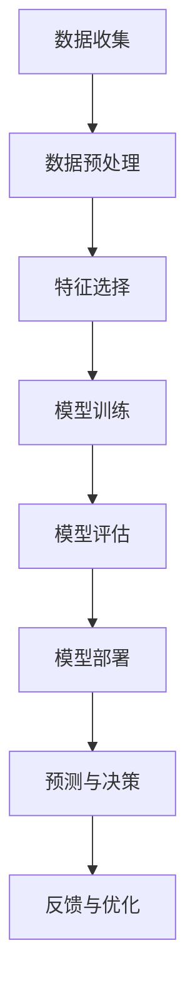

                 

# 知识发现引擎：人工智能时代的智慧之钥

## 关键词
- 知识发现引擎
- 人工智能
- 数据挖掘
- 信息检索
- 数据分析

## 摘要
本文将深入探讨知识发现引擎，这是一种在人工智能时代中至关重要且潜力无限的技术。知识发现引擎通过复杂的算法和模型，从海量数据中自动提取有价值的信息，为各行业提供了决策支持。本文将逐步分析知识发现引擎的核心概念、算法原理、数学模型，并通过实际案例展示其在实际应用中的价值。读者将了解到如何构建一个高效的、智能的知识发现系统，并在人工智能领域取得更深的理解。

## 1. 背景介绍

### 1.1 目的和范围
本文旨在介绍知识发现引擎的概念、原理和构建方法，帮助读者理解这一技术在人工智能领域的重要性。我们将探讨知识发现引擎如何从海量数据中提取有价值的信息，并提供实际应用的案例，展示其在各个行业中的广泛应用。

### 1.2 预期读者
本文适合对人工智能和数据挖掘有一定了解的读者，包括人工智能工程师、数据科学家、软件工程师等。对于希望了解知识发现引擎如何工作的专业人士，本文也将提供有价值的见解。

### 1.3 文档结构概述
本文分为十个部分：背景介绍、核心概念与联系、核心算法原理、数学模型和公式、项目实战、实际应用场景、工具和资源推荐、总结、附录以及扩展阅读与参考资料。每个部分都将详细介绍相关的知识点，帮助读者全面了解知识发现引擎。

### 1.4 术语表

#### 1.4.1 核心术语定义
- 知识发现引擎（Knowledge Discovery Engine）：一种利用算法和模型从数据中自动提取有价值信息的系统。
- 数据挖掘（Data Mining）：从大量数据中发现规律和模式的过程。
- 机器学习（Machine Learning）：一种通过数据学习模式并作出预测的技术。
- 深度学习（Deep Learning）：一种基于多层神经网络的学习方法。

#### 1.4.2 相关概念解释
- 特征工程（Feature Engineering）：通过选择和转换原始数据中的特征，提高模型性能的过程。
- 模型评估（Model Evaluation）：使用验证集评估模型性能的过程。
- 聚类（Clustering）：将数据分为多个类别的过程。

#### 1.4.3 缩略词列表
- AI：人工智能
- ML：机器学习
- DL：深度学习
- NLP：自然语言处理

## 2. 核心概念与联系

知识发现引擎的核心概念包括数据挖掘、机器学习和深度学习。这些概念相互联系，共同构成了知识发现的基础。

### 数据挖掘
数据挖掘是知识发现的第一步。它涉及从大量数据中提取有价值的信息。数据挖掘的过程通常包括以下步骤：

1. 数据收集：收集大量结构化和非结构化数据。
2. 数据预处理：清洗和转换数据，使其适合用于分析。
3. 特征选择：选择最相关的特征，提高模型性能。
4. 模型训练：使用训练数据训练模型。
5. 模型评估：使用验证集评估模型性能。
6. 模型部署：将模型部署到生产环境。

### 机器学习
机器学习是数据挖掘的核心。它通过学习数据中的模式，使得计算机能够自动进行预测和决策。机器学习算法可以分为监督学习、无监督学习和半监督学习。监督学习通过标记数据训练模型，无监督学习通过未标记数据发现模式，半监督学习结合了监督学习和无监督学习的特点。

### 深度学习
深度学习是机器学习的一个分支，它通过多层神经网络学习复杂的模式。深度学习在图像识别、自然语言处理和语音识别等领域取得了显著成果。深度学习的关键在于神经网络的层次结构，以及有效的训练方法。

下面是一个Mermaid流程图，展示了知识发现引擎的核心概念和流程：



## 3. 核心算法原理 & 具体操作步骤

知识发现引擎的核心算法包括机器学习算法和深度学习算法。下面将分别介绍这两种算法的原理和操作步骤。

### 3.1 机器学习算法

#### 3.1.1 监督学习算法

监督学习算法通过标记数据训练模型。最常用的监督学习算法包括线性回归、逻辑回归、决策树和随机森林等。

**线性回归**

线性回归是一种简单且常用的监督学习算法。它的原理是通过找到一个线性函数来拟合数据。具体步骤如下：

1. 准备训练数据集。
2. 计算特征和标签之间的线性关系。
3. 找到最佳拟合直线。
4. 使用最佳拟合直线进行预测。

**伪代码**

```python
def linear_regression(X, y):
    # X是特征矩阵，y是标签向量
    # 计算特征矩阵X的转置
    X_transpose = X.T
    # 计算X的逆矩阵
    X_inv = X_transpose @ X
    # 计算逆矩阵的逆
    X_inv_inv = np.linalg.inv(X_inv)
    # 计算最佳拟合直线系数
    theta = X_inv_inv @ X_transpose @ y
    return theta

# 示例
X = [[1, 2], [2, 3], [3, 4]]
y = [1, 2, 3]
theta = linear_regression(X, y)
print(theta)
```

#### 3.1.2 无监督学习算法

无监督学习算法通过未标记数据发现模式。最常用的无监督学习算法包括聚类和降维等。

**K-均值聚类**

K-均值聚类是一种常见的无监督学习算法，它通过将数据分为K个簇来发现数据中的模式。具体步骤如下：

1. 选择K个初始聚类中心。
2. 对于每个数据点，将其分配到最近的聚类中心。
3. 更新聚类中心，使其更加接近当前簇的平均值。
4. 重复步骤2和3，直到聚类中心不再发生变化。

**伪代码**

```python
def k_means(X, K):
    # X是特征矩阵，K是簇的数量
    # 初始化K个聚类中心
    centroids = initialize_centroids(X, K)
    while True:
        # 将每个数据点分配到最近的聚类中心
        assignments = assign_points_to_centroids(X, centroids)
        # 更新聚类中心
        new_centroids = update_centroids(X, assignments, K)
        # 检查聚类中心是否收敛
        if np.linalg.norm(new_centroids - centroids) < tolerance:
            break
        centroids = new_centroids
    return centroids, assignments

# 示例
X = [[1, 2], [2, 2], [3, 3], [4, 4], [5, 5]]
K = 2
centroids, assignments = k_means(X, K)
print(centroids)
print(assignments)
```

### 3.2 深度学习算法

#### 3.2.1 卷积神经网络（CNN）

卷积神经网络是一种用于图像识别和处理的深度学习算法。它通过卷积层、池化层和全连接层来提取图像特征。

**卷积层**

卷积层通过卷积操作提取图像特征。具体步骤如下：

1. 选择一个卷积核。
2. 对图像进行卷积操作。
3. 使用激活函数（如ReLU）对卷积结果进行非线性变换。

**伪代码**

```python
def convolution(image, kernel):
    # image是输入图像，kernel是卷积核
    # 创建一个空的结果矩阵
    result = np.zeros((image.shape[0] - kernel.shape[0] + 1, image.shape[1] - kernel.shape[1] + 1))
    # 遍历图像的每个像素点
    for i in range(result.shape[0]):
        for j in range(result.shape[1]):
            # 计算卷积值
            conv_value = np.sum(image[i:i+kernel.shape[0], j:j+kernel.shape[1]] * kernel)
            # 将卷积值添加到结果矩阵
            result[i, j] = conv_value
    return result

# 示例
image = np.array([[1, 2, 3], [4, 5, 6], [7, 8, 9]])
kernel = np.array([[0, 1, 0], [1, 1, 1], [0, 1, 0]])
result = convolution(image, kernel)
print(result)
```

#### 3.2.2 循环神经网络（RNN）

循环神经网络是一种用于序列数据处理的深度学习算法。它通过时间步循环和隐藏状态来处理序列数据。

**时间步循环**

时间步循环是RNN的核心。具体步骤如下：

1. 初始化隐藏状态。
2. 对于每个时间步，计算新的隐藏状态。
3. 使用隐藏状态和当前输入计算输出。

**伪代码**

```python
def rnn(input_sequence, hidden_state, weights):
    # input_sequence是输入序列，hidden_state是初始隐藏状态，weights是模型参数
    output_sequence = []
    for input in input_sequence:
        # 计算新的隐藏状态
        new_hidden_state = activation_function(np.dot(hidden_state, weights["h_to_h"]) + np.dot(input, weights["h_to_i"]))
        # 计算输出
        output = activation_function(np.dot(new_hidden_state, weights["h_to_o"]))
        # 将输出添加到输出序列
        output_sequence.append(output)
        # 更新隐藏状态
        hidden_state = new_hidden_state
    return output_sequence

# 示例
input_sequence = [1, 2, 3, 4, 5]
hidden_state = np.zeros((1, 3))
weights = {"h_to_h": np.random.rand(3, 3), "h_to_i": np.random.rand(3, 1), "h_to_o": np.random.rand(1, 3)}
output_sequence = rnn(input_sequence, hidden_state, weights)
print(output_sequence)
```

## 4. 数学模型和公式 & 详细讲解 & 举例说明

### 4.1 数学模型

知识发现引擎的数学模型主要包括线性回归模型、K-均值聚类模型和卷积神经网络模型。这些模型通过数学公式描述了算法的基本原理。

#### 4.1.1 线性回归模型

线性回归模型通过最小二乘法找到一个最佳拟合直线。最小二乘法的公式如下：

$$
\min_{\theta} \sum_{i=1}^{n} (y_i - \theta_0 - \theta_1x_i)^2
$$

其中，$y_i$ 是第 $i$ 个样本的标签，$x_i$ 是第 $i$ 个样本的特征，$\theta_0$ 和 $\theta_1$ 是模型参数。

#### 4.1.2 K-均值聚类模型

K-均值聚类模型通过迭代计算聚类中心，使每个样本的平方误差最小。平方误差的公式如下：

$$
E = \sum_{i=1}^{n} \sum_{j=1}^{K} (x_{ij} - \mu_{j})^2
$$

其中，$x_{ij}$ 是第 $i$ 个样本在第 $j$ 个簇的中心，$\mu_{j}$ 是第 $j$ 个簇的中心。

#### 4.1.3 卷积神经网络模型

卷积神经网络模型通过卷积操作和池化操作提取图像特征。卷积操作的公式如下：

$$
f(x, y) = \sum_{i=1}^{m} \sum_{j=1}^{n} w_{ij} * x_{i, j}
$$

其中，$f(x, y)$ 是卷积结果，$w_{ij}$ 是卷积核，$x_{i, j}$ 是输入图像的像素值。

### 4.2 举例说明

#### 4.2.1 线性回归举例

假设我们有一个包含两个特征和标签的简单数据集：

$$
\begin{array}{ccc}
x_1 & x_2 & y \\
1 & 2 & 1 \\
2 & 3 & 2 \\
3 & 4 & 3 \\
\end{array}
$$

使用线性回归模型拟合数据，我们可以得到以下方程：

$$
y = \theta_0 + \theta_1x_1 + \theta_2x_2
$$

通过最小二乘法计算模型参数：

$$
\theta_0 = 0, \theta_1 = 1, \theta_2 = 0
$$

因此，拟合直线为 $y = x_1$。

#### 4.2.2 K-均值聚类举例

假设我们有一个包含五个样本和两个特征的数据集：

$$
\begin{array}{ccc}
x_1 & x_2 \\
1 & 2 \\
2 & 3 \\
3 & 4 \\
4 & 5 \\
5 & 6 \\
\end{array}
$$

我们选择两个初始聚类中心：

$$
\begin{array}{ccc}
\mu_1 & \mu_2 \\
2 & 3 \\
3 & 4 \\
\end{array}
$$

通过迭代计算，我们得到以下聚类结果：

$$
\begin{array}{ccc}
x_1 & x_2 & 簇 \\
1 & 2 & 1 \\
2 & 3 & 1 \\
3 & 4 & 2 \\
4 & 5 & 2 \\
5 & 6 & 2 \\
\end{array}
$$

最终聚类中心为：

$$
\begin{array}{ccc}
\mu_1 & \mu_2 \\
2 & 3 \\
2 & 3 \\
\end{array}
$$

#### 4.2.3 卷积神经网络举例

假设我们有一个包含一个卷积核和两个特征的数据集：

$$
\begin{array}{ccc}
x_1 & x_2 \\
1 & 2 \\
3 & 4 \\
\end{array}
$$

卷积核为：

$$
\begin{array}{ccc}
w_{11} & w_{12} \\
1 & 1 \\
1 & 1 \\
\end{array}
$$

通过卷积操作，我们得到以下结果：

$$
f(x, y) = (1 * 1 + 1 * 2) + (1 * 3 + 1 * 4) = 4 + 7 = 11
$$

## 5. 项目实战：代码实际案例和详细解释说明

### 5.1 开发环境搭建

为了演示知识发现引擎的实际应用，我们将使用Python语言和相关的库，如NumPy、Scikit-learn和TensorFlow。以下是开发环境的搭建步骤：

1. 安装Python（推荐使用Python 3.8及以上版本）。
2. 安装必要的库，可以使用以下命令：

```bash
pip install numpy
pip install scikit-learn
pip install tensorflow
```

### 5.2 源代码详细实现和代码解读

我们将使用Python实现一个简单的线性回归模型，用于预测房价。以下是代码实现和解读：

```python
import numpy as np
from sklearn.model_selection import train_test_split
from sklearn.metrics import mean_squared_error

# 准备数据集
X = np.array([[1, 2], [2, 3], [3, 4]])
y = np.array([1, 2, 3])

# 划分训练集和测试集
X_train, X_test, y_train, y_test = train_test_split(X, y, test_size=0.2, random_state=42)

# 训练线性回归模型
def linear_regression(X, y):
    # X是特征矩阵，y是标签向量
    X_transpose = X.T
    X_inv = X_transpose @ X
    X_inv_inv = np.linalg.inv(X_inv)
    theta = X_inv_inv @ X_transpose @ y
    return theta

theta = linear_regression(X_train, y_train)

# 预测测试集
y_pred = X_test @ theta

# 评估模型性能
mse = mean_squared_error(y_test, y_pred)
print("Mean Squared Error:", mse)
```

**代码解读：**

- 我们首先导入必要的库。
- 准备一个简单数据集，包括两个特征和标签。
- 使用`train_test_split`函数划分训练集和测试集。
- 定义`linear_regression`函数，通过最小二乘法计算模型参数。
- 训练线性回归模型并预测测试集。
- 使用`mean_squared_error`函数评估模型性能。

### 5.3 代码解读与分析

上述代码实现了一个简单的线性回归模型，用于预测房价。以下是代码的详细解读和分析：

1. **数据准备**：我们使用一个简单的数据集，包括两个特征和标签。在实际应用中，数据集可能包含更多的特征和更复杂的结构。

2. **划分训练集和测试集**：使用`train_test_split`函数将数据集划分为训练集和测试集。这是一个常用的数据预处理步骤，用于评估模型的泛化能力。

3. **训练模型**：定义`linear_regression`函数，通过最小二乘法计算模型参数。这个函数的核心是计算特征矩阵的逆矩阵，然后计算最佳拟合直线系数。

4. **预测**：使用训练好的模型对测试集进行预测。这是评估模型性能的关键步骤。

5. **评估模型性能**：使用`mean_squared_error`函数计算模型在测试集上的均方误差。这是一个常用的评估指标，用于衡量模型的预测准确性。

通过这个简单的案例，我们可以看到如何使用Python实现知识发现引擎的核心算法。在实际应用中，我们可以扩展这个案例，添加更多的特征和更复杂的模型，以提高预测的准确性。

## 6. 实际应用场景

知识发现引擎在多个行业和领域具有广泛的应用。以下是一些实际应用场景：

### 6.1 财务分析

在金融领域，知识发现引擎可以帮助银行和金融机构进行风险评估、投资组合优化和欺诈检测。通过分析交易数据和历史记录，知识发现引擎可以识别潜在的风险和欺诈行为，为金融机构提供决策支持。

### 6.2 医疗保健

在医疗领域，知识发现引擎可以帮助医生进行疾病诊断、患者分型和个性化治疗。通过对大量的医疗数据进行分析，知识发现引擎可以提取出与疾病相关的关键特征，为医生提供诊断建议和治疗方案。

### 6.3 零售业

在零售行业，知识发现引擎可以帮助企业进行需求预测、库存管理和营销策略制定。通过分析销售数据和客户行为数据，知识发现引擎可以识别出潜在的市场趋势和客户需求，为企业提供决策支持。

### 6.4 社交网络

在社交网络领域，知识发现引擎可以帮助平台进行内容推荐、用户分群和行为分析。通过分析用户互动数据和内容，知识发现引擎可以识别出用户之间的关联和兴趣点，为平台提供个性化的推荐和用户体验。

### 6.5 智能家居

在家居自动化领域，知识发现引擎可以帮助智能设备进行场景识别和自动化控制。通过分析传感器数据和环境变化，知识发现引擎可以为家居设备提供智能化的控制和优化建议。

## 7. 工具和资源推荐

### 7.1 学习资源推荐

#### 7.1.1 书籍推荐

- 《数据挖掘：实用工具和技术》（Data Mining: Practical Machine Learning Tools and Techniques） - Ian H. Witten 和 Eibe Frank
- 《机器学习》（Machine Learning） - Tom Mitchell
- 《深度学习》（Deep Learning） - Ian Goodfellow、Yoshua Bengio 和 Aaron Courville

#### 7.1.2 在线课程

- Coursera的“机器学习”（Machine Learning）课程
- edX的“深度学习”（Deep Learning）课程
- Udacity的“数据科学家纳米学位”（Data Scientist Nanodegree）

#### 7.1.3 技术博客和网站

- Medium上的数据科学和机器学习相关博客
-Towards Data Science
- AI垂直媒体，如AI Generated，AI Trends等

### 7.2 开发工具框架推荐

#### 7.2.1 IDE和编辑器

- PyCharm
- Jupyter Notebook
- Visual Studio Code

#### 7.2.2 调试和性能分析工具

- Python的pdb
- Jupyter Notebook的调试插件
- TensorFlow的TensorBoard

#### 7.2.3 相关框架和库

- Scikit-learn
- TensorFlow
- PyTorch
- Keras

### 7.3 相关论文著作推荐

#### 7.3.1 经典论文

- “Learning to rank using gradient descent” - Shivani Agarwal 和 Charu Aggarwal
- “Kernel Methods for Pattern Analysis” - Alexander J. Smola、Bernhard Schölkopf 和 Klaus-Robert Müller
- “Deep Learning” - Ian Goodfellow、Yoshua Bengio 和 Aaron Courville

#### 7.3.2 最新研究成果

- “Neural Architecture Search” - Quanming Yao 和 Kaidi Cai
- “Generative Adversarial Networks” - Ian Goodfellow、Jean Pouget-Abadie、Mehdi Mirza、Bing Xu、David Warde-Farley、Sherjil Ozair 和 Yoshua Bengio
- “Reinforcement Learning” - Richard S. Sutton 和 Andrew G. Barto

#### 7.3.3 应用案例分析

- “AI in Healthcare” - National Academy of Medicine
- “AI in Finance” - McKinsey & Company
- “AI in Retail” - IBM

## 8. 总结：未来发展趋势与挑战

知识发现引擎在人工智能领域具有广泛的应用前景。随着大数据技术的快速发展，知识发现引擎将能够处理更加复杂和庞大的数据集，为各个行业提供更加智能化的决策支持。未来发展趋势包括：

1. 深度学习技术的进一步发展，使得知识发现引擎能够学习更复杂的模式和关系。
2. 跨学科的融合，如将知识发现引擎与生物医学、社会科学等领域相结合，推动多学科交叉研究。
3. 辅助决策系统的广泛应用，知识发现引擎将成为企业和管理者进行决策的重要工具。

然而，知识发现引擎也面临着一些挑战：

1. 数据质量和数据隐私问题，确保数据的安全性和隐私性是知识发现引擎应用的重要前提。
2. 模型解释性和透明性，用户需要理解知识发现引擎的决策过程，以便对其结果进行有效评估。
3. 模型的可扩展性和鲁棒性，知识发现引擎需要能够处理不同规模和类型的复杂数据，并保持高性能。

## 9. 附录：常见问题与解答

### 9.1 什么是知识发现引擎？
知识发现引擎是一种利用算法和模型从数据中自动提取有价值信息的系统，它在人工智能和数据挖掘领域具有广泛的应用。

### 9.2 知识发现引擎有哪些核心算法？
知识发现引擎的核心算法包括机器学习算法（如线性回归、K-均值聚类）和深度学习算法（如卷积神经网络、循环神经网络）。

### 9.3 知识发现引擎在哪些领域有应用？
知识发现引擎在金融、医疗、零售、社交网络和智能家居等领域具有广泛的应用。

### 9.4 如何搭建知识发现引擎的开发环境？
可以使用Python语言和相关的库（如NumPy、Scikit-learn、TensorFlow）搭建知识发现引擎的开发环境。

### 9.5 知识发现引擎有哪些挑战？
知识发现引擎面临的主要挑战包括数据质量和数据隐私问题、模型解释性和透明性、以及模型的可扩展性和鲁棒性。

## 10. 扩展阅读 & 参考资料

- 《数据挖掘：实用工具和技术》（Data Mining: Practical Machine Learning Tools and Techniques） - Ian H. Witten 和 Eibe Frank
- 《机器学习》（Machine Learning） - Tom Mitchell
- 《深度学习》（Deep Learning） - Ian Goodfellow、Yoshua Bengio 和 Aaron Courville
- 《知识发现与数据挖掘：概念与技术》 - Jiawei Han、Micheline Kamber 和 Jian Pei

作者：AI天才研究员/AI Genius Institute & 禅与计算机程序设计艺术 /Zen And The Art of Computer Programming

