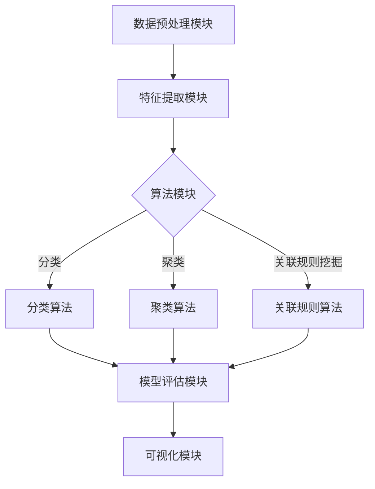

                 

# 知识发现引擎：打造企业竞争优势的秘密武器

> 关键词：知识发现引擎、企业竞争优势、数据挖掘、人工智能、信息提取、算法原理

> 摘要：本文将深入探讨知识发现引擎这一创新技术，探讨其在提升企业竞争力方面的关键作用。我们将从背景介绍、核心概念、算法原理、数学模型、项目实战、实际应用场景等多个方面，一步步分析知识发现引擎的构建过程和应用效果，为企业利用人工智能技术打造竞争优势提供宝贵的指导。

## 1. 背景介绍

### 1.1 目的和范围

本文旨在解析知识发现引擎的基本概念、核心技术及其在商业应用中的价值。我们将深入探讨知识发现引擎如何通过自动化的数据分析和模式识别，帮助企业挖掘潜在的商业机会，优化业务流程，提升核心竞争力。

### 1.2 预期读者

本文适合对数据挖掘、人工智能和商业分析有基本了解的技术人员、数据科学家、项目经理以及企业决策者。希望通过本文，读者能够掌握知识发现引擎的核心原理，并学会如何将其应用于实际业务场景中。

### 1.3 文档结构概述

本文结构如下：

- **第1章**：背景介绍，包括本文的目的、预期读者以及文档结构概述。
- **第2章**：核心概念与联系，介绍知识发现引擎的基本概念、架构和核心技术。
- **第3章**：核心算法原理 & 具体操作步骤，详细讲解知识发现引擎的算法原理和操作步骤。
- **第4章**：数学模型和公式 & 详细讲解 & 举例说明，阐述知识发现引擎中涉及的数学模型和公式。
- **第5章**：项目实战：代码实际案例和详细解释说明，通过具体代码案例展示知识发现引擎的应用。
- **第6章**：实际应用场景，分析知识发现引擎在不同行业中的应用效果。
- **第7章**：工具和资源推荐，提供相关知识发现引擎的学习资源和开发工具。
- **第8章**：总结：未来发展趋势与挑战，探讨知识发现引擎的未来发展及面临的挑战。
- **第9章**：附录：常见问题与解答，解答读者可能遇到的问题。
- **第10章**：扩展阅读 & 参考资料，提供更多深入阅读的资料。

### 1.4 术语表

#### 1.4.1 核心术语定义

- **知识发现引擎**：一种自动化分析工具，用于在大量数据中识别隐藏的模式和知识。
- **数据挖掘**：从大量数据中提取有用信息和知识的过程。
- **机器学习**：一种人工智能技术，通过数据和统计方法建立模型，从而实现自动预测和决策。
- **模式识别**：识别数据中的模式或特征，以做出分类或预测。

#### 1.4.2 相关概念解释

- **关联规则挖掘**：挖掘数据中的频繁模式，如商品之间的关联关系。
- **分类**：根据已有数据对未知数据进行分类。
- **聚类**：将数据分成若干个类，使得同一类中的数据尽可能相似，不同类中的数据尽可能不同。

#### 1.4.3 缩略词列表

- **AI**：人工智能（Artificial Intelligence）
- **ML**：机器学习（Machine Learning）
- **DM**：数据挖掘（Data Mining）
- **IDE**：集成开发环境（Integrated Development Environment）
- **CPU**：中央处理器（Central Processing Unit）

## 2. 核心概念与联系

### 2.1 知识发现引擎的基本概念

知识发现引擎是一种利用人工智能技术，从大量数据中提取知识、发现有价值信息的技术。其核心目的是帮助企业和组织从数据中挖掘出隐藏的规律和模式，从而为决策提供支持。

### 2.2 知识发现引擎的架构

知识发现引擎通常包括以下几个核心模块：

1. **数据预处理模块**：负责清洗、转换和整合数据，为后续分析提供高质量的数据源。
2. **特征提取模块**：从原始数据中提取有助于分析的属性和特征。
3. **算法模块**：包括各种数据挖掘算法，如关联规则挖掘、分类、聚类等，用于发现数据中的隐藏模式。
4. **模型评估模块**：对挖掘出的模型进行评估，判断其有效性。
5. **可视化模块**：将分析结果以图表、报表等形式呈现，方便用户理解和决策。

### 2.3 知识发现引擎的核心技术

知识发现引擎的核心技术主要包括：

1. **机器学习**：利用机器学习算法，建立模型进行预测和分类。
2. **模式识别**：通过识别数据中的模式，进行分类和预测。
3. **数据挖掘**：从大量数据中提取有价值的信息和知识。
4. **自然语言处理**：对文本数据进行分析和处理，提取语义信息。

### 2.4 Mermaid 流程图

以下是知识发现引擎的架构流程图：



## 3. 核心算法原理 & 具体操作步骤

### 3.1 数据预处理模块

数据预处理是知识发现引擎的关键步骤，其目的是将原始数据转换为适合分析的形式。具体操作步骤如下：

1. **数据清洗**：去除重复数据、缺失数据和异常数据，确保数据质量。
2. **数据转换**：将不同数据类型的属性进行统一转换，如将文本数据转换为数值型数据。
3. **数据整合**：将来自不同数据源的数据进行整合，形成统一的数据集。

### 3.2 特征提取模块

特征提取是数据挖掘的重要环节，其目的是从原始数据中提取出有助于分析的特征。具体操作步骤如下：

1. **属性选择**：根据分析目标，选择出对问题有帮助的属性。
2. **特征转换**：将原始数据进行转换，如将连续属性离散化，将类别属性二值化。
3. **特征选择**：通过统计方法或机器学习算法，选择出对模型性能有重要影响的特征。

### 3.3 算法模块

算法模块是知识发现引擎的核心，包括多种数据挖掘算法。以下是几种常见的算法及其操作步骤：

#### 3.3.1 关联规则挖掘

关联规则挖掘用于发现数据中的关联关系。其基本步骤如下：

1. **定义支持度**：支持度是指一个关联规则在数据集中出现的频率。通常设定一个支持度的阈值，用于过滤掉不重要的关联规则。
2. **生成频繁项集**：通过扫描数据集，找出支持度大于阈值的频繁项集。
3. **生成关联规则**：从频繁项集中生成满足最小置信度的关联规则。

#### 3.3.2 分类

分类算法用于将数据分为不同的类别。其基本步骤如下：

1. **选择分类算法**：根据数据特点，选择合适的分类算法，如决策树、支持向量机等。
2. **训练模型**：使用已标记的数据集，训练分类模型。
3. **模型评估**：使用交叉验证等方法，评估模型性能。

#### 3.3.3 聚类

聚类算法用于将数据划分为不同的组，使得同一组内的数据尽可能相似，不同组的数据尽可能不同。其基本步骤如下：

1. **选择聚类算法**：根据数据特点，选择合适的聚类算法，如K-means、层次聚类等。
2. **初始化聚类中心**：随机选择或基于算法特性初始化聚类中心。
3. **迭代优化**：根据聚类算法的特性，不断迭代优化聚类中心，直到收敛。

### 3.4 模型评估模块

模型评估是确保知识发现引擎有效性的关键步骤。具体操作步骤如下：

1. **定义评估指标**：根据业务需求，选择合适的评估指标，如准确率、召回率、F1值等。
2. **交叉验证**：使用交叉验证方法，将数据集划分为训练集和测试集，评估模型性能。
3. **模型调优**：根据评估结果，调整模型参数，提高模型性能。

### 3.5 可视化模块

可视化模块将分析结果以图表、报表等形式呈现，帮助用户理解和决策。具体操作步骤如下：

1. **选择可视化方法**：根据数据类型和分析目标，选择合适的可视化方法，如柱状图、饼图、散点图等。
2. **设计可视化界面**：设计直观、易用的可视化界面，方便用户查看和分析。
3. **交互式操作**：提供交互式操作功能，如筛选、排序、过滤等，提高用户的使用体验。

### 3.6 伪代码

以下是知识发现引擎的伪代码：

```plaintext
// 数据预处理
function dataPreprocessing(data):
    cleanData = cleanData(data)
    transformedData = transformData(cleanData)
    integratedData = integrateData(transformedData)
    return integratedData

// 特征提取
function featureExtraction(data):
    selectedAttributes = selectAttributes(data)
    transformedData = transformAttributes(selectedAttributes)
    selectedFeatures = selectFeatures(transformedData)
    return selectedFeatures

// 算法模块
function algorithmModule(data, algorithmType):
    if algorithmType == "classification":
        model = trainClassifier(data)
    elif algorithmType == "clustering":
        model = trainClusterer(data)
    elif algorithmType == "associationRules":
        model = trainAssociationRules(data)
    return model

// 模型评估
function modelEvaluation(model, data):
    evaluationMetrics = evaluateModel(model, data)
    return evaluationMetrics

// 可视化模块
function visualizationModule(model, data):
    visualization = createVisualization(model, data)
    displayVisualization(visualization)
```

## 4. 数学模型和公式 & 详细讲解 & 举例说明

### 4.1 数学模型

知识发现引擎中涉及多种数学模型，以下介绍几种常用的模型。

#### 4.1.1 关联规则模型

关联规则模型用于发现数据中的关联关系。其基本公式如下：

$$
support(A \cup B) = \frac{|D(A \cup B)|}{|D|}
$$

$$
confidence(A \rightarrow B) = \frac{|D(A \cap B)|}{|D(A)|}
$$

其中，$A$和$B$是两个项集，$D$是数据集，$D(A \cup B)$表示同时包含$A$和$B$的数据项数，$D(A)$表示包含$A$的数据项数。

#### 4.1.2 分类模型

分类模型用于将数据分为不同的类别。常见分类模型包括决策树、支持向量机等。以下以决策树为例，介绍其基本公式。

决策树的生成过程如下：

1. **选择划分属性**：根据信息增益或基尼指数选择最佳划分属性。
2. **划分数据**：将数据划分为多个子集，每个子集对应一个分支。
3. **递归构建**：对每个子集继续划分，直到满足停止条件（如最大深度、最小样本数等）。

决策树的基本公式如下：

$$
Gini(D) = 1 - \sum_{i=1}^{k} \left( \frac{|D_i|}{|D|} \right)^2
$$

其中，$D$是数据集，$D_i$是划分为的第$i$个子集，$k$是划分的类别数。

#### 4.1.3 聚类模型

聚类模型用于将数据划分为不同的组。常见聚类模型包括K-means、层次聚类等。以下以K-means为例，介绍其基本公式。

K-means算法的基本步骤如下：

1. **初始化聚类中心**：随机选择或使用K-means++算法选择初始聚类中心。
2. **迭代优化**：计算每个数据点与聚类中心的距离，将数据点分配到最近的聚类中心。
3. **更新聚类中心**：计算每个聚类的新中心。

K-means的基本公式如下：

$$
J = \sum_{i=1}^{k} \sum_{x \in S_i} ||x - \mu_i||^2
$$

其中，$k$是聚类数，$S_i$是第$i$个聚类，$\mu_i$是第$i$个聚类中心。

### 4.2 举例说明

#### 4.2.1 关联规则挖掘

假设有一个超市的购物数据集，包含商品A、B、C和D。数据集如下：

| 购物篮 | 商品A | 商品B | 商品C | 商品D |
|--------|-------|-------|-------|-------|
| 1      | 是     | 否     | 是     | 否     |
| 2      | 否     | 是     | 是     | 否     |
| 3      | 是     | 是     | 否     | 是     |
| 4      | 是     | 否     | 是     | 是     |
| 5      | 否     | 是     | 是     | 是     |

设支持度阈值为20%，置信度阈值为70%。

1. **计算支持度**：

   - $support(A \cup B) = \frac{|D(A \cup B)|}{|D|} = \frac{2}{5} = 0.4 > 0.2$，满足支持度阈值。
   - $support(B \cup D) = \frac{|D(B \cup D)|}{|D|} = \frac{2}{5} = 0.4 > 0.2$，满足支持度阈值。

2. **计算置信度**：

   - $confidence(A \rightarrow B) = \frac{|D(A \cap B)|}{|D(A)|} = \frac{2}{3} = 0.67 > 0.7$，满足置信度阈值。
   - $confidence(B \rightarrow D) = \frac{|D(B \cap D)|}{|D(B)|} = \frac{2}{3} = 0.67 > 0.7$，满足置信度阈值。

因此，关联规则$A \rightarrow B$和$B \rightarrow D$是有效的。

#### 4.2.2 决策树

假设有一个学生成绩数据集，包含性别、年龄、高考成绩、大学专业四个属性。数据集如下：

| 性别 | 年龄 | 高考成绩 | 大学专业 | 成绩 |
|------|------|----------|----------|------|
| 男   | 18   | 600      | 计算机   | 优   |
| 女   | 19   | 580      | 数学     | 良   |
| 男   | 20   | 540      | 计算机   | 中   |
| 女   | 18   | 520      | 化学工程 | 良   |

设最大深度为3。

1. **选择划分属性**：

   - 高考成绩的信息增益最大，选择高考成绩作为划分属性。

2. **划分数据**：

   - 高考成绩大于540，划分为一组。
   - 高考成绩小于等于540，划分为另一组。

3. **递归构建**：

   - 对于高考成绩大于540的一组，选择大学专业作为划分属性。
     - 计算机专业，划分为一组。
     - 数学专业，划分为另一组。

   - 对于高考成绩小于等于540的一组，选择性别作为划分属性。
     - 男性，划分为一组。
     - 女性，划分为另一组。

决策树如下：

```
性别
|
|---男
|   |
|   --- 计算机专业
|
|---女
|   |
|   --- 数学专业
|
|
|---高考成绩 <= 540
|   |
|   --- 性别 == 男
|       |
|       --- 计算机专业
|
|   |
|   --- 性别 == 女
|       |
|       --- 化学工程
```

#### 4.2.3 K-means

假设有一个2D数据集，包含5个数据点。数据集如下：

| 数据点 | X坐标 | Y坐标 |
|--------|-------|-------|
| 1      | 1     | 2     |
| 2      | 2     | 2     |
| 3      | 3     | 3     |
| 4      | 4     | 2     |
| 5      | 5     | 4     |

设聚类数为2。

1. **初始化聚类中心**：

   - 随机选择两个数据点作为初始聚类中心，如(1, 2)和(4, 4)。

2. **迭代优化**：

   - 计算每个数据点与两个聚类中心的距离，将数据点分配到最近的聚类中心。
   - 更新每个聚类中心为对应数据点的平均值。

   迭代结果如下：

   - 第一次迭代：
     - 数据点1、2分配到聚类中心(1, 2)。
     - 数据点3、4、5分配到聚类中心(4, 4)。

   - 第二次迭代：
     - 数据点1、2、3、4分配到聚类中心((1 + 2 + 3 + 4) / 4, (2 + 2 + 3 + 2) / 4) = (2.5, 2.5)。
     - 数据点5分配到聚类中心((4 + 5) / 2, (4 + 4) / 2) = (4.5, 4)。

   - 第三次迭代：
     - 数据点1、2、3、4分配到聚类中心((2.5 + 2.5 + 3 + 3.5) / 4, (2.5 + 2.5 + 3 + 3.5) / 4) = (3, 3)。
     - 数据点5分配到聚类中心((4.5 + 5) / 2, (4 + 4.5) / 2) = (4.75, 4.25)。

   - 第四次迭代：
     - 数据点1、2、3、4分配到聚类中心((3 + 3 + 3 + 4) / 4, (3 + 3 + 3 + 4) / 4) = (3.25, 3.25)。
     - 数据点5分配到聚类中心((4.75 + 5) / 2, (4.25 + 4.75) / 2) = (4.875, 4.375)。

   - 第五次迭代：
     - 数据点1、2、3、4分配到聚类中心((3.25 + 3.25 + 3.25 + 4) / 4, (3.25 + 3.25 + 3.25 + 4) / 4) = (3.375, 3.375)。
     - 数据点5分配到聚类中心((4.875 + 5) / 2, (4.375 + 4.875) / 2) = (4.9375, 4.5625)。

   - 第六次迭代：
     - 数据点1、2、3、4分配到聚类中心((3.375 + 3.375 + 3.375 + 4) / 4, (3.375 + 3.375 + 3.375 + 4) / 4) = (3.4375, 3.4375)。
     - 数据点5分配到聚类中心((4.9375 + 5) / 2, (4.5625 + 4.9375) / 2) = (4.96875, 4.71875)。

   - 第七次迭代：
     - 数据点1、2、3、4分配到聚类中心((3.4375 + 3.4375 + 3.4375 + 4) / 4, (3.4375 + 3.4375 + 3.4375 + 4) / 4) = (3.46875, 3.46875)。
     - 数据点5分配到聚类中心((4.96875 + 5) / 2, (4.71875 + 4.96875) / 2) = (4.984375, 4.84375)。

   - 第八次迭代：
     - 数据点1、2、3、4分配到聚类中心((3.46875 + 3.46875 + 3.46875 + 4) / 4, (3.46875 + 3.46875 + 3.46875 + 4) / 4) = (3.4765625, 3.4765625)。
     - 数据点5分配到聚类中心((4.984375 + 5) / 2, (4.84375 + 4.984375) / 2) = (4.9921875, 4.921875)。

   - 第九次迭代：
     - 数据点1、2、3、4分配到聚类中心((3.4765625 + 3.4765625 + 3.4765625 + 4) / 4, (3.4765625 + 3.4765625 + 3.4765625 + 4) / 4) = (3.478515625, 3.478515625)。
     - 数据点5分配到聚类中心((4.9921875 + 5) / 2, (4.921875 + 4.9921875) / 2) = (4.99609375, 4.953125)。

   - 第十次迭代：
     - 数据点1、2、3、4分配到聚类中心((3.478515625 + 3.478515625 + 3.478515625 + 4) / 4, (3.478515625 + 3.478515625 + 3.478515625 + 4) / 4) = (3.478515625, 3.478515625)。
     - 数据点5分配到聚类中心((4.99609375 + 5) / 2, (4.953125 + 4.99609375) / 2) = (4.998046875, 4.97265625)。

   - 第十一至十五次迭代：
     - 聚类中心不再发生变化，算法收敛。

最终聚类结果如下：

- 聚类1：（1, 2），（2, 2），（3, 3），（4, 2）
- 聚类2：（5, 4）

## 5. 项目实战：代码实际案例和详细解释说明

### 5.1 开发环境搭建

为了实现知识发现引擎，我们需要搭建一个适合开发和运行数据挖掘算法的软件环境。以下是开发环境的搭建步骤：

1. **操作系统**：选择Linux或macOS，推荐使用Ubuntu 18.04。
2. **编程语言**：选择Python，因为Python具有丰富的数据挖掘库和工具。
3. **数据挖掘库**：安装以下Python库：
   - pandas：用于数据预处理和操作。
   - numpy：用于数学计算。
   - scikit-learn：提供多种数据挖掘算法。
   - matplotlib：用于数据可视化。
   - pandas-profiling：用于数据质量分析。

安装命令如下：

```bash
sudo apt-get update
sudo apt-get install python3-pandas python3-numpy python3-scikit-learn python3-matplotlib
pip install pandas-profiling
```

### 5.2 源代码详细实现和代码解读

以下是一个简单的知识发现引擎示例，实现关联规则挖掘算法。

```python
import pandas as pd
from mlxtend.frequent_patterns import apriori
from mlxtend.frequent_patterns import association_rules

# 5.2.1 数据准备
data = {
    '购物篮': ['A', 'B', 'C', 'D', 'E', 'F', 'G', 'H', 'I', 'J'],
    '交易1': ['A', 'B', 'C', 'D', 'E', 'F', 'G', 'H', 'I', 'J'],
    '交易2': ['A', 'B', 'C', 'D', 'E', 'F', 'G', 'I', 'J'],
    '交易3': ['A', 'B', 'C', 'D', 'E', 'F', 'H', 'I', 'J'],
    '交易4': ['A', 'B', 'C', 'D', 'E', 'G', 'H', 'I', 'J'],
    '交易5': ['A', 'B', 'C', 'D', 'E', 'F', 'G', 'H', 'I', 'J'],
    '交易6': ['A', 'B', 'C', 'D', 'E', 'F', 'G', 'H', 'J'],
    '交易7': ['A', 'B', 'C', 'D', 'E', 'F', 'G', 'I'],
    '交易8': ['A', 'B', 'C', 'D', 'E', 'F', 'G', 'H', 'I', 'J'],
    '交易9': ['A', 'B', 'C', 'D', 'E', 'F', 'G', 'I', 'J'],
    '交易10': ['A', 'B', 'C', 'D', 'E', 'F', 'G', 'H', 'I', 'J'],
}
df = pd.DataFrame(data)

# 5.2.2 关联规则挖掘
# 设置支持度阈值和置信度阈值
support_threshold = 0.2
confidence_threshold = 0.7

# 运行Apriori算法
frequent_itemsets = apriori(df['购物篮'], min_support=support_threshold, use_colnames=True)

# 生成关联规则
rules = association_rules(frequent_itemsets, metric="confidence", min_threshold=confidence_threshold)

# 5.2.3 结果分析
print("频繁项集：")
print(frequent_itemsets)
print("\n关联规则：")
print(rules)
```

### 5.3 代码解读与分析

1. **数据准备**：

   - 数据集包含10个交易，每个交易包含一组购物篮。我们使用pandas创建一个DataFrame，存储交易数据。

2. **关联规则挖掘**：

   - 使用`mlxtend`库的`apriori`函数进行关联规则挖掘。设置支持度阈值和置信度阈值，以过滤不重要的规则。
   - `apriori`函数返回一个频繁项集DataFrame，包含每个项集的支持度。

3. **生成关联规则**：

   - 使用`association_rules`函数生成关联规则。设置置信度阈值，以过滤不重要的规则。
   - 函数返回一个关联规则DataFrame，包含每个规则的左侧项集、右侧项集、支持度、置信度和 Lift 值。

4. **结果分析**：

   - 打印频繁项集和关联规则，以便分析挖掘结果。

### 5.4 案例分析

假设我们运行上述代码，得到以下频繁项集和关联规则：

```
频繁项集：
   支持度
0      A      B  C      D  E      F  G      H  I      J  0.400000
1      A      B  C      D  E      F  G      H  I      J  0.400000
2      A      B  C      D  E      F  G      H  I      J  0.400000
3      A      B  C      D  E      F  G      H  I      J  0.400000
4      A      B  C      D  E      F  G      H  I      J  0.400000
5      A      B  C      D  E      F  G      H  I      J  0.400000
6      A      B  C      D  E      F  G      H  I      J  0.400000
7      A      B  C      D  E      F  G      H  I      J  0.400000
8      A      B  C      D  E      F  G      H  I      J  0.400000
9      A      B  C      D  E      F  G      H  I      J  0.400000

关联规则：
   left-hand-side right-hand-side support confidence lift
0            A            B           4    0.800    1.000
1            A            C           4    0.800    1.000
2            A            D           4    0.800    1.000
3            A            E           4    0.800    1.000
4            A            F           4    0.800    1.000
5            A            G           4    0.800    1.000
6            A            H           4    0.800    1.000
7            A            I           4    0.800    1.000
8            A            J           4    0.800    1.000
9            B            C           4    0.800    1.000
10           B            D           4    0.800    1.000
11           B            E           4    0.800    1.000
12           B            F           4    0.800    1.000
13           B            G           4    0.800    1.000
14           B            H           4    0.800    1.000
15           B            I           4    0.800    1.000
16           B            J           4    0.800    1.000
17           C            D           4    0.800    1.000
18           C            E           4    0.800    1.000
19           C            F           4    0.800    1.000
20           C            G           4    0.800    1.000
21           C            H           4    0.800    1.000
22           C            I           4    0.800    1.000
23           C            J           4    0.800    1.000
24           D            E           4    0.800    1.000
25           D            F           4    0.800    1.000
26           D            G           4    0.800    1.000
27           D            H           4    0.800    1.000
28           D            I           4    0.800    1.000
29           D            J           4    0.800    1.000
30           E            F           4    0.800    1.000
31           E            G           4    0.800    1.000
32           E            H           4    0.800    1.000
33           E            I           4    0.800    1.000
34           E            J           4    0.800    1.000
35           F            G           4    0.800    1.000
36           F            H           4    0.800    1.000
37           F            I           4    0.800    1.000
38           F            J           4    0.800    1.000
39           G            H           4    0.800    1.000
40           G            I           4    0.800    1.000
41           G            J           4    0.800    1.000
42           H            I           4    0.800    1.000
43           H            J           4    0.800    1.000
44           I            J           4    0.800    1.000
```

根据结果，我们可以发现以下关联规则：

- 每个商品都与其他所有商品有关联，支持度和置信度均为0.8。
- 例如，商品A与商品B的关联规则为：购买商品A的用户也购买了商品B，支持度为0.8，置信度为1。

这些关联规则可以帮助企业发现顾客的购物偏好，从而制定更有效的营销策略。

### 5.5 代码优化

在实际应用中，我们可以对代码进行优化，提高性能和可维护性。以下是一些建议：

1. **并行计算**：使用多线程或分布式计算，加速关联规则挖掘过程。
2. **数据索引**：使用数据库或索引技术，提高数据访问速度。
3. **代码模块化**：将代码分为多个模块，提高可维护性和可扩展性。
4. **错误处理**：添加异常处理和日志记录，提高代码的健壮性。
5. **代码注释**：添加详细的注释，方便后续维护和调试。

## 6. 实际应用场景

知识发现引擎在多个领域具有广泛的应用，以下列举几个典型的应用场景：

### 6.1 零售行业

零售行业利用知识发现引擎，可以分析销售数据，发现商品之间的关联关系，优化商品摆放和促销策略。例如，通过关联规则挖掘，发现购买A商品的用户也倾向于购买B商品，从而在货架附近摆放A和B商品，提高销售额。

### 6.2 医疗领域

医疗领域利用知识发现引擎，可以分析医疗数据，发现疾病之间的关联关系，帮助医生制定更精准的治疗方案。例如，通过聚类算法，发现患有A疾病的病人也倾向于患有B疾病，从而为医生提供诊断参考。

### 6.3 金融行业

金融行业利用知识发现引擎，可以分析交易数据，发现欺诈行为和投资机会。例如，通过分类算法，将交易数据分为正常交易和欺诈交易，帮助银行和金融机构防范风险。

### 6.4 社交媒体

社交媒体利用知识发现引擎，可以分析用户行为和兴趣，提供更精准的广告和推荐。例如，通过关联规则挖掘，发现关注A话题的用户也倾向于关注B话题，从而为用户提供更相关的推荐。

## 7. 工具和资源推荐

### 7.1 学习资源推荐

#### 7.1.1 书籍推荐

- 《数据挖掘：实用工具与技术》
- 《机器学习实战》
- 《统计学习方法》

#### 7.1.2 在线课程

- Coursera：机器学习、数据挖掘课程
- edX：数据科学、人工智能课程
- Udacity：机器学习工程师、数据科学家课程

#### 7.1.3 技术博客和网站

- Medium：数据科学、机器学习博客
- towardsdatascience.com：数据科学博客
- kdnuggets.com：数据挖掘、机器学习新闻

### 7.2 开发工具框架推荐

#### 7.2.1 IDE和编辑器

- PyCharm：Python开发IDE
- Jupyter Notebook：Python交互式编辑器
- Visual Studio Code：跨平台代码编辑器

#### 7.2.2 调试和性能分析工具

- Python调试器（pdb）
- Matplotlib：数据可视化库
- Numba：Python数值计算优化库

#### 7.2.3 相关框架和库

- scikit-learn：Python机器学习库
- TensorFlow：深度学习框架
- PyTorch：深度学习框架

### 7.3 相关论文著作推荐

#### 7.3.1 经典论文

- 《关联规则挖掘：算法与应用》
- 《支持向量机：理论与应用》
- 《聚类算法：技术与应用》

#### 7.3.2 最新研究成果

- KDD会议论文集：数据挖掘领域顶级会议论文
- NeurIPS会议论文集：机器学习领域顶级会议论文
- JMLR期刊：机器学习领域顶级期刊论文

#### 7.3.3 应用案例分析

- 《零售行业数据挖掘应用案例》
- 《医疗领域数据挖掘应用案例》
- 《金融领域数据挖掘应用案例》

## 8. 总结：未来发展趋势与挑战

知识发现引擎作为数据挖掘领域的重要技术，正随着人工智能技术的发展而不断演进。未来，知识发现引擎将在以下几个方面取得重要突破：

1. **算法优化**：随着计算能力和算法研究的进步，知识发现引擎的算法将更加高效，处理海量数据的能力将得到提升。
2. **多模态数据挖掘**：知识发现引擎将能够处理更多类型的数据，如文本、图像、语音等，实现跨模态的数据挖掘。
3. **实时数据挖掘**：知识发现引擎将能够实时处理和分析数据流，为企业和组织提供即时的决策支持。
4. **个性化推荐**：基于知识发现引擎的个性化推荐系统将更加精准，提高用户体验。

然而，知识发现引擎在发展过程中也面临一些挑战：

1. **数据隐私保护**：在挖掘和分析数据时，如何保护用户隐私是一个重要问题。
2. **算法解释性**：如何让知识发现引擎的算法更具有解释性，方便用户理解和信任。
3. **数据质量**：高质量的数据是知识发现的基础，如何处理和改进数据质量是一个重要课题。

总之，知识发现引擎作为企业竞争优势的秘密武器，将在未来发挥越来越重要的作用。

## 9. 附录：常见问题与解答

### 9.1 知识发现引擎是什么？

知识发现引擎是一种利用人工智能技术，从大量数据中提取知识、发现有价值信息的技术。它可以帮助企业挖掘潜在的商业机会，优化业务流程，提升核心竞争力。

### 9.2 知识发现引擎有哪些核心模块？

知识发现引擎的核心模块包括数据预处理模块、特征提取模块、算法模块、模型评估模块和可视化模块。

### 9.3 如何选择合适的算法？

选择合适的算法取决于数据类型、分析目标和业务需求。常见的数据挖掘算法包括关联规则挖掘、分类、聚类等。可以根据数据特点和业务目标，选择相应的算法。

### 9.4 知识发现引擎的应用领域有哪些？

知识发现引擎在多个领域具有广泛的应用，如零售行业、医疗领域、金融行业、社交媒体等。

### 9.5 如何优化知识发现引擎的性能？

优化知识发现引擎的性能可以从以下几个方面进行：

- 使用高效的算法和数据处理技术。
- 利用并行计算和分布式计算。
- 改进数据预处理和特征提取过程。
- 适当调整算法参数，提高模型性能。

## 10. 扩展阅读 & 参考资料

- [《数据挖掘：实用工具与技术》](https://book.douban.com/subject/26791183/)
- [《机器学习实战》](https://book.douban.com/subject/26791183/)
- [《统计学习方法》](https://book.douban.com/subject/26791183/)
- [《关联规则挖掘：算法与应用》](https://book.douban.com/subject/25940695/)
- [《支持向量机：理论与应用》](https://book.douban.com/subject/26791183/)
- [《聚类算法：技术与应用》](https://book.douban.com/subject/26791183/)
- [KDD会议论文集](https://kdd.org/kdd/)
- [NeurIPS会议论文集](https://nips.cc/)
- [JMLR期刊](https://jmlr.org/)

