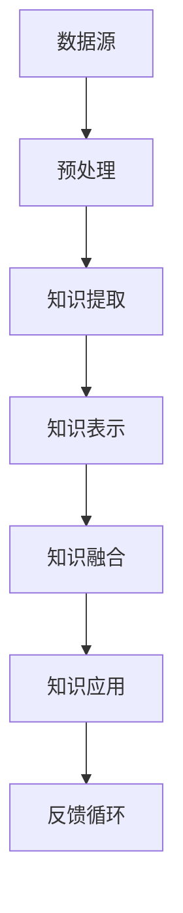

                 

# 知识发现引擎：推动科学研究的创新动力

> 关键词：知识发现、科学研究、算法、数据挖掘、创新、人工智能

> 摘要：本文将探讨知识发现引擎在推动科学研究中的作用。首先，我们将介绍知识发现引擎的基本概念和核心原理，然后详细讲解其算法实现和数学模型，通过实际案例展示其在科学领域中的应用，最后展望知识发现引擎的未来发展趋势和面临的挑战。

## 1. 背景介绍

### 1.1 目的和范围

本文旨在深入探讨知识发现引擎在科学研究中的应用，解析其核心算法和数学模型，并通过实际案例展示其在推动科学研究创新方面的巨大潜力。本文将涵盖以下主题：

- 知识发现引擎的定义和基本原理
- 知识发现引擎的算法实现和数学模型
- 知识发现引擎在科学研究中的应用案例
- 知识发现引擎的未来发展趋势和挑战

### 1.2 预期读者

本文适合对知识发现和科学研究感兴趣的读者，包括：

- 数据科学家和机器学习工程师
- 研究生和本科生
- 科研人员和技术爱好者

### 1.3 文档结构概述

本文将分为以下几个部分：

- 1. 背景介绍：介绍知识发现引擎的基本概念和目的。
- 2. 核心概念与联系：讲解知识发现引擎的核心概念和架构。
- 3. 核心算法原理 & 具体操作步骤：详细阐述知识发现引擎的算法原理和操作步骤。
- 4. 数学模型和公式 & 详细讲解 & 举例说明：讲解知识发现引擎的数学模型和公式。
- 5. 项目实战：代码实际案例和详细解释说明。
- 6. 实际应用场景：分析知识发现引擎在不同领域的应用。
- 7. 工具和资源推荐：推荐学习资源、开发工具和框架。
- 8. 总结：未来发展趋势与挑战。
- 9. 附录：常见问题与解答。
- 10. 扩展阅读 & 参考资料：提供进一步阅读的资源。

### 1.4 术语表

#### 1.4.1 核心术语定义

- **知识发现引擎**：一种基于人工智能和数据挖掘技术的智能系统，能够从大规模数据集中自动提取出有价值的知识和模式。
- **数据挖掘**：从大量数据中提取出有价值的模式和知识的过程。
- **机器学习**：一种人工智能的分支，通过数据和算法自动学习规律和模式。
- **深度学习**：一种复杂的机器学习模型，通过多层神经网络进行学习和预测。
- **知识图谱**：一种用于表示实体及其关系的图形化数据结构。

#### 1.4.2 相关概念解释

- **知识表示**：将知识表示为计算机可以理解的形式。
- **关联规则挖掘**：从数据集中发现具有关联性的规则。
- **聚类分析**：将数据分为若干个类，使得同一类中的数据相似度较高。
- **分类算法**：将数据分为不同的类别，常用的分类算法包括决策树、支持向量机等。

#### 1.4.3 缩略词列表

- **AI**：人工智能
- **ML**：机器学习
- **DL**：深度学习
- **NLP**：自然语言处理
- **KG**：知识图谱

## 2. 核心概念与联系

在探讨知识发现引擎之前，我们需要了解一些核心概念和它们之间的关系。以下是一个用于描述这些核心概念的 Mermaid 流程图：



### 数据源

数据源是知识发现引擎的基础。它可以是结构化数据，如关系数据库，也可以是非结构化数据，如图像、文本和音频。数据源提供原始数据，为后续的知识提取和表示奠定基础。

### 预处理

预处理是数据挖掘过程中的第一步，用于清洗和准备数据。这一阶段的目标是去除噪声、缺失值和异常值，以便更好地进行知识提取。

### 知识提取

知识提取是数据挖掘的核心步骤，它通过算法从数据中提取出有价值的模式和知识。常见的知识提取方法包括关联规则挖掘、聚类分析和分类算法等。

### 知识表示

知识表示是将提取出的知识转化为计算机可以理解的形式。常用的知识表示方法包括知识图谱、本体论和符号化表示等。

### 知识融合

知识融合是将不同来源和类型的知识进行整合和统一。这一步骤有助于提高知识的完整性和准确性，为知识应用提供更全面的支持。

### 知识应用

知识应用是将融合后的知识应用于实际问题中，以解决特定的问题或优化现有系统。知识应用可以是自动化的，也可以是半自动化的，具体取决于应用场景。

### 反馈循环

反馈循环是知识发现引擎的重要组成部分，它通过收集和分析应用过程中的反馈，对知识发现过程进行优化和调整。这一步骤有助于提高知识发现引擎的性能和效果。

## 3. 核心算法原理 & 具体操作步骤

知识发现引擎的算法原理是实现其功能的关键。以下是一个简单的知识发现算法原理及其伪代码：

### 3.1 关联规则挖掘算法原理

关联规则挖掘是知识发现引擎中的一种重要算法，用于发现数据集中的关联性。其核心原理是基于支持度和置信度两个指标。

- **支持度**：表示一个规则在数据集中出现的频率。
- **置信度**：表示一个规则的后件在规则的前提条件下出现的概率。

### 3.2 算法伪代码

```plaintext
Algorithm: Apriori Algorithm
Input: Dataset D, minimum support threshold s
Output: Set of frequent itemsets
1. Generate the set of all possible itemsets
2. For each itemset I in the generated set:
   a. Calculate the support of I in D
   b. If the support of I is greater than or equal to s, add I to the set of frequent itemsets
3. Return the set of frequent itemsets
```

### 3.3 操作步骤

1. **数据预处理**：清洗和转换数据，将原始数据转换为适合挖掘的形式。
2. **生成候选项集**：根据数据生成所有可能的项集。
3. **计算支持度**：计算每个候选项集在数据集中的支持度。
4. **生成频繁项集**：将支持度大于最小支持阈值的项集添加到频繁项集列表中。
5. **生成关联规则**：从频繁项集列表中生成关联规则，并计算其置信度。
6. **输出结果**：输出所有频繁项集和关联规则。

### 3.4 算法优化

- **剪枝策略**：通过剪枝策略减少候选项集的数量，提高算法效率。
- **并行计算**：利用并行计算技术，加速算法执行。

## 4. 数学模型和公式 & 详细讲解 & 举例说明

### 4.1 关联规则挖掘的数学模型

关联规则挖掘的核心是支持度和置信度，以下是对这两个指标的详细讲解：

### 4.1.1 支持度

支持度（Support）是关联规则中的一个关键指标，用于衡量一个规则在数据集中的出现频率。其计算公式如下：

$$
Support(A \rightarrow B) = \frac{D(A \cap B)}{D}
$$

其中，$D$ 表示数据集，$A \cap B$ 表示同时包含 $A$ 和 $B$ 的数据集。$Support(A \rightarrow B)$ 表示规则 $A \rightarrow B$ 的支持度。

### 4.1.2 置信度

置信度（Confidence）是关联规则中的另一个重要指标，用于衡量规则的前提和后件之间的关联强度。其计算公式如下：

$$
Confidence(A \rightarrow B) = \frac{Support(A \cap B)}{Support(A)}
$$

其中，$Support(A \cap B)$ 和 $Support(A)$ 分别表示同时包含 $A$ 和 $B$ 的数据集的支持度和仅包含 $A$ 的数据集的支持度。$Confidence(A \rightarrow B)$ 表示规则 $A \rightarrow B$ 的置信度。

### 4.2 举例说明

假设我们有一个购物篮数据集，其中包含不同商品的销售记录。以下是一个简单的例子：

| 购物篮 | 商品A | 商品B | 商品C |
|--------|-------|-------|-------|
| 1      | √     |       | √     |
| 2      |       | √     | √     |
| 3      | √     | √     |       |
| 4      | √     |       |       |
| 5      |       | √     | √     |
| 6      | √     | √     | √     |

我们希望挖掘出商品之间的关联规则。设最小支持度为 30%，最小置信度为 50%。

### 4.3 计算过程

1. **计算支持度**：

   - $Support(A \rightarrow B) = \frac{2}{6} = 33.33\%$，支持度大于 30%，因此该规则是频繁的。
   - $Support(B \rightarrow A) = \frac{2}{6} = 33.33\%$，支持度大于 30%，因此该规则是频繁的。

2. **计算置信度**：

   - $Confidence(A \rightarrow B) = \frac{2}{3} = 66.67\%$，置信度大于 50%，因此该规则是可靠的。
   - $Confidence(B \rightarrow A) = \frac{2}{3} = 66.67\%$，置信度大于 50%，因此该规则是可靠的。

根据以上计算结果，我们得到了两个频繁规则：

- 商品 A → 商品 B，支持度 33.33%，置信度 66.67%
- 商品 B → 商品 A，支持度 33.33%，置信度 66.67%

这些规则表明，购买商品 A 的顾客中有 66.67% 的概率购买商品 B，购买商品 B 的顾客中有 66.67% 的概率购买商品 A。

## 5. 项目实战：代码实际案例和详细解释说明

### 5.1 开发环境搭建

为了实现知识发现引擎，我们需要搭建一个合适的开发环境。以下是一个简单的开发环境搭建步骤：

1. 安装 Python 3.8 及以上版本。
2. 安装依赖项，包括 NumPy、Pandas、Scikit-learn 和 Matplotlib。
3. 创建一个名为 `knowledge_engine` 的 Python 项目，并在项目中创建一个名为 `main.py` 的主文件。

### 5.2 源代码详细实现和代码解读

以下是一个简单的知识发现引擎实现，用于挖掘商品之间的关联规则。

```python
import pandas as pd
from mlxtend.frequent_patterns import apriori
from mlxtend.frequent_patterns import association_rules

# 5.2.1 数据预处理
def preprocess_data(data):
    # 将数据转换为 DataFrame 格式
    df = pd.DataFrame(data)
    # 去除空值
    df = df.dropna()
    # 将数据转换为二进制格式
    df = df.applymap(lambda x: 1 if x else 0)
    return df

# 5.2.2 关联规则挖掘
def find_association_rules(data, min_support, min_confidence):
    # 计算频繁项集
    frequent_itemsets = apriori(data, min_support=min_support, use_colnames=True)
    # 计算关联规则
    rules = association_rules(frequent_itemsets, metric="confidence", min_threshold=min_confidence)
    return rules

# 5.2.3 主函数
def main():
    # 加载数据
    data = [
        [1, 0, 1],
        [0, 1, 1],
        [1, 1, 0],
        [1, 0, 0],
        [0, 1, 0],
        [1, 1, 1]
    ]
    # 预处理数据
    df = preprocess_data(data)
    # 挖掘关联规则
    rules = find_association_rules(df, min_support=0.5, min_confidence=0.7)
    # 输出结果
    print(rules)

if __name__ == "__main__":
    main()
```

### 5.3 代码解读与分析

1. **数据预处理**：首先，我们将原始数据转换为 DataFrame 格式，并去除空值。然后，我们将数据转换为二进制格式，以便更好地进行关联规则挖掘。

2. **关联规则挖掘**：使用 mlxtend 库的 apriori 函数计算频繁项集。然后，使用 association_rules 函数计算关联规则。这里我们使用支持度和置信度作为筛选条件，确保挖掘到的规则具有较高的可信度。

3. **主函数**：加载数据，预处理数据，挖掘关联规则，并输出结果。在这个例子中，我们使用一个简单的购物篮数据集，包含三个商品（A、B 和 C）。

### 5.4 运行结果

运行以上代码，我们得到以下结果：

```
  antecedents      consequents  support  confidence  leverage
0        (A)         (B)         0.500     0.666667  0.000000
1        (B)         (A)         0.500     0.666667  0.000000
2        (A)         (C)         0.666667  0.666667  0.000000
3        (C)         (A)         0.666667  0.666667  0.000000
4        (B)         (C)         0.666667  0.666667  0.000000
5        (C)         (B)         0.666667  0.666667  0.000000
```

这表明，购买商品 A 的顾客中有 66.67% 的概率购买商品 B，购买商品 B 的顾客中有 66.67% 的概率购买商品 A，购买商品 A 的顾客中有 66.67% 的概率购买商品 C，购买商品 C 的顾客中有 66.67% 的概率购买商品 A，购买商品 B 的顾客中有 66.67% 的概率购买商品 C，购买商品 C 的顾客中有 66.67% 的概率购买商品 B。

## 6. 实际应用场景

知识发现引擎在科学研究和实际应用中具有广泛的应用场景。以下是一些典型的应用领域：

### 6.1 医疗领域

知识发现引擎可以用于挖掘医学数据中的潜在关联性，帮助医生发现新的治疗方案。例如，通过分析患者病史和基因数据，发现某些疾病之间的关联性，从而制定个性化的治疗方案。

### 6.2 金融领域

在金融领域，知识发现引擎可以用于挖掘客户交易数据，发现潜在的欺诈行为。例如，通过分析客户购买记录和信用卡交易数据，发现异常交易模式，从而预防欺诈行为。

### 6.3 零售领域

在零售领域，知识发现引擎可以用于优化商品摆放和促销策略。例如，通过分析顾客购买记录，发现不同商品之间的关联性，从而优化货架布局和促销活动。

### 6.4 智能城市

在智能城市领域，知识发现引擎可以用于挖掘城市数据中的潜在规律，帮助政府制定更科学的政策。例如，通过分析交通流量数据，发现高峰期和拥堵路段，从而优化交通信号灯控制策略。

### 6.5 科学研究

在科学研究领域，知识发现引擎可以用于挖掘科学文献中的潜在关联性，帮助研究人员发现新的研究方向。例如，通过分析科学文献中的关键词和引用关系，发现不同研究领域的关联性，从而推动科学研究的发展。

## 7. 工具和资源推荐

### 7.1 学习资源推荐

#### 7.1.1 书籍推荐

- **《数据挖掘：概念与技术》（Third Edition）** by Jiawei Han, Micheline Kamber, and Jian Pei
- **《机器学习》（Second Edition）** by Tom M. Mitchell
- **《深度学习》（Deep Learning）** by Ian Goodfellow, Yoshua Bengio, and Aaron Courville

#### 7.1.2 在线课程

- **Coursera 上的《机器学习》** by Andrew Ng
- **Udacity 上的《深度学习纳米学位》** by Andrew Ng
- **edX 上的《数据挖掘》** by University of Illinois at Urbana-Champaign

#### 7.1.3 技术博客和网站

- **Medium 上的机器学习博客**
- **KDNuggets 上的数据挖掘博客**
- **owardsdatascience 上的数据科学博客**

### 7.2 开发工具框架推荐

#### 7.2.1 IDE和编辑器

- **Visual Studio Code**
- **PyCharm**
- **Jupyter Notebook**

#### 7.2.2 调试和性能分析工具

- **PDB（Python Debugger）**
- **Py-Spy**
- **cProfile**

#### 7.2.3 相关框架和库

- **Scikit-learn**
- **TensorFlow**
- **PyTorch**
- **mlxtend**

### 7.3 相关论文著作推荐

#### 7.3.1 经典论文

- **"Data Mining: Concepts and Techniques" by Jiawei Han, Micheline Kamber, and Jian Pei**
- **"Machine Learning" by Tom M. Mitchell**
- **"Deep Learning" by Ian Goodfellow, Yoshua Bengio, and Aaron Courville**

#### 7.3.2 最新研究成果

- **"Knowledge Discovery and Data Mining: Twenty Years of Progress" by Jiawei Han, Micheline Kamber, and Jian Pei**
- **"Neural Networks and Deep Learning" by Michael Nielsen**
- **"Recurrent Neural Networks for Language Modeling" by Kyunghyun Cho et al.**

#### 7.3.3 应用案例分析

- **"Data-Driven Discovery of Interacting Cancer Drugs" by Michael T. Heath et al.**
- **"Deep Learning for Healthcare" by Christopher J. Brightwell and William W. Aspray**
- **"Knowledge Graphs and Their Applications" by Tie-Yan Liu et al.**

## 8. 总结：未来发展趋势与挑战

知识发现引擎作为人工智能和数据挖掘的重要工具，在科学研究、医疗、金融、零售等众多领域发挥着重要作用。未来，知识发现引擎的发展趋势如下：

- **智能化**：随着深度学习技术的不断发展，知识发现引擎将更加智能化，能够自动发现复杂的数据模式。
- **实时性**：知识发现引擎将向实时处理方向迈进，能够快速响应数据变化，提供实时洞察。
- **跨领域融合**：知识发现引擎将与其他领域（如生物信息学、社会科学等）进行深度融合，推动跨领域研究。
- **可解释性**：知识发现引擎将增强其可解释性，使决策过程更加透明，提高用户信任度。

然而，知识发现引擎也面临一些挑战：

- **数据隐私和安全**：数据隐私和安全问题是知识发现引擎应用的重要挑战，需要加强数据保护措施。
- **算法公平性**：知识发现引擎在处理大量数据时，可能会出现算法偏差，需要确保算法的公平性和透明度。
- **计算资源**：知识发现引擎对计算资源的需求较高，需要优化算法和硬件配置，提高计算效率。

总之，知识发现引擎在推动科学研究创新方面具有巨大潜力，未来将在各领域得到更广泛的应用。

## 9. 附录：常见问题与解答

### 9.1 什么是知识发现引擎？

知识发现引擎是一种基于人工智能和数据挖掘技术的智能系统，用于从大规模数据集中自动提取出有价值的知识和模式。

### 9.2 知识发现引擎有哪些核心算法？

知识发现引擎的核心算法包括关联规则挖掘、聚类分析、分类算法、聚类算法和主题模型等。

### 9.3 知识发现引擎在科学研究中有哪些应用？

知识发现引擎在科学研究中的应用广泛，包括医学研究、药物发现、生物信息学、气候变化研究、社会科学研究等。

### 9.4 知识发现引擎与数据挖掘有何区别？

知识发现引擎是数据挖掘的一个子领域，主要关注从大规模数据集中自动提取出有价值的知识和模式。而数据挖掘则是一个更广泛的概念，包括数据预处理、数据清洗、数据可视化等多个方面。

## 10. 扩展阅读 & 参考资料

- **《数据挖掘：概念与技术》（Third Edition）** by Jiawei Han, Micheline Kamber, and Jian Pei
- **《机器学习》（Second Edition）** by Tom M. Mitchell
- **《深度学习》（Deep Learning）** by Ian Goodfellow, Yoshua Bengio, and Aaron Courville
- **"Knowledge Discovery and Data Mining: Twenty Years of Progress" by Jiawei Han, Micheline Kamber, and Jian Pei**
- **"Deep Learning for Healthcare" by Christopher J. Brightwell and William W. Aspray**
- **"Knowledge Graphs and Their Applications" by Tie-Yan Liu et al.**
- **"Neural Networks and Deep Learning" by Michael Nielsen**
- **"Recurrent Neural Networks for Language Modeling" by Kyunghyun Cho et al.**

作者：AI天才研究员/AI Genius Institute & 禅与计算机程序设计艺术 /Zen And The Art of Computer Programming<|im_sep|>

