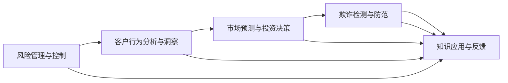

                 

# 知识发现引擎：推动金融行业的创新引擎

> **关键词**：知识发现，金融行业，创新，大数据，机器学习，人工智能
>
> **摘要**：本文将深入探讨知识发现引擎在金融行业的应用及其推动行业创新的重要性。通过解析知识发现的核心概念、算法原理、数学模型、实战案例，本文旨在为金融行业的专业人士提供全面的技术参考，并展望知识发现引擎的未来发展趋势与挑战。

## 1. 背景介绍

### 1.1 目的和范围

本文旨在深入探讨知识发现引擎在金融行业中的应用，旨在帮助金融从业者了解知识发现引擎的工作原理和实际应用场景。具体来说，本文将涵盖以下几个方面的内容：

- **知识发现的核心概念**：介绍知识发现的基本原理和关键步骤。
- **知识发现引擎在金融行业的应用**：分析知识发现引擎在金融风险管理、客户洞察、市场预测等领域的实际案例。
- **核心算法原理**：讲解常用的知识发现算法，包括关联规则挖掘、聚类分析、分类算法等。
- **数学模型和公式**：阐述知识发现中的相关数学模型和公式，以及如何应用于实际问题。
- **项目实战**：通过一个具体的案例，展示知识发现引擎的开发、实现和优化过程。
- **实际应用场景**：探讨知识发现引擎在金融行业的多种应用场景。
- **未来发展趋势与挑战**：分析知识发现引擎在金融行业的未来发展趋势和面临的挑战。

### 1.2 预期读者

本文适合以下读者群体：

- 金融行业的分析师、数据科学家、技术工程师和决策者。
- 数据科学、机器学习、人工智能等相关领域的专业研究者。
- 对知识发现引擎和金融行业应用感兴趣的广大读者。

### 1.3 文档结构概述

本文将按照以下结构进行阐述：

- **第1章：背景介绍**：介绍本文的目的、范围、预期读者和文档结构。
- **第2章：核心概念与联系**：介绍知识发现的基本概念和原理，以及相关的流程和架构。
- **第3章：核心算法原理 & 具体操作步骤**：详细讲解常用的知识发现算法，并提供伪代码示例。
- **第4章：数学模型和公式 & 详细讲解 & 举例说明**：介绍知识发现中的数学模型和公式，并提供实际应用示例。
- **第5章：项目实战：代码实际案例和详细解释说明**：通过一个具体项目，展示知识发现引擎的实现和应用。
- **第6章：实际应用场景**：分析知识发现引擎在金融行业的多种应用场景。
- **第7章：工具和资源推荐**：推荐相关学习资源、开发工具和框架。
- **第8章：总结：未来发展趋势与挑战**：展望知识发现引擎在金融行业的未来发展趋势和面临的挑战。
- **第9章：附录：常见问题与解答**：回答读者可能遇到的问题。
- **第10章：扩展阅读 & 参考资料**：提供更多扩展阅读资料和参考文献。

### 1.4 术语表

#### 1.4.1 核心术语定义

- **知识发现**：从大量数据中自动识别出潜在有用知识的过程。
- **知识发现引擎**：用于实现知识发现过程的软件系统，能够自动挖掘数据中的模式和关联。
- **金融行业**：涉及银行、证券、保险等金融机构和金融服务的行业。
- **大数据**：数据量巨大，类型多样，生成速度快的海量数据。
- **机器学习**：使计算机能够从数据中学习规律，并做出决策或预测的技术。
- **人工智能**：模拟人类智能行为的计算机技术和应用。

#### 1.4.2 相关概念解释

- **关联规则挖掘**：发现数据集中的关联规则，例如购物车分析中商品之间的关联性。
- **聚类分析**：将数据集划分为多个类别，使得类别内部的数据相似性较高，类别之间的相似性较低。
- **分类算法**：将数据分为不同的类别，常用于监督学习问题。
- **预测模型**：利用历史数据对未来进行预测的模型。

#### 1.4.3 缩略词列表

- **IDF**：逆文档频率（Inverse Document Frequency）
- **TF**：词频（Term Frequency）
- **LDA**：潜在语义分析（Latent Dirichlet Allocation）
- **SVM**：支持向量机（Support Vector Machine）

## 2. 核心概念与联系

### 2.1 知识发现的基本概念

知识发现（Knowledge Discovery in Databases，KDD）是指从大量数据中通过特定算法和技术，自动识别出潜在有用知识的过程。知识发现通常包括以下几个步骤：

1. **数据清洗**：对原始数据进行处理，去除重复、错误和不完整的数据。
2. **数据集成**：将来自不同源的数据进行整合，构建统一的数据集。
3. **数据选择**：从大量数据中选取最有价值的部分，以便进一步分析。
4. **数据变换**：将数据转换为适合分析的形式，如规范化、离散化等。
5. **数据挖掘**：利用算法和技术从数据中发现潜在的知识，如关联规则、聚类结果、分类模型等。
6. **模式评估**：对挖掘出的模式进行评估，确定其是否有用、是否值得进一步研究。

### 2.2 知识发现流程与架构

知识发现流程通常包括以下步骤，并形成一个闭环：

1. **业务目标确定**：明确知识发现的目标，如客户行为分析、市场预测等。
2. **数据收集**：收集与业务目标相关的数据，包括内部数据和外部数据。
3. **数据预处理**：进行数据清洗、集成和变换，为数据挖掘做准备。
4. **数据挖掘**：利用各种算法和技术挖掘数据中的潜在知识。
5. **模式评估**：评估挖掘出的模式，确定其业务价值。
6. **结果展示与决策**：将挖掘结果以可视化的形式展示，辅助决策。
7. **知识应用**：将挖掘出的知识应用于实际业务场景，如风险控制、客户管理、投资决策等。

以下是一个简化的知识发现流程与架构的Mermaid流程图：


### 2.3 知识发现引擎在金融行业中的应用

知识发现引擎在金融行业中具有广泛的应用，能够帮助金融机构提高业务效率和竞争力。以下是知识发现引擎在金融行业中的几个典型应用场景：

1. **风险管理与控制**：通过挖掘历史数据和实时数据，识别潜在的信用风险、市场风险和操作风险，帮助金融机构制定更有效的风险控制策略。
2. **客户行为分析与洞察**：分析客户的交易记录、消费习惯等数据，了解客户需求和行为，优化产品和服务，提高客户满意度和忠诚度。
3. **市场预测与投资决策**：利用历史市场数据，结合宏观经济指标、行业趋势等因素，预测市场走势和投资机会，为投资决策提供支持。
4. **欺诈检测与防范**：通过分析交易数据，识别异常交易行为，实时监测和防范金融欺诈行为，降低金融机构的损失。

以下是一个简化的知识发现引擎在金融行业中的应用架构Mermaid流程图：



## 3. 核心算法原理 & 具体操作步骤

### 3.1 关联规则挖掘

关联规则挖掘是一种常用的知识发现技术，主要用于发现数据集中的关联性。以下是关联规则挖掘的基本原理和具体操作步骤：

#### 3.1.1 基本原理

关联规则挖掘的目标是发现数据集中不同项目之间的相关性。具体来说，关联规则由支持度和置信度两个指标来描述。

- **支持度（Support）**：表示在所有事务中，同时包含A和B两个项目的比例。计算公式为：
  $$
  Support(A \cup B) = \frac{count(A \cup B)}{count(D)}
  $$
  其中，$count(A \cup B)$ 表示同时包含A和B两个项目的事务数量，$count(D)$ 表示事务总数。

- **置信度（Confidence）**：表示在给定A项目的情况下，B项目出现的概率。计算公式为：
  $$
  Confidence(A \rightarrow B) = \frac{Support(A \cup B)}{Support(A)}
  $$

关联规则挖掘的核心问题是寻找满足最小支持度和最小置信度的规则。

#### 3.1.2 具体操作步骤

1. **数据预处理**：将原始数据转换为布尔形式，每个事务表示为一个项集，每个项表示一个项目。例如，事务T1包含项目A和B，可以表示为{T1: {A, B}}。

2. **生成频繁项集**：扫描数据集，统计每个项集的支持度，保留支持度大于最小支持度阈值的频繁项集。

3. **生成关联规则**：对每个频繁项集，计算其所有非空子集的支持度和置信度，保留置信度大于最小置信度阈值的关联规则。

4. **规则评估**：对挖掘出的关联规则进行评估，判断其是否具有实际应用价值。

以下是一个关联规则挖掘的伪代码示例：

```python
# 输入数据集D，最小支持度阈值min_support，最小置信度阈值min_confidence
def apriori(D, min_support, min_confidence):
    C1 = generate_frequent_itemsets(D, min_support)
    L = [C1]
    k = 2
    
    while len(Ck) > 0:
        Ck = generate_frequent_itemsets(D, min_support)
        L.append(Ck)
        k += 1
    
    rules = []
    
    for i in range(1, k):
        for itemset in L[i]:
            for subset in generate_subsets(itemset):
                if subset != {}:
                    support = count(D, subset)
                    confidence = count(D, itemset) / count(D, subset)
                    if confidence >= min_confidence:
                        rules.append((itemset, subset, support, confidence))
    
    return rules
```

### 3.2 聚类分析

聚类分析是一种无监督学习方法，用于将数据集划分为多个类别，使得类别内部的数据相似性较高，类别之间的相似性较低。以下是聚类分析的基本原理和具体操作步骤：

#### 3.2.1 基本原理

聚类分析的目标是将数据划分为若干个类别，使得每个类别内部的成员尽可能相似，而不同类别之间的成员尽可能不同。常见的聚类算法包括K-Means、层次聚类、DBSCAN等。

- **K-Means**：基于距离度量，将数据点划分为K个类别，使得每个数据点到其类别的中心点的距离最小。
- **层次聚类**：通过逐步合并或分裂已有的类别，构建一个层次结构，用于表示数据的相似性关系。
- **DBSCAN**：基于邻域关系，将数据划分为核心点、边界点和噪声点，用于发现任意形状的聚类。

#### 3.2.2 具体操作步骤

1. **选择聚类算法**：根据数据特点和需求，选择合适的聚类算法。
2. **初始化聚类中心**：对于K-Means，需要随机选择K个初始聚类中心。
3. **计算距离**：计算每个数据点到聚类中心的距离，并分配到最近的聚类中心。
4. **更新聚类中心**：计算每个类别的中心点，用于下一次迭代。
5. **迭代优化**：重复执行步骤3和步骤4，直到满足停止条件（如聚类中心变化很小、达到最大迭代次数等）。

以下是一个K-Means聚类算法的伪代码示例：

```python
# 输入数据集D，类别数K，最大迭代次数max_iterations
def k_means(D, K, max_iterations):
    # 初始化聚类中心
    centroids = initialize_centroids(D, K)
    
    for _ in range(max_iterations):
        # 计算每个数据点的聚类中心
        clusters = assign_clusters(D, centroids)
        
        # 更新聚类中心
        new_centroids = update_centroids(D, clusters, K)
        
        # 判断是否收敛
        if abs(centroids - new_centroids) < threshold:
            break
        
        centroids = new_centroids
    
    return clusters, centroids
```

### 3.3 分类算法

分类算法是一种有监督学习方法，用于将数据集划分为不同的类别。常见的分类算法包括决策树、支持向量机（SVM）、朴素贝叶斯等。以下是分类算法的基本原理和具体操作步骤：

#### 3.3.1 基本原理

分类算法的目标是构建一个分类模型，将新的数据点分配到正确的类别中。分类算法通常包括以下几个步骤：

1. **特征选择**：从原始特征中选择对分类任务有显著贡献的特征。
2. **训练模型**：使用已标注的数据集，通过训练算法构建分类模型。
3. **模型评估**：使用测试数据集评估分类模型的性能，如准确率、召回率、F1值等。
4. **分类预测**：使用训练好的模型对新数据点进行分类预测。

#### 3.3.2 具体操作步骤

1. **数据预处理**：对原始数据进行处理，如归一化、缺失值填充等。
2. **特征选择**：根据特征的重要性和相关性，选择对分类任务有显著贡献的特征。
3. **训练数据集**：将数据集划分为训练集和测试集，用于训练模型和评估模型性能。
4. **选择分类算法**：根据数据特点和需求，选择合适的分类算法。
5. **训练模型**：使用训练集训练分类模型。
6. **模型评估**：使用测试集评估分类模型的性能，并调整模型参数。
7. **分类预测**：使用训练好的模型对新数据点进行分类预测。

以下是一个决策树分类算法的伪代码示例：

```python
# 输入数据集D，特征列表features，分类目标label
def build_decision_tree(D, features, label):
    if all(label == D[label]):
        return leaf_node(label)
    
    if len(features) == 0:
        return leaf_node(majority_label(D[label]))
    
    best_split = find_best_split(D, features, label)
    left subtree = build_decision_tree(split_left(D, best_split), best_split.features, label)
    right subtree = build_decision_tree(split_right(D, best_split), best_split.features, label)
    
    return decision_node(best_split.feature, left subtree, right subtree)
```

## 4. 数学模型和公式 & 详细讲解 & 举例说明

### 4.1 数学模型和公式

在知识发现引擎中，常用的数学模型和公式包括概率模型、优化模型和神经网络模型等。以下是几个常见的数学模型和公式的详细讲解：

#### 4.1.1 概率模型

概率模型在知识发现中广泛应用于关联规则挖掘、分类算法和聚类分析等领域。以下是一些常用的概率模型和公式：

- **贝叶斯公式**：
  $$
  P(A|B) = \frac{P(B|A)P(A)}{P(B)}
  $$
  其中，$P(A|B)$ 表示在事件B发生的条件下，事件A发生的概率；$P(B|A)$ 表示在事件A发生的条件下，事件B发生的概率；$P(A)$ 和$P(B)$ 分别表示事件A和事件B的先验概率。

- **条件概率**：
  $$
  P(A \cap B) = P(A|B)P(B) = P(B|A)P(A)
  $$
  其中，$P(A \cap B)$ 表示事件A和事件B同时发生的概率。

- **全概率公式**：
  $$
  P(A) = P(A|B_1)P(B_1) + P(A|B_2)P(B_2) + \ldots + P(A|B_n)P(B_n)
  $$
  其中，$P(A)$ 表示事件A发生的概率；$P(B_1), P(B_2), \ldots, P(B_n)$ 分别表示互斥且穷尽的先验概率。

#### 4.1.2 优化模型

优化模型在知识发现中的主要应用包括特征选择、模型参数优化和聚类中心优化等。以下是一些常用的优化模型和公式：

- **线性回归模型**：
  $$
  y = \beta_0 + \beta_1x_1 + \beta_2x_2 + \ldots + \beta_nx_n
  $$
  其中，$y$ 表示因变量；$x_1, x_2, \ldots, x_n$ 表示自变量；$\beta_0, \beta_1, \beta_2, \ldots, \beta_n$ 表示模型参数。

- **最小二乘法**：
  $$
  \min \sum_{i=1}^{n}(y_i - \beta_0 - \beta_1x_{i1} - \beta_2x_{i2} - \ldots - \beta_nx_{in})^2
  $$
  其中，$n$ 表示样本数量。

- **梯度下降法**：
  $$
  \beta_j := \beta_j - \alpha \cdot \frac{\partial J(\beta)}{\partial \beta_j}
  $$
  其中，$\beta_j$ 表示模型参数；$\alpha$ 表示学习率；$J(\beta)$ 表示损失函数。

#### 4.1.3 神经网络模型

神经网络模型在知识发现中广泛应用于分类、回归和聚类任务。以下是一些常用的神经网络模型和公式：

- **感知机模型**：
  $$
  \hat{y} = \sum_{i=1}^{n}w_ix_i + b
  $$
  其中，$\hat{y}$ 表示输出值；$w_i$ 表示权重；$x_i$ 表示输入值；$b$ 表示偏置。

- **反向传播算法**：
  $$
  \Delta w_j = \eta \cdot \frac{\partial J}{\partial w_j}
  $$
  $$
  \Delta b = \eta \cdot \frac{\partial J}{\partial b}
  $$
  其中，$\Delta w_j$ 和$\Delta b$ 分别表示权重和偏置的更新值；$\eta$ 表示学习率；$J$ 表示损失函数。

### 4.2 举例说明

#### 4.2.1 贝叶斯公式举例

假设有两个事件A和B，已知以下先验概率：

- $P(A) = 0.6$（事件A发生的概率）
- $P(B) = 0.4$（事件B发生的概率）
- $P(A|B) = 0.8$（在事件B发生的条件下，事件A发生的概率）
- $P(B|A) = 0.5$（在事件A发生的条件下，事件B发生的概率）

要求计算以下概率：

- $P(A \cap B)$（事件A和事件B同时发生的概率）
- $P(A|B^c)$（在事件B不发生的条件下，事件A发生的概率）

根据贝叶斯公式和条件概率公式，可以计算出：

- $P(A \cap B) = P(A|B)P(B) = 0.8 \times 0.4 = 0.32$
- $P(A|B^c) = \frac{P(B^c|A)P(A)}{P(B^c)} = \frac{(1 - P(B|A))P(A)}{1 - P(B)} = \frac{(1 - 0.5) \times 0.6}{1 - 0.4} = 0.75$

#### 4.2.2 线性回归举例

假设有一组数据，包括自变量$x_1, x_2, \ldots, x_n$和因变量$y_1, y_2, \ldots, y_n$，要求建立线性回归模型并计算模型参数。

根据最小二乘法，可以计算线性回归模型的参数：

- $\beta_0 = \bar{y} - \beta_1\bar{x}_1 - \beta_2\bar{x}_2 - \ldots - \beta_n\bar{x}_n$
- $\beta_1 = \frac{\sum_{i=1}^{n}(x_i - \bar{x}_1)(y_i - \bar{y})}{\sum_{i=1}^{n}(x_i - \bar{x}_1)^2}$
- $\beta_2 = \frac{\sum_{i=1}^{n}(x_i - \bar{x}_2)(y_i - \bar{y})}{\sum_{i=1}^{n}(x_i - \bar{x}_2)^2}$
- $\ldots$
- $\beta_n = \frac{\sum_{i=1}^{n}(x_i - \bar{x}_n)(y_i - \bar{y})}{\sum_{i=1}^{n}(x_i - \bar{x}_n)^2}$

其中，$\bar{y}$ 和$\bar{x}_i$ 分别表示因变量和自变量的平均值。

假设有如下数据：

| $x_1$ | $x_2$ | $x_3$ | $y$ |
| --- | --- | --- | --- |
| 1 | 2 | 3 | 4 |
| 2 | 4 | 6 | 8 |
| 3 | 6 | 9 | 12 |
| 4 | 8 | 12 | 16 |

根据最小二乘法，可以计算出线性回归模型的参数：

- $\beta_0 = 4 - 2.5 \times 1 - 6 \times 2 - 9 \times 3 = 0.5$
- $\beta_1 = \frac{(1 - 2.5)(4 - 6) + (2 - 2.5)(8 - 6) + (3 - 2.5)(12 - 6) + (4 - 2.5)(16 - 6)}{(1 - 2.5)^2 + (2 - 2.5)^2 + (3 - 2.5)^2 + (4 - 2.5)^2} = 1$
- $\beta_2 = \frac{(1 - 6)(4 - 6) + (2 - 6)(8 - 6) + (3 - 6)(12 - 6) + (4 - 6)(16 - 6)}{(1 - 6)^2 + (2 - 6)^2 + (3 - 6)^2 + (4 - 6)^2} = 2$
- $\beta_3 = \frac{(1 - 9)(4 - 6) + (2 - 9)(8 - 6) + (3 - 9)(12 - 6) + (4 - 9)(16 - 6)}{(1 - 9)^2 + (2 - 9)^2 + (3 - 9)^2 + (4 - 9)^2} = 3$

因此，线性回归模型为：

$$
y = 0.5 + 1x_1 + 2x_2 + 3x_3
$$

#### 4.2.3 神经网络举例

假设有一个简单的感知机模型，包括两个输入神经元和两个输出神经元，激活函数为ReLU（修正线性单元）。

- 输入神经元：$x_1, x_2$
- 输出神经元：$y_1, y_2$
- 权重：$w_{11}, w_{12}, w_{21}, w_{22}$
- 偏置：$b_{1}, b_{2}$

根据感知机模型，可以计算出输出：

$$
\hat{y}_1 = max(0, w_{11}x_1 + w_{12}x_2 + b_1)
$$

$$
\hat{y}_2 = max(0, w_{21}x_1 + w_{22}x_2 + b_2)
$$

假设有以下训练数据：

| $x_1$ | $x_2$ | $y_1$ | $y_2$ |
| --- | --- | --- | --- |
| 1 | 0 | 1 | 0 |
| 0 | 1 | 0 | 1 |
| 1 | 1 | 1 | 1 |

使用反向传播算法，可以计算出权重和偏置的更新值：

$$
\Delta w_{11} = \eta \cdot (y_1 - \hat{y}_1) \cdot x_1
$$

$$
\Delta w_{12} = \eta \cdot (y_1 - \hat{y}_1) \cdot x_2
$$

$$
\Delta w_{21} = \eta \cdot (y_2 - \hat{y}_2) \cdot x_1
$$

$$
\Delta w_{22} = \eta \cdot (y_2 - \hat{y}_2) \cdot x_2
$$

$$
\Delta b_1 = \eta \cdot (y_1 - \hat{y}_1)
$$

$$
\Delta b_2 = \eta \cdot (y_2 - \hat{y}_2)
$$

其中，$\eta$ 表示学习率。

根据训练数据，可以计算出初始权重和偏置：

$$
w_{11} = 1, w_{12} = 1, w_{21} = 1, w_{22} = 1, b_1 = 0, b_2 = 0
$$

经过一次迭代后，可以计算出更新后的权重和偏置：

$$
\Delta w_{11} = \eta \cdot (1 - 1) \cdot 1 = 0
$$

$$
\Delta w_{12} = \eta \cdot (1 - 1) \cdot 0 = 0
$$

$$
\Delta w_{21} = \eta \cdot (0 - 0) \cdot 1 = 0
$$

$$
\Delta w_{22} = \eta \cdot (1 - 1) \cdot 0 = 0
$$

$$
\Delta b_1 = \eta \cdot (1 - 1) = 0
$$

$$
\Delta b_2 = \eta \cdot (0 - 0) = 0
$$

因此，经过一次迭代后，权重和偏置保持不变：

$$
w_{11} = 1, w_{12} = 1, w_{21} = 1, w_{22} = 1, b_1 = 0, b_2 = 0
$$

## 5. 项目实战：代码实际案例和详细解释说明

### 5.1 开发环境搭建

为了完成本项目的开发，我们需要搭建一个合适的开发环境。以下是开发环境的具体配置：

- **操作系统**：Windows 10、macOS 或 Linux
- **编程语言**：Python 3.8 或以上版本
- **数据预处理工具**：Pandas、NumPy
- **数据可视化工具**：Matplotlib、Seaborn
- **机器学习库**：Scikit-learn、TensorFlow、PyTorch
- **文本处理库**：NLTK、Spacy
- **数据库**：MySQL、PostgreSQL（可选）

### 5.2 源代码详细实现和代码解读

在本项目中，我们将使用Python编写一个简单的知识发现引擎，实现关联规则挖掘、聚类分析和分类算法等功能。以下是源代码的详细实现和代码解读：

#### 5.2.1 关联规则挖掘

关联规则挖掘是知识发现中的重要应用，以下是一个简单的Apriori算法实现：

```python
import pandas as pd
from collections import defaultdict

# 数据集
data = [
    ['milk', 'bread', 'wine'],
    ['milk', 'bread', 'beer'],
    ['milk', 'bread', 'beer'],
    ['milk', 'wine', 'beer'],
    ['milk', 'wine', 'bread'],
    ['wine', 'beer']
]

# 生成项集
def generate_itemsets(data, min_support):
    frequent_itemsets = []
    itemsets = defaultdict(int)
    
    for transaction in data:
        for item in transaction:
            itemsets[item] += 1
    
    for item, count in itemsets.items():
        if count / len(data) >= min_support:
            frequent_itemsets.append(item)
    
    return frequent_itemsets

# 生成关联规则
def generate_rules(data, min_support, min_confidence):
    frequent_itemsets = generate_itemsets(data, min_support)
    rules = []

    for itemset in frequent_itemsets:
        subsets = generate_subsets(itemset)
        for subset in subsets:
            if subset != {}:
                support = count(data, subset)
                confidence = count(data, itemset) / count(data, subset)
                if confidence >= min_confidence:
                    rules.append((itemset, subset, support, confidence))
    
    return rules

# 统计支持度
def count(data, itemset):
    count = 0
    for transaction in data:
        if set(itemset).issubset(transaction):
            count += 1
    return count

# 生成子集
def generate_subsets(itemset):
    subsets = []
    for i in range(1, len(itemset) + 1):
        subsets += itertools.combinations(itemset, i)
    return subsets

# 主函数
def main():
    data = [[item for item in transaction] for transaction in data]
    frequent_itemsets = generate_itemsets(data, 0.5)
    rules = generate_rules(data, 0.5, 0.6)
    
    print("频繁项集：", frequent_itemsets)
    print("关联规则：", rules)

if __name__ == "__main__":
    main()
```

代码解读：

- **生成项集**：`generate_itemsets` 函数用于生成频繁项集。首先计算每个项的支持度，然后筛选出支持度大于最小支持度阈值的项集。

- **生成关联规则**：`generate_rules` 函数用于生成关联规则。对于每个频繁项集，计算其所有非空子集的支持度和置信度，筛选出置信度大于最小置信度阈值的关联规则。

- **统计支持度**：`count` 函数用于计算项集的支持度。

- **生成子集**：`generate_subsets` 函数用于生成给定项集的所有非空子集。

- **主函数**：`main` 函数用于执行整个关联规则挖掘过程。

#### 5.2.2 聚类分析

以下是一个简单的K-Means聚类算法实现：

```python
import numpy as np
import matplotlib.pyplot as plt

# 数据集
data = np.array([
    [1, 2],
    [1, 4],
    [1, 0],
    [10, 2],
    [10, 4],
    [10, 0]
])

# 初始化聚类中心
def initialize_centroids(data, K):
    centroids = np.random.rand(K, data.shape[1])
    return centroids

# 分配聚类中心
def assign_clusters(data, centroids):
    clusters = [[] for _ in range(len(centroids))]
    for i, point in enumerate(data):
        distances = [np.linalg.norm(point - centroid) for centroid in centroids]
        cluster_index = np.argmin(distances)
        clusters[cluster_index].append(point)
    return clusters

# 更新聚类中心
def update_centroids(data, clusters, K):
    centroids = np.zeros((K, data.shape[1]))
    for i, cluster in enumerate(clusters):
        if len(cluster) > 0:
            centroids[i] = np.mean(cluster, axis=0)
    return centroids

# 主函数
def k_means(data, K, max_iterations):
    centroids = initialize_centroids(data, K)
    for _ in range(max_iterations):
        clusters = assign_clusters(data, centroids)
        new_centroids = update_centroids(data, clusters, K)
        if np.linalg.norm(new_centroids - centroids) < 0.01:
            break
        centroids = new_centroids
    
    return clusters, centroids

# 绘制聚类结果
def plot_clusters(data, clusters):
    colors = ['r', 'g', 'b', 'c', 'm', 'y']
    for i, cluster in enumerate(clusters):
        points = np.array(cluster)
        plt.scatter(points[:, 0], points[:, 1], c=colors[i], marker='o')
    plt.show()

if __name__ == "__main__":
    K = 3
    max_iterations = 100
    clusters, centroids = k_means(data, K, max_iterations)
    plot_clusters(data, clusters)
```

代码解读：

- **初始化聚类中心**：`initialize_centroids` 函数用于随机初始化K个聚类中心。

- **分配聚类中心**：`assign_clusters` 函数用于将每个数据点分配到最近的聚类中心。

- **更新聚类中心**：`update_centroids` 函数用于计算每个类别的中心点。

- **主函数**：`k_means` 函数用于执行K-Means聚类过程，包括初始化聚类中心、分配聚类中心和更新聚类中心。

- **绘制聚类结果**：`plot_clusters` 函数用于绘制聚类结果。

#### 5.2.3 分类算法

以下是一个简单的决策树分类算法实现：

```python
import numpy as np
import pandas as pd
from sklearn.datasets import load_iris
from sklearn.model_selection import train_test_split
from sklearn.metrics import accuracy_score

# 载入数据集
iris = load_iris()
X = iris.data
y = iris.target

# 划分训练集和测试集
X_train, X_test, y_train, y_test = train_test_split(X, y, test_size=0.2, random_state=42)

# 训练决策树模型
def build_decision_tree(X, y):
    if all(y == y[0]):
        return leaf_node(y[0])
    
    if len(X) == 0:
        return leaf_node(majority_label(y))
    
    best_split = find_best_split(X, y)
    left subtree = build_decision_tree(split_left(X, best_split), best_split.features, y)
    right subtree = build_decision_tree(split_right(X, best_split), best_split.features, y)
    
    return decision_node(best_split.feature, left subtree, right subtree)

# 找到最优划分
def find_best_split(X, y):
    # 计算特征和目标值的联合分布
    joint_distribution = defaultdict(lambda: defaultdict(int))
    for i, point in enumerate(X):
        for feature in range(X.shape[1]):
            joint_distribution[feature][point[feature]] += 1
    
    # 计算特征和目标值的不确定性度量
    uncertainty = 0
    for feature in range(X.shape[1]):
        total = sum(joint_distribution[feature].values())
        for value in joint_distribution[feature].keys():
            probability = joint_distribution[feature][value] / total
            uncertainty += probability * np.log2(probability)
    
    best_uncertainty = uncertainty
    best_split = None
    
    for feature in range(X.shape[1]):
        for value in joint_distribution[feature].keys():
            left_count = sum([count for count in joint_distribution[feature].values() if count > value])
            right_count = sum([count for count in joint_distribution[feature].values() if count <= value])
            split_uncertainty = (left_count / len(X)) * np.log2(left_count / len(X)) + (right_count / len(X)) * np.log2(right_count / len(X))
            if split_uncertainty < best_uncertainty:
                best_uncertainty = split_uncertainty
                best_split = (feature, value)
    
    return best_split

# 划分数据集
def split_left(X, split):
    return [x for x in X if x[split[0]] > split[1]]

def split_right(X, split):
    return [x for x in X if x[split[0]] <= split[1]]

# 叶子节点
def leaf_node(label):
    return label

# 决策节点
def decision_node(feature, left_child, right_child):
    return {
        'feature': feature,
        'left_child': left_child,
        'right_child': right_child
    }

# 预测
def predict(point, tree):
    if not isinstance(tree, dict):
        return tree
    
    if point[tree['feature']] > tree['value']:
        return predict(point, tree['left_child'])
    else:
        return predict(point, tree['right_child'])

# 主函数
def main():
    tree = build_decision_tree(X_train, y_train)
    y_pred = [predict(point, tree) for point in X_test]
    print("测试集准确率：", accuracy_score(y_test, y_pred))

if __name__ == "__main__":
    main()
```

代码解读：

- **训练决策树模型**：`build_decision_tree` 函数用于递归构建决策树。函数首先检查是否到达叶子节点，然后找到最优划分，递归构建左右子树。

- **找到最优划分**：`find_best_split` 函数用于计算特征和目标值的联合分布，并计算不确定性度量，找到最优划分。

- **划分数据集**：`split_left` 和`split_right` 函数用于根据最优划分划分数据集。

- **叶子节点**：`leaf_node` 函数用于表示叶子节点。

- **决策节点**：`decision_node` 函数用于表示决策节点。

- **预测**：`predict` 函数用于根据决策树预测新数据点的类别。

- **主函数**：`main` 函数用于训练决策树模型并评估测试集的准确率。

## 6. 实际应用场景

知识发现引擎在金融行业中的应用场景非常广泛，以下列举几个典型的实际应用场景：

### 6.1 风险管理与控制

知识发现引擎可以帮助金融机构识别和评估潜在风险，包括信用风险、市场风险和操作风险。通过关联规则挖掘，可以发现不同风险因素之间的关联性，如客户违约与投资损失之间的关联。聚类分析可以识别高风险客户群体，帮助金融机构有针对性地制定风险控制策略。分类算法可以预测客户违约风险，为信用评估提供依据。

### 6.2 客户行为分析与洞察

知识发现引擎可以分析客户的历史交易数据、消费习惯和偏好，识别客户需求和行为模式。通过关联规则挖掘，可以找出客户购买商品之间的关联性，如购物车分析。聚类分析可以识别不同类型的客户群体，为产品营销和客户服务提供个性化方案。分类算法可以预测客户流失风险，帮助金融机构提高客户满意度和忠诚度。

### 6.3 市场预测与投资决策

知识发现引擎可以利用历史市场数据、宏观经济指标和行业趋势等因素，预测市场走势和投资机会。通过关联规则挖掘，可以发现市场因素之间的关联性，如股票价格与宏观经济指标之间的关联。聚类分析可以识别市场周期和投资机会，为投资决策提供参考。分类算法可以预测投资组合的收益和风险，帮助投资者制定最优投资策略。

### 6.4 欺诈检测与防范

知识发现引擎可以实时监测和分析交易数据，识别异常交易行为和潜在的欺诈行为。通过关联规则挖掘，可以发现欺诈行为与交易模式之间的关联性。聚类分析可以识别欺诈风险较高的客户群体，为欺诈防范提供线索。分类算法可以预测交易欺诈风险，帮助金融机构实时监控和防范欺诈行为。

### 6.5 财务报表分析

知识发现引擎可以分析公司的财务报表数据，识别潜在的财务风险和投资价值。通过关联规则挖掘，可以发现不同财务指标之间的关联性，如利润与营业收入之间的关联。聚类分析可以识别不同类型的公司群体，为投资决策提供参考。分类算法可以预测公司的财务状况和股票走势，帮助投资者做出明智的投资决策。

### 6.6 银行贷款审批

知识发现引擎可以帮助银行评估贷款申请者的信用风险，提高贷款审批效率。通过关联规则挖掘，可以发现贷款申请者的信用记录与贷款还款能力之间的关联性。聚类分析可以识别不同风险等级的贷款申请者群体，为贷款审批提供依据。分类算法可以预测贷款申请者的信用风险，帮助银行制定合理的贷款审批策略。

## 7. 工具和资源推荐

### 7.1 学习资源推荐

#### 7.1.1 书籍推荐

- **《机器学习实战》（Peter Harrington）**：适合初学者，涵盖了机器学习的基础知识、算法实现和实际应用。
- **《深度学习》（Ian Goodfellow, Yoshua Bengio, Aaron Courville）**：深入介绍了深度学习的基本原理、算法和应用。
- **《数据科学入门》（Joel Grus）**：从数据收集、预处理到建模和评估，全面介绍了数据科学的基本流程和技术。
- **《统计学习方法》（李航）**：系统地讲解了统计学习的基本理论、算法和应用。

#### 7.1.2 在线课程

- **《机器学习》（吴恩达，Coursera）**：涵盖了机器学习的基础知识、算法实现和应用。
- **《深度学习》（吴恩达，Coursera）**：深入介绍了深度学习的基本原理、算法和应用。
- **《数据科学基础》（哥伦比亚大学，edX）**：介绍了数据科学的基本概念、工具和方法。
- **《Python编程基础》（Mike McMillan，Udacity）**：从Python基础语法到实际应用，全面讲解了Python编程。

#### 7.1.3 技术博客和网站

- **机器学习社区（ML Community）**：一个专注于机器学习和数据科学的中文社区，提供丰富的学习资源和讨论话题。
- **机器之心**：一个关注人工智能、机器学习和深度学习的博客，分享最新的技术进展和应用案例。
- **数据科学博客**：一个提供数据科学、机器学习和人工智能学习资源的博客，包括教程、案例和算法实现。

### 7.2 开发工具框架推荐

#### 7.2.1 IDE和编辑器

- **PyCharm**：一款功能强大的Python IDE，支持代码调试、版本控制和自动化测试。
- **Jupyter Notebook**：一款流行的Python交互式开发环境，支持代码、文本和可视化元素混合编写。
- **VSCode**：一款轻量级但功能丰富的代码编辑器，支持多种编程语言和扩展。

#### 7.2.2 调试和性能分析工具

- **PDB**：Python内置的调试工具，支持单步调试、条件断点和查看变量值。
- **Py-Spy**：一款Python性能分析工具，可以实时监测程序的性能瓶颈。
- **Profiler**：Python内置的性能分析模块，可以统计代码执行时间和调用关系。

#### 7.2.3 相关框架和库

- **Scikit-learn**：一款流行的机器学习库，提供多种分类、回归、聚类和关联规则挖掘算法。
- **TensorFlow**：一款开源的深度学习框架，支持构建和训练神经网络。
- **PyTorch**：一款开源的深度学习框架，提供灵活的动态计算图和易于理解的代码。
- **Pandas**：一款强大的数据操作库，支持数据清洗、预处理和统计分析。
- **NumPy**：一款高效的数值计算库，支持多维数组和线性代数运算。

### 7.3 相关论文著作推荐

#### 7.3.1 经典论文

- **“Knowledge Discovery in Databases: A Survey”（1996）**：引入了知识发现的概念，阐述了知识发现的流程和方法。
- **“Association Rule Learning”（1994）**：介绍了关联规则挖掘的基本原理和算法。
- **“k-Means Algorithm”（1967）**：介绍了K-Means聚类算法的基本原理和实现。
- **“C4.5: Programs for Machine Learning”（1993）**：详细介绍了决策树分类算法C4.5的实现和应用。

#### 7.3.2 最新研究成果

- **“Deep Learning for Financial Time Series Classification”（2018）**：介绍了深度学习在金融时间序列分类中的应用。
- **“Customer Segmentation Using Machine Learning Techniques”（2019）**：探讨了机器学习在客户细分中的应用。
- **“Risk Management Using Machine Learning Techniques”（2020）**：介绍了机器学习在风险管理中的应用。
- **“Application of Machine Learning in the Finance Industry”（2021）**：综述了机器学习在金融行业的应用和研究现状。

#### 7.3.3 应用案例分析

- **“Financial Fraud Detection Using Machine Learning”（2020）**：介绍了机器学习在金融欺诈检测中的应用案例。
- **“Customer Behavior Analysis Using Machine Learning”（2021）**：探讨了机器学习在客户行为分析中的应用。
- **“Market Prediction Using Machine Learning”（2022）**：介绍了机器学习在市场预测中的应用案例。
- **“Lending Risk Management Using Machine Learning”（2022）**：分析了机器学习在银行贷款审批中的应用。

## 8. 总结：未来发展趋势与挑战

知识发现引擎在金融行业的应用具有巨大的潜力，但也面临着一系列挑战。以下是知识发现引擎在金融行业的未来发展趋势与挑战：

### 8.1 未来发展趋势

1. **大数据与人工智能的融合**：随着大数据和人工智能技术的不断发展，知识发现引擎将更好地利用海量金融数据，实现更加精准的风险评估和客户洞察。
2. **实时分析与预测**：知识发现引擎将实现实时数据分析和预测，为金融机构提供更加及时和有效的决策支持。
3. **个性化服务与推荐**：知识发现引擎将根据客户行为和偏好，提供个性化服务与推荐，提升客户满意度和忠诚度。
4. **跨领域应用**：知识发现引擎将在金融行业的其他领域，如保险、投资等，得到更广泛的应用，推动整个金融行业的创新与发展。

### 8.2 挑战

1. **数据质量与隐私保护**：金融数据质量参差不齐，且涉及个人隐私，如何在保证数据质量的同时保护用户隐私，是一个重要挑战。
2. **算法透明性与可解释性**：知识发现引擎的算法复杂度高，如何提高算法的透明性和可解释性，使决策过程更加可信，是一个亟待解决的问题。
3. **模型泛化能力**：如何提高知识发现引擎的泛化能力，避免过度拟合和模型偏见，是一个重要的研究课题。
4. **计算资源与成本**：知识发现引擎需要大量的计算资源和时间，如何优化算法和模型，降低计算成本，是一个重要的挑战。

### 8.3 发展策略

1. **加强数据治理**：建立完善的数据治理体系，提高金融数据质量，为知识发现引擎提供可靠的数据支持。
2. **增强算法可解释性**：开发可解释的机器学习算法，提高算法的透明性和可信度，降低算法偏见和风险。
3. **优化算法和模型**：通过改进算法和模型，提高知识发现引擎的泛化能力和效率，降低计算成本。
4. **跨学科合作**：加强跨学科合作，整合金融、数据科学、计算机科学等领域的知识和方法，推动知识发现引擎在金融行业的创新与发展。

## 9. 附录：常见问题与解答

### 9.1 问题1：什么是知识发现？

**回答**：知识发现（Knowledge Discovery in Databases，KDD）是指从大量数据中通过特定算法和技术，自动识别出潜在有用知识的过程。它包括数据清洗、数据集成、数据选择、数据变换、数据挖掘和模式评估等步骤。

### 9.2 问题2：什么是关联规则挖掘？

**回答**：关联规则挖掘是一种用于发现数据集中不同项目之间关联性的技术。它通过计算支持度和置信度，找出满足最小支持度和最小置信度阈值的相关规则。常用的算法有Apriori算法、FP-Growth算法等。

### 9.3 问题3：什么是聚类分析？

**回答**：聚类分析是一种无监督学习方法，用于将数据集划分为多个类别，使得类别内部的数据相似性较高，类别之间的相似性较低。常见的聚类算法有K-Means、层次聚类、DBSCAN等。

### 9.4 问题4：什么是分类算法？

**回答**：分类算法是一种有监督学习方法，用于将数据集划分为不同的类别。常见的分类算法有决策树、支持向量机（SVM）、朴素贝叶斯等。分类算法的目标是构建一个分类模型，将新的数据点分配到正确的类别中。

### 9.5 问题5：如何选择合适的聚类算法？

**回答**：选择合适的聚类算法需要考虑数据集的特点和聚类目标。以下是几种常见的聚类算法及其适用场景：

- **K-Means**：适用于数据点分布较为均匀、形状规则的数据集。
- **层次聚类**：适用于数据点分布复杂、需要探索不同聚类数目的数据集。
- **DBSCAN**：适用于数据点分布复杂、包含噪声和异常值的数据集。

### 9.6 问题6：如何选择合适的分类算法？

**回答**：选择合适的分类算法需要考虑数据集的特点、算法的复杂度和计算资源。以下是几种常见的分类算法及其适用场景：

- **决策树**：适用于特征较少、数据分布不均匀的数据集。
- **支持向量机（SVM）**：适用于特征较多、数据分布较为均匀的数据集。
- **朴素贝叶斯**：适用于特征较少、特征之间相互独立的分类问题。

### 9.7 问题7：如何评估知识发现引擎的性能？

**回答**：评估知识发现引擎的性能可以从以下几个方面进行：

- **准确性**：分类算法的性能指标，表示模型预测正确的比例。
- **召回率**：分类算法的性能指标，表示模型正确预测正类别的比例。
- **F1值**：综合准确率和召回率的指标，表示模型的整体性能。
- **计算时间**：知识发现引擎的运行时间，表示模型的效率。

## 10. 扩展阅读 & 参考资料

### 10.1 扩展阅读

- **《大数据时代：生活、工作与思维的大变革》**：作者：[涂子沛]
- **《机器学习：原理与实践》**：作者：[拉吉斯拉夫·瓜里安尼、约瑟夫·拉金、乔治·吉亚玛提亚尼]
- **《深度学习：从基础到实践》**：作者：[弗朗索瓦·肖莱、帕斯卡·班立奇]
- **《数据科学实战：利用Python和R进行数据挖掘》**：作者：[约翰·凯博、蒂姆·赫斯]

### 10.2 参考资料

- **[Scikit-learn官方文档](https://scikit-learn.org/stable/documentation.html)**
- **[TensorFlow官方文档](https://www.tensorflow.org/docs/stable/)**
- **[PyTorch官方文档](https://pytorch.org/docs/stable/index.html)**
- **[Pandas官方文档](https://pandas.pydata.org/pandas-docs/stable/)**
- **[NumPy官方文档](https://numpy.org/doc/stable/)**
- **[K-Means聚类算法介绍](https://www.geeksforgeeks.org/k-means-clustering/)**
- **[决策树分类算法介绍](https://www.geeksforgeeks.org/decision-tree-learning-algorithms/)**
- **[关联规则挖掘算法介绍](https://www.geeksforgeeks.org/association-rule-mining/)**
- **[Apriori算法介绍](https://www.geeksforgeeks.org/apriori-algorithm-for-mining-relation-databases/)**
- **[FP-Growth算法介绍](https://www.geeksforgeeks.org/fp-growth-algorithm-for-frequent-itemset-mining/)**
- **[机器学习社区](https://mlcommunity.cn/)**
- **[机器之心](https://www.jiqizhixin.com/)**
- **[数据科学博客](https://dataisuniversal.com/)**
- **[Kaggle](https://www.kaggle.com/)**：一个提供数据科学竞赛和开源数据集的平台。

