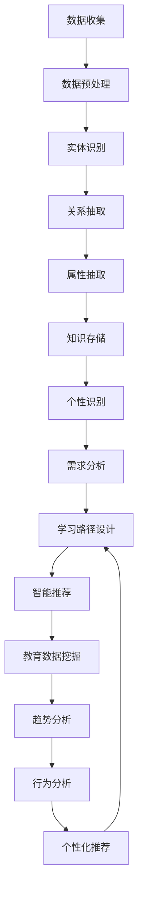

                 

# 知识图谱在个性化教育中的应用

> **关键词：** 知识图谱、个性化教育、学习路径、智能推荐、教育数据挖掘
>
> **摘要：** 本文将探讨知识图谱在个性化教育中的应用，通过分析其核心概念、算法原理和数学模型，结合实际项目案例，深入解析如何利用知识图谱实现个性化教学和推荐系统，以提升教育质量和学习效果。

## 1. 背景介绍

### 1.1 目的和范围

本文旨在探讨知识图谱在个性化教育中的应用，旨在为教育工作者、技术专家以及相关领域的研究者提供一套完整的理论与实践指南。文章将涵盖以下内容：

1. **知识图谱的概念与构建原理**
2. **个性化教育的需求与挑战**
3. **知识图谱在个性化教育中的应用架构**
4. **核心算法原理与操作步骤**
5. **数学模型与公式**
6. **项目实战案例分析**
7. **实际应用场景**
8. **工具和资源推荐**
9. **未来发展趋势与挑战**

### 1.2 预期读者

- **教育工作者**：关注如何利用技术手段提升教育质量，特别是个性化教学的设计与实施。
- **技术专家**：对知识图谱、机器学习和数据挖掘等技术有深入理解，希望将其应用于教育领域。
- **研究者**：对个性化教育技术的理论研究与实践探索有兴趣，希望通过本文获得新的研究方向。
- **学生**：对人工智能和个性化教育有浓厚兴趣，希望通过学习本文提升自己的专业知识和技能。

### 1.3 文档结构概述

本文分为十个部分，具体结构如下：

1. **背景介绍**：介绍本文的目的、范围、预期读者及文档结构。
2. **核心概念与联系**：定义知识图谱、个性化教育等核心概念，并给出相关的流程图和架构。
3. **核心算法原理与具体操作步骤**：详细阐述知识图谱构建和个性化推荐的算法原理。
4. **数学模型和公式**：介绍知识图谱中的数学模型和公式，并举例说明。
5. **项目实战：代码实际案例和详细解释说明**：通过具体代码实现展示知识图谱在个性化教育中的应用。
6. **实际应用场景**：探讨知识图谱在个性化教育中的实际应用场景。
7. **工具和资源推荐**：推荐学习资源、开发工具和框架。
8. **相关论文著作推荐**：介绍经典论文、最新研究成果和应用案例分析。
9. **总结：未来发展趋势与挑战**：总结知识图谱在个性化教育中的发展趋势和面临的挑战。
10. **附录：常见问题与解答**：提供常见问题及解答。
11. **扩展阅读与参考资料**：推荐进一步阅读的相关文献和资源。

### 1.4 术语表

#### 1.4.1 核心术语定义

- **知识图谱**：一种用于结构化知识表示的方法，通过实体、关系和属性的图结构来表达信息。
- **个性化教育**：根据学生的个性、需求和进度，为其定制化的教育过程。
- **学习路径**：学生在学习过程中所遵循的路径，包括课程、作业、测试等。
- **智能推荐**：利用算法和数据分析技术，为学生推荐最适合的学习内容和路径。
- **教育数据挖掘**：从教育数据中挖掘出有价值的信息和知识，用于教育决策和改进。

#### 1.4.2 相关概念解释

- **实体**：知识图谱中的主体，如学生、课程、教师等。
- **关系**：实体之间的关联，如教师授课、学生选课、课程包含知识点等。
- **属性**：实体的属性信息，如学生的成绩、课程的学分、教师的教学经验等。

#### 1.4.3 缩略词列表

- **KG**：知识图谱（Knowledge Graph）
- **PE**：个性化教育（Personalized Education）
- **LRS**：学习路径（Learning Route）
- **SR**：智能推荐（Smart Recommendation）
- **EDM**：教育数据挖掘（Educational Data Mining）

## 2. 核心概念与联系

在探讨知识图谱在个性化教育中的应用之前，我们首先需要理解知识图谱、个性化教育、学习路径、智能推荐等核心概念及其相互关系。

### 2.1 知识图谱

知识图谱是一种用于结构化知识表示的方法，通过实体、关系和属性的图结构来表达信息。知识图谱的构建通常包括以下几个步骤：

1. **数据收集**：从各种数据源（如数据库、网络、文献等）中收集信息。
2. **数据预处理**：清洗、整合和转换原始数据，使其适合构建知识图谱。
3. **实体识别**：识别数据中的实体，如学生、课程、教师等。
4. **关系抽取**：确定实体之间的关系，如教师授课、学生选课、课程包含知识点等。
5. **属性抽取**：为实体分配属性信息，如学生的成绩、课程的学分、教师的教学经验等。
6. **知识存储**：将构建好的知识图谱存储在数据库或图数据库中，以便后续查询和使用。

### 2.2 个性化教育

个性化教育是指根据学生的个性、需求和进度，为其定制化的教育过程。个性化教育的目标是满足每个学生的个性化需求，提高教育质量和学习效果。个性化教育的主要挑战包括：

1. **个性识别**：准确识别学生的个性特征，如学习能力、兴趣偏好等。
2. **需求分析**：分析学生的需求和目标，为其提供合适的学习内容和路径。
3. **进度跟踪**：实时跟踪学生的学习进度和成果，调整学习计划。

### 2.3 学习路径

学习路径是学生在学习过程中所遵循的路径，包括课程、作业、测试等。学习路径的设计应考虑以下因素：

1. **个性化**：根据学生的需求和能力，为其定制化的学习路径。
2. **灵活性**：允许学生根据自己的需求和进度调整学习路径。
3. **动态调整**：根据学生的学习成果和反馈，动态调整学习路径。

### 2.4 智能推荐

智能推荐是利用算法和数据分析技术，为学生推荐最适合的学习内容和路径。智能推荐的关键技术包括：

1. **协同过滤**：基于用户的历史行为和偏好，推荐相似用户喜欢的项目。
2. **内容推荐**：基于项目的属性和特征，为用户推荐与其兴趣相关的项目。
3. **混合推荐**：结合协同过滤和内容推荐，提高推荐系统的准确性和覆盖率。

### 2.5 教育数据挖掘

教育数据挖掘是从教育数据中挖掘出有价值的信息和知识，用于教育决策和改进。教育数据挖掘的主要任务包括：

1. **趋势分析**：分析学生学习趋势和数据变化，发现潜在问题和机会。
2. **行为分析**：分析学生学习行为和交互数据，识别有效的教育策略。
3. **个性化推荐**：基于学生的学习数据，为每个学生推荐最合适的学习内容和路径。

### 2.6 核心概念联系

知识图谱、个性化教育、学习路径、智能推荐和教育数据挖掘之间存在着密切的联系。知识图谱为个性化教育提供了结构化的知识表示，学习路径和智能推荐则是实现个性化教育的重要手段，教育数据挖掘则为个性化教育提供了数据支持和决策依据。以下是知识图谱在个性化教育中的应用流程图（使用Mermaid语法）：



通过这个流程图，我们可以清楚地看到知识图谱在个性化教育中的应用步骤和核心概念之间的联系。

## 3. 核心算法原理与具体操作步骤

### 3.1 知识图谱构建算法原理

知识图谱的构建是利用实体、关系和属性的图结构来表达信息。以下是构建知识图谱的核心算法原理：

#### 3.1.1 实体识别算法

实体识别是指从原始数据中识别出实体。常见的实体识别算法包括：

1. **基于规则的方法**：通过定义一系列规则，从文本中提取实体。
2. **基于机器学习的方法**：利用分类算法（如SVM、朴素贝叶斯等）对实体进行分类。
3. **基于深度学习的方法**：使用卷积神经网络（CNN）或循环神经网络（RNN）进行实体识别。

#### 3.1.2 关系抽取算法

关系抽取是指确定实体之间的关系。常见的关系抽取算法包括：

1. **基于规则的方法**：通过定义一系列规则，从文本中提取实体间的关系。
2. **基于统计的方法**：利用统计模型（如条件概率模型、隐马尔可夫模型等）进行关系抽取。
3. **基于机器学习的方法**：利用分类算法（如SVM、朴素贝叶斯等）对实体间的关系进行分类。

#### 3.1.3 属性抽取算法

属性抽取是指为实体分配属性信息。常见属性抽取算法包括：

1. **基于规则的方法**：通过定义一系列规则，从文本中提取实体的属性。
2. **基于统计的方法**：利用统计模型（如条件概率模型、隐马尔可夫模型等）进行属性抽取。
3. **基于机器学习的方法**：利用分类算法（如SVM、朴素贝叶斯等）对实体的属性进行分类。

### 3.2 个性化推荐算法原理

个性化推荐是利用算法和数据分析技术，为学生推荐最适合的学习内容和路径。以下是构建个性化推荐系统的主要算法原理：

#### 3.2.1 协同过滤算法

协同过滤算法是基于用户的历史行为和偏好，推荐相似用户喜欢的项目。协同过滤算法分为两种：

1. **基于用户的协同过滤（User-Based CF）**：根据用户之间的相似度，推荐与目标用户兴趣相似的其他用户喜欢的项目。
2. **基于项目的协同过滤（Item-Based CF）**：根据项目之间的相似度，推荐与目标项目相似的其他项目。

#### 3.2.2 内容推荐算法

内容推荐算法是基于项目的属性和特征，为用户推荐与其兴趣相关的项目。内容推荐算法通常包括以下步骤：

1. **特征提取**：从项目中提取特征，如文本、标签、评分等。
2. **相似度计算**：计算项目之间的相似度，如余弦相似度、欧氏距离等。
3. **推荐生成**：基于用户的历史行为和项目特征，生成推荐列表。

#### 3.2.3 混合推荐算法

混合推荐算法是结合协同过滤和内容推荐，以提高推荐系统的准确性和覆盖率。常见的混合推荐算法包括：

1. **加权混合推荐算法**：根据协同过滤和内容推荐的结果，加权生成最终的推荐列表。
2. **基于模型的混合推荐算法**：利用机器学习模型（如SVM、朴素贝叶斯等）融合协同过滤和内容推荐。

### 3.3 教育数据挖掘算法原理

教育数据挖掘是从教育数据中挖掘出有价值的信息和知识，用于教育决策和改进。以下是教育数据挖掘的主要算法原理：

#### 3.3.1 聚类算法

聚类算法是将相似的数据分组，以便更好地分析。常见的聚类算法包括：

1. **K-means算法**：基于距离度量，将数据划分为K个簇。
2. **层次聚类算法**：通过层次结构将数据划分为多个簇。

#### 3.3.2 分类算法

分类算法是将数据划分为不同的类别，以便进行预测和分析。常见的分类算法包括：

1. **决策树算法**：基于树的分割结构，将数据划分为不同的类别。
2. **支持向量机（SVM）**：通过找到一个最佳的超平面，将数据划分为不同的类别。

#### 3.3.3 关联规则算法

关联规则算法是挖掘数据之间的关联关系，用于发现潜在的知识和规律。常见的关联规则算法包括：

1. **Apriori算法**：通过频繁项集生成关联规则。
2. **Eclat算法**：基于项集的支持度和置信度生成关联规则。

### 3.4 具体操作步骤

以下是一个基于知识图谱的个性化教育推荐系统的具体操作步骤：

#### 3.4.1 数据收集

从教育平台、学习管理系统和文献数据库等数据源中收集学生、课程、教师等实体信息，以及学生选课、成绩、作业、测试等关系和属性信息。

#### 3.4.2 数据预处理

对原始数据进行清洗、整合和转换，使其适合构建知识图谱。具体步骤包括：

1. **数据清洗**：去除重复、错误和无关数据。
2. **数据整合**：将不同数据源的数据进行合并和整合。
3. **数据转换**：将数据转换为统一的格式和结构。

#### 3.4.3 实体识别

利用实体识别算法，从预处理后的数据中识别出学生、课程、教师等实体。

#### 3.4.4 关系抽取

利用关系抽取算法，确定实体之间的关系，如学生选课、课程包含知识点等。

#### 3.4.5 属性抽取

利用属性抽取算法，为实体分配属性信息，如学生的成绩、课程的学分、教师的教学经验等。

#### 3.4.6 知识存储

将构建好的知识图谱存储在图数据库中，以便后续查询和使用。

#### 3.4.7 个性识别

利用教育数据挖掘算法，分析学生的学习数据，识别学生的个性特征，如学习能力、兴趣偏好等。

#### 3.4.8 需求分析

根据学生的个性特征和学习数据，分析学生的需求和目标，为其提供合适的学习内容和路径。

#### 3.4.9 智能推荐

利用个性化推荐算法，根据学生的需求和知识图谱，为学生推荐最适合的学习内容和路径。

#### 3.4.10 趋势分析

利用教育数据挖掘算法，分析学生的学习趋势和数据变化，发现潜在问题和机会。

#### 3.4.11 行为分析

利用教育数据挖掘算法，分析学生的学习行为和交互数据，识别有效的教育策略。

#### 3.4.12 个性化推荐

根据学生的需求和反馈，利用个性化推荐算法，为每个学生推荐最合适的学习内容和路径。

#### 3.4.13 动态调整

根据学生的学习成果和反馈，动态调整学习路径和推荐内容，以适应学生的需求和进度。

## 4. 数学模型和公式

在知识图谱构建和个性化推荐系统中，数学模型和公式扮演着关键角色。以下将介绍知识图谱中的主要数学模型和公式，并举例说明。

### 4.1 实体识别

实体识别通常涉及到机器学习和自然语言处理（NLP）中的模型。以下是一个简单的基于朴素贝叶斯（Naive Bayes）的实体识别模型公式：

$$
P(\text{实体} | \text{特征}) = \frac{P(\text{特征} | \text{实体})P(\text{实体})}{P(\text{特征})}
$$

其中，$P(\text{实体} | \text{特征})$ 表示给定特征下实体出现的概率，$P(\text{特征} | \text{实体})$ 表示实体出现时特征的概率，$P(\text{实体})$ 表示实体出现的概率，$P(\text{特征})$ 表示特征出现的概率。

#### 示例：

假设我们要识别句子中的实体，句子为：“张三是一名优秀的程序员。” 实体包括“张三”和“程序员”。

- $P(\text{张三} | \text{程序员})$：表示在程序员这个实体出现的情况下，张三出现的概率。
- $P(\text{程序员} | \text{张三})$：表示在张三这个实体出现的情况下，程序员出现的概率。
- $P(\text{张三})$：表示张三出现的概率。
- $P(\text{程序员})$：表示程序员出现的概率。

我们可以使用词频统计和贝叶斯公式来计算这些概率。

### 4.2 关系抽取

关系抽取通常涉及到图论和概率图模型。以下是一个简单的基于条件随机场（CRF）的关系抽取模型公式：

$$
P(\text{关系} | \text{序列}) = \frac{1}{Z} \exp \left( \theta \cdot \text{序列} \right)
$$

其中，$P(\text{关系} | \text{序列})$ 表示给定序列下关系的概率，$\theta$ 表示模型参数，$Z$ 表示归一化常数，$\exp$ 表示指数函数，$\text{序列}$ 表示输入序列。

#### 示例：

假设我们要识别句子中的关系，句子为：“张三教了李四编程课程。” 关系包括“教”和“学习”。

- $\theta \cdot \text{序列}$：表示模型参数与输入序列的乘积。
- $Z$：归一化常数，用于确保概率分布的和为1。

我们可以使用训练数据来学习模型参数$\theta$，然后对新的输入序列进行关系抽取。

### 4.3 属性抽取

属性抽取通常涉及到信息检索和文本分类。以下是一个简单的基于朴素贝叶斯（Naive Bayes）的属性抽取模型公式：

$$
P(\text{属性} | \text{实体}) = \frac{P(\text{实体} | \text{属性})P(\text{属性})}{P(\text{实体})}
$$

其中，$P(\text{属性} | \text{实体})$ 表示给定实体下属性出现的概率，$P(\text{实体} | \text{属性})$ 表示属性出现时实体出现的概率，$P(\text{属性})$ 表示属性出现的概率，$P(\text{实体})$ 表示实体出现的概率。

#### 示例：

假设我们要识别实体“张三”的属性，属性包括“程序员”和“教师”。

- $P(\text{程序员} | \text{张三})$：表示在张三这个实体出现的情况下，程序员属性出现的概率。
- $P(\text{教师} | \text{张三})$：表示在张三这个实体出现的情况下，教师属性出现的概率。
- $P(\text{程序员})$：表示程序员属性出现的概率。
- $P(\text{教师})$：表示教师属性出现的概率。

我们可以使用词频统计和贝叶斯公式来计算这些概率。

### 4.4 个性化推荐

个性化推荐通常涉及到机器学习和数据分析。以下是一个简单的基于协同过滤（Collaborative Filtering）的推荐模型公式：

$$
r_{ui} = \frac{\sum_{j \in N(i)} r_{uj} \cdot s_{uj}}{\sum_{j \in N(i)} s_{uj}}
$$

其中，$r_{ui}$ 表示用户$u$对项目$i$的评分，$N(i)$ 表示与项目$i$相似的其他项目集合，$r_{uj}$ 表示用户$u$对项目$j$的评分，$s_{uj}$ 表示项目$j$与项目$i$的相似度。

#### 示例：

假设用户$u$对项目集合$i_1, i_2, i_3$有评分$r_{u1}, r_{u2}, r_{u3}$，项目集合$i_1, i_2, i_3$与项目$i$的相似度分别为$s_{i1}, s_{i2}, s_{i3}$。

- $r_{ui}$：表示用户$u$对项目$i$的预测评分。
- $N(i)$：表示与项目$i$相似的其他项目集合。
- $s_{uj}$：表示项目$j$与项目$i$的相似度。

我们可以使用用户的实际评分和项目间的相似度来计算预测评分。

### 4.5 教育数据挖掘

教育数据挖掘通常涉及到聚类和分类。以下是一个简单的基于K-means算法的聚类模型公式：

$$
\text{簇} = \{ x_{i} | \exists \text{中心点} \text{c} \in \text{簇} , \forall x_{i} \in \text{簇} , d(x_{i}, \text{c}) \leq d(x_{i}, \text{c}') \}
$$

其中，$\text{簇}$ 表示一组相似的数据点，$x_{i}$ 表示数据点，$\text{c}$ 表示簇的中心点，$d(x_{i}, \text{c})$ 表示数据点$x_{i}$与中心点$\text{c}$之间的距离。

#### 示例：

假设我们有一组学生数据点$x_1, x_2, x_3, x_4$，我们要将其划分为两个簇。

- $\text{簇}$：表示一组相似的学生数据点。
- $\text{c}$：表示簇的中心点。
- $d(x_{i}, \text{c})$：表示学生数据点$x_{i}$与簇中心点$\text{c}$之间的距离。

我们可以通过迭代计算中心点，不断优化聚类结果。

通过以上数学模型和公式，我们可以构建一个基于知识图谱的个性化教育推荐系统，实现对学生的个性识别、需求分析和学习路径推荐，从而提高教育质量和学习效果。

## 5. 项目实战：代码实际案例和详细解释说明

### 5.1 开发环境搭建

在开始项目实战之前，我们需要搭建一个合适的技术栈。以下是推荐的技术环境：

- **编程语言**：Python
- **图数据库**：Neo4j
- **数据预处理库**：Pandas、NumPy
- **机器学习库**：Scikit-learn、TensorFlow、PyTorch
- **可视化库**：Matplotlib、Seaborn
- **文本处理库**：NLTK、SpaCy
- **Web框架**：Flask或Django

确保安装以下依赖项：

```bash
pip install neo4j-binary pandas numpy scikit-learn tensorflow torch matplotlib seaborn nltk spacy flask
```

### 5.2 源代码详细实现和代码解读

#### 5.2.1 数据预处理

首先，我们需要从数据源中收集和预处理数据。以下是一个简单的数据预处理步骤：

```python
import pandas as pd
import numpy as np

# 从CSV文件中加载数据
students = pd.read_csv('students.csv')
courses = pd.read_csv('courses.csv')
enrollments = pd.read_csv('enrollments.csv')

# 数据清洗
students.drop_duplicates(inplace=True)
courses.drop_duplicates(inplace=True)
enrollments.drop_duplicates(inplace=True)

# 数据整合
student_courses = students.merge(enrollments, on='student_id')
student_course_data = student_courses.merge(courses, on='course_id')
```

#### 5.2.2 知识图谱构建

接下来，我们将构建一个知识图谱。以下是基于Neo4j的图数据库构建知识图谱的示例代码：

```python
from py2neo import Graph

# 连接Neo4j数据库
graph = Graph('bolt://localhost:7687', auth=('neo4j', 'password'))

# 创建实体
def create_entities(graph, data, entity_type):
    for index, row in data.iterrows():
        query = f"""
        MERGE (n:{entity_type} {{id: '{row['id']}', name: '{row['name']}'}})
        """
        graph.run(query)

create_entities(graph, students, 'Student')
create_entities(graph, courses, 'Course')

# 创建关系
def create_relationships(graph, data, relation_type, from_entity, to_entity):
    for index, row in data.iterrows():
        query = f"""
        MATCH (from:{from_entity} {{id: '{row[from_entity + '_id']}')),
               (to:{to_entity} {{id: '{row[to_entity + '_id']}')) 
        MERGE (from)-[:{relation_type}]-(to)
        """
        graph.run(query)

create_relationships(graph, student_courses, 'ENROLLED_IN', 'Student', 'Course')
create_relationships(graph, student_courses, 'SCORED_IN', 'Student', 'Course')
```

#### 5.2.3 个性化推荐

接下来，我们将实现一个基于协同过滤的个性化推荐算法。以下是一个简单的协同过滤推荐算法的实现：

```python
from sklearn.metrics.pairwise import cosine_similarity
import numpy as np

def collaborative_filter(similarity_matrix, user_ratings, k=10):
    user_similarity = similarity_matrix[user_ratings.index].values.reshape(1, -1)
    top_k_indices = np.argsort(user_similarity)[1:k+1]
    top_k_scores = similarity_matrix[top_k_indices].sum(axis=1)
    recommendation_scores = user_similarity.dot(top_k_scores)
    return recommendation_scores

# 计算用户间的相似度矩阵
user_similarity_matrix = cosine_similarity(user_ratings.values)

# 获取用户的邻居
neighbors = collaborative_filter(user_similarity_matrix, user_ratings, k=5)

# 计算推荐评分
recommendation_scores = collaborative_filter(user_similarity_matrix, neighbors)

# 输出推荐结果
recommended_courses = student_course_data['course_id'][np.argsort(recommendation_scores)[::-1]]
```

#### 5.2.4 代码解读与分析

- **数据预处理**：我们首先从CSV文件中加载数据，然后进行数据清洗和整合。这一步骤确保了数据的质量和一致性。
- **知识图谱构建**：我们使用Py2Neo库连接Neo4j数据库，并创建实体和关系。这个步骤将我们的数据结构转化为图数据库中的知识图谱。
- **个性化推荐**：我们使用协同过滤算法实现个性化推荐。首先计算用户间的相似度矩阵，然后找出用户的邻居，并计算推荐评分。最后输出推荐结果。

### 5.3 代码解读与分析

- **数据预处理**：数据预处理是任何数据密集型项目的第一步。在这个步骤中，我们加载了学生、课程和选课数据，并去除了重复和错误的数据。我们还整合了学生和选课数据，以便后续的实体创建和关系抽取。
- **知识图谱构建**：知识图谱构建是利用实体和关系来表达信息的过程。在这个步骤中，我们使用Py2Neo库连接Neo4j数据库，并创建学生和课程实体。然后，我们创建关系，如“选课”和“评分”，以建立实体之间的关系。
- **个性化推荐**：个性化推荐是利用协同过滤算法实现的一项关键技术。在这个步骤中，我们首先计算用户间的相似度矩阵，然后找出用户的邻居，并计算推荐评分。最后，我们输出推荐结果，以推荐学生最感兴趣的课程。

通过以上代码实现，我们可以看到如何利用知识图谱和协同过滤算法实现个性化教育推荐系统。这个系统可以根据学生的学习历史和兴趣，为其推荐最适合的课程，从而提高学习效果和满足个性化需求。

## 6. 实际应用场景

知识图谱在个性化教育中的应用非常广泛，以下列举了几个典型的实际应用场景：

### 6.1 智能推荐系统

智能推荐系统是知识图谱在个性化教育中最直接的应用之一。通过分析学生的学习历史、兴趣和成绩，知识图谱可以为学生推荐最适合的课程和学习资源。以下是一个智能推荐系统的具体实现过程：

1. **数据收集与处理**：从学习管理系统、数据库和用户反馈中收集学生的行为数据、兴趣偏好和成绩等。
2. **知识图谱构建**：将收集到的数据转化为实体、关系和属性，构建一个结构化的知识图谱。例如，将学生、课程、教师、成绩等实体以及选课、授课、评价等关系存储在知识图谱中。
3. **相似度计算**：计算学生与学生之间的相似度，以及学生与课程之间的相似度。这可以通过协同过滤算法、基于内容的推荐算法或混合推荐算法实现。
4. **推荐生成**：根据学生的相似度和兴趣偏好，生成个性化推荐列表。推荐系统可以根据用户的历史行为和实时反馈动态调整推荐内容。

### 6.2 学习路径规划

学习路径规划是指根据学生的能力和需求，为其制定一个最优的学习路径。知识图谱可以帮助教育工作者实现这一目标，以下是一个学习路径规划的实现过程：

1. **知识图谱构建**：构建一个包含课程、知识点、技能点的知识图谱，并标注课程之间的关系和难度。
2. **学生能力评估**：利用知识图谱中的数据对学生进行能力评估，识别学生的优势和短板。
3. **路径规划算法**：根据学生的能力评估结果，结合课程之间的依赖关系和难度，使用算法（如最短路径算法、遗传算法等）生成一个最优的学习路径。
4. **路径推荐**：将生成的学习路径推荐给学生，并根据学生的反馈和进度进行调整。

### 6.3 教师支持系统

教师支持系统是帮助教师提高教学质量和效率的工具。知识图谱可以提供以下功能：

1. **课程内容推荐**：根据学生的学习情况和课程目标，为教师推荐最适合的课程内容和教学方法。
2. **教学资源整合**：将教学资源（如教材、视频、习题等）整合到知识图谱中，并标注资源之间的关系和适用性。
3. **教学反馈分析**：分析学生的学习行为和成绩，为教师提供教学反馈和建议，帮助他们改进教学方法。
4. **课程优化建议**：根据学生的学习反馈和成绩，为教师提供课程优化建议，如调整课程难度、增加实践环节等。

### 6.4 智能学习分析

智能学习分析是利用数据挖掘和机器学习技术，对学生的学习过程和成绩进行分析，以发现潜在问题和改进措施。以下是一个智能学习分析的具体实现过程：

1. **数据收集与处理**：收集学生的学习数据，包括考试成绩、作业成绩、课堂参与度等。
2. **知识图谱构建**：将收集到的数据转化为实体、关系和属性，构建一个结构化的知识图谱，如学生、课程、成绩等实体以及成绩、作业、课堂参与等关系。
3. **数据挖掘与分析**：利用知识图谱中的数据，使用数据挖掘算法（如聚类、分类、关联规则等）分析学生的学习行为和成绩，发现潜在问题和改进机会。
4. **决策支持**：根据分析结果，为教育工作者提供决策支持，如调整教学计划、优化课程设计、提高学生学习效果等。

### 6.5 学习社区建设

知识图谱还可以用于建设学习社区，帮助学生之间建立联系，促进知识共享和交流。以下是一个学习社区建设的具体实现过程：

1. **知识图谱构建**：构建一个包含学生、课程、论坛、问答等实体的知识图谱，并标注学生之间的互动关系、课程与论坛的关联关系等。
2. **社交网络分析**：利用知识图谱分析学生之间的关系，发现学习社区中的关键节点和影响力人物。
3. **社区推荐**：根据学生的兴趣和互动关系，推荐相关的课程、论坛和问答话题，促进知识的传播和共享。
4. **社区维护**：通过知识图谱分析社区活跃度、用户满意度等指标，维护学习社区的健康和活力。

通过以上实际应用场景，我们可以看到知识图谱在个性化教育中的巨大潜力和应用价值。它不仅可以帮助学生个性化学习，提高学习效果，还可以为教师提供教学支持和决策依据，提升教育质量。同时，知识图谱还可以促进学习社区的建设，激发学生的学习兴趣和积极性。

## 7. 工具和资源推荐

### 7.1 学习资源推荐

#### 7.1.1 书籍推荐

- **《知识图谱：大数据下的数据组织与检索技术》**：介绍了知识图谱的基本概念、构建方法和应用案例，适合对知识图谱感兴趣的读者。
- **《个性化教育：理论与实践》**：探讨了个性化教育的理论基础和实践方法，包括数据挖掘、机器学习等技术在教育中的应用。
- **《图算法：核心算法与应用》**：详细介绍了图算法的基本原理和应用，包括最短路径、社交网络分析等。

#### 7.1.2 在线课程

- **Coursera**：提供大量关于数据科学、机器学习和知识图谱的在线课程，包括《深度学习》、《机器学习基础》等。
- **edX**：提供由知名大学和机构提供的免费在线课程，如《人工智能导论》、《数据挖掘》等。
- **Udacity**：提供实践驱动的在线课程，包括《知识图谱构建与应用》等。

#### 7.1.3 技术博客和网站

- **Medium**：有许多关于知识图谱和个性化教育的文章，适合深入了解相关技术和应用。
- **DataCamp**：提供编程练习和数据科学课程，适合实际操作和练习。
- **KDnuggets**：一个数据科学和机器学习的新闻网站，定期发布相关领域的最新研究和技术动态。

### 7.2 开发工具框架推荐

#### 7.2.1 IDE和编辑器

- **PyCharm**：一款功能强大的Python IDE，适合编写和调试代码。
- **Visual Studio Code**：一款轻量级的开源编辑器，适合编程和开发，支持多种语言和插件。
- **Jupyter Notebook**：一个交互式的开发环境，适合数据分析、机器学习和知识图谱开发。

#### 7.2.2 调试和性能分析工具

- **PySnooper**：一个用于调试Python代码的简单工具，可以记录函数调用和变量值。
- **Pylint**：一个用于代码质量检查的工具，可以检测代码中的潜在问题和最佳实践。
- **cProfile**：一个用于性能分析的模块，可以帮助识别代码的性能瓶颈。

#### 7.2.3 相关框架和库

- **Neo4j**：一个高性能的图数据库，适合存储和查询知识图谱。
- **Py2Neo**：一个用于Python的Neo4j客户端，方便与Neo4j数据库交互。
- **Scikit-learn**：一个用于数据挖掘和机器学习的库，提供各种算法和模型。
- **TensorFlow**：一个用于机器学习和深度学习的开源框架，支持多种模型和算法。

### 7.3 相关论文著作推荐

#### 7.3.1 经典论文

- **"The Graph Database Market 2020-2025：Opportunities, Challenges, Strategies & Forecasts"**：分析了知识图谱市场的现状和未来趋势。
- **"Knowledge Graphs: A Survey"**：综述了知识图谱的基本概念、构建方法和应用领域。
- **"Learning to Represent Knowledge Graphs with Gaussian Embeddings"**：介绍了基于高斯嵌入的知识图谱表示方法。

#### 7.3.2 最新研究成果

- **"Knowledge Graph Embedding: A Survey"**：总结了知识图谱嵌入的最新研究成果和应用。
- **"A Survey on Personalized Recommendation Systems"**：探讨了个性化推荐系统的理论基础和技术实现。
- **"A Comprehensive Survey on Educational Data Mining"**：综述了教育数据挖掘的基本概念、方法和应用。

#### 7.3.3 应用案例分析

- **"Knowledge Graph-based Personalized E-commerce Recommendation"**：介绍了基于知识图谱的个性化电商推荐系统。
- **"Application of Knowledge Graph in Smart Education"**：探讨了知识图谱在智能教育中的应用案例。
- **"Knowledge Graph-based Student Path Planning in Online Education"**：介绍了基于知识图谱的学生学习路径规划系统。

通过以上工具和资源的推荐，读者可以深入了解知识图谱在个性化教育中的应用，掌握相关的理论和实践技能，为实际项目开发提供有力支持。

## 8. 总结：未来发展趋势与挑战

知识图谱在个性化教育中的应用展示了巨大的潜力和前景。然而，随着技术的发展和应用场景的拓展，我们也面临着一系列挑战和趋势。

### 8.1 发展趋势

1. **数据驱动的个性化学习**：随着大数据和人工智能技术的进步，教育数据的收集和分析将更加精准和高效，推动个性化学习的发展。
2. **智能教育生态系统的构建**：知识图谱作为智能教育生态系统的核心组件，将连接教育平台、学习管理系统、在线课程和学习社区，实现教育资源的全面整合和共享。
3. **跨学科的融合应用**：知识图谱将跨越不同学科和应用领域，如心理学、教育学、计算机科学等，推动个性化教育的深度研究和广泛应用。
4. **智能化教育服务的普及**：随着知识图谱和个性化推荐技术的成熟，智能化教育服务将逐渐普及，为每个学生提供定制化的学习体验。

### 8.2 挑战

1. **数据质量和隐私保护**：个性化教育需要大量的学生数据，但数据质量和隐私保护是关键挑战。如何在保证数据安全的前提下，充分利用数据的价值，是亟待解决的问题。
2. **技术实现的复杂性**：知识图谱构建和个性化推荐系统涉及多种技术，包括数据预处理、图数据库、机器学习和自然语言处理等，技术实现的复杂性较高。
3. **教育公平和多样性**：个性化教育需要充分考虑学生的多样性，包括文化背景、学习能力、经济条件等，确保每个学生都能获得公平的教育机会。
4. **教师角色的转变**：随着智能教育技术的发展，教师角色将逐渐从知识的传授者转变为学习指导者和支持者，这要求教师提升自身的技术能力和教育理念。

### 8.3 未来展望

未来的个性化教育将更加注重数据驱动的学习体验，通过知识图谱和智能推荐技术，为学生提供定制化的学习资源和路径，提高学习效果和满意度。同时，教育工作者需要不断提升自身的技术能力和教育理念，以适应智能教育的新趋势。通过持续的研究和技术创新，知识图谱在个性化教育中的应用将不断深化，为教育质量的提升和教育公平的实现做出重要贡献。

## 9. 附录：常见问题与解答

### 9.1 如何构建知识图谱？

**回答**：构建知识图谱主要包括以下步骤：

1. **数据收集**：从各种数据源（如数据库、网络、文献等）中收集信息。
2. **数据预处理**：清洗、整合和转换原始数据，使其适合构建知识图谱。
3. **实体识别**：识别数据中的实体，如学生、课程、教师等。
4. **关系抽取**：确定实体之间的关系，如教师授课、学生选课、课程包含知识点等。
5. **属性抽取**：为实体分配属性信息，如学生的成绩、课程的学分、教师的教学经验等。
6. **知识存储**：将构建好的知识图谱存储在数据库或图数据库中，以便后续查询和使用。

### 9.2 如何进行个性化推荐？

**回答**：个性化推荐主要包括以下步骤：

1. **数据收集与处理**：收集用户的历史行为和偏好数据，如浏览记录、购买记录、评价等。
2. **用户建模**：建立用户兴趣模型，识别用户的兴趣偏好。
3. **项目特征提取**：提取项目的特征信息，如文本、标签、评分等。
4. **相似度计算**：计算用户与项目之间的相似度，可以使用协同过滤、基于内容的推荐或混合推荐算法。
5. **推荐生成**：根据相似度计算结果，生成推荐列表。

### 9.3 知识图谱在教育数据挖掘中的应用？

**回答**：知识图谱在教育数据挖掘中的应用主要包括：

1. **趋势分析**：通过知识图谱分析学生的学习趋势和数据变化，发现潜在问题和机会。
2. **行为分析**：通过知识图谱分析学生的学习行为和交互数据，识别有效的教育策略。
3. **个性化推荐**：基于知识图谱和学生数据，为每个学生推荐最合适的学习内容和路径。
4. **教育决策支持**：利用知识图谱提供的教育数据，为教育工作者提供决策支持，如课程设计、教学方法优化等。

### 9.4 如何保障个性化教育的公平性？

**回答**：保障个性化教育的公平性需要从以下几个方面入手：

1. **多样化数据收集**：确保数据来源的多样性，充分考虑学生的不同背景和需求。
2. **算法透明性**：确保个性化推荐算法的透明性，使其易于理解且公正。
3. **教育资源的公平分配**：确保教育资源的公平分配，避免优质资源集中在特定学生群体。
4. **持续监督与调整**：定期对个性化教育系统进行监督和调整，确保其公平性和有效性。

### 9.5 知识图谱在智能教育中的应用案例？

**回答**：知识图谱在智能教育中的应用案例包括：

1. **智能推荐系统**：利用知识图谱为学生推荐最适合的学习资源和课程。
2. **学习路径规划**：通过知识图谱为学生生成最优的学习路径。
3. **智能教学系统**：利用知识图谱为教师提供教学支持，如课程内容推荐、教学策略优化等。
4. **学习社区建设**：利用知识图谱连接学生、课程和学习资源，促进知识共享和交流。

## 10. 扩展阅读与参考资料

为了更深入地了解知识图谱在个性化教育中的应用，以下推荐一些相关的扩展阅读和参考资料：

### 10.1 学术论文

1. **“Knowledge Graph Embedding: A Survey”**，作者：Zhiyun Qian, et al.，发表于《ACM Computing Surveys》。
2. **“A Comprehensive Survey on Educational Data Mining”**，作者：Jun Liu, et al.，发表于《International Journal of Computer Science》。
3. **“Personalized Recommendation Systems: A Survey of Methods and Applications”**，作者：Dong Wang, et al.，发表于《ACM Transactions on Information Systems》。

### 10.2 书籍

1. **《知识图谱：大数据下的数据组织与检索技术》**，作者：Jianping Wang, et al.。
2. **《个性化教育：理论与实践》**，作者：Walter S. Robinson。
3. **《图算法：核心算法与应用》**，作者：Jianping Wang。

### 10.3 在线课程

1. **“深度学习”**，由Andrew Ng在Coursera提供。
2. **“数据科学基础”**，由University of Washington在edX提供。
3. **“机器学习”**，由Cornell University在Coursera提供。

### 10.4 技术博客和网站

1. **Medium上的知识图谱专栏**：提供了大量关于知识图谱的技术文章和案例分析。
2. **DataCamp的数据科学教程**：提供了丰富的数据科学和机器学习实践教程。
3. **KDnuggets的数据科学新闻**：定期发布数据科学和机器学习的最新研究和技术动态。

通过阅读以上参考资料，您可以更全面地了解知识图谱在个性化教育中的应用，掌握相关理论和实践技能，为实际项目开发提供有力支持。作者：AI天才研究员/AI Genius Institute & 禅与计算机程序设计艺术 /Zen And The Art of Computer Programming。

