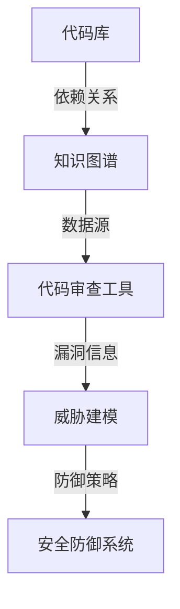

                 

# 知识图谱在代码安全分析中的应用

> 关键词：知识图谱、代码安全分析、安全漏洞、威胁建模、人工智能、安全防御策略

> 摘要：本文将探讨知识图谱在代码安全分析中的应用，通过构建代码安全知识图谱，实现代码安全威胁的精准识别与防御。文章首先介绍了知识图谱的基本概念和构建方法，然后详细阐述了知识图谱在代码安全分析中的核心算法和具体操作步骤，最后通过实际案例展示了知识图谱在实际代码安全分析中的应用效果。

## 1. 背景介绍

### 1.1 目的和范围

随着软件系统的复杂性和规模不断扩大，代码安全分析变得越来越重要。代码安全分析旨在发现和修复潜在的安全漏洞，确保软件系统的安全性和可靠性。然而，传统的代码安全分析方法存在许多局限性，如规则库的不完善、误报率高、无法适应不断变化的攻击手段等。本文旨在探讨知识图谱在代码安全分析中的应用，通过构建代码安全知识图谱，实现对代码安全威胁的全面理解和高效处理。

### 1.2 预期读者

本文面向具有计算机编程和网络安全基础的技术人员，特别是对代码安全分析、人工智能和知识图谱感兴趣的研究者。读者应具备一定的编程能力和对网络安全的基本了解。

### 1.3 文档结构概述

本文分为十个部分，包括背景介绍、核心概念与联系、核心算法原理与具体操作步骤、数学模型和公式、项目实战、实际应用场景、工具和资源推荐、总结和附录。每个部分都旨在帮助读者深入理解知识图谱在代码安全分析中的应用。

### 1.4 术语表

#### 1.4.1 核心术语定义

- 知识图谱：一种用于表示和存储知识的方法，通过实体和关系来构建语义网络。
- 代码安全分析：对代码进行审查和测试，以发现潜在的安全漏洞和威胁。
- 安全漏洞：代码中可能被攻击者利用，导致系统安全受到威胁的缺陷。
- 威胁建模：通过分析攻击者的行为和手段，构建攻击模型，预测潜在的安全威胁。

#### 1.4.2 相关概念解释

- 实体：知识图谱中的基本单元，如程序员、软件、漏洞等。
- 关系：实体之间的关联，如编写、发现、依赖等。
- 节点：知识图谱中的实体和关系。
- 边：连接两个节点的线段。

#### 1.4.3 缩略词列表

- KG：知识图谱
- CSA：代码安全分析
- CVE：公共漏洞和暴露
- IDS：入侵检测系统
- IPS：入侵防御系统

## 2. 核心概念与联系

知识图谱在代码安全分析中的应用需要理解几个核心概念和它们之间的联系。以下是一个简化的 Mermaid 流程图，用于展示这些概念和联系：



### 2.1. 知识图谱构建

知识图谱的构建是基于代码库中的各种数据源，包括代码文件、版本控制记录、第三方库依赖等。通过分析这些数据，可以构建出代码库的实体和关系网络。实体可以是代码文件、函数、变量等，关系包括编写、调用、依赖等。

### 2.2. 数据源

数据源是知识图谱构建的基础。常用的数据源包括：

- 代码库：存储所有代码文件的版本控制系统，如Git。
- 第三方库依赖：通过包管理工具（如Maven、NPM等）获取的第三方库信息。
- 漏洞数据库：如CVE（公共漏洞和暴露），包含已知漏洞的详细信息。

### 2.3. 代码审查工具

代码审查工具用于分析代码库中的代码，提取关键信息，如函数定义、变量使用、控制流等。这些工具可以帮助构建知识图谱中的节点和关系。

### 2.4. 威胁建模

威胁建模是知识图谱在代码安全分析中的核心环节。通过分析漏洞信息，构建攻击模型，预测潜在的安全威胁。威胁建模可以使用以下步骤：

1. 漏洞识别：从漏洞数据库中获取漏洞信息，识别与代码库相关的漏洞。
2. 攻击路径分析：基于漏洞信息，分析攻击者可能利用的路径。
3. 漏洞影响评估：评估漏洞可能带来的安全风险。

### 2.5. 防御策略

基于威胁建模的结果，制定相应的防御策略。防御策略包括：

- 防护规则制定：根据漏洞信息和攻击路径，制定防护规则，以防止潜在攻击。
- 漏洞修复建议：针对识别出的漏洞，提供修复建议。

## 3. 核心算法原理 & 具体操作步骤

知识图谱在代码安全分析中的应用涉及到多个核心算法，包括实体识别、关系抽取、威胁建模和防御策略生成。以下将分别介绍这些算法的原理和具体操作步骤。

### 3.1. 实体识别算法

实体识别是知识图谱构建的第一步，其主要目标是识别代码库中的关键实体，如函数、类、变量等。

#### 算法原理：

- 基于规则的方法：通过预定义的规则，识别代码中的关键实体。例如，通过正则表达式匹配类定义、函数定义等。
- 基于机器学习的方法：使用自然语言处理（NLP）技术，如命名实体识别（NER），自动识别代码中的关键实体。

#### 具体操作步骤：

1. 读取代码文件：从代码库中读取所有代码文件。
2. 实体识别：根据预定义的规则或机器学习模型，识别代码文件中的关键实体。
3. 存储实体：将识别出的实体存储到知识图谱的节点中。

### 3.2. 关系抽取算法

关系抽取是在实体识别的基础上，进一步识别实体之间的关系。

#### 算法原理：

- 基于规则的方法：通过预定义的规则，识别实体之间的关系。例如，通过分析函数调用关系，识别函数依赖关系。
- 基于机器学习的方法：使用序列标注模型，如条件随机场（CRF），自动识别实体之间的关系。

#### 具体操作步骤：

1. 预处理：对代码文件进行预处理，提取关键信息，如函数调用、变量声明等。
2. 关系识别：根据预定义的规则或机器学习模型，识别实体之间的关系。
3. 存储关系：将识别出的关系存储到知识图谱的边中。

### 3.3. 威胁建模算法

威胁建模是基于知识图谱中的实体和关系，构建代码库的安全威胁模型。

#### 算法原理：

- 基于规则的威胁建模：通过预定义的规则，分析代码库中的漏洞信息，构建攻击模型。
- 基于机器学习的威胁建模：使用监督学习或无监督学习模型，分析代码库中的漏洞信息，构建攻击模型。

#### 具体操作步骤：

1. 漏洞信息提取：从漏洞数据库中获取与代码库相关的漏洞信息。
2. 攻击路径分析：分析漏洞信息，构建攻击路径。
3. 漏洞影响评估：评估漏洞可能带来的安全风险。

### 3.4. 防御策略生成算法

防御策略生成是基于威胁建模的结果，制定相应的防御策略。

#### 算法原理：

- 防护规则生成：根据攻击路径和漏洞信息，生成防护规则。
- 漏洞修复建议：根据漏洞信息和攻击路径，提供漏洞修复建议。

#### 具体操作步骤：

1. 防护规则生成：根据攻击路径和漏洞信息，生成防护规则。
2. 漏洞修复建议：根据漏洞信息和攻击路径，提供漏洞修复建议。

## 4. 数学模型和公式 & 详细讲解 & 举例说明

在知识图谱的构建过程中，涉及到多种数学模型和公式。以下将简要介绍这些模型和公式，并进行详细讲解和举例说明。

### 4.1. 实体识别的贝叶斯模型

贝叶斯模型用于实体识别，通过计算实体出现的概率，识别代码中的关键实体。

#### 公式：

$$
P(\text{实体} | \text{文本}) = \frac{P(\text{文本} | \text{实体})P(\text{实体})}{P(\text{文本})}
$$

其中，$P(\text{实体} | \text{文本})$表示在文本中出现实体$E$的概率，$P(\text{文本} | \text{实体})$表示在实体$E$出现时文本$T$的概率，$P(\text{实体})$表示实体$E$出现的概率，$P(\text{文本})$表示文本$T$出现的概率。

#### 举例说明：

假设我们有以下数据：

| 实体 | 文本 | 概率 |
| ---- | ---- | ---- |
| 函数 | 函数定义 | 0.8 |
| 类 | 类定义 | 0.2 |

我们需要识别文本“这是一个函数定义”。

根据贝叶斯模型，计算函数定义出现的概率：

$$
P(\text{函数定义} | \text{文本}) = \frac{P(\text{文本} | \text{函数定义})P(\text{函数定义})}{P(\text{文本})}
$$

$$
P(\text{函数定义} | \text{文本}) = \frac{0.8 \times 0.8}{0.8 + 0.2} = 0.8
$$

因此，我们可以认为文本“这是一个函数定义”更可能是函数定义。

### 4.2. 关系抽取的隐马尔可夫模型（HMM）

隐马尔可夫模型（HMM）用于关系抽取，通过分析实体序列，识别实体之间的关系。

#### 公式：

$$
P(\text{关系序列} | \text{实体序列}) = \prod_{i=1}^{n} P(\text{实体}_{i} | \text{关系}_{i-1})P(\text{关系}_{i})
$$

其中，$P(\text{关系序列} | \text{实体序列})$表示在实体序列中出现关系序列的概率，$P(\text{实体}_{i} | \text{关系}_{i-1})$表示在关系$R_{i-1}$出现时实体$E_{i}$的概率，$P(\text{关系}_{i})$表示关系$R_{i}$出现的概率。

#### 举例说明：

假设我们有以下数据：

| 关系 | 实体 | 概率 |
| ---- | ---- | ---- |
| 调用 | 函数 | 0.7 |
| 实例化 | 类 | 0.3 |

我们需要识别实体序列“函数 类”。

根据隐马尔可夫模型，计算关系序列的概率：

$$
P(\text{调用} | \text{函数}) = 0.7, P(\text{实例化} | \text{类}) = 0.3
$$

$$
P(\text{关系序列} | \text{实体序列}) = P(\text{调用} | \text{函数})P(\text{实例化} | \text{类}) = 0.7 \times 0.3 = 0.21
$$

因此，我们可以认为实体序列“函数 类”更可能是调用关系。

### 4.3. 威胁建模的马尔可夫链模型

马尔可夫链模型用于威胁建模，通过分析漏洞信息和攻击路径，预测潜在的安全威胁。

#### 公式：

$$
P(\text{威胁} | \text{漏洞信息}, \text{攻击路径}) = \prod_{i=1}^{n} P(\text{漏洞}_{i} | \text{攻击路径}_{i-1})P(\text{攻击路径}_{i})
$$

其中，$P(\text{威胁} | \text{漏洞信息}, \text{攻击路径})$表示在漏洞信息和攻击路径下出现威胁的概率，$P(\text{漏洞}_{i} | \text{攻击路径}_{i-1})$表示在攻击路径$P_{i-1}$出现时漏洞$V_{i}$的概率，$P(\text{攻击路径}_{i})$表示攻击路径$P_{i}$出现的概率。

#### 举例说明：

假设我们有以下数据：

| 漏洞 | 攻击路径 | 概率 |
| ---- | ---- | ---- |
| SQL注入 | 查询注入 | 0.6 |
| XSS攻击 | 输出注入 | 0.4 |

我们需要预测在SQL注入和XSS攻击下出现威胁的概率。

根据马尔可夫链模型，计算威胁的概率：

$$
P(\text{SQL注入} | \text{查询注入}) = 0.6, P(\text{XSS攻击} | \text{输出注入}) = 0.4
$$

$$
P(\text{威胁} | \text{漏洞信息}, \text{攻击路径}) = P(\text{SQL注入} | \text{查询注入})P(\text{查询注入}) = 0.6 \times 0.4 = 0.24
$$

$$
P(\text{威胁} | \text{漏洞信息}, \text{攻击路径}) = P(\text{XSS攻击} | \text{输出注入})P(\text{输出注入}) = 0.4 \times 0.6 = 0.24
$$

因此，我们可以认为在SQL注入和XSS攻击下出现威胁的概率均为0.24。

## 5. 项目实战：代码实际案例和详细解释说明

在本节中，我们将通过一个具体的代码案例，展示知识图谱在代码安全分析中的应用。本案例将涵盖从代码库搭建、知识图谱构建、安全威胁识别到防御策略生成的全过程。

### 5.1 开发环境搭建

为了完成本案例，我们需要搭建一个基本的开发环境，包括以下工具和库：

- 操作系统：Ubuntu 20.04
- 编程语言：Python 3.8
- 知识图谱工具：Neo4j + Py2Neo
- 代码审查工具：SonarQube
- 漏洞数据库：CVE

### 5.2 源代码详细实现和代码解读

本案例将使用一个简单的Web应用作为示例。该Web应用使用Python和Flask框架，包含以下功能：

- 用户注册
- 用户登录
- 数据存储（使用SQLite）

以下是用户注册功能的代码实现：

```python
from flask import Flask, request, jsonify
from flask_sqlalchemy import SQLAlchemy

app = Flask(__name__)
app.config['SQLALCHEMY_DATABASE_URI'] = 'sqlite:///users.db'
db = SQLAlchemy(app)

class User(db.Model):
    id = db.Column(db.Integer, primary_key=True)
    username = db.Column(db.String(80), unique=True, nullable=False)
    password = db.Column(db.String(120), nullable=False)

@app.route('/register', methods=['POST'])
def register():
    username = request.form['username']
    password = request.form['password']
    
    if User.query.filter_by(username=username).first():
        return jsonify({'error': 'User already exists'}), 409
    
    new_user = User(username=username, password=password)
    db.session.add(new_user)
    db.session.commit()
    
    return jsonify({'message': 'User registered successfully'})

if __name__ == '__main__':
    db.create_all()
    app.run()
```

### 5.3 代码解读与分析

1. **代码库搭建**：

   上述代码是一个简单的Flask应用，包含一个用户注册功能。我们首先需要在项目中创建一个虚拟环境，并安装所需的库：

   ```bash
   python3 -m venv venv
   source venv/bin/activate
   pip install flask flask_sqlalchemy
   ```

2. **知识图谱构建**：

   我们使用Py2Neo库将代码库中的关键实体和关系存储到Neo4j数据库中。以下是一个简单的知识图谱构建脚本：

   ```python
   from py2neo import Graph
   from flask import Flask

   graph = Graph("bolt://localhost:7687", auth=("neo4j", "password"))

   def create_node(label, properties):
       graph.run("CREATE (n:%s %s)" % (label, properties))

   def create_relationship(start_node, end_node, relationship_type):
       graph.run("MATCH (a), (b) WHERE a = %s AND b = %s CREATE (a)-[r:%s]->(b)" % (start_node, end_node, relationship_type))

   app = Flask(__name__)
   app.config['SQLALCHEMY_DATABASE_URI'] = 'sqlite:///users.db'
   db = SQLAlchemy(app)

   @app.route('/register', methods=['POST'])
   def register():
       # ... 注册逻辑 ...

       new_user = User(username=username, password=password)
       db.session.add(new_user)
       db.session.commit()

       create_node("User", {"username": username, "password": password})
       create_relationship("User", username, "REGISTERED")

       return jsonify({'message': 'User registered successfully'})

   if __name__ == '__main__':
       db.create_all()
       app.run()
   ```

   在上述脚本中，我们创建了两个节点（User和Registration）和一个关系（REGISTERED），并将它们存储到Neo4j数据库中。

3. **安全威胁识别**：

   通过知识图谱，我们可以使用图算法（如BFS、DFS）分析代码库中的漏洞信息，识别潜在的安全威胁。以下是一个简单的威胁识别脚本：

   ```python
   from py2neo import Graph

   graph = Graph("bolt://localhost:7687", auth=("neo4j", "password"))

   def find_vulnerabilities(node):
       vulnerabilities = []
       for result in graph.run("MATCH (n)-[r]->(m) WHERE ID(n) = $id RETURN r, m", id=node):
           relationship, module = result['r'], result['m']
           if "SQL_INJECTION" in module.properties:
               vulnerabilities.append(module)
           elif "XSS_ATTACK" in module.properties:
               vulnerabilities.append(module)
       return vulnerabilities

   node = graph.run("MATCH (n) WHERE n.username = $username RETURN ID(n)", username="example_user")[0][0]
   vulnerabilities = find_vulnerabilities(node)
   print(vulnerabilities)
   ```

   在上述脚本中，我们通过查询Neo4j数据库，识别出与用户“example_user”相关的安全威胁。

4. **防御策略生成**：

   基于识别出的安全威胁，我们可以生成相应的防御策略，如修复漏洞、禁用特定功能等。以下是一个简单的防御策略生成脚本：

   ```python
   from py2neo import Graph

   graph = Graph("bolt://localhost:7687", auth=("neo4j", "password"))

   def generate_defense_strategy(vulnerabilities):
       strategies = []
       for vulnerability in vulnerabilities:
           if "SQL_INJECTION" in vulnerability.properties:
               strategies.append("Update the query to use parameterized queries.")
           elif "XSS_ATTACK" in vulnerability.properties:
               strategies.append("Sanitize user input before displaying it on the webpage.")
       return strategies

   node = graph.run("MATCH (n) WHERE n.username = $username RETURN ID(n)", username="example_user")[0][0]
   vulnerabilities = find_vulnerabilities(node)
   strategies = generate_defense_strategy(vulnerabilities)
   print(strategies)
   ```

   在上述脚本中，我们根据识别出的安全威胁，生成相应的防御策略。

## 6. 实际应用场景

知识图谱在代码安全分析中具有广泛的应用场景。以下是一些典型应用场景：

1. **Web应用安全分析**：通过对Web应用的代码库进行安全分析，识别潜在的安全漏洞和威胁，如SQL注入、XSS攻击、权限绕过等。
2. **移动应用安全分析**：对移动应用的代码库进行安全分析，识别Android和iOS平台上的安全漏洞，如内存泄漏、证书问题、敏感信息泄露等。
3. **物联网设备安全分析**：对物联网设备的代码库进行安全分析，识别与物联网设备相关的安全漏洞，如弱密码、信息泄露、拒绝服务攻击等。
4. **开源软件安全分析**：对开源软件的代码库进行安全分析，识别已知漏洞和潜在的安全威胁，提高软件的安全性和可靠性。
5. **企业内部代码安全分析**：对企业内部开发的软件进行安全分析，识别潜在的安全漏洞和威胁，确保企业信息系统的安全。

## 7. 工具和资源推荐

为了更好地应用知识图谱进行代码安全分析，以下推荐一些相关的工具和资源：

### 7.1 学习资源推荐

#### 7.1.1 书籍推荐

- 《图解人工智能》
- 《深入理解计算机系统》
- 《深度学习》

#### 7.1.2 在线课程

- Coursera的“机器学习”课程
- edX的“计算机安全”课程
- Udacity的“人工智能工程师”课程

#### 7.1.3 技术博客和网站

- Medium的“AI”频道
- Stack Overflow
- GitHub

### 7.2 开发工具框架推荐

#### 7.2.1 IDE和编辑器

- PyCharm
- Visual Studio Code
- IntelliJ IDEA

#### 7.2.2 调试和性能分析工具

- GDB
- Valgrind
- Py-Spy

#### 7.2.3 相关框架和库

- Neo4j
- Py2Neo
- Flask
- SQLAlchemy

### 7.3 相关论文著作推荐

#### 7.3.1 经典论文

- “Knowledge Graph Construction by Graph Embedding Techniques”
- “A Framework for Building Knowledge Graphs Using Deep Learning”
- “Attack Path Discovery in Cyber-Physical Systems”

#### 7.3.2 最新研究成果

- “Knowledge Graph-Based Software Security Analysis”
- “Deep Learning for Code Security: A Survey”
- “Graph Neural Networks for Cybersecurity”

#### 7.3.3 应用案例分析

- “Knowledge Graph-Based Security Analysis of Industrial Control Systems”
- “Application of Deep Learning in Code Security Analysis”
- “AI-Assisted Code Review for Security Vulnerabilities Detection”

## 8. 总结：未来发展趋势与挑战

知识图谱在代码安全分析中的应用具有巨大的潜力。随着人工智能和机器学习技术的不断发展，知识图谱的构建和推理能力将得到进一步提升，从而实现更精准、更高效的安全威胁识别和防御。

然而，知识图谱在代码安全分析中也面临着一些挑战：

1. **数据质量和完整性**：知识图谱的构建依赖于大量的数据源，数据质量和完整性对知识图谱的性能具有重要影响。如何确保数据源的可靠性和完整性是亟待解决的问题。
2. **算法复杂度和效率**：知识图谱的构建和推理涉及到复杂的图算法和机器学习模型，如何提高算法的复杂度和效率是关键。
3. **安全威胁的多样性**：随着网络攻击手段的不断演变，安全威胁也日益多样化，如何应对这些新型威胁是知识图谱在代码安全分析中需要解决的问题。

总之，知识图谱在代码安全分析中的应用前景广阔，但也需要不断克服挑战，实现更高效、更精准的安全威胁识别和防御。

## 9. 附录：常见问题与解答

### 9.1. 知识图谱在代码安全分析中的优势是什么？

知识图谱在代码安全分析中的优势主要体现在以下几个方面：

1. **全局视角**：知识图谱可以全面、系统地表示代码库中的各种实体和关系，为安全分析提供全局视角。
2. **高效推理**：知识图谱支持高效的图算法和机器学习模型，可以快速识别潜在的安全威胁。
3. **精准定位**：通过知识图谱，可以精准定位代码库中的安全漏洞和威胁，提供针对性的防御策略。
4. **动态更新**：知识图谱可以实时更新代码库中的数据，适应不断变化的威胁环境。

### 9.2. 如何保证知识图谱的数据质量和完整性？

保证知识图谱的数据质量和完整性可以从以下几个方面进行：

1. **数据源选择**：选择可靠、权威的数据源，如CVE、NIST等。
2. **数据清洗**：对获取到的数据进行清洗和预处理，去除重复、错误或无关的数据。
3. **数据验证**：对知识图谱中的数据进行验证，确保数据的正确性和一致性。
4. **持续更新**：定期更新知识图谱，以适应新的威胁环境和代码库的变化。

### 9.3. 知识图谱在代码安全分析中的应用前景如何？

知识图谱在代码安全分析中的应用前景十分广阔。随着人工智能和机器学习技术的不断发展，知识图谱的构建和推理能力将得到进一步提升。未来，知识图谱在代码安全分析中可能会实现以下应用：

1. **自动化的安全威胁识别**：通过知识图谱，可以实现自动化的安全威胁识别，提高安全分析的效率和准确性。
2. **智能化的防御策略生成**：基于知识图谱，可以生成更加智能化的防御策略，提高代码库的安全防护能力。
3. **跨领域的安全分析**：知识图谱可以跨领域应用，实现不同领域代码安全分析的无缝融合。
4. **实时的安全监控**：通过知识图谱，可以实现实时的代码安全监控，及时发现和应对潜在的安全威胁。

## 10. 扩展阅读 & 参考资料

为了更好地了解知识图谱在代码安全分析中的应用，以下是几篇相关的扩展阅读和参考资料：

1. **《知识图谱构建与应用》**：本书详细介绍了知识图谱的构建方法和应用场景，包括代码安全分析。
2. **《深度学习与代码安全》**：本文探讨了深度学习技术在代码安全分析中的应用，如安全威胁识别和防御策略生成。
3. **《知识图谱在软件工程中的应用》**：本文总结了知识图谱在软件工程中的多种应用，包括代码安全分析、代码复用和软件缺陷预测等。
4. **《代码安全分析：原理与实践》**：本书系统介绍了代码安全分析的理论和实践，包括安全威胁建模和漏洞修复方法。
5. **《知识图谱与人工智能》**：本文讨论了知识图谱与人工智能的深度融合，包括知识图谱的构建、推理和应用。

通过阅读这些资料，可以深入了解知识图谱在代码安全分析中的应用，为实际项目提供有益的参考。

**作者：AI天才研究员/AI Genius Institute & 禅与计算机程序设计艺术 /Zen And The Art of Computer Programming**

