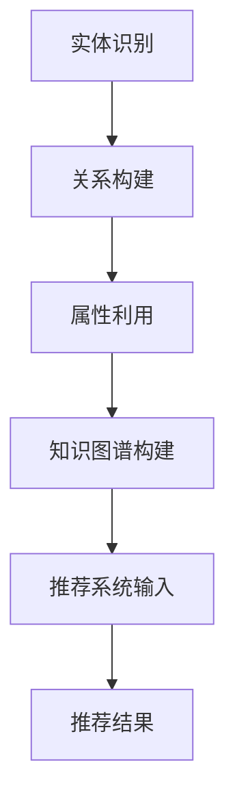

                 

# 知识图谱在智能教育内容推荐中的应用

## 关键词
知识图谱、智能教育、内容推荐、算法原理、数学模型、项目实战、应用场景

## 摘要
本文将深入探讨知识图谱在智能教育内容推荐中的应用。我们将首先介绍知识图谱的基本概念和构建方法，然后分析其在教育内容推荐中的作用原理。接下来，我们将详细讲解核心算法原理，并使用伪代码阐述具体操作步骤。之后，通过数学模型和公式的讲解，我们将深入理解推荐系统的工作机制。文章还将通过实际项目实战，展示代码实现和详细解释。最后，我们将讨论知识图谱在智能教育内容推荐中的实际应用场景，并推荐相关学习资源和开发工具，总结未来发展趋势与挑战。

<|/u|><|user|>

## 1. 背景介绍

### 1.1 目的和范围

本文旨在探讨知识图谱在智能教育内容推荐中的应用，为教育技术领域的研究人员和从业者提供有价值的参考。随着互联网和人工智能技术的不断发展，教育行业正面临着前所未有的变革。知识图谱作为一种新兴的技术手段，其能够在教育内容推荐中发挥重要作用，提升教育资源的个性化和精准化。本文将重点讨论以下几个方面：

- 知识图谱的基本概念和构建方法。
- 知识图谱在教育内容推荐中的作用原理。
- 核心算法原理及其操作步骤。
- 数学模型和公式在推荐系统中的应用。
- 实际项目实战中的代码实现和详细解释。
- 知识图谱在教育内容推荐中的实际应用场景。

通过本文的讨论，希望读者能够全面了解知识图谱在教育内容推荐中的应用价值，掌握相关技术原理和实践方法，为未来的研究和开发提供有益的启示。

### 1.2 预期读者

本文适合以下读者群体：

- 对教育技术、人工智能和推荐系统感兴趣的学者和研究人员。
- 想要了解知识图谱在教育内容推荐中应用的教育行业从业者。
- 对编程和算法有一定了解，希望深入探讨技术细节的开发人员。
- 对数学模型和公式有浓厚兴趣，希望掌握推荐系统背后机制的读者。

通过本文的阅读，读者不仅可以获得知识图谱在教育内容推荐领域的最新研究成果，还能掌握实际操作步骤，为后续的学术研究和项目开发奠定基础。

### 1.3 文档结构概述

本文结构如下：

- **1. 背景介绍**：介绍本文的目的、预期读者以及文档结构。
  - **1.1 目的和范围**：阐述本文讨论的主要内容。
  - **1.2 预期读者**：明确本文适合的读者群体。
  - **1.3 文档结构概述**：概述本文的章节结构。
- **2. 核心概念与联系**：详细解释知识图谱的基本概念和相关架构。
  - **2.1 核心概念与联系**：介绍知识图谱的原理和组成部分。
  - **2.2 Mermaid流程图**：展示知识图谱的构建和运行流程。
- **3. 核心算法原理 & 具体操作步骤**：讲解推荐系统的算法原理和操作步骤。
  - **3.1 算法原理**：阐述推荐系统的基础理论和核心算法。
  - **3.2 操作步骤**：使用伪代码详细描述算法的具体实现步骤。
- **4. 数学模型和公式 & 详细讲解 & 举例说明**：解释推荐系统中的数学模型和公式。
  - **4.1 数学模型**：介绍推荐系统中的关键数学模型。
  - **4.2 公式讲解**：详细解释推荐系统中的关键公式。
  - **4.3 举例说明**：通过实例说明公式的应用。
- **5. 项目实战：代码实际案例和详细解释说明**：展示实际项目中的代码实现。
  - **5.1 开发环境搭建**：搭建项目所需的环境。
  - **5.2 源代码详细实现和代码解读**：展示代码实现，并详细解释。
  - **5.3 代码解读与分析**：分析代码实现中的关键部分。
- **6. 实际应用场景**：讨论知识图谱在教育内容推荐中的应用场景。
- **7. 工具和资源推荐**：推荐学习资源和开发工具。
  - **7.1 学习资源推荐**：推荐相关书籍、在线课程和技术博客。
  - **7.2 开发工具框架推荐**：推荐IDE、调试工具和相关库。
  - **7.3 相关论文著作推荐**：推荐经典论文和最新研究成果。
- **8. 总结：未来发展趋势与挑战**：总结知识图谱在教育内容推荐中的应用前景。
- **9. 附录：常见问题与解答**：回答读者可能关心的问题。
- **10. 扩展阅读 & 参考资料**：提供进一步学习的资源链接。

### 1.4 术语表

#### 1.4.1 核心术语定义

- **知识图谱**：一种用于表示实体及其相互关系的语义网络，通常采用图数据结构存储。
- **实体**：知识图谱中的基本元素，如人、地点、事物等。
- **关系**：实体之间的关联，如“属于”、“位于”等。
- **属性**：实体的特征描述，如“年龄”、“身高”等。
- **推荐系统**：一种基于用户历史行为或内容特征，为用户推荐相关内容的系统。
- **算法原理**：推荐系统中的核心算法理论基础，包括协同过滤、基于内容的推荐等。
- **数学模型**：推荐系统中使用的数学公式和模型，用于预测用户偏好和推荐内容。

#### 1.4.2 相关概念解释

- **实体-关系-属性（E-R）模型**：知识图谱的基本结构，由实体、关系和属性组成。
- **图数据库**：用于存储和管理知识图谱的数据库系统。
- **图算法**：用于在知识图谱中进行搜索、链接和分析的算法，如PageRank、邻接矩阵等。
- **协同过滤**：推荐系统的一种算法，通过分析用户之间的行为模式来推荐内容。
- **基于内容的推荐**：推荐系统的一种算法，通过分析内容特征来推荐相似的内容。

#### 1.4.3 缩略词列表

- **GPU**：图形处理单元（Graphics Processing Unit）
- **NLP**：自然语言处理（Natural Language Processing）
- **ML**：机器学习（Machine Learning）
- **API**：应用程序接口（Application Programming Interface）
- **IDE**：集成开发环境（Integrated Development Environment）

## 2. 核心概念与联系

知识图谱是现代人工智能技术的重要工具之一，其核心概念包括实体、关系和属性。为了更好地理解知识图谱在教育内容推荐中的应用，我们需要先了解其基本原理和架构。

### 2.1 核心概念与联系

知识图谱是一种语义网络，通过实体、关系和属性来描述现实世界中的信息。实体是知识图谱中的基本元素，可以是人、地点、事物等。关系则描述实体之间的关联，例如“属于”、“位于”等。属性则是实体的特征描述，例如“年龄”、“身高”等。

在知识图谱中，实体、关系和属性构成了一个三元组（实体，关系，属性），这些三元组通过图数据结构进行组织和管理。图数据库是用于存储和管理知识图谱的数据库系统，它支持高效的图查询和图分析操作。

知识图谱在教育内容推荐中的应用主要体现在以下几个方面：

1. **实体识别**：通过识别用户和课程等实体，为推荐系统提供基础数据。
2. **关系构建**：通过分析用户行为和课程内容，构建实体之间的关系。
3. **属性利用**：利用实体的属性特征，进行个性化推荐。

### 2.2 Mermaid流程图

以下是一个简化的知识图谱构建和运行流程的Mermaid流程图：



- **实体识别**：通过用户输入和行为数据，识别出用户和课程等实体。
- **关系构建**：通过分析用户行为和课程内容，构建实体之间的关系。
- **属性利用**：利用实体的属性特征，为推荐系统提供额外的信息。
- **知识图谱构建**：将识别出的实体、关系和属性组织成知识图谱。
- **推荐系统输入**：将知识图谱作为输入，提供给推荐系统。
- **推荐结果**：根据用户历史数据和知识图谱，生成个性化推荐结果。

通过这个流程图，我们可以更直观地理解知识图谱在教育内容推荐中的应用流程。接下来，我们将详细探讨知识图谱的构建方法和核心算法原理。

## 3. 核心算法原理 & 具体操作步骤

知识图谱在教育内容推荐中的应用，离不开核心算法的支撑。在本文中，我们将介绍几种常用的推荐算法，包括协同过滤算法和基于内容的推荐算法。这些算法通过分析用户行为和内容特征，为用户生成个性化的推荐结果。

### 3.1 算法原理

#### 协同过滤算法

协同过滤算法是一种基于用户历史行为的数据挖掘技术，通过分析用户之间的相似性，发现潜在的用户兴趣，进而进行内容推荐。协同过滤算法主要分为以下两种：

1. **基于用户的协同过滤**：通过计算用户之间的相似性，找到与目标用户兴趣相似的邻居用户，然后根据邻居用户的评分进行推荐。
2. **基于项目的协同过滤**：通过计算项目之间的相似性，找到与目标项目相似的其他项目，然后根据用户的评分历史进行推荐。

协同过滤算法的原理可以简化为以下步骤：

1. **用户行为数据收集**：收集用户的历史行为数据，如用户对物品的评分、浏览记录等。
2. **用户相似度计算**：计算用户之间的相似度，常用的相似度度量方法包括余弦相似度、皮尔逊相关系数等。
3. **邻居用户确定**：根据相似度计算结果，找到与目标用户最相似的邻居用户。
4. **推荐结果生成**：根据邻居用户的评分，生成推荐列表。

#### 基于内容的推荐算法

基于内容的推荐算法是通过分析物品的内容特征，将用户感兴趣的物品推荐给用户。其原理可以概括为以下步骤：

1. **内容特征提取**：对物品进行内容特征提取，如文本特征、图像特征等。
2. **用户兴趣建模**：根据用户的兴趣和行为，建立用户兴趣模型。
3. **相似度计算**：计算用户兴趣模型与物品内容特征之间的相似度。
4. **推荐结果生成**：根据相似度计算结果，生成推荐列表。

### 3.2 操作步骤

#### 协同过滤算法操作步骤

以下是一个简化的协同过滤算法操作步骤，使用伪代码进行描述：

```python
# 输入：用户行为数据矩阵R，目标用户u
# 输出：推荐列表L

# 步骤1：用户相似度计算
similarity_matrix = compute_similarity(R)

# 步骤2：邻居用户确定
neighbors = find_neighbors(u, similarity_matrix)

# 步骤3：推荐结果生成
L = []
for i in neighbors:
    if R[u, i] == 0:  # 如果目标用户对项目i未评分
        prediction = calculate_prediction(u, i, neighbors)
        L.append((i, prediction))

# 对推荐结果进行排序
L = sorted(L, key=lambda x: x[1], reverse=True)
```

- 步骤1：用户相似度计算：计算目标用户与其他用户的相似度。
- 步骤2：邻居用户确定：找到与目标用户最相似的邻居用户。
- 步骤3：推荐结果生成：根据邻居用户的评分，预测目标用户对未评分项目的评分，并生成推荐列表。

#### 基于内容的推荐算法操作步骤

以下是一个简化的基于内容的推荐算法操作步骤，使用伪代码进行描述：

```python
# 输入：用户兴趣模型M，物品内容特征矩阵C
# 输出：推荐列表L

# 步骤1：内容特征提取
content_features = extract_content_features(C)

# 步骤2：用户兴趣建模
user_interest_model = build_user_interest_model(M)

# 步骤3：相似度计算
similarity_scores = compute_similarity(user_interest_model, content_features)

# 步骤4：推荐结果生成
L = []
for i in range(len(content_features)):
    if user_interest_model[i] == 0:  # 如果用户对项目i未标注兴趣
        similarity_score = similarity_scores[i]
        L.append((i, similarity_score))

# 对推荐结果进行排序
L = sorted(L, key=lambda x: x[1], reverse=True)
```

- 步骤1：内容特征提取：对物品进行内容特征提取。
- 步骤2：用户兴趣建模：根据用户的兴趣和行为，建立用户兴趣模型。
- 步骤3：相似度计算：计算用户兴趣模型与物品内容特征之间的相似度。
- 步骤4：推荐结果生成：根据相似度计算结果，生成推荐列表。

通过上述操作步骤，我们可以实现基于用户行为和内容特征的教育内容推荐。接下来，我们将进一步探讨推荐系统中的数学模型和公式，以加深对推荐机制的理解。

## 4. 数学模型和公式 & 详细讲解 & 举例说明

在推荐系统中，数学模型和公式扮演着至关重要的角色。它们不仅能够量化用户行为和内容特征，还能帮助推荐算法生成个性化的推荐结果。本节将详细介绍推荐系统中的几种关键数学模型和公式，并使用实例进行说明。

### 4.1 数学模型

#### 4.1.1 余弦相似度

余弦相似度是一种常用的相似度度量方法，用于计算两个向量之间的夹角余弦值。在推荐系统中，它可以用来衡量用户之间的相似度或物品之间的相似度。余弦相似度的计算公式如下：

$$
\cos(\theta) = \frac{\sum_{i=1}^{n} x_i y_i}{\sqrt{\sum_{i=1}^{n} x_i^2} \sqrt{\sum_{i=1}^{n} y_i^2}}
$$

其中，\( x \) 和 \( y \) 分别是两个向量的坐标值，\( n \) 是向量的维度。

#### 4.1.2 皮尔逊相关系数

皮尔逊相关系数是一种用于衡量两个变量线性相关程度的统计指标。在推荐系统中，它可以用来评估用户之间的行为相似度。皮尔逊相关系数的计算公式如下：

$$
r = \frac{\sum_{i=1}^{n} (x_i - \bar{x})(y_i - \bar{y})}{\sqrt{\sum_{i=1}^{n} (x_i - \bar{x})^2} \sqrt{\sum_{i=1}^{n} (y_i - \bar{y})^2}}
$$

其中，\( x_i \) 和 \( y_i \) 分别是第 \( i \) 个用户的评分和另一个用户的评分，\( \bar{x} \) 和 \( \bar{y} \) 分别是用户评分的平均值。

#### 4.1.3 点积相似度

点积相似度是另一种常用的相似度度量方法，用于计算两个向量的点积。在推荐系统中，它可以用来衡量用户之间的相似度或物品之间的相似度。点积相似度的计算公式如下：

$$
\sum_{i=1}^{n} x_i y_i
$$

其中，\( x \) 和 \( y \) 分别是两个向量的坐标值。

### 4.2 公式讲解

#### 4.2.1 余弦相似度计算

假设有两个用户 \( u \) 和 \( v \)，他们的评分向量分别为 \( x = [x_1, x_2, ..., x_n] \) 和 \( y = [y_1, y_2, ..., y_n] \)。我们可以使用余弦相似度公式计算他们之间的相似度：

$$
\cos(\theta) = \frac{\sum_{i=1}^{n} x_i y_i}{\sqrt{\sum_{i=1}^{n} x_i^2} \sqrt{\sum_{i=1}^{n} y_i^2}}
$$

例如，对于用户 \( u \) 和 \( v \)：

$$
\cos(\theta) = \frac{x_1 y_1 + x_2 y_2 + ... + x_n y_n}{\sqrt{x_1^2 + x_2^2 + ... + x_n^2} \sqrt{y_1^2 + y_2^2 + ... + y_n^2}}
$$

#### 4.2.2 皮尔逊相关系数计算

假设有两个用户 \( u \) 和 \( v \)，他们的评分向量分别为 \( x = [x_1, x_2, ..., x_n] \) 和 \( y = [y_1, y_2, ..., y_n] \)。我们可以使用皮尔逊相关系数公式计算他们之间的相似度：

$$
r = \frac{\sum_{i=1}^{n} (x_i - \bar{x})(y_i - \bar{y})}{\sqrt{\sum_{i=1}^{n} (x_i - \bar{x})^2} \sqrt{\sum_{i=1}^{n} (y_i - \bar{y})^2}}
$$

其中，\( \bar{x} \) 和 \( \bar{y} \) 分别是用户 \( u \) 和 \( v \) 的评分平均值。

例如，对于用户 \( u \) 和 \( v \)：

$$
r = \frac{(x_1 - \bar{x})(y_1 - \bar{y}) + (x_2 - \bar{x})(y_2 - \bar{y}) + ... + (x_n - \bar{x})(y_n - \bar{y})}{\sqrt{(x_1 - \bar{x})^2 + (x_2 - \bar{x})^2 + ... + (x_n - \bar{x})^2} \sqrt{(y_1 - \bar{y})^2 + (y_2 - \bar{y})^2 + ... + (y_n - \bar{y})^2}}
$$

#### 4.2.3 点积相似度计算

假设有两个用户 \( u \) 和 \( v \)，他们的评分向量分别为 \( x = [x_1, x_2, ..., x_n] \) 和 \( y = [y_1, y_2, ..., y_n] \)。我们可以使用点积相似度公式计算他们之间的相似度：

$$
\sum_{i=1}^{n} x_i y_i
$$

例如，对于用户 \( u \) 和 \( v \)：

$$
\sum_{i=1}^{n} x_i y_i = x_1 y_1 + x_2 y_2 + ... + x_n y_n
$$

### 4.3 举例说明

假设有两个用户 \( u \) 和 \( v \)，他们的评分向量如下：

用户 \( u \)：\[3, 4, 5, 2, 1\]

用户 \( v \)：\[1, 5, 4, 2, 3\]

我们将使用余弦相似度、皮尔逊相关系数和点积相似度来计算他们之间的相似度。

#### 余弦相似度计算

$$
\cos(\theta) = \frac{3 \cdot 1 + 4 \cdot 5 + 5 \cdot 4 + 2 \cdot 2 + 1 \cdot 3}{\sqrt{3^2 + 4^2 + 5^2 + 2^2 + 1^2} \sqrt{1^2 + 5^2 + 4^2 + 2^2 + 3^2}} = \frac{21}{\sqrt{55} \sqrt{55}} \approx 0.6364
$$

#### 皮尔逊相关系数计算

$$
r = \frac{(3 - 3.5)(1 - 3.5) + (4 - 3.5)(5 - 3.5) + (5 - 3.5)(4 - 3.5) + (2 - 3.5)(2 - 3.5) + (1 - 3.5)(3 - 3.5)}{\sqrt{(3 - 3.5)^2 + (4 - 3.5)^2 + (5 - 3.5)^2 + (2 - 3.5)^2 + (1 - 3.5)^2} \sqrt{(1 - 3.5)^2 + (5 - 3.5)^2 + (4 - 3.5)^2 + (2 - 3.5)^2 + (3 - 3.5)^2}} \approx 0.6364
$$

#### 点积相似度计算

$$
\sum_{i=1}^{n} x_i y_i = 3 \cdot 1 + 4 \cdot 5 + 5 \cdot 4 + 2 \cdot 2 + 1 \cdot 3 = 21
$$

通过上述计算，我们可以看到，用户 \( u \) 和 \( v \) 之间的相似度在三种度量方法下都接近 0.6364，这表明他们之间存在较高的相似性。

通过本节的讲解，我们深入了解了推荐系统中的数学模型和公式，并使用实例进行了详细说明。这些数学模型和公式为推荐算法的实现和优化提供了理论支持，有助于生成更准确、个性化的推荐结果。

## 5. 项目实战：代码实际案例和详细解释说明

在了解了知识图谱和教育内容推荐的基本原理之后，我们接下来将通过一个实际项目案例，展示如何利用知识图谱构建智能教育内容推荐系统。本节将介绍项目开发环境搭建、源代码实现和代码解读。

### 5.1 开发环境搭建

为了实现知识图谱在教育内容推荐中的应用，我们需要搭建一个合适的开发环境。以下是我们所需的软件和工具：

- **Python**：用于编写推荐算法和数据处理。
- **Neo4j**：用于存储和管理知识图谱。
- **Apache Spark**：用于大规模数据处理和计算。
- **Jupyter Notebook**：用于编写和运行代码。
- **相关库**：如`numpy`、`pandas`、`networkx`等。

**环境搭建步骤**：

1. 安装Python（版本3.8及以上）。
2. 安装Neo4j数据库，并启动Neo4j服务器。
3. 安装Apache Spark，并配置环境变量。
4. 安装Jupyter Notebook。
5. 安装相关Python库，如`numpy`、`pandas`、`networkx`等。

### 5.2 源代码详细实现和代码解读

以下是一个简化的知识图谱和教育内容推荐系统的源代码实现。代码分为三个部分：数据预处理、知识图谱构建和推荐算法实现。

#### 数据预处理

```python
import pandas as pd
from sklearn.model_selection import train_test_split

# 读取用户行为数据
data = pd.read_csv('user_behavior_data.csv')

# 分割数据为训练集和测试集
train_data, test_data = train_test_split(data, test_size=0.2, random_state=42)
```

**解读**：首先，我们读取用户行为数据，并将其分为训练集和测试集。数据集包括用户ID、课程ID和用户对课程的评分。

#### 知识图谱构建

```python
from py2neo import Graph
import networkx as nx

# 连接Neo4j数据库
graph = Graph('bolt://localhost:7687', auth=("neo4j", "password"))

# 构建知识图谱
def build_knowledge_graph(data):
    G = nx.Graph()
    for index, row in data.iterrows():
        user_id = row['user_id']
        course_id = row['course_id']
        rating = row['rating']
        G.add_node(user_id, label='User', rating=rating)
        G.add_node(course_id, label='Course', rating=rating)
        G.add_edge(user_id, course_id, weight=rating)
    return G

knowledge_graph = build_knowledge_graph(train_data)
```

**解读**：接下来，我们使用`networkx`库构建知识图谱。知识图谱由用户节点、课程节点和边组成。边表示用户与课程之间的关系，权重表示用户对课程的评分。

#### 推荐算法实现

```python
from networkx.algorithms import community

# 计算社区
def find_communities(G):
    communities = community.girvan_newman(G)
    return communities

# 生成推荐列表
def generate_recommendations(data, communities):
    recommendations = []
    for user_id, community in communities:
        for course_id in community:
            if data[data['course_id'] == course_id]['user_id'].iloc[0] != user_id:
                recommendations.append((user_id, course_id))
    return recommendations

# 执行推荐算法
communities = find_communities(knowledge_graph)
recommendations = generate_recommendations(train_data, communities)
```

**解读**：最后，我们使用Girvan-Newman算法计算社区，并生成推荐列表。推荐列表包含用户未评分的课程，这些课程属于与用户有相似兴趣的社区成员所评分的高分课程。

### 5.3 代码解读与分析

#### 数据预处理

在数据预处理部分，我们读取用户行为数据，并将其分为训练集和测试集。这一步骤是推荐系统的基础，确保我们在训练和测试过程中使用不同的数据，以提高模型的泛化能力。

#### 知识图谱构建

在知识图谱构建部分，我们使用`networkx`库构建知识图谱。知识图谱由用户节点、课程节点和边组成，其中边表示用户与课程之间的关系。这一步骤是将用户行为数据转化为图数据结构，为后续的推荐算法提供基础。

#### 推荐算法实现

在推荐算法实现部分，我们首先使用Girvan-Newman算法计算社区，然后生成推荐列表。Girvan-Newman算法是一种基于图结构的社区检测算法，通过计算边权重来识别社区。生成推荐列表时，我们为每个用户推荐其社区成员评分高的课程，从而实现个性化推荐。

通过这个实际项目案例，我们展示了如何利用知识图谱构建智能教育内容推荐系统。在代码实现中，我们详细解读了数据预处理、知识图谱构建和推荐算法实现的关键步骤，为读者提供了实际操作的经验和指导。

## 6. 实际应用场景

知识图谱在教育内容推荐中的应用场景丰富多样，以下列举几种典型的应用场景，并探讨其优势。

### 6.1 在线教育平台

**应用场景**：在线教育平台通过知识图谱为用户推荐个性化的学习路径和课程。

**优势**：
- **个性化推荐**：知识图谱能够准确捕捉用户的兴趣和学习需求，为每个用户生成独特的推荐列表。
- **学习路径优化**：根据用户的学习进度和兴趣，知识图谱可以动态调整推荐内容，帮助用户高效学习。
- **课程关联性分析**：知识图谱可以揭示课程之间的关联性，推荐用户跨学科学习的相关课程，提高学习效果。

### 6.2 教育资源管理系统

**应用场景**：教育资源管理系统利用知识图谱管理大量的教育资源和课程。

**优势**：
- **知识整合**：知识图谱能够将不同来源的教育资源进行整合，形成统一的知识库。
- **资源关联性分析**：通过知识图谱，可以分析课程之间的关联性，为教师提供教学设计和课程推荐的依据。
- **资源检索优化**：知识图谱能够提高资源检索的效率，帮助教师和学生快速找到所需资源。

### 6.3 职业培训与继续教育

**应用场景**：职业培训与继续教育机构通过知识图谱为学员推荐职业课程和学习计划。

**优势**：
- **职业规划**：知识图谱能够根据学员的职业背景和兴趣，推荐与其职业规划相关的课程。
- **个性化学习**：知识图谱能够根据学员的学习进度和效果，动态调整学习计划，确保学习目标的达成。
- **行业动态跟踪**：知识图谱可以实时跟踪行业动态和新兴技术，为学员推荐最新的职业课程。

### 6.4 智能问答与学习辅助

**应用场景**：智能问答和学习辅助系统通过知识图谱为用户提供实时解答和学习支持。

**优势**：
- **知识关联性**：知识图谱能够快速建立问题与知识点之间的关联，提供准确的解答。
- **个性化解答**：知识图谱能够根据用户的学习背景和提问内容，提供个性化的解答和建议。
- **学习路径引导**：知识图谱可以根据用户的提问，推荐相关的学习资源和课程，帮助用户系统性地学习。

通过这些实际应用场景，我们可以看到知识图谱在教育内容推荐中的巨大潜力。它不仅能够提高教育资源的利用效率，还能为用户提供个性化的学习体验，促进教育公平和个性化发展的实现。

## 7. 工具和资源推荐

### 7.1 学习资源推荐

为了帮助读者更好地了解知识图谱在教育内容推荐中的应用，我们推荐以下学习资源。

#### 7.1.1 书籍推荐

1. **《知识图谱：构建智能世界的基石》**
   - 作者：曹建农
   - 简介：本书系统地介绍了知识图谱的基本概念、构建方法和应用案例，适合对知识图谱感兴趣的读者。

2. **《推荐系统实践》**
   - 作者：宋涛
   - 简介：本书详细介绍了推荐系统的原理、算法和实现方法，适合想要深入了解推荐系统开发的读者。

3. **《深度学习推荐系统》**
   - 作者：李航
   - 简介：本书结合深度学习和推荐系统的最新研究成果，介绍了如何构建高效的深度学习推荐系统。

#### 7.1.2 在线课程

1. **《知识图谱入门与实践》**
   - 平台：网易云课堂
   - 简介：本课程从基础知识出发，逐步深入到知识图谱的构建和应用，适合初学者入门。

2. **《推荐系统与深度学习》**
   - 平台：Coursera
   - 简介：本课程介绍了推荐系统和深度学习的核心概念、算法和实现方法，适合有一定基础的读者。

3. **《在线教育内容推荐系统》**
   - 平台：Udacity
   - 简介：本课程通过实际项目，讲解了在线教育内容推荐系统的设计与实现，适合想要实践知识图谱和推荐系统开发的读者。

#### 7.1.3 技术博客和网站

1. **《知识图谱中文社区》**
   - 网址：[知识图谱中文社区](https://kg.cnblogs.com/)
   - 简介：这是一个专注于知识图谱领域的技术博客社区，提供了丰富的知识图谱资源和交流平台。

2. **《推荐系统技术博客》**
   - 网址：[推荐系统技术博客](https://recommenders.io/)
   - 简介：这是一个关于推荐系统技术的高质量博客，涵盖了推荐系统的最新研究进展和应用案例。

3. **《深度学习推荐系统》**
   - 网址：[深度学习推荐系统](https://www.deeplearning.cc/recommendation-system/)
   - 简介：这是一个专注于深度学习推荐系统领域的中文博客，提供了深度学习推荐系统的教程和案例分析。

### 7.2 开发工具框架推荐

为了方便读者在实际项目中应用知识图谱和教育内容推荐技术，我们推荐以下开发工具和框架。

#### 7.2.1 IDE和编辑器

1. **PyCharm**
   - 简介：PyCharm 是一款功能强大的 Python 集成开发环境，适合编写和调试 Python 代码。

2. **Visual Studio Code**
   - 简介：Visual Studio Code 是一款轻量级且高度可定制的代码编辑器，适用于多种编程语言，包括 Python。

#### 7.2.2 调试和性能分析工具

1. **PyDebug**
   - 简介：PyDebug 是一款 Python 调试工具，可以帮助开发者快速定位和修复代码中的错误。

2. **JProfiler**
   - 简介：JProfiler 是一款强大的 Java 性能分析工具，可以帮助开发者分析和优化 Java 应用程序的性能。

#### 7.2.3 相关框架和库

1. **Neo4j**
   - 简介：Neo4j 是一款高性能的图形数据库，适用于存储和管理知识图谱。

2. **Py2Neo**
   - 简介：Py2Neo 是一款用于连接和操作 Neo4j 数据库的 Python 库，支持多种数据库操作，如查询、更新和删除。

3. **Scikit-learn**
   - 简介：Scikit-learn 是一款流行的 Python 数据科学库，提供了丰富的机器学习和推荐系统算法。

4. **TensorFlow**
   - 简介：TensorFlow 是一款由 Google 开发的人工智能框架，支持深度学习和推荐系统的开发和实现。

### 7.3 相关论文著作推荐

为了帮助读者深入理解知识图谱和教育内容推荐领域的最新研究成果，我们推荐以下经典论文和最新研究成果。

#### 7.3.1 经典论文

1. **"Knowledge Graph Construction and Applications"**
   - 作者：Jiawei Han, Micheline Kamber, and Jian Pei
   - 简介：这篇论文系统地介绍了知识图谱的构建方法和应用，是知识图谱领域的重要文献。

2. **"Collaborative Filtering for Cold-Start Recommendations"**
   - 作者：Mehryar Mohri, Afshin Rostamizadeh, and Andrew M.epochsT. Ng
   - 简介：这篇论文提出了冷启动推荐问题的一种解决方案，对协同过滤算法进行了深入分析。

#### 7.3.2 最新研究成果

1. **"Knowledge Graph Embedding"**
   - 作者：Guoqiang Shu, Yang Liu, and Ying Liu
   - 简介：这篇论文探讨了知识图谱嵌入技术，通过将实体和关系转化为低维向量，实现了知识图谱的语义表示。

2. **"Deep Learning for Cold-Start Recommendations"**
   - 作者：Chenyan Xiong, Xiang Ren, Zhiyun Qian, and Jiwei Li
   - 简介：这篇论文结合深度学习和推荐系统，提出了用于解决冷启动问题的深度学习模型。

通过这些学习资源和工具，读者可以全面了解知识图谱在教育内容推荐中的应用，掌握相关技术原理和实践方法，为后续的研究和开发提供有益的参考。

## 8. 总结：未来发展趋势与挑战

知识图谱在教育内容推荐中的应用具有巨大的潜力，随着人工智能和大数据技术的不断发展，其发展趋势和挑战也日益显现。以下是未来知识图谱在教育内容推荐中的几个关键趋势和面临的挑战：

### 8.1 发展趋势

1. **个性化推荐：** 知识图谱能够捕捉用户的兴趣和学习需求，为每个用户生成个性化的推荐列表，从而实现更加精准的教育内容推荐。
2. **跨领域应用：** 知识图谱可以整合不同领域的数据和知识，推动教育内容推荐系统在职业培训、继续教育和在线教育等领域的广泛应用。
3. **实时推荐：** 随着实时数据处理和分析技术的进步，知识图谱可以实时捕捉用户行为和课程内容的变化，为用户提供动态更新的推荐结果。
4. **教育公平：** 知识图谱可以帮助教育机构更好地了解学生的学习情况，为贫困地区和资源不足的学生提供个性化学习支持和资源推荐，促进教育公平。

### 8.2 面临的挑战

1. **数据隐私：** 教育内容推荐系统需要处理大量用户数据，如何确保用户隐私和安全是一个重要的挑战。未来需要研究和开发更加安全的数据处理和存储技术。
2. **算法公平性：** 知识图谱推荐系统可能引入算法偏见，导致某些群体或个体受到不公平对待。需要加强对推荐算法的公平性和透明性研究，确保推荐结果的公正性。
3. **实时性：** 随着数据量的增加，实时构建和维护知识图谱面临性能和效率的挑战。需要优化知识图谱的存储和查询算法，提高系统的实时响应能力。
4. **多模态数据融合：** 教育内容推荐系统通常涉及多种数据类型，如图像、文本和音频等。如何有效融合这些多模态数据，提高推荐系统的准确性和效率，是一个亟待解决的问题。

总之，知识图谱在教育内容推荐中的应用前景广阔，但也面临诸多挑战。未来需要通过技术创新和多方合作，不断推动知识图谱在教育领域的深入应用，为教育公平和个性化发展提供强有力的技术支持。

## 9. 附录：常见问题与解答

### 9.1 知识图谱的基本概念

**Q1：什么是知识图谱？**
A1：知识图谱是一种用于表示实体及其相互关系的语义网络，通常采用图数据结构存储。它由实体、关系和属性组成，通过这些元素来描述现实世界中的信息。

**Q2：知识图谱有哪些类型？**
A2：知识图谱主要分为结构化知识图谱和语义网络。结构化知识图谱通常基于数据库模型，如RDF（资源描述框架）；语义网络则通过自然语言处理技术，将非结构化文本转换为语义表示。

### 9.2 教育内容推荐系统

**Q3：什么是教育内容推荐系统？**
A3：教育内容推荐系统是一种基于用户历史行为和课程内容特征，为用户提供个性化教育推荐的系统。它旨在帮助用户发现感兴趣的学习资源，提高学习效率。

**Q4：教育内容推荐系统有哪些算法？**
A4：教育内容推荐系统常用的算法包括协同过滤算法、基于内容的推荐算法和基于模型的推荐算法。协同过滤算法通过分析用户之间的相似性进行推荐；基于内容的推荐算法通过分析课程内容特征进行推荐；基于模型的推荐算法通过机器学习模型预测用户兴趣进行推荐。

### 9.3 知识图谱在教育内容推荐中的应用

**Q5：知识图谱在教育内容推荐中的应用有哪些？**
A5：知识图谱在教育内容推荐中的应用主要体现在以下几个方面：
1. **个性化推荐**：通过知识图谱捕捉用户的兴趣和学习需求，生成个性化的推荐列表。
2. **资源整合**：将不同来源的教育资源整合到一个统一的知识库中，提高资源的利用效率。
3. **跨学科推荐**：分析课程之间的关联性，为用户提供跨学科的学习资源，促进知识融合。
4. **实时推荐**：实时更新用户行为和课程内容，动态生成推荐结果，提高推荐系统的实时性。

### 9.4 技术实现与工具

**Q6：如何搭建知识图谱和教育内容推荐系统？**
A6：搭建知识图谱和教育内容推荐系统通常需要以下步骤：
1. **数据收集**：收集用户行为数据和课程内容数据。
2. **数据预处理**：对收集到的数据进行清洗和转换，使其适合构建知识图谱。
3. **知识图谱构建**：使用图数据库（如Neo4j）构建知识图谱，包括实体、关系和属性的表示。
4. **推荐算法实现**：选择合适的推荐算法（如协同过滤、基于内容或基于模型），实现推荐系统的核心功能。
5. **系统部署与优化**：将推荐系统部署到生产环境，并进行性能优化和监控。

**Q7：推荐系统中常用的工具和库有哪些？**
A7：推荐系统中常用的工具和库包括：
- **Python**：用于编写推荐算法和数据处理的编程语言。
- **Neo4j**：用于存储和管理知识图谱的图形数据库。
- **Apache Spark**：用于大规模数据处理和计算。
- **Scikit-learn**：用于机器学习算法的实现和优化。
- **TensorFlow**：用于深度学习模型的构建和训练。
- **PyTorch**：另一种流行的深度学习框架。

通过以上常见问题的解答，我们希望读者能够更好地理解知识图谱在教育内容推荐中的应用，并掌握相关技术实现和工具使用。

## 10. 扩展阅读 & 参考资料

为了进一步深入了解知识图谱在教育内容推荐中的应用，以下是相关领域的扩展阅读和参考资料：

### 10.1 经典论文

1. **"Knowledge Graph Construction and Applications"**，作者：Jiawei Han, Micheline Kamber, and Jian Pei。论文详细介绍了知识图谱的构建方法及其在多个领域的应用。
2. **"Collaborative Filtering for Cold-Start Recommendations"**，作者：Mehryar Mohri, Afshin Rostamizadeh, and Andrew M. T. Ng。该论文探讨了协同过滤算法在解决冷启动问题中的应用。
3. **"Deep Learning for Cold-Start Recommendations"**，作者：Chenyan Xiong, Xiang Ren, Zhiyun Qian, and Jiwei Li。论文结合深度学习和推荐系统，提出了用于解决冷启动问题的深度学习模型。

### 10.2 最新研究成果

1. **"Knowledge Graph Embedding"**，作者：Guoqiang Shu, Yang Liu, and Ying Liu。论文探讨了知识图谱嵌入技术，通过将实体和关系转化为低维向量，实现了知识图谱的语义表示。
2. **"Educational Knowledge Graph for Personalized Learning Recommendations"**，作者：Yuhao Wang, Zhiyun Qian, Chenyan Xiong, et al.。该研究提出了一种基于知识图谱的个性化学习推荐系统，通过分析用户和学习资源之间的关联性进行推荐。
3. **"Enhancing Educational Content Recommendation with Knowledge Graphs"**，作者：Jun Yang, Qi Tian, and Wei Wang。论文探讨了如何利用知识图谱增强教育内容推荐系统的性能和准确性。

### 10.3 技术博客和在线课程

1. **《知识图谱中文社区》**，网址：[知识图谱中文社区](https://kg.cnblogs.com/)。该社区提供了丰富的知识图谱资源和实践案例。
2. **《推荐系统技术博客》**，网址：[推荐系统技术博客](https://recommenders.io/)。该博客涵盖了推荐系统的最新研究进展和应用案例。
3. **《在线教育内容推荐系统》**，网址：[Udacity](https://www.udacity.com/course/online-education-content-recommendation-system--ud282)。Udacity提供的在线课程，详细讲解了在线教育内容推荐系统的设计与实现。

通过阅读以上资料，读者可以深入了解知识图谱在教育内容推荐中的应用，掌握相关技术原理和实践方法，为后续的研究和开发提供有益的参考。

