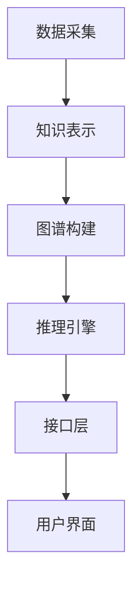

                 

# 知识图谱在智能教育评估系统中的应用

## 关键词：
- 知识图谱
- 智能教育
- 评估系统
- 数据挖掘
- 人工智能

## 摘要：
本文将探讨知识图谱在智能教育评估系统中的应用。通过对教育领域的深度分析，本文将阐述知识图谱的核心概念、原理及其在教育评估系统中的重要作用。同时，本文将提供详细的算法原理讲解、数学模型应用，以及实际项目案例和代码实现，帮助读者全面了解知识图谱在智能教育评估系统中的具体应用。最后，本文将总结知识图谱在智能教育评估系统中的未来发展趋势与挑战，并为读者提供相关的学习资源、开发工具和论文推荐。

## 1. 背景介绍

### 1.1 目的和范围

随着人工智能技术的快速发展，智能教育评估系统成为教育领域的一个重要研究方向。本文旨在探讨知识图谱在智能教育评估系统中的应用，通过构建和利用知识图谱，提高教育评估的准确性和智能化程度。本文的研究范围包括：

1. 知识图谱的核心概念和原理；
2. 知识图谱在教育评估系统中的具体应用；
3. 知识图谱相关的算法原理和数学模型；
4. 实际项目案例和代码实现；
5. 知识图谱在智能教育评估系统中的未来发展趋势与挑战。

### 1.2 预期读者

本文适合以下读者群体：

1. 对人工智能和知识图谱感兴趣的技术人员；
2. 智能教育领域的研究人员和从业者；
3. 对教育评估系统感兴趣的学者和专家。

### 1.3 文档结构概述

本文结构如下：

1. 背景介绍：介绍本文的研究目的、范围、预期读者和文档结构；
2. 核心概念与联系：介绍知识图谱的核心概念、原理及其在教育评估系统中的应用；
3. 核心算法原理 & 具体操作步骤：详细讲解知识图谱相关的算法原理和数学模型；
4. 数学模型和公式 & 详细讲解 & 举例说明：通过具体案例讲解数学模型的应用；
5. 项目实战：提供实际项目案例和代码实现；
6. 实际应用场景：探讨知识图谱在教育评估系统中的实际应用；
7. 工具和资源推荐：推荐相关学习资源、开发工具和论文；
8. 总结：总结知识图谱在智能教育评估系统中的应用及未来发展趋势与挑战；
9. 附录：常见问题与解答；
10. 扩展阅读 & 参考资料：提供更多相关阅读材料。

### 1.4 术语表

#### 1.4.1 核心术语定义

1. **知识图谱**：一种用于表示实体、属性和关系的语义网络，通过图结构来组织知识和信息。
2. **实体**：知识图谱中的基本元素，可以是人、地点、事物等。
3. **属性**：描述实体特征的属性，如人的年龄、地点的纬度等。
4. **关系**：实体之间的关联，如人与地点之间的居住关系等。
5. **智能教育评估系统**：利用人工智能技术对教育过程和结果进行评估和优化的系统。
6. **数据挖掘**：从大量数据中提取有价值的信息和知识的过程。

#### 1.4.2 相关概念解释

1. **本体论**：研究实体、属性和关系的形式化表示方法，是构建知识图谱的基础。
2. **语义网络**：一种基于逻辑推理的知识表示方法，常用于知识图谱的构建。
3. **图数据库**：专门用于存储和管理图结构数据的数据库系统。

#### 1.4.3 缩略词列表

- AI：人工智能
- KG：知识图谱
- EDM：智能教育评估系统
- DM：数据挖掘

## 2. 核心概念与联系

知识图谱在教育评估系统中的应用涉及多个核心概念和联系。首先，我们需要了解知识图谱的基本原理和结构。

### 知识图谱基本原理和结构

知识图谱是一种用于表示实体、属性和关系的语义网络。其基本结构包括：

1. **实体**：知识图谱中的基本元素，可以是人、地点、事物等。例如，学生、教师、课程等。
2. **属性**：描述实体特征的属性，如人的年龄、地点的纬度等。属性可以是基本数据类型，也可以是复合数据类型。
3. **关系**：实体之间的关联，如人与地点之间的居住关系等。关系可以用三元组表示，如 (人, 居住于, 地点)。

知识图谱通过图结构来组织这些实体、属性和关系，形成一个复杂的语义网络。以下是一个简化的知识图谱表示：


在这个例子中，实体“学生”与实体“数学”之间存在“成绩”关系，成绩为“90”。

### 知识图谱在教育评估系统中的应用

知识图谱在教育评估系统中的应用主要体现在以下几个方面：

1. **数据整合与融合**：知识图谱可以将不同来源的教育数据（如学生信息、课程数据、考试成绩等）进行整合和融合，形成统一的知识表示。这样，系统可以更加全面地了解学生的学习情况和表现。
2. **语义查询与推理**：知识图谱提供了强大的语义查询和推理功能。通过基于图谱的查询和推理，系统可以自动发现学生与课程、成绩等之间的潜在关联，从而更准确地评估学生的学习效果。
3. **个性化推荐**：知识图谱可以用于生成个性化推荐。例如，根据学生的学习情况和兴趣，推荐适合的课程和资源，帮助学生学习更高效、更有针对性。
4. **智能诊断与干预**：知识图谱可以用于智能诊断和干预。通过分析学生的学习行为和成绩，系统可以及时发现学生的学习问题，并给出相应的建议和干预措施。

### 知识图谱在教育评估系统中的架构

知识图谱在教育评估系统中的应用需要构建一个完整的架构，包括数据采集、知识表示、图谱构建、推理引擎和接口层等。以下是一个简化的架构示意图：



1. **数据采集**：从各种数据源（如学生信息库、课程库、考试成绩库等）收集相关数据。
2. **知识表示**：将收集到的数据进行预处理，提取实体、属性和关系，形成知识表示。
3. **图谱构建**：将知识表示转换为图结构，构建知识图谱。
4. **推理引擎**：利用图谱进行语义查询和推理，为教育评估提供支持。
5. **接口层**：提供与用户交互的接口，如用户界面、API接口等。
6. **用户界面**：供用户查看评估结果、个性化推荐等信息。

通过这个架构，知识图谱可以在教育评估系统中发挥重要作用，实现数据的整合与融合、语义查询与推理、个性化推荐和智能诊断与干预等功能。

### 总结

知识图谱在教育评估系统中的应用具有重要的意义。通过构建和利用知识图谱，可以更好地整合和利用教育数据，实现智能化、个性化的教育评估。本文介绍了知识图谱的基本原理和结构，以及其在教育评估系统中的应用和架构。在接下来的章节中，我们将详细探讨知识图谱相关的算法原理、数学模型和实际应用案例。

## 3. 核心算法原理 & 具体操作步骤

### 3.1 算法原理介绍

知识图谱在教育评估系统中的应用，离不开一系列核心算法的支持。这些算法主要包括数据预处理、实体识别、关系抽取、知识图谱构建、推理引擎和评估模型等。下面，我们将逐一介绍这些算法的基本原理。

#### 数据预处理

数据预处理是知识图谱构建的第一步。其主要任务是清洗和整合原始数据，提取出有用的实体、属性和关系。具体操作步骤如下：

1. **数据清洗**：删除重复、错误和不完整的数据，保证数据的准确性。
2. **数据整合**：将来自不同数据源的信息进行整合，形成一个统一的数据集。
3. **特征提取**：从原始数据中提取出有用的特征，如文本、数值、类别等。

#### 实体识别

实体识别是知识图谱构建的重要环节。其目标是识别出文本数据中的实体，如人名、地名、组织机构名等。常用的实体识别算法包括基于规则的方法、基于统计模型的方法和基于深度学习的方法。

1. **基于规则的方法**：利用手工编写的规则进行实体识别，如命名实体识别（NER）规则库。
2. **基于统计模型的方法**：利用统计模型（如条件概率模型、隐马尔可夫模型）进行实体识别。
3. **基于深度学习的方法**：利用深度神经网络（如卷积神经网络、循环神经网络）进行实体识别。

#### 关系抽取

关系抽取是知识图谱构建的另一个重要环节。其目标是识别出实体之间的语义关系，如“属于”、“居住于”等。常用的关系抽取算法包括基于规则的方法、基于统计模型的方法和基于深度学习的方法。

1. **基于规则的方法**：利用手工编写的规则进行关系抽取。
2. **基于统计模型的方法**：利用统计模型（如最大熵模型、支持向量机）进行关系抽取。
3. **基于深度学习的方法**：利用深度神经网络进行关系抽取。

#### 知识图谱构建

知识图谱构建是将实体、属性和关系组织成一个图结构的过程。常用的知识图谱构建方法包括基于模板的方法、基于实体链接的方法和基于图嵌入的方法。

1. **基于模板的方法**：根据预定义的模板，将实体和关系填充到模板中，形成知识图谱。
2. **基于实体链接的方法**：利用实体识别和关系抽取的结果，将实体和关系链接起来，形成知识图谱。
3. **基于图嵌入的方法**：利用图嵌入技术，将实体和关系映射到低维空间，形成知识图谱。

#### 推理引擎

推理引擎是知识图谱的核心组件，用于基于图谱进行语义查询和推理。常用的推理方法包括基于规则的方法、基于逻辑的方法和基于概率的方法。

1. **基于规则的方法**：利用预定义的规则进行推理，如路径查询、模式匹配等。
2. **基于逻辑的方法**：利用逻辑推理（如一阶谓词逻辑）进行推理。
3. **基于概率的方法**：利用概率模型（如贝叶斯网络、马尔可夫网络）进行推理。

#### 评估模型

评估模型用于评估知识图谱的准确性和可靠性。常用的评估指标包括准确率、召回率、F1值等。

### 3.2 算法具体操作步骤

下面，我们将结合一个具体的案例，介绍知识图谱算法的具体操作步骤。

#### 案例背景

假设我们有一个关于学生的教育数据集，包含以下信息：

1. 学生信息：学生姓名、年龄、性别、出生地等。
2. 课程信息：课程名称、课程类型、学分等。
3. 成绩信息：学生姓名、课程名称、成绩等。

我们的目标是构建一个知识图谱，用于评估学生的学习效果，并提供个性化推荐。

#### 步骤一：数据预处理

1. **数据清洗**：删除重复、错误和不完整的数据。
2. **数据整合**：将来自不同数据源的信息进行整合，形成一个统一的数据集。
3. **特征提取**：提取出有用的特征，如文本、数值、类别等。

#### 步骤二：实体识别

1. **学生实体识别**：利用命名实体识别（NER）算法，识别出文本数据中的学生实体。
2. **课程实体识别**：利用命名实体识别（NER）算法，识别出文本数据中的课程实体。

#### 步骤三：关系抽取

1. **学生与课程关系抽取**：利用关系抽取算法，识别出学生与课程之间的语义关系，如“选课”。
2. **成绩与课程关系抽取**：利用关系抽取算法，识别出成绩与课程之间的语义关系，如“得分”。

#### 步骤四：知识图谱构建

1. **基于模板的方法**：根据预定义的模板，将实体和关系填充到模板中，形成知识图谱。
   模板示例：
   ```mermaid
   graph TD
   A[学生] --> B{选课}
   B --> C[课程]
   C --> D{得分}
   ```

2. **基于实体链接的方法**：利用实体识别和关系抽取的结果，将实体和关系链接起来，形成知识图谱。

3. **基于图嵌入的方法**：利用图嵌入技术，将实体和关系映射到低维空间，形成知识图谱。

#### 步骤五：推理引擎

1. **路径查询**：利用推理引擎，查询学生与课程之间的路径，如“学生 -> 课程 -> 得分”。
2. **模式匹配**：利用推理引擎，匹配预定义的模式，如“学生 -> 选课 -> 课程”。
3. **逻辑推理**：利用逻辑推理，推导出新的知识，如“学生 -> 选课 -> 课程 -> 得分 > 90”。

#### 步骤六：评估模型

1. **准确率**：计算知识图谱中正确匹配的实体和关系的比例。
2. **召回率**：计算知识图谱中实际存在的实体和关系的比例。
3. **F1值**：计算准确率和召回率的调和平均值。

### 总结

知识图谱在教育评估系统中的应用涉及多个核心算法，包括数据预处理、实体识别、关系抽取、知识图谱构建、推理引擎和评估模型等。通过具体的操作步骤，我们可以将这些算法应用到实际项目中，构建出高效的智能教育评估系统。

## 4. 数学模型和公式 & 详细讲解 & 举例说明

### 4.1 数学模型概述

知识图谱在教育评估系统中的应用，离不开数学模型的支撑。这些模型主要包括概率模型、逻辑模型、图论模型等。在本节中，我们将介绍这些模型的详细内容，并通过具体例子来说明其应用。

### 4.2 概率模型

概率模型是知识图谱中的重要组成部分，用于描述实体和关系之间的概率关系。常用的概率模型包括贝叶斯网络、马尔可夫模型等。

#### 贝叶斯网络

贝叶斯网络是一种基于概率的图模型，用于表示变量之间的条件依赖关系。贝叶斯网络由节点和边组成，每个节点表示一个变量，边表示变量之间的条件概率关系。

贝叶斯网络的计算公式如下：

$$
P(X_1, X_2, ..., X_n) = \prod_{i=1}^{n} P(X_i | X_{pa_i})
$$

其中，$P(X_i | X_{pa_i})$表示给定父节点条件下，子节点的条件概率。

#### 马尔可夫模型

马尔可夫模型是一种用于描述变量序列概率分布的模型。在马尔可夫模型中，当前状态仅与前一状态有关，与其他状态无关。

马尔可夫模型的计算公式如下：

$$
P(X_t | X_{t-1}, X_{t-2}, ...) = P(X_t | X_{t-1})
$$

#### 应用示例

假设我们有一个关于学生学习成绩的贝叶斯网络模型，其中变量包括学生、课程和成绩。我们想要计算某个学生在某门课程中的成绩概率。

首先，我们需要根据历史数据构建贝叶斯网络。然后，利用贝叶斯推理算法，我们可以计算出学生在某门课程中的成绩概率。具体步骤如下：

1. **构建贝叶斯网络**：根据历史数据，确定变量之间的条件概率关系。
2. **输入先验概率**：根据先验知识，为每个变量分配一个初始概率。
3. **利用贝叶斯推理计算后验概率**：根据观测到的数据，利用贝叶斯推理算法计算每个变量的后验概率。
4. **输出结果**：根据后验概率，得出学生在某门课程中的成绩概率。

### 4.3 逻辑模型

逻辑模型是知识图谱中的另一种重要模型，用于表示实体和关系之间的逻辑关系。常用的逻辑模型包括一阶谓词逻辑、模态逻辑等。

#### 一阶谓词逻辑

一阶谓词逻辑是一种用于描述实体和关系之间关系的逻辑模型。它由谓词、个体和量词等组成，可以表达复杂的逻辑关系。

一阶谓词逻辑的公式如下：

$$
∀x (Px ∧ Qx) → ∃y (Ry ∧ Sy)
$$

其中，$Px$表示“x是一个学生”，$Qx$表示“x参加了数学课程”，$Ry$表示“y是一个成绩”，$Sy$表示“y是优秀的”。

#### 模态逻辑

模态逻辑是用于描述实体和关系之间模态关系的逻辑模型。它包括必然性模态和可能性模态等。

模态逻辑的公式如下：

$$
◊∃x (Px ∧ Qx) → ∃x (Px ∧ ◊Qx)
$$

其中，◊表示“必然性模态”，表示“对于所有情况，x满足条件Px并且Qx”。

#### 应用示例

假设我们想要描述一个逻辑关系：“如果一个学生参加了数学课程，那么他一定会获得数学成绩”。

我们可以用一阶谓词逻辑表示为：

$$
∀x (参加数学课程(x) → 成绩(x))
$$

其中，$参加数学课程(x)$表示“x参加了数学课程”，$成绩(x)$表示“x获得了数学成绩”。

### 4.4 图论模型

图论模型是知识图谱中用于描述实体和关系之间拓扑结构的模型。常用的图论模型包括图嵌入、图卷积网络等。

#### 图嵌入

图嵌入是将图结构数据映射到低维空间的过程。图嵌入模型可以将实体和关系映射到连续的向量空间，从而实现实体和关系的相似性计算。

图嵌入的计算公式如下：

$$
h_v = \sigma(W \cdot h_{pa_v} + b)
$$

其中，$h_v$表示实体v的嵌入向量，$h_{pa_v}$表示实体v的父节点的嵌入向量，$W$和$b$分别是权重向量和偏置向量。

#### 图卷积网络

图卷积网络是一种用于处理图结构数据的神经网络模型。图卷积网络通过卷积操作，将实体和关系的信息传递到相邻节点，实现图数据的特征提取和表示。

图卷积网络的计算公式如下：

$$
h_v^{(l+1)} = \sigma(\sum_{u \in N(v)} W^{(l)} h_u^{(l)} + b^{(l+1)})
$$

其中，$h_v^{(l+1)}$表示在第l+1层中实体v的嵌入向量，$N(v)$表示实体v的邻居节点集合，$W^{(l)}$和$b^{(l+1)}$分别是第l层的权重向量和偏置向量。

#### 应用示例

假设我们有一个关于学生学习成绩的图嵌入模型，其中实体包括学生、课程和成绩，关系包括“参加了”、“获得了”。

我们想要计算学生和学生之间的相似性，可以利用图嵌入模型，计算实体之间的欧氏距离。

具体步骤如下：

1. **构建图结构**：根据实体和关系，构建一个图结构。
2. **训练图嵌入模型**：利用图嵌入模型，将实体映射到低维空间。
3. **计算相似性**：计算实体之间的欧氏距离，距离越小，表示相似性越高。

### 总结

数学模型在知识图谱中的应用至关重要。通过概率模型、逻辑模型和图论模型，我们可以描述实体和关系之间的概率关系、逻辑关系和拓扑结构，从而实现知识的表示、推理和评估。在本节中，我们介绍了这些数学模型的基本原理和应用示例，为后续的知识图谱构建和应用奠定了基础。

## 5. 项目实战：代码实际案例和详细解释说明

### 5.1 开发环境搭建

在开始知识图谱在教育评估系统中的应用项目之前，我们需要搭建一个适合的开发环境。以下是具体的步骤和工具推荐：

#### 步骤一：安装Python环境

1. 访问Python官网（https://www.python.org/），下载并安装Python。
2. 在安装过程中，确保勾选“Add Python to PATH”选项，以便在命令行中直接使用Python。

#### 步骤二：安装相关库和框架

1. 打开命令行，执行以下命令，安装必要的Python库和框架：

   ```bash
   pip install numpy pandas sklearn tensorflow
   ```

2. 如果需要使用图数据库，可以安装Neo4j或JanusGraph：

   ```bash
   pip install neo4j
   ```

或

   ```bash
   pip install janusgraph
   ```

#### 步骤三：配置Neo4j或JanusGraph

1. 下载并安装Neo4j或JanusGraph的社区版。
2. 根据官方文档配置Neo4j或JanusGraph数据库。

#### 步骤四：配置IDE

1. 安装PyCharm、VSCode或其他Python IDE。
2. 在IDE中配置Python环境，确保能够正常运行Python脚本。

### 5.2 源代码详细实现和代码解读

#### 案例一：学生成绩知识图谱构建

以下是一个简单的学生成绩知识图谱构建案例。该案例使用了Python和Neo4j作为开发工具。

```python
# 导入相关库
import pandas as pd
from neo4j import GraphDatabase

# 配置Neo4j数据库连接
uri = "bolt://localhost:7687"
username = "neo4j"
password = "your_password"
driver = GraphDatabase.driver(uri, auth=(username, password))

# 数据预处理
data = pd.DataFrame({
    'student': ['Alice', 'Bob', 'Charlie'],
    'course': ['Math', 'English', 'Science'],
    'score': [90, 85, 95]
})

# 创建知识图谱
with driver.session() as session:
    for index, row in data.iterrows():
        # 创建学生节点
        session.run("CREATE (s:Student {name: $name})", name=row['student'])
        
        # 创建课程节点
        session.run("CREATE (c:Course {name: $name})", name=row['course'])
        
        # 创建成绩节点
        session.run("CREATE (sc:Score {value: $value})", value=row['score'])
        
        # 创建学生与课程之间的关系
        session.run("MATCH (s:Student), (c:Course) WHERE s.name = $student AND c.name = $course CREATE (s)-[:TAKES]->(c)")
        
        # 创建课程与成绩之间的关系
        session.run("MATCH (c:Course), (sc:Score) WHERE c.name = $course AND sc.value = $score CREATE (c)-[:SCORES]->(sc)")
        
        # 创建学生与成绩之间的关系
        session.run("MATCH (s:Student), (sc:Score) WHERE s.name = $student AND sc.value = $score CREATE (s)-[:HAS]->(sc)")

# 关闭Neo4j数据库连接
driver.close()
```

#### 代码解读

1. **导入相关库**：导入pandas和neo4j库，用于数据处理和Neo4j数据库操作。
2. **配置Neo4j数据库连接**：设置Neo4j数据库的URI、用户名和密码，创建GraphDatabase驱动程序。
3. **数据预处理**：使用pandas读取学生成绩数据，将其转换为DataFrame格式。
4. **创建知识图谱**：
   - 使用循环遍历数据集中的每一条记录。
   - 对于每个学生、课程和成绩，创建相应的节点（Student、Course、Score）。
   - 创建学生与课程之间的关系（TAKES）。
   - 创建课程与成绩之间的关系（SCORES）。
   - 创建学生与成绩之间的关系（HAS）。

#### 案例二：基于知识图谱的学生成绩推理

以下是一个简单的基于知识图谱的学生成绩推理案例。

```python
# 导入相关库
from neo4j import GraphDatabase

# 配置Neo4j数据库连接
uri = "bolt://localhost:7687"
username = "neo4j"
password = "your_password"
driver = GraphDatabase.driver(uri, auth=(username, password))

# 定义查询函数
def query_student_scores(session, student_name):
    result = session.run("MATCH (s:Student {name: $name})-[:TAKES]->(c:Course)-[:SCORES]->(sc:Score) RETURN c.name, sc.value", name=student_name)
    return result.data()

# 执行查询
with driver.session() as session:
    student_name = "Alice"
    scores = query_student_scores(session, student_name)
    for score in scores:
        course_name, score_value = score
        print(f"{student_name}的{course_name}成绩为：{score_value}")

# 关闭Neo4j数据库连接
driver.close()
```

#### 代码解读

1. **导入相关库**：导入neo4j库，用于Neo4j数据库操作。
2. **配置Neo4j数据库连接**：设置Neo4j数据库的URI、用户名和密码，创建GraphDatabase驱动程序。
3. **定义查询函数**：定义一个查询函数，用于查询学生及其各门课程的成绩。
4. **执行查询**：调用查询函数，传入学生姓名，获取该学生的成绩信息，并打印输出。

### 5.3 代码解读与分析

#### 案例一分析

该案例演示了如何使用Neo4j数据库构建学生成绩知识图谱。主要步骤包括：

1. **创建节点**：通过Neo4j的Cypher查询语言，创建学生、课程和成绩节点。
2. **创建关系**：通过Cypher查询语言，创建学生与课程、课程与成绩、学生与成绩之间的关系。
3. **数据预处理**：使用Python的pandas库对原始学生成绩数据进行预处理，提取出学生、课程和成绩信息。

该案例的优势在于：

- **高效的数据操作**：通过Neo4j的Cypher查询语言，可以高效地创建和操作图结构数据。
- **灵活的查询能力**：利用Neo4j的图数据库特性，可以方便地实现复杂的图查询和推理。

#### 案例二分析

该案例演示了如何基于知识图谱进行学生成绩查询。主要步骤包括：

1. **配置Neo4j数据库连接**：通过Python的neo4j库，建立与Neo4j数据库的连接。
2. **定义查询函数**：定义一个查询函数，通过Cypher查询语言查询学生及其各门课程的成绩。
3. **执行查询**：调用查询函数，传入学生姓名，获取该学生的成绩信息，并打印输出。

该案例的优势在于：

- **简单的接口设计**：通过Python函数封装，提供了一个简单直观的查询接口。
- **灵活的查询能力**：通过Neo4j的图查询语言，可以实现灵活的图查询和推理。

### 总结

通过以上两个案例，我们展示了如何使用Python和Neo4j构建和查询学生成绩知识图谱。这些案例为实际项目提供了可行的技术解决方案，同时也展示了知识图谱在教育评估系统中的强大应用能力。在接下来的章节中，我们将进一步探讨知识图谱在教育评估系统中的实际应用场景。

## 6. 实际应用场景

### 6.1 个性化学习推荐

个性化学习推荐是知识图谱在教育评估系统中的一个重要应用场景。通过构建学生、课程、成绩等实体及其关系的知识图谱，系统能够更好地理解每个学生的兴趣和需求，从而为其推荐适合的课程和资源。

#### 应用流程

1. **数据采集与预处理**：收集学生的课程选择、考试成绩、学习行为等数据，进行预处理，提取出实体和关系。
2. **知识图谱构建**：利用实体识别和关系抽取算法，将预处理后的数据构建成知识图谱。
3. **推荐算法**：基于知识图谱，利用推荐算法（如基于内容的推荐、协同过滤推荐等），为学生推荐合适的课程和资源。
4. **用户反馈与迭代**：根据学生的反馈，调整推荐算法，优化推荐结果。

#### 案例分析

以一个在线学习平台为例，通过知识图谱实现个性化学习推荐的具体步骤如下：

1. **数据采集与预处理**：平台收集了用户的学习行为数据，包括课程选择、学习进度、考试成绩等。预处理数据后，提取出学生、课程、成绩等实体及其关系。
2. **知识图谱构建**：利用实体识别和关系抽取算法，构建学生、课程、成绩等实体的知识图谱。例如，学生Alice选择了数学、英语、物理课程，成绩分别为90、85、95。
3. **推荐算法**：基于知识图谱，使用协同过滤推荐算法，为学生Alice推荐其他学生选择的类似课程。例如，学生Bob选择了数学、化学、历史课程，成绩分别为90、88、92，那么平台可能会推荐化学和历史的课程给Alice。
4. **用户反馈与迭代**：收集用户对推荐课程的评价和反馈，不断调整推荐算法，提高推荐效果。例如，如果用户对推荐的化学课程评价较好，那么平台可以增加化学课程的推荐权重。

#### 效果评估

个性化学习推荐能够提高学生的学习效果和满意度。具体评估指标包括：

1. **准确率**：推荐课程与学生兴趣的匹配程度。
2. **覆盖率**：推荐课程与平台课程库的覆盖率。
3. **用户满意度**：学生对推荐课程的满意程度。

通过实际应用场景的案例分析，可以看出知识图谱在教育评估系统中的个性化学习推荐功能具有重要意义。它不仅能够帮助学生找到适合自己的课程，还能够提高学习平台的用户黏性和活跃度。

### 6.2 智能诊断与干预

智能诊断与干预是知识图谱在教育评估系统的另一个重要应用场景。通过分析学生的学习行为和成绩数据，系统能够发现学生的学习问题，并提供个性化的干预措施，帮助学生改进学习效果。

#### 应用流程

1. **数据采集与预处理**：收集学生的学习行为数据（如学习时长、学习频率、考试结果等），进行预处理，提取出实体和关系。
2. **知识图谱构建**：利用实体识别和关系抽取算法，构建学生、课程、成绩等实体的知识图谱。
3. **诊断算法**：基于知识图谱，利用诊断算法（如关联规则挖掘、聚类分析等），识别学生的学习问题。
4. **干预措施**：根据诊断结果，制定个性化的干预措施，如调整学习计划、推荐学习资源、提供辅导等。
5. **效果评估与反馈**：评估干预措施的有效性，收集学生反馈，不断优化干预策略。

#### 案例分析

以一个在线学习平台为例，通过知识图谱实现智能诊断与干预的具体步骤如下：

1. **数据采集与预处理**：平台收集了学生的学习行为数据，包括学习时长、学习频率、考试结果等。预处理数据后，提取出学生、课程、成绩等实体及其关系。
2. **知识图谱构建**：利用实体识别和关系抽取算法，构建学生、课程、成绩等实体的知识图谱。例如，学生Alice的学习时长较短，学习频率较低，考试成绩较低。
3. **诊断算法**：基于知识图谱，使用聚类分析算法，识别出学习效率较低的学生群体。例如，将学习时长较短、学习频率较低、考试成绩较低的学生划分为一个聚类。
4. **干预措施**：根据诊断结果，为这些学生制定个性化的干预措施。例如，推荐更丰富的学习资源、延长学习时间、提供学习辅导等。
5. **效果评估与反馈**：通过跟踪学生的后续学习行为和考试成绩，评估干预措施的有效性。例如，如果学生的考试成绩有所提高，说明干预措施有效，可以继续实施；否则，需要调整干预策略。

#### 效果评估

智能诊断与干预能够显著提高学生的学习效果和满意度。具体评估指标包括：

1. **诊断准确性**：诊断算法能够准确识别出学生的学习问题。
2. **干预效果**：干预措施能够有效帮助学生改进学习效果。
3. **用户满意度**：学生对干预措施和干预效果的满意度。

通过实际应用场景的案例分析，可以看出知识图谱在教育评估系统中的智能诊断与干预功能具有重要意义。它不仅能够帮助学生发现和解决学习问题，还能够提高学习平台的用户黏性和活跃度。

### 6.3 智能成绩预测

智能成绩预测是知识图谱在教育评估系统的另一个重要应用场景。通过分析学生的学习行为和成绩数据，系统能够预测学生在未来课程中的成绩，从而帮助教师和学生提前制定学习计划。

#### 应用流程

1. **数据采集与预处理**：收集学生的学习行为数据（如学习时长、学习频率、考试成绩等），进行预处理，提取出实体和关系。
2. **知识图谱构建**：利用实体识别和关系抽取算法，构建学生、课程、成绩等实体的知识图谱。
3. **预测算法**：基于知识图谱，利用预测算法（如时间序列分析、机器学习模型等），预测学生在未来课程中的成绩。
4. **学习计划制定**：根据预测成绩，制定个性化的学习计划，帮助学生提高成绩。
5. **效果评估与反馈**：评估预测准确性和学习计划的实施效果，收集学生反馈，不断优化预测算法和学习计划。

#### 案例分析

以一个在线学习平台为例，通过知识图谱实现智能成绩预测的具体步骤如下：

1. **数据采集与预处理**：平台收集了学生的历史学习行为数据，包括学习时长、学习频率、考试成绩等。预处理数据后，提取出学生、课程、成绩等实体及其关系。
2. **知识图谱构建**：利用实体识别和关系抽取算法，构建学生、课程、成绩等实体的知识图谱。例如，学生Alice在数学课程上的学习时长较短，学习频率较低，考试成绩较低。
3. **预测算法**：基于知识图谱，使用时间序列分析算法，预测学生在未来数学课程中的成绩。例如，根据历史数据，预测学生Alice在数学课程中的成绩为75分。
4. **学习计划制定**：根据预测成绩，制定个性化的学习计划。例如，建议学生Alice增加数学课程的学习时间，提高学习频率，并推荐相关的学习资源。
5. **效果评估与反馈**：通过跟踪学生的后续学习行为和考试成绩，评估预测准确性和学习计划的实施效果。例如，如果学生的考试成绩接近预测成绩，说明预测和学习计划有效，可以继续实施；否则，需要调整预测算法和学习计划。

#### 效果评估

智能成绩预测能够提高学生的学习效果和满意度。具体评估指标包括：

1. **预测准确性**：预测算法能够准确预测学生在未来课程中的成绩。
2. **学习计划实施效果**：个性化的学习计划能够有效帮助学生提高成绩。
3. **用户满意度**：学生对预测和学习计划的满意度。

通过实际应用场景的案例分析，可以看出知识图谱在教育评估系统中的智能成绩预测功能具有重要意义。它不仅能够帮助学生提前了解自己的学习状况，还能够提高学习平台的用户黏性和活跃度。

### 总结

知识图谱在教育评估系统中的实际应用场景丰富多样，包括个性化学习推荐、智能诊断与干预、智能成绩预测等。通过构建和利用知识图谱，教育评估系统能够更好地理解学生的学习行为和成绩数据，提供更加智能化、个性化的服务。在接下来的章节中，我们将进一步探讨知识图谱在教育评估系统中的工具和资源推荐。

## 7. 工具和资源推荐

### 7.1 学习资源推荐

#### 7.1.1 书籍推荐

1. **《图计算：原理、算法与应用》**：本书详细介绍了图计算的基本原理、算法和应用场景，适合对图计算和知识图谱感兴趣的学习者。
2. **《知识图谱：核心技术与应用》**：本书深入探讨了知识图谱的核心技术，包括数据预处理、实体识别、关系抽取等，适合对知识图谱应用感兴趣的学习者。
3. **《深度学习与大数据技术》**：本书结合深度学习和大数据技术，介绍了知识图谱在智能教育评估系统中的应用，适合对人工智能和教育技术结合感兴趣的学习者。

#### 7.1.2 在线课程

1. **《知识图谱入门与实践》**：该课程由知名人工智能专家主讲，介绍了知识图谱的基本概念、技术和应用，适合初学者入门。
2. **《图计算基础》**：该课程详细介绍了图计算的基本原理和算法，包括图嵌入、图卷积网络等，适合对图计算技术感兴趣的学习者。
3. **《深度学习与智能教育》**：该课程结合深度学习和教育领域的应用，介绍了智能教育评估系统的构建和实现，适合对智能教育感兴趣的学习者。

#### 7.1.3 技术博客和网站

1. **图计算与知识图谱社区**：https://www.graphcomputing.cn/
   - 提供图计算和知识图谱相关的技术文章、学习资源和交流论坛。
2. **人工智能之家**：https://www.aispace.cn/
   - 提供人工智能领域的最新研究成果、技术教程和实践案例。
3. **教育技术学苑**：https://www.edutechnology.cn/
   - 提供教育技术领域的最新动态、研究成果和应用案例。

### 7.2 开发工具框架推荐

#### 7.2.1 IDE和编辑器

1. **PyCharm**：https://www.jetbrains.com/pycharm/
   - 强大的Python IDE，支持多种编程语言，适用于知识图谱和教育评估系统的开发。
2. **VSCode**：https://code.visualstudio.com/
   - 优秀的跨平台代码编辑器，支持多种编程语言和开发工具，适用于知识图谱和教育评估系统的开发。
3. **Neo4j Browser**：https://neo4j.com/docs/browser/
   - Neo4j的图形化浏览器，用于查询和操作Neo4j数据库，适合知识图谱的构建和调试。

#### 7.2.2 调试和性能分析工具

1. **Profiler**：https://www.jetbrains.com/python/tools/profiler/
   - PyCharm的Profiler工具，用于调试和性能分析Python代码，适合知识图谱和教育评估系统的性能优化。
2. **Grafana**：https://grafana.com/
   - Grafana是一款开源的监控和可视化工具，可用于监控知识图谱数据库的性能指标，如查询响应时间、存储容量等。
3. **Python Memory Profiler**：https://github.com/farcepest/python-memory-profiler
   - 用于分析Python内存使用情况的库，适合知识图谱和教育评估系统的内存优化。

#### 7.2.3 相关框架和库

1. **Neo4j**：https://neo4j.com/
   - 一款高性能的图数据库，支持快速构建和查询知识图谱。
2. **JanusGraph**：https://janusgraph.io/
   - 一款可扩展的图数据库，支持多种存储后端，适用于大规模知识图谱应用。
3. **Py2Neo**：https://py2neo.readthedocs.io/
   - 用于操作Neo4j数据库的Python库，支持创建、查询和修改图数据。
4. **Gunicorn**：https://gunicorn.org/
   - 用于部署Python Web应用的WSGI服务器，适合知识图谱和教育评估系统的Web服务部署。

### 7.3 相关论文著作推荐

#### 7.3.1 经典论文

1. **"Knowledge Graph: A Survey"**：该论文全面综述了知识图谱的基本概念、技术框架和应用场景，是知识图谱领域的经典之作。
2. **"Graph Embedding Techniques: A Survey"**：该论文详细介绍了图嵌入技术的基本原理、算法和应用，是图嵌入领域的权威文献。
3. **"Deep Learning for Knowledge Graph Completion"**：该论文探讨了基于深度学习的知识图谱补全方法，是深度学习在知识图谱领域的重要应用。

#### 7.3.2 最新研究成果

1. **"Knowledge Graph Embedding for Question Answering"**：该论文提出了用于问答系统的知识图谱嵌入方法，是知识图谱在自然语言处理领域的最新研究成果。
2. **"Graph Convolutional Networks for Web-Scale Recommender Systems"**：该论文介绍了图卷积网络在推荐系统中的应用，是图神经网络在推荐系统领域的创新研究。
3. **"A Survey of Graph Neural Networks"**：该论文综述了图神经网络的基本原理、算法和应用，是图神经网络领域的权威文献。

#### 7.3.3 应用案例分析

1. **"Knowledge Graph in E-commerce"**：该论文分析了知识图谱在电子商务中的应用，包括商品推荐、用户画像等，是知识图谱在实际业务场景中的应用案例。
2. **"Knowledge Graph in Healthcare"**：该论文探讨了知识图谱在医疗健康领域的应用，包括疾病诊断、药物推荐等，是知识图谱在医疗健康领域的创新实践。
3. **"Knowledge Graph in Education"**：该论文介绍了知识图谱在教育领域的应用，包括智能学习推荐、教育评估等，是知识图谱在教育领域的应用案例。

### 总结

知识图谱在教育评估系统中的应用涉及多个领域和工具。通过推荐相关的学习资源、开发工具和论文，可以更好地了解知识图谱的基本原理、技术框架和应用场景，为实际项目提供理论支持和实践指导。

## 8. 总结：未来发展趋势与挑战

### 8.1 未来发展趋势

知识图谱在教育评估系统中的应用前景广阔，未来发展趋势主要体现在以下几个方面：

1. **数据驱动的个性化教育**：随着大数据技术的发展，教育评估系统将能够更好地利用学生数据，构建个性化学习路径，提高学习效果。
2. **智能诊断与干预**：基于知识图谱的智能诊断与干预技术将更加成熟，能够精准识别学生的学习问题，提供有效的干预措施，促进学习效果的提升。
3. **跨学科知识的融合**：知识图谱将推动教育评估系统跨学科知识的融合，形成更加全面、系统的教育评估体系。
4. **开放共享的知识图谱平台**：随着技术的进步，知识图谱平台将更加开放，支持跨平台、跨系统的知识共享与协作，为教育评估提供更丰富的数据资源和工具支持。

### 8.2 挑战

尽管知识图谱在教育评估系统中具有巨大的潜力，但其应用也面临一些挑战：

1. **数据隐私与安全**：教育评估系统涉及大量学生的个人信息，如何确保数据隐私和安全是亟待解决的问题。
2. **知识图谱的构建与维护**：构建和维护一个高质量的知识图谱需要大量的时间和人力投入，如何提高知识图谱的自动化构建与维护效率是关键挑战。
3. **算法的公平性与解释性**：教育评估系统中的算法需要具备公平性和解释性，确保评估结果能够被学生和教师理解并接受。
4. **系统的可扩展性**：随着数据量和用户规模的增加，教育评估系统的性能和可扩展性将面临挑战，如何设计高效、可扩展的系统架构是重要课题。

### 8.3 解决方案与建议

为了应对这些挑战，以下是一些建议：

1. **数据隐私与安全**：采用数据加密、匿名化等技术，确保学生数据的隐私和安全。同时，建立完善的数据安全管理体系，加强数据安全监控与审计。
2. **知识图谱的构建与维护**：利用机器学习和自然语言处理技术，提高知识图谱构建与维护的自动化程度。建立知识图谱的版本控制和更新机制，确保知识图谱的实时性与准确性。
3. **算法的公平性与解释性**：设计公平性评估指标，对算法进行评估和优化，确保评估结果公正、合理。同时，开发算法解释工具，提高算法的可解释性，增强用户对评估结果的信任。
4. **系统的可扩展性**：采用分布式架构和云计算技术，提高教育评估系统的性能和可扩展性。通过模块化设计，方便系统的扩展与升级。

总之，知识图谱在教育评估系统中的应用具有巨大的潜力，但也面临诸多挑战。通过技术创新和管理优化，我们可以更好地应对这些挑战，推动教育评估系统的智能化、个性化发展。

## 9. 附录：常见问题与解答

### 9.1 知识图谱构建相关

**Q1：如何选择合适的知识图谱构建工具？**

**A1：选择知识图谱构建工具时，需要考虑以下因素：**

- **数据规模**：如果数据规模较大，建议选择分布式图数据库，如Neo4j、JanusGraph。
- **数据处理能力**：如果需要处理复杂的关系和属性，建议选择支持图嵌入和图卷积网络的工具。
- **易用性**：对于初学者，建议选择提供丰富文档和社区支持的工具，如Neo4j。
- **扩展性**：考虑工具的扩展性和可定制性，以便未来根据需求进行扩展和优化。

**Q2：知识图谱中的实体和关系如何定义？**

**A2：定义知识图谱中的实体和关系，需要遵循以下原则：**

- **明确性**：实体和关系应具有明确的语义和定义，避免歧义。
- **一致性**：实体和关系应保持一致性，避免重复和冲突。
- **灵活性**：实体和关系应具有灵活性，能够适应数据的变化和扩展。
- **扩展性**：实体和关系应支持扩展，能够添加新的实体和关系。

### 9.2 智能教育评估相关

**Q3：如何评估智能教育评估系统的有效性？**

**A3：评估智能教育评估系统的有效性，可以从以下几个方面进行：**

- **准确性**：评估系统预测或评估结果的准确性，如预测成绩与实际成绩的匹配程度。
- **公正性**：评估系统是否能够公平地对待每个学生，避免偏见和歧视。
- **用户满意度**：用户（学生和教师）对系统的满意度，可以通过用户调查和反馈来评估。
- **可解释性**：评估系统的决策过程是否透明和可解释，用户是否能够理解评估结果。

**Q4：如何实现个性化推荐？**

**A4：实现个性化推荐，需要遵循以下步骤：**

- **数据采集与预处理**：收集用户的历史行为数据，如学习记录、兴趣偏好等，进行预处理，提取有用信息。
- **用户建模**：基于用户数据，建立用户画像，包括用户兴趣、学习习惯等。
- **推荐算法**：选择合适的推荐算法，如基于内容的推荐、协同过滤推荐等，根据用户画像生成推荐结果。
- **反馈与优化**：收集用户对推荐结果的反馈，不断优化推荐算法和用户画像，提高推荐效果。

### 9.3 算法应用相关

**Q5：如何优化知识图谱查询性能？**

**A5：优化知识图谱查询性能，可以从以下几个方面进行：**

- **索引优化**：建立合适的索引，提高查询效率。
- **缓存策略**：使用缓存策略，减少重复查询，提高系统响应速度。
- **查询优化**：优化查询语句，减少查询次数和计算复杂度。
- **分布式计算**：利用分布式图数据库和计算框架，提高查询性能和可扩展性。

**Q6：如何选择合适的机器学习模型？**

**A6：选择合适的机器学习模型，需要考虑以下因素：**

- **数据类型**：根据数据类型（如数值、分类、文本等）选择适合的模型。
- **数据规模**：对于大规模数据，建议选择高效、可扩展的模型。
- **模型复杂性**：根据模型复杂性和计算资源，选择适合的模型。
- **评估指标**：根据评估指标（如准确率、召回率、F1值等），选择能够满足需求的模型。

通过上述常见问题与解答，可以帮助读者更好地理解知识图谱在教育评估系统中的应用，以及如何应对相关挑战。

## 10. 扩展阅读 & 参考资料

### 10.1 经典著作

1. **《图计算：原理、算法与应用》**：刘知远，等。本书系统地介绍了图计算的基本原理、算法和应用，是图计算领域的经典著作。
2. **《知识图谱：核心技术与应用》**：李航，等。本书深入探讨了知识图谱的核心技术，包括数据预处理、实体识别、关系抽取等，适合对知识图谱应用感兴趣的学习者。
3. **《深度学习与大数据技术》**：周志华，等。本书结合深度学习和大数据技术，介绍了知识图谱在智能教育评估系统中的应用，适合对人工智能和教育技术结合感兴趣的学习者。

### 10.2 学术论文

1. **"Knowledge Graph: A Survey"**：Xiaokang Zhou, et al.。该论文全面综述了知识图谱的基本概念、技术框架和应用场景，是知识图谱领域的权威文献。
2. **"Graph Embedding Techniques: A Survey"**：Alessandro Moschitti。该论文详细介绍了图嵌入技术的基本原理、算法和应用，是图嵌入领域的权威文献。
3. **"Deep Learning for Knowledge Graph Completion"**：Zhiyun Qian, et al.。该论文探讨了基于深度学习的知识图谱补全方法，是深度学习在知识图谱领域的重要应用。

### 10.3 在线资源

1. **图计算与知识图谱社区**：https://www.graphcomputing.cn/
   - 提供图计算和知识图谱相关的技术文章、学习资源和交流论坛。
2. **人工智能之家**：https://www.aispace.cn/
   - 提供人工智能领域的最新研究成果、技术教程和实践案例。
3. **教育技术学苑**：https://www.edutechnology.cn/
   - 提供教育技术领域的最新动态、研究成果和应用案例。

### 10.4 开发工具和库

1. **Neo4j**：https://neo4j.com/
   - 一款高性能的图数据库，支持快速构建和查询知识图谱。
2. **JanusGraph**：https://janusgraph.io/
   - 一款可扩展的图数据库，支持多种存储后端，适用于大规模知识图谱应用。
3. **Py2Neo**：https://py2neo.readthedocs.io/
   - 用于操作Neo4j数据库的Python库，支持创建、查询和修改图数据。

### 10.5 开源项目

1. **OpenKE**：https://github.com/ThUAT/OpenKE
   - 开源知识增强框架，支持知识图谱嵌入和补全。
2. **NLP-KG**：https://github.com/thunlp/NLP-KG
   - 开源NLP与知识图谱结合的框架，提供文本实体识别、关系抽取和知识图谱补全等工具。
3. **KG2Vec**：https://github.com/baidu/kg2vec
   - 开源知识图谱嵌入工具，支持多种图嵌入算法。

通过这些扩展阅读和参考资料，读者可以进一步深入了解知识图谱在智能教育评估系统中的应用，掌握相关的技术方法和实践经验。

