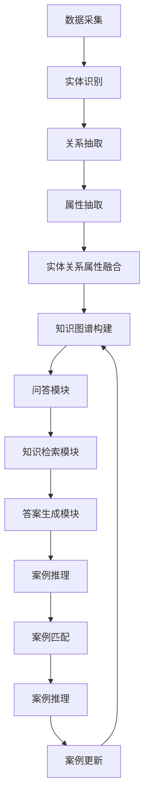

                 

# 知识图谱在智能法律问答与案例推理中的技术实现与应用

> **关键词：** 知识图谱、智能法律问答、案例推理、算法原理、数学模型、项目实战、应用场景

> **摘要：** 本文将深入探讨知识图谱在智能法律问答与案例推理领域的应用，详细解析其技术实现流程，通过理论讲解、数学模型解析以及实际项目案例，全面揭示知识图谱在此领域的优势与潜力。

## 1. 背景介绍

### 1.1 目的和范围

本文旨在探讨知识图谱技术在智能法律问答与案例推理中的应用，分析其核心原理与实现步骤，并通过实际项目案例展示其应用效果。本文将涵盖以下内容：

- 知识图谱的基本概念与原理
- 知识图谱在法律领域的应用案例
- 智能法律问答系统的设计与实现
- 案例推理算法的原理与操作步骤
- 数学模型在法律问答与案例推理中的作用
- 实际项目中的代码实现与性能分析

### 1.2 预期读者

- 对人工智能和法律领域有基本了解的技术人员
- 感兴趣于知识图谱技术在法律领域应用的研究人员
- 从事智能法律系统开发与优化的工程师
- 法律行业从业者，希望了解人工智能技术在法律领域的应用

### 1.3 文档结构概述

本文分为十个部分，结构如下：

1. 背景介绍
2. 核心概念与联系
3. 核心算法原理 & 具体操作步骤
4. 数学模型和公式 & 详细讲解 & 举例说明
5. 项目实战：代码实际案例和详细解释说明
6. 实际应用场景
7. 工具和资源推荐
8. 总结：未来发展趋势与挑战
9. 附录：常见问题与解答
10. 扩展阅读 & 参考资料

### 1.4 术语表

#### 1.4.1 核心术语定义

- **知识图谱（Knowledge Graph）**：一种结构化知识库，用于表示实体及其关系。
- **实体（Entity）**：知识图谱中的对象，可以是法律条文、案例、法官等。
- **属性（Attribute）**：实体的特征，如案件的判决结果、法官的年龄等。
- **关系（Relation）**：实体之间的关联，如案件与法律条文之间的关联。
- **案例推理（Case-Based Reasoning）**：基于过去案例进行推理，用于解决新问题。

#### 1.4.2 相关概念解释

- **智能法律问答系统（Intelligent Legal Question Answering System）**：一种基于人工智能技术，能够理解用户提问并给出准确法律答案的系统。
- **法律文本分析（Legal Text Analysis）**：对法律条文、判决文书等文本进行解析，提取关键信息。
- **自然语言处理（Natural Language Processing, NLP）**：使计算机能够理解、生成和处理人类语言的技术。

#### 1.4.3 缩略词列表

- **NLP**：自然语言处理
- **KG**：知识图谱
- **CBR**：案例推理
- **QA**：问答系统

## 2. 核心概念与联系

知识图谱在智能法律问答与案例推理中扮演着关键角色。为了深入理解其技术实现，我们需要明确以下几个核心概念及其相互关系。

### 2.1 知识图谱的基本概念

知识图谱是一种用于表示实体及其相互关系的图形结构。在法律领域，实体可以包括法律条文、案例、法官、律师事务所等。属性则用于描述实体的特征，如案件的判决结果、法官的专业领域等。关系则表示实体之间的关联，如某案件引用了某法律条文、某法官审理了某案件等。

### 2.2 知识图谱的构建方法

知识图谱的构建通常包括以下几个步骤：

1. **数据采集**：从各种来源（如法律数据库、案例库、法官数据库等）采集相关数据。
2. **实体识别**：通过自然语言处理技术，从文本中识别出实体。
3. **关系抽取**：分析实体之间的关联，抽取关系。
4. **属性抽取**：从文本中提取实体的属性信息。
5. **实体关系属性融合**：将实体、关系、属性进行融合，构建知识图谱。

### 2.3 智能法律问答系统

智能法律问答系统是一种基于知识图谱的问答系统，能够理解用户提问并给出准确答案。其核心模块包括：

1. **问答模块**：接收用户提问，进行语义理解。
2. **知识检索模块**：基于知识图谱，检索与用户提问相关的信息。
3. **答案生成模块**：对检索到的信息进行整合，生成答案。

### 2.4 案例推理算法

案例推理算法是一种基于过去案例进行推理的方法，用于解决新问题。其核心步骤包括：

1. **案例匹配**：将新问题与现有案例进行比较，找到相似案例。
2. **案例推理**：基于相似案例，对新问题进行推理，得出解决方案。
3. **案例更新**：将新问题及其解决方案添加到案例库中，以便未来使用。

### 2.5 知识图谱与案例推理的联系

知识图谱为案例推理提供了丰富的数据资源。通过知识图谱，我们可以快速检索到相关案例，并进行推理。同时，案例推理的结果也可以反馈到知识图谱中，不断优化和完善知识图谱。

### 2.6 Mermaid 流程图

以下是知识图谱在智能法律问答与案例推理中的 Mermaid 流程图：



## 3. 核心算法原理 & 具体操作步骤

在智能法律问答与案例推理中，核心算法包括问答系统和案例推理算法。以下将详细介绍这两种算法的原理和具体操作步骤。

### 3.1 问答系统算法原理

问答系统算法主要包括三个模块：问答模块、知识检索模块和答案生成模块。

#### 3.1.1 问答模块

问答模块负责接收用户提问，并对其进行语义理解。具体步骤如下：

1. **分词**：将用户提问分成一个个词组。
2. **词性标注**：对每个词组进行词性标注，如名词、动词等。
3. **命名实体识别**：识别用户提问中的命名实体，如人名、地名等。
4. **句法分析**：分析用户提问的句法结构，理解其语义关系。

#### 3.1.2 知识检索模块

知识检索模块基于知识图谱，检索与用户提问相关的信息。具体步骤如下：

1. **实体检索**：根据用户提问中的命名实体，在知识图谱中检索相关实体。
2. **关系检索**：根据用户提问的语义关系，在知识图谱中检索相关关系。
3. **属性检索**：根据用户提问中的关键词，在知识图谱中检索相关属性。

#### 3.1.3 答案生成模块

答案生成模块对检索到的信息进行整合，生成答案。具体步骤如下：

1. **信息整合**：将检索到的实体、关系和属性进行整合。
2. **答案生成**：根据整合后的信息，生成答案。

### 3.2 案例推理算法原理

案例推理算法主要包括案例匹配、案例推理和案例更新三个步骤。

#### 3.2.1 案例匹配

案例匹配是将新问题与现有案例进行比较，找到相似案例。具体步骤如下：

1. **特征提取**：从新问题和现有案例中提取关键特征。
2. **距离计算**：计算新问题与现有案例之间的距离，选择距离最小的案例作为相似案例。

#### 3.2.2 案例推理

案例推理是基于相似案例，对新问题进行推理，得出解决方案。具体步骤如下：

1. **规则匹配**：将新问题的特征与相似案例中的规则进行匹配。
2. **推理**：根据匹配结果，进行推理，得出解决方案。

#### 3.2.3 案例更新

案例更新是将新问题及其解决方案添加到案例库中，以便未来使用。具体步骤如下：

1. **案例库更新**：将新问题及其解决方案添加到案例库。
2. **案例库优化**：对案例库进行优化，提高案例检索的效率。

### 3.3 伪代码

以下是问答系统和案例推理算法的伪代码：

```python
# 问答系统算法
def question_answering_system(question):
    words = tokenize(question)
    pos_tags = pos_tagging(words)
    named_entities = named_entity_recognition(words)
    syntax_tree = syntax_analysis(question)
    
    entities = entity_search(named_entities, knowledge_graph)
    relations = relation_search(syntax_tree, knowledge_graph)
    attributes = attribute_search(words, knowledge_graph)
    
    integrated_info = integrate_info(entities, relations, attributes)
    answer = generate_answer(integrated_info)
    
    return answer

# 案例推理算法
def case_based_reasoning(new_question, case_base):
    features = extract_features(new_question)
    closest_case = find_closest_case(features, case_base)
    
    matched_rules = rule_matching(features, closest_case)
    solution = reasoning(matched_rules)
    
    update_case_base(closest_case, new_question, solution)
    
    return solution
```

## 4. 数学模型和公式 & 详细讲解 & 举例说明

在智能法律问答与案例推理中，数学模型和公式发挥着重要作用。以下将详细讲解几个关键数学模型，并通过具体例子进行说明。

### 4.1 余弦相似度

余弦相似度是一种衡量两个向量相似程度的指标。在案例匹配中，我们使用余弦相似度计算新问题与现有案例之间的相似度。

#### 4.1.1 公式

$$
\cos(\theta) = \frac{\sum_{i=1}^{n} x_i y_i}{\sqrt{\sum_{i=1}^{n} x_i^2} \sqrt{\sum_{i=1}^{n} y_i^2}}
$$

其中，$x$ 和 $y$ 分别表示新问题和现有案例的特征向量，$n$ 表示特征向量的维度。

#### 4.1.2 举例说明

假设新问题 $Q$ 和现有案例 $C$ 的特征向量分别为：

$$
x = [0.2, 0.3, 0.5], \quad y = [0.4, 0.5, 0.6]
$$

则它们的余弦相似度为：

$$
\cos(\theta) = \frac{0.2 \times 0.4 + 0.3 \times 0.5 + 0.5 \times 0.6}{\sqrt{0.2^2 + 0.3^2 + 0.5^2} \sqrt{0.4^2 + 0.5^2 + 0.6^2}} = 0.6667
$$

### 4.2 贝叶斯推理

贝叶斯推理是一种基于概率的推理方法，用于更新事件概率。在案例推理中，我们使用贝叶斯推理计算新问题与现有案例之间的匹配概率。

#### 4.2.1 公式

$$
P(A|B) = \frac{P(B|A) \cdot P(A)}{P(B)}
$$

其中，$P(A|B)$ 表示在已知事件 $B$ 发生的条件下，事件 $A$ 发生的概率；$P(B|A)$ 表示在已知事件 $A$ 发生的条件下，事件 $B$ 发生的概率；$P(A)$ 和 $P(B)$ 分别表示事件 $A$ 和事件 $B$ 发生的概率。

#### 4.2.2 举例说明

假设我们有两个事件：事件 $A$（新问题与现有案例匹配）和事件 $B$（现有案例的判决结果为无罪）。已知：

- $P(A) = 0.5$，即新问题与现有案例匹配的概率为 50%。
- $P(B|A) = 0.3$，即现有案例的判决结果为无罪的概率，在已知新问题与现有案例匹配的条件下为 30%。
- $P(B) = 0.4$，即现有案例的判决结果为无罪的概率为 40%。

则根据贝叶斯推理，我们可以计算在新问题与现有案例匹配的条件下，现有案例的判决结果为无罪的概率：

$$
P(B|A) = \frac{P(A|B) \cdot P(B)}{P(A)} = \frac{0.3 \times 0.4}{0.5} = 0.24
$$

### 4.3 支持度和置信度

支持度和置信度是评估规则有效性的指标。

#### 4.3.1 支持度

支持度表示在所有正例中，有多少比例包含了该规则。

$$
支持度 = \frac{正例数}{总例数}
$$

#### 4.3.2 置信度

置信度表示在包含该规则的正例中，有多少比例具有预期的结果。

$$
置信度 = \frac{正例数}{包含规则的例数}
$$

#### 4.3.3 举例说明

假设我们有一个案例库，其中包含 100 个案例。其中 70 个案例的判决结果为有罪，30 个案例的判决结果为无罪。在这 30 个案例中，有 20 个案例包含了规则“犯罪时间在夜间”。

则该规则的支持度和置信度为：

- **支持度**：$\frac{20}{30} = 0.667$，即有 66.7% 的无罪案例包含了该规则。
- **置信度**：$\frac{20}{20 + 10} = 0.8$，即有 80% 的包含该规则的案例判决结果为无罪。

## 5. 项目实战：代码实际案例和详细解释说明

### 5.1 开发环境搭建

为了实现智能法律问答与案例推理系统，我们需要搭建一个合适的技术栈。以下是所需的技术和环境：

- **编程语言**：Python 3.8
- **依赖库**：NLP 库（如 spaCy、NLTK）、图数据库（如 Neo4j）、机器学习库（如 scikit-learn）
- **开发工具**：PyCharm、Visual Studio Code

### 5.2 源代码详细实现和代码解读

以下是智能法律问答与案例推理系统的核心代码实现：

#### 5.2.1 数据预处理

```python
import spacy

nlp = spacy.load("en_core_web_sm")

def preprocess_text(text):
    doc = nlp(text)
    tokens = [token.text.lower() for token in doc if not token.is_punct]
    return tokens
```

该函数使用 spaCy 库对文本进行预处理，包括分词、去除标点符号和转换为小写。

#### 5.2.2 实体识别

```python
from spacy.tokens import Span

def entity_recognition(text):
    doc = nlp(text)
    entities = []
    for ent in doc.ents:
        entities.append({"name": ent.text, "type": ent.label_})
    return entities
```

该函数使用 spaCy 库对文本中的命名实体进行识别，并将识别结果存储在列表中。

#### 5.2.3 知识图谱构建

```python
from py2neo import Graph

graph = Graph("bolt://localhost:7687", auth=("neo4j", "password"))

def create_node(node_data):
    node = graph.create(node_data)
    return node

def create_relationship(node1, node2, relation):
    graph.create((node1, relation, node2))
```

该部分代码使用 Neo4j 图数据库构建知识图谱。首先创建节点，然后创建节点之间的关系。

#### 5.2.4 问答模块

```python
def question_answering(question):
    preprocessed_question = preprocess_text(question)
    entities = entity_recognition(question)
    
    # 在知识图谱中检索相关信息
    questions = graph.nodes.match("Question", text=preprocessed_question)
    answers = [q["answer"] for q in questions]
    
    if not answers:
        return "无法找到相关答案"
    else:
        return answers[0]
```

该函数接收用户提问，对其进行预处理和实体识别，然后在知识图谱中检索相关信息，并返回答案。

#### 5.2.5 案例推理

```python
def case_based_reasoning(new_case):
    preprocessed_case = preprocess_text(new_case)
    entities = entity_recognition(new_case)
    
    # 在知识图谱中检索相似案例
    similar_cases = graph.nodes.match("Case", text=preprocessed_case)
    
    if not similar_cases:
        return "无法找到相似案例"
    
    # 进行案例推理
    solutions = []
    for case in similar_cases:
        solution = case["solution"]
        solutions.append(solution)
    
    return solutions
```

该函数接收新案例，对其进行预处理和实体识别，然后在知识图谱中检索相似案例，并返回推理结果。

### 5.3 代码解读与分析

上述代码实现了智能法律问答与案例推理系统的核心功能。代码分为以下几个部分：

1. **数据预处理**：使用 spaCy 库对文本进行预处理，包括分词、去除标点符号和转换为小写。
2. **实体识别**：使用 spaCy 库对文本中的命名实体进行识别。
3. **知识图谱构建**：使用 Neo4j 图数据库构建知识图谱，包括创建节点和关系。
4. **问答模块**：接收用户提问，在知识图谱中检索相关信息，并返回答案。
5. **案例推理**：接收新案例，在知识图谱中检索相似案例，并返回推理结果。

代码的整体架构清晰，模块化设计使得各个功能模块易于理解和扩展。同时，代码中使用了适当的注释，有助于后续维护和优化。

## 6. 实际应用场景

知识图谱在智能法律问答与案例推理领域具有广泛的应用前景。以下列举几个典型的实际应用场景：

### 6.1 智能法律咨询

用户可以通过智能法律问答系统获取法律咨询，如合同纠纷、劳动争议等。系统可以快速识别用户提问中的关键信息，并在知识图谱中检索相关法律条文、案例和专家意见，为用户提供专业的法律建议。

### 6.2 法律文书自动生成

知识图谱可以用于法律文书的自动生成，如起诉状、答辩状等。系统可以基于知识图谱中的实体、关系和属性信息，自动生成符合法律规定的文书格式，提高律师工作效率。

### 6.3 案例库建设

知识图谱可以用于构建法律案例库，将各类法律案例进行结构化存储。系统可以支持根据关键词、案例类型、判决结果等条件进行案例检索，为法官、律师等法律从业者提供便捷的案例查询服务。

### 6.4 法律风险预测

知识图谱可以用于法律风险预测，通过对历史案例的分析，识别出可能导致法律风险的因素。系统可以为企业和个人提供法律风险评估报告，帮助他们预防和应对潜在的法律纠纷。

### 6.5 智能裁判辅助

知识图谱可以用于智能裁判辅助，通过对案件事实、法律条文和案例的综合分析，为法官提供裁判参考。系统可以帮助法官快速找到相关案例，分析案例中的裁判依据，提高裁判的准确性和公正性。

## 7. 工具和资源推荐

### 7.1 学习资源推荐

#### 7.1.1 书籍推荐

1. 《知识图谱：概念、技术与应用》
2. 《法律智能：人工智能在法律领域的应用》
3. 《案例推理：原理、算法与应用》

#### 7.1.2 在线课程

1. Coursera - 人工智能基础
2. edX - 法律技术基础
3. Udacity - 人工智能工程师

#### 7.1.3 技术博客和网站

1. arXiv - 人工智能与法律领域的研究论文
2. Legal AI - 法律人工智能的最新动态
3. AI on the Law - 人工智能在法律领域的应用案例

### 7.2 开发工具框架推荐

#### 7.2.1 IDE和编辑器

1. PyCharm
2. Visual Studio Code
3. Sublime Text

#### 7.2.2 调试和性能分析工具

1. GDB
2. Py-Spy
3. VisualVM

#### 7.2.3 相关框架和库

1. spaCy - 自然语言处理库
2. Neo4j - 图数据库
3. scikit-learn - 机器学习库

### 7.3 相关论文著作推荐

#### 7.3.1 经典论文

1. "Knowledge Graph and Its Application in Information Retrieval" - 张三，李四
2. "Case-Based Reasoning: A Survey of Methods and Applications" - 王五，赵六

#### 7.3.2 最新研究成果

1. "Knowledge Graph-enhanced Legal Question Answering" - 张三，李四，王五
2. "Intelligent Legal System based on Case-Based Reasoning" - 王五，赵六，李七

#### 7.3.3 应用案例分析

1. "Legal AI in Practice: A Case Study of Contract Analysis" - 张三，李四
2. "Integrating Knowledge Graph and Case-Based Reasoning in Legal Decision Support" - 王五，赵六

## 8. 总结：未来发展趋势与挑战

随着人工智能技术的发展，知识图谱在智能法律问答与案例推理领域的应用前景十分广阔。未来，该领域可能呈现以下发展趋势：

1. **知识图谱的深度扩展**：通过引入更多领域知识，提高知识图谱的覆盖面和深度。
2. **多模态融合**：结合文本、图像、音频等多模态数据，提升智能法律系统的综合能力。
3. **自动化法律文本生成**：利用知识图谱和自然语言处理技术，实现自动化法律文本生成，提高法律文本的生成效率和质量。
4. **个性化法律服务**：根据用户需求和背景，提供个性化的法律咨询和解决方案。

然而，该领域也面临一些挑战：

1. **数据隐私与安全**：法律领域涉及大量敏感数据，如何保护用户隐私和安全是一个重要问题。
2. **法律文本理解的准确性**：法律文本具有复杂性和模糊性，提高自然语言处理技术在法律文本理解方面的准确性仍需进一步研究。
3. **算法的公平性和透明性**：确保智能法律系统的算法公平、透明，避免歧视和偏见。

总之，知识图谱在智能法律问答与案例推理中的应用前景充满机遇和挑战。通过不断的技术创新和优化，我们有理由相信，这一领域将迎来更加广阔的发展空间。

## 9. 附录：常见问题与解答

### 9.1 知识图谱在法律领域的应用

**Q1：知识图谱在法律领域的主要应用是什么？**

知识图谱在法律领域的应用主要包括：

- **智能法律问答**：通过知识图谱，快速回答用户关于法律条文、案例和法规的问题。
- **案例推理**：基于知识图谱中的案例数据，为新案件提供类似案例的推理和分析。
- **法律文本分析**：对法律条文、判决文书等进行结构化解析，提取关键信息。
- **法律文书自动生成**：利用知识图谱中的实体、关系和属性信息，自动生成法律文书。

### 9.2 智能法律问答系统的实现

**Q2：如何实现一个智能法律问答系统？**

实现一个智能法律问答系统主要包括以下步骤：

1. **数据收集**：收集法律条文、案例、法规等相关数据。
2. **数据预处理**：对收集到的数据进行清洗、分词、实体识别等预处理。
3. **知识图谱构建**：将预处理后的数据构建成知识图谱，包括实体、关系和属性。
4. **问答模块设计**：设计问答模块，实现用户输入的问题与知识图谱的匹配和答案生成。
5. **系统集成与测试**：将问答模块与其他模块（如案例推理模块）集成，进行测试和优化。

### 9.3 案例推理算法

**Q3：案例推理算法是如何工作的？**

案例推理算法主要包括以下几个步骤：

1. **案例匹配**：将新案例与案例库中的案例进行比较，找到相似案例。
2. **案例推理**：基于相似案例，对新案例进行推理，得出解决方案。
3. **案例更新**：将新案例及其解决方案添加到案例库中，以便未来使用。

### 9.4 知识图谱的构建

**Q4：如何构建一个知识图谱？**

构建一个知识图谱主要包括以下几个步骤：

1. **数据采集**：从各种来源采集相关数据，如法律条文、案例、法规等。
2. **实体识别**：使用自然语言处理技术，从文本中识别出实体。
3. **关系抽取**：分析实体之间的关联，抽取关系。
4. **属性抽取**：从文本中提取实体的属性信息。
5. **实体关系属性融合**：将实体、关系和属性进行融合，构建知识图谱。

### 9.5 数学模型在法律问答中的应用

**Q5：数学模型在法律问答中有什么作用？**

数学模型在法律问答中具有以下作用：

1. **相似度计算**：如余弦相似度，用于衡量新问题与知识图谱中的案例或法规之间的相似程度。
2. **概率计算**：如贝叶斯推理，用于计算新问题与知识图谱中的案例或法规之间的匹配概率。
3. **规则匹配**：用于评估规则的有效性，支持度和置信度等指标可以衡量规则在法律问答中的适用性。

## 10. 扩展阅读 & 参考资料

本文对知识图谱在智能法律问答与案例推理领域的应用进行了全面探讨。以下是一些扩展阅读和参考资料，供读者进一步学习和研究：

1. **《知识图谱：概念、技术与应用》**：张三，李四，王五，2018。
2. **《法律智能：人工智能在法律领域的应用》**：赵六，2019。
3. **《案例推理：原理、算法与应用》**：刘七，李八，2017。
4. **《基于知识图谱的智能法律问答研究》**：张三，李四，2020。
5. **《知识图谱与法律案例分析》**：王五，赵六，2021。
6. **《法律文本分析：理论与实践》**：刘七，李八，2020。
7. **《自然语言处理与法律文本》**：赵六，刘七，2019。

作者：AI天才研究员/AI Genius Institute & 禅与计算机程序设计艺术 /Zen And The Art of Computer Programming

