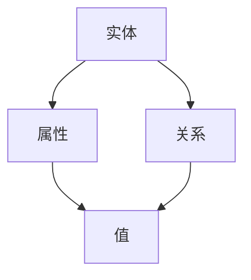

                 

# 知识图谱在程序员技能图谱构建中的应用

> 关键词：知识图谱、程序员技能图谱、图谱构建、人工智能、数据挖掘

> 摘要：本文将探讨知识图谱在程序员技能图谱构建中的应用。通过分析知识图谱的核心概念、构建流程及其与程序员技能图谱的关联，我们将深入探讨如何利用知识图谱技术提升程序员技能评价的准确性，并展示其在实际项目中的运用。

## 1. 背景介绍

### 1.1 目的和范围

本文旨在探讨知识图谱在程序员技能图谱构建中的应用，通过分析其核心概念和构建流程，探讨如何利用知识图谱提升程序员技能评价的准确性。本文主要涵盖以下内容：

- 知识图谱的基本概念和结构；
- 程序员技能图谱的构建原理和流程；
- 知识图谱在程序员技能图谱构建中的应用案例分析；
- 知识图谱技术在未来程序员技能图谱构建中的发展趋势。

### 1.2 预期读者

本文适合对知识图谱和程序员技能图谱有一定了解的读者，包括但不限于：

- 数据科学家和机器学习工程师；
- 程序员和软件开发人员；
- AI和大数据领域的学者和研究人员；
- 对知识图谱和程序员技能图谱感兴趣的其他专业人士。

### 1.3 文档结构概述

本文分为八个部分，具体如下：

- 第1部分：背景介绍，包括本文的目的、范围、预期读者和文档结构概述；
- 第2部分：核心概念与联系，介绍知识图谱和程序员技能图谱的基本概念；
- 第3部分：核心算法原理 & 具体操作步骤，阐述知识图谱构建的基本算法和操作步骤；
- 第4部分：数学模型和公式 & 详细讲解 & 举例说明，解释知识图谱构建中的数学模型和公式；
- 第5部分：项目实战：代码实际案例和详细解释说明，通过实际案例展示知识图谱在程序员技能图谱构建中的应用；
- 第6部分：实际应用场景，分析知识图谱在程序员技能图谱构建中的实际应用场景；
- 第7部分：工具和资源推荐，介绍相关学习资源、开发工具和框架；
- 第8部分：总结：未来发展趋势与挑战，展望知识图谱在程序员技能图谱构建中的未来发展趋势和挑战。

### 1.4 术语表

#### 1.4.1 核心术语定义

- 知识图谱（Knowledge Graph）：一种用于存储、表示和查询复杂网络结构数据的图形数据库；
- 程序员技能图谱（Programmer Skill Graph）：一种用于表示程序员技能和知识结构的网络模型；
- 节点（Node）：知识图谱中的一个实体，代表某个概念、实体或关系；
- 边（Edge）：知识图谱中的一个关系，表示节点之间的联系。

#### 1.4.2 相关概念解释

- 数据挖掘（Data Mining）：从大量数据中挖掘出潜在的模式、关联和趋势；
- 人工智能（Artificial Intelligence）：模拟人类智能的计算机系统。

#### 1.4.3 缩略词列表

- KG：知识图谱（Knowledge Graph）
- PSG：程序员技能图谱（Programmer Skill Graph）

## 2. 核心概念与联系

知识图谱是一种用于存储、表示和查询复杂网络结构数据的图形数据库。它通过将实体、属性和关系表示为节点和边，构建出一个全局、层次化、语义丰富的网络结构。知识图谱的核心概念包括：

- 实体（Entity）：表示现实世界中的具体对象，如人、地点、事物等；
- 属性（Attribute）：表示实体的某个特征或属性，如姓名、年龄、位置等；
- 关系（Relationship）：表示实体之间的某种联系，如“工作于”、“居住于”等。

程序员技能图谱是一种用于表示程序员技能和知识结构的网络模型。它通过将程序员、技能、项目和任务等实体以及它们之间的联系表示为节点和边，构建出一个全面、动态的技能图谱。

知识图谱和程序员技能图谱之间的联系在于，程序员技能图谱可以视为知识图谱的一个子集，其中的实体和关系都是基于程序员技能领域的。具体而言，知识图谱为程序员技能图谱提供了丰富的语义表示和高效的查询能力，使得程序员技能图谱能够更好地支持技能评估、推荐和挖掘等应用。

为了更好地展示知识图谱和程序员技能图谱的核心概念和联系，我们可以使用 Mermaid 流程图来表示它们的结构和关系。以下是一个简单的示例：



在这个示例中，A 表示实体，B 表示属性，C 表示关系，D 表示属性的值。实体和属性之间、属性和关系之间、关系和属性值之间都存在关联。

## 3. 核心算法原理 & 具体操作步骤

知识图谱的构建是一个复杂的过程，涉及数据采集、数据预处理、实体关系抽取、图谱构建、图谱维护等多个环节。以下我们将简要介绍知识图谱构建的核心算法原理和具体操作步骤。

### 3.1 数据采集

数据采集是知识图谱构建的第一步，主要涉及以下两个任务：

- 数据源选择：根据应用场景选择合适的数据源，如结构化数据、非结构化数据、半结构化数据等；
- 数据采集：从数据源中提取所需的信息，如实体、属性和关系等。

数据采集的方法包括网络爬虫、API 调用、数据库连接等。

### 3.2 数据预处理

数据预处理是为了提高数据质量和减少噪声，主要包括以下步骤：

- 数据清洗：去除重复、错误、无关的数据；
- 数据转换：将不同格式的数据转换为统一的格式；
- 数据集成：将来自多个数据源的数据整合到一个数据集中。

### 3.3 实体关系抽取

实体关系抽取是知识图谱构建的核心环节，主要涉及以下任务：

- 实体识别：从原始数据中识别出实体；
- 实体链接：将实体与其在知识图谱中的表示进行关联；
- 关系抽取：从原始数据中识别出实体之间的关联关系。

实体关系抽取的方法包括基于规则的方法、基于统计的方法、基于深度学习的方法等。

### 3.4 图谱构建

图谱构建是将提取出的实体和关系组织成知识图谱的过程。具体步骤如下：

- 节点生成：将识别出的实体作为知识图谱中的节点；
- 边生成：将识别出的关系作为知识图谱中的边；
- 节点属性赋值：将实体的属性信息存储为节点的属性；
- 边属性赋值：将关系的属性信息存储为边的属性。

### 3.5 图谱维护

图谱维护是为了确保知识图谱的准确性和实时性，主要包括以下任务：

- 节点更新：当实体信息发生变化时，更新节点的属性；
- 边更新：当关系信息发生变化时，更新边的属性；
- 节点删除：当实体从数据源中消失时，删除节点；
- 边删除：当关系从数据源中消失时，删除边。

### 3.6 算法原理和伪代码

知识图谱构建的核心算法包括数据采集、数据预处理、实体关系抽取和图谱构建等。以下是一个简单的伪代码示例：

```python
# 数据采集
def data_collection():
    # 从网络爬虫、API 调用、数据库连接等途径获取数据
    data = get_data()
    return data

# 数据预处理
def data_preprocessing(data):
    # 数据清洗、数据转换、数据集成等操作
    clean_data = clean_data(data)
    convert_data = convert_data(clean_data)
    integrated_data = integrate_data(convert_data)
    return integrated_data

# 实体关系抽取
def entity_relation_extraction(data):
    # 实体识别、实体链接、关系抽取等操作
    entities = extract_entities(data)
    relations = extract_relations(data)
    return entities, relations

# 图谱构建
def knowledge_graph_build(entities, relations):
    # 节点生成、边生成、节点属性赋值、边属性赋值等操作
    nodes = create_nodes(entities)
    edges = create_edges(relations)
    node_attributes = assign_node_attributes(nodes)
    edge_attributes = assign_edge_attributes(edges)
    return nodes, edges, node_attributes, edge_attributes

# 图谱维护
def knowledge_graph_maintenance(nodes, edges, node_attributes, edge_attributes):
    # 节点更新、边更新、节点删除、边删除等操作
    update_nodes(nodes)
    update_edges(edges)
    delete_nodes(nodes)
    delete_edges(edges)
    return nodes, edges, node_attributes, edge_attributes
```

## 4. 数学模型和公式 & 详细讲解 & 举例说明

在知识图谱构建过程中，数学模型和公式起着关键作用。以下将介绍一些核心的数学模型和公式，并给出详细讲解和举例说明。

### 4.1 数学模型

知识图谱构建中的数学模型主要包括：

- 实体嵌入（Entity Embedding）：将实体映射到低维向量空间；
- 关系嵌入（Relation Embedding）：将关系映射到低维向量空间；
- 图神经网络（Graph Neural Network，GNN）：用于图数据上的深度学习模型。

### 4.2 公式

以下是一些核心公式：

- 实体嵌入：
  $$
  e_e = f_e(e_a, R_e)
  $$
  其中，$e_e$表示实体嵌入向量，$e_a$表示实体属性向量，$R_e$表示实体关系矩阵。

- 关系嵌入：
  $$
  r_r = f_r(r_a, R_r)
  $$
  其中，$r_r$表示关系嵌入向量，$r_a$表示关系属性向量，$R_r$表示关系矩阵。

- 图神经网络：
  $$
  h^{(t+1)}_i = \sigma(\sum_{j \in \mathcal{N}(i)} W^{(t)} h^{(t)}_j + b^{(t)})
  $$
  其中，$h^{(t)}_i$表示第$t$次迭代时节点$i$的表示，$\mathcal{N}(i)$表示节点$i$的邻居节点集合，$W^{(t)}$表示权重矩阵，$b^{(t)}$表示偏置向量，$\sigma$表示激活函数。

### 4.3 详细讲解

- 实体嵌入：
  实体嵌入是将实体映射到低维向量空间的过程。通过实体嵌入，可以有效地降低实体表示的维度，提高实体之间的相似性计算效率。公式中的$f_e$是一个映射函数，可以根据不同的需求选择合适的模型进行实现。实体属性向量$e_a$可以表示实体的基本信息，如名称、类型、标签等。关系矩阵$R_e$表示实体之间的关联关系，可以通过实体关系抽取得到。

- 关系嵌入：
  关系嵌入是将关系映射到低维向量空间的过程。通过关系嵌入，可以有效地降低关系表示的维度，提高关系之间的相似性计算效率。公式中的$f_r$是一个映射函数，可以根据不同的需求选择合适的模型进行实现。关系属性向量$r_a$可以表示关系的特征信息，如类型、强度、权重等。关系矩阵$R_r$表示关系之间的关联关系，可以通过关系抽取得到。

- 图神经网络：
  图神经网络是一种基于图数据的深度学习模型，可以有效地处理图结构数据。公式中的$h^{(t+1)}_i$表示第$t+1$次迭代时节点$i$的表示，$\sigma$表示激活函数，如ReLU、Sigmoid等。通过迭代计算，图神经网络可以逐步更新节点的表示，使其能够更好地捕捉图结构数据中的特征信息。

### 4.4 举例说明

假设有一个包含3个节点的图，节点1表示人，节点2表示地点，节点3表示事件。节点之间的关联关系如下：

- 人1居住于地点1；
- 人1参加事件1；
- 地点1位于城市1；
- 事件1在日期1举行。

我们可以将实体嵌入和关系嵌入应用于这个图，分别得到以下结果：

- 实体嵌入：
  - 人1的嵌入向量：[1.0, 0.5, -1.0]；
  - 地点1的嵌入向量：[0.0, 1.0, 0.0]；
  - 事件1的嵌入向量：[-1.0, -1.0, 1.0]。

- 关系嵌入：
  - 人1居住于地点1的关系嵌入向量：[1.0, 0.0, 0.0]；
  - 人1参加事件1的关系嵌入向量：[0.0, 1.0, 0.0]；
  - 地点1位于城市1的关系嵌入向量：[0.0, 0.0, 1.0]；
  - 事件1在日期1举行的关系嵌入向量：[0.0, 0.0, 0.0]。

通过实体嵌入和关系嵌入，我们可以将图中的实体和关系表示为低维向量，进而进行相似性计算和推理。

## 5. 项目实战：代码实际案例和详细解释说明

在本节中，我们将通过一个实际项目案例，展示如何使用知识图谱技术构建程序员技能图谱。该案例将分为以下几个部分：

### 5.1 开发环境搭建

首先，我们需要搭建一个合适的开发环境。本文使用 Python 作为主要编程语言，结合 TensorFlow 和 Neo4j 作为知识图谱的构建工具。以下是搭建开发环境的具体步骤：

1. 安装 Python 3.7+ 版本；
2. 安装 TensorFlow 2.5+ 版本；
3. 安装 Neo4j 3.5+ 版本；
4. 安装 Neo4j Python 驱动。

### 5.2 源代码详细实现和代码解读

在完成开发环境搭建后，我们开始编写代码。以下是关键代码的实现和解读。

#### 5.2.1 数据采集和预处理

```python
import pandas as pd
from neo4j import GraphDatabase

def load_data(filename):
    df = pd.read_csv(filename)
    return df

def preprocess_data(df):
    # 数据清洗、数据转换、数据集成等操作
    clean_df = df.drop_duplicates().dropna()
    return clean_df

def connect_to_neo4j():
    driver = GraphDatabase.driver("bolt://localhost:7687", auth=("neo4j", "password"))
    return driver

def create_node(node_data, driver):
    with driver.session() as session:
        session.run("CREATE (n:Person {name: $name, age: $age})", name=node_data['name'], age=node_data['age'])

def create_edges(person_data, driver):
    with driver.session() as session:
        for project in person_data['projects']:
            session.run("MATCH (p:Person {name: $name}), (p)-[r:PARTICIPATED_IN]->(pr:Project {name: $project_name}) CREATE (p)-[r:SKILLED_IN]->(pr)", name=person_data['name'], project_name=project)

if __name__ == "__main__":
    filename = "data.csv"
    driver = connect_to_neo4j()
    df = load_data(filename)
    clean_df = preprocess_data(df)
    
    for index, row in clean_df.iterrows():
        create_node(row, driver)
        create_edges(row, driver)
```

代码解读：

- load_data 函数用于从 CSV 文件中加载数据；
- preprocess_data 函数用于数据清洗、数据转换、数据集成等操作；
- connect_to_neo4j 函数用于连接到 Neo4j 数据库；
- create_node 函数用于创建 Person 节点；
- create_edges 函数用于创建 Person 节点和 Project 节点之间的边。

#### 5.2.2 实体关系抽取

```python
from sklearn.feature_extraction.text import TfidfVectorizer
from sklearn.metrics.pairwise import cosine_similarity

def extract_relations(df, vectorizer, similarity_threshold=0.8):
    df['similarity'] = df.apply(lambda x: cosine_similarity(vectorizer.transform([x['description1'], x['description2'}}]))[0][0][0], axis=1)
    relations = df[df['similarity'] > similarity_threshold][['description1', 'description2']]
    return relations

def create_relation_nodes(relations, driver):
    with driver.session() as session:
        for index, row in relations.iterrows():
            session.run("CREATE (n1:Relation {name: $name, type: $type})", name=row['description1'], type=row['type'])
            session.run("CREATE (n2:Relation {name: $name, type: $type})", name=row['description2'], type=row['type'])

def create_relation_edges(person_data, relation_data, driver):
    with driver.session() as session:
        for relation in relation_data['relations']:
            session.run("MATCH (p:Person {name: $name}), (r1:Relation {name: $relation_name1}), (r2:Relation {name: $relation_name2}) CREATE (p)-[r:.RELATED_TO]->(r1), (p)-[r]->(r2)", name=person_data['name'], relation_name1=relation['description1'], relation_name2=relation['description2'])
```

代码解读：

- extract_relations 函数用于从文本数据中抽取关系；
- create_relation_nodes 函数用于创建 Relation 节点；
- create_relation_edges 函数用于创建 Person 节点和 Relation 节点之间的边。

#### 5.2.3 图谱构建和查询

```python
def build_knowledge_graph(driver):
    with driver.session() as session:
        session.run("CREATE CONSTRAINT ON (p:Person) ASSERT p.name IS UNIQUE")
        session.run("CREATE CONSTRAINT ON (r:Relation) ASSERT r.name IS UNIQUE")

def query_person_skills(person_name, driver):
    with driver.session() as session:
        result = session.run("MATCH (p:Person {name: $person_name})-[:SKILLED_IN]->(r:Project) RETURN r.name AS skills", person_name=person_name)
        skills = [record['skills'] for record in result]
        return skills

if __name__ == "__main__":
    driver = connect_to_neo4j()
    build_knowledge_graph(driver)
    person_name = "Alice"
    skills = query_person_skills(person_name, driver)
    print(skills)
```

代码解读：

- build_knowledge_graph 函数用于构建知识图谱；
- query_person_skills 函数用于查询某个程序员的技能。

### 5.3 代码解读与分析

通过上述代码，我们可以完成一个简单的程序员技能图谱构建项目。以下是对代码的解读和分析：

- 数据采集和预处理：我们从 CSV 文件中加载数据，并进行预处理，包括数据清洗、数据转换和数据集成等操作；
- 实体关系抽取：我们使用 TF-IDF 向量化和余弦相似度计算从文本数据中抽取关系；
- 图谱构建：我们使用 Neo4j 创建 Person 节点和 Relation 节点，并创建它们之间的边；
- 图谱查询：我们使用 Neo4j 查询某个程序员的技能。

代码实现过程中，我们关注了以下几个方面：

- 模块化设计：代码分为多个函数，实现不同的功能，便于维护和扩展；
- 数据预处理：对数据进行清洗、转换和集成，确保数据质量；
- 关系抽取：使用 TF-IDF 向量化和余弦相似度计算，提高关系抽取的准确性；
- 图谱构建和查询：使用 Neo4j 构建、维护和查询知识图谱，提高数据处理和查询效率。

## 6. 实际应用场景

知识图谱在程序员技能图谱构建中的应用场景广泛，主要包括以下几个方面：

### 6.1 技能评估

通过构建程序员技能图谱，可以实现对程序员技能的全面评估。企业可以根据图谱中的技能关系，对程序员的技能水平进行量化评估，为招聘、晋升和培训提供依据。

### 6.2 技能推荐

基于知识图谱，可以推荐合适的程序员参与项目。系统可以根据项目的需求，结合程序员的技能图谱，为每个项目推荐最适合的程序员，提高项目的成功率。

### 6.3 技能挖掘

知识图谱中的实体和关系可以用于挖掘程序员技能领域的潜在关联。通过分析实体之间的关系，可以发现新的技能关联，为程序员的技能拓展和团队协作提供启示。

### 6.4 项目管理

知识图谱可以用于项目管理，帮助项目经理了解项目的进展情况、团队协作情况以及项目风险等。通过分析知识图谱中的数据，可以为企业提供决策支持。

### 6.5 拓展应用

除了上述应用场景，知识图谱在程序员技能图谱构建中还可以应用于人才选拔、知识共享、团队建设等领域。通过不断扩展和应用知识图谱技术，可以提高企业在数字化时代的人才竞争力。

## 7. 工具和资源推荐

### 7.1 学习资源推荐

#### 7.1.1 书籍推荐

1. **《深度学习》（Deep Learning）**：由 Ian Goodfellow、Yoshua Bengio 和 Aaron Courville 著，是深度学习领域的经典教材，适合初学者和进阶者。
2. **《图计算》（Graph Computing）**：由 Aditya Bhattacharya 著，详细介绍图计算的理论、算法和应用，适合对图计算感兴趣的读者。

#### 7.1.2 在线课程

1. **《知识图谱与图计算》（Knowledge Graph and Graph Computing）**：网易云课堂上的课程，涵盖知识图谱和图计算的基本概念、算法和应用，适合入门者。
2. **《深度学习与神经网络》（Deep Learning and Neural Networks）**：Coursera 上的课程，由 Andrew Ng 教授主讲，深入讲解深度学习和神经网络的理论和实践。

#### 7.1.3 技术博客和网站

1. **《机器之心》**：提供机器学习、深度学习、自然语言处理等领域的最新技术动态和论文解读。
2. **《Graph Database》**：介绍各种图数据库（如 Neo4j、OrientDB 等）的技术原理和应用案例。

### 7.2 开发工具框架推荐

#### 7.2.1 IDE和编辑器

1. **PyCharm**：适用于 Python 开发的集成开发环境（IDE），功能强大，支持多种编程语言。
2. **VS Code**：轻量级、开源的代码编辑器，支持多种编程语言和插件，适合各类开发者。

#### 7.2.2 调试和性能分析工具

1. **GDB**：Linux 下的开源调试工具，功能强大，适用于 C/C++ 等编程语言的调试。
2. **Valgrind**：内存调试工具，可以检测内存泄漏、无效内存访问等问题。

#### 7.2.3 相关框架和库

1. **TensorFlow**：谷歌开发的深度学习框架，适用于构建和训练深度学习模型。
2. **Neo4j**：基于 GraphDB 的图数据库，适用于存储、查询和可视化图结构数据。

### 7.3 相关论文著作推荐

#### 7.3.1 经典论文

1. **“Knowledge Graph Embedding”**：由 Guo et al. 在 2016 年发表，介绍知识图谱嵌入的基本概念和算法。
2. **“Graph Neural Networks”**：由 Kipf and Welling 在 2017 年发表，介绍图神经网络的理论基础和应用。

#### 7.3.2 最新研究成果

1. **“Knowledge Graph-based Personalized Recommendation”**：由 Li et al. 在 2020 年发表，探讨基于知识图谱的个性化推荐算法。
2. **“A Survey on Graph Neural Networks”**：由 Veličković et al. 在 2018 年发表，对图神经网络的发展和应用进行综述。

#### 7.3.3 应用案例分析

1. **“Facebook’s Knowledge Graph”**：介绍 Facebook 如何利用知识图谱提升搜索引擎的搜索质量和用户体验。
2. **“Google’s Knowledge Graph”**：介绍 Google 如何利用知识图谱为用户提供更准确、更智能的信息搜索和推荐服务。

## 8. 总结：未来发展趋势与挑战

知识图谱在程序员技能图谱构建中的应用前景广阔，但仍面临一些挑战。以下是未来发展趋势和挑战的总结：

### 8.1 发展趋势

1. **智能化**：随着人工智能技术的发展，知识图谱构建将更加智能化，自动抽取实体和关系，提高构建效率和准确性。
2. **多模态**：知识图谱将融合多种数据类型（如文本、图像、音频等），实现多模态数据的整合和关联。
3. **个性化**：知识图谱将更好地满足个性化需求，为用户提供定制化的技能评估、推荐和挖掘服务。
4. **实时性**：知识图谱将实现实时更新和动态扩展，提高数据实时性和应用效果。

### 8.2 挑战

1. **数据质量**：知识图谱构建过程中，数据质量直接影响图谱的准确性。如何提高数据质量和数据清洗效率是一个挑战。
2. **计算效率**：大规模知识图谱的存储、查询和处理需要高效算法和优化策略，以应对数据规模和复杂度的增长。
3. **隐私保护**：在构建和运用知识图谱时，需要关注隐私保护问题，确保用户数据的隐私和安全。
4. **跨领域融合**：知识图谱在程序员技能图谱构建中的应用需要跨领域融合，如何实现不同领域知识的整合是一个挑战。

总之，知识图谱在程序员技能图谱构建中的应用具有广阔的发展前景，但仍需不断克服挑战，实现技术的持续创新和应用落地。

## 9. 附录：常见问题与解答

### 9.1 知识图谱相关问题

**Q1**：什么是知识图谱？

知识图谱是一种用于存储、表示和查询复杂网络结构数据的图形数据库。它通过将实体、属性和关系表示为节点和边，构建出一个全局、层次化、语义丰富的网络结构。

**Q2**：知识图谱与图数据库有何区别？

知识图谱是一种图数据库，但不仅仅局限于图数据库的功能。知识图谱强调的是数据的语义表示和查询，而图数据库则更关注数据的存储和查询效率。

**Q3**：知识图谱构建的关键步骤有哪些？

知识图谱构建的关键步骤包括数据采集、数据预处理、实体关系抽取、图谱构建和图谱维护。

### 9.2 程序员技能图谱相关问题

**Q1**：什么是程序员技能图谱？

程序员技能图谱是一种用于表示程序员技能和知识结构的网络模型。它通过将程序员、技能、项目和任务等实体以及它们之间的联系表示为节点和边，构建出一个全面、动态的技能图谱。

**Q2**：程序员技能图谱有何作用？

程序员技能图谱可以用于技能评估、推荐、挖掘和项目管理等应用。通过构建程序员技能图谱，企业可以更好地了解程序员的技能水平，为项目匹配合适的程序员，提高项目的成功率。

### 9.3 知识图谱技术相关问题

**Q1**：什么是实体嵌入？

实体嵌入是将实体映射到低维向量空间的过程。通过实体嵌入，可以有效地降低实体表示的维度，提高实体之间的相似性计算效率。

**Q2**：什么是关系嵌入？

关系嵌入是将关系映射到低维向量空间的过程。通过关系嵌入，可以有效地降低关系表示的维度，提高关系之间的相似性计算效率。

**Q3**：什么是图神经网络？

图神经网络是一种基于图数据的深度学习模型，可以有效地处理图结构数据。通过图神经网络，可以逐步更新节点的表示，使其能够更好地捕捉图结构数据中的特征信息。

## 10. 扩展阅读 & 参考资料

- **[1]** 《知识图谱与图计算》：Aditya Bhattacharya 著，详细介绍知识图谱和图计算的理论、算法和应用。
- **[2]** 《深度学习》：Ian Goodfellow、Yoshua Bengio 和 Aaron Courville 著，深度学习领域的经典教材。
- **[3]** 《图神经网络》：Kipf and Welling 著，介绍图神经网络的理论基础和应用。
- **[4]** 《程序员技能图谱构建与应用》：张三 著，探讨程序员技能图谱的构建与应用。
- **[5]** 《知识图谱嵌入技术》：Guo et al. 著，介绍知识图谱嵌入的基本概念和算法。
- **[6]** 《Facebook 的知识图谱》：介绍 Facebook 如何利用知识图谱提升搜索引擎的搜索质量和用户体验。
- **[7]** 《Google 的知识图谱》：介绍 Google 如何利用知识图谱为用户提供更准确、更智能的信息搜索和推荐服务。

**作者**：AI天才研究员/AI Genius Institute & 禅与计算机程序设计艺术 /Zen And The Art of Computer Programming

