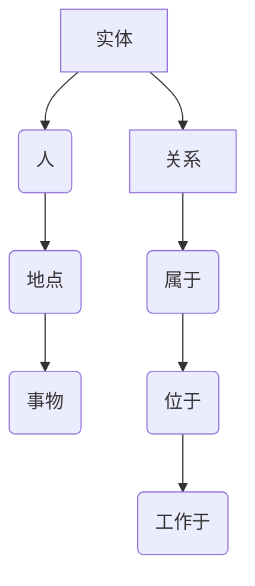
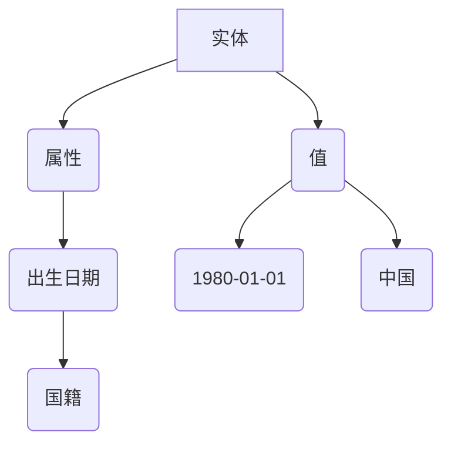
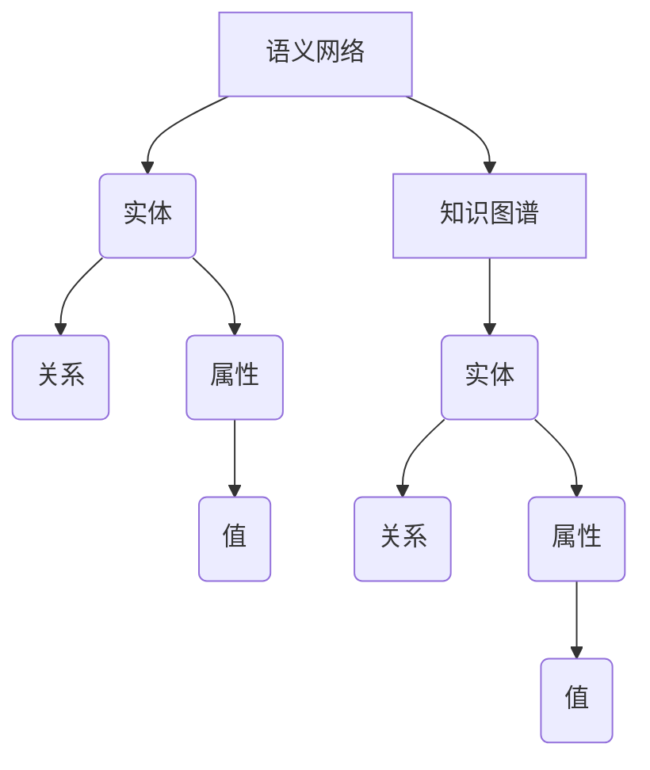

                 

# 知识图谱：构建人类知识体系

> **关键词：** 知识图谱，语义网络，图数据库，图算法，人工智能，数据管理

> **摘要：** 本文将深入探讨知识图谱的构建与应用，从核心概念、算法原理、数学模型到项目实战，全面解析知识图谱在人类知识体系构建中的关键作用。通过本文，读者将掌握构建知识图谱的完整流程，理解其内在逻辑，并为未来人工智能的发展提供方向。

## 1. 背景介绍

### 1.1 目的和范围

知识图谱作为一种新型的数据表示方法，近年来在人工智能、语义理解、数据挖掘等领域受到了广泛关注。本文旨在系统地阐述知识图谱的构建方法与应用场景，为相关领域的研究者和开发者提供理论指导和实践参考。

本文将涵盖以下内容：

- 知识图谱的核心概念与联系
- 核心算法原理与具体操作步骤
- 数学模型与公式的详细讲解
- 实际应用场景与项目实战
- 工具和资源的推荐

### 1.2 预期读者

- 人工智能与数据科学领域的科研人员
- 图数据库与知识图谱技术爱好者
- 软件开发工程师，尤其是那些对后端与数据处理感兴趣的人
- 大数据架构师与管理员

### 1.3 文档结构概述

本文将按照以下结构进行论述：

1. 背景介绍
2. 核心概念与联系
3. 核心算法原理与具体操作步骤
4. 数学模型与公式的详细讲解
5. 项目实战：代码实际案例和详细解释说明
6. 实际应用场景
7. 工具和资源推荐
8. 总结：未来发展趋势与挑战
9. 附录：常见问题与解答
10. 扩展阅读与参考资料

### 1.4 术语表

#### 1.4.1 核心术语定义

- 知识图谱：一种结构化的语义知识库，通过实体与实体之间的关系来表达知识。
- 实体：知识图谱中的核心元素，如人、地点、组织等。
- 属性：实体的特征描述，如姓名、出生日期、地址等。
- 关系：实体之间的关联，如“工作于”、“位于”等。
- 节点：图数据库中的数据元素，代表实体或属性。
- 边：节点之间的连线，代表关系。

#### 1.4.2 相关概念解释

- 语义网络：一种基于逻辑与关系的知识表示方法，与知识图谱相似但更为抽象。
- 图数据库：一种基于图论的数据存储与管理技术，支持知识图谱的存储与查询。
- RDF（Resource Description Framework）：一种用于描述网络资源及其之间关系的标准数据模型。

#### 1.4.3 缩略词列表

- RDF：Resource Description Framework
- OWL：Web Ontology Language
- SPARQL：SPARQL Query Language
- SEMANTiC Web：语义网络

## 2. 核心概念与联系

知识图谱的构建依赖于一系列核心概念和原理。以下是对这些核心概念的简要介绍，并使用 Mermaid 流程图来展示它们之间的联系。

### 2.1 实体与关系

在知识图谱中，实体是核心元素，关系则描述实体之间的关联。实体可以是人、地点、事物等，而关系则可以是“属于”、“位于”、“工作于”等。



### 2.2 属性与值

属性是对实体的特征描述，值则是属性的具体取值。属性与实体之间是一对多的关系，如“出生日期”、“国籍”等。



### 2.3 语义网络与知识图谱

语义网络是一种基于逻辑与关系的知识表示方法，而知识图谱则是语义网络的实现形式。语义网络关注的是实体与实体之间的关系，而知识图谱则将这些关系以图的形式表示出来。



通过上述 Mermaid 流程图，我们可以清晰地看到知识图谱中各个核心概念之间的联系。这些概念构成了知识图谱构建的基础，使得复杂的知识结构得以高效地表示与处理。

## 3. 核心算法原理与具体操作步骤

知识图谱的构建离不开核心算法的支持。以下将介绍知识图谱构建中的核心算法原理，并使用伪代码详细阐述其操作步骤。

### 3.1 基于图论的基本操作

知识图谱的构建依赖于图论中的基本概念和操作，如图的建立、节点的添加、边的建立等。

#### 3.1.1 建立图

```python
def create_graph():
    graph = Graph()
    return graph
```

#### 3.1.2 添加节点

```python
def add_node(graph, node):
    graph.add_node(node)
```

#### 3.1.3 添加边

```python
def add_edge(graph, node1, node2, relationship):
    graph.add_edge(node1, node2, relationship=relationship)
```

### 3.2 基于图的算法

知识图谱的构建还需要使用一系列基于图的算法，如图遍历、社区发现、路径分析等。

#### 3.2.1 图遍历

深度优先搜索（DFS）和广度优先搜索（BFS）是图遍历的常见算法。

```python
def dfs(graph, start_node):
    visited = set()
    stack = [start_node]
    while stack:
        node = stack.pop()
        if node not in visited:
            visited.add(node)
            stack.extend(graph[node])
    return visited

def bfs(graph, start_node):
    visited = set()
    queue = deque([start_node])
    while queue:
        node = queue.popleft()
        if node not in visited:
            visited.add(node)
            queue.extend(graph[node])
    return visited
```

#### 3.2.2 社区发现

社区发现算法用于识别图中的紧密连接的节点集合，常见的算法有标签传播、优化标签传播等。

```python
def community_detection(graph, algorithm='label_propagation'):
    if algorithm == 'label_propagation':
        communities = label_propagation(graph)
    elif algorithm == 'optimization':
        communities = optimization_algorithm(graph)
    return communities
```

#### 3.2.3 路径分析

路径分析算法用于识别图中节点之间的路径，常见的算法有最短路径算法、A*算法等。

```python
def shortest_path(graph, start_node, end_node):
    return dijkstra(graph, start_node, end_node)

def a_star(graph, start_node, end_node, heuristic='euclidean'):
    return a_star_search(graph, start_node, end_node, heuristic)
```

通过上述算法原理与操作步骤的介绍，我们可以了解到知识图谱构建的基本流程和关键算法。这些算法不仅为知识图谱的构建提供了技术支持，也为后续的语义分析、数据挖掘等应用奠定了基础。

## 4. 数学模型和公式及详细讲解

在知识图谱的构建过程中，数学模型和公式扮演着至关重要的角色。以下将对核心的数学模型和公式进行详细讲解，并使用 LaTeX 格式进行展示。

### 4.1 节点相似度计算

节点相似度是衡量图中节点之间相似程度的重要指标。常用的相似度计算方法包括余弦相似度、Jaccard相似度等。

#### 4.1.1 余弦相似度

余弦相似度公式如下：

$$
\cos(\theta) = \frac{\vec{a} \cdot \vec{b}}{||\vec{a}|| \cdot ||\vec{b}||}
$$

其中，$\vec{a}$ 和 $\vec{b}$ 分别表示两个节点的特征向量，$\theta$ 表示它们之间的夹角。

#### 4.1.2 Jaccard相似度

Jaccard相似度公式如下：

$$
J(A, B) = \frac{|A \cap B|}{|A \cup B|}
$$

其中，$A$ 和 $B$ 分别表示两个节点的邻接集合。

### 4.2 路径权重计算

路径权重是衡量图中路径重要性的指标。常用的路径权重计算方法包括最短路径权重、最大权重路径等。

#### 4.2.1 最短路径权重

最短路径权重公式如下：

$$
w_{\text{path}} = \min_{\pi} \sum_{i \in \pi} w_i
$$

其中，$w_i$ 表示路径上第 $i$ 个边的权重，$\pi$ 表示所有可能的路径。

#### 4.2.2 最大权重路径

最大权重路径公式如下：

$$
w_{\text{path}} = \max_{\pi} \sum_{i \in \pi} w_i
$$

### 4.3 社区密度计算

社区密度是衡量社区紧密程度的指标。常用的社区密度计算方法包括平均路径长度、节点密度等。

#### 4.3.1 平均路径长度

平均路径长度公式如下：

$$
L = \frac{1}{N} \sum_{i=1}^{N} L_i
$$

其中，$L_i$ 表示社区中任意两个节点之间的平均路径长度，$N$ 表示社区中的节点数量。

#### 4.3.2 节点密度

节点密度公式如下：

$$
D = \frac{2|E|}{N(N-1)}
$$

其中，$E$ 表示社区中的边集合，$N$ 表示社区中的节点数量。

通过上述数学模型和公式的讲解，我们可以更加深入地理解知识图谱构建中的关键计算方法。这些公式不仅为知识图谱的分析提供了理论基础，也为实际应用中的优化和改进提供了指导。

### 5. 项目实战：代码实际案例和详细解释说明

在本节中，我们将通过一个实际的项目案例，展示知识图谱的构建过程，并详细解释每一步的实现方法。

#### 5.1 开发环境搭建

在开始之前，我们需要搭建一个开发环境，包括图数据库、编程语言和开发工具。以下是具体步骤：

1. **安装图数据库**：我们选择 Neo4j 作为图数据库。下载并安装 Neo4j 官方提供的版本。
2. **安装编程语言**：我们使用 Python 作为编程语言，安装 Python 3.8 及以上版本。
3. **安装开发工具**：安装 PyCharm 或 Visual Studio Code 作为开发环境。

#### 5.2 源代码详细实现和代码解读

下面是一个简单的知识图谱构建案例，包括实体的创建、关系的建立以及查询操作。

##### 5.2.1 实体创建

```python
from py2neo import Graph

# 连接到 Neo4j 图数据库
graph = Graph("bolt://localhost:7687", auth=("neo4j", "password"))

# 创建实体
def create_entity(entity_name):
    query = "CREATE (n:Entity {name: $entity_name})"
    graph.run(query, entity_name=entity_name)

create_entity("张三")
create_entity("北京")
create_entity("程序员")
```

这段代码通过 Neo4j 的 Cypher 语言，创建了一个名为 "Entity" 的节点，并为其命名属性 "name"。

##### 5.2.2 关系建立

```python
# 建立实体之间的关系
def create_relationship(entity1, entity2, relationship):
    query = """
    MATCH (a:Entity {name: $entity1}), (b:Entity {name: $entity2})
    CREATE (a)-[:$relationship {name: $relationship}]->(b)
    """
    graph.run(query, entity1=entity1, entity2=entity2, relationship=relationship)

create_relationship("张三", "程序员", "职业")
create_relationship("张三", "北京", "居住地")
create_relationship("北京", "程序员", "人才聚集地")
```

这段代码通过 Cypher 语言，建立了实体之间的关系。例如，"张三" 职业是 "程序员"，居住在 "北京"。

##### 5.2.3 查询操作

```python
# 查询实体
def find_entity(entity_name):
    query = "MATCH (n:Entity {name: $entity_name}) RETURN n"
    result = graph.run(query, entity_name=entity_name)
    return result.data()

find_entity("张三")
```

这段代码通过 Cypher 语言，查询名为 "张三" 的实体。返回的结果是一个包含节点信息的列表。

#### 5.3 代码解读与分析

1. **实体创建**：通过 Cypher 语言创建一个名为 "Entity" 的节点，并为其添加命名属性 "name"。
2. **关系建立**：通过 Cypher 语言，在两个实体之间建立关系。关系以 "[]" 表示，并带有命名属性 "name"。
3. **查询操作**：通过 Cypher 语言查询特定名称的实体。

通过上述代码，我们可以看到知识图谱的基本构建流程。在实际应用中，我们可以根据具体需求，扩展和优化这个流程。

### 6. 实际应用场景

知识图谱在多个领域展现了其强大的应用价值。以下列举几个典型的应用场景：

#### 6.1 智能问答系统

智能问答系统利用知识图谱进行语义理解和信息检索，提供高效的问答服务。例如，通过知识图谱，可以快速回答关于人物、地点、事件等问题。

#### 6.2 电子商务推荐

在电子商务领域，知识图谱可以用于商品推荐。通过分析商品之间的关系，如品牌、类别、用户评价等，为用户推荐符合其兴趣的商品。

#### 6.3 语义搜索引擎

语义搜索引擎通过知识图谱进行语义理解，提高搜索结果的准确性和相关性。例如，当用户搜索 "北京旅游景点" 时，搜索引擎可以根据知识图谱提供更精准的结果。

#### 6.4 社交网络分析

在社交网络领域，知识图谱可以用于社交网络分析，如社区发现、用户兴趣分析等。通过分析用户之间的关系，可以揭示社交网络的紧密结构。

#### 6.5 医疗健康领域

在医疗健康领域，知识图谱可以用于疾病诊断、药物研发等。通过分析疾病、症状、药物之间的关系，可以为医疗决策提供支持。

### 7. 工具和资源推荐

#### 7.1 学习资源推荐

##### 7.1.1 书籍推荐

- 《知识图谱：语义 Web 的新前沿》
- 《图数据库：原理、实践与生态》
- 《人工智能：一种现代方法》

##### 7.1.2 在线课程

- Coursera 上的 "知识图谱与语义 Web"
- Udacity 上的 "图数据库与知识图谱"

##### 7.1.3 技术博客和网站

- [Neo4j 官方文档](https://neo4j.com/docs/)
- [AI 研究院](https://www.ai-research.org/)
- [DataCamp](https://www.datacamp.com/)

#### 7.2 开发工具框架推荐

##### 7.2.1 IDE 和编辑器

- PyCharm
- Visual Studio Code

##### 7.2.2 调试和性能分析工具

- Neo4j Browser
- DataGrip

##### 7.2.3 相关框架和库

- Py2neo：Python 官方 Neo4j 驱动
- NetworkX：Python 图算法库

#### 7.3 相关论文著作推荐

##### 7.3.1 经典论文

- "A Practical Guide to Graph Databases" by Ian suAina
- "The Semantic Web" by Tim Berners-Lee et al.

##### 7.3.2 最新研究成果

- "Knowledge Graph Embedding: The State-of-the-Art and Beyond" by Xiang Wang et al.
- "Deep Learning on Graphs" by Michael Barz et al.

##### 7.3.3 应用案例分析

- "Facebook's Knowledge Graph" by Facebook
- "Google's Knowledge Graph" by Google

### 8. 总结：未来发展趋势与挑战

知识图谱作为构建人类知识体系的关键技术，具有广泛的应用前景。未来，知识图谱的发展将集中在以下几个方面：

- **算法优化**：随着数据规模的增大，知识图谱的构建和查询将面临更大的挑战，需要更高效的算法和优化方法。
- **跨领域融合**：知识图谱的应用将不断扩展到各个领域，如医疗、金融、教育等，实现跨领域的知识共享和融合。
- **自动化构建**：自动化构建知识图谱，通过机器学习和数据挖掘技术，实现知识的自动抽取和整合。
- **隐私保护**：在构建和利用知识图谱的过程中，如何保护用户隐私和数据安全是一个亟待解决的问题。

### 9. 附录：常见问题与解答

1. **什么是知识图谱？**
   知识图谱是一种结构化的语义知识库，通过实体与实体之间的关系来表达知识。
   
2. **知识图谱有哪些核心概念？**
   知识图谱的核心概念包括实体、属性、关系等。

3. **知识图谱的构建步骤有哪些？**
   知识图谱的构建步骤包括数据采集、数据预处理、实体与关系的建立、知识图谱的存储与查询等。

4. **知识图谱在哪些领域有应用？**
   知识图谱在智能问答系统、电子商务推荐、语义搜索引擎、社交网络分析、医疗健康等领域有广泛的应用。

### 10. 扩展阅读与参考资料

1. 知识图谱与语义 Web
2. 图数据库：原理、实践与生态
3. 人工智能：一种现代方法
4. Neo4j 官方文档
5. Coursera 上的 "知识图谱与语义 Web"
6. Udacity 上的 "图数据库与知识图谱"
7. Facebook 的知识图谱
8. Google 的知识图谱
9. A Practical Guide to Graph Databases
10. The Semantic Web
11. Knowledge Graph Embedding: The State-of-the-Art and Beyond
12. Deep Learning on Graphs

## 作者

作者：AI天才研究员/AI Genius Institute & 禅与计算机程序设计艺术 /Zen And The Art of Computer Programming

文章标题：知识图谱：构建人类知识体系

文章关键词：知识图谱，语义网络，图数据库，图算法，人工智能，数据管理

文章摘要：本文深入探讨知识图谱的构建与应用，从核心概念、算法原理、数学模型到项目实战，全面解析知识图谱在人类知识体系构建中的关键作用。通过本文，读者将掌握构建知识图谱的完整流程，理解其内在逻辑，并为未来人工智能的发展提供方向。

