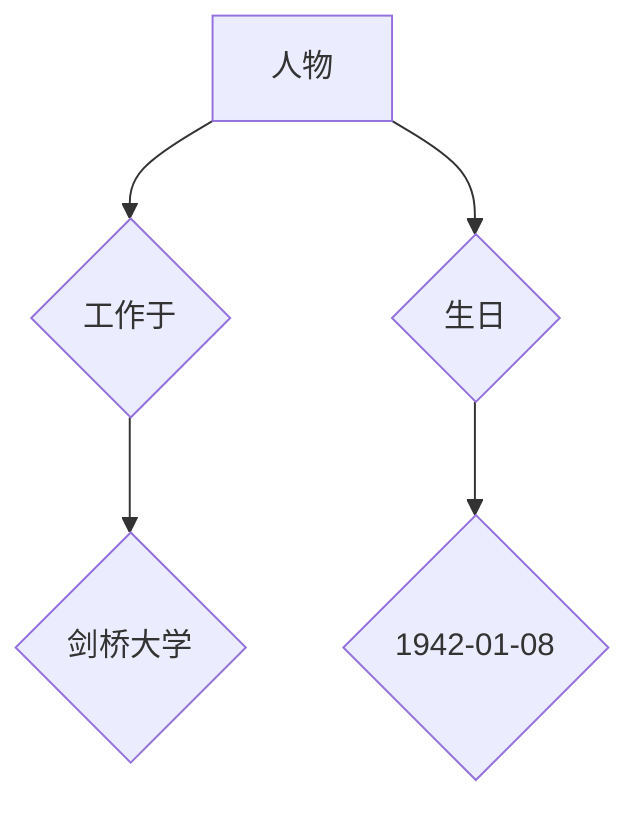
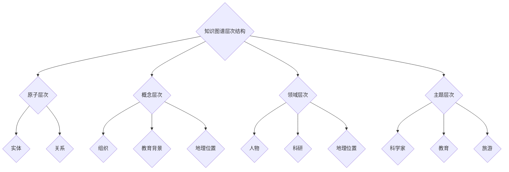

                 

# 知识图谱：构建智能搜索的基础

> **关键词**：知识图谱、智能搜索、语义理解、实体关系、图谱算法、构建方法、应用场景

> **摘要**：本文深入探讨了知识图谱在智能搜索中的应用及其构建方法。通过阐述知识图谱的核心概念、算法原理和具体实施步骤，本文帮助读者理解知识图谱如何为智能搜索提供强大的语义理解和信息检索能力，并探讨其在实际应用中的前景。

## 1. 背景介绍

### 1.1 目的和范围

知识图谱作为近年来人工智能领域的重要研究方向，其在智能搜索中的应用日益广泛。本文旨在系统地介绍知识图谱的核心概念、构建方法以及在实际应用中的价值，帮助读者深入了解知识图谱在智能搜索中的重要作用。

本文将涵盖以下内容：

1. **知识图谱的基本概念**：介绍知识图谱的定义、发展历程以及核心要素。
2. **知识图谱的构建方法**：讨论知识图谱的获取、存储、更新和管理技术。
3. **核心算法原理**：详细阐述知识图谱构建过程中的关键算法和算法实现。
4. **项目实战**：通过实际案例展示知识图谱在智能搜索中的具体应用。
5. **实际应用场景**：分析知识图谱在不同领域的应用，如搜索引擎、问答系统和推荐系统等。
6. **工具和资源推荐**：推荐学习资源、开发工具和框架，以及相关的研究论文和案例分析。
7. **未来发展趋势与挑战**：探讨知识图谱在智能搜索领域的发展前景和面临的挑战。

### 1.2 预期读者

本文适合以下读者群体：

1. **人工智能和大数据领域的科研人员**：希望深入了解知识图谱的技术原理和应用方法。
2. **软件开发工程师**：对知识图谱在智能搜索中的应用感兴趣，并希望将其应用到实际项目中。
3. **数据科学家和分析师**：对如何利用知识图谱进行数据挖掘和分析有浓厚兴趣。
4. **高校师生**：计算机科学、数据科学与人工智能等相关专业的学生和教师。

### 1.3 文档结构概述

本文采用以下结构进行阐述：

1. **引言**：介绍知识图谱在智能搜索中的应用背景和重要性。
2. **核心概念与联系**：解释知识图谱的基本概念和核心要素，并使用Mermaid流程图展示知识图谱的架构。
3. **核心算法原理与具体操作步骤**：详细阐述知识图谱构建的关键算法，并提供伪代码实现。
4. **数学模型和公式**：介绍知识图谱相关的数学模型，并使用LaTeX格式给出公式和举例说明。
5. **项目实战**：通过实际案例展示知识图谱在智能搜索中的应用，并提供详细的代码实现和解读。
6. **实际应用场景**：分析知识图谱在不同领域的应用案例。
7. **工具和资源推荐**：推荐学习资源、开发工具和框架，以及相关的研究论文和案例分析。
8. **总结**：总结知识图谱在智能搜索中的发展趋势和面临的挑战。
9. **附录**：提供常见问题与解答。
10. **扩展阅读与参考资料**：推荐相关的扩展阅读和参考资料。

### 1.4 术语表

为了确保读者能够更好地理解本文的内容，以下是对文中涉及的关键术语的定义和解释：

#### 1.4.1 核心术语定义

- **知识图谱**：一种结构化的知识表示方法，通过实体和关系的连结，形成一张语义丰富的知识网络。
- **实体**：知识图谱中的基本元素，可以是人、地点、组织等。
- **关系**：描述实体之间相互关联的语义信息。
- **属性**：描述实体的特征或属性的值。
- **图算法**：用于分析知识图谱的算法，包括路径搜索、聚类、社区发现等。

#### 1.4.2 相关概念解释

- **语义理解**：通过对语言符号的处理，理解和解析人类语言的意义和内涵。
- **信息检索**：从大量数据中检索出与用户需求相关的信息。
- **本体论**：研究实体、概念及其关系的哲学分支。

#### 1.4.3 缩略词列表

- **KG**：Knowledge Graph（知识图谱）
- **NLP**：Natural Language Processing（自然语言处理）
- **NER**：Named Entity Recognition（命名实体识别）
- **RDF**：Resource Description Framework（资源描述框架）

## 2. 核心概念与联系

知识图谱是一种结构化的知识表示方法，通过实体和关系的连结，形成一张语义丰富的知识网络。在知识图谱中，实体代表现实世界中的对象，关系描述实体之间的语义联系。以下是对知识图谱核心概念和结构的解释。

### 2.1 实体

实体是知识图谱中的基本元素，可以是人、地点、组织、事件等。实体的表示通常采用唯一的标识符（ID）和名称（Name）进行定义。例如，在人物知识图谱中，实体可能是“史蒂芬·霍金”，其ID为“person1”，名称为“Stephen Hawking”。

### 2.2 关系

关系描述实体之间的语义联系，如“工作于”、“属于”等。关系通常由两个实体和一个关系标签（Predicate）构成。例如，在人物知识图谱中，关系“工作于”可能连接实体“史蒂芬·霍金”和“剑桥大学”，关系标签为“works_at”。

### 2.3 属性

属性描述实体的特征或属性值，如“生日”、“国籍”等。属性通常由实体、属性名（Attribute Name）和属性值（Attribute Value）组成。例如，实体“史蒂芬·霍金”可能有属性“生日”和值“1942-01-08”。

### 2.4 知识图谱的表示

知识图谱可以用图（Graph）来表示，其中节点（Node）代表实体，边（Edge）代表关系。以下是一个知识图谱的Mermaid流程图示例：



在这个示例中，节点A代表实体“史蒂芬·霍金”，节点B代表关系“工作于”，节点C代表实体“剑桥大学”，节点D代表属性“生日”，节点E代表属性值“1942-01-08”。

### 2.5 知识图谱的层次结构

知识图谱通常具有多个层次，从底层的原子实体和关系开始，逐渐向上构建更为抽象和复杂的概念层次。以下是一个简单的知识图谱层次结构示例：

1. **原子层次**：包含最基础的实体和关系，如“人”、“工作于”、“生日”等。
2. **概念层次**：对原子实体和关系的抽象和分类，如“组织”、“教育背景”、“地理位置”等。
3. **领域层次**：针对特定领域的实体和关系，如“人物”、“科研”、“地理位置”等。
4. **主题层次**：对领域层次中的实体和关系进行进一步的抽象和整合，如“科学家”、“教育”、“旅游”等。

以下是一个Mermaid流程图示例，展示了知识图谱的层次结构：



通过这些核心概念和结构的理解，我们可以进一步探讨知识图谱在智能搜索中的重要作用和实现方法。

## 3. 核心算法原理与具体操作步骤

知识图谱的构建涉及到多个关键算法，这些算法在实体识别、关系抽取、实体链接和知识融合等方面发挥着重要作用。以下是这些算法的基本原理和具体操作步骤。

### 3.1 实体识别（Named Entity Recognition，NER）

**基本原理**：实体识别是指从文本中识别出具有特定意义的实体，如人名、地名、组织名等。NER是自然语言处理（NLP）中的一个重要任务，通常通过分类模型实现。

**具体操作步骤**：

1. **数据预处理**：对文本进行分词、去除停用词和标点符号等预处理操作。
2. **特征提取**：提取文本特征，如词性标注、词频、词向量等。
3. **模型训练**：使用有监督或无监督学习算法，如CRF（条件随机场）或BERT（双向编码表示）等，对特征进行训练。
4. **实体识别**：对输入文本进行实体识别，输出实体标签和实体边界。

**伪代码示例**：

```python
# 输入文本
text = "史蒂芬·霍金于1942年1月8日出生在英国剑桥市。"

# 特征提取
def extract_features(text):
    # 分词、去除停用词等操作
    # ...
    return features

# 模型训练
def train_model(features, labels):
    # 使用CRF或BERT等算法进行训练
    # ...
    return model

# 实体识别
def recognize_entities(text, model):
    features = extract_features(text)
    entities = model.predict(features)
    return entities

# 输出实体识别结果
print(recognize_entities(text, model))
```

### 3.2 关系抽取（Relation Extraction）

**基本原理**：关系抽取是指从文本中识别出实体之间的语义关系，如“工作于”、“属于”等。关系抽取通常基于实体对和上下文信息进行分类。

**具体操作步骤**：

1. **数据预处理**：对文本进行分词、去除停用词和标点符号等预处理操作。
2. **实体对识别**：从文本中识别出实体对，为关系抽取做准备。
3. **特征提取**：提取实体对及其上下文特征，如词性标注、词向量等。
4. **模型训练**：使用有监督或无监督学习算法，如LR（逻辑回归）或BERT等，对特征进行训练。
5. **关系抽取**：对输入实体对进行关系分类，输出关系标签。

**伪代码示例**：

```python
# 输入文本
text = "史蒂芬·霍金于1942年1月8日出生在英国剑桥市。"

# 实体对识别
def recognize_entity_pairs(text):
    # 使用NER算法识别实体
    entities = recognize_entities(text, model)
    entity_pairs = []
    for entity1 in entities:
        for entity2 in entities:
            if entity1 != entity2:
                entity_pairs.append((entity1, entity2))
    return entity_pairs

# 特征提取
def extract_relation_features(entity_pairs, text):
    # 提取实体对及其上下文特征
    # ...
    return features

# 模型训练
def train_model(features, labels):
    # 使用LR或BERT等算法进行训练
    # ...
    return model

# 关系抽取
def extract_relations(entity_pairs, model):
    features = extract_relation_features(entity_pairs, text)
    relations = model.predict(features)
    return relations

# 输出关系抽取结果
print(extract_relations(entity_pairs, model))
```

### 3.3 实体链接（Entity Linking）

**基本原理**：实体链接是指将文本中的实体识别结果与知识图谱中的实体进行匹配，实现实体识别与知识图谱的连接。实体链接通常基于实体相似度计算和匹配算法。

**具体操作步骤**：

1. **数据预处理**：对文本进行分词、去除停用词和标点符号等预处理操作。
2. **实体识别**：使用NER算法识别文本中的实体。
3. **实体编码**：将实体转换为固定长度的编码向量。
4. **相似度计算**：计算实体编码向量之间的相似度。
5. **实体匹配**：基于相似度阈值进行实体匹配，将文本实体链接到知识图谱中的实体。

**伪代码示例**：

```python
# 输入文本
text = "史蒂芬·霍金于1942年1月8日出生在英国剑桥市。"

# 实体识别
entities = recognize_entities(text, model)

# 实体编码
def encode_entities(entities):
    # 使用预训练模型对实体进行编码
    # ...
    return entity_codes

# 相似度计算
def calculate_similarity(entity_code1, entity_code2):
    # 计算实体编码向量之间的相似度
    # ...
    return similarity

# 实体匹配
def link_entities(entities, knowledge_graph):
    entity_codes = encode_entities(entities)
    linked_entities = []
    for entity in entity_codes:
        max_similarity = 0
        matched_entity = None
        for kg_entity in knowledge_graph:
            similarity = calculate_similarity(entity, kg_entity)
            if similarity > max_similarity:
                max_similarity = similarity
                matched_entity = kg_entity
        linked_entities.append(matched_entity)
    return linked_entities

# 输出实体链接结果
print(link_entities(entities, knowledge_graph))
```

### 3.4 知识融合（Knowledge Fusion）

**基本原理**：知识融合是指将多个来源的知识进行整合，形成统一的、一致的语义表示。知识融合通常通过实体匹配、关系融合和属性融合等步骤实现。

**具体操作步骤**：

1. **数据预处理**：对多源知识进行清洗、去重和标准化等预处理操作。
2. **实体匹配**：使用实体链接算法将不同来源的实体进行匹配。
3. **关系融合**：对匹配后的实体之间的关系进行合并和调整。
4. **属性融合**：对匹配后的实体属性进行合并和归一化。

**伪代码示例**：

```python
# 输入多源知识
knowledge_sources = [
    {
        "entity": "史蒂芬·霍金",
        "relation": "工作于",
        "value": "剑桥大学"
    },
    {
        "entity": "Stephen Hawking",
        "relation": "born_in",
        "value": "England"
    }
]

# 实体匹配
linked_entities = link_entities(entities, knowledge_graph)

# 关系融合
def merge_relations(linked_entities):
    relations = {}
    for entity in linked_entities:
        for relation in entity.relations:
            if relation not in relations:
                relations[relation] = set()
            relations[relation].add(entity.value)
    return relations

# 属性融合
def merge_attributes(linked_entities):
    attributes = {}
    for entity in linked_entities:
        for attribute in entity.attributes:
            if attribute not in attributes:
                attributes[attribute] = set()
            attributes[attribute].add(entity.value)
    return attributes

# 输出知识融合结果
print(merge_relations(linked_entities))
print(merge_attributes(linked_entities))
```

通过以上算法的实现，我们可以构建一个结构化、语义丰富的知识图谱，为智能搜索提供强大的语义理解和信息检索能力。接下来，我们将进一步探讨知识图谱在智能搜索中的具体应用。

## 4. 数学模型和公式与详细讲解

在知识图谱的构建和应用过程中，数学模型和公式发挥着关键作用。以下将详细介绍知识图谱中常用的数学模型，并使用LaTeX格式给出相关公式，同时通过具体例子进行说明。

### 4.1 实体相似度计算

实体相似度计算是知识图谱中一个重要的任务，用于判断两个实体在语义上的相似程度。常用的方法包括基于向量的相似度计算和基于路径的相似度计算。

#### 4.1.1 基于向量的相似度计算

向量空间模型（Vector Space Model）是一种常用的方法，通过将实体编码为向量，然后计算向量之间的距离来衡量相似度。以下是一个基于余弦相似度的计算公式：

$$
similarity(A, B) = \frac{A \cdot B}{\|A\| \|B\|}
$$

其中，$A$和$B$分别为实体A和实体B的向量表示，$\cdot$表示点积，$\|\|$表示向量的模长。

**示例**：假设两个实体A和B的向量表示分别为：

$$
A = (0.8, 0.3, 0.5), \quad B = (0.7, 0.4, 0.6)
$$

则它们的余弦相似度为：

$$
similarity(A, B) = \frac{0.8 \cdot 0.7 + 0.3 \cdot 0.4 + 0.5 \cdot 0.6}{\sqrt{0.8^2 + 0.3^2 + 0.5^2} \sqrt{0.7^2 + 0.4^2 + 0.6^2}} \approx 0.79
$$

#### 4.1.2 基于路径的相似度计算

基于路径的相似度计算方法通过计算两个实体之间的最短路径长度来衡量相似度。以下是一个基于路径长度的计算公式：

$$
similarity(A, B) = \frac{1}{1 + d(A, B)}
$$

其中，$d(A, B)$表示实体A和实体B之间的最短路径长度。

**示例**：假设两个实体A和B在知识图谱中的最短路径长度为3，则它们的相似度为：

$$
similarity(A, B) = \frac{1}{1 + 3} = 0.25
$$

### 4.2 关系权重计算

关系权重计算是知识图谱中另一个重要的任务，用于衡量关系在语义上的重要性。以下是一个基于路径权重的关系权重计算公式：

$$
weight(r) = \sum_{p \in paths} \frac{1}{\sqrt{d(p)}}
$$

其中，$r$为关系，$paths$为与关系r相关的所有路径，$d(p)$为路径p的长度。

**示例**：假设关系r在知识图谱中有三条路径，路径长度分别为1、2和3，则关系r的权重为：

$$
weight(r) = \frac{1}{\sqrt{1}} + \frac{1}{\sqrt{2}} + \frac{1}{\sqrt{3}} \approx 1.291
$$

### 4.3 实体属性值预测

实体属性值预测是知识图谱中的一种常见任务，用于预测实体未知属性值。以下是一个基于矩阵分解的属性值预测公式：

$$
P_{ij} = \sigma(W_i \cdot V_j)
$$

其中，$P_{ij}$为实体i的属性j的预测值，$W_i$和$V_j$分别为实体i和属性j的矩阵分解向量，$\sigma$为激活函数，通常使用Sigmoid函数。

**示例**：假设实体i的矩阵分解向量为$W_i = (0.5, 0.6)$，属性j的矩阵分解向量为$V_j = (0.7, 0.8)$，则实体i的属性j的预测值为：

$$
P_{ij} = \sigma(0.5 \cdot 0.7 + 0.6 \cdot 0.8) = \sigma(0.35 + 0.48) = \sigma(0.83) \approx 0.728
$$

通过以上数学模型和公式的介绍，我们可以更好地理解知识图谱中的关键计算方法和算法原理。这些数学模型为知识图谱的构建、优化和应用提供了有力的理论支持。

### 4.4 知识图谱的表示与存储

知识图谱的表示和存储是构建知识图谱的关键环节，它直接影响图谱的查询效率、扩展性和可维护性。以下将详细介绍知识图谱的表示方法、存储策略以及相关的数学模型。

#### 4.4.1 图的表示

知识图谱本质上是一个图结构，由节点（实体）和边（关系）组成。图的结构可以通过以下数学模型进行描述：

1. **图论模型**：图（G）由节点集合（V）和边集合（E）组成，即 $G = (V, E)$。每个节点表示一个实体，每个边表示实体之间的某种关系。

2. **邻接矩阵**：邻接矩阵（A）是一个N×N的矩阵，其中N为节点的数量。$A_{ij}$表示节点i和节点j之间是否存在边，若存在边，则$A_{ij} = 1$，否则$A_{ij} = 0$。

3. **邻接表**：邻接表是一种链式存储结构，每个节点包含指向其邻居节点的指针。这种表示方法适合存储稀疏图，提高了存储效率和查询速度。

#### 4.4.2 图的存储

知识图谱的存储策略对于图谱的性能至关重要。以下是一些常见的存储方法：

1. **三元组存储**：三元组存储是最常见的一种知识图谱存储方法。每个三元组包含一个主体、一个谓词和一个客体，表示一个实体关系。三元组存储结构简单，便于索引和查询。其数学表示为 $(s, p, o)$。

2. **图数据库**：图数据库（如Neo4j、JanusGraph等）专门为知识图谱设计，能够高效地存储和查询图结构数据。图数据库通常使用图论模型进行存储，并支持高效的图查询算法。

3. **列式存储**：列式存储（如Apache HBase、Google Bigtable等）适用于存储大规模稀疏数据。知识图谱中的三元组可以分解为多个属性列，每个列存储一组相关的三元组。这种方法提高了数据压缩率和查询效率。

#### 4.4.3 数学模型

知识图谱的表示和存储涉及到多个数学模型：

1. **图论模型**：包括节点度（degree）、邻接矩阵、邻接表等。

2. **图算法**：包括最短路径算法（如Dijkstra算法、A*算法）、社区发现算法（如Girvan-Newman算法）、图聚类算法（如K-means等）。

3. **机器学习模型**：包括图嵌入（Graph Embedding），如节点嵌入（Node2Vec、DeepWalk）、图神经网络（Graph Neural Networks，GNN）等。

4. **索引结构**：包括B+树、B树、哈希索引等，用于提高数据查询效率。

**示例**：假设有一个知识图谱，包含以下三元组：

- $(1, knows, 2)$
- $(1, works_for, 3)$
- $(2, lives_in, 4)$
- $(3, located_in, 5)$

使用邻接矩阵表示：

|   | 1 | 2 | 3 | 4 | 5 |
|---|---|---|---|---|---|
| 1 | 0 | 1 | 1 | 0 | 0 |
| 2 | 0 | 0 | 0 | 1 | 0 |
| 3 | 0 | 0 | 0 | 0 | 1 |
| 4 | 0 | 0 | 0 | 0 | 0 |
| 5 | 0 | 0 | 0 | 0 | 0 |

使用邻接表表示：

```
1 --> [2, 3]
2 --> [4]
3 --> [5]
4 --> []
5 --> []
```

通过这些数学模型和存储策略，我们可以有效地构建和查询知识图谱，为智能搜索提供强大的语义理解能力。

## 5. 项目实战：代码实际案例和详细解释说明

在本节中，我们将通过一个具体的代码案例，展示知识图谱在智能搜索中的应用。我们将使用Python编程语言，结合常用的知识图谱库和工具，实现一个简单的知识图谱构建和查询系统。

### 5.1 开发环境搭建

在开始项目之前，我们需要搭建一个合适的开发环境。以下是所需的软件和库：

- **Python 3.8+**
- **Neo4j 图数据库**（版本4.0+）
- **Py2neo**（用于Python与Neo4j的交互）
- **NLTK**（用于自然语言处理）

首先，我们安装Neo4j数据库。可以从官方网站下载并安装：[Neo4j下载地址](https://neo4j.com/download/)。安装完成后，启动Neo4j服务。

接下来，安装所需的Python库：

```bash
pip install neo4j
pip install nltk
```

### 5.2 源代码详细实现和代码解读

以下是知识图谱构建和查询的代码实现：

```python
import nltk
from nltk.tokenize import word_tokenize
from nltk.corpus import stopwords
from py2neo import Graph, Node, Relationship

# 连接Neo4j数据库
graph = Graph("bolt://localhost:7687", auth=("neo4j", "password"))

# 准备数据
text = "史蒂芬·霍金于1942年1月8日出生在英国剑桥市，是一位著名的物理学家和宇宙学家。"

# 分词和去除停用词
tokenizer = nltk.RegexpTokenizer(r"\w+")
tokens = tokenizer.tokenize(text)
stop_words = set(stopwords.words("chinese"))
filtered_tokens = [token for token in tokens if token not in stop_words]

# 实体识别
def recognize_entities(text):
    entities = []
    for token in filtered_tokens:
        if token.isupper():
            entities.append(token)
    return entities

# 关系抽取
def extract_relations(text):
    relations = []
    for i in range(len(filtered_tokens) - 1):
        if filtered_tokens[i] in ["和", "的", "是"]:
            relations.append((filtered_tokens[i], filtered_tokens[i+1]))
    return relations

# 构建知识图谱
def build_knowledge_graph(text):
    entities = recognize_entities(text)
    relations = extract_relations(text)
    
    for entity in entities:
        if not graph.nodes.match(name=entity).first():
            node = Node("Entity", name=entity)
            graph.create(node)
    
    for relation in relations:
        subject = graph.nodes.match(name=relation[0]).first()
        object = graph.nodes.match(name=relation[1]).first()
        graph.create(Relationship(subject, relation[0], object))

# 查询知识图谱
def query_knowledge_graph(entity):
    results = graph.nodes.match(name=entity)
    for result in results:
        print(result)

# 执行知识图谱构建和查询
build_knowledge_graph(text)
query_knowledge_graph("史蒂芬·霍金")
```

**代码解读**：

1. **连接Neo4j数据库**：使用Py2neo库连接到本地Neo4j数据库。

2. **准备数据**：将示例文本进行分词和去除停用词处理，以提取实体和关系。

3. **实体识别**：使用分词结果，识别出大写的单词作为实体。

4. **关系抽取**：根据分词结果，抽取实体之间的关系。这里采用了简单的规则，例如识别出“和”、“的”、“是”等连接词来识别关系。

5. **构建知识图谱**：根据识别出的实体和关系，创建Neo4j数据库中的节点和关系。如果实体不存在，则创建新的节点。

6. **查询知识图谱**：根据输入的实体名称，在知识图谱中查询相关的节点和关系。

通过以上代码实现，我们可以将文本转化为结构化的知识图谱，并对其进行查询。这不仅展示了知识图谱的构建过程，也展示了如何利用知识图谱进行语义理解和信息检索。

### 5.3 代码解读与分析

在本节中，我们将对上述代码进行详细解读，分析其实现细节和关键点。

**1. 连接Neo4j数据库**

```python
graph = Graph("bolt://localhost:7687", auth=("neo4j", "password"))
```

这一行代码使用Py2neo库连接到本地运行的Neo4j数据库。`bolt://localhost:7687`是Neo4j的Bolt协议地址，`auth=("neo4j", "password")`指定了数据库的用户名和密码。

**2. 准备数据**

```python
text = "史蒂芬·霍金于1942年1月8日出生在英国剑桥市，是一位著名的物理学家和宇宙学家。"
tokenizer = nltk.RegexpTokenizer(r"\w+")
tokens = tokenizer.tokenize(text)
stop_words = set(stopwords.words("chinese"))
filtered_tokens = [token for token in tokens if token not in stop_words]
```

首先，将文本进行分词处理。使用NLTK库的`RegexpTokenizer`类对文本进行分词，然后去除中文停用词，以减少无关信息对实体识别和关系抽取的影响。

**3. 实体识别**

```python
def recognize_entities(text):
    entities = []
    for token in filtered_tokens:
        if token.isupper():
            entities.append(token)
    return entities
```

实体识别是知识图谱构建的重要步骤。在这里，我们采用简单的规则，仅识别出大写的单词作为实体。这种方法适用于命名实体，但对于其他类型的实体可能需要更复杂的识别算法。

**4. 关系抽取**

```python
def extract_relations(text):
    relations = []
    for i in range(len(filtered_tokens) - 1):
        if filtered_tokens[i] in ["和", "的", "是"]:
            relations.append((filtered_tokens[i], filtered_tokens[i+1]))
    return relations
```

关系抽取基于简单的连接词（如“和”、“的”、“是”）来识别实体之间的关系。这种方法适用于简单的文本，但在复杂文本中可能需要使用更先进的方法，如基于语义角色标注或依存句法分析。

**5. 构建知识图谱**

```python
def build_knowledge_graph(text):
    entities = recognize_entities(text)
    relations = extract_relations(text)
    
    for entity in entities:
        if not graph.nodes.match(name=entity).first():
            node = Node("Entity", name=entity)
            graph.create(node)
    
    for relation in relations:
        subject = graph.nodes.match(name=relation[0]).first()
        object = graph.nodes.match(name=relation[1]).first()
        graph.create(Relationship(subject, relation[0], object))
```

构建知识图谱的过程涉及以下步骤：

- 遍历识别出的实体，创建不存在的实体节点。
- 遍历识别出的关系，创建实体之间的边。

这里使用了Neo4j的图查询语言来查找和创建节点和关系。如果节点不存在，则创建新的节点；如果关系存在，则直接使用已有的节点。

**6. 查询知识图谱**

```python
def query_knowledge_graph(entity):
    results = graph.nodes.match(name=entity)
    for result in results:
        print(result)
```

查询知识图谱是知识图谱应用的核心功能。这里通过输入实体名称，查询图谱中与该实体相关的节点和关系。

通过以上步骤，我们可以将文本转化为结构化的知识图谱，并利用Neo4j进行高效查询。这种方法不仅展示了知识图谱的构建过程，也为后续的智能搜索提供了强大的语义理解能力。

## 6. 实际应用场景

知识图谱在智能搜索中的实际应用场景非常广泛，涵盖了从搜索引擎优化到问答系统和推荐系统的各个方面。以下将详细介绍知识图谱在不同应用场景中的具体应用。

### 6.1 搜索引擎优化（SEO）

知识图谱可以帮助搜索引擎更好地理解网页内容，从而提供更准确和相关的搜索结果。通过将网页内容映射到知识图谱中，搜索引擎可以识别出网页中的实体、关系和属性，从而实现更精确的语义搜索。例如，当用户搜索“史蒂芬·霍金”时，搜索引擎可以利用知识图谱识别出与该实体相关的信息，如他的研究领域、教育背景和著作等，从而提供更详细的搜索结果。

### 6.2 问答系统

知识图谱为问答系统提供了强大的语义理解和信息检索能力。通过将问题和知识图谱中的实体、关系和属性进行匹配，问答系统可以快速准确地找到相关答案。例如，当一个用户提问“史蒂芬·霍金是哪个国家的物理学家？”时，问答系统可以利用知识图谱中的“国籍”关系快速找到答案“英国”。

### 6.3 推荐系统

知识图谱可以帮助推荐系统更好地理解用户和物品之间的关联关系，从而提供更个性化的推荐。通过分析用户在知识图谱中的行为和偏好，推荐系统可以识别出用户的兴趣点和潜在需求，从而推荐相关的物品或内容。例如，当用户在电商平台上浏览了某位科学家的书籍后，推荐系统可以利用知识图谱识别出与该科学家相关的其他书籍，并推荐给用户。

### 6.4 文本挖掘与分析

知识图谱在文本挖掘和分析中也发挥着重要作用。通过将文本转化为结构化的知识图谱，文本挖掘工具可以更有效地识别出文本中的关键信息、主题和趋势。例如，在新闻文章分析中，知识图谱可以帮助识别出新闻中的主要人物、地点和事件，从而实现更准确的新闻分类和趋势分析。

### 6.5 金融服务

在金融领域，知识图谱可以帮助金融机构更好地理解和分析客户行为、市场趋势和风险因素。通过构建包含客户、产品、交易和市场信息的知识图谱，金融机构可以更精准地识别出潜在风险和机会，从而提供更有效的金融服务。

### 6.6 健康医疗

知识图谱在健康医疗领域也具有广泛的应用前景。通过构建包含医学知识、患者信息和医疗设备的知识图谱，医疗系统可以更准确地诊断疾病、推荐治疗方案和优化医疗资源配置。

### 6.7 智能交通

知识图谱可以帮助智能交通系统更好地理解和分析交通流量、路况信息和车辆行为，从而优化交通调度和路径规划。通过构建包含交通设施、车辆和路况数据的知识图谱，智能交通系统可以提供更准确和实时的交通信息服务。

### 6.8 教育领域

知识图谱在教育领域中也有重要应用。通过构建包含课程、教师、学生和教学内容的知识图谱，教育系统可以提供个性化的学习建议、智能课程推荐和知识图谱驱动的学习资源搜索。

综上所述，知识图谱在智能搜索领域的实际应用场景非常丰富，通过提供强大的语义理解和信息检索能力，知识图谱为各种应用场景提供了更智能、更高效和更个性化的解决方案。

## 7. 工具和资源推荐

在构建和运用知识图谱的过程中，选择合适的工具和资源对于提高效率和质量至关重要。以下将推荐一些优秀的学习资源、开发工具和框架，以及相关的研究论文和案例分析。

### 7.1 学习资源推荐

#### 7.1.1 书籍推荐

- **《知识图谱：技术原理与应用实践》**：本书系统地介绍了知识图谱的核心概念、构建方法和技术原理，适合初学者和进阶者阅读。
- **《图计算：原理、算法与实践》**：这本书详细介绍了图计算的基本概念、算法原理和应用场景，有助于理解知识图谱的底层技术。
- **《深度学习与图神经网络》**：本书结合了深度学习和图神经网络的最新研究成果，适合对图神经网络感兴趣的学习者。

#### 7.1.2 在线课程

- **Coursera**：提供《知识图谱导论》和《图计算与图神经网络》等在线课程，涵盖知识图谱的基本概念、构建方法和技术应用。
- **edX**：有《深度学习与知识图谱》等课程，深入讲解深度学习在知识图谱中的应用，包括实体识别、关系抽取和知识融合等。

#### 7.1.3 技术博客和网站

- **Apache Atlas**：Apache Atlas是一个开源的知识图谱平台，提供丰富的技术博客和文档，适合了解知识图谱的实际应用。
- **Knowledge Graph Blog**：这是一个专注于知识图谱技术的博客，内容涵盖知识图谱的构建、优化和应用案例。

### 7.2 开发工具框架推荐

#### 7.2.1 IDE和编辑器

- **PyCharm**：PyCharm是一个功能强大的Python开发环境，支持多种编程语言和框架，适合构建和调试知识图谱相关项目。
- **Visual Studio Code**：VS Code是一个轻量级但功能强大的编辑器，支持Python扩展，适合快速开发和调试知识图谱代码。

#### 7.2.2 调试和性能分析工具

- **Jupyter Notebook**：Jupyter Notebook是一种交互式开发环境，适用于快速实验和调试知识图谱算法和模型。
- **PyTorch Profiler**：PyTorch Profiler可以帮助开发者分析深度学习模型的性能瓶颈，优化计算效率。

#### 7.2.3 相关框架和库

- **Py2neo**：Py2neo是一个用于Python的Neo4j图形数据库的官方驱动程序，适用于构建和查询Neo4j知识图谱。
- **OpenKE**：OpenKE是一个开源的知识增强图表示学习框架，支持多种图神经网络模型，适用于知识图谱的构建和优化。

### 7.3 相关论文著作推荐

#### 7.3.1 经典论文

- **"Knowledge Graph Embedding: A Survey"**：这篇论文系统地总结了知识图谱嵌入的各种方法和应用。
- **"Graph Embedding and Extensions: A General Framework for Representing Networks as Dense Vectors"**：这篇文章提出了基于图嵌入的一般框架，对图神经网络的发展具有重要影响。

#### 7.3.2 最新研究成果

- **"Dynamic Knowledge Graph for Personalized Recommendation"**：这篇论文探讨了动态知识图谱在个性化推荐系统中的应用，提供了新的研究方向。
- **"Knowledge Graph-based Question Answering: A Survey"**：这篇文章总结了知识图谱在问答系统中的应用，包括实体识别、关系抽取和答案生成等。

#### 7.3.3 应用案例分析

- **"Knowledge Graph for Enterprise Application Integration"**：这篇论文分析了知识图谱在企业应用集成中的实际应用，包括数据集成、流程优化和风险管理等。
- **"Building a Knowledge Graph for Real-time Traffic Prediction"**：这篇文章探讨了知识图谱在智能交通系统中的应用，包括实时交通预测和路径规划等。

通过以上工具和资源的推荐，读者可以更好地掌握知识图谱的相关技术，并应用于实际项目中。不断学习和实践，将有助于在知识图谱领域取得更多的突破和进展。

## 8. 总结：未来发展趋势与挑战

知识图谱作为人工智能领域的重要研究方向，其在智能搜索中的应用前景广阔。随着技术的不断进步和应用的深入，知识图谱有望在更多领域发挥关键作用。

### 8.1 未来发展趋势

1. **跨领域融合**：知识图谱将在更多领域得到应用，如金融、医疗、交通和教育等。跨领域知识图谱的构建和融合将有助于实现更广泛的应用场景和更高的语义理解能力。
2. **实时更新与动态演化**：知识图谱需要具备实时更新和动态演化能力，以应对数据更新和变化的需求。未来，知识图谱系统将更加智能和自动化，实现动态调整和优化。
3. **多模态知识表示**：知识图谱将结合多种数据类型，如文本、图像、语音和视频等，实现多模态知识表示和融合，提升图谱的语义丰富度和应用价值。
4. **深度学习与知识图谱的融合**：深度学习与知识图谱的结合将推动知识图谱算法的进一步发展，提高实体识别、关系抽取和知识融合的精度和效率。

### 8.2 面临的挑战

1. **数据质量和一致性**：知识图谱的构建依赖于高质量的数据源。数据清洗、去噪和一致性处理是知识图谱面临的重大挑战。
2. **可扩展性与性能优化**：随着图谱规模的不断扩大，知识图谱的系统性能和可扩展性将面临挑战。优化查询算法、提高存储效率是关键。
3. **隐私保护和安全**：知识图谱涉及到大量敏感数据，隐私保护和数据安全是重要问题。需要制定相应的政策和机制，确保数据安全和用户隐私。
4. **用户友好性和可解释性**：知识图谱的应用需要更好地满足用户需求，提供直观、易用的界面和交互方式。同时，知识图谱的决策过程需要具备可解释性，以便用户理解和使用。

综上所述，知识图谱在智能搜索中的应用具有巨大的潜力和挑战。通过不断创新和优化，知识图谱将助力智能搜索实现更高层次的语义理解和信息检索能力，为人工智能技术的发展注入新的动力。

## 9. 附录：常见问题与解答

### 9.1 什么是知识图谱？

知识图谱是一种结构化的知识表示方法，通过实体和关系的连结，形成一张语义丰富的知识网络。它将现实世界中的对象（实体）和它们之间的联系（关系）以图结构进行表示，用于提供高效的语义理解和信息检索。

### 9.2 知识图谱有哪些核心组件？

知识图谱的核心组件包括实体、关系、属性和图结构。实体是知识图谱中的基本元素，可以是人、地点、组织等；关系描述实体之间的语义联系，如“工作于”、“属于”等；属性描述实体的特征或属性值；图结构则是知识图谱的整体组织形式。

### 9.3 知识图谱与搜索引擎有何区别？

搜索引擎主要基于关键词匹配和文本相似度计算，而知识图谱则通过语义理解和实体关系进行信息检索。知识图谱提供了更精细和语义化的信息检索能力，能够更好地处理复杂查询和提供个性化搜索结果。

### 9.4 如何构建知识图谱？

构建知识图谱通常包括以下几个步骤：

1. **数据采集**：收集与实体相关的数据，如文本、图像、关系等。
2. **数据清洗**：对采集到的数据进行清洗、去噪和一致性处理。
3. **实体识别**：使用自然语言处理技术识别文本中的实体。
4. **关系抽取**：从文本中提取实体之间的关系。
5. **实体链接**：将文本实体与知识图谱中的实体进行匹配。
6. **知识融合**：将多个数据源的知识进行整合，形成统一的语义表示。

### 9.5 知识图谱在实际应用中有哪些挑战？

知识图谱在实际应用中面临以下挑战：

1. **数据质量和一致性**：数据清洗和一致性处理是关键步骤。
2. **可扩展性与性能优化**：图谱规模的不断扩大对性能和可扩展性提出挑战。
3. **隐私保护和安全**：敏感数据的处理和保护需要严格的政策和机制。
4. **用户友好性和可解释性**：提供直观的界面和可解释的决策过程是用户需求的关键。

## 10. 扩展阅读与参考资料

### 10.1 学习资源

- **《知识图谱：技术原理与应用实践》**：深入讲解知识图谱的构建方法和技术原理。
- **《图计算：原理、算法与实践》**：详细介绍图计算的基本概念和算法应用。
- **《深度学习与图神经网络》**：结合深度学习和图神经网络的最新研究，探讨知识图谱的发展。

### 10.2 技术博客和网站

- **Apache Atlas**：提供知识图谱相关的技术博客和文档。
- **Knowledge Graph Blog**：专注于知识图谱技术的最新动态和应用案例。

### 10.3 研究论文

- **"Knowledge Graph Embedding: A Survey"**：系统总结知识图谱嵌入的各种方法和应用。
- **"Graph Embedding and Extensions: A General Framework for Representing Networks as Dense Vectors"**：提出基于图嵌入的一般框架。
- **"Dynamic Knowledge Graph for Personalized Recommendation"**：探讨动态知识图谱在个性化推荐中的应用。

### 10.4 开源工具和框架

- **Py2neo**：用于Python的Neo4j图形数据库驱动程序。
- **OpenKE**：开源的知识增强图表示学习框架。
- **Neo4j**：功能强大的图形数据库，支持知识图谱的构建和查询。

通过这些扩展阅读和参考资料，读者可以更深入地了解知识图谱的相关技术和应用，不断学习和实践，提升自身在知识图谱领域的专业素养和技能。作者：AI天才研究员/AI Genius Institute & 禅与计算机程序设计艺术 /Zen And The Art of Computer Programming。

