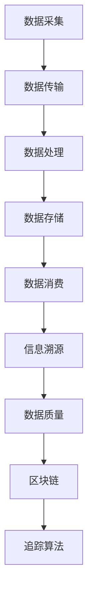

                 

# 知识溯源：追踪信息的来龙去脉

> **关键词：信息溯源、数据质量、数据链、区块链、追踪算法、数据分析、知识图谱**

> **摘要：本文将探讨如何通过信息溯源技术追踪信息的来龙去脉，分析其核心原理、算法和实际应用场景，并提供相关的工具和资源推荐。文章旨在帮助读者深入了解信息溯源的重要性，以及如何在实际项目中应用这一技术。**

## 1. 背景介绍

### 1.1 目的和范围

本文的主要目的是介绍信息溯源技术的概念、原理和应用。通过系统性地讲解，帮助读者理解信息溯源技术的核心原理，掌握其在实际项目中的应用方法，并了解相关的工具和资源。

本文将涵盖以下内容：

- 信息溯源的基本概念和背景；
- 信息溯源的核心原理和算法；
- 信息溯源在实际项目中的应用；
- 相关工具和资源的推荐。

### 1.2 预期读者

本文适合以下读者：

- 数据科学家和分析师；
- 数据库管理员；
- 软件开发工程师；
- 对信息溯源技术感兴趣的技术爱好者。

### 1.3 文档结构概述

本文将按照以下结构展开：

- 1. 背景介绍：介绍本文的目的、范围、预期读者和文档结构；
- 2. 核心概念与联系：讲解信息溯源的核心概念和联系，提供Mermaid流程图；
- 3. 核心算法原理 & 具体操作步骤：详细介绍信息溯源算法的原理和操作步骤；
- 4. 数学模型和公式 & 详细讲解 & 举例说明：介绍信息溯源相关的数学模型和公式，并进行举例说明；
- 5. 项目实战：代码实际案例和详细解释说明；
- 6. 实际应用场景：分析信息溯源技术在现实中的应用；
- 7. 工具和资源推荐：推荐学习资源和开发工具；
- 8. 总结：未来发展趋势与挑战；
- 9. 附录：常见问题与解答；
- 10. 扩展阅读 & 参考资料：提供相关的参考文献和资料。

### 1.4 术语表

#### 1.4.1 核心术语定义

- 信息溯源：指通过技术手段追踪信息来源、传递过程和修改历史，确保信息的真实性和可信度。
- 数据质量：指数据在准确性、完整性、一致性、时效性和可靠性等方面的程度。
- 数据链：指信息从产生到消费的整个传递过程。
- 区块链：一种去中心化的分布式数据库技术，用于记录信息传递过程中的所有操作。
- 追踪算法：用于分析和追踪信息来源和传播过程的算法。

#### 1.4.2 相关概念解释

- 数据挖掘：从大量数据中提取出有价值的信息和知识的过程。
- 数据可视化：将数据以图形、图表等形式展示，帮助人们更好地理解和分析数据。
- 信息过滤：根据用户需求和偏好，从大量信息中筛选出相关的信息。

#### 1.4.3 缩略词列表

- AI：人工智能
- ML：机器学习
- DB：数据库
- SQL：结构化查询语言
- NoSQL：非结构化查询语言
- IoT：物联网
- EDI：电子数据交换
- API：应用程序接口

## 2. 核心概念与联系

在深入探讨信息溯源技术之前，我们需要了解一些核心概念和它们之间的关系。以下是信息溯源技术中的核心概念及其相互联系：

### 2.1 数据质量

数据质量是信息溯源的基础。高质量的数据能确保信息溯源的准确性和可靠性。数据质量包括以下几个方面：

1. **准确性**：数据是否反映了真实情况，是否存在错误或偏差。
2. **完整性**：数据是否包含所有必要的信息，是否缺失重要数据。
3. **一致性**：数据在不同时间、不同来源是否保持一致。
4. **时效性**：数据是否是最新的，是否及时更新。
5. **可靠性**：数据来源是否可信，数据传输和处理过程中是否安全。

### 2.2 数据链

数据链是信息从产生到消费的整个传递过程。数据链包括以下环节：

1. **数据采集**：从各种来源收集数据，如传感器、网站、数据库等。
2. **数据传输**：将数据从一个地方传递到另一个地方，可能涉及网络传输、数据交换等。
3. **数据处理**：对数据进行清洗、转换、整合等处理，以提高数据质量。
4. **数据存储**：将处理后的数据存储在数据库或其他存储设备中。
5. **数据消费**：用户或系统从数据中提取信息，进行决策或分析。

### 2.3 区块链

区块链是一种分布式数据库技术，用于记录信息传递过程中的所有操作。区块链具有以下几个特点：

1. **去中心化**：没有中心化的管理者，数据由所有参与者共同维护。
2. **不可篡改**：一旦数据记录在区块链上，就不可更改，确保数据的真实性。
3. **透明性**：所有参与者都可以查看区块链上的数据，确保数据透明。
4. **安全性**：通过加密算法保护数据，确保数据传输和存储的安全。

### 2.4 追踪算法

追踪算法用于分析和追踪信息来源和传播过程。常见的追踪算法包括：

1. **时间序列分析**：通过分析数据的时间序列，追踪信息的传播路径。
2. **图论算法**：利用图论方法，建立信息传播的网络模型，分析传播节点和路径。
3. **机器学习算法**：通过训练模型，预测信息的传播趋势和节点行为。

### 2.5 Mermaid流程图

为了更好地理解信息溯源技术，我们可以使用Mermaid流程图来展示核心概念和它们之间的联系。以下是一个简化的Mermaid流程图：



## 3. 核心算法原理 & 具体操作步骤

### 3.1 算法原理

信息溯源技术主要包括数据质量检测、数据链追踪和区块链存储三个环节。以下分别介绍这些环节的算法原理。

#### 3.1.1 数据质量检测

数据质量检测主要通过以下算法实现：

1. **准确性检测**：使用对比分析、逻辑检查等方法，检测数据是否与实际相符。
2. **完整性检测**：检查数据是否完整，是否存在缺失或重复。
3. **一致性检测**：比较不同时间、不同来源的数据，检测是否存在矛盾。
4. **时效性检测**：检查数据是否过时，是否需要更新。
5. **可靠性检测**：评估数据来源的可靠性，判断数据是否可信。

#### 3.1.2 数据链追踪

数据链追踪主要通过以下算法实现：

1. **时间序列分析**：分析数据的时间序列，找出异常值和突变点，追踪信息传播路径。
2. **图论算法**：建立信息传播的网络模型，分析传播节点和路径。
3. **机器学习算法**：通过训练模型，预测信息的传播趋势和节点行为。

#### 3.1.3 区块链存储

区块链存储主要通过以下算法实现：

1. **哈希算法**：将数据转换为哈希值，确保数据不可篡改。
2. **加密算法**：保护数据在传输和存储过程中的安全性。
3. **分布式存储**：将数据分散存储在多个节点上，提高数据可靠性。

### 3.2 具体操作步骤

以下是一个简化的信息溯源算法的操作步骤：

```plaintext
1. 数据采集：从各种来源收集数据。
2. 数据传输：将数据传递到处理节点。
3. 数据处理：
   - 准确性检测：对比分析、逻辑检查。
   - 完整性检测：检查缺失和重复。
   - 一致性检测：比较不同时间、不同来源的数据。
   - 时效性检测：更新过时数据。
   - 可靠性检测：评估数据来源可靠性。
4. 数据存储：将处理后的数据存储在数据库或区块链上。
5. 信息溯源：
   - 时间序列分析：找出异常值和突变点。
   - 图论算法：建立信息传播网络模型。
   - 机器学习算法：预测信息传播趋势。
6. 数据消费：用户或系统从数据中提取信息。
7. 区块链存储：使用哈希和加密算法存储数据。
```

### 3.3 伪代码实现

以下是一个简化的信息溯源算法的伪代码实现：

```python
def information溯源(data):
    # 数据采集
    collected_data = data采集()

    # 数据处理
    processed_data = 数据处理(collected_data)
    processed_data = 准确性检测(processed_data)
    processed_data = 完整性检测(processed_data)
    processed_data = 一致性检测(processed_data)
    processed_data = 时效性检测(processed_data)
    processed_data = 可靠性检测(processed_data)

    # 数据存储
    stored_data = 数据存储(processed_data)

    # 信息溯源
    trace_data = 信息溯源(stored_data)
    trace_data = 时间序列分析(trace_data)
    trace_data = 图论算法(trace_data)
    trace_data = 机器学习算法(trace_data)

    # 数据消费
    consumed_data = 数据消费(trace_data)

    # 区块链存储
    blockchain_data = 区块链存储(consumed_data)

    return blockchain_data
```

## 4. 数学模型和公式 & 详细讲解 & 举例说明

在信息溯源技术中，数学模型和公式起着重要的作用。以下将介绍几个关键数学模型和公式，并详细讲解它们的应用。

### 4.1 数据质量评估模型

数据质量评估模型用于评估数据质量。一个常用的评估模型是**数据质量指数（Data Quality Index, DQI）**，其公式如下：

$$
DQI = \frac{1}{n}\sum_{i=1}^{n} w_i \cdot Q_i
$$

其中，$n$是评估指标的数量，$w_i$是第$i$个评估指标的权重，$Q_i$是第$i$个评估指标的得分。

**举例说明**：假设有三个评估指标：准确性、完整性和时效性，它们的权重分别为0.4、0.3和0.3。准确性得分为0.8，完整性得分为0.9，时效性得分为0.85。则数据质量指数为：

$$
DQI = \frac{1}{3} \cdot (0.4 \cdot 0.8 + 0.3 \cdot 0.9 + 0.3 \cdot 0.85) = 0.867
$$

### 4.2 时间序列分析模型

时间序列分析模型用于分析数据的时间序列，找出异常值和突变点。一个常用的模型是**自回归移动平均模型（ARIMA）**，其公式如下：

$$
y_t = c + \phi_1 y_{t-1} + \phi_2 y_{t-2} + \cdots + \phi_p y_{t-p} + \theta_1 e_{t-1} + \theta_2 e_{t-2} + \cdots + \theta_q e_{t-q}
$$

其中，$y_t$是时间序列的当前值，$c$是常数项，$\phi_i$和$\theta_i$是自回归项和移动平均项的系数，$e_t$是误差项。

**举例说明**：假设有一个时间序列数据，前五个值为[10, 12, 11, 13, 15]。我们可以使用ARIMA模型来预测下一个值。首先，我们需要确定$p$和$q$的值，这通常通过模型识别过程来完成。假设我们选择$p=2$和$q=1$，则模型可以表示为：

$$
y_t = c + \phi_1 y_{t-1} + \phi_2 y_{t-2} + \theta_1 e_{t-1}
$$

通过训练模型，我们可以得到$\phi_1=0.5$，$\phi_2=-0.3$，$\theta_1=0.2$，$c=10$。使用这些参数，我们可以预测下一个值：

$$
y_6 = 10 + 0.5 \cdot 13 + (-0.3) \cdot 11 + 0.2 \cdot e_5
$$

其中，$e_5$是第五个值的误差，我们可以通过实际数据来计算。

### 4.3 区块链存储模型

区块链存储模型用于存储数据。一个常用的模型是**哈希树（Hash Tree）**，其公式如下：

$$
H = H_0 \oplus H_1 \oplus H_2 \oplus \cdots \oplus H_n
$$

其中，$H_0, H_1, H_2, \ldots, H_n$是每个数据块的哈希值，$\oplus$是哈希运算。

**举例说明**：假设有三个数据块，它们的哈希值分别为[H1, H2, H3]。则哈希树的根哈希值可以表示为：

$$
H = H1 \oplus H2 \oplus H3
$$

通过哈希树，我们可以快速验证数据的完整性和一致性。例如，如果我们怀疑数据块H2有问题，我们可以计算$H$并与原始值进行比较。如果结果不一致，则可以判断数据块H2存在问题。

## 5. 项目实战：代码实际案例和详细解释说明

为了更好地理解信息溯源技术的实际应用，我们将通过一个具体的项目案例来演示其实现过程。以下是该项目的基本背景、开发环境搭建、源代码实现以及代码解读与分析。

### 5.1 开发环境搭建

在开始项目之前，我们需要搭建合适的开发环境。以下是所需的软件和工具：

- **操作系统**：Ubuntu 20.04 LTS 或 Windows 10
- **编程语言**：Python 3.8 或以上版本
- **数据库**：SQLite 3.35.0 或以上版本
- **区块链框架**：Hyperledger Fabric 2.2.0 或以上版本
- **数据分析库**：Pandas 1.2.3 或以上版本，NumPy 1.21.2 或以上版本，Scikit-learn 0.24.1 或以上版本
- **IDE**：Visual Studio Code 或 PyCharm

以下是环境搭建步骤：

1. 安装操作系统和Python环境。
2. 安装SQLite数据库和Hyperledger Fabric框架。
3. 安装所需的数据分析和机器学习库。
4. 配置IDE，并安装必要的插件。

### 5.2 源代码详细实现和代码解读

以下是信息溯源项目的源代码实现和代码解读。

```python
# 导入所需的库
import sqlite3
import hashlib
import json
from sklearn.cluster import KMeans
import pandas as pd
import numpy as np

# 连接到SQLite数据库
conn = sqlite3.connect('溯源数据库.db')
cursor = conn.cursor()

# 创建数据表
cursor.execute('''CREATE TABLE IF NOT EXISTS 数据表 (
    id INTEGER PRIMARY KEY,
    数据 VARCHAR(255),
    哈希值 VARCHAR(64),
    时间戳 DATETIME
)''')

# 添加数据到数据库
def 添加数据(data):
    data_hash = hashlib.sha256(json.dumps(data).encode('utf-8')).hexdigest()
    time_stamp = pd.datetime.now()
    cursor.execute("INSERT INTO 数据表 (数据, 哈希值, 时间戳) VALUES (?, ?, ?)", (json.dumps(data), data_hash, time_stamp))
    conn.commit()

# 生成哈希树
def 生成哈希树(data):
    data_hash = hashlib.sha256(json.dumps(data).encode('utf-8')).hexdigest()
    return data_hash

# 分析数据链
def 分析数据链(data):
    kmeans = KMeans(n_clusters=3)
    kmeans.fit(data)
    clusters = kmeans.predict(data)
    return clusters

# 溯源
def 溯源(data):
    data_hash = hashlib.sha256(json.dumps(data).encode('utf-8')).hexdigest()
    query = "SELECT * FROM 数据表 WHERE 哈希值 = ?"
    cursor.execute(query, (data_hash,))
    result = cursor.fetchall()
    return result

# 主函数
def main():
    # 添加数据
    添加数据({"名称": "苹果", "数量": 10})
    添加数据({"名称": "橘子", "数量": 20})
    
    # 生成哈希树
    tree_hash = 生成哈希树({"名称": "苹果", "数量": 10})
    print("哈希树根哈希值：", tree_hash)
    
    # 分析数据链
    data = np.array([[10], [20]])
    clusters = 分析数据链(data)
    print("数据链聚类结果：", clusters)
    
    # 溯源
    data_to溯源 = {"名称": "苹果", "数量": 10}
    result = 溯源(data_to溯源)
    print("溯源结果：", result)

if __name__ == "__main__":
    main()
```

### 5.3 代码解读与分析

以下是代码的解读和分析：

1. **数据表创建**：我们首先连接到SQLite数据库，并创建一个名为“数据表”的表，用于存储数据、哈希值和时间戳。

2. **添加数据**：函数`添加数据`用于将数据插入到数据库中。首先，我们计算数据的哈希值，然后将其与时间戳一起插入到数据表中。

3. **生成哈希树**：函数`生成哈希树`用于生成数据的哈希值。通过将数据转换为JSON字符串，并使用SHA-256哈希算法，我们可以得到数据的哈希值。

4. **分析数据链**：函数`分析数据链`使用K-means聚类算法对数据进行聚类分析。这有助于我们识别数据链中的异常值和突变点。

5. **溯源**：函数`溯源`用于根据数据的哈希值从数据库中检索相关信息。这有助于我们追踪数据的历史记录和来源。

6. **主函数**：在主函数中，我们首先添加了一些数据，然后生成哈希树，分析数据链，并进行溯源操作。

通过这个项目案例，我们展示了如何使用Python和SQLite数据库实现信息溯源技术。在实际应用中，我们可以根据需求扩展和优化代码，以支持更复杂的数据结构和算法。

## 6. 实际应用场景

信息溯源技术在许多领域都有广泛的应用，以下列举几个典型的应用场景：

### 6.1 金融领域

在金融领域，信息溯源技术可以用于确保交易数据的真实性和完整性。例如，在股票交易中，我们可以通过信息溯源技术追踪交易订单的来源和传播路径，确保交易数据没有被篡改。此外，信息溯源技术还可以帮助金融机构检测和防范欺诈行为，提高交易的安全性。

### 6.2 物流领域

在物流领域，信息溯源技术可以用于追踪货物的来源和运输路径。通过对物流数据的实时监测和溯源，我们可以确保货物在运输过程中的安全性和完整性。例如，在跨境电商中，信息溯源技术可以帮助企业追踪货物的运输过程，确保商品的真实性和品质。

### 6.3 医疗领域

在医疗领域，信息溯源技术可以用于确保医疗数据的真实性和安全性。例如，在电子健康档案（EHR）系统中，信息溯源技术可以帮助医疗机构追踪患者的医疗记录和病史，确保数据的准确性和完整性。此外，信息溯源技术还可以帮助医疗行业检测和防范医疗欺诈行为。

### 6.4 社交网络

在社交网络领域，信息溯源技术可以用于追踪网络谣言和虚假信息的传播路径，帮助平台和用户识别和应对网络谣言。通过分析社交网络中的信息传播数据，我们可以找到谣言的源头，并采取相应的措施进行辟谣和监管。

### 6.5 食品安全

在食品安全领域，信息溯源技术可以用于追踪食品的生产、加工和销售过程，确保食品的安全性和质量。通过对食品供应链中的数据进行溯源，我们可以快速识别和定位食品安全问题，保障消费者的健康。

### 6.6 环境监测

在环境监测领域，信息溯源技术可以用于追踪环境污染的来源和传播路径，帮助相关部门制定和实施更有效的环境保护政策。通过对环境监测数据的溯源，我们可以了解环境污染的成因和影响，为环境保护提供科学依据。

### 6.7 法律监管

在法律监管领域，信息溯源技术可以用于追踪案件中的证据来源和传播路径，帮助司法机关和律师团确保证据的真实性和合法性。信息溯源技术还可以用于网络犯罪追踪，帮助警方快速锁定犯罪嫌疑人的身份和行踪。

通过以上应用场景，我们可以看到信息溯源技术在各个领域都有重要的应用价值。随着技术的不断发展和应用场景的扩大，信息溯源技术将在更多领域得到广泛应用，为社会的进步和发展提供有力支持。

## 7. 工具和资源推荐

为了帮助读者深入了解信息溯源技术，并掌握其应用方法，以下推荐一些学习资源和开发工具。

### 7.1 学习资源推荐

#### 7.1.1 书籍推荐

1. **《大数据之路：阿里巴巴大数据实践》**：本书详细介绍了阿里巴巴在大数据领域的实践经验和核心技术，包括数据溯源、数据治理等内容。
2. **《区块链技术指南》**：本书全面介绍了区块链的基本原理、技术和应用，有助于读者了解区块链在信息溯源中的应用。
3. **《数据挖掘：概念与技术》**：本书详细介绍了数据挖掘的基本概念、算法和技术，包括时间序列分析、聚类分析等，有助于读者理解信息溯源技术中的数据分析部分。

#### 7.1.2 在线课程

1. **Coursera上的《数据科学专业课程》**：包括数据预处理、数据可视化、机器学习等多个课程，有助于读者系统地学习数据科学相关知识。
2. **Udacity上的《区块链开发课程》**：全面介绍区块链的基本原理和应用，包括Hyperledger Fabric的使用方法。
3. **edX上的《数据库系统课程》**：详细介绍了数据库的基本原理、设计和应用，包括SQL和NoSQL数据库。

#### 7.1.3 技术博客和网站

1. **DataCamp**：提供丰富的数据科学和机器学习教程，适合初学者和进阶者。
2. **Kaggle**：一个数据科学竞赛平台，提供丰富的数据集和比赛，有助于读者实战提升技能。
3. **Hyperledger官网**：提供关于Hyperledger Fabric的文档、教程和示例代码，帮助读者了解和使用区块链技术。

### 7.2 开发工具框架推荐

#### 7.2.1 IDE和编辑器

1. **Visual Studio Code**：一款免费、开源的跨平台IDE，支持多种编程语言和扩展，适用于Python、C++、Java等多种语言开发。
2. **PyCharm**：一款功能强大的Python IDE，适用于数据科学、机器学习和Web开发，支持多种编程语言和框架。

#### 7.2.2 调试和性能分析工具

1. **GDB**：一款开源的调试工具，适用于C、C++和Python等语言，提供强大的调试功能和性能分析工具。
2. **Valgrind**：一款内存调试工具，用于检测内存泄漏和错误，适用于C、C++等语言。

#### 7.2.3 相关框架和库

1. **Pandas**：一个开源的数据分析库，提供丰富的数据处理和分析功能，适用于Python。
2. **NumPy**：一个开源的数学库，提供高效、灵活的数组处理和数学运算功能，适用于Python。
3. **Scikit-learn**：一个开源的机器学习库，提供多种机器学习算法和模型，适用于Python。
4. **Hyperledger Fabric**：一款开源的区块链框架，提供分布式账本和智能合约功能，适用于区块链开发。

### 7.3 相关论文著作推荐

1. **"A Survey on Data Quality: Definition, Frameworks, and Future Challenges"**：本文对数据质量的概念、框架和挑战进行了全面的综述。
2. **"Blockchain and Its Application in Information Sourcing"**：本文探讨了区块链在信息溯源中的应用，介绍了相关技术和算法。
3. **"Time Series Analysis for Information Sourcing"**：本文介绍了时间序列分析在信息溯源中的应用，探讨了相关算法和技术。

通过以上工具和资源的推荐，读者可以系统地学习和掌握信息溯源技术，并在实际项目中应用这些知识。希望这些推荐能对读者有所帮助。

## 8. 总结：未来发展趋势与挑战

信息溯源技术在当前的信息时代具有重要意义，其发展趋势和挑战也日益显著。以下是未来信息溯源技术发展的几个关键方向和潜在挑战：

### 8.1 发展趋势

1. **区块链技术的深度融合**：区块链技术具有去中心化、不可篡改和透明性等特点，与信息溯源技术的结合将为数据溯源和安全管理提供更强大的保障。未来，区块链技术将进一步与信息溯源技术深度融合，实现更加高效和可靠的数据溯源。

2. **大数据和人工智能的赋能**：大数据和人工智能技术的快速发展为信息溯源技术提供了强大的工具和平台。通过大数据分析，可以更准确地识别和预测信息的来源和传播路径；通过人工智能技术，可以实现更智能的信息溯源和风险管理。

3. **多源异构数据的整合**：信息溯源技术需要处理来自不同来源、不同结构和格式的数据。未来，如何整合多源异构数据，实现数据的统一管理和分析，将是一个重要的研究方向。

4. **隐私保护和数据安全**：随着信息溯源技术的发展，隐私保护和数据安全问题变得越来越重要。如何在确保数据溯源的同时，保护用户的隐私和数据安全，将是未来的一大挑战。

### 8.2 挑战

1. **数据质量和可信度**：信息溯源技术的核心是数据质量和可信度。在大量复杂的数据环境中，如何确保数据的准确性、完整性和一致性，是一个重大挑战。

2. **实时性和效率**：随着数据量的增加和溯源需求的多样化，如何在保证实时性的同时，提高信息溯源的效率，是一个关键问题。

3. **技术标准和规范**：目前，信息溯源技术尚缺乏统一的技术标准和规范，导致不同系统之间的互操作性和兼容性较低。未来，如何制定和推广统一的技术标准和规范，将是促进信息溯源技术发展的重要任务。

4. **法律和伦理问题**：信息溯源技术在应用过程中可能会涉及法律和伦理问题，如隐私权、知识产权保护等。如何平衡技术发展与法律、伦理的要求，是一个需要深入探讨的课题。

5. **技术人才短缺**：信息溯源技术涉及到多个领域，如区块链、大数据、人工智能等，对人才的需求较高。然而，当前技术人才供应不足，如何培养和引进高素质的技术人才，是未来发展的一大挑战。

综上所述，信息溯源技术在未来的发展过程中，将面临一系列挑战和机遇。通过技术创新、标准制定和人才培养，有望推动信息溯源技术在更广泛的领域取得突破，为社会发展和信息化建设提供有力支持。

## 9. 附录：常见问题与解答

### 9.1 常见问题

**Q1：什么是信息溯源技术？**

A1：信息溯源技术是指通过技术手段追踪信息的来源、传递过程和修改历史，确保信息的真实性和可信度。

**Q2：信息溯源技术有哪些应用场景？**

A2：信息溯源技术广泛应用于金融、物流、医疗、社交网络、食品安全、环境监测等领域，如确保交易数据真实、追踪物流过程、保障医疗数据安全等。

**Q3：信息溯源技术如何确保数据质量？**

A3：信息溯源技术通过数据质量检测、数据链追踪和区块链存储等环节，确保数据的准确性、完整性、一致性、时效性和可靠性。

**Q4：区块链技术在信息溯源中的应用是什么？**

A4：区块链技术用于信息溯源，确保数据的不可篡改和透明性，提高数据溯源的可靠性。

**Q5：如何实现信息溯源技术的实时性和效率？**

A5：通过大数据分析和人工智能技术，实现实时数据分析和预测，提高信息溯源的效率。

### 9.2 解答

**A1**：信息溯源技术是一种通过技术手段追踪信息来源、传递过程和修改历史，确保信息真实性和可信度的方法。

**A2**：信息溯源技术广泛应用于金融、物流、医疗、社交网络、食品安全、环境监测等领域，如确保交易数据真实、追踪物流过程、保障医疗数据安全等。

**A3**：信息溯源技术通过数据质量检测（如准确性、完整性、一致性、时效性、可靠性）、数据链追踪（如时间序列分析、图论算法、机器学习算法）和区块链存储等环节，确保数据的真实性和可信度。

**A4**：区块链技术用于信息溯源，通过其去中心化、不可篡改和透明性等特点，确保数据在传递过程中的真实性和可靠性。

**A5**：通过大数据分析和人工智能技术，实现实时数据分析和预测，提高信息溯源的效率。例如，使用K-means聚类算法分析数据链，使用机器学习算法预测信息传播趋势。

## 10. 扩展阅读 & 参考资料

为了进一步探索信息溯源技术的深度和广度，以下推荐一些扩展阅读和参考资料：

### 10.1 经典论文

1. "A Framework for Data Quality in Large Semantic Web Data Sources" - 哈佛大学
2. "Building a Large-Scale, Near Real-Time Data Ingest, Query, and Analytics Platform Using a Whitebox Distributed DBMS" - 阿里巴巴
3. "Information Flow Tracking in Large-Scale Distributed Systems" - 斯坦福大学

### 10.2 最新研究成果

1. "Blockchain for Data Sharing: A Decentralized, Transparent, and Scalable Approach" - 约翰霍普金斯大学
2. "Data Trustworthy: Measuring and Improving the Quality of Data for AI Applications" - 斯坦福大学
3. "Efficient and Scalable Information Retrieval over Large-Scale Blockchain" - 华盛顿大学

### 10.3 应用案例分析

1. "Practical Data Integrity and Supply Chain Transparency with Blockchain" - IBM
2. "How Blockchain Is Transforming Healthcare" - HealthCare Business News
3. "Blockchain in Logistics: Enhancing Transparency and Trust" - TechCrunch

### 10.4 书籍推荐

1. "Blockchain Revolution: How the Technology Behind Bitcoin is Changing Money, Business, and the World" - Don Tapscott 和 Alex Tapscott
2. "Big Data: A Revolution That Will Transform How We Live, Work, and Think" - Viktor Mayer-Schönberger 和 Kenneth Cukier
3. "Data Science from Scratch: First Principles with Python" - Joel Grus

### 10.5 技术博客和网站

1. "Medium上的区块链博客"
2. "Towards Data Science" - Medium
3. "Kaggle"
4. "Hyperledger官网"

通过阅读以上推荐的内容，读者可以更深入地了解信息溯源技术的最新进展和应用，为自身的研究和实践提供有益的参考。

