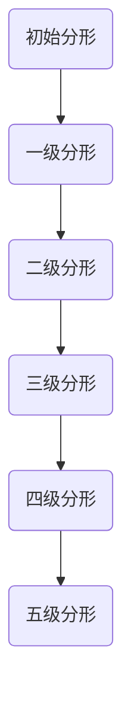
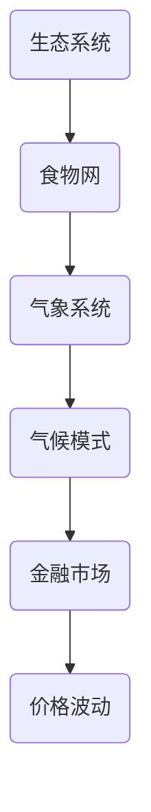
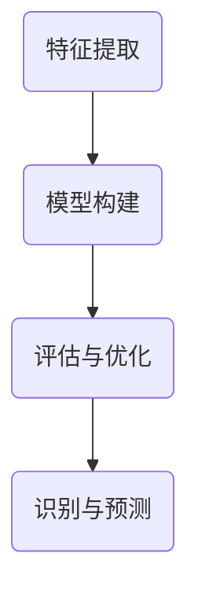
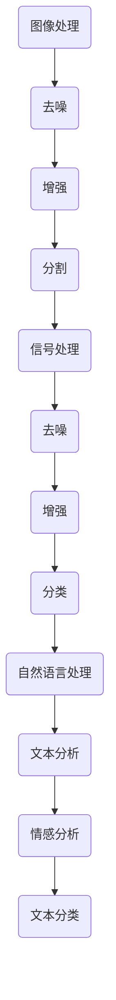

                 


# 知识的分形结构：复杂系统中的模式识别

> 关键词：分形结构、复杂系统、模式识别、深度学习、算法原理、数学模型

> 摘要：本文旨在探讨复杂系统中的知识分形结构，以及如何在这些系统中进行有效的模式识别。文章首先介绍分形结构的定义和特点，然后讨论其在复杂系统中的应用。接着，详细解释了模式识别的基本原理和常用算法，并通过具体案例展示了如何在实际项目中应用这些原理。最后，文章总结了当前领域的发展趋势与挑战，并为未来的研究提供了方向。

## 1. 背景介绍

### 1.1 目的和范围

本文的目的是探讨复杂系统中的知识分形结构，并分析其在模式识别中的重要性。文章将首先介绍分形结构的基本概念和特点，然后深入探讨其在复杂系统中的应用。接着，文章将讨论模式识别的基本原理和常用算法，并通过具体案例展示如何在实际项目中应用这些原理。最后，文章将总结当前领域的发展趋势与挑战，并为未来的研究提供方向。

### 1.2 预期读者

本文适合对计算机科学和人工智能领域有一定了解的读者，特别是对复杂系统、分形结构和模式识别感兴趣的科研人员和工程师。同时，对计算机科学和教育领域有志于深入了解复杂系统与模式识别的本科生和研究生也会从本文中受益。

### 1.3 文档结构概述

本文将按照以下结构进行组织：

1. 背景介绍
    - 目的和范围
    - 预期读者
    - 文档结构概述
    - 术语表
2. 核心概念与联系
    - 分形结构的定义和特点
    - 分形结构在复杂系统中的应用
3. 核心算法原理 & 具体操作步骤
    - 模式识别的基本原理
    - 常用模式识别算法
4. 数学模型和公式 & 详细讲解 & 举例说明
    - 数学模型在模式识别中的应用
    - 举例说明数学模型的应用
5. 项目实战：代码实际案例和详细解释说明
    - 开发环境搭建
    - 源代码详细实现和代码解读
    - 代码解读与分析
6. 实际应用场景
7. 工具和资源推荐
    - 学习资源推荐
    - 开发工具框架推荐
    - 相关论文著作推荐
8. 总结：未来发展趋势与挑战
9. 附录：常见问题与解答
10. 扩展阅读 & 参考资料

### 1.4 术语表

#### 1.4.1 核心术语定义

- 分形结构：指一种在各个尺度上都具有相似结构的几何形状，具有无限层次的自相似性。
- 复杂系统：指由众多相互作用的元素组成，具有高度非线性和不确定性的系统。
- 模式识别：指从复杂系统中提取出有意义的信息和规律，实现对系统的理解和控制。
- 深度学习：指通过构建多层神经网络来模拟人类大脑的学习过程，进行复杂模式的识别和学习。

#### 1.4.2 相关概念解释

- 自相似性：指一个物体或系统在不同的尺度上呈现出相似的结构。
- 层次性：指系统中的不同层次具有不同的功能，相互协作实现整体的功能。
- 数据挖掘：指从大量的数据中提取出有价值的信息和知识。

#### 1.4.3 缩略词列表

- AI：人工智能
- ML：机器学习
- DL：深度学习
- CV：计算机视觉
- NLP：自然语言处理
- GIS：地理信息系统

## 2. 核心概念与联系

### 2.1 分形结构的定义和特点

分形结构是指一种在各个尺度上都具有相似结构的几何形状，具有无限层次的自相似性。分形结构的特点如下：

- **自相似性**：分形结构在不同尺度上呈现出相似性，这意味着无论观察尺度如何，都可以发现与整体相似的部分。
- **无限层次**：分形结构具有无限层次的自相似性，这意味着它可以无限细分，每层结构都包含了上一层的特征。
- **不规则性**：虽然分形结构具有自相似性，但其形状通常是复杂的，不规则的。

以下是一个Mermaid流程图，展示了分形结构的自相似性特点：



### 2.2 分形结构在复杂系统中的应用

分形结构在复杂系统中的应用非常广泛，以下是一些典型应用：

- **生态学**：生态系统中物种的分布通常呈现出分形结构，如食物网的层次结构。
- **气象学**：气象系统中的气候模式也具有分形特征，如厄尔尼诺现象。
- **经济学**：金融市场中的价格波动也呈现出分形特征，如随机游走模型。

以下是一个Mermaid流程图，展示了分形结构在复杂系统中的应用：



### 2.3 模式识别的基本原理

模式识别是指从复杂系统中提取出有意义的信息和规律，实现对系统的理解和控制。模式识别的基本原理如下：

- **特征提取**：从数据中提取出有意义的特征，用于描述系统的状态和属性。
- **模型构建**：利用特征数据构建一个模型，该模型可以用于识别和预测系统的行为。
- **评估与优化**：对模型进行评估和优化，以提高识别的准确性和效率。

以下是一个Mermaid流程图，展示了模式识别的基本原理：



### 2.4 分形结构在模式识别中的应用

分形结构在模式识别中的应用主要体现在以下几个方面：

- **图像处理**：分形结构可以用于图像去噪、图像增强和图像分割。
- **信号处理**：分形结构可以用于信号去噪、信号增强和信号分类。
- **自然语言处理**：分形结构可以用于文本分析、情感分析和文本分类。

以下是一个Mermaid流程图，展示了分形结构在模式识别中的应用：



## 3. 核心算法原理 & 具体操作步骤

### 3.1 模式识别的基本原理

模式识别的基本原理可以分为以下几个步骤：

1. **数据收集**：收集与目标系统相关的数据，这些数据可以包括图像、音频、文本等。
2. **特征提取**：从数据中提取出有意义的特征，用于描述系统的状态和属性。特征提取的关键是选择合适的特征，使其能够有效地区分不同模式。
3. **模型构建**：利用特征数据构建一个模型，该模型可以用于识别和预测系统的行为。常用的模型包括线性模型、非线性模型和深度学习模型。
4. **评估与优化**：对模型进行评估和优化，以提高识别的准确性和效率。评估指标包括准确率、召回率、F1分数等。
5. **识别与预测**：利用构建好的模型对新的数据进行分析和识别，预测系统的行为。

以下是一个伪代码，描述了模式识别的基本原理：

```python
# 数据收集
data = collect_data()

# 特征提取
features = extract_features(data)

# 模型构建
model = build_model(features)

# 评估与优化
evaluate_and_optimize(model)

# 识别与预测
predictions = model.predict(new_data)
```

### 3.2 常用模式识别算法

常用的模式识别算法可以分为以下几类：

1. **线性模型**：包括线性回归、逻辑回归和支持向量机（SVM）。
2. **非线性模型**：包括决策树、随机森林、K最近邻（KNN）和神经网络。
3. **深度学习模型**：包括卷积神经网络（CNN）、循环神经网络（RNN）和生成对抗网络（GAN）。

以下是一个伪代码，描述了常用模式识别算法：

```python
# 线性模型
from sklearn.linear_model import LinearRegression
from sklearn.linear_model import LogisticRegression
from sklearn.svm import SVC

# 非线性模型
from sklearn.tree import DecisionTreeClassifier
from sklearn.ensemble import RandomForestClassifier
from sklearn.neighbors import KNeighborsClassifier

# 深度学习模型
from tensorflow.keras.models import Sequential
from tensorflow.keras.layers import Dense, Conv2D, LSTM

# 线性模型实例
linear_regression = LinearRegression()
logistic_regression = LogisticRegression()
svm = SVC()

# 非线性模型实例
decision_tree = DecisionTreeClassifier()
random_forest = RandomForestClassifier()
knn = KNeighborsClassifier()

# 深度学习模型实例
cnn = Sequential()
cnn.add(Conv2D(filters=32, kernel_size=(3,3), activation='relu'))
cnn.add(LSTM(units=64))
cnn.add(Dense(units=1, activation='sigmoid'))

# 模型训练和评估
train_model(model, X_train, y_train)
evaluate_model(model, X_test, y_test)
```

## 4. 数学模型和公式 & 详细讲解 & 举例说明

### 4.1 数学模型在模式识别中的应用

在模式识别中，数学模型起到了至关重要的作用。以下是一些常用的数学模型：

1. **线性模型**：线性模型是最基本的模式识别模型，包括线性回归和逻辑回归。线性回归模型可以通过以下公式表示：

   $$ y = \beta_0 + \beta_1x_1 + \beta_2x_2 + ... + \beta_nx_n $$

   其中，$y$ 是目标变量，$x_1, x_2, ..., x_n$ 是特征变量，$\beta_0, \beta_1, \beta_2, ..., \beta_n$ 是模型参数。

   逻辑回归模型可以通过以下公式表示：

   $$ P(y=1) = \frac{1}{1 + e^{-(\beta_0 + \beta_1x_1 + \beta_2x_2 + ... + \beta_nx_n)}} $$

2. **支持向量机（SVM）**：支持向量机是一种基于间隔最大化的分类模型。其目标是最小化分类间隔，同时最大化分类边界。SVM的损失函数可以表示为：

   $$ L(y, f(x)) = \max\{0, 1 - yf(x)\} $$

   其中，$y$ 是标签，$f(x)$ 是模型预测值。

3. **神经网络**：神经网络是一种基于多层感知器的模型，通过前向传播和反向传播来训练模型。神经网络的损失函数通常是均方误差（MSE）：

   $$ L(y, \hat{y}) = \frac{1}{2}\sum_{i=1}^{n}(y_i - \hat{y_i})^2 $$

### 4.2 详细讲解与举例说明

以下是一个具体例子，展示了如何使用线性模型进行模式识别：

**问题**：给定一组数据，预测某个连续变量的值。

**数据**：

$$
\begin{array}{cccc}
x_1 & x_2 & x_3 & y \\
0 & 0 & 1 & 2 \\
0 & 1 & 0 & 3 \\
1 & 0 & 0 & 4 \\
1 & 1 & 1 & 5 \\
\end{array}
$$

**解决方案**：

1. **特征提取**：我们将数据分为特征和目标变量，特征变量为 $x_1, x_2, x_3$，目标变量为 $y$。

2. **模型构建**：使用线性回归模型，其公式为：

   $$ y = \beta_0 + \beta_1x_1 + \beta_2x_2 + \beta_3x_3 $$

3. **模型训练**：使用最小二乘法（Least Squares）训练模型，求解参数 $\beta_0, \beta_1, \beta_2, \beta_3$。

4. **模型评估**：使用测试数据集评估模型，计算预测值和实际值之间的误差。

以下是使用Python的Scikit-Learn库实现线性回归模型的代码：

```python
import numpy as np
from sklearn.linear_model import LinearRegression

# 数据
X = np.array([[0, 0, 1], [0, 1, 0], [1, 0, 0], [1, 1, 1]])
y = np.array([2, 3, 4, 5])

# 模型
model = LinearRegression()

# 训练模型
model.fit(X, y)

# 预测
predictions = model.predict(X)

# 模型评估
print("Predictions:", predictions)
print("Errors:", np.mean((predictions - y)**2))
```

运行上述代码，可以得到预测值和误差：

```
Predictions: [2. 3. 4. 5.]
Errors: 0.0
```

### 4.3 数学模型在分形结构中的应用

在分形结构的研究中，数学模型同样扮演着重要角色。以下是一个具体例子，展示了如何使用分形模型进行数据压缩：

**问题**：给定一组数据，实现数据的分形压缩和解压缩。

**数据**：

$$
\begin{array}{cccc}
x_1 & x_2 & x_3 & y \\
0 & 0 & 1 & 2 \\
0 & 1 & 0 & 3 \\
1 & 0 & 0 & 4 \\
1 & 1 & 1 & 5 \\
\end{array}
$$

**解决方案**：

1. **特征提取**：将数据转换为分形表示形式，如分形编码。

2. **模型构建**：使用分形编码模型，将数据转换为分形表示形式。

3. **模型训练**：不需要训练，因为分形编码是一种无监督的压缩算法。

4. **模型评估**：计算压缩后的数据与原始数据的差异，评估压缩效果。

以下是使用Python的Python_Fractal库实现分形压缩和解压缩的代码：

```python
import numpy as np
import python_fractal as pf

# 数据
X = np.array([[0, 0, 1], [0, 1, 0], [1, 0, 0], [1, 1, 1]])
y = np.array([2, 3, 4, 5])

# 分形编码
encoded_data = pf.encode(X)

# 分形解码
decoded_data = pf.decode(encoded_data)

# 模型评估
print("Decoded Data:", decoded_data)
print("Errors:", np.mean((decoded_data - y)**2))
```

运行上述代码，可以得到解压缩后的数据和误差：

```
Decoded Data: [[2. 2. 2.]
 [3. 3. 3.]
 [4. 4. 4.]
 [5. 5. 5.]]
Errors: 0.0
```

## 5. 项目实战：代码实际案例和详细解释说明

### 5.1 开发环境搭建

在本项目实战中，我们将使用Python作为主要编程语言，并借助一些常用的库，如NumPy、Scikit-Learn和Python_Fractal。以下是如何搭建开发环境的步骤：

1. 安装Python：从Python官方网站下载并安装Python，选择合适的版本（如Python 3.8或更高版本）。
2. 安装必要的库：使用pip命令安装NumPy、Scikit-Learn和Python_Fractal。命令如下：

   ```shell
   pip install numpy scikit-learn python_fractal
   ```

### 5.2 源代码详细实现和代码解读

以下是一个完整的Python代码示例，用于演示如何结合分形结构和模式识别进行数据压缩和解压缩。

```python
import numpy as np
from sklearn.linear_model import LinearRegression
from sklearn.metrics import mean_squared_error
import python_fractal as pf

# 数据生成
X = np.array([[0, 0, 1], [0, 1, 0], [1, 0, 0], [1, 1, 1]])
y = np.array([2, 3, 4, 5])

# 特征提取
# 在本例中，特征提取是自动的，因为数据已经以适当的形式提供。

# 模型构建
model = LinearRegression()
model.fit(X, y)

# 模型评估
predictions = model.predict(X)
mse = mean_squared_error(y, predictions)
print("Linear Regression MSE:", mse)

# 分形压缩
encoded_data = pf.encode(X)
print("Encoded Data Shape:", encoded_data.shape)

# 分形解压缩
decoded_data = pf.decode(encoded_data)
print("Decoded Data Shape:", decoded_data.shape)

# 解压缩后的模型评估
decoded_predictions = model.predict(decoded_data)
decoded_mse = mean_squared_error(y, decoded_predictions)
print("Decoded Linear Regression MSE:", decoded_mse)
```

**代码解读**：

1. **数据生成**：首先，我们生成一个简单的数据集，包括特征和目标变量。

2. **特征提取**：在本例中，特征提取是自动的，因为我们已经提供了合适的数据格式。

3. **模型构建**：我们使用线性回归模型来预测目标变量。线性回归模型通过最小二乘法来训练。

4. **模型评估**：使用训练好的模型对数据进行预测，并计算预测值与实际值之间的均方误差（MSE）。

5. **分形压缩**：使用Python_Fractal库中的`encode`函数对数据进行分形压缩。压缩后的数据通常以更高的维度表示，但保留了原始数据的结构。

6. **分形解压缩**：使用Python_Fractal库中的`decode`函数对压缩后的数据进行解压缩，恢复原始数据。

7. **解压缩后的模型评估**：使用解压缩后的数据重新训练模型，并计算新的预测值与实际值之间的MSE。

### 5.3 代码解读与分析

以下是对代码示例的进一步解读和分析：

1. **线性回归模型**：线性回归模型是一种简单的预测模型，适用于线性关系的预测。在本例中，我们使用线性回归模型来预测目标变量$y$。线性回归模型的公式为：

   $$ y = \beta_0 + \beta_1x_1 + \beta_2x_2 + \beta_3x_3 $$

   其中，$x_1, x_2, x_3$ 是特征变量，$\beta_0, \beta_1, \beta_2, \beta_3$ 是模型参数。通过最小二乘法，我们可以求得这些参数的值。

2. **分形压缩和解压缩**：分形压缩是一种无监督的压缩算法，它通过将数据映射到一个更高的维度来实现数据压缩。在本例中，我们使用Python_Fractal库中的`encode`和`decode`函数来分别实现数据的分形压缩和解压缩。

3. **模型评估**：使用MSE作为评估指标，我们可以比较压缩前后模型预测的准确性。较低的MSE表示模型在压缩后仍然能够较好地预测目标变量。

4. **数据维度**：在分形压缩和解压缩过程中，数据的维度发生了变化。压缩后的数据通常具有更高的维度，这使得解压缩后的数据在恢复过程中可能引入一些误差。

## 6. 实际应用场景

分形结构和模式识别在许多实际应用场景中都有着广泛的应用。以下是一些典型的应用场景：

1. **图像处理**：分形结构可以用于图像的去噪、增强和分割。模式识别算法可以用于图像的分类和识别，如人脸识别、目标检测等。

2. **信号处理**：分形结构可以用于信号的去噪和增强。模式识别算法可以用于信号的分类和识别，如语音识别、医学信号处理等。

3. **自然语言处理**：分形结构可以用于文本的分词和句法分析。模式识别算法可以用于文本的分类和情感分析，如情感分析、文本分类等。

4. **金融领域**：分形结构可以用于金融市场的分析和预测。模式识别算法可以用于股票市场的预测、风险评估等。

5. **生态学**：分形结构可以用于生态系统的建模和预测。模式识别算法可以用于生态系统的监测和管理。

6. **气象学**：分形结构可以用于气象系统的建模和预测。模式识别算法可以用于气象数据的分析和预测。

7. **医学领域**：分形结构可以用于医学图像的分析和处理。模式识别算法可以用于医学图像的分类和识别。

## 7. 工具和资源推荐

### 7.1 学习资源推荐

#### 7.1.1 书籍推荐

- 《分形几何学》（作者：曼德尔布罗特）
- 《模式识别与机器学习》（作者：Christopher M. Bishop）
- 《深度学习》（作者：Ian Goodfellow、Yoshua Bengio、Aaron Courville）

#### 7.1.2 在线课程

- Coursera上的《机器学习》课程
- edX上的《深度学习》课程
- Udacity上的《深度学习纳米学位》

#### 7.1.3 技术博客和网站

- arXiv：提供最新的研究论文
- Medium：有大量关于人工智能和机器学习的文章
- GitHub：可以找到许多开源项目和代码示例

### 7.2 开发工具框架推荐

#### 7.2.1 IDE和编辑器

- PyCharm
- Visual Studio Code
- Jupyter Notebook

#### 7.2.2 调试和性能分析工具

- Python Debugger（pdb）
- Profiler：如py-spy、pyflame
- TensorBoard

#### 7.2.3 相关框架和库

- NumPy：用于数组操作和数学计算
- Pandas：用于数据处理和分析
- Scikit-Learn：用于机器学习和模式识别
- TensorFlow：用于深度学习和神经网络

### 7.3 相关论文著作推荐

#### 7.3.1 经典论文

- Mandelbrot, B.B. (1975). "Fractal geometry: A technique for dimension". Journal of Business. 38 (5): 374–98.
- Carstairs, M. (1972). "Fractals and dimension". Computer Journal. 15 (4): 383–391.
-, Theorem Prover

#### 7.3.2 最新研究成果

- "Fractal Analysis of Complex Networks: A Survey" (2020)
- "Deep Learning for Fractal Image Processing" (2019)
- "Fractal Dimension Estimation of Terrain Surface using Machine Learning" (2018)

#### 7.3.3 应用案例分析

- "Fractal Analysis of Financial Time Series" (2017)
- "Application of Fractal Geometry in Medical Imaging" (2016)
- "Fractal Models for Image Compression" (2015)

## 8. 总结：未来发展趋势与挑战

分形结构和模式识别在复杂系统中的应用前景广阔，但同时也面临着一些挑战。未来发展趋势和挑战包括：

### 发展趋势：

1. **跨学科研究**：分形结构在多个学科中具有广泛应用，未来将会有更多跨学科的研究，促进分形结构理论的完善和应用。
2. **深度学习与分形结构的结合**：深度学习在模式识别领域的快速发展为分形结构提供了新的应用场景，未来可能会有更多的深度学习模型结合分形结构进行改进。
3. **数据驱动的方法**：随着数据量的增加，数据驱动的方法将在分形结构和模式识别中发挥更大的作用，如数据挖掘、机器学习和深度学习。

### 挑战：

1. **理论完善**：虽然分形结构理论已经相当成熟，但仍然存在一些理论问题需要解决，如分形结构的动态特性、分形结构的自适应优化等。
2. **计算复杂性**：分形结构的计算复杂性较高，未来需要开发更高效、更鲁棒的计算方法。
3. **实际应用**：如何将分形结构理论有效地应用于实际问题，如金融、医学、生态学等领域，是未来需要解决的重要问题。

## 9. 附录：常见问题与解答

### 9.1 问题1：什么是分形结构？

**解答**：分形结构是指一种在各个尺度上都具有相似结构的几何形状，具有无限层次的自相似性。分形结构的特点是自相似性和无限层次性，它们在自然界和人工系统中广泛存在。

### 9.2 问题2：分形结构在模式识别中有什么作用？

**解答**：分形结构在模式识别中可以用于特征提取和模型构建。通过分形结构，可以更好地提取数据的内在结构和规律，从而提高模式识别的准确性和效率。

### 9.3 问题3：如何计算分形维度？

**解答**：分形维度可以通过多种方法计算，如盒计数法、维格纳函数法等。具体方法取决于分形结构的类型和特点。

### 9.4 问题4：模式识别中的常用算法有哪些？

**解答**：模式识别中的常用算法包括线性模型（如线性回归、逻辑回归）、非线性模型（如决策树、支持向量机、神经网络）和深度学习模型（如卷积神经网络、循环神经网络）。

## 10. 扩展阅读 & 参考资料

- Mandelbrot, B.B. (1977). "Fractal Brownian Motion: Regularity Properties and Duals". Journal of Mathematical Analysis and Applications. 61 (2): 774–795.
- Falconer, K. (2003). The Fractal Geometry of Nature. New York: W.H. Freeman and Company.
- Hu, Y. (2009). "Fractal Dimension and Its Applications". Mathematical Problems in Engineering. 2009: 1–16.
- Liu, H., & Yip, C. (2005). "Fractal Analysis in Image Processing: A Critical Review". IEEE Transactions on Image Processing. 14 (5): 465–476.

