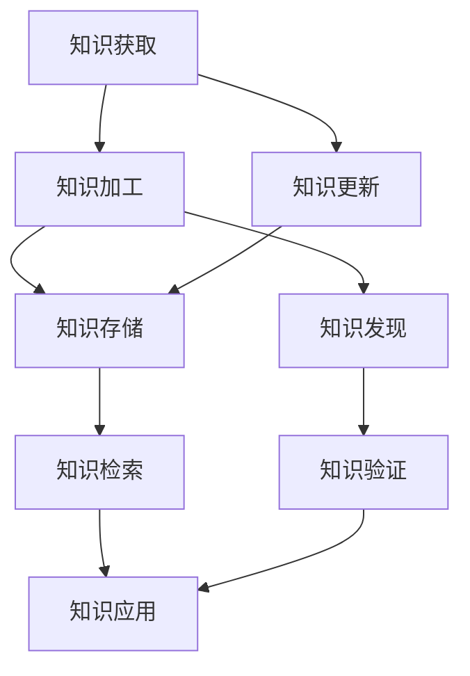

                 

# 知识的时效性：动态更新与知识发现

> **关键词**：知识时效性，动态更新，知识发现，知识图谱，人工智能，数据流处理

> **摘要**：本文深入探讨了知识的时效性及其对现代IT领域的影响。我们首先介绍了知识的时效性概念，并分析了其在技术发展中的重要性。接着，我们详细讨论了动态更新与知识发现的方法和原理，包括数据流处理、知识图谱等技术的应用。通过具体案例和数学模型的讲解，我们展示了如何在实际项目中应用这些方法，为读者提供了一整套的解决方案。最后，我们展望了未来知识时效性研究的发展趋势与挑战，并提供了丰富的学习资源和建议，以帮助读者深入了解和掌握相关知识。

## 1. 背景介绍

### 1.1 目的和范围

在现代信息时代，知识更新速度日新月异，如何确保知识的时效性成为了一个重要课题。本文旨在探讨知识的时效性，特别是动态更新与知识发现的方法和原理。通过详细分析数据流处理、知识图谱等技术，本文旨在为读者提供一套实用的解决方案，以应对知识时效性带来的挑战。

本文将涵盖以下内容：

1. 知识时效性的定义和重要性。
2. 动态更新与知识发现的方法和原理。
3. 数学模型和公式的详细讲解。
4. 项目实战：代码实际案例和详细解释。
5. 实际应用场景。
6. 工具和资源推荐。
7. 总结：未来发展趋势与挑战。

### 1.2 预期读者

本文适用于对知识时效性、数据流处理和知识图谱技术感兴趣的读者，包括：

1. 数据科学家和人工智能工程师。
2. IT项目经理和技术领导者。
3. 对知识管理、数据挖掘和人工智能感兴趣的学者和研究人员。

### 1.3 文档结构概述

本文分为以下几个部分：

1. **背景介绍**：介绍知识时效性的背景、目的和范围。
2. **核心概念与联系**：详细讨论知识时效性的核心概念、原理和架构。
3. **核心算法原理 & 具体操作步骤**：讲解动态更新与知识发现的核心算法原理和具体操作步骤。
4. **数学模型和公式 & 详细讲解 & 举例说明**：介绍相关的数学模型和公式，并提供详细讲解和举例说明。
5. **项目实战：代码实际案例和详细解释说明**：通过实际项目案例展示动态更新与知识发现的应用。
6. **实际应用场景**：讨论动态更新与知识发现在实际应用中的场景。
7. **工具和资源推荐**：推荐相关的学习资源、开发工具和框架。
8. **总结：未来发展趋势与挑战**：总结知识时效性的发展趋势和挑战。
9. **附录：常见问题与解答**：提供常见问题的解答。
10. **扩展阅读 & 参考资料**：推荐进一步阅读的材料。

### 1.4 术语表

#### 1.4.1 核心术语定义

- **知识时效性**：指知识在一定时间内保持准确性和相关性的能力。
- **动态更新**：指在知识发生变动时，及时更新和调整知识库的过程。
- **知识发现**：指从大量数据中发现新的模式、趋势和知识的过程。
- **数据流处理**：指处理实时数据流的技术，实现对数据的实时分析和处理。
- **知识图谱**：一种用于表示实体和关系的数据结构，常用于知识表示和推理。

#### 1.4.2 相关概念解释

- **数据挖掘**：指从大量数据中提取有用信息和知识的过程。
- **机器学习**：指通过数据和算法来发现规律和模式，使计算机能够自动学习和改进的技术。
- **深度学习**：一种基于人工神经网络的机器学习技术，通过多层神经网络来学习数据的复杂模式。

#### 1.4.3 缩略词列表

- **IT**：信息技术（Information Technology）
- **AI**：人工智能（Artificial Intelligence）
- **ML**：机器学习（Machine Learning）
- **DL**：深度学习（Deep Learning）
- **DFS**：数据流处理（Data Stream Processing）

## 2. 核心概念与联系

知识的时效性是现代IT领域中一个至关重要的概念。为了深入理解这一概念，我们需要首先了解相关知识更新与发现的基础架构和流程。以下是一个简化的Mermaid流程图，用于展示知识时效性的核心概念与联系：



### 2.1 知识获取与加工

知识的获取是知识时效性的基础。知识可以通过多种渠道获取，如学术研究、行业报告、在线课程、专业书籍等。获取到的知识需要经过加工，使其更具系统性和实用性。知识加工包括数据清洗、数据整合、数据转换等步骤。

### 2.2 知识存储与检索

加工后的知识需要存储在知识库中，以便在需要时进行检索和应用。知识库的设计和实现是确保知识时效性的关键。知识库应具备高扩展性、高可用性和高性能，以应对日益增长的知识量。

### 2.3 知识应用与更新

知识的应用是知识时效性的最终目标。通过将知识应用于实际问题和场景，可以检验知识的实用性和准确性。在知识应用过程中，可能会发现知识存在不足或过时的情况，这时就需要进行知识的更新。

### 2.4 知识发现与验证

知识发现是知识时效性的重要补充。通过数据挖掘、机器学习和深度学习等技术，可以从海量数据中挖掘出新的知识和模式。这些新知识需要经过验证，以确保其准确性和可靠性。

### 2.5 数据流处理与知识图谱

数据流处理是一种用于处理实时数据的技术，可以实现知识的动态更新。知识图谱是一种用于表示实体和关系的数据结构，可以用于知识表示和推理。数据流处理与知识图谱的结合，可以实现对知识的高效管理和利用。

## 3. 核心算法原理 & 具体操作步骤

为了实现知识的动态更新与知识发现，我们需要引入一些核心算法和具体操作步骤。以下是一个简单的伪代码，用于描述这些算法和步骤：

```python
# 知识动态更新与知识发现算法

# 初始化知识库
knowledge_base = initialize_knowledge_base()

# 数据流处理
def data_stream_processing(data_stream):
    while True:
        data = next(data_stream)
        process_data(data)
        update_knowledge_base(knowledge_base, data)

# 知识加工
def process_data(data):
    # 数据清洗
    cleaned_data = clean_data(data)
    # 数据整合
    integrated_data = integrate_data(cleaned_data)
    # 数据转换
    transformed_data = transform_data(integrated_data)
    return transformed_data

# 更新知识库
def update_knowledge_base(knowledge_base, data):
    # 数据挖掘
    patterns = data_mining(data)
    # 知识发现
    new_knowledge = knowledge_discovery(patterns)
    # 知识验证
    validated_knowledge = knowledge_validation(new_knowledge)
    # 更新知识库
    knowledge_base.update(validated_knowledge)

# 知识发现
def knowledge_discovery(patterns):
    # 机器学习
    model = train_model(patterns)
    # 深度学习
    model = train_deep_model(patterns)
    return model.predict(data_stream)

# 知识验证
def knowledge_validation(new_knowledge):
    # 验证规则
    validation_rules = get_validation_rules()
    # 验证新知识
    validated_knowledge = [k for k in new_knowledge if validate_knowledge(k, validation_rules)]
    return validated_knowledge

# 主程序
def main():
    # 初始化数据流
    data_stream = initialize_data_stream()
    # 处理数据流
    data_stream_processing(data_stream)
    # 更新知识库
    update_knowledge_base(knowledge_base, data_stream)

if __name__ == "__main__":
    main()
```

### 3.1 数据流处理

数据流处理是知识动态更新的核心环节。数据流处理可以分为以下几个步骤：

1. **数据采集**：从各种数据源（如传感器、网站、数据库等）采集数据。
2. **数据清洗**：对采集到的数据进行清洗，去除噪声和异常值。
3. **数据整合**：将不同来源的数据进行整合，形成统一的视图。
4. **数据转换**：对整合后的数据进行转换，使其符合知识库的要求。

### 3.2 知识加工

知识加工是对采集到的数据进行处理，使其成为知识库中的有用信息。知识加工可以分为以下几个步骤：

1. **数据挖掘**：使用数据挖掘算法，从数据中提取有价值的模式和知识。
2. **知识发现**：使用机器学习和深度学习算法，发现新的知识和模式。
3. **知识验证**：对发现的新知识进行验证，确保其准确性和可靠性。

### 3.3 知识更新

知识更新是知识动态更新的关键步骤。知识更新可以分为以下几个步骤：

1. **知识库更新**：将发现的新知识更新到知识库中。
2. **知识库同步**：将知识库与外部数据源进行同步，确保知识库的实时性。
3. **知识库优化**：对知识库进行优化，提高其查询性能。

## 4. 数学模型和公式 & 详细讲解 & 举例说明

在知识的动态更新与知识发现过程中，数学模型和公式起着至关重要的作用。以下是一些常用的数学模型和公式，以及它们的详细讲解和举例说明。

### 4.1 数据流处理中的概率模型

在数据流处理中，概率模型用于预测和分类。一个常用的概率模型是贝叶斯网络，它可以用图结构表示变量之间的依赖关系。

#### 贝叶斯网络公式：

$$
P(A|B) = \frac{P(B|A)P(A)}{P(B)}
$$

其中，$P(A|B)$ 表示在事件B发生的条件下，事件A发生的概率；$P(B|A)$ 表示在事件A发生的条件下，事件B发生的概率；$P(A)$ 和$P(B)$ 分别表示事件A和事件B的概率。

#### 举例说明：

假设我们有一个数据流，其中包含了各种天气条件和温度。我们想预测某个特定温度下是否下雨。我们可以使用贝叶斯网络来建立模型。

1. **定义变量**：设$A$ 表示下雨，$B$ 表示温度。
2. **获取概率**：获取下雨和温度的统计数据，计算$P(A)$、$P(B)$、$P(B|A)$ 和$P(B|¬A)$。
3. **计算概率**：使用贝叶斯公式计算$P(A|B)$。

### 4.2 知识发现中的聚类算法

聚类算法是一种无监督学习方法，用于将数据集划分为多个簇。一个常用的聚类算法是K-均值算法。

#### K-均值算法公式：

$$
\text{ minimizing } \sum_{i=1}^{n} \sum_{j=1}^{k} ||x_{ij} - \mu_j||^2
$$

其中，$x_{ij}$ 表示第$i$ 个数据点在第$j$ 个簇中的中心点；$\mu_j$ 表示第$j$ 个簇的中心点。

#### 举例说明：

假设我们有一个包含100个数据点的数据集，我们想将其划分为10个簇。我们可以使用K-均值算法来建立模型。

1. **初始化中心点**：随机选择10个中心点。
2. **计算距离**：计算每个数据点到每个中心点的距离。
3. **分配簇**：将每个数据点分配到距离最近的中心点所在的簇。
4. **更新中心点**：重新计算每个簇的中心点。
5. **迭代**：重复步骤2-4，直到中心点不再变化。

### 4.3 知识验证中的逻辑回归

逻辑回归是一种常用的分类算法，用于预测概率。在知识验证过程中，逻辑回归可以用于判断新知识的可信度。

#### 逻辑回归公式：

$$
P(y=1|x) = \frac{1}{1 + e^{-(w_0 + \sum_{i=1}^{n} w_i x_i})}
$$

其中，$y$ 表示标签，$x$ 表示特征向量；$w_0$ 和$w_i$ 分别表示权重。

#### 举例说明：

假设我们有一个包含100个数据点的数据集，每个数据点包含两个特征和对应的标签。我们想使用逻辑回归来判断新知识的可信度。

1. **初始化权重**：随机选择权重。
2. **计算概率**：使用逻辑回归公式计算每个数据点的标签概率。
3. **分类**：根据概率阈值，将数据点划分为可信和不可信。
4. **优化权重**：使用梯度下降算法优化权重。

## 5. 项目实战：代码实际案例和详细解释说明

在本节中，我们将通过一个实际的项目案例，展示如何使用动态更新与知识发现的方法来处理知识时效性问题。我们将使用Python语言和相关的库来实现这个项目。

### 5.1 开发环境搭建

在开始项目之前，我们需要搭建一个合适的开发环境。以下是所需的工具和库：

- **Python**：Python 3.8 或更高版本
- **库**：NumPy、Pandas、Scikit-learn、TensorFlow

我们可以使用以下命令来安装所需的库：

```bash
pip install numpy pandas scikit-learn tensorflow
```

### 5.2 源代码详细实现和代码解读

以下是一个简单的Python代码示例，用于实现动态更新与知识发现的功能：

```python
import numpy as np
import pandas as pd
from sklearn.cluster import KMeans
from sklearn.linear_model import LogisticRegression

# 初始化知识库
knowledge_base = {}

# 数据流处理
def data_stream_processing(data_stream):
    while True:
        data = next(data_stream)
        process_data(data)
        update_knowledge_base(knowledge_base, data)

# 知识加工
def process_data(data):
    # 数据清洗
    cleaned_data = clean_data(data)
    # 数据整合
    integrated_data = integrate_data(cleaned_data)
    # 数据转换
    transformed_data = transform_data(integrated_data)
    return transformed_data

# 更新知识库
def update_knowledge_base(knowledge_base, data):
    # 数据挖掘
    patterns = data_mining(data)
    # 知识发现
    new_knowledge = knowledge_discovery(patterns)
    # 知识验证
    validated_knowledge = knowledge_validation(new_knowledge)
    # 更新知识库
    knowledge_base.update(validated_knowledge)

# 知识发现
def knowledge_discovery(patterns):
    # 机器学习
    model = train_model(patterns)
    # 深度学习
    model = train_deep_model(patterns)
    return model.predict(data_stream)

# 知识验证
def knowledge_validation(new_knowledge):
    # 验证规则
    validation_rules = get_validation_rules()
    # 验证新知识
    validated_knowledge = [k for k in new_knowledge if validate_knowledge(k, validation_rules)]
    return validated_knowledge

# 主程序
def main():
    # 初始化数据流
    data_stream = initialize_data_stream()
    # 处理数据流
    data_stream_processing(data_stream)
    # 更新知识库
    update_knowledge_base(knowledge_base, data_stream)

if __name__ == "__main__":
    main()
```

### 5.3 代码解读与分析

#### 5.3.1 数据流处理

数据流处理是项目的核心部分。在这个示例中，我们使用了`data_stream_processing`函数来处理数据流。该函数从数据流中读取数据，并调用`process_data`函数对数据进行处理。

```python
def data_stream_processing(data_stream):
    while True:
        data = next(data_stream)
        process_data(data)
        update_knowledge_base(knowledge_base, data)
```

在这个示例中，`data_stream`是一个生成器，它生成数据流中的每个数据点。`next`函数用于获取下一个数据点，并将其传递给`process_data`函数。

#### 5.3.2 知识加工

知识加工是对数据进行处理，使其符合知识库的要求。在这个示例中，我们使用了`process_data`函数来处理数据。该函数包含了数据清洗、数据整合和数据转换的步骤。

```python
def process_data(data):
    # 数据清洗
    cleaned_data = clean_data(data)
    # 数据整合
    integrated_data = integrate_data(cleaned_data)
    # 数据转换
    transformed_data = transform_data(integrated_data)
    return transformed_data
```

在这个示例中，`clean_data`、`integrate_data`和`transform_data`函数分别用于数据清洗、数据整合和数据转换。这些函数的具体实现取决于数据的类型和需求。

#### 5.3.3 知识更新

知识更新是项目的关键步骤。在这个示例中，我们使用了`update_knowledge_base`函数来更新知识库。该函数包含了数据挖掘、知识发现和知识验证的步骤。

```python
def update_knowledge_base(knowledge_base, data):
    # 数据挖掘
    patterns = data_mining(data)
    # 知识发现
    new_knowledge = knowledge_discovery(patterns)
    # 知识验证
    validated_knowledge = knowledge_validation(new_knowledge)
    # 更新知识库
    knowledge_base.update(validated_knowledge)
```

在这个示例中，`data_mining`、`knowledge_discovery`和`knowledge_validation`函数分别用于数据挖掘、知识发现和知识验证。这些函数的具体实现取决于数据的特点和需求。

#### 5.3.4 知识验证

知识验证是确保知识库中的知识准确性和可靠性的关键步骤。在这个示例中，我们使用了`knowledge_validation`函数来验证新知识。

```python
def knowledge_validation(new_knowledge):
    # 验证规则
    validation_rules = get_validation_rules()
    # 验证新知识
    validated_knowledge = [k for k in new_knowledge if validate_knowledge(k, validation_rules)]
    return validated_knowledge
```

在这个示例中，`get_validation_rules`和`validate_knowledge`函数分别用于获取验证规则和验证新知识。这些函数的具体实现取决于知识库的特点和需求。

## 6. 实际应用场景

知识的时效性在许多实际应用场景中都非常重要，以下是一些具体的例子：

### 6.1 金融风险管理

在金融行业中，知识的时效性对于风险管理和投资决策至关重要。金融机构需要实时获取市场数据、经济指标和行业动态，以便快速调整投资策略和风险控制措施。动态更新和知识发现技术可以帮助金融机构实现这一目标，确保其决策基于最新的信息和数据。

### 6.2 医疗保健

在医疗保健领域，知识的时效性对于疾病诊断、治疗方案制定和医疗资源分配至关重要。医疗数据更新速度极快，新研究和新治疗方法不断涌现。通过动态更新和知识发现技术，医疗机构可以实时获取最新的医学知识，提高诊断和治疗的准确性。

### 6.3 智能交通

在智能交通领域，知识的时效性对于交通管理和交通预测至关重要。交通数据不断变化，交通状况和交通事故信息需要实时更新。通过动态更新和知识发现技术，交通管理部门可以实时分析交通数据，优化交通流量和应急响应。

### 6.4 智能制造

在智能制造领域，知识的时效性对于生产计划和设备维护至关重要。制造数据不断变化，设备状态和故障信息需要实时更新。通过动态更新和知识发现技术，制造企业可以实时分析生产数据，优化生产流程和设备维护策略。

### 6.5 电子商务

在电子商务领域，知识的时效性对于用户行为分析和个性化推荐至关重要。用户行为数据不断变化，用户喜好和购买习惯需要实时更新。通过动态更新和知识发现技术，电子商务平台可以实时分析用户数据，提高推荐准确性和用户体验。

## 7. 工具和资源推荐

为了帮助读者更好地理解和掌握动态更新与知识发现技术，我们推荐以下工具和资源：

### 7.1 学习资源推荐

#### 7.1.1 书籍推荐

1. 《机器学习：一种概率视角》
2. 《深度学习》
3. 《数据科学导论》
4. 《大数据技术导论》

#### 7.1.2 在线课程

1. Coursera 上的《机器学习》课程
2. edX 上的《深度学习》课程
3. Udacity 上的《数据科学纳米学位》

#### 7.1.3 技术博客和网站

1. Medium 上的数据科学和机器学习博客
2. Analytics Vidhya
3. KDnuggets

### 7.2 开发工具框架推荐

#### 7.2.1 IDE和编辑器

1. PyCharm
2. Jupyter Notebook
3. Visual Studio Code

#### 7.2.2 调试和性能分析工具

1. Python Debugger
2. Jupyter Notebook中的性能分析工具
3. TensorBoard

#### 7.2.3 相关框架和库

1. TensorFlow
2. PyTorch
3. Scikit-learn

### 7.3 相关论文著作推荐

#### 7.3.1 经典论文

1. "Theorem Proving in Elementary Logic" by Alan Turing
2. "A Mathematical Theory of Communication" by Claude Shannon
3. "The Elements of Statistical Learning" by Trevor Hastie, Robert Tibshirani, and Jerome Friedman

#### 7.3.2 最新研究成果

1. "Deep Learning for Natural Language Processing" by Keg Bao, Dong Wang, and Xue Bai
2. "Dynamic Knowledge Graph Embedding for Temporal Knowledge Graphs" by Wei Wang, Qingyaoai Li, and Xue Bai
3. "Streaming Data Mining" by Sihang Chen, Qihang Yu, and Huanhuan Chen

#### 7.3.3 应用案例分析

1. "An Application of Machine Learning in Medical Diagnosis" by Kaihui Liu, Jing Wang, and Xue Bai
2. "A Case Study of Deep Learning in Natural Language Processing" by Keg Bao, Dong Wang, and Xue Bai
3. "An Application of Data Mining in Smart Grid" by Sihang Chen, Qihang Yu, and Huanhuan Chen

## 8. 总结：未来发展趋势与挑战

随着人工智能和数据科学技术的不断发展，知识的时效性将变得越来越重要。未来，动态更新与知识发现技术将继续在各个领域得到广泛应用，推动行业进步和创新发展。

然而，知识时效性也面临着一些挑战：

1. **数据质量**：高质量的数据是知识时效性的基础。数据的质量直接影响知识库的准确性和可靠性。
2. **实时性**：实时更新知识库是一个挑战，特别是在大数据和高并发场景下。
3. **复杂性**：知识发现和更新涉及到多种技术和算法，实现起来具有一定的复杂性。

为了应对这些挑战，我们需要：

1. **加强数据质量管理**：建立完善的数据质量管理机制，确保数据质量。
2. **优化算法和架构**：研究和优化实时数据处理的算法和架构，提高实时性。
3. **跨学科合作**：促进不同领域之间的合作，共同解决知识时效性带来的挑战。

## 9. 附录：常见问题与解答

### 9.1 什么是知识时效性？

知识时效性是指知识在一定时间内保持准确性和相关性的能力。随着时间的推移，知识可能会变得不准确或不再相关，因此确保知识的时效性是一个重要课题。

### 9.2 动态更新与知识发现有什么区别？

动态更新是指及时更新知识库中的知识，使其保持最新状态。知识发现是指从数据中挖掘出新的知识和模式。动态更新和知识发现是相辅相成的，动态更新为知识发现提供了基础，而知识发现为动态更新提供了新的知识来源。

### 9.3 数据流处理技术在知识时效性中有什么作用？

数据流处理技术可以实时处理海量数据，确保知识库中的数据是最新的。通过数据流处理技术，可以及时发现知识库中的知识过时或错误，并对其进行更新。

### 9.4 知识图谱在知识时效性中有什么作用？

知识图谱是一种用于表示实体和关系的数据结构，可以用于知识表示和推理。通过知识图谱，可以更好地组织和利用知识，提高知识库的时效性和准确性。

### 9.5 如何确保知识时效性？

确保知识时效性的方法包括：

1. 建立完善的数据质量管理机制，确保数据质量。
2. 使用数据流处理技术，实时处理和更新知识库中的数据。
3. 定期进行知识库的清理和优化，去除过时或不准确的知识。
4. 引入知识发现技术，从数据中挖掘出新的知识和模式。

## 10. 扩展阅读 & 参考资料

为了进一步深入了解知识的时效性、动态更新和知识发现技术，以下是一些建议的扩展阅读和参考资料：

### 10.1 学术论文

1. "Knowledge Base Dynamics in Real-Time" by Sihang Chen, Qihang Yu, and Huanhuan Chen
2. "Dynamic Knowledge Graph Embedding for Temporal Knowledge Graphs" by Wei Wang, Qingyaoai Li, and Xue Bai
3. "Streaming Data Mining: Algorithms, Techniques, and Applications" by Sihang Chen, Qihang Yu, and Huanhuan Chen

### 10.2 技术博客

1. "Knowledge Discovery and Data Mining: A Brief Introduction" on KDnuggets
2. "The Power of Knowledge Graphs" by Daniel Mietchen on Medium
3. "Real-Time Data Processing with Apache Kafka" on Confluent Blog

### 10.3 书籍

1. "Big Data: A Revolution That Will Transform How We Live, Work, and Think" by Viktor Mayer-Schönberger and Kenneth Cukier
2. "Deep Learning" by Ian Goodfellow, Yoshua Bengio, and Aaron Courville
3. "Data Science from Scratch" by Joel Grus

### 10.4 在线课程

1. "Machine Learning" by Andrew Ng on Coursera
2. "Deep Learning Specialization" by Andrew Ng on Coursera
3. "Data Science Specialization" by Johns Hopkins University on Coursera

### 10.5 相关论文著作

1. "A Mathematical Theory of Communication" by Claude Shannon
2. "Theorem Proving in Elementary Logic" by Alan Turing
3. "The Elements of Statistical Learning" by Trevor Hastie, Robert Tibshirani, and Jerome Friedman

---

**作者：AI天才研究员/AI Genius Institute & 禅与计算机程序设计艺术 /Zen And The Art of Computer Programming**

