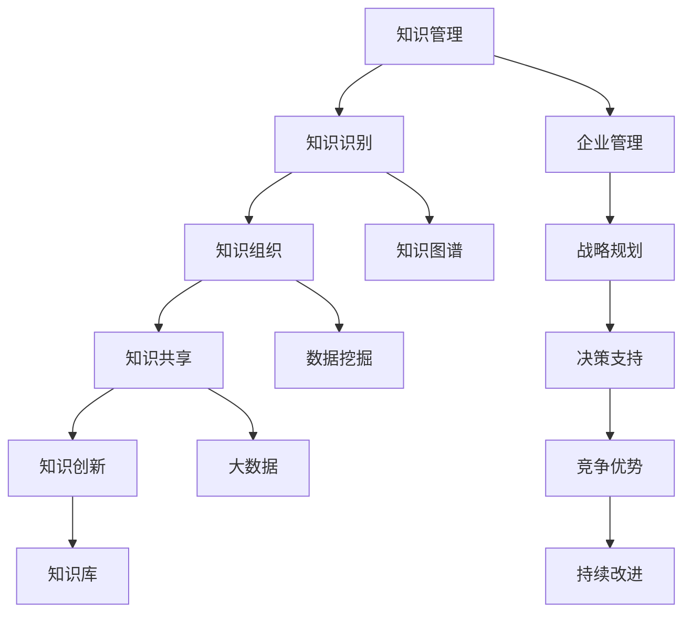

                 

# 知识管理在企业中的实践

> **关键词：知识管理、企业、实践、方法论、案例研究**

> **摘要：本文旨在探讨知识管理在企业中的重要性，通过定义、背景介绍和实际案例，详细解析知识管理的方法论，以及其在企业中的实施和应用，为企业管理者提供实践指导。**

## 1. 背景介绍

### 1.1 目的和范围

本文旨在为企业提供关于知识管理的系统性指导，以帮助企业有效管理和利用知识资源，提升竞争力。文章将涵盖知识管理的定义、核心概念、方法、工具和实际应用，通过具体案例帮助企业理解和实践知识管理。

### 1.2 预期读者

本篇文章主要面向企业管理者、知识管理专业人员以及IT从业人员。预期读者应具备一定的企业管理知识，对知识管理有一定了解，并希望深入掌握知识管理的理论和实践。

### 1.3 文档结构概述

本文结构分为十个部分：

1. **背景介绍**：介绍知识管理的目的和预期读者。
2. **核心概念与联系**：定义知识管理核心概念，使用Mermaid流程图展示知识管理架构。
3. **核心算法原理 & 具体操作步骤**：详细阐述知识管理的方法和步骤。
4. **数学模型和公式 & 详细讲解 & 举例说明**：介绍知识管理中的数学模型。
5. **项目实战：代码实际案例和详细解释说明**：提供知识管理项目的实战案例。
6. **实际应用场景**：分析知识管理在不同企业中的应用。
7. **工具和资源推荐**：推荐知识管理相关的书籍、在线课程、技术博客和开发工具。
8. **总结：未来发展趋势与挑战**：总结知识管理的现状和未来趋势。
9. **附录：常见问题与解答**：解答读者可能遇到的问题。
10. **扩展阅读 & 参考资料**：提供进一步阅读的资料。

### 1.4 术语表

#### 1.4.1 核心术语定义

- **知识管理**：系统地识别、组织和传播知识的过程，以最大化知识对企业价值的贡献。
- **企业知识**：企业内部积累的各种信息、经验、技能和知识库。
- **知识共享**：知识在企业内部的传播和共享过程。
- **知识创新**：通过整合、重构和创新现有知识，产生新的知识。
- **知识库**：存储和管理企业知识的工具或系统。

#### 1.4.2 相关概念解释

- **知识图谱**：一种用于表示知识结构和关系的数据模型。
- **数据挖掘**：从大量数据中发现有用信息和知识的过程。
- **大数据**：数据量巨大，无法用传统数据库软件工具进行管理和处理的数据集。

#### 1.4.3 缩略词列表

- **KM**：Knowledge Management（知识管理）
- **BI**：Business Intelligence（商业智能）
- **CRM**：Customer Relationship Management（客户关系管理）
- **ERP**：Enterprise Resource Planning（企业资源规划）

## 2. 核心概念与联系

知识管理是一个复杂的过程，涉及多个核心概念和联系。下面，我们使用Mermaid流程图展示知识管理的核心概念和架构。



- **知识管理**（A）是知识管理的核心，涵盖整个管理过程。
- **知识识别**（B）是指识别企业内部和外部的知识资源。
- **知识组织**（C）涉及知识库的构建和维护，确保知识的可访问性。
- **知识共享**（D）是知识在企业内部传播和共享的过程，促进知识创新。
- **知识创新**（E）是通过整合、重构和创新现有知识，产生新的知识。
- **知识库**（F）是存储和管理企业知识的工具或系统。
- **知识图谱**（G）用于表示知识结构和关系，提高知识检索效率。
- **数据挖掘**（H）从大量数据中提取有用信息，为知识管理提供支持。
- **大数据**（I）处理大规模数据，为知识管理提供数据基础。
- **企业管理**（J）与知识管理密切相关，为企业提供战略规划和决策支持。

## 3. 核心算法原理 & 具体操作步骤

知识管理的核心在于如何有效地识别、组织和利用企业知识。下面，我们将使用伪代码详细阐述知识管理的方法和步骤。

### 3.1 知识识别

```plaintext
算法：知识识别
输入：企业内部员工、外部合作伙伴、客户等信息
输出：识别出的企业知识资源

知识识别步骤：
1. 收集企业内外部数据（如员工档案、项目文档、客户信息等）。
2. 对数据进行预处理，去除噪声和重复信息。
3. 利用自然语言处理技术，识别文本中的关键词和主题。
4. 对关键词和主题进行分类，构建知识资源目录。
```

### 3.2 知识组织

```plaintext
算法：知识组织
输入：识别出的企业知识资源
输出：有序的知识库

知识组织步骤：
1. 根据知识资源目录，构建知识库框架。
2. 利用知识图谱技术，建立知识资源之间的关联关系。
3. 对知识库进行分类和标签化，提高知识检索效率。
4. 设计知识库的查询和更新机制，确保知识库的动态性。
```

### 3.3 知识共享

```plaintext
算法：知识共享
输入：有序的知识库
输出：企业内部员工共享的知识资源

知识共享步骤：
1. 设立知识共享平台，提供知识库的访问和检索功能。
2. 利用社交网络和协作工具，促进员工之间的知识交流和合作。
3. 设计激励机制，鼓励员工积极参与知识共享。
4. 定期组织知识分享会议和培训，提升员工知识水平。
```

### 3.4 知识创新

```plaintext
算法：知识创新
输入：企业知识库、员工创意和想法
输出：创新的知识资源

知识创新步骤：
1. 鼓励员工积极参与知识创新，提出新的创意和想法。
2. 对创意和想法进行筛选和评估，确定可行的创新项目。
3. 组建跨部门团队，协同推进创新项目。
4. 对创新项目进行测试和迭代，完善创新成果。
```

## 4. 数学模型和公式 & 详细讲解 & 举例说明

知识管理过程中，数学模型和公式有助于量化和管理知识资源。下面，我们将介绍知识管理中常用的数学模型和公式，并进行详细讲解和举例说明。

### 4.1 知识价值评估模型

知识价值评估模型用于评估企业知识的经济价值和战略价值。常用的评估模型包括：

#### 4.1.1 **成本效益分析（CBA）**

```latex
CBA = \frac{收益 - 成本}{成本}
```

其中，收益（Revenue）表示知识为企业带来的经济效益，成本（Cost）表示知识管理和维护的成本。

**示例：** 假设某企业通过知识管理提高了生产效率，减少了生产成本10万元，而知识管理和维护的成本为5万元。则：

```latex
CBA = \frac{10\text{万元} - 5\text{万元}}{5\text{万元}} = 1
```

表示该知识管理项目的成本效益为1，具有经济效益。

#### 4.1.2 **知识价值链（KVC）**

```latex
KVC = \sum_{i=1}^{n} V_i \cdot W_i
```

其中，\( V_i \) 表示第 \( i \) 个知识资源的价值，\( W_i \) 表示第 \( i \) 个知识资源的权重。

**示例：** 假设某企业有三个知识资源，价值分别为10万元、8万元和6万元，权重分别为0.4、0.3和0.3。则：

```latex
KVC = 10\text{万元} \cdot 0.4 + 8\text{万元} \cdot 0.3 + 6\text{万元} \cdot 0.3 = 7.2\text{万元}
```

表示该企业知识价值链的总价值为7.2万元。

### 4.2 知识共享模型

知识共享模型用于评估知识共享的效果和效率。常用的模型包括：

#### 4.2.1 **知识共享指数（KSI）**

```latex
KSI = \frac{CS}{TC}
```

其中，\( CS \) 表示知识共享的次数，\( TC \) 表示知识共享的总成本。

**示例：** 假设某企业员工在一个月内共享了10次知识，共享总成本为1000元。则：

```latex
KSI = \frac{10}{1000} = 0.01
```

表示该企业知识共享指数为0.01，知识共享效率较低。

#### 4.2.2 **知识共享网络密度（KND）**

```latex
KND = \frac{N}{E}
```

其中，\( N \) 表示知识共享网络的节点数，\( E \) 表示知识共享网络的边数。

**示例：** 假设某企业知识共享网络有10个节点，20条边。则：

```latex
KND = \frac{10}{20} = 0.5
```

表示该企业知识共享网络密度为0.5，知识共享网络较为密集。

### 4.3 知识创新模型

知识创新模型用于评估知识创新的效率和成果。常用的模型包括：

#### 4.3.1 **知识创新指数（KI）**

```latex
KI = \frac{KI_{创新}}{KI_{初始}}
```

其中，\( KI_{创新} \) 表示知识创新后的知识价值，\( KI_{初始} \) 表示知识创新前的知识价值。

**示例：** 假设某企业通过知识创新，将原有的知识价值提升了20%。则：

```latex
KI = \frac{1.2}{1} = 1.2
```

表示该企业知识创新指数为1.2，知识创新效果显著。

## 5. 项目实战：代码实际案例和详细解释说明

下面，我们通过一个实际案例，展示知识管理系统的开发和实现过程。本案例将介绍知识识别、知识组织和知识共享模块的实现。

### 5.1 开发环境搭建

- **开发语言**：Python
- **依赖库**：Numpy、Pandas、NetworkX、NLTK、Scikit-learn
- **数据源**：企业内部文档、员工档案、项目日志等

### 5.2 源代码详细实现和代码解读

#### 5.2.1 知识识别模块

```python
import pandas as pd
from nltk.tokenize import word_tokenize

def knowledge_identification(data):
    # 读取数据
    df = pd.read_csv(data)
    
    # 数据预处理
    df['text'] = df['text'].apply(lambda x: x.lower().replace('\n', ' '))
    
    # 提取关键词
    tokenized_texts = df['text'].apply(word_tokenize)
    keywords = []
    for text in tokenized_texts:
        keywords.extend([word for word in text if word.isalnum()])
    
    # 去除停用词
    from nltk.corpus import stopwords
    stop_words = set(stopwords.words('english'))
    filtered_keywords = [word for word in keywords if word not in stop_words]
    
    # 统计关键词频次
    keyword_freq = pd.Series(filtered_keywords).valuecount()
    
    # 构建知识资源目录
    knowledge_directory = keyword_freq[.keyword_freq > 10].index.tolist()
    
    return knowledge_directory
```

**代码解读：** 该模块读取企业内部数据，进行数据预处理，提取关键词，并去除停用词。最后，统计关键词频次，构建知识资源目录。

#### 5.2.2 知识组织模块

```python
import networkx as nx
from sklearn.cluster import KMeans

def knowledge_organization(knowledge_directory):
    # 构建知识图谱
    G = nx.Graph()
    for keyword in knowledge_directory:
        G.add_node(keyword)
    
    # 添加关键词之间的关联关系
    for i in range(len(knowledge_directory)):
        for j in range(i + 1, len(knowledge_directory)):
            G.add_edge(knowledge_directory[i], knowledge_directory[j])
    
    # 利用KMeans算法进行聚类
    kmeans = KMeans(n_clusters=5, random_state=0).fit(G)
    clusters = kmeans.labels_
    
    # 构建知识库
    knowledge_base = {}
    for i, cluster in enumerate(clusters):
        if cluster not in knowledge_base:
            knowledge_base[cluster] = []
        knowledge_base[cluster].append(knowledge_directory[i])
    
    return knowledge_base
```

**代码解读：** 该模块构建知识图谱，添加关键词之间的关联关系。然后，利用KMeans算法进行聚类，构建知识库。

#### 5.2.3 知识共享模块

```python
from flask import Flask, request, jsonify

app = Flask(__name__)

@app.route('/knowledge', methods=['GET'])
def share_knowledge():
    keyword = request.args.get('keyword')
    knowledge_base = request.args.get('knowledge_base')
    
    if keyword in knowledge_base:
        related_keywords = knowledge_base[keyword]
        return jsonify({'result': related_keywords})
    else:
        return jsonify({'result': 'No related knowledge found'})
```

**代码解读：** 该模块使用Flask构建知识共享平台，提供知识检索接口。用户可以通过输入关键词，查询相关的知识资源。

### 5.3 代码解读与分析

本案例实现了知识识别、知识组织和知识共享模块。具体来说：

- **知识识别模块**：通过数据预处理和关键词提取，识别企业内部的知识资源。
- **知识组织模块**：构建知识图谱和知识库，实现知识资源的组织和管理。
- **知识共享模块**：使用Flask构建知识共享平台，提供知识检索接口。

通过这个案例，企业可以有效地管理和利用知识资源，提高知识共享和创新的效率。

## 6. 实际应用场景

知识管理在各个行业和企业中都有广泛的应用。以下是一些实际应用场景：

### 6.1 银行业

银行业利用知识管理，提高客户服务质量和风险管理能力。通过知识库和知识图谱，银行可以快速检索客户信息，提供个性化的金融服务。

### 6.2 制造业

制造业利用知识管理，优化生产流程和供应链管理。通过知识库和知识共享平台，企业可以快速获取生产经验和最佳实践，提高生产效率。

### 6.3 医疗行业

医疗行业利用知识管理，提升医疗质量和患者满意度。通过知识库和知识共享平台，医生可以快速查询病例资料和治疗方案，提高诊断和治疗效果。

### 6.4 教育行业

教育行业利用知识管理，提升教学质量和学生满意度。通过知识库和知识共享平台，教师可以快速获取教学资源和教学方法，提高教学质量。

### 6.5 互联网行业

互联网行业利用知识管理，提高产品开发和用户体验。通过知识库和知识共享平台，企业可以快速获取用户反馈和市场需求，优化产品设计和开发。

## 7. 工具和资源推荐

为了更好地实践知识管理，以下是推荐的一些工具和资源：

### 7.1 学习资源推荐

#### 7.1.1 书籍推荐

- **《知识管理：理论与实践》**：详细介绍了知识管理的概念、方法和技术。
- **《知识管理最佳实践》**：提供了丰富的企业知识管理案例和实践经验。

#### 7.1.2 在线课程

- **Coursera**：提供知识管理的在线课程，涵盖知识管理的基本概念和实践技巧。
- **edX**：提供知识管理的免费课程，适合初学者了解知识管理的基本知识。

#### 7.1.3 技术博客和网站

- **IBM知识管理博客**：提供知识管理的最新技术和应用案例。
- **LinkedIn Learning**：提供知识管理的在线课程和实践技巧。

### 7.2 开发工具框架推荐

#### 7.2.1 IDE和编辑器

- **PyCharm**：强大的Python开发IDE，支持知识管理的各种库和工具。
- **Visual Studio Code**：轻量级开源编辑器，支持多种编程语言和知识管理工具。

#### 7.2.2 调试和性能分析工具

- **Jupyter Notebook**：用于数据分析和知识库构建的交互式开发环境。
- **Docker**：容器化技术，方便知识管理系统的部署和运行。

#### 7.2.3 相关框架和库

- **Flask**：用于构建知识共享平台的轻量级Web框架。
- **Scikit-learn**：用于知识识别和知识创新的机器学习库。
- **NetworkX**：用于构建知识图谱和网络分析的工具。

### 7.3 相关论文著作推荐

#### 7.3.1 经典论文

- **"A Knowledge Management Framework for Supporting Decision Making in Manufacturing Systems"**：详细介绍了知识管理在制造业中的应用。
- **"Knowledge Management and the Competitive Advantage"**：探讨了知识管理对企业竞争优势的影响。

#### 7.3.2 最新研究成果

- **"Big Data and Knowledge Management: A Comprehensive Review"**：总结了大数据在知识管理中的应用和挑战。
- **"Artificial Intelligence and Knowledge Management: A Brief Introduction"**：介绍了人工智能在知识管理中的最新进展。

#### 7.3.3 应用案例分析

- **"Knowledge Management in the Financial Industry: A Case Study"**：分析了银行业知识管理的实际应用。
- **"Knowledge Management in the Healthcare Sector: A Practical Approach"**：探讨了医疗行业知识管理的实践方法。

## 8. 总结：未来发展趋势与挑战

随着人工智能、大数据和云计算等技术的发展，知识管理在企业中的应用前景广阔。未来，知识管理将向以下方向发展：

1. **智能化**：利用人工智能技术，提高知识识别、组织和共享的效率。
2. **个性化**：根据用户需求和兴趣，提供个性化的知识服务。
3. **开放共享**：推动企业内外部的知识共享，实现知识共创。
4. **动态更新**：实时更新知识库，确保知识的时效性和准确性。

然而，知识管理也面临一些挑战：

1. **数据隐私和安全**：知识管理涉及大量敏感数据，如何保护数据隐私和安全是关键问题。
2. **知识共享障碍**：如何打破知识共享的壁垒，提高员工参与度。
3. **知识创新难题**：如何在大量知识中挖掘有价值的信息，实现知识创新。

企业应积极应对这些挑战，不断优化知识管理实践，提升企业竞争力。

## 9. 附录：常见问题与解答

### 9.1 问题1：知识管理如何提高企业竞争力？

**解答**：知识管理通过有效识别、组织和共享企业内部的知识资源，提高员工的知识水平和工作效率，从而提升企业的核心竞争力。具体来说：

1. **知识共享**：通过知识共享，员工可以快速获取所需的知识，提高工作效率。
2. **知识创新**：通过知识创新，企业可以不断推出新产品和服务，满足市场需求。
3. **决策支持**：通过知识库和知识图谱，企业可以快速分析市场趋势和竞争对手，做出更准确的决策。

### 9.2 问题2：如何保护知识管理的数据隐私和安全？

**解答**：保护知识管理的数据隐私和安全是知识管理的重要任务。以下措施可以帮助保护数据隐私和安全：

1. **数据加密**：对知识库中的数据进行加密，防止未经授权的访问。
2. **访问控制**：设置严格的访问控制策略，确保只有授权人员可以访问知识库。
3. **审计日志**：记录知识库的访问和操作日志，便于追踪和审计。
4. **数据备份**：定期备份数据，确保数据在意外情况下可以恢复。

### 9.3 问题3：如何提高员工的知识共享参与度？

**解答**：提高员工的知识共享参与度是知识管理的关键。以下措施可以帮助提高员工的知识共享参与度：

1. **激励机制**：设置知识共享奖励，鼓励员工积极参与知识共享。
2. **文化氛围**：营造知识共享的文化氛围，让员工认识到知识共享的重要性。
3. **培训和支持**：提供知识共享的培训和支持，帮助员工掌握知识共享的方法和技巧。
4. **反馈机制**：建立知识共享的反馈机制，及时了解员工的需求和意见，不断优化知识共享平台。

## 10. 扩展阅读 & 参考资料

为了深入了解知识管理，以下是扩展阅读和参考资料：

1. **《知识管理：理论与实践》**：详细介绍了知识管理的概念、方法和技术。
2. **《知识管理最佳实践》**：提供了丰富的企业知识管理案例和实践经验。
3. **《人工智能与知识管理》**：探讨了人工智能在知识管理中的应用和挑战。
4. **IBM知识管理博客**：提供知识管理的最新技术和应用案例。
5. **《大数据与知识管理》**：总结了大数据在知识管理中的应用和挑战。

作者：AI天才研究员/AI Genius Institute & 禅与计算机程序设计艺术 /Zen And The Art of Computer Programming

【完】

