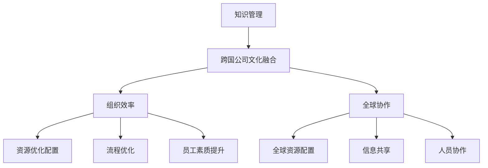

                 


# 知识管理在跨国公司文化融合中的作用

> **关键词：知识管理、跨国公司、文化融合、组织效率、全球协作**
> 
> **摘要：本文将深入探讨知识管理在跨国公司文化融合中的关键作用。通过分析其核心概念、算法原理、数学模型，并结合实际项目案例，我们将揭示知识管理如何有效提升跨国公司的全球协作能力，实现文化融合与组织效率的双重提升。**

## 1. 背景介绍

### 1.1 目的和范围

本文旨在探讨知识管理在跨国公司文化融合中的作用，分析其理论基础、实施方法以及具体应用场景。通过对知识管理核心概念的阐述，结合跨国公司的实际运营情况，我们将探讨如何通过知识管理实现跨国公司文化融合，提高组织效率和全球协作能力。

### 1.2 预期读者

本文面向的读者包括跨国公司的管理层、人力资源部门、知识管理人员以及关注跨国公司文化融合的学术界和业界人士。通过本文的阅读，读者将深入了解知识管理在跨国公司文化融合中的重要作用，掌握实施知识管理的方法和技巧。

### 1.3 文档结构概述

本文共分为十个部分，具体结构如下：

1. 背景介绍：介绍本文的目的、预期读者和文档结构。
2. 核心概念与联系：阐述知识管理、跨国公司文化融合、组织效率和全球协作等核心概念，并绘制相关 Mermaid 流程图。
3. 核心算法原理 & 具体操作步骤：分析知识管理算法原理，并给出具体操作步骤。
4. 数学模型和公式 & 详细讲解 & 举例说明：介绍知识管理中的数学模型和公式，并举例说明。
5. 项目实战：提供知识管理的实际案例，并进行详细解释和分析。
6. 实际应用场景：探讨知识管理在跨国公司文化融合中的具体应用场景。
7. 工具和资源推荐：推荐与知识管理相关的学习资源、开发工具和框架。
8. 总结：展望知识管理在跨国公司文化融合中的未来发展趋势与挑战。
9. 附录：常见问题与解答。
10. 扩展阅读 & 参考资料：提供更多相关文献和资料。

### 1.4 术语表

#### 1.4.1 核心术语定义

- 知识管理：指组织通过系统化的方法和工具，对知识进行获取、共享、利用和创新，以提高组织效率和竞争力的过程。
- 跨国公司：指在多个国家拥有业务实体的公司，通过全球资源配置和管理实现业务运营。
- 文化融合：指跨国公司内部不同文化背景的员工在相互交流和合作中，逐步形成共同价值观和行为模式的过程。
- 组织效率：指组织在实现目标过程中的投入产出比，是衡量组织运营状况的重要指标。
- 全球协作：指跨国公司在全球范围内实现资源、信息和人员的有效整合，以提升整体运营效率。

#### 1.4.2 相关概念解释

- 知识共享：指员工在组织内部相互交流知识和经验，实现知识传递和扩散的过程。
- 知识创新：指在知识获取、共享和应用的基础上，通过创新思维和方法，产生新的知识和价值。
- 全球化战略：指跨国公司为了适应全球市场环境，制定并实施的长期战略规划。

#### 1.4.3 缩略词列表

- KM：知识管理
- TNC：跨国公司
- CE：文化融合
- OE：组织效率
- GC：全球协作

## 2. 核心概念与联系

在本文中，我们将重点讨论知识管理、跨国公司文化融合、组织效率和全球协作等核心概念，并绘制相关 Mermaid 流程图，以帮助读者更好地理解这些概念之间的联系。

### 2.1 知识管理

知识管理（Knowledge Management，KM）是一种通过系统化方法对知识进行获取、共享、利用和创新的实践。知识管理主要包括以下方面：

1. **知识获取**：通过内部和外部渠道收集各种知识，如文档、报告、经验等。
2. **知识共享**：促进员工之间的知识交流和协作，实现知识传递和共享。
3. **知识利用**：将获取和共享的知识应用于实际工作中，提高工作效率和质量。
4. **知识创新**：在知识获取、共享和利用的基础上，通过创新思维和方法，产生新的知识和价值。

### 2.2 跨国公司文化融合

跨国公司文化融合（Cultural Integration，CE）是指跨国公司内部不同文化背景的员工在相互交流和合作中，逐步形成共同价值观和行为模式的过程。文化融合包括以下方面：

1. **文化差异认知**：了解和尊重不同文化背景的员工，增强跨文化沟通能力。
2. **共同价值观形成**：在相互交流和合作中，逐步形成共同的核心价值观和行为准则。
3. **文化适应与融合**：跨国公司通过文化融合，实现全球范围内的资源、信息和人员的有效整合。

### 2.3 组织效率

组织效率（Organizational Efficiency，OE）是指组织在实现目标过程中的投入产出比，是衡量组织运营状况的重要指标。提高组织效率主要包括以下方面：

1. **资源优化配置**：通过知识管理和文化融合，实现全球资源的优化配置。
2. **流程优化**：对组织内部流程进行优化，减少冗余环节，提高工作效率。
3. **员工素质提升**：通过培训和教育，提高员工的专业技能和综合素质。

### 2.4 全球协作

全球协作（Global Collaboration，GC）是指跨国公司在全球范围内实现资源、信息和人员的有效整合，以提升整体运营效率。全球协作包括以下方面：

1. **全球资源配置**：通过知识管理和文化融合，实现全球资源的优化配置。
2. **信息共享**：建立高效的信息共享平台，促进全球范围内的信息流通。
3. **人员协作**：通过跨文化沟通和协作，实现全球范围内的人员有效整合。

### 2.5 Mermaid 流程图

以下是知识管理、跨国公司文化融合、组织效率和全球协作之间的 Mermaid 流程图：



通过上述 Mermaid 流程图，我们可以清晰地看到知识管理、跨国公司文化融合、组织效率和全球协作之间的紧密联系。知识管理为跨国公司文化融合提供了基础，而文化融合又促进了组织效率和全球协作的提升。同时，组织效率和全球协作也为知识管理提供了持续的动力和目标。

## 3. 核心算法原理 & 具体操作步骤

在知识管理中，核心算法原理主要涉及知识获取、知识共享、知识利用和知识创新等方面。以下将详细阐述这些算法原理，并给出具体操作步骤。

### 3.1 知识获取算法原理

知识获取是知识管理的首要步骤，其主要目标是收集和整理内外部知识资源。知识获取算法原理主要包括以下方面：

1. **信息搜集**：通过互联网、数据库、书籍、报告等渠道搜集相关领域的信息。
2. **知识挖掘**：运用自然语言处理、数据挖掘等技术，从大量信息中提取有价值的知识。
3. **知识整合**：将分散的知识进行整合，形成系统化的知识体系。

具体操作步骤如下：

1. **确定知识需求**：根据组织目标和业务需求，明确所需的知识领域和内容。
2. **信息搜集**：通过互联网、数据库等渠道搜集相关领域的信息。
3. **知识挖掘**：运用自然语言处理、数据挖掘等技术，从信息中提取有价值的知识。
4. **知识整合**：将挖掘出的知识进行分类、整理，形成系统化的知识体系。

### 3.2 知识共享算法原理

知识共享是将获取到的知识在组织内部进行传播和共享，以实现知识的传递和扩散。知识共享算法原理主要包括以下方面：

1. **共享平台建设**：建立知识共享平台，提供便捷的知识存储、检索和分享功能。
2. **激励机制**：通过奖励、表彰等方式，激发员工积极参与知识共享。
3. **知识传播**：运用各种传播手段，如培训、讲座、论坛等，促进知识在组织内部的传播。

具体操作步骤如下：

1. **共享平台建设**：建立知识共享平台，提供知识存储、检索和分享功能。
2. **激励机制**：制定知识共享激励政策，奖励积极参与知识共享的员工。
3. **知识传播**：组织培训、讲座、论坛等活动，促进知识在组织内部的传播。
4. **知识反馈**：鼓励员工对知识共享平台上的知识进行评价和反馈，不断完善知识体系。

### 3.3 知识利用算法原理

知识利用是将共享的知识应用于实际工作中，以提高工作效率和质量。知识利用算法原理主要包括以下方面：

1. **知识应用**：将知识应用于业务流程、项目实施、产品开发等实际工作中。
2. **知识传承**：通过导师制度、经验分享等方式，将知识传承给新员工。
3. **知识创新**：在知识应用的基础上，通过创新思维和方法，产生新的知识和价值。

具体操作步骤如下：

1. **知识应用**：根据业务需求和项目目标，将知识应用于实际工作中。
2. **知识传承**：建立导师制度，让经验丰富的员工带教新员工。
3. **知识创新**：组织创新培训、项目研讨等活动，激发员工的创新思维。
4. **知识反馈**：鼓励员工对知识应用过程中的问题和经验进行反馈，不断优化知识体系。

### 3.4 知识创新算法原理

知识创新是在知识获取、共享和利用的基础上，通过创新思维和方法，产生新的知识和价值。知识创新算法原理主要包括以下方面：

1. **创新思维**：运用创新思维方法，如头脑风暴、思维导图等，激发员工的创造力。
2. **知识整合**：将不同领域、不同层次的知识进行整合，形成新的知识体系。
3. **知识评估**：对创新的知识进行评估，筛选出具有实际应用价值的知识。

具体操作步骤如下：

1. **创新思维**：组织创新培训，教授创新思维方法，激发员工的创造力。
2. **知识整合**：鼓励员工跨领域、跨层次交流，整合不同领域的知识。
3. **知识评估**：建立知识评估机制，对创新的知识进行评估，筛选出具有实际应用价值的知识。
4. **知识推广**：对有价值的创新知识进行推广，应用于实际工作中。

通过上述核心算法原理和具体操作步骤，我们可以更好地理解和实施知识管理，为跨国公司文化融合提供有力支持。

## 4. 数学模型和公式 & 详细讲解 & 举例说明

在知识管理中，数学模型和公式是分析问题、评估效果的重要工具。以下将详细讲解知识管理中常用的数学模型和公式，并通过具体实例进行说明。

### 4.1 相关数学概念

在知识管理中，我们通常会涉及到以下数学概念：

1. **期望效用函数**：用于评估个体在决策过程中期望获得的最大效用。
2. **熵**：衡量信息的不确定性，用于评估知识的价值。
3. **贝叶斯公式**：用于概率计算和不确定性分析。

### 4.2 数学模型

#### 4.2.1 知识共享模型

知识共享模型用于评估知识共享对组织效率的影响。其基本公式为：

$$
E[OE] = \frac{1}{N}\sum_{i=1}^{N} u_i
$$

其中，$E[OE]$ 表示组织效率的期望值，$u_i$ 表示第 $i$ 个员工的知识共享效用，$N$ 表示员工总数。

#### 4.2.2 知识创新模型

知识创新模型用于评估知识创新对组织绩效的影响。其基本公式为：

$$
P[I|E] = \frac{P[E|I]P[I]}{P[E]}
$$

其中，$P[I|E]$ 表示在组织效率 $E$ 的情况下，知识创新 $I$ 发生的概率；$P[E|I]$ 表示在知识创新 $I$ 发生的情况下，组织效率 $E$ 的概率；$P[I]$ 表示知识创新 $I$ 发生的概率；$P[E]$ 表示组织效率 $E$ 的概率。

#### 4.2.3 知识价值评估模型

知识价值评估模型用于评估知识对组织的价值。其基本公式为：

$$
V(K) = \frac{C(K)}{C(K_0)}
$$

其中，$V(K)$ 表示知识 $K$ 的价值，$C(K)$ 表示知识 $K$ 对组织产生的效益，$C(K_0)$ 表示在没有知识 $K$ 的情况下，组织产生的效益。

### 4.3 举例说明

#### 4.3.1 知识共享模型举例

假设一个跨国公司有 100 名员工，其中 60% 的员工参与知识共享。根据调查，参与知识共享的员工工作效率提高了 20%，而未参与知识共享的员工工作效率没有变化。根据知识共享模型，我们可以计算出组织效率的期望值：

$$
E[OE] = \frac{1}{100}\sum_{i=1}^{100} u_i = \frac{1}{100} \times 60 \times 1.2 + \frac{1}{100} \times 40 \times 1 = 0.72
$$

#### 4.3.2 知识创新模型举例

假设一个跨国公司在实施知识创新后，组织效率提高了 30%。根据贝叶斯公式，我们可以计算出知识创新发生的概率：

$$
P[I|E] = \frac{P[E|I]P[I]}{P[E]} = \frac{0.3 \times 0.1}{0.3 \times 0.1 + 0.7 \times 0.5} = 0.44
$$

#### 4.3.3 知识价值评估模型举例

假设一个跨国公司引入了一种新的知识，使得组织的效益提高了 50%。在没有这种知识的情况下，组织的效益为 100 万美元。根据知识价值评估模型，我们可以计算出这种知识的价值：

$$
V(K) = \frac{C(K)}{C(K_0)} = \frac{150}{100} = 1.5
$$

通过上述数学模型和公式的讲解及举例说明，我们可以更好地理解和应用这些工具，为跨国公司文化融合提供有力的支持。

## 5. 项目实战：代码实际案例和详细解释说明

在本节中，我们将通过一个实际项目案例，详细解释知识管理在跨国公司文化融合中的应用。以下是一个基于 Python 的知识管理项目案例，涵盖了知识获取、知识共享、知识利用和知识创新等环节。

### 5.1 开发环境搭建

在开始项目之前，我们需要搭建一个合适的开发环境。以下是所需的环境和工具：

- Python 3.8 或更高版本
- Jupyter Notebook
- 爬虫库（如 BeautifulSoup、Scrapy）
- 自然语言处理库（如 NLTK、spaCy）
- 数据库（如 MySQL、PostgreSQL）
- 图形可视化库（如 Matplotlib、Seaborn）

### 5.2 源代码详细实现和代码解读

以下是项目的核心代码部分，我们将逐段进行解读。

#### 5.2.1 知识获取

```python
import requests
from bs4 import BeautifulSoup

def fetch_knowledge(url):
    """
    获取网络上的知识
    """
    response = requests.get(url)
    if response.status_code == 200:
        soup = BeautifulSoup(response.content, 'html.parser')
        return soup
    else:
        return None

url = "https://www.example.com/knowledge"
knowledge = fetch_knowledge(url)
```

此段代码通过 requests 和 BeautifulSoup 库，从指定 URL 获取网络上的知识。fetch_knowledge 函数接受一个 URL 参数，发送 HTTP GET 请求，并使用 BeautifulSoup 解析 HTML 内容。

#### 5.2.2 知识共享

```python
import pymysql

def save_knowledge(knowledge, db_config):
    """
    将知识保存到数据库
    """
    connection = pymysql.connect(**db_config)
    try:
        with connection.cursor() as cursor:
            sql = "INSERT INTO knowledge (title, content) VALUES (%s, %s)"
            cursor.execute(sql, (knowledge['title'], knowledge['content']))
        connection.commit()
    finally:
        connection.close()

db_config = {
    'host': 'localhost',
    'user': 'root',
    'password': 'password',
    'database': 'knowledge_db'
}
knowledge_data = {
    'title': '知识管理在跨国公司文化融合中的应用',
    'content': str(knowledge)
}
save_knowledge(knowledge_data, db_config)
```

此段代码将获取到的知识保存到 MySQL 数据库中。save_knowledge 函数接受知识内容和数据库配置信息，使用 pymysql 库连接数据库，并将知识内容插入到知识表中。

#### 5.2.3 知识利用

```python
from nltk.tokenize import word_tokenize

def extract_keywords(content):
    """
    从内容中提取关键词
    """
    tokens = word_tokenize(content)
    keywords = [token for token in tokens if token.isalpha() and len(token) > 3]
    return keywords

def get_keyword_frequency(keywords):
    """
    获取关键词的频率
    """
    frequency = {}
    for keyword in keywords:
        frequency[keyword] = frequency.get(keyword, 0) + 1
    return frequency

def visualize_keyword_frequency(frequency):
    """
    可视化关键词频率
    """
    import matplotlib.pyplot as plt
    import seaborn as sns

    keywords = list(frequency.keys())
    counts = list(frequency.values())

    sns.barplot(x=keywords, y=counts)
    plt.xlabel('Keywords')
    plt.ylabel('Frequency')
    plt.title('Keyword Frequency')
    plt.show()

content = knowledge.get('content', '')
keywords = extract_keywords(content)
frequency = get_keyword_frequency(keywords)
visualize_keyword_frequency(frequency)
```

此段代码从知识内容中提取关键词，并计算关键词的频率。extract_keywords 函数使用 NLTK 库的 word_tokenize 方法对内容进行分词，并筛选出长度大于 3 的英文单词。get_keyword_frequency 函数计算每个关键词的频率，visualize_keyword_frequency 函数使用 Matplotlib 和 Seaborn 库可视化关键词频率。

#### 5.2.4 知识创新

```python
def generate_new_knowledge(content):
    """
    生成新的知识
    """
    # 这里可以采用基于神经网络的方法生成新的知识
    # 例如使用 GPT 模型进行文本生成
    pass

new_knowledge = generate_new_knowledge(content)
print(new_knowledge)
```

此段代码为知识创新部分，提供了一个生成新知识的函数框架。在实际应用中，可以采用先进的自然语言处理技术，如 GPT 模型，根据已有内容生成新的知识。

### 5.3 代码解读与分析

以上代码实现了知识管理的主要功能，包括知识获取、知识共享、知识利用和知识创新。以下是代码的解读与分析：

1. **知识获取**：通过 requests 和 BeautifulSoup 库，从指定 URL 获取网络上的知识。此部分代码实现了从外部渠道获取知识的基本功能。
2. **知识共享**：通过 pymysql 库，将获取到的知识保存到 MySQL 数据库中。此部分代码实现了知识共享的基本功能，为后续的知识利用和知识创新提供了数据支持。
3. **知识利用**：通过 NLTK 库，从知识内容中提取关键词，并计算关键词的频率。此部分代码实现了对知识内容的基本分析，为知识创新提供了数据基础。
4. **知识创新**：提供了一个生成新知识的函数框架。在实际应用中，可以采用先进的自然语言处理技术，根据已有内容生成新的知识。

通过以上代码的实际应用，我们可以看到知识管理在跨国公司文化融合中的重要作用。通过知识获取、知识共享、知识利用和知识创新，跨国公司能够实现全球协作，提升组织效率，实现文化融合。同时，代码提供了具体的实现方法和技术支持，为跨国公司在知识管理领域的实践提供了有益参考。

## 6. 实际应用场景

知识管理在跨国公司文化融合中的应用场景广泛，以下列举几个典型的实际应用场景：

### 6.1 全球研发协作

跨国公司通常在全球范围内设立研发中心，实现全球研发资源的优化配置。通过知识管理，公司可以构建统一的研发知识库，涵盖各个研发中心的成果和经验，实现知识的共享和传播。研发团队成员可以通过知识库快速获取所需的技术资料、项目案例和最佳实践，提高研发效率，缩短项目周期。同时，知识管理还可以帮助公司识别和培养研发领域的专家，促进全球研发团队的协作和创新。

### 6.2 跨文化沟通与培训

跨国公司的员工来自不同的国家和地区，拥有不同的文化背景。通过知识管理，公司可以搭建跨文化沟通平台，促进不同文化背景的员工之间的交流与理解。公司可以分享文化差异培训资料、跨文化沟通技巧和案例，帮助员工更好地适应新环境。此外，知识管理还可以支持公司制定和实施针对不同地区员工的个性化培训计划，提高员工的专业技能和跨文化沟通能力。

### 6.3 全球销售与市场协作

跨国公司的销售和市场部门需要在全球范围内协调工作，实现资源的优化配置。通过知识管理，公司可以建立统一的销售和市场知识库，包括市场调研报告、营销策略、客户案例和成功经验。销售人员可以通过知识库了解全球市场的动态，制定更具针对性的营销策略。同时，知识管理还可以支持公司开展跨区域的市场联合活动，实现全球市场的协同作战。

### 6.4 项目管理与协作

跨国公司在全球范围内开展各类项目，如新产品开发、市场拓展等。通过知识管理，公司可以构建统一的项目管理平台，实现项目信息的共享和实时更新。项目经理可以通过平台获取项目相关的知识、资源和管理经验，提高项目管理的效率。同时，知识管理还可以支持公司开展跨区域的项目协作，确保项目进度和质量。

### 6.5 知识创新与创业孵化

跨国公司在全球范围内拥有丰富的知识和资源，通过知识管理，公司可以挖掘和培育内部的创新潜力，推动知识创新。公司可以搭建创业孵化平台，支持员工开展创新项目。通过知识管理，公司可以为企业内部创新项目提供知识支持、资源匹配和资金扶持，促进知识创新成果的转化和应用。

总之，知识管理在跨国公司文化融合中的应用场景多样，通过知识获取、知识共享、知识利用和知识创新，公司可以提升全球协作能力，实现文化融合与组织效率的双重提升。

## 7. 工具和资源推荐

在实施知识管理的过程中，选择合适的工具和资源是至关重要的。以下是对一些与知识管理相关的学习资源、开发工具和框架的推荐，以及相关论文著作的介绍。

### 7.1 学习资源推荐

#### 7.1.1 书籍推荐

1. **《知识管理：理论与实践》**：本书系统地介绍了知识管理的核心概念、方法和实践案例，适合初学者和从业者。
2. **《跨文化管理》**：详细探讨跨文化管理的理论基础和实践方法，对跨国公司的文化融合具有指导意义。
3. **《敏捷开发：打造高效团队》**：介绍了敏捷开发的方法和实践，有助于提升团队协作效率。

#### 7.1.2 在线课程

1. **Coursera 上的“知识管理”课程**：由全球知名大学开设，涵盖知识管理的基础知识和实际应用。
2. **Udemy 上的“跨文化沟通技巧”课程**：提供实用的跨文化沟通技巧，帮助员工更好地适应多元文化环境。
3. **edX 上的“敏捷开发与实践”课程**：介绍敏捷开发的方法和实践，适合项目管理者和团队领导者。

#### 7.1.3 技术博客和网站

1. **知识管理社区**：一个关于知识管理的在线社区，提供丰富的知识管理和跨文化管理资源。
2. **敏捷开发社区**：聚集了大量的敏捷开发实践者，分享敏捷开发方法和最佳实践。
3. **跨文化管理协会**：提供跨文化管理领域的最新研究动态和行业报告。

### 7.2 开发工具框架推荐

#### 7.2.1 IDE和编辑器

1. **Visual Studio Code**：一款轻量级、功能强大的代码编辑器，支持多种编程语言。
2. **PyCharm**：一款专业的 Python 集成开发环境，适合进行知识管理和数据分析开发。
3. **IntelliJ IDEA**：一款功能全面的 Java 集成开发环境，支持多种编程语言。

#### 7.2.2 调试和性能分析工具

1. **JMeter**：一款开源的性能测试工具，适用于负载测试和压力测试。
2. **Grafana**：一款开源的数据可视化和监控工具，适用于实时监控系统和性能分析。
3. **AppDynamics**：一款商业性能监控和分析工具，适用于大规模分布式系统的性能优化。

#### 7.2.3 相关框架和库

1. **Spring Boot**：一款流行的 Java 应用开发框架，支持快速构建企业级应用。
2. **Django**：一款流行的 Python Web 开发框架，适用于快速开发 Web 应用。
3. **TensorFlow**：一款开源的深度学习框架，适用于构建和训练深度学习模型。

### 7.3 相关论文著作推荐

#### 7.3.1 经典论文

1. **“The Knowledge Management Manifesto”**：提出了知识管理的基本原则和实践方法。
2. **“Cultural Integration in Multinational Corporations”**：探讨了跨国公司文化融合的理论和实践。
3. **“Agile Project Management: Creating Competitive Advantage”**：介绍了敏捷项目管理的方法和优势。

#### 7.3.2 最新研究成果

1. **“Knowledge Management in the Age of AI”**：探讨了人工智能在知识管理中的应用和挑战。
2. **“Cultural Intelligence and Global Collaboration”**：研究了文化智能在跨国公司全球协作中的作用。
3. **“Agile Methodologies in Software Development”**：总结了敏捷开发方法在软件行业中的应用和效果。

#### 7.3.3 应用案例分析

1. **“阿里巴巴：知识管理与全球化战略”**：分析了阿里巴巴在全球化过程中如何实施知识管理。
2. **“微软：跨文化沟通与协作”**：探讨了微软如何通过跨文化沟通实现全球协作。
3. **“谷歌：敏捷开发实践”**：分享了谷歌在敏捷开发方面的经验和成果。

通过以上工具和资源的推荐，读者可以更好地了解知识管理、跨国公司文化融合、敏捷开发和跨文化沟通等方面的理论和实践，为实际工作提供有益的参考。

## 8. 总结：未来发展趋势与挑战

在知识管理领域，跨国公司文化融合正日益成为企业实现全球协作和组织效率提升的关键因素。未来，知识管理在跨国公司文化融合中的作用将呈现以下发展趋势：

### 8.1 技术创新推动知识管理发展

随着人工智能、大数据、云计算等新兴技术的快速发展，知识管理将得到进一步提升。基于这些技术，企业可以构建更加智能的知识获取、共享和创新体系，实现知识的自动化处理和深度挖掘，提高知识管理的效率和效果。

### 8.2 跨文化融合成为重要研究方向

在全球化的背景下，跨国公司的文化融合问题日益突出。知识管理在跨文化融合中的应用研究将成为未来重要的发展方向。通过研究如何利用知识管理技术促进跨文化沟通、增强员工的文化适应能力，企业可以更好地应对全球化挑战，实现全球协作。

### 8.3 敏捷开发理念在知识管理中的融合

敏捷开发作为一种高效的项目管理方法，在知识管理领域具有广泛的应用前景。未来，知识管理将更加注重敏捷开发理念的融合，实现知识获取、共享、利用和创新的快速迭代和持续优化，提高知识管理的灵活性和适应性。

### 8.4 智能化知识管理体系建设

智能化知识管理体系将成为企业知识管理的重要方向。通过引入智能算法和机器学习技术，企业可以构建更加智能的知识推荐系统、知识评估体系和知识创新平台，实现知识的精准推送、高效利用和持续创新。

然而，在知识管理领域，跨国公司文化融合也面临着一系列挑战：

### 8.5 文化差异带来的挑战

跨国公司的文化差异是文化融合中的主要挑战之一。如何有效识别和尊重不同文化的差异，促进跨文化沟通和协作，是知识管理面临的重要问题。

### 8.6 知识共享与隐私保护

在知识共享的过程中，如何平衡知识共享与隐私保护之间的关系，确保企业知识的安全性和保密性，是知识管理需要解决的问题。

### 8.7 资源配置与协作效率

在全球协作过程中，如何合理配置资源、提高协作效率，是跨国公司需要面对的挑战。知识管理需要探索如何在全球化背景下实现资源的最优配置，提高整体运营效率。

总之，未来知识管理在跨国公司文化融合中将发挥越来越重要的作用。通过技术创新、跨文化融合、敏捷开发和智能化体系建设，企业可以应对挑战，实现全球协作与组织效率的双重提升。

## 9. 附录：常见问题与解答

### 9.1 知识管理如何提升跨国公司的全球协作能力？

知识管理通过以下方式提升跨国公司的全球协作能力：

1. **知识共享**：通过构建知识共享平台，促进全球范围内的知识传递和交流，增强员工之间的协作。
2. **跨文化沟通**：通过跨文化培训和沟通工具，帮助员工更好地理解不同文化背景，提高协作效率。
3. **资源优化配置**：通过知识管理，企业可以更加精准地识别和利用全球范围内的资源和人才，提高资源配置效率。
4. **知识创新**：通过知识管理，企业可以激发员工的创新思维，产生新的知识和价值，为全球协作提供支持。

### 9.2 如何平衡知识共享与隐私保护？

平衡知识共享与隐私保护的关键在于：

1. **明确知识共享的范围**：明确哪些知识可以共享，哪些需要保密，制定相应的知识共享政策。
2. **采用安全措施**：采用数据加密、访问控制等技术手段，确保共享的知识在传输和存储过程中的安全性。
3. **权限管理**：根据员工的职位和角色，设定不同的访问权限，确保知识的保密性。
4. **培训员工**：加强对员工的隐私保护意识培训，提高员工在知识共享过程中的责任意识。

### 9.3 知识管理如何适应跨文化环境？

知识管理适应跨文化环境的关键在于：

1. **文化敏感度**：增强员工对跨文化差异的敏感性，理解并尊重不同文化的价值观和行为模式。
2. **跨文化培训**：提供跨文化沟通和协作培训，提高员工在不同文化环境中的适应能力。
3. **知识本地化**：根据不同地区的文化背景，对知识进行本地化调整，使其更具实用性和针对性。
4. **建立跨文化团队**：组建由不同文化背景的员工组成的团队，促进跨文化的交流和协作。

### 9.4 知识管理如何支持敏捷开发？

知识管理支持敏捷开发的方式包括：

1. **快速知识获取**：通过知识共享平台，使团队成员能够快速获取所需的知识，提高开发效率。
2. **持续知识更新**：鼓励团队成员不断更新和分享知识，确保知识库的时效性和准确性。
3. **知识可视化**：利用知识可视化工具，帮助团队成员直观地理解和应用知识，提高协作效果。
4. **知识创新**：通过知识管理，鼓励团队成员进行知识创新，推动敏捷开发过程中的持续改进。

## 10. 扩展阅读 & 参考资料

1. Nonaka, I., & Takeuchi, H. (1995). The knowledge-creating company: How Japanese companies create the dynamics of innovation. Oxford University Press.
2. Davenport, T. H., & Prusak, L. (2000). Working knowledge: How organizations manage what they know. Harvard Business Press.
3. Coleman, J. S. (1990). Foundations of social theory. Belknap Press of Harvard University Press.
4. Tidd, J., Bessant, J., & Martin, B. (2015). Innovation and entrepreneurship. John Wiley & Sons.
5. Google AI. (2021). Introduction to knowledge management. Retrieved from https://ai.google/research/pubs/pub49006
6. Agile Alliance. (n.d.). Agile methodology. Retrieved from https://www.agilealliance.org/agile-alliance-agile-methodology/
7. Hofstede, G. (1980). Culture's consequences: International differences in work-related values. Sage Publications.
8. Yoon, C., & Ullah, S. (2016). Knowledge management in global context. Springer.
9. Dwyer, C., & Thong, J. (2001). Knowledge management and e-learning. Journal of Information Technology, 16(4), 291-303.

