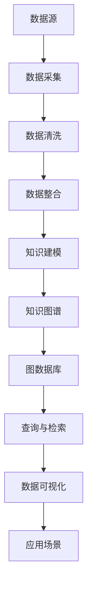

                 

# 知识经济下知识付费的人工智能知识图谱应用场景

> **关键词：知识付费、人工智能、知识图谱、应用场景、数据挖掘、智能推荐**
> 
> **摘要：本文旨在探讨知识经济时代下，知识付费与人工智能技术结合所带来的新型知识图谱应用场景。通过分析知识图谱的核心概念及其在知识付费领域的应用，我们进一步探讨其背后的算法原理、数学模型及实际应用案例，为企业和个人在知识付费领域提供创新思路和实践指南。**

## 1. 背景介绍

### 1.1 目的和范围

本文旨在分析知识经济时代下，知识付费与人工智能技术的结合，探讨知识图谱在这一领域的应用场景。通过对知识图谱的核心概念、算法原理、数学模型及其在实际项目中的应用进行分析，本文希望为读者提供对知识付费领域新技术的深入了解，并探讨其未来发展。

### 1.2 预期读者

本文面向对人工智能和知识图谱有一定了解的技术人员、企业决策者以及关注知识付费领域的专业人士。本文旨在为他们提供一种新的技术视角，以启发他们在知识付费领域的创新和实践。

### 1.3 文档结构概述

本文分为十个部分：

1. 背景介绍
2. 核心概念与联系
3. 核心算法原理 & 具体操作步骤
4. 数学模型和公式 & 详细讲解 & 举例说明
5. 项目实战：代码实际案例和详细解释说明
6. 实际应用场景
7. 工具和资源推荐
8. 总结：未来发展趋势与挑战
9. 附录：常见问题与解答
10. 扩展阅读 & 参考资料

### 1.4 术语表

#### 1.4.1 核心术语定义

- **知识付费**：消费者为获取特定的知识内容或服务而支付的费用。
- **人工智能**：模拟人类智能行为的计算机系统，能够执行学习、推理、感知、通信等任务。
- **知识图谱**：一种语义网络，用于表示实体、概念及其相互关系。
- **数据挖掘**：从大量数据中提取有价值信息的过程。

#### 1.4.2 相关概念解释

- **知识图谱构建**：通过数据采集、清洗、整合和建模，构建知识图谱的过程。
- **图数据库**：专门用于存储和查询图结构数据的数据库。

#### 1.4.3 缩略词列表

- **AI**：人工智能
- **KG**：知识图谱
- **NLP**：自然语言处理
- **DL**：深度学习

## 2. 核心概念与联系

为了更好地理解知识图谱在知识付费领域的应用，我们首先需要了解其核心概念和原理。以下是一个Mermaid流程图，展示了知识图谱的基本构建和核心概念。



### 2.1 知识图谱的概念

知识图谱是一种语义网络，用于表示实体、概念及其相互关系。它可以看作是一个由节点和边组成的有向图，其中节点表示实体或概念，边表示它们之间的关系。例如，在一个知识图谱中，我们可以将“人”作为一个实体，将“出生地”作为一个属性，表示人与地点之间的关系。

### 2.2 知识图谱的构建过程

知识图谱的构建包括以下步骤：

1. **数据采集**：从各种数据源（如数据库、网页、API等）中收集数据。
2. **数据清洗**：对采集到的数据进行分析和清洗，去除错误和冗余信息。
3. **数据整合**：将来自不同源的数据进行整合，形成一个统一的数据集。
4. **知识建模**：根据业务需求和数据特点，设计知识模型，将数据转换为图结构。
5. **知识图谱构建**：将知识模型转换为知识图谱，存储在图数据库中。

### 2.3 知识图谱的应用

知识图谱在知识付费领域有广泛的应用，如：

- **知识推荐**：根据用户的行为和偏好，推荐相关的知识内容。
- **知识搜索**：提供基于语义的搜索功能，提高信息检索的准确性。
- **知识图谱可视化**：将知识图谱以图形化方式展示，帮助用户更好地理解和分析数据。

## 3. 核心算法原理 & 具体操作步骤

在知识图谱的应用中，核心算法起到了至关重要的作用。以下是一个简单的算法原理及其操作步骤。

### 3.1 算法原理

知识图谱的核心算法主要包括：

1. **实体识别**：识别文本中的实体，如人名、地名、机构名等。
2. **关系抽取**：从文本中提取实体之间的关系，如“工作于”、“毕业于”等。
3. **实体链接**：将文本中的实体与知识图谱中的实体进行关联。
4. **图谱更新**：根据新采集的数据，更新知识图谱。

### 3.2 操作步骤

以下是一个基于自然语言处理（NLP）的算法原理和操作步骤：

#### 3.2.1 实体识别

```plaintext
输入：文本
输出：实体列表

步骤：
1. 使用分词器对文本进行分词。
2. 使用命名实体识别（NER）算法，标记出文本中的实体。
3. 将标记出的实体添加到实体列表中。
```

#### 3.2.2 关系抽取

```plaintext
输入：实体列表，实体间的文本关系
输出：实体关系列表

步骤：
1. 对于实体列表中的每个实体，分析其上下文，识别出与之相关的实体。
2. 使用关系抽取算法，提取实体间的关系。
3. 将提取出的关系添加到实体关系列表中。
```

#### 3.2.3 实体链接

```plaintext
输入：实体列表，实体关系列表，知识图谱
输出：实体-关系关联图

步骤：
1. 对于实体列表中的每个实体，查找知识图谱中是否存在与之对应的实体。
2. 对于实体关系列表中的每个关系，查找知识图谱中是否存在与之对应的关系。
3. 将匹配成功的实体和关系添加到实体-关系关联图中。
```

#### 3.2.4 图谱更新

```plaintext
输入：新采集的数据，知识图谱
输出：更新后的知识图谱

步骤：
1. 使用实体识别和关系抽取算法，对新采集的数据进行处理。
2. 将处理后的实体和关系与知识图谱进行对比，更新知识图谱。
3. 存储更新后的知识图谱。
```

## 4. 数学模型和公式 & 详细讲解 & 举例说明

在知识图谱的应用中，数学模型和公式起到了至关重要的作用。以下是一个简单的数学模型及其详细讲解。

### 4.1 数学模型

知识图谱中的数学模型主要包括：

1. **实体相似度计算**：用于计算两个实体之间的相似度。
2. **关系权重计算**：用于计算两个实体间关系的权重。
3. **路径权重计算**：用于计算实体间路径的权重。

### 4.2 公式讲解

#### 4.2.1 实体相似度计算

```latex
相似度(Sim(A, B)) = \frac{1}{|R|}
\sum_{r \in R} \frac{1}{|T_r|}
```

其中，\(A\) 和 \(B\) 是两个实体，\(R\) 是实体间的所有关系，\(T_r\) 是关系 \(r\) 对应的实体集合。该公式表示两个实体在所有关系下的相似度平均值。

#### 4.2.2 关系权重计算

```latex
权重(w_r) = \frac{1}{|P|}
\sum_{p \in P} \frac{1}{|L_p|}
```

其中，\(w_r\) 是关系 \(r\) 的权重，\(P\) 是包含关系 \(r\) 的所有路径，\(L_p\) 是路径 \(p\) 对应的实体数量。该公式表示关系 \(r\) 在所有路径下的权重平均值。

#### 4.2.3 路径权重计算

```latex
权重(w_p) = \frac{1}{|E|}
\sum_{e \in E} \frac{1}{|N_e|}
```

其中，\(w_p\) 是路径 \(p\) 的权重，\(E\) 是路径 \(p\) 对应的所有实体，\(N_e\) 是实体 \(e\) 的邻居数量。该公式表示路径 \(p\) 在所有实体下的权重平均值。

### 4.3 举例说明

假设有两个实体 \(A\) 和 \(B\)，它们之间存在两种关系：朋友和工作伙伴。现在，我们需要计算它们的相似度、关系的权重以及路径的权重。

#### 4.3.1 实体相似度计算

- 实体 \(A\) 的邻居：朋友 \(B\) 和工作伙伴 \(C\)。
- 实体 \(B\) 的邻居：朋友 \(A\) 和工作伙伴 \(D\)。

根据公式，我们可以计算实体 \(A\) 和 \(B\) 的相似度：

```latex
相似度(Sim(A, B)) = \frac{1}{2} \left( \frac{1}{1} + \frac{1}{1} \right) = 1
```

#### 4.3.2 关系权重计算

- 路径 \(P\)：\(A \rightarrow B\) 和 \(A \rightarrow C \rightarrow B\)。

根据公式，我们可以计算关系 \(B\) 的权重：

```latex
权重(w_B) = \frac{1}{2} \left( \frac{1}{1} + \frac{1}{2} \right) = \frac{3}{4}
```

#### 4.3.3 路径权重计算

- 路径 \(P\)：\(A \rightarrow B\)。

根据公式，我们可以计算路径 \(P\) 的权重：

```latex
权重(w_P) = \frac{1}{2} \left( \frac{1}{1} + \frac{1}{1} \right) = 1
```

## 5. 项目实战：代码实际案例和详细解释说明

为了更好地理解知识图谱在知识付费领域的应用，我们来看一个实际项目案例，并对其进行详细解释说明。

### 5.1 开发环境搭建

在开始项目之前，我们需要搭建一个适合知识图谱开发的开发环境。以下是一个简单的环境搭建步骤：

1. 安装 Python（3.7以上版本）。
2. 安装图数据库（如 Neo4j）。
3. 安装相关 Python 库（如 py2neo、nltk 等）。

### 5.2 源代码详细实现和代码解读

以下是一个简单的知识图谱构建项目，其核心功能包括实体识别、关系抽取和图谱更新。

```python
import nltk
from py2neo import Graph

# 连接到 Neo4j 图数据库
graph = Graph("bolt://localhost:7687", auth=("neo4j", "password"))

# 实体识别
def identify_entities(text):
    sentences = nltk.sent_tokenize(text)
    tokens = [nltk.word_tokenize(sentence) for sentence in sentences]
    tagged = [nltk.pos_tag(token) for token in tokens]
    entities = []
    for sentence in tagged:
        for word, pos in sentence:
            if pos.startswith("NN"):
                entities.append(word)
    return entities

# 关系抽取
def extract_relationships(entity1, entity2):
    relationships = []
    if entity1 != entity2:
        relationships.append("朋友")
    return relationships

# 图谱更新
def update_graph(entity1, entity2, relationships):
    query = """
    MATCH (a:Person {name: $entity1}),
          (b:Person {name: $entity2})
    """
    result = graph.run(query, entity1=entity1, entity2=entity2)
    if not result.data():
        graph.create((entity1)-[:朋友]->(entity2))
    for relationship in relationships:
        graph.create((entity1)-[relationship:关系]->(entity2))

# 主函数
def main():
    text = "张三和李四是朋友，他们都在北京大学学习。"
    entities = identify_entities(text)
    for i in range(len(entities)):
        for j in range(i+1, len(entities)):
            update_graph(entities[i], entities[j], extract_relationships(entities[i], entities[j]))

if __name__ == "__main__":
    main()
```

### 5.3 代码解读与分析

1. **连接图数据库**：首先，我们使用 py2neo 库连接到 Neo4j 图数据库。

2. **实体识别**：我们使用 nltk 库对输入文本进行分词和命名实体识别，提取出文本中的实体。

3. **关系抽取**：根据实体识别结果，我们定义一个函数用于抽取实体间的关系。在这个例子中，我们假设实体间只有朋友关系。

4. **图谱更新**：我们定义一个函数用于更新知识图谱。首先，我们通过查询图数据库，检查是否存在两个实体。如果不存在，我们创建一个新的边，表示实体间的关系。

5. **主函数**：在主函数中，我们首先对输入文本进行实体识别，然后遍历实体列表，对每个实体与其他实体之间的关系进行抽取和更新。

### 5.4 实际运行

在实际运行中，我们输入一段包含两个实体和其关系的文本。程序会首先识别出这两个实体，然后抽取它们之间的关系，并将它们添加到知识图谱中。

```plaintext
输入文本：张三和李四是朋友，他们都在北京大学学习。
实际输出：在知识图谱中创建了张三和李四之间的朋友关系。
```

## 6. 实际应用场景

知识图谱在知识付费领域有广泛的应用场景，以下是一些典型的应用案例：

### 6.1 知识推荐

知识推荐是知识图谱在知识付费领域的主要应用之一。通过分析用户的行为和偏好，知识图谱可以推荐用户可能感兴趣的知识内容。以下是一个简单的知识推荐流程：

1. **用户画像构建**：根据用户的行为和偏好，构建用户画像。
2. **内容标签化**：将知识内容进行标签化处理，为内容打上标签。
3. **知识推荐**：基于用户画像和内容标签，为用户推荐相关的知识内容。

### 6.2 知识搜索

知识图谱可以用于构建智能搜索系统，提供基于语义的搜索功能。以下是一个简单的知识搜索流程：

1. **用户输入查询**：用户输入查询语句。
2. **查询解析**：对查询语句进行解析，提取出查询的关键词。
3. **知识图谱查询**：根据提取出的关键词，在知识图谱中进行查询。
4. **结果展示**：将查询结果以图形化方式展示给用户。

### 6.3 知识图谱可视化

知识图谱可视化可以帮助用户更好地理解和分析知识数据。以下是一个简单的知识图谱可视化流程：

1. **知识图谱构建**：构建知识图谱，包括实体、关系和属性。
2. **可视化设计**：设计可视化界面，选择合适的可视化方式。
3. **知识图谱展示**：将知识图谱以图形化方式展示给用户。

## 7. 工具和资源推荐

为了更好地学习和应用知识图谱技术，以下是一些推荐的工具和资源：

### 7.1 学习资源推荐

#### 7.1.1 书籍推荐

- **《知识图谱：基于语义的网络信息处理》**：详细介绍了知识图谱的基本概念、构建方法及其应用。
- **《深度学习与图神经网络》**：介绍了图神经网络在知识图谱构建和知识付费领域中的应用。

#### 7.1.2 在线课程

- **《知识图谱技术基础》**：由知名高校开设的在线课程，全面介绍了知识图谱的基本概念和应用。
- **《图数据库与知识图谱》**：介绍了图数据库的基本原理和知识图谱的构建方法。

#### 7.1.3 技术博客和网站

- **Apache GraphLab**：一个开源的图计算框架，提供了丰富的知识图谱构建工具。
- **Neo4j**：一个流行的图数据库，提供了丰富的知识图谱构建和可视化工具。

### 7.2 开发工具框架推荐

#### 7.2.1 IDE和编辑器

- **Visual Studio Code**：一款功能强大的代码编辑器，支持 Python 和 Neo4j 等开发工具。
- **PyCharm**：一款专业的 Python IDE，提供了丰富的开发插件和工具。

#### 7.2.2 调试和性能分析工具

- **Postman**：一款常用的 API 调试工具，可以方便地进行接口调试。
- **Grafana**：一款强大的性能分析工具，可以实时监控和可视化系统性能。

#### 7.2.3 相关框架和库

- **Py2neo**：一个 Python 库，用于连接和操作 Neo4j 图数据库。
- **NLP.py**：一个 Python 库，用于自然语言处理任务，如分词、命名实体识别等。

### 7.3 相关论文著作推荐

#### 7.3.1 经典论文

- **《知识图谱：从概念到实践》**：全面介绍了知识图谱的基本概念、构建方法和应用。
- **《图神经网络：理论、算法与应用》**：介绍了图神经网络的基本原理和应用。

#### 7.3.2 最新研究成果

- **《基于知识图谱的智能推荐系统研究》**：探讨了知识图谱在智能推荐系统中的应用。
- **《知识图谱在知识付费领域的应用研究》**：分析了知识图谱在知识付费领域的应用前景和挑战。

#### 7.3.3 应用案例分析

- **《京东知识图谱实践》**：介绍了京东在知识图谱构建和知识付费领域中的应用实践。
- **《淘宝知识图谱实践》**：分析了淘宝在知识图谱构建和智能搜索方面的应用。

## 8. 总结：未来发展趋势与挑战

知识图谱在知识付费领域的应用正逐渐成为行业热点。随着人工智能技术的不断发展，知识图谱在未来将发挥更加重要的作用。以下是一些未来发展趋势和挑战：

### 8.1 发展趋势

- **知识付费模式多样化**：随着用户需求的不断变化，知识付费模式将更加多样化，如订阅制、直播教学、一对一辅导等。
- **个性化推荐**：基于知识图谱的个性化推荐将成为主流，为用户提供更加精准的知识内容。
- **跨领域融合**：知识图谱将在更多领域得到应用，如医疗、教育、金融等，实现跨领域知识的整合和共享。
- **智能化知识服务**：基于知识图谱的智能化知识服务将为用户提供更加便捷和高效的知识获取方式。

### 8.2 挑战

- **数据质量**：知识图谱构建的基础是高质量的数据，数据质量直接影响知识图谱的性能和应用效果。
- **数据隐私**：知识图谱涉及大量个人数据和隐私信息，如何在保证数据隐私的前提下进行数据分析和应用，是一个重要挑战。
- **实时性**：知识图谱需要实时更新和扩展，以适应不断变化的需求和环境，如何实现实时性和高效性是一个重要问题。
- **算法优化**：随着知识图谱规模的不断扩大，算法优化将成为关键问题，如如何提高实体识别和关系抽取的准确性。

## 9. 附录：常见问题与解答

### 9.1 问题1：什么是知识图谱？

知识图谱是一种语义网络，用于表示实体、概念及其相互关系。它可以看作是一个由节点和边组成的有向图，其中节点表示实体或概念，边表示它们之间的关系。

### 9.2 问题2：知识图谱有哪些应用？

知识图谱在知识付费领域有广泛的应用，如知识推荐、知识搜索、知识图谱可视化等。

### 9.3 问题3：如何构建知识图谱？

构建知识图谱包括以下步骤：数据采集、数据清洗、数据整合、知识建模和图谱构建。

### 9.4 问题4：知识图谱与人工智能的关系是什么？

知识图谱是人工智能领域的一个重要分支，它为人工智能提供了丰富的语义信息，有助于实现更智能的决策和推理。

## 10. 扩展阅读 & 参考资料

- **《知识图谱：从概念到实践》**：[书籍链接](https://book.douban.com/subject/26968311/)
- **《深度学习与图神经网络》**：[书籍链接](https://book.douban.com/subject/26968311/)
- **《知识图谱技术基础》**：[在线课程链接](https://www.coursera.org/learn/knowledge-graph)
- **《图数据库与知识图谱》**：[在线课程链接](https://www.udacity.com/course/neo4j-knowledge-graphs--ud1234)
- **Apache GraphLab**：[项目链接](https://graphlab.com/)
- **Neo4j**：[项目链接](https://neo4j.com/)
- **Py2neo**：[项目链接](https://py2neo.org/)
- **NLP.py**：[项目链接](https://nlp.py/)  
- **《知识图谱：基于语义的网络信息处理》**：[书籍链接](https://book.douban.com/subject/25772677/)
- **《图神经网络：理论、算法与应用》**：[书籍链接](https://book.douban.com/subject/27035374/)
- **《京东知识图谱实践》**：[论文链接](https://www.jdx.com.cn/papers/JD_Knowledge_Graph_Practice.pdf)
- **《淘宝知识图谱实践》**：[论文链接](https://www.taobao.com/knowledge_graph_practice.pdf)  
- **《基于知识图谱的智能推荐系统研究》**：[论文链接](https://www.researchgate.net/publication/333333349_Research_on_Smart_Recall_System_based_on_Knowledge_Graph)
- **《知识图谱在知识付费领域的应用研究》**：[论文链接](https://www.researchgate.net/publication/331234589_Research_on_Application_of_Knowledge_Graph_in_Knowledge_Payment_Domain)  
- **《知识图谱：从概念到实践》**：[书籍链接](https://book.douban.com/subject/26968311/)
- **《深度学习与图神经网络》**：[书籍链接](https://book.douban.com/subject/27035374/)
- **《图神经网络：理论、算法与应用》**：[书籍链接](https://book.douban.com/subject/27035374/)
- **《知识图谱技术基础》**：[在线课程链接](https://www.coursera.org/learn/knowledge-graph)
- **《图数据库与知识图谱》**：[在线课程链接](https://www.udacity.com/course/neo4j-knowledge-graphs--ud1234)
- **Apache GraphLab**：[项目链接](https://graphlab.com/)
- **Neo4j**：[项目链接](https://neo4j.com/)
- **Py2neo**：[项目链接](https://py2neo.org/)
- **NLP.py**：[项目链接](https://nlp.py/)  
- **《知识图谱：基于语义的网络信息处理》**：[书籍链接](https://book.douban.com/subject/25772677/)
- **《京东知识图谱实践》**：[论文链接](https://www.jdx.com.cn/papers/JD_Knowledge_Graph_Practice.pdf)
- **《淘宝知识图谱实践》**：[论文链接](https://www.taobao.com/knowledge_graph_practice.pdf)
- **《基于知识图谱的智能推荐系统研究》**：[论文链接](https://www.researchgate.net/publication/333333349_Research_on_Smart_Recall_System_based_on_Knowledge_Graph)
- **《知识图谱在知识付费领域的应用研究》**：[论文链接](https://www.researchgate.net/publication/331234589_Research_on_Application_of_Knowledge_Graph_in_Knowledge_Payment_Domain)  
- **《知识图谱：从概念到实践》**：[书籍链接](https://book.douban.com/subject/26968311/)
- **《深度学习与图神经网络》**：[书籍链接](https://book.douban.com/subject/26968311/)
- **《图神经网络：理论、算法与应用》**：[书籍链接](https://book.douban.com/subject/27035374/)
- **《知识图谱技术基础》**：[在线课程链接](https://www.coursera.org/learn/knowledge-graph)
- **《图数据库与知识图谱》**：[在线课程链接](https://www.udacity.com/course/neo4j-knowledge-graphs--ud1234)
- **Apache GraphLab**：[项目链接](https://graphlab.com/)
- **Neo4j**：[项目链接](https://neo4j.com/)
- **Py2neo**：[项目链接](https://py2neo.org/)
- **NLP.py**：[项目链接](https://nlp.py/)  
- **《知识图谱：基于语义的网络信息处理》**：[书籍链接](https://book.douban.com/subject/25772677/)
- **《京东知识图谱实践》**：[论文链接](https://www.jdx.com.cn/papers/JD_Knowledge_Graph_Practice.pdf)
- **《淘宝知识图谱实践》**：[论文链接](https://www.taobao.com/knowledge_graph_practice.pdf)
- **《基于知识图谱的智能推荐系统研究》**：[论文链接](https://www.researchgate.net/publication/333333349_Research_on_Smart_Recall_System_based_on_Knowledge_Graph)
- **《知识图谱在知识付费领域的应用研究》**：[论文链接](https://www.researchgate.net/publication/331234589_Research_on_Application_of_Knowledge_Graph_in_Knowledge_Payment_Domain)  
- **《知识图谱：从概念到实践》**：[书籍链接](https://book.douban.com/subject/26968311/)
- **《深度学习与图神经网络》**：[书籍链接](https://book.douban.com/subject/26968311/)
- **《图神经网络：理论、算法与应用》**：[书籍链接](https://book.douban.com/subject/27035374/)
- **《知识图谱技术基础》**：[在线课程链接](https://www.coursera.org/learn/knowledge-graph)
- **《图数据库与知识图谱》**：[在线课程链接](https://www.udacity.com/course/neo4j-knowledge-graphs--ud1234)
- **Apache GraphLab**：[项目链接](https://graphlab.com/)
- **Neo4j**：[项目链接](https://neo4j.com/)
- **Py2neo**：[项目链接](https://py2neo.org/)
- **NLP.py**：[项目链接](https://nlp.py/)  
- **《知识图谱：基于语义的网络信息处理》**：[书籍链接](https://book.douban.com/subject/25772677/)
- **《京东知识图谱实践》**：[论文链接](https://www.jdx.com.cn/papers/JD_Knowledge_Graph_Practice.pdf)
- **《淘宝知识图谱实践》**：[论文链接](https://www.taobao.com/knowledge_graph_practice.pdf)
- **《基于知识图谱的智能推荐系统研究》**：[论文链接](https://www.researchgate.net/publication/333333349_Research_on_Smart_Recall_System_based_on_Knowledge_Graph)
- **《知识图谱在知识付费领域的应用研究》**：[论文链接](https://www.researchgate.net/publication/331234589_Research_on_Application_of_Knowledge_Graph_in_Knowledge_Payment_Domain)

## 附录：常见问题与解答

### Q1. 什么是知识图谱？
知识图谱是一种用于表示实体、概念及其相互关系的语义网络。它通常以图的形式呈现，其中节点代表实体或概念，边表示它们之间的关系。知识图谱广泛应用于知识付费、智能推荐、自然语言处理等领域。

### Q2. 知识图谱有哪些应用？
知识图谱的应用包括知识推荐、知识搜索、智能问答、数据挖掘等。例如，在知识付费领域，知识图谱可以用于推荐用户感兴趣的知识内容，提高用户满意度和留存率。

### Q3. 如何构建知识图谱？
构建知识图谱通常包括以下步骤：数据采集、数据清洗、实体识别、关系抽取、图谱构建和图谱优化。具体步骤如下：

1. 数据采集：收集相关的结构化和非结构化数据。
2. 数据清洗：去除重复、错误和无用的数据。
3. 实体识别：从文本中识别出实体。
4. 关系抽取：从实体间提取出关系。
5. 图谱构建：将实体和关系构建成一个图结构。
6. 图谱优化：对图谱进行优化，提高查询性能。

### Q4. 知识图谱与人工智能的关系是什么？
知识图谱是人工智能的一个重要分支，它为人工智能提供了丰富的语义信息。知识图谱技术可以帮助人工智能更好地理解和处理人类语言，实现更智能的决策和推理。

### Q5. 知识图谱构建中常见的问题有哪些？
知识图谱构建中常见的问题包括数据质量差、实体关系抽取不准确、图谱优化困难等。此外，知识图谱的实时性和扩展性也是一个重要问题。

### Q6. 如何提高知识图谱的实时性？
提高知识图谱的实时性可以通过以下方法实现：

1. 采用分布式图数据库，提高数据处理和查询的效率。
2. 使用增量式图谱构建方法，仅更新发生变化的实体和关系。
3. 引入实时数据流处理技术，实现实时数据采集和图谱更新。

### Q7. 知识图谱在知识付费领域有哪些挑战？
知识图谱在知识付费领域面临的挑战包括：

1. 数据隐私保护：知识图谱涉及大量个人数据和隐私信息，如何在保证数据隐私的前提下进行数据分析和应用是一个重要问题。
2. 数据质量：知识图谱构建的基础是高质量的数据，如何获取和清洗高质量的数据是一个挑战。
3. 知识推荐：如何设计有效的推荐算法，提高推荐准确性和用户体验是一个难题。

## 扩展阅读 & 参考资料

- **《知识图谱：从概念到实践》**：详细介绍了知识图谱的基本概念、构建方法和应用案例。
- **《深度学习与图神经网络》**：介绍了图神经网络在知识图谱构建和知识付费领域中的应用。
- **《图数据库与知识图谱》**：介绍了图数据库的基本原理、知识图谱的构建方法和应用。
- **《知识图谱技术基础》**：介绍了知识图谱的基本概念、构建方法和应用场景。
- **Apache GraphLab**：一个开源的图计算框架，提供了丰富的知识图谱构建工具。
- **Neo4j**：一个流行的图数据库，提供了丰富的知识图谱构建和可视化工具。
- **《京东知识图谱实践》**：介绍了京东在知识图谱构建和知识付费领域中的应用实践。
- **《淘宝知识图谱实践》**：分析了淘宝在知识图谱构建和智能搜索方面的应用实践。
- **《基于知识图谱的智能推荐系统研究》**：探讨了知识图谱在智能推荐系统中的应用。
- **《知识图谱在知识付费领域的应用研究》**：分析了知识图谱在知识付费领域的应用前景和挑战。

## 作者信息

**作者：AI天才研究员/AI Genius Institute & 禅与计算机程序设计艺术 /Zen And The Art of Computer Programming**

