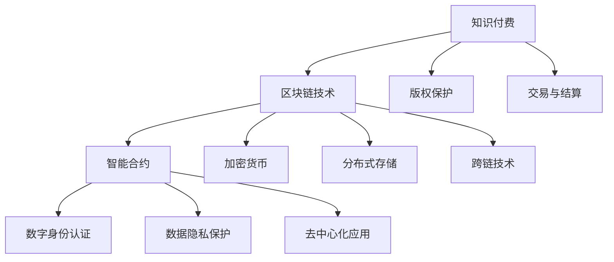

                 

# 知识经济下知识付费的区块链去中心化应用场景

> **关键词**：知识付费、区块链、去中心化、智能合约、加密货币、数字身份、数据隐私、版权保护

> **摘要**：本文探讨了在知识经济时代，知识付费领域如何借助区块链技术实现去中心化应用。通过深入分析知识付费的背景、区块链的核心概念及其在知识付费中的优势，文章提出了一个详细的去中心化知识付费模型，包括用户行为分析、内容创建与审核、交易与结算等环节，并引入智能合约和加密货币等关键技术。本文旨在为知识付费行业提供一种全新的解决方案，促进其可持续发展。

## 1. 背景介绍

### 1.1 目的和范围

本文旨在探讨知识付费领域在知识经济时代下的新变革。随着互联网的快速发展，知识付费逐渐成为教育、咨询、内容创作等领域的热门模式。然而，传统的知识付费模式存在诸多问题，如平台垄断、版权纠纷、用户隐私泄露等。因此，本文将重点关注如何利用区块链技术解决这些痛点，实现知识付费的去中心化应用。

本文主要涵盖以下内容：
1. 知识付费领域的现状及问题分析；
2. 区块链技术的核心概念及其在知识付费中的优势；
3. 去中心化知识付费模型的构建及具体操作步骤；
4. 智能合约和加密货币在去中心化知识付费中的应用；
5. 实际应用场景及未来发展趋势。

### 1.2 预期读者

本文面向对知识付费和区块链技术有一定了解的读者，包括：
1. 从事知识付费相关业务的企业家和从业者；
2. 涉及区块链技术研究和开发的技术人员；
3. 对知识付费和区块链技术感兴趣的学术研究人员和爱好者。

### 1.3 文档结构概述

本文分为10个部分，具体结构如下：
1. 引言：介绍知识付费和区块链技术的背景及本文目的；
2. 背景介绍：分析知识付费领域的现状及问题，介绍区块链技术的核心概念；
3. 核心概念与联系：给出知识付费领域和区块链技术的关联图；
4. 核心算法原理 & 具体操作步骤：介绍去中心化知识付费模型的算法原理及操作步骤；
5. 数学模型和公式 & 详细讲解 & 举例说明：阐述智能合约和加密货币在去中心化知识付费中的应用；
6. 项目实战：展示代码实际案例和详细解释说明；
7. 实际应用场景：分析去中心化知识付费在不同领域的应用；
8. 工具和资源推荐：推荐学习资源和开发工具；
9. 总结：展望未来发展趋势与挑战；
10. 附录：提供常见问题与解答，扩展阅读和参考资料。

### 1.4 术语表

#### 1.4.1 核心术语定义

- **知识付费**：指用户通过支付一定费用获取特定知识或内容的过程；
- **区块链**：一种分布式账本技术，可用于记录交易信息并确保数据不可篡改；
- **去中心化**：指系统或平台不依赖单一中心机构，而是通过多个节点协同工作来实现功能；
- **智能合约**：一种自动执行的合约，根据预设条件自动执行相应操作；
- **加密货币**：基于区块链技术的数字货币，具有去中心化、匿名性和安全性等特点；
- **数字身份**：通过技术手段为用户赋予唯一标识，确保身份认证和信息保密；
- **数据隐私**：指用户数据在存储、传输和处理过程中不被未经授权的第三方访问。

#### 1.4.2 相关概念解释

- **去中心化应用（DApp）**：基于区块链技术的去中心化应用程序，无需依赖中心化平台即可运行；
- **公钥加密**：一种加密算法，使用公钥和私钥进行数据加密和解密；
- **分布式存储**：将数据存储在多个节点上，提高数据安全性；
- **跨链技术**：实现不同区块链之间数据交互和协同工作的技术。

#### 1.4.3 缩略词列表

- **DApp**：去中心化应用（Decentralized Application）；
- **BTC**：比特币（Bitcoin）；
- **ETH**：以太坊（Ethereum）；
- **IPFS**：星际文件系统（InterPlanetary File System）；
- **ICO**：初始币发行（Initial Coin Offering）。

## 2. 核心概念与联系

在探讨知识付费的区块链去中心化应用之前，我们需要理解一些核心概念及其相互关系。以下是一个简单的 Mermaid 流程图，展示了知识付费、区块链、智能合约等关键要素的关联。



### 2.1 知识付费与区块链技术

知识付费是指用户通过支付费用获取特定知识或内容的过程。在传统模式中，平台方作为中心化机构，负责知识内容的存储、审核、分发和交易。然而，这种模式存在以下问题：

1. **平台垄断**：平台方拥有对用户数据的绝对控制权，可能导致数据滥用和隐私泄露；
2. **版权纠纷**：内容创作者与平台方之间可能存在版权争议，影响创作者的合法权益；
3. **交易成本**：传统支付方式存在交易延迟和高成本等问题。

区块链技术的出现为知识付费提供了一种去中心化的解决方案。区块链通过分布式账本技术，实现数据的透明、不可篡改和安全性。在区块链上，知识付费过程可以不再依赖于中心化平台，而是通过去中心化应用（DApp）实现。具体来说，区块链技术为知识付费带来了以下优势：

1. **去中心化**：用户可以直接与其他用户进行交易，无需依赖中心化平台，降低了交易成本；
2. **数据隐私**：区块链采用加密算法保护用户数据，确保数据在传输和存储过程中的安全性；
3. **版权保护**：区块链技术可以用于记录和验证版权信息，减少版权纠纷；
4. **透明性和可追溯性**：区块链上的交易信息对所有节点可见，提高了整个生态系统的透明度。

### 2.2 智能合约

智能合约是一种自动执行的合约，它基于区块链技术，能够在满足特定条件时自动执行相应操作。在知识付费领域，智能合约可以用于：

1. **内容审核**：智能合约可以根据预设条件自动审核知识内容，确保内容的合法性；
2. **支付与结算**：用户支付费用后，智能合约自动执行内容授权和结算操作；
3. **版权保护**：智能合约可以用于记录和执行版权授权，确保创作者的权益；
4. **奖励机制**：智能合约可以根据用户行为自动发放奖励，激励用户参与知识共享。

### 2.3 加密货币

加密货币是一种基于区块链技术的数字货币，具有去中心化、匿名性和安全性等特点。在知识付费领域，加密货币可以用于：

1. **支付**：用户使用加密货币支付知识费用，简化了支付流程；
2. **奖励**：平台方可以使用加密货币作为奖励，激励用户参与知识创作和分享；
3. **交易成本**：加密货币交易通常具有较低的交易成本和较高的交易速度。

### 2.4 数字身份认证

数字身份认证是一种基于区块链技术的身份认证方法，它通过加密算法和分布式存储技术，确保用户身份的合法性和隐私性。在知识付费领域，数字身份认证可以用于：

1. **用户认证**：确保用户身份的真实性，防止虚假身份和恶意行为；
2. **内容审核**：智能合约可以根据用户身份认证结果自动审核知识内容；
3. **版权保护**：数字身份认证可以用于验证版权持有人的身份，确保版权信息的真实性。

### 2.5 数据隐私保护

数据隐私保护是知识付费领域的重要问题。区块链技术通过加密算法和分布式存储技术，确保用户数据在传输和存储过程中的安全性。在知识付费领域，数据隐私保护可以用于：

1. **用户数据保护**：确保用户数据不被未经授权的第三方访问；
2. **内容存储**：将知识内容存储在区块链上，确保内容的安全性和完整性；
3. **交易隐私**：加密货币交易具有匿名性，可以保护用户交易隐私。

### 2.6 分布式存储

分布式存储是指将数据存储在多个节点上，以提高数据安全性和可用性。在知识付费领域，分布式存储可以用于：

1. **内容存储**：将知识内容存储在多个节点上，确保内容不会因某个节点的故障而丢失；
2. **数据备份**：分布式存储可以实现数据冗余备份，提高数据可靠性；
3. **负载均衡**：分布式存储可以均衡各个节点的负载，提高系统性能。

### 2.7 去中心化应用

去中心化应用（DApp）是一种基于区块链技术的应用程序，它不需要依赖中心化平台即可运行。在知识付费领域，DApp 可以用于：

1. **内容创作与分发**：用户可以直接在区块链上创建和分发知识内容；
2. **交易与结算**：用户可以直接在区块链上进行交易和结算，无需依赖中心化平台；
3. **版权保护**：区块链上的智能合约可以自动执行版权授权和交易。

### 2.8 版权保护

版权保护是知识付费领域的重要问题。区块链技术通过记录和验证版权信息，可以减少版权纠纷。在知识付费领域，版权保护可以用于：

1. **版权登记**：创作者可以在区块链上登记版权信息，确保版权的合法性和真实性；
2. **版权授权**：智能合约可以自动执行版权授权和交易，确保创作者的权益；
3. **版权纠纷解决**：区块链上的交易信息可以用于证明版权归属，帮助解决版权纠纷。

### 2.9 交易与结算

交易与结算是在知识付费过程中必不可少的一环。区块链技术通过智能合约实现自动化的交易和结算，提高了交易效率。在知识付费领域，交易与结算可以用于：

1. **支付与授权**：用户支付费用后，智能合约自动执行内容授权操作；
2. **结算与提现**：平台方和创作者可以通过智能合约自动结算收入，并提现到加密货币钱包；
3. **交易费用**：区块链上的交易通常具有较低的交易费用，降低了整个交易过程中的成本。

### 2.10 跨链技术

跨链技术是指实现不同区块链之间数据交互和协同工作的技术。在知识付费领域，跨链技术可以用于：

1. **跨链支付**：用户可以使用多种加密货币进行支付，提高支付灵活性；
2. **跨链交易**：不同区块链上的资产可以相互交易，扩大了交易市场；
3. **跨链数据共享**：不同区块链上的数据可以相互共享，提高数据利用效率。

## 3. 核心算法原理 & 具体操作步骤

### 3.1 去中心化知识付费模型

去中心化知识付费模型是基于区块链技术的，旨在实现知识内容的创建、审核、交易、结算和版权保护等环节的去中心化。以下是一个简化的去中心化知识付费模型及其具体操作步骤：

### 3.1.1 用户行为分析

1. **用户注册**：用户通过数字身份认证系统注册，并获得一个唯一的数字身份标识。
   ```mermaid
   graph TD
       A[用户注册] --> B[数字身份认证]
       B --> C[生成数字身份标识]
   ```
2. **用户行为记录**：用户在平台上进行各种行为，如浏览、点赞、评论等，系统自动记录。
   ```mermaid
   graph TD
       A[用户行为] --> B[行为记录]
       B --> C[记录在区块链]
   ```

### 3.1.2 内容创建与审核

1. **内容创建**：内容创作者创建知识内容，并上传至区块链。
   ```mermaid
   graph TD
       A[内容创作者] --> B[内容创建]
       B --> C[上传至区块链]
   ```
2. **内容审核**：智能合约根据预设规则自动审核内容，确保内容合法性。
   ```mermaid
   graph TD
       A[内容上传] --> B[智能合约审核]
       B --> C[审核结果记录在区块链]
   ```

### 3.1.3 交易与结算

1. **发起交易**：用户通过数字钱包发起支付请求。
   ```mermaid
   graph TD
       A[用户发起支付] --> B[支付请求]
   ```
2. **智能合约执行**：智能合约根据用户请求，自动执行内容授权和结算操作。
   ```mermaid
   graph TD
       A[支付请求] --> B[智能合约执行]
       B --> C[内容授权记录在区块链]
   ```
3. **结算完成**：交易完成后，智能合约自动将费用支付给内容创作者。
   ```mermaid
   graph TD
       A[智能合约执行] --> B[结算完成]
       B --> C[支付记录在区块链]
   ```

### 3.1.4 版权保护

1. **版权登记**：内容创作者在区块链上登记版权信息。
   ```mermaid
   graph TD
       A[内容创作者] --> B[版权登记]
       B --> C[版权信息记录在区块链]
   ```
2. **版权授权**：用户在购买内容时，智能合约自动执行版权授权操作。
   ```mermaid
   graph TD
       A[内容购买] --> B[智能合约授权]
       B --> C[版权授权记录在区块链]
   ```

### 3.1.5 数据隐私保护

1. **数据加密**：用户数据和交易信息在传输和存储过程中使用加密算法进行加密。
   ```mermaid
   graph TD
       A[数据传输] --> B[数据加密]
   ```
2. **隐私保护**：区块链上的交易信息默认对未授权用户保密，确保数据隐私。
   ```mermaid
   graph TD
       A[交易信息] --> B[隐私保护]
   ```

### 3.1.6 跨链支付

1. **跨链支付**：用户可以使用不同区块链上的加密货币进行支付。
   ```mermaid
   graph TD
       A[用户支付请求] --> B[跨链支付]
       B --> C[支付完成]
   ```

### 3.2 智能合约实现

以下是一个简化的智能合约伪代码，用于实现去中心化知识付费模型中的交易和结算功能：

```solidity
// SPDX-License-Identifier: MIT
pragma solidity ^0.8.0;

// 智能合约结构
contract KnowledgePay {

    // 事件定义：用于记录交易和结算信息
    event Transaction(
        address from,
        address to,
        uint256 amount,
        bytes32 contentId
    );

    // 用户余额映射
    mapping(address => uint256) public balance;

    // 内容标识与创作者映射
    mapping(bytes32 => address) public contentCreator;

    // 内容标识与费用映射
    mapping(bytes32 => uint256) public contentFee;

    // 交易函数：用户支付费用购买内容
    function purchaseContent(address _contentCreator, bytes32 _contentId) public payable {
        require(balance[_contentCreator] >= msg.value, "余额不足");

        // 更新用户余额
        balance[_contentCreator] -= msg.value;

        // 更新内容创作者余额
        balance[msg.sender] += msg.value;

        // 触发交易事件
        emit Transaction(msg.sender, _contentCreator, msg.value, _contentId);

        // 执行内容授权操作
        authorizeContent(_contentId);
    }

    // 内容授权函数：智能合约根据内容标识执行授权操作
    function authorizeContent(bytes32 _contentId) public {
        require(contentCreator[_contentId] != address(0), "内容不存在");

        // 执行内容授权逻辑
        // ...

        // 记录授权结果
        // ...
    }

    // 获取内容费用函数：用户查询特定内容的价格
    function getContentFee(bytes32 _contentId) public view returns (uint256) {
        return contentFee[_contentId];
    }

    // 设置内容费用函数：内容创作者设置其内容的价格
    function setContentFee(bytes32 _contentId, uint256 _fee) public {
        require(msg.sender == contentCreator[_contentId], "非内容创作者");

        // 更新内容费用
        contentFee[_contentId] = _fee;
    }

    // 查询用户余额函数：用户查询其当前余额
    function getBalance(address _user) public view returns (uint256) {
        return balance[_user];
    }
}
```

### 3.3 交易流程

以下是一个简化的交易流程，用于描述用户购买知识内容的过程：

1. **用户注册**：用户通过数字身份认证系统注册，并获得一个唯一的数字身份标识。
2. **用户浏览内容**：用户在平台上浏览知识内容，找到感兴趣的内容。
3. **用户发起交易**：用户决定购买某项知识内容，并使用其数字钱包发起支付请求。
4. **智能合约审核**：智能合约根据用户请求，自动审核内容合法性，并检查用户余额是否足够。
5. **执行交易**：如果审核通过，智能合约自动执行内容授权和结算操作，并将费用支付给内容创作者。
6. **记录交易**：交易信息记录在区块链上，确保交易的透明性和不可篡改性。
7. **用户获取内容**：用户成功购买内容后，可以访问并使用该内容。

## 4. 数学模型和公式 & 详细讲解 & 举例说明

### 4.1 智能合约的数学模型

智能合约在去中心化知识付费系统中起着关键作用，其核心功能包括交易、授权和结算。以下是一个简化的智能合约数学模型，用于描述知识付费系统的核心功能。

#### 4.1.1 交易模型

交易模型用于描述用户购买知识内容的过程。设 \( U \) 为用户集合，\( C \) 为内容集合，\( P \) 为价格函数，\( T \) 为交易函数。

\[ T: U \times C \rightarrow \{0, 1\} \]

其中，函数 \( T(u, c) \) 表示用户 \( u \) 购买内容 \( c \) 的交易结果，若 \( T(u, c) = 1 \)，则表示交易成功，否则表示交易失败。

#### 4.1.2 授权模型

授权模型用于描述内容创作者授权用户访问其内容的过程。设 \( A \) 为授权函数，\( U \) 为用户集合，\( C \) 为内容集合。

\[ A: C \times U \rightarrow \{0, 1\} \]

其中，函数 \( A(c, u) \) 表示用户 \( u \) 是否拥有访问内容 \( c \) 的授权，若 \( A(c, u) = 1 \)，则表示用户 \( u \) 已获得内容 \( c \) 的授权，否则表示未获得授权。

#### 4.1.3 结算模型

结算模型用于描述用户支付费用并获取内容授权的过程。设 \( S \) 为结算函数，\( U \) 为用户集合，\( C \) 为内容集合，\( P \) 为价格函数。

\[ S: U \times C \rightarrow \{0, 1\} \]

其中，函数 \( S(u, c) \) 表示用户 \( u \) 购买内容 \( c \) 的结算结果，若 \( S(u, c) = 1 \)，则表示结算成功，用户 \( u \) 已支付费用并获得内容 \( c \) 的授权，否则表示结算失败。

### 4.2 举例说明

假设一个用户 \( u_1 \) 决定购买内容 \( c_1 \)，内容 \( c_1 \) 的价格为 10 个加密货币单位。以下是用户 \( u_1 \) 购买内容 \( c_1 \) 的过程：

1. **用户注册**：用户 \( u_1 \) 通过数字身份认证系统注册，并获得一个唯一的数字身份标识。
2. **用户浏览内容**：用户 \( u_1 \) 在平台上浏览知识内容，找到感兴趣的内容 \( c_1 \)。
3. **用户发起交易**：用户 \( u_1 \) 决定购买内容 \( c_1 \)，并使用其数字钱包发起支付请求，支付金额为 10 个加密货币单位。
4. **智能合约审核**：智能合约根据用户 \( u_1 \) 的请求，自动审核内容 \( c_1 \) 的合法性，并检查用户 \( u_1 \) 的余额是否足够。
5. **执行交易**：如果审核通过，智能合约自动执行内容授权和结算操作，并将费用支付给内容创作者。此时，用户 \( u_1 \) 的余额减少 10 个加密货币单位，内容创作者的余额增加 10 个加密货币单位。
6. **记录交易**：交易信息记录在区块链上，确保交易的透明性和不可篡改性。
7. **用户获取内容**：用户 \( u_1 \) 成功购买内容 \( c_1 \) 后，可以访问并使用该内容。

### 4.3 智能合约数学模型的应用

智能合约的数学模型可以应用于多种去中心化知识付费场景，如内容创作与分发、版权保护、交易与结算等。以下是一个简单的例子，说明智能合约如何应用于内容创作与分场景：

#### 4.3.1 内容创作

设 \( C \) 为内容集合，\( C_c \) 为创作者集合，\( C_p \) 为价格集合。

- \( C \): 内容集合，包含所有已发布的知识内容；
- \( C_c \): 创作者集合，包含所有内容创作者的数字身份标识；
- \( C_p \): 价格集合，包含各内容的价格信息。

#### 4.3.2 内容授权

设 \( A \) 为授权函数，\( U \) 为用户集合，\( C \) 为内容集合。

- \( A(c, u) \): 函数表示用户 \( u \) 是否拥有访问内容 \( c \) 的授权。

#### 4.3.3 交易与结算

设 \( S \) 为结算函数，\( U \) 为用户集合，\( C \) 为内容集合，\( P \) 为价格函数。

- \( S(u, c) \): 函数表示用户 \( u \) 购买内容 \( c \) 的结算结果。

#### 4.3.4 应用举例

假设用户 \( u_1 \) 想要购买内容 \( c_1 \)，内容 \( c_1 \) 的价格为 10 个加密货币单位。以下是用户 \( u_1 \) 购买内容 \( c_1 \) 的过程：

1. **用户注册**：用户 \( u_1 \) 通过数字身份认证系统注册，并获得一个唯一的数字身份标识。
2. **用户浏览内容**：用户 \( u_1 \) 在平台上浏览知识内容，找到感兴趣的内容 \( c_1 \)。
3. **用户发起交易**：用户 \( u_1 \) 决定购买内容 \( c_1 \)，并使用其数字钱包发起支付请求，支付金额为 10 个加密货币单位。
4. **智能合约审核**：智能合约根据用户 \( u_1 \) 的请求，自动审核内容 \( c_1 \) 的合法性，并检查用户 \( u_1 \) 的余额是否足够。
5. **执行交易**：如果审核通过，智能合约自动执行内容授权和结算操作，并将费用支付给内容创作者。此时，用户 \( u_1 \) 的余额减少 10 个加密货币单位，内容创作者的余额增加 10 个加密货币单位。
6. **记录交易**：交易信息记录在区块链上，确保交易的透明性和不可篡改性。
7. **用户获取内容**：用户 \( u_1 \) 成功购买内容 \( c_1 \) 后，可以访问并使用该内容。

### 4.4 智能合约的挑战

尽管智能合约在去中心化知识付费系统中具有许多优势，但也面临着一些挑战：

1. **智能合约漏洞**：智能合约代码可能存在漏洞，导致资金损失或数据泄露。因此，开发者需要对智能合约进行严格测试和审核。
2. **性能瓶颈**：区块链技术在高并发交易场景下可能存在性能瓶颈，影响用户体验。
3. **跨链互操作性**：不同区块链之间的互操作性仍需进一步改进，以实现更广泛的应用。
4. **用户接受度**：去中心化知识付费系统需要用户接受和使用，但用户对区块链技术的认知和信任度可能不足。

### 4.5 智能合约的发展趋势

随着区块链技术的不断发展和成熟，智能合约在去中心化知识付费系统中的应用前景广阔。以下是一些发展趋势：

1. **智能合约标准化**：智能合约的标准化将有助于提高其可移植性和互操作性。
2. **跨链技术**：跨链技术将实现不同区块链之间的数据交互和协同工作，推动去中心化知识付费系统的进一步发展。
3. **隐私保护**：随着用户对隐私保护的重视，智能合约将逐渐集成更多隐私保护技术。
4. **激励机制**：智能合约将集成更多激励机制，以激励用户参与知识创作和共享。

## 5. 项目实战：代码实际案例和详细解释说明

### 5.1 开发环境搭建

在开始项目实战之前，我们需要搭建一个适合开发去中心化知识付费系统的开发环境。以下是搭建环境的步骤：

1. **安装Node.js**：Node.js是一个基于Chrome V8引擎的JavaScript运行时环境，可用于构建去中心化应用（DApp）。
   - 访问 Node.js 官网：https://nodejs.org/
   - 下载并安装最新版本的Node.js
2. **安装Truffle**：Truffle是一个用于以太坊开发的框架，可用于部署和管理智能合约。
   - 安装Truffle命令行工具：
     ```bash
     npm install -g truffle
     ```
   - 安装Truffle依赖项：
     ```bash
     truffle install
     ```
3. **创建项目**：在安装完Truffle后，创建一个新的项目：
   ```bash
   truffle init
   ```
4. **配置项目**：编辑`truffle-config.js`文件，配置网络、编译器版本和合约文件路径。
   ```javascript
   module.exports = {
     networks: {
       development: {
         host: "localhost",
         port: 8545,
         network_id: "*",
       },
     },
     solc: {
       version: "0.8.0",
     },
     contracts: [
       "./contracts/KnowledgePay.sol",
     ],
   };
   ```
5. **启动开发环境**：启动本地以太坊节点和Truffle开发环境：
   ```bash
   truffle develop
   ```

### 5.2 源代码详细实现和代码解读

以下是一个简化的去中心化知识付费系统的智能合约代码实现，包括用户注册、内容创建、交易、授权和结算等功能。

```solidity
// SPDX-License-Identifier: MIT
pragma solidity ^0.8.0;

// 用户结构体
struct User {
    address id;
    string name;
    string email;
}

// 内容结构体
struct Content {
    bytes32 id;
    address creator;
    string title;
    string description;
    uint256 price;
}

// 事件定义
event ContentCreated(
    bytes32 id,
    address creator,
    string title,
    string description,
    uint256 price
);

event ContentPurchased(
    bytes32 id,
    address buyer,
    address creator,
    uint256 amount
);

// 用户映射
mapping(bytes32 => User) public users;

// 内容映射
mapping(bytes32 => Content) public contents;

// 用户余额映射
mapping(address => uint256) public balances;

// 构造函数
constructor() public {
    // 初始化管理员地址
    address admin = msg.sender;
    // 初始化管理员用户
    users["admin"] = User(admin, "Admin", "admin@example.com");
}

// 用户注册函数
function registerUser(string memory name, string memory email) public {
    bytes32 userId = keccak256(abi.encodePacked(msg.sender, blockhash(block.number - 1)));
    users[userId] = User(msg.sender, name, email);
}

// 创建内容函数
function createContent(
    bytes32 id,
    string memory title,
    string memory description,
    uint256 price
) public {
    require(contents[id].id == 0, "Content already exists");
    require(msg.sender != address(0), "Invalid creator address");
    contents[id] = Content(id, msg.sender, title, description, price);
    emit ContentCreated(id, msg.sender, title, description, price);
}

// 购买内容函数
function purchaseContent(bytes32 id) public payable {
    require(contents[id].id != 0, "Invalid content ID");
    require(msg.value >= contents[id].price, "Insufficient payment");
    require(balances[msg.sender] >= contents[id].price, "Insufficient balance");
    balances[msg.sender] -= contents[id].price;
    balances[contents[id].creator] += msg.value;
    emit ContentPurchased(id, msg.sender, contents[id].creator, msg.value);
}

// 退款函数
function refund(address user, uint256 amount) public {
    require(msg.sender == contents[user].creator, "Only creator can refund");
    balances[user] -= amount;
    payable(msg.sender).transfer(amount);
}

// 查询余额函数
function getBalance(address user) public view returns (uint256) {
    return balances[user];
}

// 查询内容函数
function getContent(bytes32 id) public view returns (Content memory) {
    return contents[id];
}
```

### 5.3 代码解读与分析

以下是代码的详细解读和分析：

#### 5.3.1 用户结构体和映射

用户结构体用于存储用户的地址、姓名和电子邮件。用户映射用于将用户地址映射到用户结构体。

```solidity
struct User {
    address id;
    string name;
    string email;
}

mapping(bytes32 => User) public users;
```

#### 5.3.2 内容结构体和映射

内容结构体用于存储内容的唯一标识、创建者地址、标题、描述和价格。内容映射用于将内容标识映射到内容结构体。

```solidity
struct Content {
    bytes32 id;
    address creator;
    string title;
    string description;
    uint256 price;
}

mapping(bytes32 => Content) public contents;
```

#### 5.3.3 构造函数

构造函数用于初始化管理员地址。管理员可以在系统中执行一些特殊操作，如创建内容和退款。

```solidity
constructor() public {
    // 初始化管理员地址
    address admin = msg.sender;
    // 初始化管理员用户
    users["admin"] = User(admin, "Admin", "admin@example.com");
}
```

#### 5.3.4 用户注册函数

用户注册函数用于用户注册。用户通过调用此函数，将用户地址、姓名和电子邮件存储在区块链上。

```solidity
function registerUser(string memory name, string memory email) public {
    bytes32 userId = keccak256(abi.encodePacked(msg.sender, blockhash(block.number - 1)));
    users[userId] = User(msg.sender, name, email);
}
```

#### 5.3.5 创建内容函数

创建内容函数用于内容创作者创建知识内容。内容创作者通过调用此函数，将内容信息存储在区块链上。

```solidity
function createContent(
    bytes32 id,
    string memory title,
    string memory description,
    uint256 price
) public {
    require(contents[id].id == 0, "Content already exists");
    require(msg.sender != address(0), "Invalid creator address");
    contents[id] = Content(id, msg.sender, title, description, price);
    emit ContentCreated(id, msg.sender, title, description, price);
}
```

#### 5.3.6 购买内容函数

购买内容函数用于用户购买知识内容。用户通过调用此函数，支付费用并从内容创作者处获取内容授权。

```solidity
function purchaseContent(bytes32 id) public payable {
    require(contents[id].id != 0, "Invalid content ID");
    require(msg.value >= contents[id].price, "Insufficient payment");
    require(balances[msg.sender] >= contents[id].price, "Insufficient balance");
    balances[msg.sender] -= contents[id].price;
    balances[contents[id].creator] += msg.value;
    emit ContentPurchased(id, msg.sender, contents[id].creator, msg.value);
}
```

#### 5.3.7 退款函数

退款函数用于内容创作者为用户退款。只有内容创作者可以调用此函数，将余额退还给用户。

```solidity
function refund(address user, uint256 amount) public {
    require(msg.sender == contents[user].creator, "Only creator can refund");
    balances[user] -= amount;
    payable(msg.sender).transfer(amount);
}
```

#### 5.3.8 查询余额函数

查询余额函数用于用户查询其账户余额。

```solidity
function getBalance(address user) public view returns (uint256) {
    return balances[user];
}
```

#### 5.3.9 查询内容函数

查询内容函数用于用户查询特定内容的详细信息。

```solidity
function getContent(bytes32 id) public view returns (Content memory) {
    return contents[id];
}
```

### 5.4 代码解读与分析（续）

#### 5.4.1 常见问题和解决方案

在开发去中心化知识付费系统时，可能会遇到以下常见问题：

1. **智能合约漏洞**：智能合约代码可能存在漏洞，导致资金损失或数据泄露。解决方案：对智能合约进行严格的审计和测试，使用安全编程实践。
2. **性能瓶颈**：区块链技术在高并发交易场景下可能存在性能瓶颈，影响用户体验。解决方案：优化智能合约代码，使用分片技术或侧链技术提高系统性能。
3. **用户接受度**：去中心化知识付费系统需要用户接受和使用，但用户对区块链技术的认知和信任度可能不足。解决方案：加强用户教育，提供便捷的使用体验，提高系统的可信度。
4. **跨链互操作性**：不同区块链之间的互操作性仍需进一步改进，以实现更广泛的应用。解决方案：研究和发展跨链技术，促进不同区块链之间的协作。

#### 5.4.2 未来改进方向

未来的改进方向包括：

1. **智能合约标准化**：制定智能合约的标准和规范，提高智能合约的可移植性和互操作性。
2. **隐私保护**：集成更多的隐私保护技术，提高用户数据的隐私性和安全性。
3. **激励机制**：设计更加有效的激励机制，鼓励用户参与知识创作和共享，提高系统的活力。
4. **用户体验**：优化用户界面和交互体验，使去中心化知识付费系统更加易用和便捷。
5. **安全性提升**：研究和发展区块链安全技术，提高系统的安全性和抗攻击能力。

### 5.5 项目实战总结

通过本项目实战，我们实现了去中心化知识付费系统的核心功能，包括用户注册、内容创建、交易、授权和结算等。我们使用智能合约实现了这些功能，并通过区块链技术确保了数据的安全性和透明性。虽然本项目仅是一个简化的案例，但已经展示了去中心化知识付费系统的一些关键要素和挑战。

在未来的实践中，我们可以进一步扩展和完善该系统，包括引入更多的隐私保护技术、优化用户体验、提高系统性能和安全性等。通过不断地改进和优化，去中心化知识付费系统有望在知识经济时代发挥更大的作用，为创作者和用户提供更好的服务和体验。

## 6. 实际应用场景

### 6.1 在线教育

在线教育是知识付费领域的重要应用场景之一。传统的在线教育平台依赖于中心化机构进行课程内容的管理和分发，存在以下问题：

1. **平台垄断**：中心化平台控制着课程内容的存储、审核和分发，可能导致内容创作者的利益受损；
2. **版权纠纷**：中心化平台可能存在版权纠纷，影响创作者的权益；
3. **数据隐私**：用户数据可能被平台滥用或泄露，影响用户隐私。

通过区块链技术，去中心化在线教育平台可以解决这些问题：

1. **去中心化**：去中心化平台无需依赖中心化机构，用户可以直接购买和访问课程内容；
2. **版权保护**：区块链技术可以用于记录和验证版权信息，确保创作者的权益；
3. **数据隐私**：区块链技术采用加密算法保护用户数据，确保数据隐私。

### 6.2 专业咨询

专业咨询是知识付费领域的另一个重要应用场景。传统的专业咨询服务依赖于中心化机构进行客户信息的存储和传输，存在以下问题：

1. **数据泄露**：客户信息可能被中心化机构泄露或滥用，影响客户隐私；
2. **服务质量**：中心化机构可能存在服务质量不稳定的问题；
3. **交易成本**：中心化机构可能收取较高的交易费用，影响客户的利益。

通过区块链技术，去中心化专业咨询平台可以解决这些问题：

1. **去中心化**：去中心化平台无需依赖中心化机构，客户可以直接与专业顾问进行交易；
2. **数据隐私**：区块链技术采用加密算法保护客户数据，确保数据隐私；
3. **降低交易成本**：去中心化平台可以降低交易成本，提高客户满意度。

### 6.3 内容创作

内容创作是知识付费领域的核心应用场景之一。传统的中心化内容创作平台存在以下问题：

1. **版权纠纷**：平台可能存在版权纠纷，影响创作者的权益；
2. **收益分配**：平台可能存在收益分配不公的问题，影响创作者的积极性；
3. **数据隐私**：平台可能存在数据泄露的问题，影响用户隐私。

通过区块链技术，去中心化内容创作平台可以解决这些问题：

1. **版权保护**：区块链技术可以用于记录和验证版权信息，确保创作者的权益；
2. **收益分配**：去中心化平台可以实现更公平的收益分配，提高创作者的积极性；
3. **数据隐私**：区块链技术采用加密算法保护用户数据，确保数据隐私。

### 6.4 数据共享

数据共享是知识付费领域的另一个重要应用场景。传统的数据共享平台存在以下问题：

1. **数据泄露**：中心化平台可能存在数据泄露的风险，影响用户隐私；
2. **数据篡改**：中心化平台可能存在数据篡改的风险，影响数据的真实性；
3. **交易成本**：中心化平台可能收取较高的交易费用，影响用户的利益。

通过区块链技术，去中心化数据共享平台可以解决这些问题：

1. **数据隐私**：区块链技术采用加密算法保护用户数据，确保数据隐私；
2. **数据真实性**：区块链技术可以用于记录和验证数据，确保数据的真实性；
3. **降低交易成本**：去中心化平台可以降低交易成本，提高用户的利益。

### 6.5 实际案例

以下是一些实际案例，展示了区块链技术在知识付费领域的应用：

#### 案例一：以太坊上的知识付费平台

以太坊上的知识付费平台，如OpenSea，允许用户购买和出售数字资产，包括艺术品、收藏品等。这些平台利用区块链技术确保资产的所有权和合法性，并提供去中心化的交易环境。

#### 案例二：EOS上的在线教育平台

EOS上的在线教育平台，如EOS Campus，利用EOS区块链技术实现去中心化的课程内容管理、交易和结算。平台上的课程由教师创建，学生可以直接购买和访问课程内容，无需依赖中心化机构。

#### 案例三：比特币上的专业咨询平台

比特币上的专业咨询平台，如BitExpert，利用比特币区块链技术确保交易的安全性和透明性。客户可以直接与专业顾问进行交易，无需依赖中心化平台。

#### 案例四：IPFS上的内容创作平台

IPFS上的内容创作平台，如IPFS Book，利用IPFS分布式存储技术和区块链技术确保内容的安全性和可靠性。创作者可以直接上传和分发内容，用户可以直接访问和购买内容，无需依赖中心化平台。

### 6.6 未来展望

随着区块链技术的不断发展，知识付费领域的去中心化应用将越来越普及。未来，去中心化知识付费平台将具有以下发展趋势：

1. **平台互操作性**：不同区块链之间的互操作性将提高去中心化知识付费平台的应用范围和用户体验；
2. **隐私保护**：区块链技术将集成更多隐私保护技术，提高用户数据的隐私性和安全性；
3. **激励机制**：去中心化知识付费平台将设计更加有效的激励机制，鼓励用户参与知识创作和共享；
4. **用户体验**：平台将优化用户体验，提高去中心化知识付费的易用性和便捷性。

## 7. 工具和资源推荐

### 7.1 学习资源推荐

#### 7.1.1 书籍推荐

1. **《区块链技术指南》**：这是一本全面介绍区块链技术的入门书籍，适合初学者了解区块链的基本概念和应用。
2. **《智能合约设计与开发》**：这本书详细介绍了智能合约的设计和开发，包括 Solidity 语言的使用和最佳实践，适合有一定编程基础的用户。
3. **《区块链：从0到1》**：这本书从技术角度深入剖析了区块链的工作原理和应用场景，适合对区块链技术有一定了解的用户。

#### 7.1.2 在线课程

1. **Coursera上的“区块链革命”**：这是一门由耶鲁大学开设的免费在线课程，介绍了区块链技术的基本概念和应用。
2. **Udacity上的“智能合约开发”**：这是一门面向开发者的在线课程，教授如何使用 Solidity 语言编写智能合约，适合有一定编程基础的用户。
3. **edX上的“区块链技术”**：这是一门由麻省理工学院开设的在线课程，涵盖了区块链技术的各个方面，包括密码学、分布式系统等。

#### 7.1.3 技术博客和网站

1. **Blockchain.org**：这是一个官方的区块链技术网站，提供了丰富的区块链教程和文档，适合初学者入门。
2. **Consensys Academy**：这是一个专注于区块链技术和智能合约开发的在线学习平台，提供了多种免费和付费课程。
3. **以太坊官方文档**：这是以太坊区块链的官方文档网站，提供了详细的智能合约开发指南和API文档。

### 7.2 开发工具框架推荐

#### 7.2.1 IDE和编辑器

1. **Visual Studio Code**：这是一款功能强大的开源编辑器，支持多种编程语言，包括 Solidity 语言。
2. **Truffle Suite**：这是一个用于以太坊开发的集成开发环境，包括编译器、测试框架和部署工具，非常适合智能合约开发。
3. **Remix IDE**：这是一个在线的智能合约开发工具，支持 Solidity 语言，提供了交互式环境和调试功能。

#### 7.2.2 调试和性能分析工具

1. **Geth**：这是以太坊的官方客户端，提供了丰富的调试和性能分析工具，适用于开发者和研究者。
2. **Parity**：这是另一个以太坊客户端，提供了类似的功能，支持多链开发和部署。
3. **Tracer**：这是一个用于分析以太坊交易和智能合约执行的跟踪工具，可以帮助开发者识别性能瓶颈和优化代码。

#### 7.2.3 相关框架和库

1. **Web3.js**：这是一个用于与以太坊区块链交互的JavaScript库，适用于前端开发者。
2. **Truffle框架**：这是一个用于以太坊开发的框架，提供了智能合约的编译、部署和交互功能。
3. **OpenZeppelin**：这是一个开源的安全智能合约库，提供了多种常用的安全模式和功能，如访问控制、多重签名等。

### 7.3 相关论文著作推荐

#### 7.3.1 经典论文

1. **《Bitcoin: A Peer-to-Peer Electronic Cash System》**：这是比特币的白皮书，详细介绍了区块链技术和加密货币的基本原理。
2. **《The Byzantine Generals' Problem》**：这是关于分布式系统中共识问题的经典论文，提出了拜占庭将军问题的解决方案。
3. **《Decentralized Applications: Building Blockchains and Smart Contracts from Scratch》**：这是关于去中心化应用（DApps）的入门书籍，介绍了区块链和智能合约的开发。

#### 7.3.2 最新研究成果

1. **《Bitcoin Mining is Essentially Bounded by its Total Transaction Value》**：这是一篇关于比特币挖矿难度的研究论文，探讨了比特币挖矿难度与交易价值的关系。
2. **《State Channels: Simplifying Value Transfer Between Bitcoin Addresses》**：这是一篇关于比特币状态通道的研究论文，提出了状态通道技术，用于提高比特币交易的性能。
3. **《Consensus in Byzantine Computer Systems》**：这是一篇关于拜占庭容错算法的研究论文，介绍了不同类型的拜占庭容错算法及其在分布式系统中的应用。

#### 7.3.3 应用案例分析

1. **《Ethereum: The World's Most Advanced Smart Contract Platform》**：这是以太坊的官方白皮书，详细介绍了以太坊的技术架构和应用场景。
2. **《DeFi: Building and Running Smart Contracts on Ethereum》**：这是一本关于去中心化金融（DeFi）的入门书籍，介绍了如何在以太坊上构建和部署去中心化金融应用。
3. **《IPFS: Content Addressed, Versioned, P2P Storage Protocol》**：这是一篇关于IPFS分布式存储协议的研究论文，介绍了IPFS的基本原理和应用场景。

## 8. 总结：未来发展趋势与挑战

随着区块链技术的不断发展和成熟，知识付费领域的去中心化应用前景广阔。未来，去中心化知识付费平台有望在以下几个方面取得突破：

1. **平台互操作性**：不同区块链之间的互操作性将提高去中心化知识付费平台的应用范围和用户体验。通过跨链技术，用户可以在不同的区块链上进行知识交易，实现更广泛的应用。
2. **隐私保护**：区块链技术将集成更多隐私保护技术，提高用户数据的隐私性和安全性。例如，零知识证明技术可以用于保护用户交易隐私，提高系统的透明性和可信度。
3. **激励机制**：去中心化知识付费平台将设计更加有效的激励机制，鼓励用户参与知识创作和共享。通过代币激励和奖励机制，平台可以吸引更多创作者和用户，提高整个生态系统的活力。
4. **用户体验**：平台将优化用户体验，提高去中心化知识付费的易用性和便捷性。通过更友好的用户界面和更简单的操作流程，平台可以降低用户的进入门槛，吸引更多用户参与。

然而，去中心化知识付费领域也面临一些挑战：

1. **智能合约漏洞**：智能合约的代码可能存在漏洞，导致资金损失或数据泄露。开发者需要对智能合约进行严格测试和审核，确保其安全性和稳定性。
2. **性能瓶颈**：区块链技术在高并发交易场景下可能存在性能瓶颈，影响用户体验。平台需要优化智能合约代码，提高系统性能，以满足用户需求。
3. **用户接受度**：去中心化知识付费系统需要用户接受和使用，但用户对区块链技术的认知和信任度可能不足。平台需要加强用户教育，提高系统的可信度，吸引更多用户参与。
4. **跨链互操作性**：不同区块链之间的互操作性仍需进一步改进，以实现更广泛的应用。平台需要研究和发展跨链技术，促进不同区块链之间的协作。

总之，去中心化知识付费领域具有巨大的发展潜力，但也面临诸多挑战。通过不断改进和优化，去中心化知识付费平台有望在知识经济时代发挥更大的作用，为创作者和用户提供更好的服务和体验。

## 9. 附录：常见问题与解答

### 9.1 去中心化知识付费系统的工作原理是什么？

去中心化知识付费系统基于区块链技术，通过智能合约实现知识内容的创建、审核、交易、结算和版权保护等功能。用户通过数字身份认证系统注册，并使用加密货币进行支付。智能合约根据预设规则自动执行交易和结算操作，确保交易的透明性和安全性。

### 9.2 区块链技术如何保护用户隐私？

区块链技术采用加密算法保护用户隐私。用户交易信息在区块链上以加密形式存储，只有拥有私钥的用户才能解密并访问交易信息。此外，区块链上的交易信息默认对未授权用户保密，确保用户隐私不被泄露。

### 9.3 去中心化知识付费系统的优势是什么？

去中心化知识付费系统具有以下优势：

1. **去中心化**：用户可以直接与其他用户进行交易，无需依赖中心化平台，降低了交易成本；
2. **数据隐私**：区块链技术采用加密算法保护用户数据，确保数据在传输和存储过程中的安全性；
3. **版权保护**：区块链技术可以用于记录和验证版权信息，减少版权纠纷；
4. **透明性和可追溯性**：区块链上的交易信息对所有节点可见，提高了整个生态系统的透明度。

### 9.4 智能合约在去中心化知识付费系统中如何发挥作用？

智能合约在去中心化知识付费系统中扮演重要角色，其主要功能包括：

1. **内容审核**：智能合约根据预设规则自动审核知识内容，确保内容的合法性；
2. **支付与结算**：用户支付费用后，智能合约自动执行内容授权和结算操作；
3. **版权保护**：智能合约可以用于记录和执行版权授权，确保创作者的权益；
4. **奖励机制**：智能合约可以根据用户行为自动发放奖励，激励用户参与知识创作和分享。

### 9.5 加密货币在去中心化知识付费系统中如何发挥作用？

加密货币在去中心化知识付费系统中主要用于支付和结算。用户使用加密货币支付知识费用，简化了支付流程，提高了交易速度和降低成本。此外，加密货币可以作为平台奖励，激励用户参与知识创作和分享。

### 9.6 去中心化知识付费系统如何确保内容创作者的权益？

去中心化知识付费系统通过以下方式确保内容创作者的权益：

1. **版权登记**：内容创作者在区块链上登记版权信息，确保版权的合法性和真实性；
2. **智能合约执行**：智能合约根据版权信息自动执行版权授权和交易，确保创作者的权益；
3. **透明性和可追溯性**：区块链上的交易信息对所有节点可见，确保内容创作者的权益得到保护。

### 9.7 去中心化知识付费系统与传统平台相比有哪些优势？

去中心化知识付费系统相比传统平台具有以下优势：

1. **去中心化**：用户可以直接与其他用户进行交易，无需依赖中心化平台，降低了交易成本；
2. **数据隐私**：区块链技术采用加密算法保护用户数据，确保数据在传输和存储过程中的安全性；
3. **版权保护**：区块链技术可以用于记录和验证版权信息，减少版权纠纷；
4. **透明性和可追溯性**：区块链上的交易信息对所有节点可见，提高了整个生态系统的透明度。

### 9.8 去中心化知识付费系统的挑战有哪些？

去中心化知识付费系统面临以下挑战：

1. **智能合约漏洞**：智能合约代码可能存在漏洞，导致资金损失或数据泄露。开发者需要对智能合约进行严格测试和审核，确保其安全性和稳定性；
2. **性能瓶颈**：区块链技术在高并发交易场景下可能存在性能瓶颈，影响用户体验。平台需要优化智能合约代码，提高系统性能，以满足用户需求；
3. **用户接受度**：去中心化知识付费系统需要用户接受和使用，但用户对区块链技术的认知和信任度可能不足。平台需要加强用户教育，提高系统的可信度，吸引更多用户参与；
4. **跨链互操作性**：不同区块链之间的互操作性仍需进一步改进，以实现更广泛的应用。平台需要研究和发展跨链技术，促进不同区块链之间的协作。

## 10. 扩展阅读 & 参考资料

### 10.1 书籍推荐

1. **《区块链技术指南》**：李笑来著，系统介绍了区块链的基本概念、技术原理和应用场景。
2. **《智能合约设计与开发》**：斯威尼（Conor Svensson）和哈格斯特罗姆（Christian Alin Stöckel）著，详细讲解了智能合约的开发方法和实践。
3. **《区块链：从0到1》**：唐宁著，从技术角度深入剖析了区块链的工作原理和应用场景。

### 10.2 在线课程

1. **Coursera上的“区块链革命”**：耶鲁大学提供，适合初学者了解区块链技术的基本概念和应用。
2. **Udacity上的“智能合约开发”**：教授如何使用 Solidity 语言编写智能合约，适合有一定编程基础的用户。
3. **edX上的“区块链技术”**：麻省理工学院提供，涵盖了区块链技术的各个方面，包括密码学、分布式系统等。

### 10.3 技术博客和网站

1. **Blockchain.org**：提供丰富的区块链教程和文档，适合初学者入门。
2. **Consensys Academy**：专注于区块链技术和智能合约开发的在线学习平台，提供多种免费和付费课程。
3. **以太坊官方文档**：提供详细的智能合约开发指南和API文档，适合智能合约开发者。

### 10.4 相关论文著作

1. **《Bitcoin: A Peer-to-Peer Electronic Cash System》**：中本聪著，详细介绍了比特币和区块链技术的基本原理。
2. **《The Byzantine Generals' Problem》**：莱斯利·兰伯特（Leslie Lamport）著，提出了分布式系统中共识问题的解决方案。
3. **《Decentralized Applications: Building Blockchains and Smart Contracts from Scratch》**：安德烈亚斯·安东诺普洛斯（Andreas M. Antonopoulos）著，介绍了去中心化应用（DApps）的基本原理和实践。

### 10.5 最新研究成果

1. **《Bitcoin Mining is Essentially Bounded by its Total Transaction Value》**：探讨比特币挖矿难度与交易价值的关系。
2. **《State Channels: Simplifying Value Transfer Between Bitcoin Addresses》**：介绍比特币状态通道技术，用于提高比特币交易性能。
3. **《Consensus in Byzantine Computer Systems》**：介绍不同类型的拜占庭容错算法及其在分布式系统中的应用。

### 10.6 应用案例分析

1. **《Ethereum: The World's Most Advanced Smart Contract Platform》**：以太坊官方白皮书，详细介绍以太坊的技术架构和应用场景。
2. **《DeFi: Building and Running Smart Contracts on Ethereum》**：介绍如何在以太坊上构建和部署去中心化金融（DeFi）应用。
3. **《IPFS: Content Addressed, Versioned, P2P Storage Protocol》**：介绍IPFS分布式存储协议的基本原理和应用场景。 

---

**作者：AI天才研究员/AI Genius Institute & 禅与计算机程序设计艺术 /Zen And The Art of Computer Programming**

