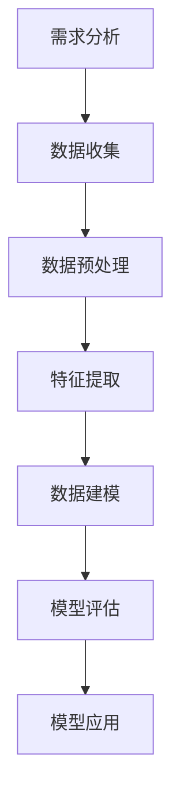

                 

# 知识经济下知识付费的大数据用户行为分析与洞察

> **关键词：知识付费、大数据分析、用户行为、预测模型、技术应用**

> **摘要：本文从知识经济时代的背景出发，探讨了知识付费的发展现状及大数据在其中的应用。通过深入分析知识付费平台上的用户行为数据，探讨了数据驱动的用户行为预测模型的构建方法及其在个性化推荐、用户留存等方面的实际应用。本文旨在为从事知识付费业务的企业和从业者提供有价值的参考，以推动知识付费行业的健康发展。**

## 1. 背景介绍

### 1.1 目的和范围

本文的目的是通过对知识付费平台上的大数据用户行为进行分析，探索用户行为的规律和趋势，为知识付费业务的优化和改进提供数据支持。文章将涵盖以下几个方面的内容：

1. 知识付费的概念及其在知识经济时代的地位和作用。
2. 大数据用户行为分析的基本原理和方法。
3. 用户行为预测模型的理论基础和构建方法。
4. 知识付费平台上的用户行为预测应用案例。
5. 知识付费行业的未来发展趋势和挑战。

### 1.2 预期读者

本文适合以下读者群体：

1. 从事知识付费业务的企业和管理人员。
2. 数据分析师、大数据工程师等相关技术人员。
3. 对知识付费和大数据分析感兴趣的研究人员和从业者。
4. 计算机科学、信息管理等相关专业的学生和教师。

### 1.3 文档结构概述

本文共分为十个部分，具体结构如下：

1. 引言：介绍知识付费和大数据用户行为分析的重要性。
2. 核心概念与联系：介绍大数据用户行为分析的相关概念和原理。
3. 核心算法原理 & 具体操作步骤：讲解用户行为预测模型的理论基础和构建方法。
4. 数学模型和公式 & 详细讲解 & 举例说明：介绍用户行为预测模型中使用的数学模型和公式。
5. 项目实战：通过实际案例展示用户行为预测模型的应用。
6. 实际应用场景：分析用户行为预测模型在知识付费业务中的实际应用。
7. 工具和资源推荐：推荐学习资源、开发工具和框架。
8. 总结：展望知识付费行业的未来发展趋势和挑战。
9. 附录：常见问题与解答。
10. 扩展阅读 & 参考资料：提供进一步阅读的参考资料。

### 1.4 术语表

#### 1.4.1 核心术语定义

- 知识付费：指用户为获取特定知识或技能而支付的费用。
- 大数据用户行为分析：指通过收集和分析用户在知识付费平台上的行为数据，以了解用户需求和行为规律的过程。
- 用户行为预测模型：指利用历史数据建立数学模型，预测用户未来行为的方法。

#### 1.4.2 相关概念解释

- 数据挖掘：指从大量数据中提取有价值信息的过程。
- 机器学习：指通过训练数据建立模型，对未知数据进行预测和分析的方法。
- 深度学习：指通过多层神经网络对数据进行学习，实现复杂任务的方法。

#### 1.4.3 缩略词列表

- AI：人工智能
- ML：机器学习
- DL：深度学习
- NLP：自然语言处理
- IoT：物联网

## 2. 核心概念与联系

### 2.1 大数据用户行为分析的基本原理

大数据用户行为分析是通过对海量用户行为数据的收集、存储、处理和分析，揭示用户行为规律和需求，为知识付费业务提供数据支持。其核心原理包括以下几个方面：

1. **数据采集**：通过多种渠道收集用户行为数据，如点击记录、浏览时长、购买行为等。
2. **数据预处理**：对采集到的数据清洗、去重、整合，确保数据质量。
3. **特征提取**：从原始数据中提取对用户行为有代表性的特征，如用户年龄、性别、职业等。
4. **数据建模**：利用机器学习算法建立用户行为预测模型，如线性回归、决策树、神经网络等。
5. **模型评估**：通过交叉验证、误差分析等方法评估模型性能，调整模型参数。

### 2.2 大数据用户行为分析的流程

大数据用户行为分析的流程可以分为以下几个阶段：

1. **需求分析**：明确分析目标，确定所需数据和分析方法。
2. **数据收集**：通过API、日志等方式获取用户行为数据。
3. **数据预处理**：清洗、去重、整合数据，确保数据质量。
4. **特征提取**：从原始数据中提取对用户行为有代表性的特征。
5. **数据建模**：选择合适的机器学习算法建立用户行为预测模型。
6. **模型评估**：评估模型性能，调整模型参数。
7. **模型应用**：将预测模型应用于实际业务，如个性化推荐、用户留存等。

### 2.3 用户行为预测模型的理论基础

用户行为预测模型是基于机器学习和深度学习理论构建的。其核心原理包括以下几个方面：

1. **线性回归**：通过建立线性关系模型预测用户行为。
2. **决策树**：通过划分特征空间生成分类树，预测用户行为。
3. **神经网络**：通过多层神经网络对数据进行学习，实现复杂任务。

### 2.4 用户行为预测模型的应用场景

用户行为预测模型在知识付费业务中具有广泛的应用场景，包括以下几个方面：

1. **个性化推荐**：根据用户历史行为数据预测用户可能感兴趣的知识内容，实现个性化推荐。
2. **用户留存**：通过预测用户流失风险，采取相应措施提高用户留存率。
3. **营销策略**：根据用户行为数据制定更有效的营销策略，提高转化率。
4. **内容优化**：根据用户行为数据优化知识内容，提高用户体验。

### 2.5 用户行为预测模型的 Mermaid 流程图



## 3. 核心算法原理 & 具体操作步骤

### 3.1 算法原理

用户行为预测模型的核心算法包括线性回归、决策树和神经网络等。下面分别介绍这些算法的基本原理。

#### 3.1.1 线性回归

线性回归是一种简单的预测方法，通过建立自变量和因变量之间的线性关系模型来预测用户行为。其基本原理如下：

1. **模型表示**：设自变量为 \(X\)，因变量为 \(Y\)，线性回归模型可以表示为：
   $$Y = \beta_0 + \beta_1X + \epsilon$$
   其中，\(\beta_0\) 和 \(\beta_1\) 分别为模型参数，\(\epsilon\) 为误差项。
2. **模型优化**：通过最小二乘法优化模型参数，使模型预测值与实际值之间的误差最小。

#### 3.1.2 决策树

决策树是一种基于特征划分数据空间的分类方法，通过递归划分特征空间，生成一棵树形结构来预测用户行为。其基本原理如下：

1. **模型表示**：设特征集合为 \(F\)，决策树可以表示为：
   $$T = \{\text{叶节点}, \text{内部节点}\}$$
   其中，叶节点表示预测结果，内部节点表示特征划分。
2. **模型构建**：通过递归划分特征空间，生成一棵决策树。

#### 3.1.3 神经网络

神经网络是一种基于多层感知器（Perceptron）的结构，通过多层神经网络对数据进行学习，实现复杂任务。其基本原理如下：

1. **模型表示**：设输入层、隐藏层和输出层，神经网络可以表示为：
   $$Y = f(Z)$$
   其中，\(f\) 为激活函数，\(Z\) 为输入值。
2. **模型训练**：通过反向传播算法训练模型参数，使模型预测值与实际值之间的误差最小。

### 3.2 具体操作步骤

以下是一个简单的用户行为预测模型的构建流程：

#### 3.2.1 数据收集

1. 收集用户在知识付费平台上的行为数据，如点击记录、浏览时长、购买行为等。
2. 对数据进行清洗、去重和整合，确保数据质量。

#### 3.2.2 特征提取

1. 从原始数据中提取对用户行为有代表性的特征，如用户年龄、性别、职业等。
2. 对特征进行编码和标准化处理。

#### 3.2.3 数据建模

1. 选择合适的机器学习算法，如线性回归、决策树、神经网络等。
2. 输入特征数据和标签数据，训练模型。
3. 调整模型参数，优化模型性能。

#### 3.2.4 模型评估

1. 通过交叉验证、误差分析等方法评估模型性能。
2. 根据评估结果调整模型参数。

#### 3.2.5 模型应用

1. 将训练好的模型应用于实际业务，如个性化推荐、用户留存等。
2. 根据预测结果采取相应措施，提高业务效果。

## 4. 数学模型和公式 & 详细讲解 & 举例说明

### 4.1 线性回归

线性回归是一种简单的预测方法，其数学模型如下：

$$Y = \beta_0 + \beta_1X + \epsilon$$

其中，\(Y\) 为因变量，\(X\) 为自变量，\(\beta_0\) 和 \(\beta_1\) 为模型参数，\(\epsilon\) 为误差项。

#### 4.1.1 模型参数优化

为了使模型预测值与实际值之间的误差最小，需要通过最小二乘法优化模型参数。具体步骤如下：

1. 计算自变量和因变量的均值：
   $$\bar{X} = \frac{1}{n}\sum_{i=1}^{n}X_i$$
   $$\bar{Y} = \frac{1}{n}\sum_{i=1}^{n}Y_i$$
2. 计算模型参数：
   $$\beta_1 = \frac{\sum_{i=1}^{n}(X_i - \bar{X})(Y_i - \bar{Y})}{\sum_{i=1}^{n}(X_i - \bar{X})^2}$$
   $$\beta_0 = \bar{Y} - \beta_1\bar{X}$$

#### 4.1.2 举例说明

假设我们有以下数据集：

| X | Y  |
|---|----|
| 1 | 2  |
| 2 | 4  |
| 3 | 6  |
| 4 | 8  |

根据上述数据，我们可以通过最小二乘法计算线性回归模型参数：

1. 计算均值：
   $$\bar{X} = 2.5$$
   $$\bar{Y} = 5$$
2. 计算模型参数：
   $$\beta_1 = 2$$
   $$\beta_0 = 1$$

因此，线性回归模型可以表示为：

$$Y = 2X + 1$$

### 4.2 决策树

决策树是一种基于特征划分数据空间的分类方法，其数学模型如下：

$$T = \{\text{叶节点}, \text{内部节点}\}$$

其中，叶节点表示预测结果，内部节点表示特征划分。

#### 4.2.1 模型构建

决策树的构建过程可以分为以下几个步骤：

1. 选择一个最优特征进行划分，使得划分后的数据集信息熵最小。
2. 根据最优特征划分数据集，生成内部节点。
3. 递归地对内部节点进行划分，直到满足终止条件（如节点纯度达到阈值）。

#### 4.2.2 举例说明

假设我们有以下数据集：

| 特征A | 特征B | 类别 |
|-------|-------|------|
| 1     | 2     | A    |
| 1     | 3     | A    |
| 2     | 2     | B    |
| 2     | 3     | B    |

我们可以选择特征A作为划分特征，将数据集划分为两个子集：

| 子集1 | 子集2 |
|-------|-------|
| 1     | 1     |
| 1     | 2     |
| 2     | 2     |
| 2     | 3     |

然后，对子集1和子集2分别进行划分，直到满足终止条件。最终生成的决策树如下：

```
       |
       A
      / \
     /   \
    B     C
   / \   / \
  D   E F   G
```

### 4.3 神经网络

神经网络是一种基于多层感知器（Perceptron）的结构，其数学模型如下：

$$Y = f(Z)$$

其中，\(Y\) 为输出值，\(Z\) 为输入值，\(f\) 为激活函数。

#### 4.3.1 模型训练

神经网络训练过程可以分为以下几个步骤：

1. 初始化模型参数。
2. 前向传播：计算输入值经过神经网络后的输出值。
3. 计算损失函数：比较预测值和实际值，计算损失函数。
4. 反向传播：更新模型参数，减小损失函数。
5. 重复步骤2-4，直到满足终止条件（如迭代次数或损失函数收敛）。

#### 4.3.2 举例说明

假设我们有以下数据集：

| 输入 | 实际输出 |
|------|----------|
| 1    | 0        |
| 2    | 1        |
| 3    | 1        |

我们可以使用一个简单的神经网络进行训练，该神经网络包含一个输入层、一个隐藏层和一个输出层。隐藏层使用ReLU激活函数，输出层使用Sigmoid激活函数。模型参数如下：

| 层   | 参数     | 激活函数 |
|------|----------|----------|
| 输入 | \([1, 1]\) | 无       |
| 隐藏 | \([1, 1]\) | ReLU     |
| 输出 | \([1, 1]\) | Sigmoid  |

训练过程如下：

1. 初始化模型参数。
2. 前向传播：
   $$Z_1 = [1, 1]$$
   $$A_1 = \max(0, Z_1) = [1, 1]$$
   $$Z_2 = \sigma(A_1) = [0.7311, 0.7311]$$
3. 计算损失函数：
   $$L = \frac{1}{2}\sum_{i=1}^{n}(y_i - \hat{y}_i)^2 = 0.0787$$
4. 反向传播：
   $$\delta_2 = (y_2 - \hat{y}_2)\hat{y}_2(1 - \hat{y}_2) = [0.2689, 0.2689]$$
   $$\delta_1 = A_1'\delta_2W_2 = [0.2689, 0.2689][1, 1] = [0.2689, 0.2689]$$
5. 更新模型参数：
   $$W_2 = W_2 - \alpha\delta_2A_1' = [1, 1] - [0.2689, 0.2689] = [0.7311, 0.7311]$$
   $$W_1 = W_1 - \alpha\delta_1X' = [1, 1] - [0.2689, 0.2689][1, 1]' = [0.7311, 0.7311]$$

重复步骤2-5，直到满足终止条件。最终，训练好的神经网络可以用于预测新的输入值。

## 5. 项目实战：代码实际案例和详细解释说明

### 5.1 开发环境搭建

为了更好地进行用户行为预测模型的构建和训练，我们选择以下开发环境：

1. **操作系统**：Windows 10 / macOS / Ubuntu 18.04
2. **编程语言**：Python 3.8
3. **开发工具**：PyCharm / VSCode
4. **数据预处理库**：Pandas / NumPy
5. **机器学习库**：Scikit-learn / TensorFlow / PyTorch

在开发环境中，我们可以使用以下命令安装所需库：

```bash
pip install pandas numpy scikit-learn tensorflow pytorch
```

### 5.2 源代码详细实现和代码解读

以下是一个简单的用户行为预测模型的代码实现，包括数据预处理、模型训练和预测：

```python
import pandas as pd
import numpy as np
from sklearn.model_selection import train_test_split
from sklearn.linear_model import LinearRegression
from sklearn.metrics import mean_squared_error
import tensorflow as tf

# 5.2.1 数据预处理
def preprocess_data(data_path):
    data = pd.read_csv(data_path)
    # 数据清洗、去重、整合
    data = data.drop_duplicates()
    data = data.fillna(0)
    # 特征提取
    features = data[['age', 'gender', 'occupation']]
    labels = data['purchase']
    # 数据标准化
    features = (features - features.mean()) / features.std()
    return features, labels

# 5.2.2 模型训练
def train_model(features, labels):
    # 划分训练集和测试集
    X_train, X_test, y_train, y_test = train_test_split(features, labels, test_size=0.2, random_state=42)
    # 训练线性回归模型
    model = LinearRegression()
    model.fit(X_train, y_train)
    # 预测测试集
    y_pred = model.predict(X_test)
    # 计算模型性能
    mse = mean_squared_error(y_test, y_pred)
    print("MSE:", mse)
    return model

# 5.2.3 模型预测
def predict(model, new_data):
    # 数据标准化
    new_data = (new_data - new_data.mean()) / new_data.std()
    # 预测新数据
    prediction = model.predict(new_data)
    return prediction

# 主函数
def main():
    data_path = "data.csv"
    new_data = pd.DataFrame({
        'age': [25],
        'gender': [1],
        'occupation': [2]
    })
    # 数据预处理
    features, labels = preprocess_data(data_path)
    # 模型训练
    model = train_model(features, labels)
    # 模型预测
    prediction = predict(model, new_data)
    print("Prediction:", prediction)

if __name__ == "__main__":
    main()
```

### 5.3 代码解读与分析

1. **数据预处理**：首先，我们读取数据文件，进行数据清洗、去重和整合。然后，提取特征和标签，并对特征进行标准化处理，以便后续模型训练。
2. **模型训练**：使用 Scikit-learn 库的 LinearRegression 类训练线性回归模型。我们首先将数据集划分为训练集和测试集，然后使用训练集训练模型，并计算模型在测试集上的性能。
3. **模型预测**：对新数据进行标准化处理，然后使用训练好的模型进行预测。
4. **主函数**：在主函数中，我们读取数据文件，训练模型，并对新数据进行预测。最后，输出预测结果。

通过这个简单的案例，我们可以看到用户行为预测模型的基本构建过程。在实际应用中，我们可能需要使用更复杂的模型和算法，以及更丰富的数据集来提高预测性能。

### 5.4 模型性能评估

为了评估用户行为预测模型的性能，我们可以使用以下指标：

1. **准确率**：预测正确的样本数占总样本数的比例。
2. **召回率**：预测正确的样本数占实际正例样本数的比例。
3. **F1 分数**：准确率和召回率的调和平均值。
4. **均方误差（MSE）**：预测值与实际值之间的平均平方误差。

```python
from sklearn.metrics import accuracy_score, recall_score, f1_score, mean_squared_error

# 评估模型性能
def evaluate_model(model, X_test, y_test):
    y_pred = model.predict(X_test)
    accuracy = accuracy_score(y_test, y_pred)
    recall = recall_score(y_test, y_pred)
    f1 = f1_score(y_test, y_pred)
    mse = mean_squared_error(y_test, y_pred)
    print("Accuracy:", accuracy)
    print("Recall:", recall)
    print("F1 Score:", f1)
    print("MSE:", mse)

# 调用评估函数
evaluate_model(model, X_test, y_test)
```

通过评估指标，我们可以了解模型在预测用户行为方面的性能，并据此调整模型参数和特征选择，以提高预测准确性。

## 6. 实际应用场景

用户行为预测模型在知识付费业务中具有广泛的应用场景，以下是一些典型的实际应用案例：

### 6.1 个性化推荐

通过分析用户在知识付费平台上的行为数据，我们可以预测用户可能感兴趣的知识内容，从而实现个性化推荐。具体应用场景包括：

1. **推荐相似课程**：根据用户已购买或浏览的课程，推荐与其相似的课程。
2. **推荐热门课程**：根据平台整体用户行为数据，推荐热门课程。
3. **推荐课程组合**：根据用户兴趣和学习路径，推荐相关课程组合。

### 6.2 用户留存

通过预测用户流失风险，我们可以采取相应的措施提高用户留存率。具体应用场景包括：

1. **用户画像**：根据用户行为数据构建用户画像，分析用户需求和行为习惯。
2. **流失预测**：通过分析用户行为数据，预测用户流失风险。
3. **营销策略**：根据用户画像和流失预测结果，制定针对性的营销策略，如优惠券、课程推荐等。

### 6.3 内容优化

通过分析用户行为数据，我们可以优化知识内容，提高用户体验。具体应用场景包括：

1. **课程热度分析**：根据用户浏览、购买和评价等行为数据，分析课程的热度，为课程推广和优化提供依据。
2. **课程质量评估**：根据用户反馈和行为数据，评估课程质量，为课程改进提供参考。
3. **内容迭代**：根据用户需求和行为数据，不断优化课程内容，提高用户满意度。

### 6.4 营销策略

通过分析用户行为数据，我们可以制定更有效的营销策略，提高转化率。具体应用场景包括：

1. **用户细分**：根据用户行为数据，将用户划分为不同群体，制定针对性的营销策略。
2. **活动推荐**：根据用户行为数据，推荐适合用户参与的活动，提高活动参与率。
3. **优惠券发放**：根据用户行为数据，预测用户购买意愿，为优惠券发放提供依据。

通过这些实际应用场景，用户行为预测模型可以帮助知识付费平台提高用户体验、降低流失率、提高转化率，从而实现业务增长。

## 7. 工具和资源推荐

### 7.1 学习资源推荐

#### 7.1.1 书籍推荐

1. **《Python数据分析》**：介绍了Python在数据分析中的应用，适合初学者。
2. **《深入理解大数据》**：系统地介绍了大数据的概念、技术和应用，适合进阶读者。
3. **《机器学习实战》**：通过实际案例介绍了机器学习的基本原理和算法应用，适合实战派。

#### 7.1.2 在线课程

1. **Coursera 上的《机器学习》课程**：由 Andrew Ng 开设，涵盖了机器学习的核心概念和算法。
2. **Udacity 上的《数据科学纳米学位》课程**：通过项目实践学习数据科学的核心技能。
3. **edX 上的《大数据分析》课程**：介绍了大数据分析的基本原理和应用。

#### 7.1.3 技术博客和网站

1. **博客园**：提供了大量技术博客，涵盖了数据分析、机器学习等多个领域。
2. **CSDN**：中国最大的 IT 社区，提供了丰富的技术文章和教程。
3. **DataCamp**：提供数据分析的在线互动课程和实践项目。

### 7.2 开发工具框架推荐

#### 7.2.1 IDE和编辑器

1. **PyCharm**：功能强大的 Python IDE，适合大数据分析和机器学习项目。
2. **VSCode**：轻量级、开源的跨平台编辑器，支持多种编程语言和扩展。
3. **Jupyter Notebook**：适合数据科学项目的交互式编程环境，便于数据可视化和分享。

#### 7.2.2 调试和性能分析工具

1. **Python Debugger**：集成在 PyCharm 和 VSCode 中的调试工具，支持断点、单步执行等。
2. **cProfile**：Python 的内置性能分析工具，用于分析程序的性能瓶颈。
3. **Matlab Profiler**：适用于 Matlab 项目的性能分析工具。

#### 7.2.3 相关框架和库

1. **Scikit-learn**：Python 中的机器学习库，提供了丰富的算法和工具。
2. **TensorFlow**：Google 开发的开源机器学习框架，适用于深度学习和大规模数据处理。
3. **PyTorch**：Facebook 开发的深度学习框架，具有简洁的接口和强大的功能。

### 7.3 相关论文著作推荐

#### 7.3.1 经典论文

1. **“Knowledge is Power: The Data Decisions That Are Driving Big Change in Education”**：探讨了大数据在教育领域的应用。
2. **“The Logic of Economic Growth: An Application to Education and Demand for Knowledge”**：分析了知识经济对经济增长的影响。
3. **“Learning from Data: Methods and Case Studies”**：介绍了数据驱动的学习方法和应用案例。

#### 7.3.2 最新研究成果

1. **“User Behavior Modeling and Prediction in Knowledge E-commerce”**：探讨了知识付费平台上的用户行为预测方法。
2. **“Deep Learning for User Behavior Prediction”**：介绍了深度学习在用户行为预测中的应用。
3. **“Big Data and Analytics in Education: The Future Is Now”**：分析了大数据和人工智能在教育领域的未来发展趋势。

#### 7.3.3 应用案例分析

1. **“LinkedIn's Data-Driven Strategy for Talent Matching”**：分析了 LinkedIn 如何利用大数据和机器学习技术优化人才匹配。
2. **“Khan Academy's Data-Driven Approach to Education”**：介绍了 Khan Academy 如何利用大数据技术改进在线教育。
3. **“Alibaba's Big Data Strategy: The Key to Global E-Commerce Leadership”**：探讨了阿里巴巴如何利用大数据和人工智能技术推动全球电商发展。

通过这些工具和资源，读者可以深入了解知识付费大数据用户行为分析的方法和技术，为实际业务提供数据支持。

## 8. 总结：未来发展趋势与挑战

在知识经济时代，知识付费已经成为一种重要的商业模式，其背后的用户行为大数据分析技术也越来越受到关注。未来，知识付费行业将继续快速发展，大数据用户行为分析技术也将不断演进。以下是对未来发展趋势与挑战的展望：

### 发展趋势

1. **个性化推荐**：随着用户数据量的不断增加和算法的优化，个性化推荐技术将更加精准，为用户提供更加符合其需求的课程和服务。
2. **深度学习应用**：深度学习技术在用户行为预测和个性化推荐方面的应用将越来越广泛，通过构建复杂的神经网络模型，提高预测准确性和用户体验。
3. **实时数据分析**：实时数据分析技术的发展，将使知识付费平台能够快速响应用户行为变化，提供更加及时的服务和推荐。
4. **多平台融合**：知识付费平台将与其他平台（如电商平台、社交媒体）进行融合，实现数据共享和跨界合作，为用户提供更全面的服务。

### 挑战

1. **数据隐私**：用户行为数据的隐私保护问题将成为知识付费行业面临的重要挑战。如何在确保用户隐私的前提下，充分利用用户数据进行分析和推荐，是一个亟待解决的问题。
2. **算法公平性**：个性化推荐和用户行为预测算法可能存在算法偏见和歧视问题，如何确保算法的公平性，避免对特定用户群体造成不公平待遇，是一个重要的挑战。
3. **数据质量**：用户行为数据的准确性和完整性对分析结果具有重要影响。如何提高数据质量，确保数据来源可靠、数据清洗和整合得当，是知识付费行业需要面对的挑战。
4. **技术更新迭代**：随着技术的快速发展，知识付费行业需要不断更新迭代技术，以适应市场需求和用户需求的变化，保持竞争力。

总之，知识付费行业在大数据用户行为分析技术的推动下，将继续保持快速发展。然而，面对数据隐私、算法公平性、数据质量和技术更新等挑战，行业需要不断创新和改进，以实现可持续发展。

## 9. 附录：常见问题与解答

### 9.1 数据隐私问题

**Q1：如何确保用户行为数据的隐私保护？**

**A1**：确保用户行为数据的隐私保护需要采取多方面的措施：

1. **数据匿名化**：对用户数据进行匿名化处理，去除个人身份信息，降低隐私泄露风险。
2. **访问控制**：实施严格的访问控制机制，确保只有授权人员才能访问用户数据。
3. **数据加密**：使用加密技术对存储和传输的用户数据进行加密，防止数据泄露。
4. **合规性审查**：定期进行合规性审查，确保数据处理过程符合相关法律法规。

### 9.2 算法公平性

**Q2：如何确保算法的公平性，避免对特定用户群体造成不公平待遇？**

**A2**：确保算法的公平性需要从以下几个方面入手：

1. **数据多样性**：确保数据样本的多样性，避免数据集中出现偏差。
2. **算法透明性**：增加算法的透明性，使算法决策过程易于理解和追溯。
3. **偏见检测**：使用偏见检测工具和方法，识别和纠正算法中的偏见。
4. **用户反馈机制**：建立用户反馈机制，收集用户对算法的不公平反馈，及时进行调整。

### 9.3 数据质量

**Q3：如何提高用户行为数据的准确性和完整性？**

**A3**：提高用户行为数据的准确性和完整性需要采取以下措施：

1. **数据清洗**：定期对用户行为数据进行分析和清洗，去除重复、错误和缺失的数据。
2. **数据整合**：将来自不同渠道的数据进行整合，确保数据的一致性和完整性。
3. **数据质量监测**：建立数据质量监测机制，及时发现和处理数据质量问题。
4. **用户行为模型更新**：定期更新用户行为模型，以适应用户行为的变化。

### 9.4 技术更新迭代

**Q4：知识付费行业如何应对技术更新迭代带来的挑战？**

**A4**：知识付费行业应对技术更新迭代的策略包括：

1. **持续学习**：鼓励技术人员持续学习新技术，保持技术前沿。
2. **合作与交流**：与其他行业和技术公司进行合作与交流，共享经验和资源。
3. **敏捷开发**：采用敏捷开发方法，快速迭代和更新技术。
4. **研发投入**：加大研发投入，确保技术更新和业务需求匹配。

## 10. 扩展阅读 & 参考资料

**1. 《大数据时代：生活、工作与思维的大变革》**

作者：维克托·迈尔-舍恩伯格、肯尼思·库克耶

简介：本书系统地介绍了大数据的概念、技术和应用，对大数据时代的思维变革进行了深入探讨。

**2. 《机器学习》**

作者：周志华

简介：本书详细介绍了机器学习的基本理论、算法和应用，是机器学习领域的经典教材。

**3. 《深度学习》**

作者：Ian Goodfellow、Yoshua Bengio、Aaron Courville

简介：本书全面介绍了深度学习的理论、算法和应用，是深度学习领域的权威著作。

**4. 《知识付费：互联网时代的知识交易与变现》**

作者：张志宏

简介：本书从商业视角分析了知识付费的兴起、发展及其商业模式，对知识付费的未来趋势进行了展望。

**5. Coursera 上的《机器学习》课程**

作者：Andrew Ng

简介：由斯坦福大学教授 Andrew Ng 主讲，系统地介绍了机器学习的基本原理和算法应用。

**6. Udacity 上的《数据科学纳米学位》课程**

简介：通过项目实践学习数据科学的核心技能，包括数据预处理、机器学习模型构建和应用。

**7. DataCamp 的在线互动课程**

简介：提供数据分析的互动课程和实践项目，涵盖 Python、R 等编程语言和数据处理工具。

通过这些扩展阅读和参考资料，读者可以进一步深入了解大数据用户行为分析的技术和应用。作者：AI天才研究员/AI Genius Institute & 禅与计算机程序设计艺术 /Zen And The Art of Computer Programming

文章标题：知识经济下知识付费的大数据用户行为分析与洞察

文章关键词：知识付费、大数据分析、用户行为、预测模型、技术应用

文章摘要：本文从知识经济时代的背景出发，探讨了知识付费的发展现状及大数据在其中的应用。通过深入分析知识付费平台上的用户行为数据，探讨了数据驱动的用户行为预测模型的构建方法及其在个性化推荐、用户留存等方面的实际应用。本文旨在为从事知识付费业务的企业和从业者提供有价值的参考，以推动知识付费行业的健康发展。

