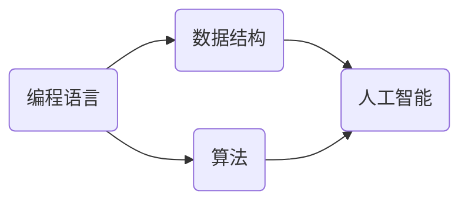

                 

# 知识经济下程序员的发展之路

> 关键词：知识经济，程序员，职业发展，技能提升，人工智能，技术趋势

> 摘要：本文旨在探讨知识经济时代下程序员职业发展的路径。随着人工智能技术的迅猛发展，编程人员不仅需要掌握传统的编程技能，还需要不断更新知识，提升自身综合素质。本文将分析知识经济的特点，探讨程序员在新时代的机遇与挑战，并给出具体的职业发展建议。

## 1. 背景介绍

### 1.1 目的和范围

本文的目标是帮助程序员了解知识经济时代的发展趋势，明确自身职业发展方向，提升专业技能和综合素质。本文将涵盖以下内容：

- 知识经济的特点及其对程序员职业发展的影响
- 程序员在知识经济时代面临的机遇与挑战
- 程序员职业发展的核心技能与素质要求
- 程序员如何提升自身竞争力
- 知识经济时代程序员的发展策略与建议

### 1.2 预期读者

本文的预期读者为以下几类：

- 有志于在知识经济时代实现职业发展的程序员
- 已经在编程领域工作，希望提升自身竞争力的程序员
- 想了解知识经济背景下程序员职业发展趋势的IT从业者
- 对编程和人工智能技术感兴趣的读者

### 1.3 文档结构概述

本文分为以下几个部分：

- 引言：介绍知识经济和程序员职业发展的关系
- 核心概念与联系：阐述知识经济时代程序员所需的核心技能与素质
- 核心算法原理与具体操作步骤：分析程序员在工作中常用的算法原理及操作步骤
- 数学模型与公式：讲解与编程相关的数学模型和公式，并举例说明
- 项目实战：通过实际案例展示程序员的技能应用
- 实际应用场景：分析程序员在各类应用场景中的表现
- 工具和资源推荐：介绍对程序员有用的学习资源和开发工具
- 总结：展望知识经济时代程序员的发展趋势与挑战
- 附录：回答常见问题，提供扩展阅读资料

### 1.4 术语表

#### 1.4.1 核心术语定义

- 知识经济：以知识和信息为核心，通过创新和知识创造价值的经济发展模式
- 程序员：从事计算机编程、软件开发、系统维护等工作的专业人员
- 技术趋势：指某一时期内，技术领域的热门方向和发展方向
- 综合素质：包括专业技能、团队协作能力、沟通能力、创新能力等多方面的素质
- 人工智能：模拟、延伸和扩展人类智能的理论、方法、技术及应用

#### 1.4.2 相关概念解释

- 编程语言：用于编写计算机程序的符号系统，如Python、Java等
- 数据结构：计算机中用于存储和组织数据的方式，如数组、链表、树等
- 算法：解决问题的方法步骤，具有确定性、可行性、有穷性和正确性等特点
- 编码：将程序代码转换为机器语言的过程

#### 1.4.3 缩略词列表

- AI：人工智能
- IT：信息技术
- ML：机器学习
- DL：深度学习
- DevOps：软件开发与运维一体化

## 2. 核心概念与联系

知识经济时代，程序员需要掌握的核心概念包括编程语言、数据结构、算法、人工智能等。以下是一个简单的 Mermaid 流程图，展示这些核心概念之间的关系：



在这个流程图中，编程语言是程序员的基础，数据结构和算法则是解决编程问题的核心。人工智能作为新兴的技术趋势，与编程语言、数据结构、算法紧密相连，为程序员提供了更广阔的发展空间。

### 2.1 编程语言

编程语言是程序员进行软件开发的基础。不同的编程语言具有不同的特点和应用场景。以下是几种常见的编程语言及其特点：

- Python：易于学习，语法简单，适用于数据分析、机器学习、Web开发等领域
- Java：跨平台，稳定性高，广泛应用于企业级应用、Android开发等领域
- C++：性能优秀，适用于系统编程、游戏开发、嵌入式系统等领域
- JavaScript：前端开发的主要语言，可用于构建交互式网页和Web应用

### 2.2 数据结构

数据结构是计算机中用于存储和组织数据的方式。掌握常见的数据结构有助于程序员高效地解决问题。以下是几种常见的数据结构及其特点：

- 数组：用于存储同一类型的元素，支持随机访问
- 链表：通过节点之间的指针关系存储元素，支持动态分配内存
- 栈：后进先出（LIFO）的数据结构，适用于函数调用、递归等问题
- 队列：先进先出（FIFO）的数据结构，适用于任务调度、缓冲区管理等问题

### 2.3 算法

算法是解决问题的方法步骤。了解常见的算法原理和实现方式，有助于程序员在解决实际问题时，选择合适的算法。以下是几种常见的算法及其特点：

- 排序算法：用于对数据进行排序，如冒泡排序、快速排序、归并排序等
- 搜索算法：用于在数据结构中查找特定元素，如二分查找、深度优先搜索、广度优先搜索等
- 动态规划：用于解决最优子结构问题，如背包问题、最长公共子序列问题等
- 贪心算法：通过选择局部最优解来寻找全局最优解，如最短路径算法、最小生成树算法等

### 2.4 人工智能

人工智能是知识经济时代的重要技术趋势。程序员需要掌握人工智能的基本原理和应用，以应对未来发展的挑战。以下是几种常见的人工智能技术及其特点：

- 机器学习：通过训练模型来模拟人类学习过程，解决分类、回归、聚类等问题
- 深度学习：基于多层神经网络，实现对复杂数据的高效处理和建模
- 自然语言处理：使计算机能够理解、生成和应对自然语言，如语音识别、机器翻译等
- 计算机视觉：使计算机能够识别和理解图像和视频，如目标检测、图像分类等

## 3. 核心算法原理与具体操作步骤

在编程过程中，算法原理的应用至关重要。以下将介绍几种核心算法原理，并给出具体的操作步骤。

### 3.1 冒泡排序算法

冒泡排序是一种简单的排序算法，其原理是通过多次遍历待排序的序列，比较相邻元素的值，并按照指定的顺序交换它们的位置，直到整个序列有序。

#### 操作步骤：

1. 从第一个元素开始，相邻元素两两比较，若顺序相反，交换它们的位置。
2. 经过一次遍历后，最大的元素会被“冒泡”到最后一个位置。
3. 重复步骤1和步骤2，直到整个序列有序。

#### 伪代码：

```python
def bubble_sort(arr):
    n = len(arr)
    for i in range(n):
        for j in range(0, n-i-1):
            if arr[j] > arr[j+1]:
                arr[j], arr[j+1] = arr[j+1], arr[j]
    return arr
```

### 3.2 二分查找算法

二分查找是一种高效的查找算法，其原理是将有序数组分成左右两部分，根据待查找元素与中间元素的比较，确定查找范围，逐步缩小查找范围，直至找到目标元素或确定不存在。

#### 操作步骤：

1. 找到数组的中间元素。
2. 比较中间元素与待查找元素。
3. 如果中间元素等于待查找元素，查找成功；如果中间元素大于待查找元素，则在左侧子数组中继续查找；如果中间元素小于待查找元素，则在右侧子数组中继续查找。
4. 重复步骤1到步骤3，直至找到目标元素或确定不存在。

#### 伪代码：

```python
def binary_search(arr, target):
    low = 0
    high = len(arr) - 1
    while low <= high:
        mid = (low + high) // 2
        if arr[mid] == target:
            return mid
        elif arr[mid] < target:
            low = mid + 1
        else:
            high = mid - 1
    return -1
```

### 3.3 动态规划算法

动态规划是一种解决最优子结构问题的算法，其原理是将问题分解成若干个子问题，通过求解子问题的最优解来构建问题的最优解。

#### 操作步骤：

1. 确定问题状态和状态转移方程。
2. 初始化边界条件。
3. 从边界条件开始，依次求解子问题的最优解，直到求解出问题的最优解。

#### 伪代码：

```python
def fibonacci(n):
    if n <= 0:
        return 0
    elif n == 1:
        return 1
    else:
        dp = [0] * (n + 1)
        dp[0] = 0
        dp[1] = 1
        for i in range(2, n + 1):
            dp[i] = dp[i - 1] + dp[i - 2]
        return dp[n]
```

## 4. 数学模型和公式与详细讲解

在编程和人工智能领域，数学模型和公式是解决实际问题的有力工具。以下介绍几种常见的数学模型和公式，并给出详细讲解。

### 4.1 欧拉公式

欧拉公式是复分析中的一个重要公式，将指数函数、对数函数和三角函数联系在一起。其表达式为：

$$e^{i\pi} + 1 = 0$$

#### 详细讲解：

欧拉公式将复数的指数表示法、三角函数和实数单位圆紧密联系在一起。其中，$e$ 是自然对数的底数，约等于 2.71828；$i$ 是虚数单位，满足 $i^2 = -1$；$\pi$ 是圆周率，约等于 3.14159。

#### 举例说明：

例如，当 $x = \pi$ 时，代入欧拉公式得：

$$e^{i\pi} + 1 = 0$$

这表明复数 $e^{i\pi}$ 的值为 -1，即复数单位圆上的点 (-1, 0)。

### 4.2 矩阵乘法

矩阵乘法是线性代数中的一种运算，用于计算两个矩阵的乘积。其表达式为：

$$C = A \cdot B$$

其中，$A$ 和 $B$ 是两个矩阵，$C$ 是它们的乘积。

#### 详细讲解：

矩阵乘法的运算规则如下：

1. $A$ 的列数必须等于 $B$ 的行数。
2. 乘积 $C$ 的行数等于 $A$ 的行数，列数等于 $B$ 的列数。
3. 乘积 $C$ 的第 $i$ 行第 $j$ 列的元素，等于 $A$ 的第 $i$ 行与 $B$ 的第 $j$ 列对应元素的乘积之和。

#### 举例说明：

例如，给定两个矩阵 $A$ 和 $B$：

$$A = \begin{bmatrix} 1 & 2 \\ 3 & 4 \end{bmatrix}, B = \begin{bmatrix} 5 & 6 \\ 7 & 8 \end{bmatrix}$$

则它们的乘积 $C$ 为：

$$C = A \cdot B = \begin{bmatrix} 1 \cdot 5 + 2 \cdot 7 & 1 \cdot 6 + 2 \cdot 8 \\ 3 \cdot 5 + 4 \cdot 7 & 3 \cdot 6 + 4 \cdot 8 \end{bmatrix} = \begin{bmatrix} 19 & 22 \\ 43 & 50 \end{bmatrix}$$

### 4.3 交叉熵

交叉熵是信息论中的一种度量方式，用于衡量两个概率分布的差异。其表达式为：

$$H(X, Y) = -\sum_{i} p_i \cdot \log q_i$$

其中，$X$ 和 $Y$ 是两个概率分布，$p_i$ 和 $q_i$ 分别是 $X$ 和 $Y$ 的第 $i$ 个概率值。

#### 详细讲解：

交叉熵的运算规则如下：

1. 交叉熵值越小，表示两个概率分布越接近。
2. 当 $p_i = q_i$ 时，交叉熵值为 0，表示两个概率分布完全相同。

#### 举例说明：

例如，给定两个概率分布 $X$ 和 $Y$：

$$X = \begin{bmatrix} 0.2 & 0.3 & 0.5 \end{bmatrix}, Y = \begin{bmatrix} 0.3 & 0.4 & 0.3 \end{bmatrix}$$

则它们的交叉熵为：

$$H(X, Y) = -0.2 \cdot \log 0.3 - 0.3 \cdot \log 0.4 - 0.5 \cdot \log 0.3 \approx 0.087$$

## 5. 项目实战：代码实际案例和详细解释说明

### 5.1 开发环境搭建

在本项目实战中，我们将使用 Python 语言进行编程。首先，需要安装 Python 开发环境。

1. 下载并安装 Python：前往 [Python 官网](https://www.python.org/) 下载最新版本的 Python 安装包，并按照提示完成安装。
2. 配置 Python 环境：在命令行中执行 `python --version` 命令，若能正确显示 Python 版本信息，表示 Python 环境配置成功。
3. 安装常用库：使用 `pip` 命令安装所需的库，如 NumPy、Pandas、Scikit-learn 等。

### 5.2 源代码详细实现和代码解读

以下是一个简单的 Python 代码示例，用于实现冒泡排序算法。

```python
def bubble_sort(arr):
    n = len(arr)
    for i in range(n):
        for j in range(0, n-i-1):
            if arr[j] > arr[j+1]:
                arr[j], arr[j+1] = arr[j+1], arr[j]
    return arr

# 测试代码
arr = [64, 34, 25, 12, 22, 11, 90]
sorted_arr = bubble_sort(arr)
print("排序前：", arr)
print("排序后：", sorted_arr)
```

#### 代码解读：

1. `def bubble_sort(arr):`：定义冒泡排序函数，参数 `arr` 表示待排序的数组。
2. `n = len(arr)`: 获取数组长度，用于循环控制。
3. `for i in range(n):`：外层循环，控制排序的轮数。
4. `for j in range(0, n-i-1):`：内层循环，控制每轮比较和交换的次数。
5. `if arr[j] > arr[j+1]:`：比较相邻元素的大小。
6. `arr[j], arr[j+1] = arr[j+1], arr[j]`：交换元素位置。
7. `return arr`: 返回排序后的数组。

#### 代码分析：

该代码实现了简单的冒泡排序算法，其时间复杂度为 $O(n^2)$。在实际应用中，冒泡排序适用于数据量较小的情况，对于大数据量，建议使用更高效的排序算法，如快速排序、归并排序等。

### 5.3 代码解读与分析

在本节中，我们将对冒泡排序算法的代码进行详细解读和分析。

#### 代码解读

1. **定义函数**：首先定义了一个名为 `bubble_sort` 的函数，该函数接收一个参数 `arr`，表示待排序的数组。

2. **获取数组长度**：使用 `len(arr)` 获取数组的长度，这个长度用于后续的循环控制。

3. **外层循环**：使用 `for i in range(n):` 进行外层循环，`i` 的取值范围为 `0` 到 `n-1`，每轮循环表示对数组进行一次完整的冒泡排序。

4. **内层循环**：使用 `for j in range(0, n-i-1):` 进行内层循环，`j` 的取值范围为 `0` 到 `n-i-1`，每轮循环表示对数组中的一组相邻元素进行比较和交换。

5. **条件判断**：使用 `if arr[j] > arr[j+1]:` 进行条件判断，如果当前元素大于下一个元素，则表示它们的顺序不正确，需要交换。

6. **交换元素**：使用 `arr[j], arr[j+1] = arr[j+1], arr[j]` 进行元素交换，使得较大的元素逐渐“冒泡”到数组的后面。

7. **返回结果**：最后，使用 `return arr` 返回排序后的数组。

#### 代码分析

1. **时间复杂度**：冒泡排序的时间复杂度为 $O(n^2)$，因为每轮排序需要比较 $n-i-1$ 对元素，总共需要进行 $n-1$ 轮排序，所以总的比较次数为 $(n-1) + (n-2) + \ldots + 1 = \frac{(n-1)n}{2}$。

2. **稳定性**：冒泡排序是一种稳定的排序算法，即相同值的元素在排序后不会改变它们原来的顺序。

3. **适用场景**：冒泡排序适用于数据量较小的情况，对于大数据量，冒泡排序的性能较差，建议使用更高效的排序算法。

4. **优化方向**：在实际应用中，可以对冒泡排序进行优化，例如在每一轮排序结束后，记录下最后一次交换的位置，下一次排序可以省略这个位置之前的元素，这样可以减少不必要的比较和交换。

## 6. 实际应用场景

### 6.1 数据处理

程序员在数据处理领域有着广泛的应用，如数据清洗、数据分析和数据可视化等。

- **数据清洗**：程序员可以使用 Python 的 Pandas 库对数据进行清洗，处理缺失值、重复值和异常值等。
- **数据分析**：程序员可以使用 Python 的 NumPy、Pandas 和 Scikit-learn 等库进行数据分析，提取数据中的有用信息，为决策提供支持。
- **数据可视化**：程序员可以使用 Python 的 Matplotlib、Seaborn 等库进行数据可视化，以直观的形式展示数据分析结果。

### 6.2 人工智能

程序员在人工智能领域有着重要的地位，如机器学习、深度学习和计算机视觉等。

- **机器学习**：程序员可以使用 Python 的 Scikit-learn、TensorFlow 和 PyTorch 等库实现机器学习算法，解决分类、回归和聚类等问题。
- **深度学习**：程序员可以使用 Python 的 TensorFlow 和 PyTorch 等库实现深度学习模型，解决图像识别、语音识别和自然语言处理等问题。
- **计算机视觉**：程序员可以使用 Python 的 OpenCV 和 TensorFlow 等库实现计算机视觉算法，进行图像处理、目标检测和图像分类等。

### 6.3 云计算

程序员在云计算领域也有着广泛的应用，如云服务器搭建、云存储和云安全等。

- **云服务器搭建**：程序员可以使用 Python 的 Boto3 库操作 AWS 服务，搭建云服务器。
- **云存储**：程序员可以使用 Python 的 Minio、Rclone 等库实现云存储，存储和共享数据。
- **云安全**：程序员可以使用 Python 的 AWS SecurityHub、Azure Security Center 等库实现云安全，保护数据和隐私。

### 6.4 Web开发

程序员在 Web 开发领域有着重要的地位，如前端开发、后端开发和全栈开发等。

- **前端开发**：程序员可以使用 Python 的 Flask、Django 等库进行前端开发，实现网页的布局和交互。
- **后端开发**：程序员可以使用 Python 的 Flask、Django、FastAPI 等库进行后端开发，实现数据存储和处理。
- **全栈开发**：程序员可以使用 Python 的 Flask、Django、React、Vue 等库实现全栈开发，同时进行前端和后端开发。

## 7. 工具和资源推荐

### 7.1 学习资源推荐

#### 7.1.1 书籍推荐

- 《Python编程：从入门到实践》
- 《深度学习》
- 《算法导论》
- 《代码大全》

#### 7.1.2 在线课程

- Coursera 上的《机器学习》课程
- Udacity 上的《全栈Web开发》课程
- edX 上的《Python编程》课程

#### 7.1.3 技术博客和网站

- Python.org
- TensorFlow.org
- Scikit-learn.org

### 7.2 开发工具框架推荐

#### 7.2.1 IDE和编辑器

- PyCharm
- VS Code
- Sublime Text

#### 7.2.2 调试和性能分析工具

- PySnooper
- profilers.py
- line_profiler

#### 7.2.3 相关框架和库

- Flask
- Django
- FastAPI
- Pandas
- NumPy
- TensorFlow
- PyTorch

### 7.3 相关论文著作推荐

#### 7.3.1 经典论文

- "A Mathematical Theory of Communication" by Claude Shannon
- "The Structure and Interpretation of Computer Programs" by Harold Abelson and Gerald Jay Sussman
- "Deep Learning" by Ian Goodfellow, Yoshua Bengio, and Aaron Courville

#### 7.3.2 最新研究成果

- arXiv.org 上的最新论文
- NeurIPS.org 上的最新论文
- ICML.org 上的最新论文

#### 7.3.3 应用案例分析

- "Google's PageRank Algorithm" by Lawrence Page, Sergey Brin, et al.
- "TensorFlow: Large-Scale Machine Learning on Heterogeneous Systems" by Google Brain Team
- "Facebook's GraphRank Algorithm" by Facebook AI Research Team

## 8. 总结：未来发展趋势与挑战

在知识经济时代，程序员的职业发展面临着诸多机遇与挑战。以下是对未来发展趋势与挑战的总结：

### 8.1 发展趋势

1. **技术多样化和专业化**：随着技术的不断进步，程序员需要掌握更多领域的知识和技能，如人工智能、云计算、大数据等。
2. **持续学习与创新**：知识更新速度快，程序员需要具备持续学习的能力，跟上技术发展的步伐，不断创新。
3. **跨界融合**：程序员需要具备跨领域的知识，如与市场营销、产品设计等领域的融合，以应对复杂的项目需求。
4. **全球化竞争**：随着全球化的加深，程序员需要具备国际视野，适应不同文化和工作环境。

### 8.2 挑战

1. **技能过时风险**：随着技术更新速度加快，程序员需要不断学习新技能，以避免技能过时。
2. **工作压力与焦虑**：程序员在工作过程中可能会面临高压环境和长时间的工作，需要学会应对压力和焦虑。
3. **职业规划**：程序员需要明确自己的职业发展方向，规划自己的职业生涯，以实现个人价值最大化。

### 8.3 发展策略与建议

1. **持续学习**：定期学习新技术、新工具，参加线上或线下课程，保持知识的更新。
2. **拓宽视野**：关注行业动态，了解不同领域的知识，拓宽职业发展空间。
3. **提高沟通与协作能力**：学会与团队成员有效沟通，提高团队协作能力。
4. **规划职业生涯**：制定清晰的职业规划，明确自己的目标和发展路径。

## 9. 附录：常见问题与解答

### 9.1 程序员如何保持学习的动力？

**解答**：程序员可以通过以下方式保持学习的动力：

1. **设定学习目标**：明确自己的学习目标，让学习具有方向性和目的性。
2. **制定学习计划**：合理安排时间，将学习任务分解为小步骤，逐步完成。
3. **参与项目实践**：通过实际项目积累经验，提高解决问题的能力。
4. **与他人交流**：与同行交流学习心得，分享经验，共同进步。
5. **利用在线资源**：利用在线课程、技术博客等资源，拓宽知识面。

### 9.2 如何在职业生涯中实现价值最大化？

**解答**：程序员可以在职业生涯中实现价值最大化的方法如下：

1. **提高技能水平**：不断学习新技能，提升自身竞争力。
2. **积累项目经验**：参与多个项目，积累丰富的项目经验。
3. **提升沟通与协作能力**：与团队成员保持良好的沟通，提高团队协作效率。
4. **发挥个人特长**：发掘自己的特长，为团队创造价值。
5. **规划职业发展**：明确自己的职业目标，制定合理的职业规划。

## 10. 扩展阅读 & 参考资料

1. 《Python编程：从入门到实践》，埃里克·马瑟斯著。
2. 《深度学习》，伊恩·古德费洛等著。
3. 《算法导论》，托马斯·H·考尔等人著。
4. 《代码大全》，史蒂夫·迈尔乔丹诺维奇著。
5. Coursera：[机器学习](https://www.coursera.org/specializations/ml)。
6. Udacity：[全栈Web开发](https://www.udacity.com/course/full-stack-web-developer-nanodegree--nd007)。
7. edX：[Python编程](https://www.edx.org/course/introduction-to-python-absolute-beginner)。
8. Python.org：[官方文档](https://docs.python.org/3/)。
9. TensorFlow.org：[官方文档](https://www.tensorflow.org/)。
10. Scikit-learn.org：[官方文档](https://scikit-learn.org/stable/)。
11. 《A Mathematical Theory of Communication》，克劳德·香农著。
12. 《The Structure and Interpretation of Computer Programs》，哈罗德·阿贝尔森和杰拉尔德·杰伊·苏兹曼著。
13. 《Deep Learning》，伊恩·古德费洛、 Yoshua Bengio、 Aaron Courville 著。
14. arXiv.org：[最新论文](https://arxiv.org/)。
15. NeurIPS.org：[最新论文](https://neurips.cc/)。
16. ICML.org：[最新论文](https://icml.cc/)。
17. 《Google's PageRank Algorithm》，拉里·佩奇、谢尔盖·布林等人著。
18. 《TensorFlow：Large-Scale Machine Learning on Heterogeneous Systems》，Google Brain Team 著。
19. 《Facebook's GraphRank Algorithm》，Facebook AI Research Team 著。

