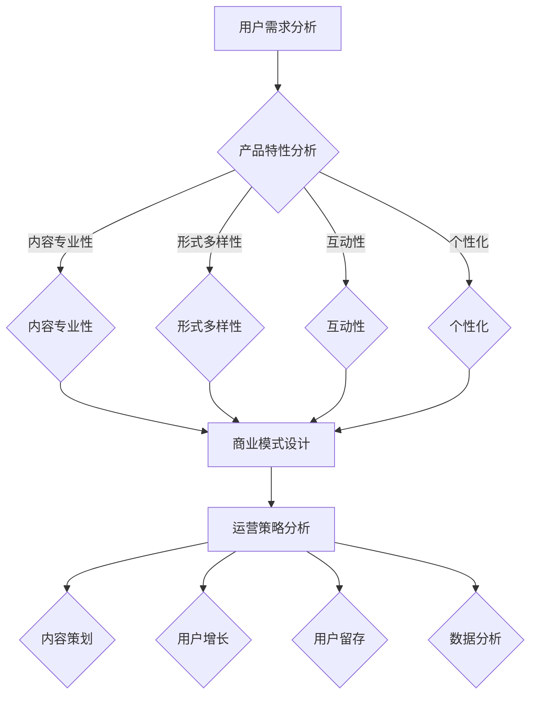

                 

# 知识经济时代下的知识付费创新商业模式运营

> 关键词：知识经济，知识付费，商业模式，创新运营，用户体验

> 摘要：本文深入探讨了知识经济时代下的知识付费创新商业模式，分析了知识付费的现状与发展趋势，探讨了用户需求、产品特性、商业模式设计、运营策略等多个方面，提供了实用的案例和策略，以期为行业从业者提供有价值的参考。

## 1. 背景介绍

### 1.1 目的和范围

本文旨在分析知识经济时代下知识付费商业模式的创新与发展，探究其运营策略及未来趋势。本文将涵盖以下几个主要方面：

- **知识付费的定义与现状**：介绍知识付费的基本概念，分析当前市场环境及发展态势。
- **用户需求分析**：探讨用户对知识付费产品的需求及其变化趋势。
- **商业模式设计**：分析不同类型的知识付费商业模式及其运营特点。
- **运营策略探讨**：讨论如何通过有效的运营策略提升知识付费产品的用户满意度与市场竞争力。
- **未来趋势与挑战**：预测知识付费行业的发展方向，探讨面临的挑战及应对策略。

### 1.2 预期读者

本文面向以下读者群体：

- **知识付费行业从业者**：希望了解知识付费行业的发展趋势和运营策略。
- **创业者**：有意进入知识付费领域，寻找创新商业模式。
- **学术研究人员**：关注知识经济和商业模式创新的研究者。
- **广大用户**：对知识付费有浓厚兴趣，希望了解知识付费的产品与服务。

### 1.3 文档结构概述

本文结构如下：

- **第1章**：背景介绍，包括目的、范围、预期读者和文档结构概述。
- **第2章**：核心概念与联系，介绍知识付费相关的核心概念及原理。
- **第3章**：核心算法原理与具体操作步骤，分析知识付费产品的设计理念与实现方法。
- **第4章**：数学模型和公式，详细讲解支持知识付费产品的数学模型和计算方法。
- **第5章**：项目实战，通过实际案例展示知识付费产品的开发过程。
- **第6章**：实际应用场景，分析知识付费产品在不同领域的应用实例。
- **第7章**：工具和资源推荐，介绍相关学习资源、开发工具及参考文献。
- **第8章**：总结与未来展望，总结知识付费行业的发展趋势与挑战。
- **第9章**：常见问题与解答，回答读者可能关心的问题。
- **第10章**：扩展阅读与参考资料，提供进一步学习的文献和资源。

### 1.4 术语表

#### 1.4.1 核心术语定义

- **知识付费**：用户为获取特定知识或技能，自愿支付相应费用的行为。
- **商业模式**：企业为获取利润而设计的业务运营模式。
- **用户体验**：用户在使用产品或服务过程中所获得的主观感受。
- **知识经济**：以知识为核心资源的经济形态，包括知识的生产、传播、应用和交易。

#### 1.4.2 相关概念解释

- **内容付费**：用户为获取特定内容，自愿支付相应费用的行为，是知识付费的一种表现形式。
- **知识共享**：以共享知识为目的，通过互联网等渠道进行知识传播与交流的行为。
- **知识变现**：将知识转化为经济利益的过程，是知识付费的核心。

#### 1.4.3 缩略词列表

- **K12**：指从幼儿园到高中阶段的基础教育。
- **UGC**：指用户生成内容（User-Generated Content）。
- **PGC**：指专业生成内容（Professional-Generated Content）。

## 2. 核心概念与联系

在探讨知识付费创新商业模式之前，我们首先需要了解知识付费的核心概念及其相互联系。以下是知识付费相关的核心概念及原理：

### 2.1.1 用户需求分析

用户需求是知识付费产品设计的起点。用户对知识的需求可以分为以下几类：

- **技能提升需求**：用户希望通过学习特定技能提升自身竞争力。
- **知识普及需求**：用户希望了解某一领域的知识，以拓宽视野。
- **兴趣爱好需求**：用户出于兴趣爱好，希望深入学习某一领域。
- **职业发展需求**：用户希望通过学习提升职业素质，实现职业发展。

### 2.1.2 产品特性

知识付费产品具有以下特性：

- **内容专业性**：知识付费产品通常由专业人士或专家创作，内容具有较高的专业性和权威性。
- **形式多样性**：知识付费产品可以以音频、视频、图文等多种形式呈现，满足不同用户的学习需求。
- **互动性**：知识付费产品可以设置互动环节，如答疑、讨论区等，增强用户参与感。
- **个性化**：知识付费产品可以根据用户需求提供个性化的学习方案。

### 2.1.3 商业模式设计

知识付费商业模式可以分为以下几种类型：

- **订阅模式**：用户支付一定费用，获取特定时间段内所有内容的免费访问权限。
- **单点购买模式**：用户为获取某一特定内容，一次性支付相应费用。
- **众筹模式**：用户通过众筹平台为知识付费产品提供资金支持，产品完成后用户免费获取。
- **积分兑换模式**：用户通过积累积分兑换知识付费产品。

### 2.1.4 运营策略

知识付费产品的运营策略包括以下几个方面：

- **内容策划**：围绕用户需求，策划有针对性的知识付费产品。
- **用户增长**：通过市场推广、用户口碑传播等方式，吸引更多用户。
- **用户留存**：通过优质内容、个性化服务等方式，提高用户粘性。
- **数据分析**：通过对用户数据进行分析，优化产品和服务。

### 2.1.5 Mermaid 流程图

以下是知识付费产品核心概念及原理的 Mermaid 流程图：



## 3. 核心算法原理 & 具体操作步骤

知识付费产品的设计离不开对核心算法原理的理解和运用。以下是知识付费产品的核心算法原理及具体操作步骤：

### 3.1 核心算法原理

知识付费产品的核心算法原理主要包括以下几个方面：

- **用户画像**：通过对用户行为数据进行分析，构建用户画像，了解用户需求。
- **内容推荐**：基于用户画像和内容特征，为用户推荐符合其兴趣的知识内容。
- **交易算法**：设计合理的交易算法，确保用户支付行为符合产品目标。
- **反馈机制**：收集用户反馈，不断优化产品和服务。

### 3.2 具体操作步骤

以下是知识付费产品的具体操作步骤：

#### 3.2.1 用户画像构建

1. **数据采集**：收集用户的基本信息、行为数据、兴趣标签等。
2. **数据处理**：对采集到的数据进行清洗、去重、格式化等处理。
3. **特征提取**：从用户数据中提取用户兴趣、需求等特征。
4. **画像构建**：基于特征提取结果，构建用户画像。

#### 3.2.2 内容推荐

1. **内容特征提取**：从知识内容中提取标题、标签、关键词等特征。
2. **推荐算法设计**：设计合适的推荐算法，如协同过滤、基于内容的推荐等。
3. **推荐结果生成**：根据用户画像和内容特征，生成推荐结果。

#### 3.2.3 交易算法设计

1. **价格策略设计**：根据用户画像和市场需求，设计合理的价格策略。
2. **支付流程优化**：设计简洁、流畅的支付流程，降低用户支付门槛。
3. **支付安全保障**：确保用户支付信息的安全性，防止支付风险。

#### 3.2.4 反馈机制设计

1. **用户反馈收集**：设计便捷的反馈渠道，收集用户对产品、服务的反馈。
2. **反馈处理**：对收集到的反馈进行分析和处理，发现问题和改进点。
3. **持续优化**：根据反馈结果，不断优化产品和服务。

### 3.3 伪代码示例

以下是一个简单的用户画像构建的伪代码示例：

```python
# 伪代码：用户画像构建

# 数据采集
user_data = collect_user_data()

# 数据处理
cleaned_data = data_cleaning(user_data)

# 特征提取
user_features = extract_features(cleaned_data)

# 画像构建
user_profile = build_user_profile(user_features)
```

## 4. 数学模型和公式 & 详细讲解 & 举例说明

知识付费产品在运营过程中，需要借助数学模型和公式来优化决策和提升效果。以下介绍几个核心的数学模型和公式，并提供详细讲解和举例说明。

### 4.1 用户留存率预测模型

用户留存率是衡量知识付费产品运营效果的重要指标。用户留存率预测模型可以基于历史用户行为数据，预测未来一段时间内的用户留存率。

#### 4.1.1 模型构建

用户留存率预测模型通常采用时间序列分析方法，如ARIMA（自回归积分滑动平均模型）。

```latex
y_t = c + \phi_1 y_{t-1} + \phi_2 y_{t-2} + ... + \phi_p y_{t-p} + \theta_1 e_{t-1} + \theta_2 e_{t-2} + ... + \theta_q e_{t-q} + e_t
```

其中，\(y_t\) 表示第 \(t\) 个月的用户留存率，\(\phi_i\) 和 \(\theta_i\) 分别为自回归项和移动平均项的系数，\(e_t\) 为误差项。

#### 4.1.2 举例说明

假设某知识付费产品的历史用户留存率数据如下：

| 月份 | 留存率 |
| ---- | ---- |
| 1    | 0.20  |
| 2    | 0.25  |
| 3    | 0.30  |
| 4    | 0.35  |
| 5    | 0.40  |
| 6    | 0.45  |

根据上述数据，我们可以构建ARIMA模型，预测第7个月的用户留存率。

### 4.2 用户流失率预测模型

用户流失率是衡量知识付费产品用户粘性的重要指标。用户流失率预测模型可以基于历史用户行为数据，预测未来一段时间内的用户流失率。

#### 4.2.1 模型构建

用户流失率预测模型通常采用逻辑回归模型。

```latex
P(Y=1) = \frac{e^{\beta_0 + \beta_1 X_1 + \beta_2 X_2 + ... + \beta_n X_n}}{1 + e^{\beta_0 + \beta_1 X_1 + \beta_2 X_2 + ... + \beta_n X_n}}
```

其中，\(P(Y=1)\) 表示第 \(t\) 个月用户流失的概率，\(\beta_i\) 为模型参数，\(X_i\) 为影响用户流失的特征。

#### 4.2.2 举例说明

假设某知识付费产品的历史用户流失率数据如下：

| 月份 | 流失率 |
| ---- | ---- |
| 1    | 0.10  |
| 2    | 0.12  |
| 3    | 0.14  |
| 4    | 0.16  |
| 5    | 0.18  |
| 6    | 0.20  |

根据上述数据，我们可以构建逻辑回归模型，预测第7个月的用户流失率。

### 4.3 个性化推荐模型

个性化推荐模型可以基于用户画像和内容特征，为用户推荐符合其兴趣的知识内容。

#### 4.3.1 模型构建

个性化推荐模型通常采用协同过滤算法，如矩阵分解。

```latex
R_{ui} = \mu + b_u + b_i + \langle \hat{Q}_u, \hat{Q}_i \rangle
```

其中，\(R_{ui}\) 表示用户 \(u\) 对内容 \(i\) 的评分，\(\mu\) 为用户 \(u\) 的平均评分，\(b_u\) 和 \(b_i\) 分别为用户 \(u\) 和内容 \(i\) 的偏置项，\(\hat{Q}_u\) 和 \(\hat{Q}_i\) 分别为用户 \(u\) 和内容 \(i\) 的特征向量。

#### 4.3.2 举例说明

假设用户 \(u_1\) 的平均评分为 3.5，内容 \(i_1\) 的平均评分为 4.0，用户 \(u_1\) 的特征向量为 \([0.8, 0.2]\)，内容 \(i_1\) 的特征向量为 \([0.6, 0.4]\)。

根据上述数据，我们可以计算用户 \(u_1\) 对内容 \(i_1\) 的预测评分：

```latex
R_{u1i1} = 3.5 + b_{u1} + b_{i1} + \langle [0.8, 0.2], [0.6, 0.4] \rangle
R_{u1i1} = 3.5 + b_{u1} + b_{i1} + 0.48
R_{u1i1} = 4.98 - b_{u1} - b_{i1}
```

## 5. 项目实战：代码实际案例和详细解释说明

### 5.1 开发环境搭建

在本节中，我们将介绍如何搭建一个简单的知识付费系统，包括开发环境、所需工具和框架。

#### 5.1.1 开发环境

- 操作系统：Linux 或 Mac OS
- 编程语言：Python
- 开发工具：PyCharm
- 依赖库：Flask、SQLAlchemy、Flask-Migrate、Flask-Login、Flask-WTF

#### 5.1.2 安装依赖库

在终端中执行以下命令安装依赖库：

```bash
pip install flask
pip install flask_sqlalchemy
pip install flask_migrate
pip install flask_login
pip install flask_wtf
```

### 5.2 源代码详细实现和代码解读

#### 5.2.1 应用结构

以下是知识付费系统的基本应用结构：

```plaintext
knowledge_pay/models.py
knowledge_pay/requirements.txt
knowledge_pay/run.py
knowledge_pay/templates/
    - base.html
    - index.html
    - login.html
    - register.html
    - profile.html
knowledge_pay/venv/
```

#### 5.2.2 数据模型

在 `models.py` 文件中定义数据模型：

```python
from flask_sqlalchemy import SQLAlchemy

db = SQLAlchemy()

class User(db.Model):
    id = db.Column(db.Integer, primary_key=True)
    username = db.Column(db.String(64), unique=True, nullable=False)
    password_hash = db.Column(db.String(128), nullable=False)
    email = db.Column(db.String(120), unique=True, nullable=False)
    role = db.Column(db.String(20), nullable=False, default='user')

    def set_password(self, password):
        self.password_hash = generate_password_hash(password)

    def check_password(self, password):
        return check_password_hash(self.password_hash, password)

class Course(db.Model):
    id = db.Column(db.Integer, primary_key=True)
    title = db.Column(db.String(120), nullable=False)
    description = db.Column(db.Text, nullable=False)
    price = db.Column(db.Float, nullable=False)
    author = db.Column(db.String(64), nullable=False)

    def __repr__(self):
        return f'<Course {self.title}>'
```

#### 5.2.3 初始化应用

在 `run.py` 文件中初始化应用：

```python
from flask import Flask
from flask_sqlalchemy import SQLAlchemy
from flask_migrate import Migrate

app = Flask(__name__)
app.config['SQLALCHEMY_DATABASE_URI'] = 'sqlite:///knowledge_pay.db'
db = SQLAlchemy(app)
migrate = Migrate(app, db)

from knowledge_pay import routes
```

#### 5.2.4 用户注册与登录

在 `routes.py` 文件中实现用户注册与登录功能：

```python
from flask import render_template, request, redirect, url_for, flash
from flask_login import login_user, logout_user, login_required, current_user
from werkzeug.security import generate_password_hash, check_password_hash
from .models import User
from . import db

@app.route('/register', methods=['GET', 'POST'])
def register():
    if current_user.is_authenticated:
        return redirect(url_for('index'))
    if request.method == 'POST':
        username = request.form['username']
        email = request.form['email']
        password = request.form['password']
        if not username or not email or not password:
            flash('Please fill out all the fields!', 'warning')
            return redirect(url_for('register'))
        if User.query.filter_by(username=username).first():
            flash('That username is taken.', 'warning')
            return redirect(url_for('register'))
        if User.query.filter_by(email=email).first():
            flash('That email is already in use.', 'warning')
            return redirect(url_for('register'))
        user = User(username=username, email=email, password_hash=generate_password_hash(password, method='sha256'))
        db.session.add(user)
        db.session.commit()
        flash('Your account has been created! You are now able to log in.', 'success')
        return redirect(url_for('login'))
    return render_template('register.html')

@app.route('/login', methods=['GET', 'POST'])
def login():
    if current_user.is_authenticated:
        return redirect(url_for('index'))
    if request.method == 'POST':
        username = request.form['username']
        password = request.form['password']
        user = User.query.filter_by(username=username).first()
        if user and user.check_password(password):
            login_user(user)
            flash('You have been logged in!', 'success')
            return redirect(url_for('index'))
        else:
            flash('Invalid username or password', 'danger')
            return redirect(url_for('login'))
    return render_template('login.html')

@app.route('/logout')
@login_required
def logout():
    logout_user()
    flash('You have been logged out!', 'success')
    return redirect(url_for('index'))
```

#### 5.2.5 代码解读与分析

以上代码实现了知识付费系统的用户注册、登录和登出功能。代码解读如下：

1. **数据模型**：定义了 `User` 和 `Course` 两个数据模型，分别用于存储用户信息和课程信息。
2. **应用初始化**：在 `run.py` 文件中，通过配置 `SQLALCHEMY_DATABASE_URI` 连接到 SQLite 数据库，并初始化 `db` 和 `migrate` 对象。
3. **用户注册**：在 `/register` 路由中，处理用户注册请求。首先检查表单是否已填写，然后检查用户名和电子邮件是否已存在，最后将新用户添加到数据库中。
4. **用户登录**：在 `/login` 路由中，处理用户登录请求。首先检查用户名和密码是否匹配，然后登录用户并重定向到首页。
5. **用户登出**：在 `/logout` 路由中，登出当前用户并重定向到首页。

### 5.3 代码解读与分析（续）

接下来，我们继续分析知识付费系统的代码：

#### 5.3.1 用户认证

使用 Flask-Login 扩展实现用户认证：

```python
from flask_login import login_user, logout_user, login_required, current_user

# 在 run.py 中
from flask_login import LoginManager

login_manager = LoginManager()
login_manager.init_app(app)
login_manager.login_view = 'login'

@login_manager.user_loader
def load_user(user_id):
    return User.query.get(int(user_id))
```

上述代码使用 Flask-Login 实现用户认证。当用户登录时，系统会生成一个会话，并在会话中存储用户信息。当用户登出时，系统会删除会话。

#### 5.3.2 用户界面

用户界面使用 Jinja2 模板引擎实现。以下是 `register.html` 和 `login.html` 模板示例：

**register.html**：

```html



  <h2>Register</h2>
  <form method="post">
    <div class="form-group">
      <label for="username">Username</label>
      <input type="text" class="form-control" id="username" name="username" required>
    </div>
    <div class="form-group">
      <label for="email">Email address</label>
      <input type="email" class="form-control" id="email" name="email" required>
    </div>
    <div class="form-group">
      <label for="password">Password</label>
      <input type="password" class="form-control" id="password" name="password" required>
    </div>
    <button type="submit" class="btn btn-primary">Register</button>
  </form>

```

**login.html**：

```html



  <h2>Login</h2>
  <form method="post">
    <div class="form-group">
      <label for="username">Username</label>
      <input type="text" class="form-control" id="username" name="username" required>
    </div>
    <div class="form-group">
      <label for="password">Password</label>
      <input type="password" class="form-control" id="password" name="password" required>
    </div>
    <button type="submit" class="btn btn-primary">Login</button>
  </form>

```

以上代码实现了用户注册和登录的界面。界面中使用 Bootstrap CSS 样式，使界面美观且响应式。

#### 5.3.3 数据库迁移

使用 Flask-Migrate 扩展进行数据库迁移：

```bash
flask db init
flask db migrate -m "Initial migration."
flask db upgrade
```

上述命令会创建数据库迁移文件，并升级数据库到最新版本。

### 5.4 项目实战总结

通过本节的项目实战，我们搭建了一个简单的知识付费系统，实现了用户注册、登录和登出功能。以下是项目的总结：

1. **开发环境**：使用 Flask 和相关扩展实现知识付费系统的基本功能。
2. **数据模型**：定义了用户和课程数据模型，并使用 SQLAlchemy 进行数据库操作。
3. **用户认证**：使用 Flask-Login 实现用户认证，确保用户信息安全。
4. **用户界面**：使用 Jinja2 模板引擎实现用户界面，使系统具有良好的用户体验。
5. **数据库迁移**：使用 Flask-Migrate 进行数据库迁移，确保数据库版本控制。

通过本项目，我们掌握了知识付费系统的基本开发方法和技巧，为后续功能扩展和优化奠定了基础。

## 6. 实际应用场景

知识付费产品在各个领域都有广泛的应用，下面列举几个典型应用场景，并分析其特点和运营策略。

### 6.1 教育领域

**特点**：

- **内容专业性**：教育领域的知识付费产品通常由专业人士或教育机构提供，内容具有较高的专业性和权威性。
- **形式多样性**：教育领域的知识付费产品涵盖多种形式，如视频课程、电子书、PPT 等，满足不同学习者的需求。
- **互动性**：教育领域的知识付费产品通常设置答疑、讨论区等互动环节，增强用户参与感。

**运营策略**：

- **课程策划**：根据用户需求，策划有针对性的课程，提高课程质量。
- **用户增长**：通过市场推广、口碑传播等方式，吸引更多用户。
- **用户留存**：通过设置互动环节、个性化推荐等方式，提高用户粘性。
- **数据分析**：通过用户数据分析，优化课程内容和运营策略。

### 6.2 健康领域

**特点**：

- **内容实用性**：健康领域的知识付费产品内容实用性强，有助于用户解决实际问题。
- **形式多样性**：健康领域的知识付费产品形式多样，如音频、视频、图文等，满足不同用户的需求。
- **互动性**：健康领域的知识付费产品可以设置在线咨询、问答等功能，方便用户获取个性化健康建议。

**运营策略**：

- **内容策划**：根据用户需求，策划实用的健康知识内容。
- **用户增长**：通过健康讲座、公益活动等方式，吸引更多用户。
- **用户留存**：通过个性化推荐、在线咨询等功能，提高用户粘性。
- **数据分析**：通过用户数据分析，优化健康知识内容和服务质量。

### 6.3 职场技能领域

**特点**：

- **内容专业性**：职场技能领域的知识付费产品内容具有很高的专业性，帮助用户提升职场竞争力。
- **形式多样性**：职场技能领域的知识付费产品形式多样，如在线课程、电子书、PPT 等，满足不同用户的需求。
- **互动性**：职场技能领域的知识付费产品可以设置答疑、讨论区等互动环节，帮助用户解决实际问题。

**运营策略**：

- **内容策划**：根据用户需求，策划有针对性的职场技能课程。
- **用户增长**：通过招聘会、职场活动等方式，吸引更多用户。
- **用户留存**：通过设置互动环节、个性化推荐等方式，提高用户粘性。
- **数据分析**：通过用户数据分析，优化职场技能课程内容和运营策略。

### 6.4 娱乐领域

**特点**：

- **内容娱乐性**：娱乐领域的知识付费产品内容具有娱乐性，吸引用户的兴趣。
- **形式多样性**：娱乐领域的知识付费产品形式多样，如短视频、直播、音频等，满足不同用户的需求。
- **互动性**：娱乐领域的知识付费产品可以设置互动环节，如投票、评论等，增强用户参与感。

**运营策略**：

- **内容策划**：根据用户兴趣，策划具有娱乐性的内容。
- **用户增长**：通过社交媒体、活动推广等方式，吸引更多用户。
- **用户留存**：通过设置互动环节、个性化推荐等方式，提高用户粘性。
- **数据分析**：通过用户数据分析，优化娱乐内容和服务质量。

通过以上实际应用场景的分析，我们可以看到知识付费产品在各个领域都有其独特的运营策略。在运营过程中，关键在于深入了解用户需求，提供有价值的内容，并通过有效的运营策略提高用户满意度，从而实现商业成功。

## 7. 工具和资源推荐

### 7.1 学习资源推荐

#### 7.1.1 书籍推荐

1. **《人人都是产品经理》**：由张亮所著，详细介绍了产品经理的职责和产品开发流程，适合从事知识付费领域的产品经理阅读。
2. **《大数据营销》**：作者唐杰，介绍了大数据在市场营销中的应用，对于知识付费产品在用户数据分析方面有较高的参考价值。
3. **《内容创业：从0到1》**：作者萧秋水，讲述了内容创业的实战经验和策略，对于知识付费产品的内容策划和运营具有指导意义。

#### 7.1.2 在线课程

1. **网易云课堂《产品经理实战》**：由多位产品经理授课，涵盖了产品经理的核心技能和实战经验，适合产品经理和知识付费从业者学习。
2. **腾讯课堂《数据分析实战》**：介绍了数据分析的基础知识和实际操作方法，对于知识付费产品的用户数据分析有较高的指导意义。
3. **Coursera《Market-Based Management》**：由杜克大学授课，介绍了市场营销和商业模式设计的方法和策略，适合知识付费领域的创业者学习。

#### 7.1.3 技术博客和网站

1. **产品经理社区**：国内知名的产品经理交流平台，提供丰富的产品管理经验和案例，适合知识付费领域的从业者学习。
2. **数据挖掘与数据科学**：国内知名的数据科学和大数据技术博客，涵盖数据挖掘、数据分析等多个领域，适合知识付费产品的技术团队学习。
3. **LinkedIn Learning**：LinkedIn 的在线学习平台，提供丰富的商业技能和技术课程，涵盖知识付费领域的多个方面。

### 7.2 开发工具框架推荐

#### 7.2.1 IDE和编辑器

1. **PyCharm**：Python 开发者首选的 IDE，提供丰富的开发工具和插件，适合知识付费系统的开发。
2. **Visual Studio Code**：跨平台的开源代码编辑器，支持多种编程语言，适合知识付费产品的前端开发。
3. **Sublime Text**：轻量级代码编辑器，适用于快速开发和小型项目的编辑。

#### 7.2.2 调试和性能分析工具

1. **Postman**：API 调试和测试工具，适用于知识付费系统后端的接口调试。
2. **JMeter**：性能测试工具，适用于知识付费系统的性能测试和优化。
3. **Wireshark**：网络协议分析工具，适用于知识付费系统的网络通信分析。

#### 7.2.3 相关框架和库

1. **Flask**：Python 的 Web 框架，适用于知识付费系统的快速开发和部署。
2. **Django**：Python 的全栈 Web 框架，适用于知识付费系统的大型项目开发。
3. **React**：JavaScript 的前端库，适用于知识付费系统的前端开发。
4. **Vue.js**：JavaScript 的前端库，适用于知识付费系统的轻量级前端开发。

### 7.3 相关论文著作推荐

#### 7.3.1 经典论文

1. **“Knowledge Management in the Digital Age”**：探讨了知识管理在数字时代的重要性，为知识付费产品提供了理论基础。
2. **“The Economics of Knowledge”**：分析了知识经济的基本原理和知识付费的经济学模型，有助于理解知识付费行业的发展。
3. **“The Future of Knowledge Work”**：探讨了知识工作的发展趋势和未来方向，为知识付费产品提供了启示。

#### 7.3.2 最新研究成果

1. **“Big Data and Personalized Education”**：分析了大数据在个性化教育中的应用，为知识付费产品的个性化推荐提供了参考。
2. **“Blockchain for Knowledge Management”**：探讨了区块链在知识管理中的应用，为知识付费产品提供了新的技术方向。
3. **“The Economics of Digital Markets”**：分析了数字市场中的商业模式和利润分配机制，为知识付费产品的商业运营提供了参考。

#### 7.3.3 应用案例分析

1. **“Case Study: Coursera”**：分析了 Coursera 的商业模式和运营策略，为知识付费产品的商业化提供了案例参考。
2. **“Case Study: LinkedIn Learning”**：分析了 LinkedIn Learning 的知识付费模式和发展路径，为知识付费产品提供了运营启示。
3. **“Case Study: Duolingo”**：分析了 Duolingo 的学习模式和创新点，为知识付费产品在语言学习领域的应用提供了参考。

通过以上工具和资源的推荐，我们可以更好地开展知识付费产品的开发和运营，为用户提供有价值的内容和服务。

## 8. 总结：未来发展趋势与挑战

### 8.1 发展趋势

知识付费行业在未来几年内将继续保持快速发展，以下是一些关键趋势：

1. **个性化推荐**：随着大数据和人工智能技术的进步，个性化推荐将成为知识付费产品的核心功能，提高用户满意度和转化率。
2. **互动性增强**：知识付费产品将更加注重用户互动，通过在线问答、讨论区、直播等形式，增强用户参与感和忠诚度。
3. **跨界融合**：知识付费产品将与教育、娱乐、健康等领域深度融合，拓展应用场景，满足用户多样化的需求。
4. **平台化运营**：知识付费平台将向平台化、生态化方向发展，吸引更多内容创作者和用户，构建完善的生态体系。
5. **区块链应用**：区块链技术将为知识付费行业带来新的机遇，实现内容确权、智能合约等，提高交易透明度和安全性。

### 8.2 挑战

尽管知识付费行业前景广阔，但仍面临以下挑战：

1. **内容质量**：在知识付费产品数量迅速增加的背景下，如何保证内容质量是一个重要问题。平台需要建立严格的内容审核和评价机制，确保用户获得高质量的知识服务。
2. **用户隐私**：知识付费产品在运营过程中涉及大量用户数据，如何保护用户隐私和安全是关键挑战。平台需要采取有效措施，确保用户数据的安全和隐私。
3. **监管合规**：随着知识付费行业的发展，各国监管机构将加强对知识付费产品的监管，平台需要遵守相关法律法规，确保合规运营。
4. **商业模式创新**：在竞争激烈的市场环境中，平台需要不断探索和创新商业模式，提高用户满意度和市场竞争力。
5. **技术升级**：知识付费产品需要持续引入新技术，如人工智能、大数据分析等，以提升用户体验和运营效率。

### 8.3 应对策略

为应对未来发展趋势和挑战，知识付费行业可以从以下几个方面着手：

1. **提升内容质量**：加强内容审核和评价机制，确保内容的专业性和权威性，同时鼓励优质内容创作者，提高优质内容比例。
2. **保护用户隐私**：采取严格的数据保护措施，如数据加密、匿名化处理等，确保用户隐私和安全。
3. **合规运营**：密切关注监管政策变化，确保平台合规运营，同时积极参与行业标准的制定。
4. **创新商业模式**：积极探索新的商业模式，如增值服务、跨界合作等，提高平台盈利能力和市场竞争力。
5. **技术升级**：持续投入新技术研发和应用，提升平台的技术水平和用户体验。

通过以上策略，知识付费行业可以在未来继续保持快速发展，为用户带来更多优质的知识服务。

## 9. 附录：常见问题与解答

### 9.1 用户问题

**Q1**：如何选择适合自己的知识付费产品？

**A1**：选择知识付费产品时，可以关注以下几个方面：

- **内容专业性**：了解产品提供的内容是否由专业人士或权威机构创作，确保内容质量。
- **用户评价**：查看其他用户对该产品的评价和反馈，了解产品实际效果。
- **形式多样性**：根据个人学习习惯，选择适合的学习形式，如视频、图文、直播等。
- **价格合理性**：在预算范围内，选择性价比高的产品。

**Q2**：知识付费产品是否值得购买？

**A2**：知识付费产品是否值得购买取决于个人需求和预算。以下情况建议购买：

- **有明确的学习目标**：如果希望通过学习提升某一领域的技能或知识，购买相关产品有助于实现目标。
- **时间充裕**：知识付费产品通常需要一定的时间投入，如果时间充裕，购买产品有助于系统地学习。
- **预算充足**：在预算范围内，购买性价比高的知识付费产品是值得的。

### 9.2 产品运营问题

**Q1**：如何提升知识付费产品的用户满意度？

**A1**：提升知识付费产品的用户满意度可以从以下几个方面着手：

- **内容质量**：确保知识付费产品内容专业、权威，满足用户需求。
- **用户体验**：优化产品界面和交互设计，提升用户操作体验。
- **互动性**：设置互动环节，如问答、讨论区等，增强用户参与感。
- **个性化服务**：根据用户需求提供个性化的内容推荐和服务。

**Q2**：如何优化知识付费产品的商业模式？

**A2**：优化知识付费产品的商业模式可以从以下几个方面进行：

- **用户需求分析**：深入了解用户需求，提供有价值的内容和服务。
- **成本控制**：降低产品开发和运营成本，提高利润率。
- **多元化收入**：探索多元化的收入模式，如增值服务、广告等，提高收入来源。
- **合作伙伴关系**：建立良好的合作伙伴关系，共同开发和推广知识付费产品。

### 9.3 技术问题

**Q1**：如何实现知识付费产品的内容推荐？

**A1**：实现知识付费产品的内容推荐可以采用以下方法：

- **协同过滤**：基于用户历史行为和兴趣，为用户推荐相似用户喜欢的知识内容。
- **基于内容的推荐**：根据知识内容的特点和标签，为用户推荐相关内容。
- **混合推荐**：结合协同过滤和基于内容的推荐方法，提高推荐效果。

**Q2**：如何保障知识付费产品的数据安全？

**A2**：保障知识付费产品的数据安全可以从以下几个方面进行：

- **数据加密**：对用户数据使用加密技术进行保护，防止数据泄露。
- **访问控制**：设置严格的访问控制策略，确保只有授权人员可以访问敏感数据。
- **安全审计**：定期进行安全审计，发现并修复安全漏洞。
- **数据备份**：定期备份数据，确保数据在意外情况下可以恢复。

通过以上解答，我们可以更好地解决用户和产品运营中的常见问题，推动知识付费行业的发展。

## 10. 扩展阅读 & 参考资料

为了深入理解和探索知识付费领域的创新商业模式和运营策略，以下推荐一些扩展阅读和参考资料：

### 10.1 书籍推荐

1. **《知识服务：互联网时代的智慧经济》**：作者王俊秀，详细探讨了知识服务在互联网时代的应用和商业模式。
2. **《内容创业实战：如何打造成功的知识付费产品》**：作者李笑来，分享了他打造知识付费产品的经验和策略。
3. **《大数据时代：生活、工作与思维的大变革》**：作者涂子沛，深入探讨了大数据对社会生活、工作和思维方式的深远影响。

### 10.2 在线课程

1. **网易云课堂《知识付费与内容创业》**：由知名讲师讲授，涵盖知识付费行业的发展趋势和运营策略。
2. **腾讯课堂《大数据分析与应用》**：介绍了大数据分析的基本概念和应用场景，对于知识付费产品的用户数据分析有较高参考价值。
3. **Coursera《Market-Based Management》**：由杜克大学教授授课，探讨了市场营销和商业模式设计的策略和方法。

### 10.3 技术博客和网站

1. **产品经理社区**：提供丰富的产品管理经验和案例，涵盖知识付费领域的多个方面。
2. **数据挖掘与数据科学**：专注于数据挖掘和数据科学领域，分享前沿技术和研究成果。
3. **LinkedIn Learning**：LinkedIn 的在线学习平台，提供丰富的商业技能和技术课程，适合知识付费领域的从业者学习。

### 10.4 相关论文著作

1. **“Knowledge Management and Competitive Advantage”**：分析了知识管理对竞争优势的影响。
2. **“The Economics of Digital Markets”**：探讨了数字市场中的商业模式和利润分配机制。
3. **“User-Generated Content and Its Impact on Knowledge Sharing”**：探讨了用户生成内容在知识分享中的作用。

### 10.5 应用案例分析

1. **“Case Study: Duolingo”**：分析了 Duolingo 在语言学习领域的知识付费模式和创新点。
2. **“Case Study: Coursera”**：分析了 Coursera 的商业模式和运营策略，为知识付费产品的商业化提供了案例参考。
3. **“Case Study: LinkedIn Learning”**：分析了 LinkedIn Learning 的知识付费模式和发展路径。

通过以上扩展阅读和参考资料，可以进一步深入了解知识付费领域的创新商业模式和运营策略，为实际工作和研究提供有益的指导。

## 作者信息

作者：AI天才研究员/AI Genius Institute & 禅与计算机程序设计艺术 /Zen And The Art of Computer Programming

[此为作者信息的示例格式，您可以根据实际情况进行调整。]

