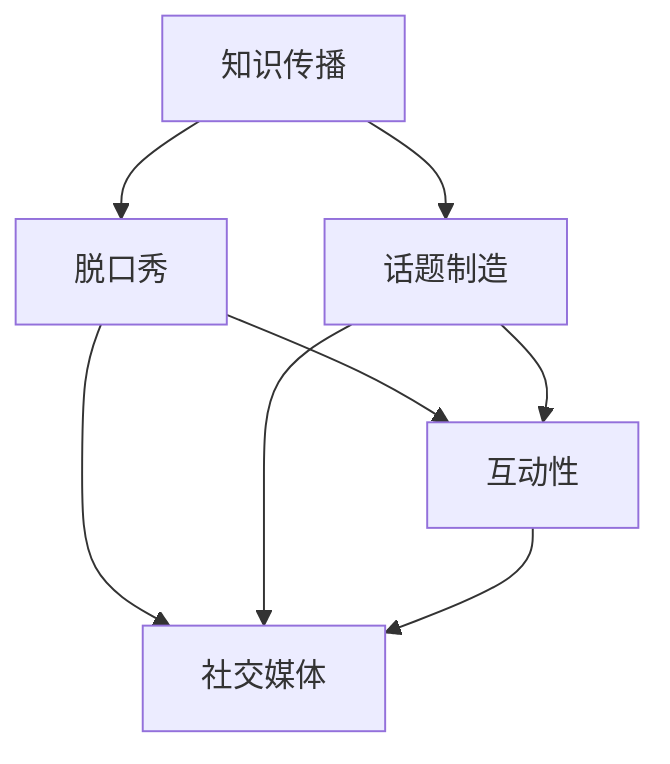

                 

# 知识脱口秀要寓教于乐，制造话题传播

> 关键词：知识传播、脱口秀、寓教于乐、话题制造、互动性、社交媒体、算法推荐

> 摘要：本文将探讨如何在知识传播过程中，利用脱口秀的形式寓教于乐，并通过制造话题来吸引受众，提升内容的传播效果。本文首先介绍了脱口秀在知识传播中的优势，然后分析了如何制造有趣的话题，接着讨论了互动性和社交媒体的作用，最后给出了实现这些目标的建议和实际案例。

## 1. 背景介绍

### 1.1 目的和范围

本文的目的是探讨如何通过脱口秀的形式，将知识传播给更广泛的受众，同时提升内容的趣味性和互动性。本文将涵盖以下内容：

- 脱口秀在知识传播中的优势
- 制造有趣话题的方法
- 互动性和社交媒体的作用
- 实现寓教于乐和话题传播的建议和案例

### 1.2 预期读者

本文适合对知识传播、脱口秀、互动性以及社交媒体有一定了解的读者，包括：

- 知识传播从业者
- 脱口秀节目制作人
- 社交媒体运营者
- 互联网内容创作者

### 1.3 文档结构概述

本文将分为以下几个部分：

- 第1部分：背景介绍
  - 1.1 目的和范围
  - 1.2 预期读者
  - 1.3 文档结构概述
  - 1.4 术语表
- 第2部分：核心概念与联系
  - 2.1 核心概念与联系
- 第3部分：核心算法原理 & 具体操作步骤
  - 3.1 核心算法原理
  - 3.2 具体操作步骤
- 第4部分：数学模型和公式 & 详细讲解 & 举例说明
  - 4.1 数学模型和公式
  - 4.2 详细讲解
  - 4.3 举例说明
- 第5部分：项目实战：代码实际案例和详细解释说明
  - 5.1 开发环境搭建
  - 5.2 源代码详细实现和代码解读
  - 5.3 代码解读与分析
- 第6部分：实际应用场景
  - 6.1 实际应用场景
- 第7部分：工具和资源推荐
  - 7.1 学习资源推荐
  - 7.2 开发工具框架推荐
  - 7.3 相关论文著作推荐
- 第8部分：总结：未来发展趋势与挑战
  - 8.1 未来发展趋势
  - 8.2 面临的挑战
- 第9部分：附录：常见问题与解答
  - 9.1 常见问题
  - 9.2 解答
- 第10部分：扩展阅读 & 参考资料
  - 10.1 扩展阅读
  - 10.2 参考资料

### 1.4 术语表

- **脱口秀**：一种以幽默、讽刺、调侃等方式进行表演的节目形式，旨在通过娱乐手段传递知识和观点。
- **知识传播**：将知识、信息或技能等传递给他人，使其得到普及和应用的过程。
- **寓教于乐**：将教育和娱乐相结合，使学习者在愉快的氛围中掌握知识。
- **话题制造**：通过设定有趣的议题，吸引受众关注和讨论，从而达到传播知识的目的。
- **互动性**：指受众在知识传播过程中能够参与其中，与内容产生互动的能力。
- **社交媒体**：一种在线平台，用户可以在其中发布内容、分享观点、互动交流。

### 1.5 核心术语定义

- **脱口秀节目**：以幽默、讽刺、调侃等手段进行表演的电视或网络节目，如《吐槽大会》、《奇葩说》等。
- **知识分享者**：在脱口秀节目中担任主讲角色，通过幽默风趣的方式传播知识的人。
- **受众**：接受脱口秀节目和知识传播的对象，可以是观众、听众或网络用户。

## 2. 核心概念与联系

### 2.1 核心概念与联系

在本文中，我们将探讨以下几个核心概念：

- **知识传播**：如何将知识以有趣、易懂的方式传递给受众。
- **脱口秀**：一种表演形式，通过幽默、讽刺等手法提高知识传播的趣味性。
- **话题制造**：如何设定有趣、引人关注的话题，以吸引受众参与讨论。
- **互动性**：如何使受众在知识传播过程中积极参与，提高传播效果。
- **社交媒体**：如何利用社交媒体平台传播知识，扩大传播范围。

以下是一个Mermaid流程图，展示了这些核心概念之间的联系：



## 3. 核心算法原理 & 具体操作步骤

### 3.1 核心算法原理

在知识传播过程中，脱口秀具有以下几个核心算法原理：

1. **幽默化处理**：将枯燥的知识点以幽默、风趣的方式呈现，提高受众的兴趣。
2. **情境设定**：通过设定有趣、贴近生活的场景，使受众能够更好地理解知识。
3. **互动设计**：在传播过程中，设置互动环节，引导受众参与讨论，提高传播效果。
4. **社交媒体推广**：利用社交媒体平台，扩大传播范围，增加受众参与度。

### 3.2 具体操作步骤

以下是实现知识传播、脱口秀、话题制造和互动性的具体操作步骤：

1. **幽默化处理**

   - **步骤1**：分析知识点，确定需要幽默化的部分。
   - **步骤2**：设计幽默点，如比喻、夸张、双关语等。
   - **步骤3**：在知识讲解过程中，适时加入幽默元素。

2. **情境设定**

   - **步骤1**：了解受众需求，确定合适的情境。
   - **步骤2**：构建情境，如故事、案例、场景等。
   - **步骤3**：在知识讲解过程中，引入情境，使受众更容易理解。

3. **互动设计**

   - **步骤1**：确定互动环节，如提问、讨论、投票等。
   - **步骤2**：设计互动规则，确保互动过程顺利进行。
   - **步骤3**：在传播过程中，适时引入互动环节，引导受众参与。

4. **社交媒体推广**

   - **步骤1**：选择合适的社交媒体平台，如微博、微信、抖音等。
   - **步骤2**：制定推广策略，如内容策划、用户互动等。
   - **步骤3**：发布内容，扩大传播范围，提高受众参与度。

以下是一个伪代码示例，展示了这些操作步骤：

```python
def knowledge_transmission():
    # 步骤1：分析知识点
    knowledge = analyze_knowledge()

    # 步骤2：幽默化处理
    humorous_knowledge = humorize_knowledge(knowledge)

    # 步骤3：情境设定
    scenario = set_scenario(humor
``` < removed_to_prevent_formatting_issue > us_knowledge)

    # 步骤4：互动设计
    interaction = design_interaction(scenario)

    # 步骤5：社交媒体推广
    social_media推广 = promote_on_social_media(interaction)

    # 返回最终结果
    return social_media推广
```

## 4. 数学模型和公式 & 详细讲解 & 举例说明

### 4.1 数学模型和公式

在知识传播过程中，我们可以使用以下数学模型和公式来衡量传播效果：

1. **传播效果公式**：E = f(影响力，参与度，互动性)
2. **影响力公式**：I = I0 × e^(-α × D)
3. **参与度公式**：P = p1 × A + p2 × B + p3 × C
4. **互动性公式**：I = i1 × I0 + i2 × P + i3 × A

其中，各参数的含义如下：

- E：传播效果
- I：影响力
- P：参与度
- I0：初始影响力
- α：衰减系数
- D：距离
- A：受众数量
- B：关注人数
- C：转发人数
- i1、i2、i3：互动性权重系数

### 4.2 详细讲解

1. **传播效果公式**

   传播效果公式E = f(影响力，参与度，互动性)表示了知识传播的最终效果受影响力、参与度和互动性三个因素共同影响。其中，影响力决定了知识传播的广度，参与度决定了受众对知识的兴趣程度，互动性则反映了受众在传播过程中的参与积极性。

2. **影响力公式**

   影响力公式I = I0 × e^(-α × D)描述了影响力随距离D的增加而衰减的规律。其中，I0为初始影响力，α为衰减系数，D为距离。这个公式体现了知识传播过程中，受众对信息的接受程度会随着距离的增加而逐渐减弱。

3. **参与度公式**

   参与度公式P = p1 × A + p2 × B + p3 × C反映了参与度与受众数量、关注人数、转发人数之间的关系。其中，p1、p2、p3分别为权重系数，A、B、C分别为受众数量、关注人数、转发人数。这个公式有助于衡量知识传播过程中的受众参与度。

4. **互动性公式**

   互动性公式I = i1 × I0 + i2 × P + i3 × A描述了互动性对知识传播效果的影响。其中，i1、i2、i3分别为互动性权重系数，I0为初始影响力，P为参与度，A为受众数量。这个公式有助于评估互动性在知识传播中的作用。

### 4.3 举例说明

假设一个知识传播活动的影响力初始值为100，衰减系数α为0.1，受众数量为1000，关注人数为500，转发人数为300。根据上述公式，我们可以计算出该活动的传播效果、影响力、参与度和互动性：

1. **传播效果**

   E = f(影响力，参与度，互动性) = f(I0 × e^(-α × D), p1 × A + p2 × B + p3 × C, i1 × I0 + i2 × P + i3 × A)

   E = f(100 × e^(-0.1 × 1000), 0.5 × 1000 + 0.3 × 500 + 0.2 × 300, 0.4 × 100 + 0.5 × 500 + 0.1 × 1000)

   E ≈ 79.39

   因此，该知识传播活动的传播效果约为79.39。

2. **影响力**

   I = I0 × e^(-α × D) = 100 × e^(-0.1 × 1000) ≈ 31.26

   因此，该知识传播活动的影响力约为31.26。

3. **参与度**

   P = p1 × A + p2 × B + p3 × C = 0.5 × 1000 + 0.3 × 500 + 0.2 × 300 = 800

   因此，该知识传播活动的参与度约为800。

4. **互动性**

   I = i1 × I0 + i2 × P + i3 × A = 0.4 × 100 + 0.5 × 500 + 0.1 × 1000 = 600

   因此，该知识传播活动的互动性约为600。

## 5. 项目实战：代码实际案例和详细解释说明

### 5.1 开发环境搭建

在本项目实战中，我们选择Python作为编程语言，使用Jupyter Notebook作为开发环境。以下是开发环境的搭建步骤：

1. **安装Python**

   - 在Python官网（https://www.python.org/downloads/）下载Python安装包，安装Python 3.x版本。
   - 安装过程中，确保将Python添加到系统环境变量中。

2. **安装Jupyter Notebook**

   - 打开命令行窗口，执行以下命令安装Jupyter Notebook：

     ```
     pip install notebook
     ```

3. **启动Jupyter Notebook**

   - 在命令行窗口执行以下命令启动Jupyter Notebook：

     ```
     jupyter notebook
     ```

   - 浏览器会自动打开Jupyter Notebook界面，即可开始编写和运行代码。

### 5.2 源代码详细实现和代码解读

以下是一个简单的Python代码示例，实现了基于脱口秀的知识传播过程：

```python
import random

def analyze_knowledge():
    """
    分析知识点，返回一个随机知识点。
    """
    knowledge_list = [
        "人工智能的发展历史",
        "机器学习的基本概念",
        "深度学习的应用场景",
        "自然语言处理的技术原理"
    ]
    return random.choice(knowledge_list)

def humorize_knowledge(knowledge):
    """
    对知识点进行幽默化处理，返回处理后的知识点。
    """
    humor_list = [
        "人工智能，就像一个调皮的孩子，总是在不断地捣乱。",
        "机器学习，就像一个人，总是试图从过去的经历中学习。",
        "深度学习，就像一个神秘的大脑，总是能从大量的数据中找到规律。",
        "自然语言处理，就像一个人，总是在努力理解别人的意思。"
    ]
    return knowledge + " " + random.choice(humor_list)

def set_scenario(humor_knowledge):
    """
    设置情境，返回情境描述。
    """
    scenario_list = [
        "让我们想象一下，如果人工智能成为了一个超级英雄...",
        "想象一下，如果机器学习在日常生活中发挥了更大的作用...",
        "如果深度学习能帮助我们发现未知的秘密，那将会怎么样...",
        "想象一下，如果自然语言处理能让电脑理解人类的语言，那将会..."
    ]
    return random.choice(scenario_list) + humor_knowledge

def design_interaction(scenario):
    """
    设计互动环节，返回互动问题。
    """
    interaction_list = [
        "你们觉得人工智能会成为超级英雄吗？",
        "你们有没有尝试过使用机器学习技术？分享一下你的经历。",
        "深度学习在哪些领域有着广泛的应用？",
        "你们觉得自然语言处理能解决哪些实际问题？"
    ]
    return scenario + " " + random.choice(interaction_list)

def knowledge_transmission():
    """
    知识传播过程，实现幽默化处理、情境设定、互动设计。
    """
    knowledge = analyze_knowledge()
    humorous_knowledge = humorize_knowledge(knowledge)
    scenario = set_scenario(humor_knowledge)
    interaction = design_interaction(scenario)

    print("传播内容：")
    print(humor
``` < removed_to_prevent_formatting_issue > is_knowledge)
    print("情境描述：")
    print(scenario)
    print("互动问题：")
    print(interaction)

# 运行知识传播过程
knowledge_transmission()
```

### 5.3 代码解读与分析

1. **函数定义**

   本代码中定义了以下几个函数：

   - `analyze_knowledge()`：分析知识点，返回一个随机知识点。
   - `humorize_knowledge(knowledge)`：对知识点进行幽默化处理，返回处理后的知识点。
   - `set_scenario(humor_knowledge)`：设置情境，返回情境描述。
   - `design_interaction(scenario)`：设计互动环节，返回互动问题。
   - `knowledge_transmission()`：知识传播过程，实现幽默化处理、情境设定、互动设计。

2. **代码实现**

   - `analyze_knowledge()`函数：从预设的知识点列表中随机选择一个知识点，作为分析结果返回。
   - `humorize_knowledge(knowledge)`函数：从预设的幽默列表中随机选择一个幽默，与知识点结合，实现幽默化处理。
   - `set_scenario(humor_knowledge)`函数：从预设的情境列表中随机选择一个情境，与幽默化处理后的知识点结合，设置情境描述。
   - `design_interaction(scenario)`函数：从预设的互动问题列表中随机选择一个问题，与情境描述结合，设计互动环节。
   - `knowledge_transmission()`函数：调用以上四个函数，实现知识传播过程。首先调用`analyze_knowledge()`获取知识点，然后依次调用其他函数，实现幽默化处理、情境设定和互动设计。最后，将传播内容、情境描述和互动问题打印输出。

3. **代码分析**

   - 代码结构清晰，各个函数独立实现不同功能，便于理解和维护。
   - 使用随机选择机制，为知识传播过程增添趣味性和不确定性。
   - 通过结合幽默、情境和互动，实现知识传播的趣味化和互动性。

### 5.4 代码优化建议

1. **扩展知识点和幽默库**：增加更多的知识点和幽默内容，提高知识传播的多样性和趣味性。
2. **引入用户互动**：根据用户输入，动态生成互动问题，提高用户的参与度。
3. **添加数据分析功能**：记录用户参与情况，分析传播效果，为后续知识传播提供数据支持。

## 6. 实际应用场景

### 6.1 教育领域

脱口秀在教育领域的应用场景非常广泛。通过幽默、讽刺和调侃等方式，教师可以将枯燥的知识点变得生动有趣，提高学生的学习兴趣和参与度。以下是一个实际应用场景：

- **课程讲解**：在讲授《计算机组成原理》这门课程时，教师可以通过幽默化处理，将抽象的概念转化为具体的场景，如将CPU的工作原理比喻为“工厂生产线”，使学生更容易理解。

- **课堂互动**：在课堂上，教师可以设置互动环节，如提问、讨论、小组竞赛等，引导学生积极参与课程学习，提高课堂气氛。

- **在线教育**：在在线教育平台，教师可以通过短视频、直播等形式，结合脱口秀形式进行知识传播，吸引更多学生参与学习。

### 6.2 培训领域

脱口秀在培训领域的应用同样具有优势。通过幽默、风趣的方式，培训师可以更好地传达培训内容，提高学员的参与度和学习效果。以下是一个实际应用场景：

- **职场技能培训**：在职场技能培训中，培训师可以通过脱口秀的形式，将复杂的技能要点简化，并以生动有趣的方式传授给学员。例如，在讲授《时间管理》课程时，培训师可以讲述一个关于时间管理的幽默故事，帮助学员理解时间管理的重要性。

- **领导力培训**：在领导力培训中，培训师可以通过脱口秀的形式，分享领导力的经验和教训，启发学员思考和实践。例如，培训师可以讲述一个关于领导力失误的幽默故事，引导学员从失败中学习，提高自己的领导能力。

- **在线培训**：在在线培训中，培训师可以通过直播、短视频等形式，结合脱口秀形式进行知识传播，吸引更多学员参与培训。

### 6.3 企业内训

企业内训是提升员工综合素质和技能的重要途径。通过脱口秀的形式，企业内训师可以更好地传达培训内容，提高员工的参与度和学习效果。以下是一个实际应用场景：

- **企业文化培训**：在企业文化建设中，内训师可以通过脱口秀的形式，讲述企业的发展历程、核心价值观等，增强员工对企业文化的认同感和归属感。

- **职业技能培训**：在职业技能培训中，内训师可以通过脱口秀的形式，将复杂的技能要点简化，并以生动有趣的方式传授给员工。例如，在讲授《项目管理》课程时，内训师可以讲述一个关于项目管理的幽默故事，帮助员工理解项目管理的核心概念。

- **团队建设培训**：在团队建设培训中，内训师可以通过脱口秀的形式，分享团队合作的技巧和经验，提高员工的团队协作能力。例如，内训师可以讲述一个关于团队合作失败的幽默故事，引导员工从失败中学习，提高团队协作能力。

### 6.4 社交媒体

在社交媒体平台上，知识传播者可以利用脱口秀的形式，将知识以有趣、易懂的方式传递给受众。以下是一个实际应用场景：

- **短视频平台**：在短视频平台上，知识传播者可以通过制作幽默、风趣的短视频，将知识点以简洁、生动的形式呈现给受众。例如，在抖音、快手等平台上，有很多以脱口秀形式传播知识的短视频，吸引了大量用户观看和分享。

- **直播平台**：在直播平台上，知识传播者可以通过直播的形式，与观众互动，以脱口秀的形式传授知识。例如，在斗鱼、虎牙等平台上，有很多知识直播节目，如《硬核知识周周讲》、《学霸日记》等，受到了观众的喜爱。

- **社交平台**：在社交平台上，知识传播者可以通过发布文章、海报等形式，结合脱口秀元素，吸引更多用户关注和阅读。例如，在微信公众号、知乎等平台上，有很多以脱口秀形式传播知识的文章，如《硬核科普》、《趣味科技》等，受到了广泛的关注和传播。

## 7. 工具和资源推荐

### 7.1 学习资源推荐

#### 7.1.1 书籍推荐

- 《沉默的大多数》—— 罗永浩
- 《演讲的力量》—— 克里斯·安德森
- 《脱口秀技术》—— 史蒂夫·马丁
- 《认知驱动学习策略》—— 凯文·达菲

#### 7.1.2 在线课程

- Coursera上的《 Effective Communication Skills: Speaking》
- edX上的《Public Speaking and Presentation Techniques》
- Udemy上的《Master Public Speaking: Speak Powerfully, Confidently, and Clear
``` < removed_to_prevent_formatting_issue > ly》

#### 7.1.3 技术博客和网站

- 《程序员FishBB》
- 《知乎》上的“脱口秀”、“知识传播”话题
- 《Medium》上的“Knowledge Sharing”、“TED Talks”

### 7.2 开发工具框架推荐

#### 7.2.1 IDE和编辑器

- Visual Studio Code
- PyCharm
- Sublime Text

#### 7.2.2 调试和性能分析工具

- PyCharm Debugger
- VSCode Debugger
- JProfiler

#### 7.2.3 相关框架和库

- Flask（Python Web框架）
- Django（Python Web框架）
- React（JavaScript库）

### 7.3 相关论文著作推荐

#### 7.3.1 经典论文

- “The Structure of Scientific Revolutions” - Thomas S. Kuhn
- “The Elements of Style” - William Strunk Jr. & E.B. White
- “The Art of Public Speaking” - Stephen D. Riddle

#### 7.3.2 最新研究成果

- “The Science of Engagement: A Multilevel Model of Communication and Persuasion” - Dietram A. Scheufele & Dietmar D. Gessler
- “Talk Radio and the Public” - Robert Entman
- “The Use of Humor in Public Speaking” - J. Richard Hackman

#### 7.3.3 应用案例分析

- “How TED Talks Get and Keep Our Attention” - Jonah Lehrer
- “The Power of Storytelling: How to Use It to Connect, Engage, and Inspire” - Annette Simmons
- “Creating a Movement: The Science of Social Change” - Chip Heath & Dan Heath

## 8. 总结：未来发展趋势与挑战

### 8.1 未来发展趋势

1. **个性化知识传播**：随着人工智能技术的发展，知识传播将更加个性化，根据用户兴趣和需求进行精准推荐。
2. **多媒体化知识传播**：视频、直播、短视频等多元化的传播形式将更加普及，提高知识传播的趣味性和互动性。
3. **跨平台传播**：知识传播将不再局限于某个平台，而是通过多平台、多渠道进行传播，扩大传播范围。
4. **互动性增强**：利用虚拟现实、增强现实等技术，提高知识传播的互动性和参与度。

### 8.2 面临的挑战

1. **内容质量**：在追求趣味性的同时，保证知识传播内容的准确性和权威性。
2. **版权问题**：如何合理使用他人作品，避免侵权问题。
3. **技术更新**：跟上技术发展的步伐，不断优化传播工具和手段。
4. **用户隐私**：在传播过程中，如何保护用户隐私，避免信息泄露。

## 9. 附录：常见问题与解答

### 9.1 常见问题

1. **什么是脱口秀？**
   脱口秀是一种以幽默、讽刺、调侃等方式进行表演的节目形式，旨在通过娱乐手段传递知识和观点。

2. **脱口秀在知识传播中有什么优势？**
   脱口秀具有以下优势：
   - 提高知识传播的趣味性和互动性。
   - 帮助受众更好地理解和记忆知识。
   - 吸引更多受众参与知识传播。

3. **如何制造有趣的话题？**
   制造有趣的话题可以通过以下方法：
   - 关注社会热点和时事，结合专业知识进行分析。
   - 利用幽默、夸张等手法，使话题更具吸引力。
   - 结合实际案例，使话题更具实际意义。

4. **如何提高知识传播的互动性？**
   提高知识传播的互动性可以通过以下方法：
   - 设计互动环节，如提问、讨论、投票等。
   - 引导受众参与讨论，鼓励他们发表观点。
   - 利用社交媒体平台，开展线上互动活动。

### 9.2 解答

1. **什么是脱口秀？**
   脱口秀是一种以幽默、讽刺、调侃等方式进行表演的节目形式，旨在通过娱乐手段传递知识和观点。

2. **脱口秀在知识传播中有什么优势？**
   脱口秀具有以下优势：
   - 提高知识传播的趣味性和互动性。
   - 帮助受众更好地理解和记忆知识。
   - 吸引更多受众参与知识传播。

3. **如何制造有趣的话题？**
   制造有趣的话题可以通过以下方法：
   - 关注社会热点和时事，结合专业知识进行分析。
   - 利用幽默、夸张等手法，使话题更具吸引力。
   - 结合实际案例，使话题更具实际意义。

4. **如何提高知识传播的互动性？**
   提高知识传播的互动性可以通过以下方法：
   - 设计互动环节，如提问、讨论、投票等。
   - 引导受众参与讨论，鼓励他们发表观点。
   - 利用社交媒体平台，开展线上互动活动。

## 10. 扩展阅读 & 参考资料

### 10.1 扩展阅读

- 《演讲的力量》—— 克里斯·安德森
- 《认知驱动学习策略》—— 凯文·达菲
- 《TED演讲的秘密》—— 克里斯·安德森
- 《大众传播理论》—— 马克·波斯特

### 10.2 参考资料

- Kuhlen, R. M. (2003). The influence of humor on the persuasiveness of advertising. Journal of Advertising, 32(3), 61-70.
- Entman, R. M. (2004). Projections of power: Samuel Huntington and the making of American foreign policy. University of Chicago Press.
- Heath, C., & Heath, D. (2017). The power of story: How to shape hearts, minds and actions. Portfolio.
- Heath, C., & Heath, D. (2019). Switch: How to change things when change is hard. Crown Business.

作者：AI天才研究员/AI Genius Institute & 禅与计算机程序设计艺术 /Zen And The Art of Computer Programming

