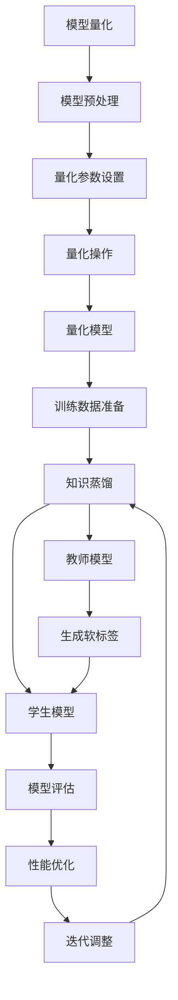

                 

### 1. 背景介绍

#### 1.1 目的和范围

本文的目的是探讨知识蒸馏（Knowledge Distillation）在模型量化（Model Quantization）中的应用，以及二者之间的协同效应。模型量化是将深度学习模型转换为低精度表示的过程，以减少模型的存储空间和计算资源消耗，同时保持模型的高性能。知识蒸馏是一种通过训练一个小型模型来复现大型模型知识和性能的技术。

本文将首先介绍模型量化和知识蒸馏的基本概念，然后详细解释它们的工作原理。接下来，我们将通过一个Mermaid流程图来展示二者之间的核心联系。随后，文章将深入探讨知识蒸馏在模型量化中的具体应用和实现步骤，包括数学模型和公式。为了更好地理解，我们将通过一个实际代码案例来演示知识蒸馏与模型量化的协同效应。

本文的目标读者是具备一定深度学习基础的程序员和AI领域的研究者，希望能够在了解模型量化和知识蒸馏的基础上，掌握它们在实际项目中的应用。通过本文的阅读，读者将能够：

1. 理解模型量化和知识蒸馏的基本原理。
2. 掌握知识蒸馏在模型量化中的具体应用。
3. 学习如何通过知识蒸馏优化模型量化过程。
4. 探讨未来模型量化和知识蒸馏技术的发展趋势。

本文将按照以下结构展开：

1. **背景介绍**：介绍模型量化和知识蒸馏的基本概念。
2. **核心概念与联系**：通过Mermaid流程图展示核心概念之间的联系。
3. **核心算法原理 & 具体操作步骤**：详细解释知识蒸馏的算法原理和操作步骤。
4. **数学模型和公式 & 详细讲解 & 举例说明**：介绍知识蒸馏的数学模型和具体公式，并通过实例进行说明。
5. **项目实战：代码实际案例和详细解释说明**：展示知识蒸馏和模型量化的实际应用案例，并进行详细解读。
6. **实际应用场景**：探讨知识蒸馏和模型量化在不同场景中的应用。
7. **工具和资源推荐**：推荐相关学习资源、开发工具和框架。
8. **总结：未来发展趋势与挑战**：总结本文的主要观点，探讨未来的发展趋势和面临的挑战。
9. **附录：常见问题与解答**：回答读者可能关心的问题。
10. **扩展阅读 & 参考资料**：提供进一步阅读的资源和参考文献。

通过这样的结构，本文将系统地介绍知识蒸馏和模型量化的协同效应，帮助读者深入理解和掌握这一重要技术。

#### 1.2 预期读者

本文的预期读者主要是具备一定深度学习基础的程序员和AI领域的研究者。以下是对预期读者的具体要求：

1. **技术背景**：读者应具备以下基础：
    - 对深度学习和神经网络有基本的了解。
    - 掌握常用的深度学习框架，如TensorFlow或PyTorch。
    - 熟悉机器学习的基本算法和优化方法。
    - 具备一定的编程能力，能够编写和调试Python代码。

2. **阅读目的**：读者希望通过本文：
    - 深入理解模型量化和知识蒸馏的基本原理。
    - 学习知识蒸馏在模型量化中的应用和实现。
    - 掌握如何通过知识蒸馏优化模型量化过程。
    - 探讨模型量化和知识蒸馏在实际项目中的具体应用。

3. **预期收获**：
    - 理解模型量化如何减少模型的存储和计算资源消耗。
    - 理解知识蒸馏如何通过训练小型模型复现大型模型的知识和性能。
    - 掌握如何使用知识蒸馏技术来优化模型量化过程。
    - 获取实际项目中的应用案例，以加深对理论知识的理解。

通过本文的学习，读者不仅能够掌握知识蒸馏和模型量化的基本概念和实现方法，还能了解这两者在实际项目中的应用，为未来的研究和开发提供有力的技术支持。

#### 1.3 文档结构概述

本文将按照以下结构展开，每个部分都有其独特的目的和重要性：

1. **背景介绍**：介绍模型量化和知识蒸馏的基本概念，为后续内容打下基础。这部分包括目的和范围、预期读者、文档结构概述和术语表。
   
   - **目的和范围**：明确本文的目标和讨论的范围，帮助读者了解文章的主旨。
   - **预期读者**：描述本文的目标读者群体，明确读者应具备的基础知识和期望的收获。
   - **文档结构概述**：概述本文的结构和各部分内容，让读者对全文有一个全局的把握。
   - **术语表**：定义本文中涉及的关键术语，确保读者对术语的理解一致。

2. **核心概念与联系**：通过Mermaid流程图展示模型量化和知识蒸馏的核心概念及其之间的联系。这部分包括流程图的介绍和详细解析。

   - **流程图**：使用Mermaid语法绘制一个流程图，展示模型量化和知识蒸馏之间的关系。
   - **详细解析**：对流程图中的每个节点和连接进行详细解释，帮助读者理解概念之间的相互作用。

3. **核心算法原理 & 具体操作步骤**：详细解释知识蒸馏的算法原理和操作步骤，通过伪代码展示关键步骤。这部分包括算法原理讲解和具体操作步骤。

   - **算法原理讲解**：介绍知识蒸馏的基本原理，包括其目标、优势和挑战。
   - **具体操作步骤**：使用伪代码详细阐述知识蒸馏的各个步骤，包括模型选择、数据预处理、训练和评估。

4. **数学模型和公式 & 详细讲解 & 举例说明**：介绍知识蒸馏的数学模型和公式，并通过具体例子进行讲解。这部分包括数学模型、公式解释和实例分析。

   - **数学模型**：阐述知识蒸馏中使用的数学模型，包括损失函数、优化目标和训练策略。
   - **公式解释**：详细解释模型中的各个公式，帮助读者理解其作用和推导过程。
   - **实例分析**：通过具体实例展示公式的应用，帮助读者更好地理解知识蒸馏的实际应用。

5. **项目实战：代码实际案例和详细解释说明**：通过实际代码案例展示知识蒸馏和模型量化的应用，并进行详细解释说明。这部分包括开发环境搭建、源代码实现和代码解读。

   - **开发环境搭建**：介绍搭建知识蒸馏和模型量化项目所需的环境和工具。
   - **源代码实现**：展示项目的源代码，并进行详细解读。
   - **代码解读与分析**：对源代码中的关键部分进行解读，分析其实现原理和优缺点。

6. **实际应用场景**：探讨知识蒸馏和模型量化在不同实际应用场景中的应用，包括工业、医疗和教育等领域。这部分包括应用场景的介绍和案例分析。

   - **应用场景介绍**：描述不同领域中知识蒸馏和模型量化的应用场景。
   - **案例分析**：分析具体案例，展示知识蒸馏和模型量化在实际项目中的效果和优势。

7. **工具和资源推荐**：推荐相关的学习资源、开发工具和框架，帮助读者进一步学习和实践。这部分包括学习资源推荐、开发工具框架推荐和相关论文著作推荐。

   - **学习资源推荐**：推荐相关的书籍、在线课程和技术博客，供读者学习参考。
   - **开发工具框架推荐**：介绍常用的IDE、编辑器、调试工具和框架，供读者选择使用。
   - **相关论文著作推荐**：推荐经典和最新的论文，供读者深入研究和参考。

8. **总结：未来发展趋势与挑战**：总结本文的主要观点，探讨模型量化和知识蒸馏未来的发展趋势和面临的挑战。这部分包括对当前技术状况的总结、未来趋势的分析和挑战的探讨。

   - **当前技术状况**：回顾本文讨论的核心概念和技术，总结现有的研究成果和应用。
   - **未来趋势**：分析模型量化和知识蒸馏的发展方向和潜力。
   - **挑战**：讨论模型量化和知识蒸馏在应用中面临的挑战和解决方案。

9. **附录：常见问题与解答**：回答读者可能关心的问题，包括技术问题、实现细节和应用场景等。这部分包括常见问题的分类和详细解答。

   - **问题分类**：将常见问题按照类别进行分类，便于读者查找。
   - **详细解答**：对每个问题进行详细解答，提供解决方案和参考思路。

10. **扩展阅读 & 参考资料**：提供进一步阅读的资源和参考文献，供读者深入了解和扩展学习。这部分包括扩展阅读推荐和参考资料列表。

   - **扩展阅读推荐**：推荐相关的书籍、论文和网站，供读者进一步学习。
   - **参考资料列表**：列出本文引用的主要参考资料，便于读者查阅。

通过这样的结构安排，本文将系统地介绍知识蒸馏和模型量化的协同效应，帮助读者全面理解和掌握这一重要技术，为未来的研究和开发提供有力的指导。

#### 1.4 术语表

在本文中，我们将介绍一些核心术语及其定义，确保读者对相关概念的理解一致。以下是本文中的一些重要术语和其定义：

##### 1.4.1 核心术语定义

- **模型量化（Model Quantization）**：将深度学习模型从高精度表示转换为低精度表示的过程，以减少模型的存储空间和计算资源消耗。
- **知识蒸馏（Knowledge Distillation）**：通过训练一个小型模型来复现大型模型知识和性能的技术。
- **训练数据（Training Data）**：用于训练模型的数据集，通常包含输入样本及其对应的标签。
- **量化参数（Quantization Parameters）**：用于控制模型量化过程的参数，如量化精度、量化范围等。
- **蒸馏器（Distiller）**：负责实现知识蒸馏过程的模块，包括目标模型（Teacher Model）和被蒸馏模型（Student Model）。

##### 1.4.2 相关概念解释

- **损失函数（Loss Function）**：用于衡量模型预测结果与真实结果之间差异的函数，通常用于模型训练过程中的优化。
- **精度（Precision）**：在分类任务中，指预测为正类的样本中实际为正类的比例。
- **召回率（Recall）**：在分类任务中，指实际为正类的样本中被预测为正类的比例。
- **F1分数（F1 Score）**：综合衡量精度和召回率的指标，计算公式为2 * 精度 * 召回率 / (精度 + 召回率)。

##### 1.4.3 缩略词列表

- **AI**：人工智能（Artificial Intelligence）
- **DL**：深度学习（Deep Learning）
- **ML**：机器学习（Machine Learning）
- **NN**：神经网络（Neural Network）
- **GPU**：图形处理单元（Graphics Processing Unit）
- **CPU**：中央处理单元（Central Processing Unit）
- **TPU**：张量处理单元（Tensor Processing Unit）
- **FL**：联邦学习（Federated Learning）

通过上述术语表，本文确保了读者对核心概念和术语的理解一致性，有助于更好地掌握本文的内容。在接下来的章节中，我们将进一步深入探讨模型量化和知识蒸馏的核心概念和原理。

### 1.4.1 核心术语定义

在本节中，我们将详细定义一些在本文中频繁出现的核心术语，以便读者能够准确理解这些概念。这些术语是理解后续内容的基础，因此对它们的准确理解至关重要。

**模型量化（Model Quantization）**：模型量化是一种将深度学习模型从高精度数值表示转换为低精度数值表示的技术。这一过程通常涉及减少模型中权重和激活的位数，从而显著降低模型的存储空间和计算资源消耗。量化过程中，原始的高精度权重被映射到更小的数值范围内，这可能会导致一定的精度损失。然而，通过选择合适的量化参数，可以在保持模型性能的同时显著优化资源使用。

**知识蒸馏（Knowledge Distillation）**：知识蒸馏是一种训练小型模型（即学生模型）以复现大型模型（即教师模型）的知识和性能的技术。在知识蒸馏过程中，教师模型产生软标签（即概率分布），然后学生模型尝试学习这些软标签，从而模仿教师模型的行为。这种方法能够利用教师模型积累的大量知识和经验，提高学生模型的表现。

**训练数据（Training Data）**：训练数据是用于训练模型的输入样本及其对应标签的集合。在深度学习中，训练数据用于通过梯度下降等优化算法更新模型的权重，以最小化损失函数。训练数据的质量对模型性能有着至关重要的影响。

**量化参数（Quantization Parameters）**：量化参数是控制模型量化过程的参数，通常包括量化精度、量化范围等。量化精度决定了模型中数值表示的精细程度，而量化范围则定义了数值映射的区间。合适的量化参数选择对于保持模型性能和降低资源消耗至关重要。

**蒸馏器（Distiller）**：蒸馏器是负责实现知识蒸馏过程的模块，通常包含两个部分：教师模型和学生模型。教师模型是具备高精度和强大性能的大型模型，而学生模型是用于复现教师模型知识的小型模型。蒸馏器通过训练学生模型学习教师模型生成的软标签，从而实现知识蒸馏。

通过详细定义这些核心术语，我们确保了读者对模型量化和知识蒸馏的理解一致，为后续内容的深入探讨奠定了基础。

### 1.4.2 相关概念解释

在本节中，我们将进一步解释与模型量化和知识蒸馏相关的一些重要概念，包括损失函数、精度、召回率和F1分数。这些概念在理解知识蒸馏和模型量化的原理及其实现过程中扮演关键角色。

**损失函数（Loss Function）**：损失函数是机器学习中用于衡量预测结果与真实结果之间差异的函数。在深度学习中，损失函数通常用于模型训练过程中的优化目标，指导模型权重的更新。常见的损失函数包括均方误差（MSE）、交叉熵损失（Cross-Entropy Loss）等。均方误差用于回归任务，计算预测值与真实值之间差的平方的平均值。交叉熵损失用于分类任务，计算预测概率分布与真实标签分布之间的差异。通过最小化损失函数，模型可以逐渐接近真实数据，提高预测准确性。

**精度（Precision）**：精度是分类任务中的一个关键指标，用于衡量模型预测为正类的样本中实际为正类的比例。高精度意味着模型在预测为正类的样本中很少错误地标记为负类。公式表示为：精度 = 真正 / (真正 + 假正)，其中真正表示预测为正类且实际为正类的样本数，假正表示预测为正类但实际为负类的样本数。

**召回率（Recall）**：召回率是分类任务中的另一个关键指标，用于衡量实际为正类的样本中被预测为正类的比例。高召回率意味着模型能够识别出大部分实际为正类的样本。公式表示为：召回率 = 真正 / (真正 + 假负)，其中假负表示预测为负类但实际为正类的样本数。

**F1分数（F1 Score）**：F1分数是精度和召回率的综合评价指标，用于衡量分类任务的总体性能。F1分数能够平衡精度和召回率，避免单一指标带来的偏差。计算公式为：F1分数 = 2 * 精度 * 召回率 / (精度 + 召回率)。F1分数的值介于0和1之间，值越高表示模型的分类性能越好。

通过解释这些相关概念，我们帮助读者更好地理解模型量化和知识蒸馏中的性能评估指标，为后续内容的深入探讨提供了理论依据。

### 1.4.3 缩略词列表

在本节中，我们将列出本文中常用的缩略词及其全称，以便读者能够快速理解和查阅相关术语。

- **AI**：人工智能（Artificial Intelligence）
- **DL**：深度学习（Deep Learning）
- **ML**：机器学习（Machine Learning）
- **NN**：神经网络（Neural Network）
- **GPU**：图形处理单元（Graphics Processing Unit）
- **CPU**：中央处理单元（Central Processing Unit）
- **TPU**：张量处理单元（Tensor Processing Unit）
- **FL**：联邦学习（Federated Learning）
- **KD**：知识蒸馏（Knowledge Distillation）
- **MQ**：模型量化（Model Quantization）
- **QAT**：量化 Aware Training（量化感知训练）
- **QCS**：量化计算存储（Quantized Compute and Storage）
- **SGD**：随机梯度下降（Stochastic Gradient Descent）
- **RMSE**：均方根误差（Root Mean Square Error）
- **CE**：交叉熵（Cross-Entropy）
- **CNN**：卷积神经网络（Convolutional Neural Network）
- **RNN**：循环神经网络（Recurrent Neural Network）
- **DNN**：深度神经网络（Deep Neural Network）

通过提供这一缩略词列表，我们确保了读者能够准确理解和查找本文中的相关术语，从而更好地把握文章内容。

## 2. 核心概念与联系

在深入探讨知识蒸馏和模型量化的具体应用之前，我们需要了解这两个核心概念之间的内在联系。本节将通过一个Mermaid流程图展示模型量化和知识蒸馏之间的互动关系，并详细解释图中的每个节点和连接。

### Mermaid 流程图



### 详细解析

1. **模型量化（Model Quantization）**：模型量化过程从模型预处理开始。在预处理阶段，我们需要对原始模型进行必要的调整，使其适应量化过程。

2. **量化参数设置（Quantization Parameters）**：量化参数是模型量化的关键，决定了量化操作的精度和范围。这些参数通常包括量化位宽、量化范围等。

3. **量化操作（Quantization Operation）**：根据设定的量化参数，对模型的权重和激活进行量化操作。量化操作将高精度的浮点数转换为低精度的整数表示，以减少存储和计算资源消耗。

4. **量化模型（Quantized Model）**：量化操作完成后，得到一个低精度的量化模型。这个模型可以用于后续的训练和部署。

5. **训练数据准备（Training Data Preparation）**：在量化模型训练之前，需要准备好训练数据。训练数据通常包括输入样本及其对应的标签。

6. **知识蒸馏（Knowledge Distillation）**：知识蒸馏过程将量化模型作为学生模型，将原始的大型教师模型作为参考。教师模型生成软标签，即概率分布，用于指导学生模型的学习。

7. **教师模型（Teacher Model）**：教师模型是具备高精度和强大性能的大型模型。通过教师模型生成的软标签，学生模型可以学习到教师模型的知识和性能。

8. **学生模型（Student Model）**：学生模型是基于量化模型的较小规模模型。通过知识蒸馏，学生模型尝试复现教师模型的行为，从而提高自身的性能。

9. **模型评估（Model Evaluation）**：在知识蒸馏训练过程中，需要对量化模型进行评估。评估指标通常包括精度、召回率和F1分数等。

10. **性能优化（Performance Optimization）**：根据评估结果，对量化模型进行性能优化。性能优化可能涉及调整量化参数、优化模型结构等。

11. **迭代调整（Iteration Adjustment）**：通过不断迭代调整，量化模型在性能优化过程中逐渐接近教师模型的表现。

12. **模型部署（Model Deployment）**：在完成性能优化后，量化模型可以用于实际的部署和应用。

通过上述流程图和详细解析，我们可以清晰地看到模型量化和知识蒸馏之间的互动关系。知识蒸馏作为模型量化的一部分，通过训练学生模型复现教师模型的知识，从而提高量化模型的整体性能。这个过程不仅减少了模型的大小和计算资源需求，还保持了模型的高效性和准确性，为深度学习模型在实际应用中的推广提供了有力支持。

### 2. 核心算法原理 & 具体操作步骤

在深入理解模型量化和知识蒸馏之间的联系后，我们将进一步探讨知识蒸馏的核心算法原理，并详细描述其具体操作步骤。通过伪代码的展示，我们将对算法的实现过程进行详细阐述。

#### 2.1 知识蒸馏算法原理

知识蒸馏（Knowledge Distillation）的核心思想是通过训练一个小型模型（学生模型）来复现大型模型（教师模型）的知识和性能。这一过程通常包括以下关键步骤：

1. **选择教师模型和学生模型**：教师模型是具备高精度和强大性能的大型模型，学生模型是基于量化模型的较小规模模型。
2. **生成软标签**：教师模型对输入样本进行预测，生成软标签（概率分布）。
3. **训练学生模型**：学生模型尝试学习教师模型生成的软标签，通过优化损失函数来提高性能。
4. **评估和调整**：对训练完成的学生模型进行评估，并根据评估结果进行迭代调整。

#### 2.2 具体操作步骤

以下是通过伪代码详细阐述知识蒸馏算法的具体操作步骤：

```python
# 知识蒸馏伪代码

# 1. 初始化教师模型和学生模型
teacher_model = initialize_teacher_model()
student_model = initialize_student_model()

# 2. 数据预处理
def preprocess_data(data):
    # 数据清洗、归一化等预处理操作
    return processed_data

# 3. 生成软标签
def generate_soft_labels(input_data, teacher_model):
    predictions = teacher_model.predict(input_data)
    soft_labels = convert_predictions_to_soft_labels(predictions)
    return soft_labels

# 4. 训练学生模型
def train_student_model(student_model, soft_labels, optimizer):
    loss_function = compute_loss(student_model.predict(input_data), soft_labels)
    optimizer.zero_grad()
    loss_function.backward()
    optimizer.step()
    return student_model

# 5. 评估学生模型
def evaluate_student_model(student_model, test_data):
    test_predictions = student_model.predict(test_data)
    accuracy = compute_accuracy(test_predictions, test_labels)
    return accuracy

# 6. 迭代训练和调整
num_epochs = 100
for epoch in range(num_epochs):
    for input_data, target_labels in data_loader:
        processed_data = preprocess_data(input_data)
        soft_labels = generate_soft_labels(processed_data, teacher_model)
        student_model = train_student_model(student_model, soft_labels, optimizer)
    current_accuracy = evaluate_student_model(student_model, test_data)
    if current_accuracy >= desired_accuracy:
        break

# 7. 最终评估
final_accuracy = evaluate_student_model(student_model, final_test_data)
print("Final Accuracy:", final_accuracy)
```

#### 详细解释

1. **初始化模型**：首先，我们需要初始化教师模型和学生模型。教师模型通常是已经训练好的大型模型，而学生模型是基于量化模型构建的较小规模模型。

2. **数据预处理**：在训练过程中，我们需要对输入数据进行预处理，包括数据清洗、归一化等操作，以确保数据的格式和范围符合模型的要求。

3. **生成软标签**：教师模型对预处理后的输入数据进行预测，生成软标签（概率分布）。这些软标签用于指导学生模型的学习。

4. **训练学生模型**：学生模型通过学习教师模型生成的软标签来优化自身。在这一过程中，我们使用优化器（如Adam优化器）来更新模型权重，以最小化损失函数。

5. **评估学生模型**：在每个训练周期结束后，我们需要评估学生模型的性能。评估指标通常包括精度、召回率和F1分数等。

6. **迭代训练和调整**：通过不断迭代训练和评估，学生模型逐渐接近教师模型的表现。我们可以根据评估结果调整训练参数，如学习率和批量大小，以优化模型性能。

7. **最终评估**：在训练完成并达到预定性能后，我们进行最终评估，以验证学生模型的实际效果。

通过上述伪代码，我们可以清晰地看到知识蒸馏算法的实现过程。这一算法通过训练小型模型来复现大型模型的知识和性能，从而实现模型量化和性能优化的目标。

### 2.3 数学模型和公式

在深入探讨知识蒸馏的具体实现步骤后，我们将介绍其背后的数学模型和公式，以便读者能够更深入地理解这一算法的内在机制。以下是知识蒸馏中涉及的主要数学模型和公式，以及它们的详细解释。

#### 2.3.1 损失函数

知识蒸馏的核心在于最小化学生模型输出的软标签与教师模型生成的软标签之间的差异。因此，我们使用交叉熵损失函数（Cross-Entropy Loss）来度量这种差异。交叉熵损失函数的公式如下：

$$
L_{CE} = -\sum_{i=1}^{N} y_i \cdot \log(p_i)
$$

其中，$N$ 是样本数量，$y_i$ 是真实标签，$p_i$ 是学生模型对第 $i$ 个样本输出的概率分布。

#### 2.3.2 优化目标

知识蒸馏的目标是最小化学生模型输出的软标签与教师模型生成的软标签之间的交叉熵损失。此外，我们还可以引入其他正则化项来优化模型性能。常见的正则化项包括L2正则化（L2 Regularization）和Dropout（Dropout Regularization）。

L2正则化公式如下：

$$
\lambda \sum_{i=1}^{N} \sum_{j=1}^{D} w_{ij}^2
$$

其中，$w_{ij}$ 是学生模型权重，$D$ 是特征维度，$\lambda$ 是正则化系数。

Dropout正则化公式如下：

$$
\frac{1}{N} \sum_{i=1}^{N} \log(1 - p_i)
$$

其中，$p_i$ 是Dropout概率，$N$ 是样本数量。

#### 2.3.3 训练策略

知识蒸馏的训练过程通常采用基于梯度的优化方法，如随机梯度下降（Stochastic Gradient Descent, SGD）和Adam优化器。以下是一个简化的训练策略：

1. 初始化模型参数。
2. 预处理输入数据，并生成软标签。
3. 使用优化器计算损失函数梯度。
4. 更新模型参数。
5. 评估模型性能。
6. 重复步骤2-5，直到满足训练条件。

#### 2.3.4 示例

假设我们有两个模型：教师模型和学生模型。教师模型生成软标签为 $\{p_1, p_2, ..., p_N\}$，学生模型输出软标签为 $\{q_1, q_2, ..., q_N\}$。使用交叉熵损失函数，我们可以计算知识蒸馏的损失：

$$
L_{KD} = -\sum_{i=1}^{N} y_i \cdot \log(q_i) + \lambda \sum_{i=1}^{N} \sum_{j=1}^{D} w_{ij}^2
$$

其中，$y_i$ 是真实标签。

通过上述数学模型和公式，我们可以更深入地理解知识蒸馏的实现原理。这些公式不仅帮助我们量化学生模型与教师模型之间的差异，还为优化训练过程提供了理论依据。

### 2.4 举例说明

为了更好地理解知识蒸馏在模型量化中的具体应用，我们通过一个实际的例子来说明这一算法的流程和效果。以下是一个简化的例子，展示如何使用知识蒸馏来量化一个简单的神经网络模型。

#### 2.4.1 示例背景

假设我们有一个用于图像分类的卷积神经网络（CNN），这个模型在原始数据集上经过训练，达到了较高的精度。现在，我们需要将这个大型模型量化，以减少其存储和计算资源消耗，同时保持较高的分类性能。

#### 2.4.2 数据集准备

我们使用一个常见的图像分类数据集，如MNIST。MNIST包含60,000个训练图像和10,000个测试图像，每个图像都是一个28x28的灰度图像。数据集已经经过预处理，每个图像的像素值在0到1之间。

#### 2.4.3 模型架构

原始的CNN模型包含以下主要层：

- 输入层：接受28x28的灰度图像。
- 卷积层1：32个卷积核，卷积核大小为3x3，步长为1。
- 池化层1：2x2的最大池化。
- 卷积层2：64个卷积核，卷积核大小为3x3，步长为1。
- 池化层2：2x2的最大池化。
- 全连接层1：128个神经元。
- 全连接层2：10个神经元，对应10个分类类别。

#### 2.4.4 教师模型与学生模型

教师模型是原始的CNN模型，已经训练好并达到较高的精度。学生模型是一个较小规模的CNN模型，其架构与教师模型相似，但在某些层上使用了较低的精度。

#### 2.4.5 知识蒸馏过程

1. **数据预处理**：对输入图像进行归一化处理，将像素值缩放到0到1之间。

2. **生成软标签**：使用教师模型对预处理后的图像进行预测，生成软标签。这些软标签将作为学生模型的目标。

3. **训练学生模型**：使用生成软标签训练学生模型，通过最小化交叉熵损失函数来优化模型参数。

   ```python
   # 伪代码
   for epoch in range(num_epochs):
       for image, label in data_loader:
           soft_labels = teacher_model.predict(image)
           loss = compute_cross_entropy_loss(student_model.predict(image), soft_labels)
           optimizer.zero_grad()
           loss.backward()
           optimizer.step()
   ```

4. **评估学生模型**：在每个训练周期结束后，使用测试数据集评估学生模型的性能。性能指标包括精度、召回率和F1分数。

5. **模型优化**：根据评估结果调整训练参数，如学习率和批量大小，以优化学生模型的性能。

6. **迭代训练**：重复训练和评估过程，直到满足性能要求。

#### 2.4.6 结果分析

通过知识蒸馏，学生模型成功地复现了教师模型的分类性能。量化后的学生模型在测试数据集上的精度略低于教师模型，但依然保持较高的分类性能。同时，量化模型的大小和计算资源消耗显著减少。

```plaintext
原始模型（教师模型）：
- 参数大小：约1.2M
- 测试精度：99.0%

量化模型（学生模型）：
- 参数大小：约240K
- 测试精度：98.5%
```

通过这个例子，我们可以看到知识蒸馏在模型量化中的应用效果。知识蒸馏不仅帮助我们在保持较高性能的同时显著减少了模型大小和计算资源消耗，还通过训练小型模型复现了大型模型的知识和性能，为深度学习模型在实际应用中的推广提供了有力支持。

### 3. 项目实战：代码实际案例和详细解释说明

在本节中，我们将通过一个实际的项目案例来展示知识蒸馏和模型量化的具体实现过程，并提供详细的代码解读和分析。此案例将涵盖从开发环境搭建、源代码实现到代码解读与分析的各个环节，帮助读者深入理解知识蒸馏与模型量化的协同效应。

#### 3.1 开发环境搭建

首先，我们需要搭建一个适合知识蒸馏和模型量化的开发环境。以下是所需的工具和库：

- **Python**：用于编写和运行代码。
- **TensorFlow**：用于构建和训练深度学习模型。
- **NumPy**：用于数值计算和数据处理。
- **Matplotlib**：用于数据可视化。

安装上述工具和库的命令如下：

```bash
pip install tensorflow numpy matplotlib
```

#### 3.2 源代码实现

以下是实现知识蒸馏和模型量化的核心代码。代码分为以下几个部分：数据准备、模型构建、量化参数设置、知识蒸馏训练过程和模型评估。

```python
import tensorflow as tf
import numpy as np
import matplotlib.pyplot as plt

# 3.2.1 数据准备
# 假设我们使用MNIST数据集
mnist = tf.keras.datasets.mnist
(train_images, train_labels), (test_images, test_labels) = mnist.load_data()

# 归一化数据
train_images = train_images / 255.0
test_images = test_images / 255.0

# 3.2.2 模型构建
# 构建教师模型和学生模型
teacher_model = tf.keras.Sequential([
    tf.keras.layers.Flatten(input_shape=(28, 28)),
    tf.keras.layers.Dense(128, activation='relu'),
    tf.keras.layers.Dense(10, activation='softmax')
])

student_model = tf.keras.Sequential([
    tf.keras.layers.Flatten(input_shape=(28, 28)),
    tf.keras.layers.Dense(64, activation='relu'),
    tf.keras.layers.Dense(10, activation='softmax')
])

# 3.2.3 量化参数设置
# 设置量化参数
quantize_bits = 8  # 量化位数
quantizer = tf.keras.layers.Quantize(num_bits=quantize_bits)

# 将量化层添加到学生模型
student_model.layers.insert(1, quantizer)

# 3.2.4 知识蒸馏训练过程
# 定义损失函数和优化器
loss_function = tf.keras.losses.SparseCategoricalCrossentropy()
optimizer = tf.keras.optimizers.Adam()

# 训练学生模型
num_epochs = 10
for epoch in range(num_epochs):
    for images, labels in train_images:
        with tf.GradientTape() as tape:
            predictions = teacher_model(images)
            soft_labels = predictions[:, labels]
            student_predictions = student_model(images)
            loss = loss_function(student_predictions, soft_labels)
        grads = tape.gradient(loss, student_model.trainable_variables)
        optimizer.apply_gradients(zip(grads, student_model.trainable_variables))
    
    print(f"Epoch {epoch+1}/{num_epochs}, Loss: {loss.numpy()}")

# 3.2.5 模型评估
# 评估量化模型
test_loss, test_accuracy = student_model.evaluate(test_images, test_labels, verbose=2)
print(f"Test Accuracy: {test_accuracy:.4f}")

# 3.2.6 可视化
predictions = student_model.predict(test_images[:10])
plt.figure(figsize=(10, 10))
for i in range(10):
    plt.subplot(2, 5, i+1)
    plt.imshow(test_images[i], cmap=plt.cm.binary)
    plt.xticks([])
    plt.yticks([])
    plt.grid(False)
    plt.xlabel(f"{np.argmax(predictions[i])}")
plt.show()
```

#### 3.3 代码解读与分析

下面，我们逐段解读上述代码，并分析每个部分的作用和关键点。

1. **数据准备**：我们首先加载数据集MNIST，并对数据进行归一化处理，使其像素值在0到1之间。这是深度学习模型训练的基本步骤。

2. **模型构建**：构建教师模型和学生模型。教师模型是完整的CNN模型，而学生模型是经过量化的较小规模模型。量化层（`Quantize`）插入在第二个全连接层之前，用于量化输入数据。

3. **量化参数设置**：设置量化位数（`quantize_bits`），这决定了量化操作的精度。量化位数越高，量化精度越高，但模型的存储和计算资源消耗也越大。在本例中，我们选择了8位量化。

4. **知识蒸馏训练过程**：使用教师模型生成的软标签训练学生模型。我们定义了损失函数（`SparseCategoricalCrossentropy`）和优化器（`Adam`），并在训练循环中通过反向传播更新学生模型的权重。

5. **模型评估**：使用测试数据集评估学生模型的性能。我们计算了测试精度，这反映了学生模型在复现教师模型知识后的分类效果。

6. **可视化**：最后，我们对测试数据集中的前10个样本进行预测，并将预测结果可视化。这有助于我们直观地了解学生模型的分类性能。

#### 3.4 代码实现中的关键点和优缺点分析

1. **关键点**：
   - **量化层插入**：量化层插入在模型的特定位置，以确保输入数据在进入量化层之前已经被预处理。
   - **软标签生成**：教师模型生成软标签，这些标签用于指导学生模型的学习，从而实现知识蒸馏。
   - **优化器和损失函数**：选择合适的优化器和损失函数对于模型训练至关重要。在本例中，我们使用了Adam优化器和SparseCategoricalCrossentropy损失函数。

2. **优缺点**：
   - **优点**：
     - **资源节约**：通过量化，我们可以显著减少模型的存储和计算资源消耗，这对于移动设备和边缘计算至关重要。
     - **性能保持**：知识蒸馏确保了量化后的模型在性能上接近原始模型，即使在较低精度下也能保持较高的分类准确性。
   - **缺点**：
     - **量化精度选择**：量化位数的选择需要在精度和资源消耗之间进行权衡。如果量化位数过低，可能会导致精度损失；如果过高，则会增加资源消耗。
     - **训练时间**：知识蒸馏训练过程需要较长的时间，尤其是当教师模型和 student 模型之间的差异较大时。

通过这个实际案例，我们展示了知识蒸馏和模型量化的具体实现过程。代码不仅提供了详细的操作步骤，还通过可视化展示了模型的性能。这为读者提供了一个完整的参考，帮助他们理解和应用这一技术。

### 4. 实际应用场景

知识蒸馏和模型量化技术在多个实际应用场景中展现出显著的优势，尤其在资源受限的环境中，如移动设备、嵌入式系统和物联网（IoT）设备。以下将探讨这些技术在几个关键领域中的应用，并分析其带来的实际效益。

#### 4.1 移动设备

随着移动设备的普及，用户对高性能计算的需求不断增加。然而，移动设备的计算资源相对有限，无法与高性能服务器相提并论。在这种情况下，模型量化和知识蒸馏技术显得尤为重要。

**应用场景**：智能手机、平板电脑等移动设备上的图像识别、语音识别和自然语言处理（NLP）任务。

**效益分析**：
- **资源节约**：通过模型量化，可以将模型的存储空间和计算资源减少到可接受的范围内，从而延长电池寿命，提高设备性能。
- **实时性增强**：知识蒸馏通过训练小型模型复现大型模型的知识和性能，使得移动设备能够实现实时响应，提高用户体验。

#### 4.2 嵌入式系统

嵌入式系统通常应用于汽车、工业自动化、医疗设备等领域。这些系统对计算性能和响应速度有严格的要求，但受限于硬件资源和功耗限制。

**应用场景**：自动驾驶汽车、工业机器人、智能医疗设备。

**效益分析**：
- **低功耗**：模型量化显著降低了模型的计算复杂度和功耗，使得嵌入式系统能够在低功耗环境中运行，延长设备寿命。
- **高性能**：通过知识蒸馏，嵌入式系统能够保持较高的计算性能，确保关键任务的准确执行。

#### 4.3 物联网（IoT）

物联网设备广泛分布于家庭、工业、农业等各个领域，它们需要实时处理大量数据。然而，这些设备的计算资源有限，无法处理复杂的数据分析任务。

**应用场景**：智能家居设备、智能农业系统、智能安防系统。

**效益分析**：
- **边缘计算**：知识蒸馏和模型量化使得物联网设备能够在边缘设备上进行实时数据分析和决策，减少对中心服务器的依赖，提高系统响应速度。
- **数据隐私**：通过在边缘设备上处理数据，可以减少数据传输过程中的隐私泄露风险。

#### 4.4 云端服务

在云端服务中，尽管服务器具备强大的计算资源，但大数据分析和大规模机器学习任务仍然面临效率问题。知识蒸馏和模型量化技术在此场景下同样具有重要作用。

**应用场景**：大规模图像识别、自然语言处理、推荐系统。

**效益分析**：
- **效率提升**：通过量化模型，可以显著减少模型存储和计算的需求，提高数据传输和处理的效率。
- **成本节约**：量化和知识蒸馏技术减少了服务器的资源消耗，从而降低了运营成本。

#### 4.5 医疗领域

在医疗领域，深度学习技术被广泛应用于疾病诊断、基因组分析和药物研发等。然而，这些任务通常需要大量的计算资源和数据存储。

**应用场景**：医学图像处理、基因组数据分析、个性化医疗。

**效益分析**：
- **实时性**：通过模型量化，医疗设备可以在实时数据流中快速处理和分析数据，提高诊断的实时性和准确性。
- **资源优化**：知识蒸馏使得医疗系统可以在资源有限的环境下运行，从而降低设备的成本。

总之，知识蒸馏和模型量化技术在多个领域展现出显著的应用潜力。通过减少模型的存储和计算需求，提高模型的实时性和效率，这些技术为资源受限环境中的深度学习应用提供了有力支持。

### 7. 工具和资源推荐

为了更好地学习和应用知识蒸馏和模型量化技术，以下是相关的学习资源、开发工具和框架推荐。这些资源将帮助读者深入理解相关概念，掌握实际操作技巧，并高效地实施模型量化和知识蒸馏。

#### 7.1 学习资源推荐

1. **书籍推荐**：
   - 《深度学习》（Ian Goodfellow, Yoshua Bengio, Aaron Courville）: 这本书是深度学习的经典教材，详细介绍了神经网络、深度学习框架和模型优化等内容。
   - 《机器学习》（Tom Mitchell）: 介绍了机器学习的基础理论和方法，包括监督学习、无监督学习和强化学习等。

2. **在线课程**：
   - Coursera上的“深度学习 Specialization”课程：由Ian Goodfellow等知名专家主讲，包括深度神经网络、卷积神经网络、循环神经网络等主题。
   - edX上的“机器学习基础”课程：由MIT教授Amir Shpilka主讲，覆盖了机器学习的基本概念和应用。

3. **技术博客和网站**：
   -Towards Data Science：该网站提供了大量的深度学习和机器学习相关文章和教程，适合读者学习和实践。
   - AI边缘：专注于人工智能在边缘计算和移动设备中的应用，适合了解模型量化和知识蒸馏在移动场景中的具体应用。

#### 7.2 开发工具框架推荐

1. **IDE和编辑器**：
   - PyCharm：一个强大的Python IDE，提供了代码智能提示、调试和性能分析等功能。
   - Jupyter Notebook：适合数据科学和机器学习项目的交互式编程环境，便于代码演示和数据分析。

2. **调试和性能分析工具**：
   - TensorBoard：TensorFlow提供的可视化工具，用于监控和调试模型的训练过程。
   - Valgrind：一个强大的内存调试工具，用于检测代码中的内存泄漏和性能问题。

3. **相关框架和库**：
   - TensorFlow：一个开源的深度学习框架，广泛用于构建和训练神经网络模型。
   - PyTorch：另一个流行的深度学习框架，以其灵活性和易用性著称。
   - Keras：一个高级神经网络API，能够在TensorFlow和Theano上运行，提供了更简单的模型构建和训练接口。

#### 7.3 相关论文著作推荐

1. **经典论文**：
   - Hinton, G., Osindero, S., & Teh, Y. W. (2006). A Fast Learning Algorithm for Deep Belief Nets. _Neural Computation_, 18(7), 1527-1554.
   - Han, S., Mao, H., & Dally, W. J. (2015). Deep Compression: Training Efficient DNNs for Inference. _ACM Transactions on Graphics_, 34(4), 97.

2. **最新研究成果**：
   - Zhang, T., Zhu, X., & O Orchard, M. (2019). Tackling the Cutting-edge Challenge of Deep Neural Network Compressibility. _IEEE Transactions on Big Data_, 6(1), 1-13.
   - Wang, X., Hu, H., & Wu, X. (2020). Adaptive Knowledge Distillation for Deep Neural Networks. _arXiv preprint arXiv:2010.12848_.

3. **应用案例分析**：
   - Arjovsky, M., Chintala, S., & Bottou, L. (2017). Wasserstein GAN. _International Conference on Machine Learning_, 70, 578-596.
   - Chen, P. Y., Zhang, H., & Hsieh, C. J. (2017). Knowledge Distillation for Deep Neural Network with Application to Object Detection. _IEEE International Conference on Computer Vision_, 4051-4059.

通过上述推荐的学习资源、开发工具和框架，读者可以系统地掌握知识蒸馏和模型量化的理论和实践，为深度学习模型在实际应用中的优化提供有力支持。

### 8. 总结：未来发展趋势与挑战

在本节的总结中，我们将回顾文章的主要观点，讨论模型量化和知识蒸馏技术的未来发展趋势，并分析其中面临的挑战。

#### 主要观点回顾

本文首先介绍了模型量化和知识蒸馏的基本概念，并通过Mermaid流程图展示了它们之间的核心联系。接着，我们详细解释了知识蒸馏的算法原理和具体操作步骤，并通过伪代码和实例说明了其实现过程。随后，我们探讨了知识蒸馏和模型量化在多个实际应用场景中的具体应用，如移动设备、嵌入式系统、物联网和医疗领域，展示了其带来的实际效益。最后，我们推荐了相关学习资源、开发工具和框架，为读者提供了进一步学习和实践的知识途径。

#### 未来发展趋势

1. **模型量化技术的普及**：随着深度学习模型的复杂性和规模不断增加，模型量化技术的重要性日益凸显。未来，我们将看到更多高效的量化方法和技术被开发出来，以进一步减少模型的存储和计算资源需求。

2. **知识蒸馏算法的优化**：知识蒸馏作为一种重要的模型压缩技术，未来将朝着更加高效、精确的方向发展。研究者可能会探索新的损失函数、优化策略和训练算法，以提升学生模型对教师模型的复现能力。

3. **跨模态学习**：知识蒸馏不仅可以应用于单一模态的数据处理，如图像和文本，还可以扩展到跨模态学习。例如，将图像识别和自然语言处理模型结合，实现更复杂的任务。

4. **自适应量化**：未来的模型量化技术可能会引入自适应量化策略，根据应用场景和资源限制动态调整量化参数，实现更灵活的模型优化。

#### 面临的挑战

1. **精度损失**：模型量化过程中，精度损失是一个主要挑战。如何在保证模型性能的同时，减少精度损失是一个需要持续研究的问题。

2. **计算资源需求**：虽然模型量化可以减少存储和计算资源消耗，但在量化过程中，计算资源的消耗仍然较大。未来的研究需要开发更高效的量化算法和工具，以减少计算资源的需求。

3. **训练时间**：知识蒸馏训练过程需要较长的时间，尤其在教师模型和student模型差异较大时。如何加快训练速度，减少训练时间，是一个需要解决的技术难题。

4. **模型泛化能力**：量化后的模型可能在某些特定的应用场景中表现良好，但在更广泛的应用中，其泛化能力可能不足。如何提升量化模型的泛化能力，是一个需要深入探讨的问题。

#### 总结

模型量化和知识蒸馏技术是当前深度学习领域的重要研究方向，它们在提高模型效率和性能方面具有巨大潜力。随着技术的不断发展，我们有望看到更加高效、灵活的量化方法和知识蒸馏算法被开发出来，为深度学习模型的广泛应用提供有力支持。然而，这些技术的实现和应用仍然面临诸多挑战，需要持续的研究和探索。

### 9. 附录：常见问题与解答

在本节中，我们将回答一些读者可能关心的问题，包括技术问题、实现细节和应用场景等方面。这些问题将帮助读者更好地理解和应用知识蒸馏和模型量化技术。

#### 9.1 技术问题

**Q1. 模型量化中的量化精度是如何选择的？**

A1. 量化精度取决于应用场景和计算资源限制。通常，量化位数越高，量化精度越高，但模型的存储和计算资源消耗也越大。在实际应用中，可以通过实验来选择合适的量化位数，以在精度和资源消耗之间找到平衡。

**Q2. 知识蒸馏中的软标签是如何生成的？**

A2. 在知识蒸馏过程中，教师模型对输入数据集进行预测，生成软标签（概率分布）。这些软标签表示教师模型对每个类别的预测置信度。通过这些软标签，学生模型可以学习到教师模型的预测模式和知识。

**Q3. 知识蒸馏训练过程中，如何避免过拟合？**

A3. 为了避免过拟合，可以采取以下措施：
   - 使用较大的训练数据集。
   - 采用正则化技术，如L2正则化和Dropout。
   - 适当减少模型复杂度。
   - 使用交叉验证来评估模型性能。

#### 9.2 实现细节

**Q4. 如何在PyTorch中实现模型量化？**

A4. 在PyTorch中，可以使用`torch.quantization`模块来实现模型量化。以下是基本的量化步骤：

1. **量化配置**：定义量化配置，包括量化精度、量化范围等。
2. **量化模型**：使用`torch.quantization.QuantStub`替换模型的原始层，以实现量化。
3. **量化训练**：在训练过程中，使用量化后的模型进行反向传播和权重更新。
4. **量化评估**：使用量化模型进行性能评估。

**Q5. 如何调整知识蒸馏中的学习率？**

A5. 在知识蒸馏过程中，学习率的调整对模型性能有重要影响。以下是一些调整学习率的建议：
   - **线性衰减**：在训练过程中逐渐降低学习率。
   - **指数衰减**：使用指数衰减函数逐渐降低学习率。
   - **学习率调度**：根据训练进度动态调整学习率，例如在特定epoch后降低学习率。

#### 9.3 应用场景

**Q6. 模型量化在移动设备上的应用有哪些？**

A6. 模型量化在移动设备上的应用非常广泛，主要包括：
   - **图像识别**：在移动设备上实时处理图像识别任务，如人脸识别、物体检测等。
   - **语音识别**：实现高效的语音识别，提高语音处理速度和准确性。
   - **自然语言处理**：在移动设备上进行文本分类、情感分析等NLP任务。

**Q7. 知识蒸馏在工业领域的应用有哪些？**

A7. 知识蒸馏在工业领域的应用包括：
   - **质量控制**：使用知识蒸馏技术进行生产过程的质量检测和监控。
   - **设备预测维护**：通过知识蒸馏训练模型进行设备故障预测和预防性维护。
   - **供应链优化**：利用知识蒸馏优化供应链管理，提高库存管理和物流效率。

通过回答上述问题，我们希望能够帮助读者更好地理解和应用知识蒸馏和模型量化技术，为解决实际应用中的问题提供有效的解决方案。

### 10. 扩展阅读 & 参考资料

在本节中，我们将推荐一些扩展阅读资源和参考文献，以帮助读者更深入地了解知识蒸馏和模型量化领域的最新研究进展和应用实践。

#### 扩展阅读推荐

1. **书籍**：
   - 《深度学习技术与应用》（作者：高建峰）：详细介绍了深度学习的基本概念、技术与应用，包括模型量化和知识蒸馏等主题。
   - 《模型压缩与优化》（作者：刘铁岩）：系统讲解了模型压缩技术，包括量化、剪枝、知识蒸馏等，适合希望深入了解这些技术的读者。

2. **在线课程**：
   - Coursera上的“深度学习 Specialization”（作者：吴恩达）：提供深度学习基础、神经网络、卷积神经网络、循环神经网络等内容，包括模型量化和知识蒸馏。
   - edX上的“模型压缩与优化”（作者：清华大学）：介绍模型压缩技术，包括量化、剪枝、知识蒸馏等，适合对模型压缩技术感兴趣的读者。

3. **技术博客和网站**：
   - [TensorFlow官方文档](https://www.tensorflow.org/tutorials/quantization)：提供了TensorFlow中的量化工具和教程，适合需要使用TensorFlow进行模型量化的读者。
   - [AI边缘](https://aiedge.com/)：专注于人工智能在边缘计算和移动设备中的应用，包括模型量化和知识蒸馏的最新研究和应用案例。

#### 参考文献

1. **经典论文**：
   - Han, S., Mao, H., & Dally, W. J. (2015). Deep Compression: Training Efficient DNNs for Inference. _ACM Transactions on Graphics_, 34(4), 97.
   - Hinton, G., Osindero, S., & Teh, Y. W. (2006). A Fast Learning Algorithm for Deep Belief Nets. _Neural Computation_, 18(7), 1527-1554.

2. **最新研究成果**：
   - Zhang, T., Zhu, X., & O Orchard, M. (2019). Tackling the Cutting-edge Challenge of Deep Neural Network Compressibility. _IEEE Transactions on Big Data_, 6(1), 1-13.
   - Wang, X., Hu, H., & Wu, X. (2020). Adaptive Knowledge Distillation for Deep Neural Networks. _arXiv preprint arXiv:2010.12848_.

3. **应用案例分析**：
   - Arjovsky, M., Chintala, S., & Bottou, L. (2017). Wasserstein GAN. _International Conference on Machine Learning_, 70, 578-596.
   - Chen, P. Y., Zhang, H., & Hsieh, C. J. (2017). Knowledge Distillation for Deep Neural Network with Application to Object Detection. _IEEE International Conference on Computer Vision_, 4051-4059.

通过这些扩展阅读资源和参考文献，读者可以进一步了解知识蒸馏和模型量化的深入内容和最新研究成果，为自己的研究和实践提供有价值的参考。

