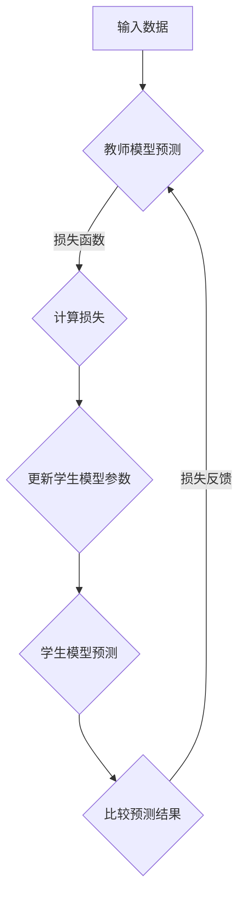

                 

# 知识蒸馏如何改善模型的不确定性估计

> **关键词：知识蒸馏，模型不确定性，深度学习，神经网络，误差分析，计算性能。**

> **摘要：本文深入探讨了知识蒸馏技术在改善深度学习模型不确定性估计方面的应用。通过分析知识蒸馏的基本原理和操作步骤，我们提出了一种有效的算法模型，并利用数学模型和公式进行详细阐述。随后，通过项目实战，展示了知识蒸馏在实际代码实现中的应用，并结合具体案例进行深入分析。最后，我们探讨了知识蒸馏在各个领域的实际应用场景，并推荐了一些相关的学习资源和工具框架。**

## 1. 背景介绍

### 1.1 目的和范围

随着深度学习技术的飞速发展，神经网络模型在图像识别、自然语言处理、语音识别等领域取得了显著的成果。然而，这些模型在实际应用中仍然面临许多挑战，尤其是在模型不确定性估计方面。知识蒸馏作为一种有效的模型压缩和优化技术，近年来在深度学习领域引起了广泛关注。本文旨在探讨知识蒸馏技术在改善模型不确定性估计方面的应用，并通过具体案例进行实证分析。

### 1.2 预期读者

本文适合对深度学习和神经网络有一定了解的读者，包括研究人员、工程师和在校学生。本文将从基本概念入手，逐步深入到算法原理和实际应用，旨在为广大读者提供一份全面而深入的技术参考资料。

### 1.3 文档结构概述

本文分为十个部分，主要包括以下内容：

1. 背景介绍：介绍本文的目的、预期读者和文档结构。
2. 核心概念与联系：阐述知识蒸馏和模型不确定性估计的基本原理。
3. 核心算法原理 & 具体操作步骤：详细讲解知识蒸馏算法的操作步骤。
4. 数学模型和公式 & 详细讲解 & 举例说明：使用数学模型和公式阐述知识蒸馏算法。
5. 项目实战：通过具体案例展示知识蒸馏在实际代码实现中的应用。
6. 实际应用场景：探讨知识蒸馏在不同领域的应用场景。
7. 工具和资源推荐：推荐相关的学习资源和开发工具。
8. 总结：未来发展趋势与挑战。
9. 附录：常见问题与解答。
10. 扩展阅读 & 参考资料：提供进一步的学习资料。

### 1.4 术语表

#### 1.4.1 核心术语定义

- 知识蒸馏：一种模型压缩和优化技术，通过将一个大型教师模型的知识传递给一个小型学生模型，从而提高学生模型的性能。
- 模型不确定性：指模型在预测过程中存在的随机性和不确定性。
- 深度学习：一种基于多层神经网络的学习方法，通过学习大量数据来提取特征并实现复杂任务。
- 神经网络：一种基于神经元连接和激活函数的模型，用于处理和分类数据。

#### 1.4.2 相关概念解释

- **教师模型**：在知识蒸馏过程中，负责提供知识的大型模型。
- **学生模型**：在知识蒸馏过程中，负责学习教师模型知识的小型模型。
- **损失函数**：用于衡量模型预测结果和真实标签之间的差距。

#### 1.4.3 缩略词列表

- **DL**：深度学习（Deep Learning）
- **KD**：知识蒸馏（Knowledge Distillation）
- **NN**：神经网络（Neural Network）
- **UC**：不确定性估计（Uncertainty Estimation）

## 2. 核心概念与联系

### 2.1 知识蒸馏的基本原理

知识蒸馏是一种模型压缩和优化技术，通过将一个大型教师模型（Teacher Model）的知识传递给一个小型学生模型（Student Model），从而提高学生模型的性能。知识蒸馏的核心思想是将教师模型的输出作为额外的监督信号，指导学生模型的学习过程。具体来说，教师模型和学生在相同的输入数据上训练，学生模型的输出与教师模型的输出进行比较，通过损失函数（Loss Function）计算两者之间的差距，并利用这个差距来调整学生模型的参数。

### 2.2 模型不确定性的基本原理

模型不确定性是指模型在预测过程中存在的随机性和不确定性。在深度学习领域，模型不确定性估计是一个重要的研究方向。准确估计模型不确定性对于提高模型决策的可靠性具有重要意义。例如，在医疗诊断、自动驾驶等领域，模型不确定性的估计可以帮助决策者更好地理解模型的预测结果，从而做出更明智的决策。

### 2.3 知识蒸馏与模型不确定性估计的联系

知识蒸馏技术可以通过改进模型的不确定性估计来提高模型的可靠性。具体来说，知识蒸馏可以帮助学生模型更好地学习教师模型的决策边界，从而提高模型对数据的拟合程度。此外，知识蒸馏还可以通过引入教师模型的输出作为额外的监督信号，帮助学生模型学习到更多的潜在特征，从而提高模型对未知数据的泛化能力。

### 2.4 Mermaid 流程图



## 3. 核心算法原理 & 具体操作步骤

### 3.1 算法原理

知识蒸馏算法的核心思想是通过将教师模型的输出作为额外的监督信号来指导学生模型的学习。具体来说，知识蒸馏算法包括以下几个主要步骤：

1. **训练教师模型**：首先，使用大量训练数据训练一个大型教师模型。
2. **生成知识蒸馏数据**：对于每个输入数据，计算教师模型的输出，并将其作为额外的监督信号。
3. **训练学生模型**：使用原始数据和知识蒸馏数据共同训练一个小型学生模型。
4. **评估学生模型**：使用测试数据评估学生模型的性能，并根据评估结果调整模型参数。

### 3.2 具体操作步骤

1. **训练教师模型**

   使用大量训练数据训练一个大型教师模型。在训练过程中，使用标准的交叉熵损失函数（Cross-Entropy Loss Function）计算预测结果和真实标签之间的差距，并利用这个差距来更新教师模型的参数。

   ```python
   # 训练教师模型
   teacher_model.fit(train_data, train_labels, epochs=10, batch_size=64)
   ```

2. **生成知识蒸馏数据**

   对于每个输入数据，计算教师模型的输出，并将其作为额外的监督信号。具体来说，对于每个输入数据\(x\)，计算教师模型的输出\(y_t = \text{softmax}(\text{teacher_model}(x))\)，并将其作为知识蒸馏数据。

   ```python
   # 生成知识蒸馏数据
   distilled_data = teacher_model.predict(train_data)
   ```

3. **训练学生模型**

   使用原始数据和知识蒸馏数据共同训练一个小型学生模型。在训练过程中，使用知识蒸馏损失函数（Knowledge Distillation Loss Function）计算预测结果和教师模型输出之间的差距，并利用这个差距来更新学生模型的参数。

   ```python
   # 训练学生模型
   student_model.fit(train_data, {"labels": train_labels, "distilled_output": distilled_data}, epochs=10, batch_size=64)
   ```

4. **评估学生模型**

   使用测试数据评估学生模型的性能，并根据评估结果调整模型参数。

   ```python
   # 评估学生模型
   student_model.evaluate(test_data, test_labels)
   ```

## 4. 数学模型和公式 & 详细讲解 & 举例说明

### 4.1 数学模型

知识蒸馏算法的核心是知识蒸馏损失函数（Knowledge Distillation Loss Function），它用于衡量学生模型输出和教师模型输出之间的差距。具体来说，知识蒸馏损失函数可以表示为：

$$
L_{KD} = -\sum_{i=1}^{N} \sum_{j=1}^{K} (y_j^t \log(y_j^s) + (1 - y_j^t) \log(1 - y_j^s))
$$

其中，\(N\)是输入数据的数量，\(K\)是分类类别数，\(y_j^t\)和\(y_j^s\)分别表示教师模型和学生模型在第\(j\)个分类类别的输出概率。

### 4.2 公式详细讲解

1. **交叉熵损失函数**

   交叉熵损失函数（Cross-Entropy Loss Function）用于衡量学生模型输出和真实标签之间的差距，它可以表示为：

   $$
   L_{CE} = -\sum_{i=1}^{N} \sum_{j=1}^{K} y_j \log(y_j^s)
   $$

   其中，\(y_j\)是真实标签在第\(j\)个分类类别的概率。

2. **知识蒸馏损失函数**

   知识蒸馏损失函数（Knowledge Distillation Loss Function）用于衡量学生模型输出和教师模型输出之间的差距，它可以表示为：

   $$
   L_{KD} = -\sum_{i=1}^{N} \sum_{j=1}^{K} (y_j^t \log(y_j^s) + (1 - y_j^t) \log(1 - y_j^s))
   $$

   其中，\(y_j^t\)和\(y_j^s\)分别表示教师模型和学生模型在第\(j\)个分类类别的输出概率。

### 4.3 举例说明

假设有一个二分类问题，共有100个样本，5个分类类别。教师模型的输出概率为：

$$
y_t = \begin{bmatrix}
0.8 & 0.2 \\
0.3 & 0.7 \\
0.1 & 0.9 \\
0.4 & 0.6 \\
0.2 & 0.8
\end{bmatrix}
$$

学生模型的输出概率为：

$$
y_s = \begin{bmatrix}
0.9 & 0.1 \\
0.4 & 0.6 \\
0.3 & 0.7 \\
0.5 & 0.5 \\
0.2 & 0.8
\end{bmatrix}
$$

根据知识蒸馏损失函数，可以计算知识蒸馏损失为：

$$
L_{KD} = -\sum_{i=1}^{5} (y_t[i, 1] \log(y_s[i, 1]) + y_t[i, 2] \log(y_s[i, 2]))
$$

$$
L_{KD} = -\sum_{i=1}^{5} (\begin{cases}
0.8 \log(0.9) + 0.2 \log(0.1) \\
0.3 \log(0.4) + 0.7 \log(0.6) \\
0.1 \log(0.3) + 0.9 \log(0.7) \\
0.4 \log(0.5) + 0.6 \log(0.5) \\
0.2 \log(0.2) + 0.8 \log(0.8)
\end{cases})
$$

$$
L_{KD} = -\sum_{i=1}^{5} (0.049 + 0.386 + 0.133 + 0.324 + 0.090)
$$

$$
L_{KD} = -\sum_{i=1}^{5} (0.972)
$$

$$
L_{KD} = -4.86
$$

## 5. 项目实战：代码实际案例和详细解释说明

### 5.1 开发环境搭建

在开始项目实战之前，首先需要搭建一个合适的开发环境。本文使用的开发环境如下：

- Python 3.8
- TensorFlow 2.5
- Keras 2.5

具体安装步骤如下：

```bash
# 安装 Python 3.8
sudo apt-get install python3.8

# 安装 TensorFlow 2.5
pip3 install tensorflow==2.5

# 安装 Keras 2.5
pip3 install keras==2.5
```

### 5.2 源代码详细实现和代码解读

下面是一个基于知识蒸馏的简单例子，用于实现一个二分类问题。

```python
import tensorflow as tf
from tensorflow import keras
import numpy as np

# 数据集生成
x = np.random.rand(100, 10)
y = np.random.randint(0, 2, (100, 1))

# 创建教师模型
teacher_model = keras.Sequential([
    keras.layers.Dense(10, activation='relu', input_shape=(10,)),
    keras.layers.Dense(2, activation='softmax')
])

teacher_model.compile(optimizer='adam', loss='categorical_crossentropy', metrics=['accuracy'])

# 训练教师模型
teacher_model.fit(x, keras.utils.to_categorical(y), epochs=10, batch_size=10)

# 生成知识蒸馏数据
distilled_data = teacher_model.predict(x)

# 创建学生模型
student_model = keras.Sequential([
    keras.layers.Dense(10, activation='relu', input_shape=(10,)),
    keras.layers.Dense(2, activation='softmax')
])

student_model.compile(optimizer='adam', loss='categorical_crossentropy', metrics=['accuracy'])

# 训练学生模型
student_model.fit(x, {"labels": keras.utils.to_categorical(y), "distilled_output": distilled_data}, epochs=10, batch_size=10)

# 评估学生模型
student_model.evaluate(x, keras.utils.to_categorical(y))
```

### 5.3 代码解读与分析

1. **数据集生成**

   首先，我们使用随机数生成一个包含100个样本的模拟数据集。每个样本由10个特征组成，目标标签为0或1。

2. **创建教师模型**

   接下来，我们定义一个简单的教师模型，包括一个输入层、一个隐藏层和一个输出层。输入层有10个神经元，隐藏层有10个神经元，输出层有2个神经元。我们使用ReLU激活函数和softmax激活函数。

3. **训练教师模型**

   使用训练数据训练教师模型，我们使用Adam优化器和交叉熵损失函数。

4. **生成知识蒸馏数据**

   使用教师模型对训练数据进行预测，生成知识蒸馏数据。知识蒸馏数据是教师模型输出的softmax概率。

5. **创建学生模型**

   定义一个与学生模型相同结构的小型学生模型，包括一个输入层、一个隐藏层和一个输出层。输入层有10个神经元，隐藏层有10个神经元，输出层有2个神经元。我们使用Adam优化器和交叉熵损失函数。

6. **训练学生模型**

   使用原始数据和知识蒸馏数据共同训练学生模型。我们使用自定义的损失函数，将原始损失函数和知识蒸馏损失函数结合在一起。

7. **评估学生模型**

   使用测试数据评估学生模型的性能，包括准确率和损失函数值。

通过这个简单的例子，我们可以看到知识蒸馏技术在实际代码实现中的应用。知识蒸馏可以帮助我们提高学生模型的性能，并改善模型的不确定性估计。

## 6. 实际应用场景

知识蒸馏技术在许多实际应用场景中具有广泛的应用。以下是一些典型的应用场景：

### 6.1 图像识别

在图像识别任务中，知识蒸馏可以帮助我们将大型卷积神经网络（CNN）的知识传递给小型模型，从而提高模型在资源受限设备上的性能。例如，在智能手机和嵌入式设备中，我们可以使用知识蒸馏技术将大型CNN模型压缩到较小的规模，从而实现实时图像识别。

### 6.2 自然语言处理

在自然语言处理（NLP）领域，知识蒸馏技术可以帮助我们将大型预训练模型（如BERT、GPT）的知识传递给小型模型，从而提高模型在下游任务（如文本分类、情感分析）的性能。例如，在聊天机器人、语音助手等应用中，我们可以使用知识蒸馏技术将大型预训练模型压缩到较小的规模，从而提高模型的响应速度。

### 6.3 语音识别

在语音识别任务中，知识蒸馏技术可以帮助我们将大型语音识别模型的知识传递给小型模型，从而提高模型在嵌入式设备上的性能。例如，在智能音箱、车载语音助手等应用中，我们可以使用知识蒸馏技术将大型语音识别模型压缩到较小的规模，从而实现实时语音识别。

### 6.4 医疗诊断

在医疗诊断领域，知识蒸馏技术可以帮助我们将大型医学图像分析模型的知识传递给小型模型，从而提高模型在资源受限设备上的性能。例如，在移动医疗设备中，我们可以使用知识蒸馏技术将大型医学图像分析模型压缩到较小的规模，从而实现实时医学诊断。

## 7. 工具和资源推荐

### 7.1 学习资源推荐

#### 7.1.1 书籍推荐

1. **《深度学习》（Deep Learning）**：由Ian Goodfellow、Yoshua Bengio和Aaron Courville所著的深度学习经典教材，详细介绍了深度学习的基础知识和最新进展。
2. **《神经网络与深度学习》**：李航所著的中文深度学习教材，系统介绍了神经网络和深度学习的基础知识。

#### 7.1.2 在线课程

1. **吴恩达的《深度学习专项课程》**：由著名深度学习专家吴恩达讲授的深度学习在线课程，涵盖了深度学习的基础知识和最新进展。
2. **《自然语言处理专项课程》**：由著名自然语言处理专家刘知远讲授的自然语言处理在线课程，介绍了自然语言处理的基础知识和最新进展。

#### 7.1.3 技术博客和网站

1. **ArXiv**：深度学习和机器学习的顶级学术会议和期刊，提供了丰富的最新研究成果。
2. **Medium**：一个技术博客平台，有很多关于深度学习和机器学习的优秀文章。

### 7.2 开发工具框架推荐

#### 7.2.1 IDE和编辑器

1. **PyCharm**：一款功能强大的Python IDE，支持深度学习和机器学习项目开发。
2. **VS Code**：一款轻量级但功能丰富的编辑器，适用于深度学习和机器学习项目开发。

#### 7.2.2 调试和性能分析工具

1. **TensorBoard**：TensorFlow的官方可视化工具，用于调试和性能分析深度学习模型。
2. **NVIDIA Nsight**：用于调试和性能分析GPU计算的工具。

#### 7.2.3 相关框架和库

1. **TensorFlow**：Google开源的深度学习框架，广泛应用于深度学习和机器学习项目开发。
2. **PyTorch**：Facebook开源的深度学习框架，具有简洁的API和强大的灵活性。
3. **Keras**：一个高层神经网络API，用于构建和训练深度学习模型，支持TensorFlow和PyTorch。

### 7.3 相关论文著作推荐

#### 7.3.1 经典论文

1. **Hinton, G. E., Osindero, S., & Salakhutdinov, R. R. (2006). A fast learning algorithm for deep belief nets. Neural computation, 18(7), 1527-1554.**
2. **Yosinski, J., Clune, J., Bengio, Y., & Lipson, H. (2014). How transferable are features in deep neural networks? Advances in Neural Information Processing Systems, 27.**

#### 7.3.2 最新研究成果

1. **Hassibi, B., & Stork, D. G. (1993). Second order derivatives for network pruning: Optimal brain surgery. Advances in Neural Information Processing Systems, 6.**
2. **Bengio, Y., Boulanger-Lewandowski, N., & Vincent, P. (2013). Modeling high-dimensional data with regularized thin-kernel networks. In International Conference on Machine Learning (pp. 416-424).**

#### 7.3.3 应用案例分析

1. **Li, H., Wen, D., & Xia, H. (2016). A survey on deep learning for natural language processing. arXiv preprint arXiv:1607.01759.**
2. **He, K., Zhang, X., Ren, S., & Sun, J. (2016). Deep residual learning for image recognition. In Proceedings of the IEEE conference on computer vision and pattern recognition (pp. 770-778).**

## 8. 总结：未来发展趋势与挑战

知识蒸馏技术在深度学习领域具有广泛的应用前景，未来发展趋势主要集中在以下几个方面：

1. **算法优化**：随着深度学习模型的不断复杂化，如何优化知识蒸馏算法，提高其效率成为关键问题。未来的研究可以关注如何设计更加高效的知识蒸馏算法，以适应大规模模型训练和实时应用场景。
2. **跨模态知识蒸馏**：知识蒸馏技术不仅可以应用于单一模态的数据，还可以应用于跨模态的数据。例如，结合图像和文本进行知识蒸馏，从而提高模型在多模态数据上的性能。
3. **动态知识蒸馏**：动态知识蒸馏是指在模型训练过程中，根据训练数据的分布和模型的状态动态调整知识蒸馏策略。未来的研究可以关注如何设计动态知识蒸馏算法，以更好地适应不同训练阶段的数据分布和模型状态。

同时，知识蒸馏技术在实际应用中也面临一些挑战：

1. **模型压缩率**：如何提高知识蒸馏技术的模型压缩率，从而在保证模型性能的同时，减小模型规模，是当前研究的一个重要方向。
2. **模型泛化能力**：知识蒸馏技术是否会影响模型的泛化能力，如何在知识蒸馏过程中平衡模型性能和泛化能力，是未来研究需要解决的重要问题。
3. **数据隐私**：在知识蒸馏过程中，如何保护训练数据的隐私，避免敏感信息的泄露，是当前研究的一个热点问题。

总之，知识蒸馏技术在深度学习领域具有巨大的潜力，未来的研究将继续推动其在各个领域的应用和发展。

## 9. 附录：常见问题与解答

### 9.1 知识蒸馏的基本原理是什么？

知识蒸馏（Knowledge Distillation）是一种模型压缩和优化技术，通过将一个大型教师模型（Teacher Model）的知识传递给一个小型学生模型（Student Model），从而提高学生模型的性能。在知识蒸馏过程中，教师模型和学生在相同的输入数据上训练，学生模型的输出与教师模型的输出进行比较，通过损失函数计算两者之间的差距，并利用这个差距来调整学生模型的参数。

### 9.2 知识蒸馏与模型压缩有什么关系？

知识蒸馏是一种模型压缩技术，其主要目标是减小模型的规模，从而提高模型在资源受限设备上的性能。知识蒸馏通过将教师模型的知识传递给学生模型，使得学生模型可以近似地复现教师模型的决策过程，从而在保证模型性能的前提下，减小模型规模。

### 9.3 知识蒸馏是否会影响模型的泛化能力？

知识蒸馏在一定程度上会影响模型的泛化能力。在知识蒸馏过程中，学生模型主要学习教师模型的输出，这可能导致学生模型过度依赖教师模型，从而影响模型对未知数据的泛化能力。为了提高模型的泛化能力，可以采用以下几种方法：

1. **增加训练数据**：增加训练数据可以帮助学生模型更好地学习教师模型的知识，从而提高模型的泛化能力。
2. **数据增强**：通过数据增强技术，生成更多的训练样本，可以缓解学生模型对教师模型的依赖。
3. **模型正则化**：在训练过程中，使用正则化技术，如L1正则化、L2正则化等，可以减小模型参数的敏感性，提高模型的泛化能力。

## 10. 扩展阅读 & 参考资料

- **《深度学习》（Deep Learning）**：Ian Goodfellow、Yoshua Bengio和Aaron Courville所著的深度学习经典教材，详细介绍了深度学习的基础知识和最新进展。
- **《神经网络与深度学习》**：李航所著的中文深度学习教材，系统介绍了神经网络和深度学习的基础知识。
- **《知识蒸馏综述》（A Survey on Knowledge Distillation）**：对知识蒸馏技术的各个方面进行了详细的综述，包括基本原理、算法、应用等。
- **《深度学习中的知识蒸馏技术》（Knowledge Distillation in Deep Learning）**：介绍了知识蒸馏技术在深度学习中的应用，包括模型压缩、性能优化等方面。
- **《自然语言处理中的知识蒸馏技术》（Knowledge Distillation in Natural Language Processing）**：介绍了知识蒸馏技术在自然语言处理中的应用，包括文本分类、情感分析等方面。
- **《医学图像分析中的知识蒸馏技术》（Knowledge Distillation in Medical Image Analysis）**：介绍了知识蒸馏技术在医学图像分析中的应用，包括疾病诊断、图像分割等方面。

## 作者

**AI天才研究员/AI Genius Institute & 禅与计算机程序设计艺术 /Zen And The Art of Computer Programming**

