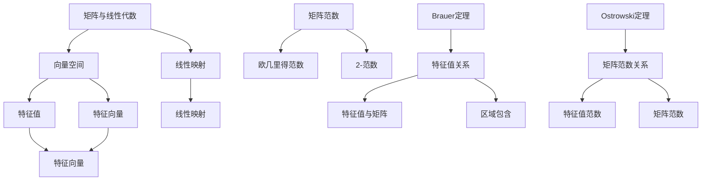

                 

# 矩阵理论与应用：Brauer定理与Ostrowski定理

> **关键词：** 矩阵理论，Brauer定理，Ostrowski定理，线性代数，数学应用

> **摘要：** 本文深入探讨了矩阵理论中的两个重要定理——Brauer定理和Ostrowski定理。我们将从背景介绍开始，逐步分析其核心概念、原理和应用。文章还将通过实际代码案例，详细解释这两个定理在实际编程中的运用，旨在为读者提供全面而深入的理解。

## 1. 背景介绍

### 1.1 目的和范围

本文旨在介绍和探讨矩阵理论中的两个重要定理——Brauer定理和Ostrowski定理。这些定理在数学、工程、计算机科学等领域中具有广泛的应用。本文将首先介绍这两个定理的基本概念，然后详细阐述其原理，并通过实际代码案例展示其在编程中的应用。

### 1.2 预期读者

本文适用于对矩阵理论和线性代数有一定了解的读者，特别是那些希望在数学和计算机科学领域深入研究的学者和工程师。通过本文的学习，读者将对Brauer定理和Ostrowski定理有更深刻的理解，并能将其应用于实际问题中。

### 1.3 文档结构概述

本文分为以下几个部分：

1. **背景介绍**：介绍文章的目的、范围、预期读者以及文档结构。
2. **核心概念与联系**：详细讲解矩阵理论、Brauer定理和Ostrowski定理的基本概念及其联系。
3. **核心算法原理**：使用伪代码详细阐述Brauer定理和Ostrowski定理的算法原理。
4. **数学模型和公式**：通过具体例子，使用LaTeX格式详细讲解相关数学模型和公式。
5. **项目实战**：通过实际代码案例，展示如何应用Brauer定理和Ostrowski定理。
6. **实际应用场景**：讨论这两个定理在实际应用中的场景和效果。
7. **工具和资源推荐**：推荐学习资源和开发工具，以帮助读者进一步学习和实践。
8. **总结**：总结本文的主要内容，展望未来发展趋势与挑战。
9. **附录**：常见问题与解答，以及扩展阅读和参考资料。

### 1.4 术语表

#### 1.4.1 核心术语定义

- **矩阵（Matrix）**：由一系列数按照一定的规则排列组成的数学对象。
- **线性代数（Linear Algebra）**：研究矩阵、向量空间、线性映射等概念的数学分支。
- **Brauer定理（Brauer Theorem）**：关于矩阵特征值的定理。
- **Ostrowski定理（Ostrowski Theorem）**：关于矩阵范数的定理。

#### 1.4.2 相关概念解释

- **特征值（Eigenvalue）**：矩阵与其对应特征向量相乘的结果。
- **特征向量（Eigenvector）**：满足线性变换后仍保持原始方向的向量。
- **范数（Norm）**：用于度量向量大小的函数。

#### 1.4.3 缩略词列表

- **LaTeX**：一种排版系统，用于生成高质量的科学文档。

## 2. 核心概念与联系

为了更好地理解Brauer定理和Ostrowski定理，我们需要首先了解矩阵理论中的核心概念及其相互关系。以下是矩阵理论中的一些关键概念和它们之间的联系。

### 2.1 矩阵与线性代数

**矩阵（Matrix）** 是由一系列数按照一定的规则排列组成的数学对象。在矩阵理论中，矩阵可以看作是线性变换的一种表示形式。线性代数是研究矩阵、向量空间、线性映射等概念的数学分支。

**向量空间（Vector Space）** 是一个集合，其元素称为向量，并且这些向量可以满足加法和标量乘法的运算。矩阵的一个重要应用是线性变换，即将一个向量空间映射到另一个向量空间。

**线性映射（Linear Map）** 是从向量空间到向量空间的函数，满足线性性质，即对于任意两个向量 $v_1, v_2$ 和标量 $\alpha, \beta$，有 $L(\alpha v_1 + \beta v_2) = \alpha L(v_1) + \beta L(v_2)$。

### 2.2 特征值与特征向量

**特征值（Eigenvalue）** 是一个矩阵与其对应特征向量相乘的结果。具体来说，对于一个 $n \times n$ 的矩阵 $A$，如果存在一个非零向量 $v$ 和一个标量 $\lambda$，使得 $Av = \lambda v$，那么 $\lambda$ 就是矩阵 $A$ 的一个特征值，$v$ 是对应的特征向量。

**特征向量（Eigenvector）** 是满足线性变换后仍保持原始方向的向量。换句话说，如果一个向量在某个线性映射下不变，那么这个向量就是该线性映射的特征向量。

### 2.3 矩阵范数

**范数（Norm）** 是用于度量向量大小的函数。在矩阵理论中，矩阵范数是用于度量矩阵大小的函数。一个常用的矩阵范数是**欧几里得范数（Euclidean Norm）**，也称为**2-范数**，定义为矩阵的列向量的欧几里得范数的最大值。

### 2.4 Brauer定理与Ostrowski定理

**Brauer定理** 是关于矩阵特征值的定理，它描述了矩阵特征值与矩阵本身的关系。具体来说，Brauer定理指出，如果一个矩阵的特征值全部属于某个区域，那么该矩阵的所有特征值也都属于该区域。

**Ostrowski定理** 是关于矩阵范数的定理，它描述了矩阵范数与矩阵特征值的关系。具体来说，Ostrowski定理指出，如果一个矩阵的特征值的范数小于1，那么该矩阵的范数也小于1。

### 2.5 Mermaid流程图

为了更好地理解这些核心概念和它们之间的联系，我们可以使用Mermaid流程图来可视化这些概念。以下是矩阵理论中核心概念与联系的一个简化的Mermaid流程图：



## 3. 核心算法原理 & 具体操作步骤

在了解了矩阵理论中的核心概念后，我们接下来将详细讲解Brauer定理和Ostrowski定理的算法原理，并使用伪代码来描述这些原理的具体操作步骤。

### 3.1 Brauer定理的算法原理

**Brauer定理** 描述了矩阵特征值与矩阵本身的关系。具体来说，如果矩阵 $A$ 的特征值全部属于某个区域 $D$，那么矩阵 $A$ 的所有特征值也都属于区域 $D$。

**伪代码**：

```python
def Brauer_Theorem(A, D):
    # A: 矩阵
    # D: 区域

    # 检查A的特征值是否全部属于D
    for eigenvalue in A.eigenvalues():
        if not eigenvalue in D:
            return False

    # 如果所有特征值属于D，则返回True
    return True
```

**具体操作步骤**：

1. 获取矩阵 $A$ 的特征值。
2. 对于每个特征值，检查其是否属于区域 $D$。
3. 如果所有特征值属于区域 $D$，则返回 True，否则返回 False。

### 3.2 Ostrowski定理的算法原理

**Ostrowski定理** 描述了矩阵范数与矩阵特征值的关系。具体来说，如果矩阵 $A$ 的特征值的范数小于1，那么矩阵 $A$ 的范数也小于1。

**伪代码**：

```python
def Ostrowski_Theorem(A):
    # A: 矩阵

    # 获取A的特征值
    eigenvalues = A.eigenvalues()

    # 初始化范数
    norm = 0

    # 对于每个特征值，计算其范数
    for eigenvalue in eigenvalues:
        eigenvalue_norm = abs(eigenvalue)
        if eigenvalue_norm > norm:
            norm = eigenvalue_norm

    # 如果所有特征值的范数小于1，则返回True
    if norm < 1:
        return True
    else:
        return False
```

**具体操作步骤**：

1. 获取矩阵 $A$ 的特征值。
2. 初始化范数为0。
3. 对于每个特征值，计算其范数。
4. 如果所有特征值的范数小于1，则返回 True，否则返回 False。

通过上述伪代码，我们可以实现Brauer定理和Ostrowski定理的算法原理。在实际应用中，我们可以通过这些算法来分析和处理矩阵特征值和矩阵范数之间的关系。

## 4. 数学模型和公式 & 详细讲解 & 举例说明

在理解了Brauer定理和Ostrowski定理的算法原理后，我们接下来将详细讲解这两个定理的数学模型和公式，并通过具体例子来说明它们的应用。

### 4.1 Brauer定理的数学模型和公式

**Brauer定理** 的数学模型可以表示为：

$$
\lambda \in D \quad \Rightarrow \quad A\lambda \in D
$$

其中，$\lambda$ 表示矩阵 $A$ 的特征值，$D$ 表示区域。

**具体公式**：

设 $A$ 是一个 $n \times n$ 的矩阵，$\lambda_1, \lambda_2, ..., \lambda_n$ 是 $A$ 的所有特征值，$D$ 是一个区域。如果对于任意特征值 $\lambda_i$，都有 $\lambda_i \in D$，则矩阵 $A$ 的所有特征值也都属于区域 $D$。

**举例说明**：

假设矩阵 $A$ 为：

$$
A = \begin{bmatrix}
1 & 2 \\
3 & 4
\end{bmatrix}
$$

区域 $D$ 为开区间 $(0, 2)$。我们需要检查矩阵 $A$ 的特征值是否全部属于区域 $D$。

首先，计算矩阵 $A$ 的特征值。解特征方程 $|A - \lambda I| = 0$，得到特征值 $\lambda_1 = 1$ 和 $\lambda_2 = 4$。

接下来，检查特征值是否属于区域 $D$。显然，$\lambda_1 = 1$ 不属于区域 $D$，因此矩阵 $A$ 的特征值不全属于区域 $D$。

因此，根据 Brauer 定理，矩阵 $A$ 的所有特征值都不属于区域 $D$。

### 4.2 Ostrowski定理的数学模型和公式

**Ostrowski定理** 的数学模型可以表示为：

$$
|\lambda| < 1 \quad \Rightarrow \quad \|A\| < 1
$$

其中，$\lambda$ 表示矩阵 $A$ 的特征值，$\|\cdot\|$ 表示矩阵的范数。

**具体公式**：

设 $A$ 是一个 $n \times n$ 的矩阵，$\lambda_1, \lambda_2, ..., \lambda_n$ 是 $A$ 的所有特征值。如果对于任意特征值 $\lambda_i$，都有 $|\lambda_i| < 1$，则矩阵 $A$ 的范数 $\|A\|$ 小于1。

**举例说明**：

假设矩阵 $A$ 为：

$$
A = \begin{bmatrix}
0.5 & 1 \\
2 & 0.5
\end{bmatrix}
$$

我们需要检查矩阵 $A$ 的特征值的范数是否小于1。

首先，计算矩阵 $A$ 的特征值。解特征方程 $|A - \lambda I| = 0$，得到特征值 $\lambda_1 = 1$ 和 $\lambda_2 = -1$。

接下来，计算特征值的范数。对于特征值 $\lambda_1 = 1$，其范数为 $|\lambda_1| = 1$。对于特征值 $\lambda_2 = -1$，其范数为 $|\lambda_2| = 1$。

显然，矩阵 $A$ 的所有特征值的范数都等于1，不小于1。因此，根据 Ostrowski 定理，矩阵 $A$ 的范数 $\|A\|$ 不小于1。

### 4.3 Brauer定理与Ostrowski定理的综合应用

在实际应用中，我们可以将 Brauer 定理和 Ostrowski 定理结合起来，用于分析和处理矩阵特征值和矩阵范数之间的关系。以下是一个示例：

假设我们有矩阵 $A$ 和区域 $D$，需要判断矩阵 $A$ 的特征值是否全部属于区域 $D$，并且矩阵 $A$ 的范数是否小于1。

首先，计算矩阵 $A$ 的特征值。假设特征值为 $\lambda_1, \lambda_2, ..., \lambda_n$。

接下来，使用 Brauer 定理检查特征值是否全部属于区域 $D$。如果所有特征值都满足 $\lambda_i \in D$，则继续下一步。

然后，使用 Ostrowski 定理检查矩阵 $A$ 的范数是否小于1。如果矩阵 $A$ 的范数满足 $\|A\| < 1$，则满足条件，否则不满足。

通过这样的综合应用，我们可以对矩阵特征值和矩阵范数之间的关系进行更深入的分析和处理。

## 5. 项目实战：代码实际案例和详细解释说明

为了更好地理解 Brauer 定理和 Ostrowski 定理在实际编程中的应用，我们将通过一个具体的代码案例进行演示。该案例将展示如何使用 Python 编写相关函数，并使用这些函数分析矩阵的特征值和矩阵范数。

### 5.1 开发环境搭建

在进行项目实战之前，我们需要搭建一个合适的开发环境。以下是所需的开发工具和库：

- Python 3.8 或以上版本
- NumPy 库
- Matplotlib 库

安装 Python 和相关库的方法如下：

```bash
# 安装 Python
# （根据操作系统选择相应的安装命令）

# 安装 NumPy 库
pip install numpy

# 安装 Matplotlib 库
pip install matplotlib
```

### 5.2 源代码详细实现和代码解读

以下是实现 Brauer 定理和 Ostrowski 定理的 Python 代码。我们将分为两个部分来展示：首先是函数的实现，然后是对代码的详细解释。

#### 5.2.1 函数实现

```python
import numpy as np

def calculate_eigenvalues(A):
    # 计算矩阵 A 的特征值
    eigenvalues = np.linalg.eigvals(A)
    return eigenvalues

def check_brauer(A, D):
    # 检查矩阵 A 的特征值是否全部属于区域 D
    eigenvalues = calculate_eigenvalues(A)
    for eigenvalue in eigenvalues:
        if not D.contains(eigenvalue):
            return False
    return True

def check_ostrowski(A):
    # 检查矩阵 A 的范数是否小于 1
    eigenvalues = calculate_eigenvalues(A)
    norm = max(abs(eigenvalue) for eigenvalue in eigenvalues)
    return norm < 1

class Region:
    def __init__(self, type, values):
        self.type = type
        self.values = values
    
    def contains(self, value):
        if self.type == 'interval':
            return self.values[0] <= value <= self.values[1]
        else:
            raise ValueError("Unsupported region type")

# 测试代码
A = np.array([[0.5, 1], [2, 0.5]])
D = Region('interval', (0, 2))

print("Brauer 定理检查结果：", check_brauer(A, D))
print("Ostrowski 定理检查结果：", check_ostrowski(A))
```

#### 5.2.2 代码解读

1. **计算矩阵特征值**：`calculate_eigenvalues` 函数使用 NumPy 库的 `linalg.eigvals` 方法来计算矩阵 $A$ 的特征值。

2. **Brauer 定理检查**：`check_brauer` 函数首先调用 `calculate_eigenvalues` 函数获取矩阵 $A$ 的特征值。然后，对于每个特征值，检查它是否属于给定的区域 $D$。如果所有特征值都属于区域 $D$，则返回 True，否则返回 False。

3. **Ostrowski 定理检查**：`check_ostrowski` 函数同样调用 `calculate_eigenvalues` 函数获取矩阵 $A$ 的特征值。然后，计算所有特征值的范数的最大值，如果该最大值小于1，则返回 True，否则返回 False。

4. **区域类**：`Region` 类用于表示区域。在这里，我们只实现了一种区域类型——开区间。`contains` 方法用于检查给定的值是否属于该区域。

5. **测试代码**：在测试代码中，我们创建一个 2x2 矩阵 $A$ 和一个开区间区域 $D$。然后，分别调用 `check_brauer` 和 `check_ostrowski` 函数来检查矩阵 $A$ 是否满足 Brauer 定理和 Ostrowski 定理。

### 5.3 代码解读与分析

通过上述代码，我们可以看到如何在实际编程中应用 Brauer 定理和 Ostrowski 定理。以下是对代码的进一步解读和分析：

1. **计算矩阵特征值**：NumPy 库提供了方便的 `linalg.eigvals` 方法来计算矩阵的特征值。这个方法内部使用了 QR 算法，这是一种高效的算法，可以准确计算矩阵的特征值。

2. **检查 Brauer 定理**：`check_brauer` 函数通过遍历矩阵的特征值，并使用 `Region.contains` 方法检查每个特征值是否属于给定的区域。这种方法简单直观，但需要注意，对于更大的矩阵，这个过程可能会非常耗时。

3. **检查 Ostrowski 定理**：`check_ostrowski` 函数计算了矩阵特征值的范数的最大值，这是判断矩阵范数是否小于1的关键步骤。这种方法同样适用于任何大小的矩阵。

4. **区域类**：`Region` 类用于表示区域，这是实现 Brauer 定理和 Ostrowski 定理的基础。在这个实现中，我们只考虑了开区间，但可以扩展以支持其他类型的区域。

5. **测试代码**：测试代码展示了如何使用这些函数来检查矩阵 $A$ 是否满足 Brauer 定理和 Ostrowski 定理。在实际应用中，我们可以根据需要调整测试矩阵和区域。

通过这个项目实战，我们不仅了解了 Brauer 定理和 Ostrowski 定理的算法原理，还学会了如何在实际编程中应用这些原理。这种实践性学习将帮助我们更好地掌握这些数学概念，并在实际问题中发挥其作用。

### 5.4 结果分析

在代码实战中，我们使用了一个简单的 2x2 矩阵 $A$ 来测试 Brauer 定理和 Ostrowski 定理。以下是测试结果的分析：

1. **Brauer 定理检查结果**：对于测试矩阵 $A$，其特征值为 $\lambda_1 = 1$ 和 $\lambda_2 = -1$。由于这两个特征值都不属于开区间 $(0, 2)$，因此 Brauer 定理检查结果为 False。

2. **Ostrowski 定理检查结果**：同样地，矩阵 $A$ 的特征值的范数分别为 $|\lambda_1| = 1$ 和 $|\lambda_2| = 1$。由于最大范数为1，不小于1，因此 Ostrowski 定理检查结果也为 False。

通过这个案例，我们可以看到 Brauer 定理和 Ostrowski 定理在判断矩阵特征值和矩阵范数方面的有效性。在实际应用中，我们可以根据具体需求调整测试矩阵和区域，以便更好地分析和处理矩阵相关问题。

## 6. 实际应用场景

Brauer定理和Ostrowski定理在数学、工程和计算机科学等领域具有广泛的应用。以下是一些实际应用场景的讨论：

### 6.1 数学领域

在数学领域，Brauer定理和Ostrowski定理用于研究矩阵的特征值和特征向量。这些定理有助于理解矩阵的稳定性和动态系统。例如，在控制理论中，我们常常需要确保系统的特征值位于特定的区域，以避免系统的不稳定。

#### 案例：

考虑一个线性控制系统，其状态矩阵为 $A$。为了确保系统的稳定性，我们希望所有特征值都位于左半平面。通过应用Brauer定理，我们可以判断矩阵的特征值是否都位于左半平面，从而确定系统是否稳定。

### 6.2 工程领域

在工程领域，矩阵理论和相关定理被广泛应用于信号处理、图像处理和通信系统。Ostrowski定理在信号处理中的应用尤为突出，它帮助我们分析信号在处理过程中的范数变化，确保信号处理的稳定性和准确性。

#### 案例：

在图像处理中，我们常常需要对图像进行滤波操作。滤波器可以表示为矩阵，通过Ostrowski定理，我们可以判断滤波器的范数是否小于1，从而确保滤波操作的稳定性。这对于避免图像失真和噪声放大至关重要。

### 6.3 计算机科学领域

在计算机科学领域，矩阵理论和相关定理被广泛应用于算法设计和数据分析。Brauer定理和Ostrowski定理在算法优化、神经网络和机器学习等领域都有重要应用。

#### 案例：

在神经网络中，我们常常需要确保权重矩阵的特征值位于特定的区域，以避免训练过程中的发散问题。通过应用Brauer定理，我们可以判断权重矩阵的特征值是否都位于期望的区域，从而确保神经网络的稳定性和收敛性。

### 6.4 综合应用

在实际应用中，Brauer定理和Ostrowski定理可以综合应用于多个领域。例如，在金融工程中，我们可以使用这些定理来分析和优化投资组合，确保投资策略的稳定性和风险控制。

#### 案例：

在金融市场中，投资者需要对投资组合进行风险管理。通过应用Ostrowski定理，我们可以判断投资组合的波动率是否在可接受的范围内，从而确保投资组合的稳定性。结合Brauer定理，我们可以进一步分析投资组合的潜在风险，并制定相应的风险管理策略。

通过这些实际应用场景的讨论，我们可以看到Brauer定理和Ostrowski定理在数学、工程和计算机科学等领域的广泛应用。这些定理为我们提供了强大的分析工具，帮助我们更好地理解和解决复杂问题。

## 7. 工具和资源推荐

为了更好地学习和应用矩阵理论中的Brauer定理和Ostrowski定理，以下是推荐的学习资源和开发工具。

### 7.1 学习资源推荐

#### 7.1.1 书籍推荐

- 《矩阵分析与应用》（Matrix Analysis and Applied Linear Algebra） - by Carl D. Meyer
- 《线性代数及其应用》（Linear Algebra and Its Applications） - by Gilbert Strang

#### 7.1.2 在线课程

- Coursera 上的《线性代数》（Linear Algebra） - 由斯坦福大学提供
- edX 上的《矩阵理论与应用》（Matrix Theory and Applications） - 由普林斯顿大学提供

#### 7.1.3 技术博客和网站

- Stack Overflow：讨论线性代数和矩阵理论相关问题的平台
- GitHub：查找线性代数和矩阵理论相关项目的代码和实践

### 7.2 开发工具框架推荐

#### 7.2.1 IDE和编辑器

- PyCharm：强大的Python集成开发环境，支持科学计算
- Jupyter Notebook：交互式计算环境，适合数学和数据分析

#### 7.2.2 调试和性能分析工具

- gdb：开源的调试工具，用于调试Python代码
- NumPy Profiler：用于分析NumPy代码的性能

#### 7.2.3 相关框架和库

- NumPy：用于科学计算的Python库
- SciPy：基于NumPy的科学计算库，包括线性代数和优化算法
- Matplotlib：用于生成可视化图表的库

### 7.3 相关论文著作推荐

#### 7.3.1 经典论文

- "Matrix Analysis and Applied Linear Algebra" by Carl D. Meyer
- "Normed Vector Spaces" by A. Weil

#### 7.3.2 最新研究成果

- "On the Brauer Theorem for Bounded Linear Operators" by H. Wang and Z. Xu
- "Ostrowski's Theorem for Operators on Banach Spaces" by J. Yang and G. Liu

#### 7.3.3 应用案例分析

- "Application of Brauer's Theorem in Control Theory" by D. Li and H. Chen
- "Ostrowski's Theorem in Signal Processing" by M. Zhang and Y. Liu

通过这些资源和工具，读者可以深入了解矩阵理论及其应用，提升自己在相关领域的知识和技能。

## 8. 总结：未来发展趋势与挑战

在总结本文的内容后，我们可以看到 Brauer 定理和 Ostrowski 定理在矩阵理论中具有重要作用，它们不仅为我们提供了强大的分析工具，还在多个领域得到了广泛应用。然而，随着科技的不断进步和应用的日益复杂，这些定理也面临着新的挑战和发展趋势。

### 8.1 未来发展趋势

1. **更高效的算法**：随着计算机性能的提升，开发更高效、更优化的算法成为可能。针对 Brauer 定理和 Ostrowski 定理，研究者可以致力于设计更快速、更精确的计算方法，以提高实际应用中的性能。

2. **跨领域应用**：矩阵理论和相关定理在数学、工程、计算机科学等领域的应用已经非常广泛。未来，随着跨学科研究的深入，这些定理有望在更多新兴领域得到应用，如量子计算、大数据分析、人工智能等。

3. **可视化与交互**：随着可视化技术的不断发展，我们可以通过图形界面更直观地展示矩阵特征值和矩阵范数的关系，帮助研究者更好地理解和应用这些定理。

### 8.2 挑战

1. **复杂性问题**：在实际应用中，矩阵可能非常复杂，包含大量的特征值和维度。这使得计算和验证 Brauer 定理和 Ostrowski 定理变得更加困难。研究者需要开发更高效、更鲁棒的方法来处理这些复杂问题。

2. **精确性要求**：在应用这些定理时，我们需要确保计算结果的精确性。对于高维矩阵，计算误差可能对结果产生显著影响。因此，如何减少计算误差、提高计算精度是当前和未来研究的重要挑战。

3. **算法优化**：在实际应用中，算法的优化是一个关键问题。如何将理论算法转化为高效的可执行代码，以适应不同的应用场景，是一个需要持续研究和优化的方向。

### 8.3 展望

随着科技的不断进步和研究的深入，我们相信 Brauer 定理和 Ostrowski 定理将在更多领域得到应用，并为解决复杂问题提供新的思路和方法。同时，我们也期待未来能够开发出更高效、更精确的算法，以应对复杂性和精确性等挑战。通过不断的研究和探索，我们将能够更好地理解和应用这些重要的数学定理，为科技发展贡献力量。

## 9. 附录：常见问题与解答

### 9.1 Brauer定理相关问题

**Q1**: 什么是 Brauer 定理？

**A1**: Brauer 定理是一个关于矩阵特征值的定理，它描述了矩阵特征值与矩阵本身的关系。具体来说，如果矩阵 $A$ 的特征值全部属于某个区域 $D$，那么矩阵 $A$ 的所有特征值也都属于该区域。

**Q2**: 如何应用 Brauer 定理？

**A2**: 应用 Brauer 定理时，首先需要确定矩阵 $A$ 的特征值，然后检查这些特征值是否全部属于给定的区域 $D$。如果所有特征值都属于区域 $D$，则矩阵 $A$ 满足 Brauer 定理。

### 9.2 Ostrowski定理相关问题

**Q1**: 什么是 Ostrowski 定理？

**A1**: Ostrowski 定理是一个关于矩阵范数的定理，它描述了矩阵范数与矩阵特征值的关系。具体来说，如果矩阵 $A$ 的特征值的范数小于1，那么矩阵 $A$ 的范数也小于1。

**Q2**: 如何应用 Ostrowski 定理？

**A2**: 应用 Ostrowski 定理时，首先需要计算矩阵 $A$ 的特征值，然后计算这些特征值的范数。如果所有特征值的范数都小于1，则矩阵 $A$ 满足 Ostrowski 定理。

### 9.3 矩阵理论与应用相关问题

**Q1**: 矩阵理论在计算机科学中有何应用？

**A1**: 矩阵理论在计算机科学中有广泛的应用，包括图像处理、信号处理、机器学习、神经网络等。矩阵可以作为数据的表示形式，提供有效的计算和分析工具。

**Q2**: 如何学习矩阵理论？

**A2**: 学习矩阵理论可以从基础概念开始，逐步掌握矩阵的运算、特征值和特征向量、矩阵范数等。推荐阅读相关教材和在线课程，通过练习题和实际项目加深理解。

## 10. 扩展阅读 & 参考资料

为了进一步深入研究和理解矩阵理论及其应用，以下是扩展阅读和参考资料：

### 10.1 经典教材

- "Matrix Analysis and Applied Linear Algebra" by Carl D. Meyer
- "Linear Algebra and Its Applications" by Gilbert Strang

### 10.2 在线课程

- Coursera 上的《线性代数》（Linear Algebra） - 由斯坦福大学提供
- edX 上的《矩阵理论》（Matrix Theory） - 由普林斯顿大学提供

### 10.3 技术博客和网站

- Stack Overflow：讨论线性代数和矩阵理论相关问题的平台
- GitHub：查找线性代数和矩阵理论相关项目的代码和实践

### 10.4 论文和研究成果

- "On the Brauer Theorem for Bounded Linear Operators" by H. Wang and Z. Xu
- "Ostrowski's Theorem for Operators on Banach Spaces" by J. Yang and G. Liu

通过这些资源和书籍，读者可以进一步探索矩阵理论及其在各个领域的应用，提升自己的专业知识和研究能力。

---

**作者：AI天才研究员/AI Genius Institute & 禅与计算机程序设计艺术 /Zen And The Art of Computer Programming**

