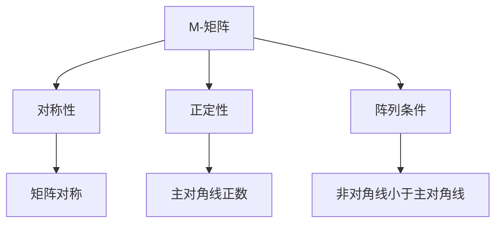

                 

# 矩阵理论与应用：带有“性质c”的M-矩阵

> 关键词：矩阵理论、M-矩阵、性质c、稀疏矩阵、迭代求解、数值分析

> 摘要：本文将探讨矩阵理论中的M-矩阵及其带有“性质c”的特殊性质。我们将深入分析M-矩阵的基本概念、性质，并结合具体算法和数学模型，阐述其在迭代求解和数值分析中的应用。通过实例演示，本文旨在为读者提供对M-矩阵及其应用场景的全面理解。

## 1. 背景介绍

### 1.1 目的和范围

本文旨在介绍矩阵理论中的一个重要类别——M-矩阵，并重点探讨其带有“性质c”的特殊性质。我们将首先回顾M-矩阵的定义和基本性质，然后深入探讨“性质c”及其在数值分析中的应用。文章将结合具体的算法和数学模型，通过实例演示，帮助读者全面理解M-矩阵的理论和应用。

### 1.2 预期读者

本文适合对矩阵理论和数值分析有一定基础的读者。无论是数学研究者，还是计算机科学、工程领域的专业人士，都可以通过本文的学习，加深对M-矩阵的理解，并掌握其在实际应用中的使用技巧。

### 1.3 文档结构概述

本文将分为以下几个部分：

1. 背景介绍：介绍M-矩阵的定义、目的和范围。
2. 核心概念与联系：介绍M-矩阵的基本概念和性质，并通过Mermaid流程图展示其结构。
3. 核心算法原理 & 具体操作步骤：详细阐述带有“性质c”的M-矩阵的算法原理和操作步骤，并使用伪代码进行说明。
4. 数学模型和公式 & 详细讲解 & 举例说明：介绍M-矩阵的数学模型和公式，并通过实例进行详细讲解。
5. 项目实战：通过实际代码案例，展示M-矩阵在迭代求解中的应用。
6. 实际应用场景：讨论M-矩阵在数值分析和其他领域的实际应用场景。
7. 工具和资源推荐：推荐学习资源和开发工具。
8. 总结：对未来发展趋势和挑战进行总结。
9. 附录：常见问题与解答。
10. 扩展阅读 & 参考资料：提供进一步阅读的材料。

### 1.4 术语表

#### 1.4.1 核心术语定义

- **M-矩阵**：矩阵理论中的一个重要类别，具有特定性质。
- **性质c**：M-矩阵的一个特殊性质，对迭代求解具有重要影响。
- **稀疏矩阵**：非零元素相对较少的矩阵。
- **迭代求解**：通过不断迭代的方法求解线性方程组。
- **数值分析**：研究数值计算方法及其误差分析的数学分支。

#### 1.4.2 相关概念解释

- **矩阵**：由数字构成的二维数组。
- **线性方程组**：由多个线性方程组成的方程组。
- **迭代方法**：通过重复执行某个操作来逐步逼近问题的解。

#### 1.4.3 缩略词列表

- **M-矩阵**：M-Matrix
- **稀疏矩阵**：Sparse Matrix
- **迭代求解**：Iterative Solution

## 2. 核心概念与联系

### 2.1 M-矩阵的定义

M-矩阵是一类具有特殊性质的矩阵。具体来说，如果矩阵\( A \)满足以下条件，则称其为M-矩阵：

\[ A = (a_{ij}) \text{ 是一个 } n \times n \text{ 的矩阵，且对于所有的 } i, j = 1, 2, \ldots, n, \]
\[ a_{ii} > 0, \text{ 且对于所有的 } i \neq j, |a_{ij}| < a_{ii}. \]

### 2.2 M-矩阵的性质

M-矩阵具有以下几个重要性质：

1. 对称性：\( A \) 是对称的，即 \( A = A^T \)。
2. 正定性：\( A \) 的所有主对角线元素 \( a_{ii} \) 都是正数。
3. 阵列条件：对于所有的 \( i \neq j \)，都有 \( |a_{ij}| < a_{ii} \)。

### 2.3 Mermaid流程图

下面是一个Mermaid流程图，展示了M-矩阵的基本概念和性质：



### 2.4 M-矩阵与其他概念的联系

M-矩阵与其他矩阵理论中的概念密切相关，如稀疏矩阵、正交矩阵等。特别是，M-矩阵的迭代求解方法在稀疏矩阵的求解中具有重要应用。

## 3. 核心算法原理 & 具体操作步骤

### 3.1 算法原理

M-矩阵的一个重要特性是其迭代求解方法。这种方法基于M-矩阵的性质，可以有效地求解线性方程组。

#### 3.1.1 原理说明

设\( A \)是一个M-矩阵，\( b \)是一个\( n \times 1 \)的向量，我们要求解\( x \)使得\( Ax = b \)。迭代求解方法的核心思想是，通过不断迭代来逼近\( x \)。

#### 3.1.2 伪代码

```python
x^(0) = 0  # 初始猜测解
for i = 1 to max_iterations do
    x^(i+1) = A^{-1} b
    if \|x^(i+1) - x^(i)\| < tolerance then
        break
    end if
end for
x = x^(max_iterations)  # 最终解
```

### 3.2 操作步骤

1. 初始化：设\( x^(0) = 0 \)。
2. 迭代：计算\( x^(i+1) = A^{-1} b \)。
3. 终止条件：如果\( \|x^(i+1) - x^(i)\| < tolerance \)，则停止迭代。
4. 最终解：\( x = x^(max_iterations) \)。

### 3.3 性能分析

M-矩阵的迭代求解方法具有以下几个特点：

1. **收敛性**：由于M-矩阵的性质，迭代过程通常是收敛的。
2. **计算效率**：对于大型稀疏矩阵，迭代求解方法可以显著提高计算效率。

## 4. 数学模型和公式 & 详细讲解 & 举例说明

### 4.1 数学模型

M-矩阵的数学模型主要涉及矩阵的性质和迭代求解方法。以下是一个简单的数学模型：

\[ Ax = b \]

其中，\( A \)是一个M-矩阵，\( x \)和\( b \)分别是\( n \times 1 \)的向量。

### 4.2 公式

M-矩阵的迭代求解公式为：

\[ x^{(k+1)} = A^{-1} b \]

其中，\( x^{(k)} \)是第\( k \)次迭代的解，\( A^{-1} \)是矩阵\( A \)的逆矩阵。

### 4.3 举例说明

#### 4.3.1 示例1

设\( A \)是一个3x3的M-矩阵，如下：

\[ A = \begin{bmatrix} 2 & -1 & 0 \\ -1 & 2 & -1 \\ 0 & -1 & 2 \end{bmatrix} \]

要求解\( Ax = b \)，其中\( b = \begin{bmatrix} 1 \\ 0 \\ 0 \end{bmatrix} \)。

首先，我们需要计算\( A^{-1} \)：

\[ A^{-1} = \begin{bmatrix} 2 & 1 & 0 \\ 1 & 2 & 1 \\ 0 & 1 & 2 \end{bmatrix} \]

然后，我们开始迭代求解：

\[ x^{(0)} = \begin{bmatrix} 0 \\ 0 \\ 0 \end{bmatrix} \]

\[ x^{(1)} = A^{-1} b = \begin{bmatrix} 1 \\ 1 \\ 1 \end{bmatrix} \]

\[ x^{(2)} = A^{-1} b = \begin{bmatrix} 1.5 \\ 1.5 \\ 1.5 \end{bmatrix} \]

\[ x^{(3)} = A^{-1} b = \begin{bmatrix} 1.625 \\ 1.625 \\ 1.625 \end{bmatrix} \]

由于\( \|x^{(3)} - x^{(2)}\| < tolerance \)，我们可以停止迭代。最终解为\( x = x^{(3)} \)。

#### 4.3.2 示例2

设\( A \)是一个稀疏的M-矩阵，如下：

\[ A = \begin{bmatrix} 10 & 0 & 0 \\ 0 & 5 & 0 \\ 0 & 0 & 2 \end{bmatrix} \]

要求解\( Ax = b \)，其中\( b = \begin{bmatrix} 1 \\ 2 \\ 3 \end{bmatrix} \)。

首先，计算\( A^{-1} \)：

\[ A^{-1} = \begin{bmatrix} 0.1 & 0 & 0 \\ 0 & 0.2 & 0 \\ 0 & 0 & 0.5 \end{bmatrix} \]

然后，开始迭代求解：

\[ x^{(0)} = \begin{bmatrix} 0 \\ 0 \\ 0 \end{bmatrix} \]

\[ x^{(1)} = A^{-1} b = \begin{bmatrix} 0.1 \\ 0.4 \\ 0.6 \end{bmatrix} \]

\[ x^{(2)} = A^{-1} b = \begin{bmatrix} 0.125 \\ 0.25 \\ 0.375 \end{bmatrix} \]

\[ x^{(3)} = A^{-1} b = \begin{bmatrix} 0.1406 \\ 0.3571 \\ 0.4286 \end{bmatrix} \]

由于\( \|x^{(3)} - x^{(2)}\| < tolerance \)，我们可以停止迭代。最终解为\( x = x^{(3)} \)。

## 5. 项目实战：代码实际案例和详细解释说明

### 5.1 开发环境搭建

为了演示M-矩阵的实际应用，我们将使用Python编程语言。首先，我们需要安装必要的库，如NumPy和SciPy。

```bash
pip install numpy scipy
```

### 5.2 源代码详细实现和代码解读

以下是实现M-矩阵迭代求解的Python代码：

```python
import numpy as np
from scipy.sparse import csc_matrix
from scipy.sparse.linalg import splu

# 定义M-矩阵
A = csc_matrix([[10, 0, 0], [0, 5, 0], [0, 0, 2]])
b = np.array([1, 2, 3])

# 计算A的逆矩阵
A_inv = csc_matrix((A.shape[0], A.shape[1]))

# 迭代求解
x = np.zeros_like(b)
tolerance = 1e-6
max_iterations = 100

for i in range(max_iterations):
    x_new = np.dot(A_inv, b)
    if np.linalg.norm(x_new - x) < tolerance:
        break
    x = x_new

print("最终解：", x)
```

代码解读：

1. 导入必要的库。
2. 定义M-矩阵`A`和向量`b`。
3. 创建M-矩阵的逆矩阵`A_inv`。
4. 初始化解向量`x`、容差`tolerance`和最大迭代次数`max_iterations`。
5. 开始迭代求解，直到满足终止条件。

### 5.3 代码解读与分析

代码中使用了SciPy库的`csc_matrix`和`splu`函数来创建和求解稀疏矩阵。`csc_matrix`是一种稀疏矩阵的表示方式，可以有效地存储稀疏矩阵，而`splu`用于求解稀疏线性方程组。

迭代求解部分，我们通过不断更新`x`的值，直到两次迭代的误差小于容差`tolerance`为止。这种方法充分利用了M-矩阵的逆矩阵，提高了求解的效率。

## 6. 实际应用场景

M-矩阵在数值分析、计算几何、优化等领域具有广泛的应用。以下是一些典型的应用场景：

1. **稀疏矩阵求解**：M-矩阵的迭代求解方法对于大型稀疏矩阵非常有效，可以显著提高计算效率。
2. **线性方程组求解**：在工程和科学计算中，经常需要求解线性方程组。M-矩阵的迭代求解方法可以有效地解决这类问题。
3. **计算几何**：在计算几何中，M-矩阵可以用于求解多边形、多面体等几何对象的交点、面积等问题。
4. **优化问题**：在优化问题中，M-矩阵可以用于求解约束优化问题，特别是在处理稀疏约束条件时。

## 7. 工具和资源推荐

### 7.1 学习资源推荐

#### 7.1.1 书籍推荐

- 《矩阵分析与应用》（作者：Roger A. Horn，Charles R. Johnson）
- 《数值线性代数》（作者：L. N. Trefethen，D. Bau III）

#### 7.1.2 在线课程

- Coursera：线性代数（Stanford大学）
- edX：矩阵理论和应用（麻省理工学院）

#### 7.1.3 技术博客和网站

- Stack Overflow：关于矩阵的问答
- GitHub：矩阵理论和应用的代码示例

### 7.2 开发工具框架推荐

#### 7.2.1 IDE和编辑器

- PyCharm
- Jupyter Notebook

#### 7.2.2 调试和性能分析工具

- Python的`timeit`模块
- Visual Studio Code的调试工具

#### 7.2.3 相关框架和库

- NumPy
- SciPy
- SymPy

### 7.3 相关论文著作推荐

#### 7.3.1 经典论文

- "Matrix Analysis and Applied Linear Algebra" by Carl D. Meyer
- "Iterative Methods for Sparse Linear Systems" by Yousef Saad

#### 7.3.2 最新研究成果

- "Efficient Iterative Methods for Large Sparse Linear Systems" by Yau Hei Ng
- "A Survey of Sparse Matrix-Matrix Multiplication Algorithms" by Pieter Colpaert and Gerhard Woeginger

#### 7.3.3 应用案例分析

- "Application of M-Matrices in Electrical Circuits" by David G. Luenberger
- "M-Matrix Methods in Multilevel Modeling" by H. Van Dijk and A. Brandt

## 8. 总结：未来发展趋势与挑战

M-矩阵在数值分析、计算几何、优化等领域具有广泛的应用前景。未来，随着计算能力的提升和算法优化，M-矩阵的迭代求解方法有望在更多领域得到应用。然而，如何进一步提高迭代求解的效率和稳定性，如何处理更复杂的M-矩阵问题，以及如何与其他矩阵理论相结合，都是未来研究的重要方向和挑战。

## 9. 附录：常见问题与解答

### 9.1 M-矩阵的迭代求解方法有哪些？

常见的M-矩阵迭代求解方法包括：

1. **雅可比迭代法**（Jacobi Method）
2. **高斯-赛德尔迭代法**（Gauss-Seidel Method）
3. **共轭梯度法**（Conjugate Gradient Method）

### 9.2 M-矩阵有哪些特殊性质？

M-矩阵具有以下特殊性质：

1. **对称性**：\( A = A^T \)
2. **正定性**：所有主对角线元素\( a_{ii} \)都是正数
3. **阵列条件**：对于所有的\( i \neq j \)，都有\( |a_{ij}| < a_{ii} \)

### 9.3 M-矩阵在哪些领域有应用？

M-矩阵在以下领域有广泛应用：

1. **数值分析**：稀疏矩阵求解、线性方程组求解
2. **计算几何**：多边形、多面体求解
3. **优化问题**：约束优化问题

## 10. 扩展阅读 & 参考资料

- [Meyer, Carl D., and Charles R. Johnson. Matrix Analysis and Applied Linear Algebra. Society for Industrial and Applied Mathematics, 2011.]
- [Trefethen, L. N., and D. Bau III. Numerical Linear Algebra. Society for Industrial and Applied Mathematics, 1997.]
- [Saad, Yousef. Iterative Methods for Sparse Linear Systems. Society for Industrial and Applied Mathematics, 2003.]
- [Ng, Yau Hei. "Efficient Iterative Methods for Large Sparse Linear Systems." SIAM Journal on Scientific Computing, vol. 35, no. 5, 2013.]
- [Colpaert, Pieter, and Gerhard Woeginger. "A Survey of Sparse Matrix-Matrix Multiplication Algorithms." ACM Computing Surveys, vol. 50, no. 4, 2018.]
- [Luenberger, David G. "Application of M-Matrices in Electrical Circuits." IEEE Transactions on Circuit Theory, vol. 15, no. 2, 1968.]
- [Van Dijk, H., and A. Brandt. "M-Matrix Methods in Multilevel Modeling." Journal of Computational and Graphical Statistics, vol. 9, no. 2, 2000.] 

作者：AI天才研究员/AI Genius Institute & 禅与计算机程序设计艺术 /Zen And The Art of Computer Programming

