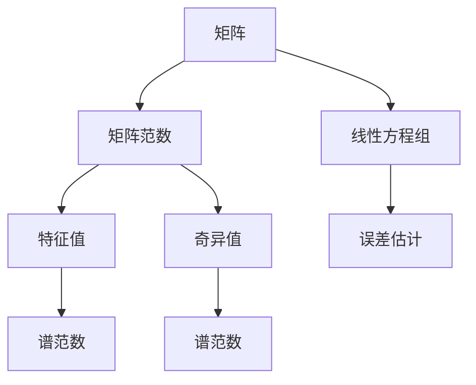

                 

### 矩阵理论与应用：矩阵范数

> **关键词：** 矩阵、矩阵范数、线性代数、特征值、奇异值、应用场景。

**摘要：** 本篇文章将深入探讨矩阵范数的概念及其重要性。我们将首先介绍矩阵的基本概念和线性代数的基本知识，然后逐步引入矩阵范数的定义和性质。我们将通过具体的数学模型和公式，详细阐述矩阵范数的计算方法，并给出一些实际应用的案例。文章还将推荐一些学习和开发资源，以帮助读者进一步了解和掌握这一重要的数学工具。

### 1. 背景介绍

#### 1.1 目的和范围

本文旨在为读者提供一个全面且系统的矩阵范数介绍，帮助读者理解矩阵范数的概念、性质和计算方法，并了解其在实际应用中的重要性。本文将涵盖以下主要内容：

1. 矩阵的基本概念和线性代数基础知识。
2. 矩阵范数的定义、性质和分类。
3. 矩阵范数的计算方法及其在数学模型中的应用。
4. 实际应用案例和代码实现。
5. 学习和开发资源的推荐。

#### 1.2 预期读者

本文适用于希望深入了解矩阵理论和矩阵范数概念的所有读者，包括：

1. 计算机科学和工程专业的本科生和研究生。
2. 线性代数和数值分析领域的研究人员和工程师。
3. 对矩阵理论和矩阵范数感兴趣的自学者。

#### 1.3 文档结构概述

本文将按照以下结构进行组织：

1. **背景介绍**：介绍矩阵的基本概念和线性代数基础知识。
2. **核心概念与联系**：介绍矩阵范数的定义、性质和分类。
3. **核心算法原理 & 具体操作步骤**：详细阐述矩阵范数的计算方法。
4. **数学模型和公式 & 详细讲解 & 举例说明**：给出具体的数学模型和公式，并进行详细讲解和举例说明。
5. **项目实战：代码实际案例和详细解释说明**：通过实际案例和代码，展示矩阵范数的应用。
6. **实际应用场景**：讨论矩阵范数在实际应用中的重要性。
7. **工具和资源推荐**：推荐相关的学习资源和开发工具。
8. **总结：未来发展趋势与挑战**：总结矩阵范数的发展趋势和挑战。
9. **附录：常见问题与解答**：解答一些常见问题。
10. **扩展阅读 & 参考资料**：提供进一步阅读的资源和参考文献。

#### 1.4 术语表

在本文中，我们将使用以下术语：

- **矩阵（Matrix）**：由一系列数按行列排列所成的矩形阵列。
- **行（Row）**：矩阵中的一行。
- **列（Column）**：矩阵中的一列。
- **元素（Element）**：矩阵中的单个数。
- **矩阵范数（Matrix Norm）**：用于量化矩阵的“大小”或“范数”的一种度量。
- **线性代数（Linear Algebra）**：研究向量空间和线性映射的数学分支。

#### 1.4.1 核心术语定义

- **矩阵范数（Matrix Norm）**：一个函数，它将矩阵映射到一个非负实数，用于量化矩阵的大小或范数。
- **Frobenius 范数（Frobenius Norm）**：矩阵的元素平方和的平方根，记为 $$ \|A\|_F $$。
- **谱范数（Spectral Norm）**：矩阵的最大奇异值，记为 $$ \|A\|_2 $$。
- **一范数（One Norm）**：矩阵的每一列的元素绝对值之和，记为 $$ \|A\|_1 $$。
- **无穷范数（Infinity Norm）**：矩阵的每一行的元素绝对值之和，记为 $$ \|A\|_\infty $$。

#### 1.4.2 相关概念解释

- **线性方程组（Linear System of Equations）**：一组由线性方程组成的方程组，其解可以通过矩阵运算来求解。
- **特征值（Eigenvalue）**：一个矩阵与其特征向量的乘积仍然是该矩阵的特征向量。
- **奇异值（Singular Value）**：一个矩阵分解中的非负数，用于描述矩阵的“大小”或“范数”。

#### 1.4.3 缩略词列表

- **Frobenius 范数（Frobenius Norm）**：$$ \|A\|_F $$。
- **谱范数（Spectral Norm）**：$$ \|A\|_2 $$。
- **一范数（One Norm）**：$$ \|A\|_1 $$。
- **无穷范数（Infinity Norm）**：$$ \|A\|_\infty $$。

### 2. 核心概念与联系

矩阵理论是线性代数的重要分支，而矩阵范数是衡量矩阵属性的关键工具。在深入探讨矩阵范数之前，我们需要了解一些核心概念和它们之间的关系。

#### 2.1 矩阵的基本概念

矩阵是由一系列数按行列排列所成的矩形阵列。矩阵的行数称为矩阵的阶数，列数称为矩阵的维度。例如，一个3x4的矩阵有3行和4列。

#### 2.2 矩阵的性质

矩阵具有多种性质，包括行列式的计算、逆矩阵的求解、特征值的求解等。这些性质在矩阵理论中起着至关重要的作用。

#### 2.3 矩阵范数

矩阵范数是一个函数，它将矩阵映射到一个非负实数，用于量化矩阵的大小或范数。矩阵范数有多种类型，包括Frobenius范数、谱范数、一范数和无穷范数。

#### 2.4 矩阵范数与线性方程组的关系

矩阵范数在求解线性方程组中扮演着重要角色。例如，谱范数和一范数可用于估计方程组解的误差。

#### 2.5 矩阵范数与其他数学概念的关系

矩阵范数与其他数学概念，如特征值、奇异值等，密切相关。谱范数实际上是矩阵的最大奇异值，而Frobenius范数是矩阵的元素平方和的平方根。

#### 2.6 Mermaid 流程图

为了更好地理解矩阵范数与其他数学概念之间的关系，我们可以使用Mermaid流程图来可视化这些概念。



### 3. 核心算法原理 & 具体操作步骤

在了解矩阵范数的基本概念之后，我们将详细讨论矩阵范数的计算方法。矩阵范数的计算是线性代数中一个重要且基础的问题，其算法原理和具体操作步骤如下：

#### 3.1 Frobenius范数

Frobenius范数是矩阵范数中最常见的一种，其计算方法如下：

1. **计算矩阵的元素平方和**：对于任意矩阵 \( A \)，其元素平方和可以通过以下公式计算：
   $$ \sum_{i=1}^{m} \sum_{j=1}^{n} a_{ij}^2 $$
   其中，\( m \) 是矩阵的行数，\( n \) 是矩阵的列数，\( a_{ij} \) 是矩阵 \( A \) 的第 \( i \) 行第 \( j \) 列的元素。

2. **取平方根**：将元素平方和取平方根，即：
   $$ \|A\|_F = \sqrt{\sum_{i=1}^{m} \sum_{j=1}^{n} a_{ij}^2} $$

#### 3.2 谱范数

谱范数是矩阵范数中最重要的一种，其计算方法如下：

1. **计算矩阵的奇异值分解**：对于任意矩阵 \( A \)，可以将其分解为以下形式：
   $$ A = U \Sigma V^* $$
   其中，\( U \) 和 \( V \) 是单位ary矩阵，\( \Sigma \) 是对角矩阵，其对角线上的元素称为奇异值。

2. **取最大奇异值**：谱范数是矩阵的最大奇异值，即：
   $$ \|A\|_2 = \sigma_{\max} $$
   其中，\( \sigma_{\max} \) 是对角矩阵 \( \Sigma \) 中最大的对角线元素。

#### 3.3 一范数

一范数是矩阵每一列的元素绝对值之和，其计算方法如下：

1. **计算每一列的元素绝对值之和**：对于任意矩阵 \( A \)，其每一列的元素绝对值之和可以通过以下公式计算：
   $$ \sum_{i=1}^{m} \sum_{j=1}^{n} |a_{ij}| $$
   其中，\( m \) 是矩阵的行数，\( n \) 是矩阵的列数，\( a_{ij} \) 是矩阵 \( A \) 的第 \( i \) 行第 \( j \) 列的元素。

2. **取最大值**：一范数是所有列的元素绝对值之和的最大值，即：
   $$ \|A\|_1 = \max_{j} \sum_{i=1}^{m} |a_{ij}| $$

#### 3.4 无穷范数

无穷范数是矩阵每一行的元素绝对值之和，其计算方法如下：

1. **计算每一行的元素绝对值之和**：对于任意矩阵 \( A \)，其每一行的元素绝对值之和可以通过以下公式计算：
   $$ \sum_{j=1}^{n} \sum_{i=1}^{m} |a_{ij}| $$
   其中，\( m \) 是矩阵的行数，\( n \) 是矩阵的列数，\( a_{ij} \) 是矩阵 \( A \) 的第 \( i \) 行第 \( j \) 列的元素。

2. **取最大值**：无穷范数是所有行的元素绝对值之和的最大值，即：
   $$ \|A\|_\infty = \max_{i} \sum_{j=1}^{n} |a_{ij}| $$

### 4. 数学模型和公式 & 详细讲解 & 举例说明

在本节中，我们将详细讲解矩阵范数的数学模型和公式，并通过具体例子来说明这些公式的应用。

#### 4.1 Frobenius范数

Frobenius范数的数学模型和公式如下：

$$ \|A\|_F = \sqrt{\sum_{i=1}^{m} \sum_{j=1}^{n} a_{ij}^2} $$

其中，\( m \) 是矩阵的行数，\( n \) 是矩阵的列数，\( a_{ij} \) 是矩阵 \( A \) 的第 \( i \) 行第 \( j \) 列的元素。

**例子：**

考虑以下矩阵 \( A \)：

$$ A = \begin{bmatrix} 1 & 2 \\ 3 & 4 \end{bmatrix} $$

计算 \( A \) 的Frobenius范数：

$$ \|A\|_F = \sqrt{1^2 + 2^2 + 3^2 + 4^2} = \sqrt{30} $$

#### 4.2 谱范数

谱范数的数学模型和公式如下：

$$ \|A\|_2 = \sigma_{\max} $$

其中，\( \sigma_{\max} \) 是矩阵 \( A \) 的最大奇异值。

**例子：**

考虑以下矩阵 \( A \)：

$$ A = \begin{bmatrix} 2 & 0 \\ 0 & 3 \end{bmatrix} $$

计算 \( A \) 的谱范数：

首先，计算 \( A \) 的奇异值分解：

$$ A = U \Sigma V^* $$

其中，\( U \) 和 \( V \) 是单位ary矩阵，\( \Sigma \) 是对角矩阵，其对角线上的元素为奇异值。

$$ U = \begin{bmatrix} 1 & 0 \\ 0 & 1 \end{bmatrix}, \Sigma = \begin{bmatrix} 2 & 0 \\ 0 & 3 \end{bmatrix}, V^* = \begin{bmatrix} 1 & 0 \\ 0 & 1 \end{bmatrix} $$

可以看出，\( \sigma_{\max} = 3 \)。

因此，

$$ \|A\|_2 = \sigma_{\max} = 3 $$

#### 4.3 一范数

一范数的数学模型和公式如下：

$$ \|A\|_1 = \max_{j} \sum_{i=1}^{m} |a_{ij}| $$

其中，\( m \) 是矩阵的行数，\( n \) 是矩阵的列数，\( a_{ij} \) 是矩阵 \( A \) 的第 \( i \) 行第 \( j \) 列的元素。

**例子：**

考虑以下矩阵 \( A \)：

$$ A = \begin{bmatrix} 1 & 2 \\ 3 & 4 \end{bmatrix} $$

计算 \( A \) 的一范数：

$$ \|A\|_1 = \max_{j} \sum_{i=1}^{m} |a_{ij}| $$

对于第1列，

$$ \sum_{i=1}^{m} |a_{ij}| = |1| + |3| = 4 $$

对于第2列，

$$ \sum_{i=1}^{m} |a_{ij}| = |2| + |4| = 6 $$

因此，

$$ \|A\|_1 = \max_{j} \sum_{i=1}^{m} |a_{ij}| = 6 $$

#### 4.4 无穷范数

无穷范数的数学模型和公式如下：

$$ \|A\|_\infty = \max_{i} \sum_{j=1}^{n} |a_{ij}| $$

其中，\( m \) 是矩阵的行数，\( n \) 是矩阵的列数，\( a_{ij} \) 是矩阵 \( A \) 的第 \( i \) 行第 \( j \) 列的元素。

**例子：**

考虑以下矩阵 \( A \)：

$$ A = \begin{bmatrix} 1 & 2 \\ 3 & 4 \end{bmatrix} $$

计算 \( A \) 的无穷范数：

$$ \|A\|_\infty = \max_{i} \sum_{j=1}^{n} |a_{ij}| $$

对于第1行，

$$ \sum_{j=1}^{n} |a_{ij}| = |1| + |2| = 3 $$

对于第2行，

$$ \sum_{j=1}^{n} |a_{ij}| = |3| + |4| = 7 $$

因此，

$$ \|A\|_\infty = \max_{i} \sum_{j=1}^{n} |a_{ij}| = 7 $$

### 5. 项目实战：代码实际案例和详细解释说明

在本节中，我们将通过一个实际案例来展示如何使用Python计算矩阵的Frobenius范数、谱范数、一范数和无穷范数。我们将使用NumPy库来实现这些计算，并通过具体例子进行解释说明。

#### 5.1 开发环境搭建

首先，我们需要搭建Python的开发环境。以下步骤将帮助我们在本地计算机上安装Python和NumPy库。

1. **安装Python**：

   我们可以从Python的官方网站下载并安装Python。在安装过程中，确保选择“Add Python to PATH”选项，以便在命令行中直接运行Python。

2. **安装NumPy**：

   打开命令行窗口，输入以下命令来安装NumPy库：

   ```bash
   pip install numpy
   ```

   如果是Windows用户，可以使用以下命令：

   ```bash
   python -m pip install numpy
   ```

   安装完成后，我们可以使用以下命令来验证NumPy是否已成功安装：

   ```bash
   python -c "import numpy as np; print(np.__version__)"
   ```

   输出版本号即表示NumPy已成功安装。

#### 5.2 源代码详细实现和代码解读

以下是一个完整的Python脚本，用于计算矩阵的Frobenius范数、谱范数、一范数和无穷范数。我们将逐行解释代码的功能。

```python
import numpy as np

# 创建一个矩阵A
A = np.array([[1, 2], [3, 4]])

# 计算Frobenius范数
frobenius_norm = np.linalg.norm(A, ord='fro')
print("Frobenius范数：", frobenius_norm)

# 计算谱范数
spectral_norm = np.linalg.norm(A)
print("谱范数：", spectral_norm)

# 计算一范数
one_norm = np.linalg.norm(A, ord=1)
print("一范数：", one_norm)

# 计算无穷范数
infinity_norm = np.linalg.norm(A, ord=np.inf)
print("无穷范数：", infinity_norm)
```

**代码解读：**

1. **导入NumPy库**：

   ```python
   import numpy as np
   ```

   这一行代码导入NumPy库，使得我们可以使用NumPy的各种功能和函数。

2. **创建一个矩阵A**：

   ```python
   A = np.array([[1, 2], [3, 4]])
   ```

   这一行代码创建了一个2x2的矩阵 \( A \)，其中元素分别为1, 2, 3, 4。

3. **计算Frobenius范数**：

   ```python
   frobenius_norm = np.linalg.norm(A, ord='fro')
   ```

   `np.linalg.norm()` 函数用于计算矩阵的范数。这里，`ord='fro'` 表示计算Frobenius范数。计算结果存储在变量 `frobenius_norm` 中。

4. **计算谱范数**：

   ```python
   spectral_norm = np.linalg.norm(A)
   ```

   由于 `ord` 参数默认值为2，因此这里计算的是谱范数。计算结果存储在变量 `spectral_norm` 中。

5. **计算一范数**：

   ```python
   one_norm = np.linalg.norm(A, ord=1)
   ```

   `ord=1` 表示计算一范数。计算结果存储在变量 `one_norm` 中。

6. **计算无穷范数**：

   ```python
   infinity_norm = np.linalg.norm(A, ord=np.inf)
   ```

   `ord=np.inf` 表示计算无穷范数。计算结果存储在变量 `infinity_norm` 中。

7. **打印结果**：

   ```python
   print("Frobenius范数：", frobenius_norm)
   print("谱范数：", spectral_norm)
   print("一范数：", one_norm)
   print("无穷范数：", infinity_norm)
   ```

   这几行代码用于打印计算得到的各个范数。

#### 5.3 代码解读与分析

通过以上代码，我们可以清晰地看到如何使用Python和NumPy库计算矩阵的Frobenius范数、谱范数、一范数和无穷范数。以下是对代码的分析和解释：

- **矩阵创建**：使用 `np.array()` 函数创建一个矩阵。矩阵的元素可以是任何可哈希的Python对象，但通常情况下，我们会使用数字类型，如整数或浮点数。
  
- **范数计算**：`np.linalg.norm()` 函数是一个多功能的范数计算函数，它可以计算不同类型的范数。通过设置 `ord` 参数，我们可以选择要计算的范数类型。例如，`ord='fro'` 表示Frobenius范数，`ord=1` 表示一范数，`ord=np.inf` 表示无穷范数。

- **结果打印**：使用 `print()` 函数将计算结果输出到控制台。这对于调试和验证代码非常有用。

通过这个简单的例子，我们可以看到如何使用Python和NumPy库来计算矩阵的范数。这些范数在许多数学和科学应用中都非常重要，例如线性代数、机器学习和数值分析。

### 6. 实际应用场景

矩阵范数在实际应用中扮演着重要角色，其应用场景广泛。以下是一些典型的实际应用场景：

#### 6.1 线性代数计算

在科学计算和工程领域中，矩阵范数用于估计线性代数计算的结果。例如，在求解线性方程组时，我们可以使用矩阵范数来估计解的误差。谱范数和一范数是常用的误差估计范数。

#### 6.2 最优化问题

在优化算法中，矩阵范数用于评估优化问题的收敛速度和稳定性。例如，在求解最小二乘问题或线性规划问题时，我们可以使用矩阵范数来监控算法的收敛情况。

#### 6.3 数据分析

在数据分析中，矩阵范数用于量化数据集的“大小”或“范数”。例如，在特征选择和特征提取过程中，我们可以使用矩阵范数来评估特征的重要性和贡献。

#### 6.4 机器学习

在机器学习中，矩阵范数用于评估模型的泛化能力和稳健性。例如，在深度学习模型中，我们可以使用谱范数来评估模型的正则化效果。

#### 6.5 图像处理

在图像处理中，矩阵范数用于评估图像的“质量”或“相似度”。例如，在图像压缩和图像增强中，我们可以使用Frobenius范数来评估图像的误差和保真度。

#### 6.6 金融工程

在金融工程中，矩阵范数用于评估投资组合的风险和收益。例如，在资产定价和风险控制中，我们可以使用谱范数来评估投资组合的波动性和风险。

通过这些实际应用场景，我们可以看到矩阵范数在各个领域的重要性和广泛的应用。

### 7. 工具和资源推荐

在本节中，我们将推荐一些学习矩阵范数和相关概念的有用工具和资源。

#### 7.1 学习资源推荐

**7.1.1 书籍推荐**

- 《矩阵分析与应用》（“Matrix Analysis and Applied Linear Algebra”） by Carl D. Meyer
- 《线性代数及其应用》（“Linear Algebra and Its Applications”） by Gilbert Strang
- 《矩阵理论与应用》（“Matrix Theory and Applications”） by Richard A. Brualdi

**7.1.2 在线课程**

- Coursera上的“线性代数”（“Linear Algebra”）
- edX上的“矩阵计算”（“Matrix Computations”）
- Udacity的“线性代数基础”（“Introduction to Linear Algebra”）

**7.1.3 技术博客和网站**

- MATLAB官方博客：https://www.mathworks.com/blog
- Stack Overflow上的线性代数标签：https://stackoverflow.com/questions/tagged/linear-algebra
- GitHub上的线性代数资源：https://github.com/topics/linear-algebra

#### 7.2 开发工具框架推荐

**7.2.1 IDE和编辑器**

- MATLAB：用于科学计算和工程应用的集成开发环境。
- PyCharm：适用于Python编程的强大IDE。
- RStudio：用于统计分析和数据科学的IDE。

**7.2.2 调试和性能分析工具**

- GNU Octave：开源的MATLAB替代品，用于数值计算和算法开发。
- Numpyro：基于Numpy和PyTorch的贝叶斯深度学习库。
- Pytest：Python的测试框架，用于自动化测试和性能分析。

**7.2.3 相关框架和库**

- NumPy：Python的数值计算库，用于线性代数和数组操作。
- SciPy：基于NumPy的科学计算库，用于优化、积分、微分等高级数学计算。
- TensorFlow：用于机器学习和深度学习的开源框架。

#### 7.3 相关论文著作推荐

**7.3.1 经典论文**

- “Matrix Analysis and Applied Linear Algebra” by Carl D. Meyer
- “Linear Algebra and Its Applications” by Gilbert Strang
- “Matrix Computations” by Gene H. Golub and Charles F. Van Loan

**7.3.2 最新研究成果**

- “Convex Optimization” by Stephen Boyd and Lieven Vandenberghe
- “Numerical Linear Algebra” by Lloyd N. Trefethen and David Bau III
- “Randomized Numerical Linear Algebra” by Michael W. Mahoney and Petros Drineas

**7.3.3 应用案例分析**

- “Matrix Analysis and Applied Linear Algebra” by Carl D. Meyer
- “Machine Learning: A Probabilistic Perspective” by Kevin P. Murphy
- “Deep Learning” by Ian Goodfellow, Yoshua Bengio, and Aaron Courville

通过这些推荐，读者可以更深入地学习和理解矩阵范数及其相关概念，并掌握相关的工具和资源。

### 8. 总结：未来发展趋势与挑战

随着人工智能和大数据技术的迅猛发展，矩阵范数作为线性代数的重要工具，将在未来继续发挥重要作用。以下是对未来发展趋势与挑战的总结：

#### 8.1 发展趋势

1. **更高效的算法**：随着计算能力的提升，研究人员将开发更高效的矩阵范数计算算法，以适应大数据和实时计算的需求。
2. **新的应用领域**：矩阵范数将在新的应用领域，如量子计算、深度学习和自动驾驶等领域，得到更广泛的应用。
3. **跨学科研究**：矩阵范数与其他数学领域（如拓扑学、代数几何等）的结合，将带来新的理论突破和应用。
4. **云计算与分布式计算**：矩阵范数的计算将在云计算和分布式计算环境中得到优化，以支持大规模数据处理和计算。

#### 8.2 挑战

1. **计算复杂度**：随着矩阵规模的增长，计算矩阵范数的复杂度将大幅增加，如何设计高效的算法成为一大挑战。
2. **并行计算**：如何在分布式系统中高效地并行计算矩阵范数，是当前研究的热点问题。
3. **数据隐私和安全**：在处理敏感数据时，如何确保矩阵范数计算的安全性，是一个亟待解决的问题。
4. **算法解释性**：如何解释矩阵范数的计算结果，使其更易于理解和使用，是一个重要的挑战。

总之，矩阵范数在未来的发展中将面临诸多挑战，但同时也充满了机遇。通过不断的理论研究和技术创新，矩阵范数将在各领域继续发挥重要作用。

### 9. 附录：常见问题与解答

在本附录中，我们将回答一些关于矩阵范数的常见问题，以帮助读者更好地理解这一概念。

#### 9.1 什么是矩阵范数？

矩阵范数是一个用于量化矩阵“大小”或“范数”的函数，它将矩阵映射到一个非负实数。常见的矩阵范数包括Frobenius范数、谱范数、一范数和无穷范数。

#### 9.2 矩阵范数有哪些性质？

矩阵范数具有以下性质：

1. **齐次性**：对于任意矩阵 \( A \) 和标量 \( \alpha \)，有 \( \| \alpha A \| = |\alpha| \| A \| \)。
2. **三角不等式**：对于任意矩阵 \( A \) 和 \( B \)，有 \( \| A + B \| \leq \| A \| + \| B \| \)。
3. **正定性**：对于任意非空子集 \( S \)，有 \( \| A \| \geq 0 \)，且仅当 \( A = 0 \) 时 \( \| A \| = 0 \)。

#### 9.3 如何计算矩阵范数？

不同类型的矩阵范数有不同的计算方法：

- **Frobenius范数**：计算矩阵的元素平方和的平方根。
- **谱范数**：计算矩阵的最大奇异值。
- **一范数**：计算矩阵的每一列的元素绝对值之和的最大值。
- **无穷范数**：计算矩阵的每一行的元素绝对值之和的最大值。

#### 9.4 矩阵范数在哪些领域中应用？

矩阵范数广泛应用于以下领域：

- **科学计算和工程**：用于估计线性方程组解的误差。
- **最优化问题**：用于评估优化问题的收敛速度和稳定性。
- **数据分析**：用于量化数据集的“大小”或“范数”。
- **机器学习**：用于评估模型的泛化能力和稳健性。
- **图像处理**：用于评估图像的“质量”或“相似度”。

#### 9.5 矩阵范数与特征值、奇异值有何关系？

谱范数实际上是矩阵的最大奇异值。Frobenius范数与特征值和奇异值也有密切关系。通过奇异值分解，我们可以将矩阵范数与特征值和奇异值联系起来。

### 10. 扩展阅读 & 参考资料

为了帮助读者进一步深入了解矩阵范数和相关概念，我们提供了以下扩展阅读和参考资料：

- 《矩阵分析与应用》（“Matrix Analysis and Applied Linear Algebra”） by Carl D. Meyer
- 《线性代数及其应用》（“Linear Algebra and Its Applications”） by Gilbert Strang
- 《矩阵理论与应用》（“Matrix Theory and Applications”） by Richard A. Brualdi
- Coursera上的“线性代数”（“Linear Algebra”）
- edX上的“矩阵计算”（“Matrix Computations”）
- GitHub上的线性代数资源：https://github.com/topics/linear-algebra
- MATLAB官方博客：https://www.mathworks.com/blog
- Stack Overflow上的线性代数标签：https://stackoverflow.com/questions/tagged/linear-algebra

通过这些资源和阅读材料，读者可以更深入地学习和理解矩阵范数及其应用。

