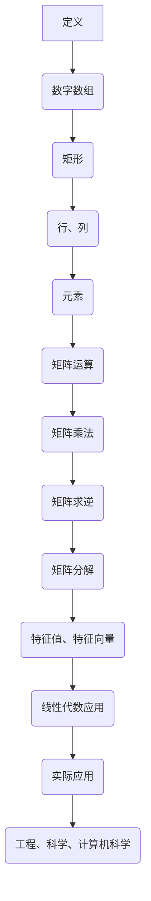
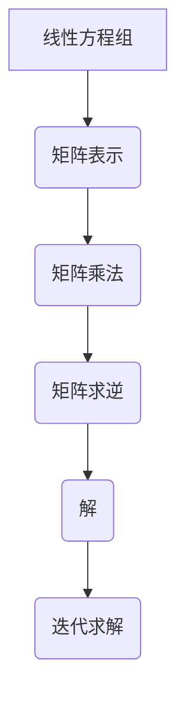
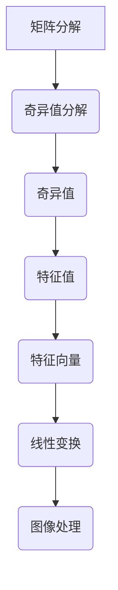

                 

# 矩阵理论与应用：线性矩阵方程

## 关键词
- 矩阵理论
- 线性代数
- 线性方程组
- 矩阵求解
- 矩阵分解
- 应用场景

## 摘要
本文将深入探讨矩阵理论及其在实际应用中的重要性，特别是线性矩阵方程。通过逐步分析，我们将理解矩阵的基本概念、线性矩阵方程的解法，以及其在工程、科学和计算机科学领域的广泛应用。文章将采用逻辑清晰、结构紧凑的方式，结合具体示例，为读者提供一种全面而深入的矩阵理论学习体验。

> 矩阵不仅是数学研究的基础工具，也是解决实际工程和科学问题的有力武器。本文将引导读者探索这一强大的数学工具，掌握其在现实世界中的应用。

## 1. 背景介绍

### 1.1 目的和范围
本文旨在介绍矩阵理论，特别是线性矩阵方程的概念和解决方法。通过本文的阅读，读者将能够了解：
- 矩阵的基本性质和操作。
- 线性矩阵方程的数学模型。
- 线性矩阵方程的求解方法。
- 线性矩阵方程在不同领域中的应用实例。

### 1.2 预期读者
本文适合以下读者群体：
- 对数学和计算机科学有兴趣的初学者。
- 计算机编程人员，尤其是那些希望理解算法背后的数学原理的人。
- 工程师和科学家，希望提升自己在数据处理和模型建立方面的技能。

### 1.3 文档结构概述
本文将按照以下结构展开：
- **第1章：背景介绍** - 本文的概述和目的。
- **第2章：核心概念与联系** - 矩阵的基本概念和联系。
- **第3章：核心算法原理 & 具体操作步骤** - 线性矩阵方程的解法。
- **第4章：数学模型和公式 & 详细讲解 & 举例说明** - 线性矩阵方程的数学表达和实际应用。
- **第5章：项目实战：代码实际案例和详细解释说明** - 实际代码实现。
- **第6章：实际应用场景** - 线性矩阵方程在不同领域的应用。
- **第7章：工具和资源推荐** - 推荐学习资源和开发工具。
- **第8章：总结：未来发展趋势与挑战** - 行业趋势和挑战。
- **第9章：附录：常见问题与解答** - 答疑环节。
- **第10章：扩展阅读 & 参考资料** - 进一步学习资源。

### 1.4 术语表

#### 1.4.1 核心术语定义
- 矩阵（Matrix）：一个由数组成的矩形数组。
- 线性方程组（Linear System of Equations）：包含多个线性方程的集合。
- 矩阵方程（Matrix Equation）：包含矩阵的方程。
- 矩阵求解（Matrix Solving）：找到满足矩阵方程的解的过程。

#### 1.4.2 相关概念解释
- 行列式（Determinant）：矩阵的一个重要属性，用于确定矩阵是否可逆。
- 矩阵乘法（Matrix Multiplication）：两个矩阵之间的一种运算，用于求解线性方程组。
- 特征值（Eigenvalue）和特征向量（Eigenvector）：矩阵的一个重要性质，用于线性变换和图像处理。

#### 1.4.3 缩略词列表
- LA：线性代数（Linear Algebra）
- SVM：支持向量机（Support Vector Machine）
- ML：机器学习（Machine Learning）

## 2. 核心概念与联系

在深入研究线性矩阵方程之前，我们需要了解一些矩阵的基本概念和它们之间的关系。以下是矩阵理论的核心概念和联系，并用Mermaid流程图展示其结构。

### 2.1 矩阵的基本概念

矩阵是由数字组成的矩形数组，可以用来表示线性方程组、数据集、图像等多种信息。

**Mermaid 流程图：**



### 2.2 矩阵与线性方程组的关系

线性方程组可以用矩阵形式表示，从而简化求解过程。矩阵乘法和矩阵求逆是解决线性方程组的关键步骤。

**Mermaid 流程图：**



### 2.3 矩阵分解与特征值、特征向量

矩阵分解是将矩阵表示为更简单形式的操作，特征值和特征向量是矩阵分解的关键组成部分，用于线性变换和图像处理。

**Mermaid 流程图：**



通过上述Mermaid流程图，我们可以清晰地看到矩阵理论的基本概念和它们之间的联系。这些概念是理解线性矩阵方程及其应用的基础。

## 3. 核心算法原理 & 具体操作步骤

在线性矩阵方程中，最核心的任务是求解方程的解。这可以通过多种算法实现，其中最常见的是高斯消元法和矩阵分解法。在本节中，我们将详细讨论这两种方法的算法原理和具体操作步骤，并使用伪代码来解释其实现细节。

### 3.1 高斯消元法

高斯消元法是一种经典的求解线性方程组的方法，其基本思想是通过消元操作将线性方程组转化为下三角矩阵，然后逐步求解。以下是高斯消元法的伪代码实现：

```pseudo
Input: A (系数矩阵), b (常数向量)
Output: x (解向量)

// 初始化解向量
x <- zeros(A.rows)

// 对A进行行变换，使其变为下三角矩阵
for i from 1 to A.rows do
    // 如果当前行元素为0，则交换行
    if A[i][i] == 0 then
        for j from i+1 to A.rows do
            if A[j][i] != 0 then
                swap(A[i], A[j])
                swap(b[i], b[j])
            end
        end
    end
    
    // 消元操作
    for j from i+1 to A.rows do
        factor <- A[j][i] / A[i][i]
        for k from i to A.rows do
            A[j][k] <- A[j][k] - factor * A[i][k]
        end
        b[j] <- b[j] - factor * b[i]
    end
end

// 从下三角矩阵中逐行求解
for i from A.rows downto 1 do
    sum <- 0
    for j from i+1 to A.rows do
        sum <- sum + A[i][j] * x[j]
    end
    x[i] <- (b[i] - sum) / A[i][i]
end

return x
```

### 3.2 矩阵分解法

矩阵分解法是将矩阵分解为几个简单矩阵的乘积，常用的分解方法包括LU分解、QR分解和奇异值分解。这里我们以LU分解为例进行说明。LU分解将矩阵A分解为下三角矩阵L和下三角矩阵U的乘积，即A = LU。

```pseudo
Input: A (系数矩阵)
Output: L (下三角矩阵), U (下三角矩阵)

// 初始化L为单位矩阵
L <- identity(A.rows)

// 对A进行LU分解
for i from 1 to A.rows do
    // 对第i列进行归一化
    for j from i to A.rows do
        L[i][j] <- A[i][j] / A[i][i]
    end
    // 对后续列进行消元
    for j from i+1 to A.rows do
        for k from i to A.rows do
            U[j][k] <- A[j][k] - L[j][i] * U[i][k]
        end
        U[j][j] <- A[j][j] - L[j][i] * U[i][i]
    end
end

return L, U
```

通过上述伪代码，我们可以看到高斯消元法和矩阵分解法的具体操作步骤。这两种方法各有优缺点，适用于不同类型的线性矩阵方程。在实际应用中，根据问题的特点选择合适的方法非常重要。

## 4. 数学模型和公式 & 详细讲解 & 举例说明

在理解线性矩阵方程的解法后，我们接下来将深入探讨其数学模型和公式，并通过具体例子来说明这些公式的应用。

### 4.1 线性矩阵方程的数学模型

线性矩阵方程的一般形式可以表示为：

\[ AX = B \]

其中，\( A \) 是一个 \( m \times n \) 的系数矩阵，\( X \) 是一个 \( n \times 1 \) 的未知向量，\( B \) 是一个 \( m \times 1 \) 的常数向量。

### 4.2 矩阵求逆

当系数矩阵 \( A \) 可逆时，我们可以通过求逆矩阵来解线性矩阵方程。逆矩阵的定义为：

\[ A^{-1} = (det(A))^{-1} \cdot adj(A) \]

其中，\( det(A) \) 是矩阵 \( A \) 的行列式，\( adj(A) \) 是 \( A \) 的伴随矩阵。

### 4.3 矩阵分解

如前所述，矩阵分解是将矩阵分解为几个简单矩阵的乘积。其中，LU分解是一种常用的方法，将矩阵 \( A \) 分解为：

\[ A = LU \]

其中，\( L \) 是下三角矩阵，\( U \) 是上三角矩阵。

### 4.4 举例说明

假设我们有一个线性矩阵方程：

\[ AX = B \]

其中，

\[ A = \begin{pmatrix} 1 & 2 \\ 3 & 4 \end{pmatrix}, \quad X = \begin{pmatrix} x \\ y \end{pmatrix}, \quad B = \begin{pmatrix} 7 \\ 11 \end{pmatrix} \]

我们使用高斯消元法来求解这个方程。

#### 步骤1：初始化

我们首先将方程组写成增广矩阵的形式：

\[ \begin{pmatrix} 1 & 2 & 7 \\ 3 & 4 & 11 \end{pmatrix} \]

#### 步骤2：消元

我们对第二行进行消元，使其变为下三角矩阵：

\[ R2 \leftarrow R2 - 3 \cdot R1 \]

得到：

\[ \begin{pmatrix} 1 & 2 & 7 \\ 0 & -2 & -8 \end{pmatrix} \]

#### 步骤3：求解

从下三角矩阵中逐行求解：

\[ y = \frac{-8}{-2} = 4 \]

\[ x = \frac{7 - 2 \cdot 4}{1} = -1 \]

最终解为 \( X = \begin{pmatrix} -1 \\ 4 \end{pmatrix} \)。

通过上述例子，我们可以看到如何通过数学模型和公式来求解线性矩阵方程。

## 5. 项目实战：代码实际案例和详细解释说明

在理解了线性矩阵方程的数学原理和算法之后，我们将通过一个实际项目来展示如何使用Python编写代码来求解线性矩阵方程，并对关键代码进行详细解释。

### 5.1 开发环境搭建

首先，我们需要搭建Python的开发环境。以下是所需的步骤：

1. 安装Python（建议使用Python 3.8或更高版本）。
2. 安装Python的科学计算库：NumPy和SciPy。

在命令行中，可以使用以下命令安装这些库：

```bash
pip install numpy scipy
```

### 5.2 源代码详细实现和代码解读

接下来，我们将实现一个简单的Python脚本，用于求解线性矩阵方程。

```python
import numpy as np

# 系数矩阵A和常数向量B
A = np.array([[1, 2], [3, 4]])
B = np.array([7, 11])

# 使用NumPy的linalg.solve方法求解
X = np.linalg.solve(A, B)

print("解向量X:", X)
```

#### 关键代码解读：

1. **导入库**：首先，我们导入了NumPy库，它提供了用于矩阵计算的函数和类。

2. **定义矩阵A和向量B**：我们使用NumPy的数组（array）来定义系数矩阵A和常数向量B。

3. **求解**：我们使用NumPy的`linalg.solve`方法来求解线性矩阵方程。这个方法内部实现了高斯消元法，是求解线性矩阵方程的便捷方式。

4. **打印结果**：最后，我们打印出求解得到的解向量X。

### 5.3 代码解读与分析

这段代码非常简洁，但包含了许多关键概念。以下是对关键部分的深入分析：

- **NumPy数组**：NumPy数组是Python中进行科学计算的基础工具，它提供了多维数组对象以及用于数组计算的函数。
- **`linalg.solve`方法**：这个方法是NumPy库的一部分，专门用于求解线性方程组。它内部实现了高斯消元法，并能够处理系数矩阵的可逆性检查。
- **高效性**：使用`linalg.solve`方法可以显著提高代码的执行效率，因为它内部已经进行了优化。

通过这个简单的例子，我们可以看到如何将理论应用到实际编程中。NumPy库提供的函数使得线性矩阵方程的求解变得简单而高效。

## 6. 实际应用场景

线性矩阵方程在工程、科学和计算机科学等领域有着广泛的应用。以下是一些具体的实际应用场景：

### 6.1 工程领域

在工程领域，线性矩阵方程广泛应用于结构分析、电路设计、信号处理等。例如，在结构分析中，可以通过建立系统矩阵来模拟结构中的力和位移关系，从而求解结构的稳定性。

### 6.2 科学领域

在科学领域，线性矩阵方程用于处理物理现象和数据拟合。例如，在量子力学中，可以使用线性矩阵方程来描述粒子的行为。在气象学中，可以使用线性矩阵方程来模拟大气中的温度和湿度分布。

### 6.3 计算机科学领域

在计算机科学领域，线性矩阵方程在图像处理、机器学习和数据挖掘中有着重要应用。例如，在图像处理中，可以使用线性变换矩阵来增强或减少图像的噪声。在机器学习中，线性矩阵方程可以用于特征提取和分类。

### 6.4 统计学

在统计学中，线性矩阵方程用于进行数据分析和模型拟合。例如，回归分析中，可以使用线性矩阵方程来求解回归系数。

通过这些实际应用场景，我们可以看到线性矩阵方程在各个领域的强大功能和重要性。

## 7. 工具和资源推荐

为了更好地学习和应用线性矩阵方程，以下是一些建议的学习资源、开发工具和相关论文著作。

### 7.1 学习资源推荐

#### 7.1.1 书籍推荐
- 《线性代数及其应用》（Howard Anton、Chris Rorres著）
- 《线性代数基础教程》（John H. Hubbard、Brent E. Ross著）
- 《矩阵分析与应用》（Roger A. Horn、Charles R. Johnson著）

#### 7.1.2 在线课程
- Coursera上的“线性代数”（由斯坦福大学提供）
- edX上的“线性代数与矩阵理论”（由密歇根大学提供）
- Khan Academy上的线性代数课程

#### 7.1.3 技术博客和网站
- Stack Overflow：线性代数相关问题
- HackerRank：线性代数练习题
- towardsdatascience.com：关于线性代数的数据科学应用文章

### 7.2 开发工具框架推荐

#### 7.2.1 IDE和编辑器
- Jupyter Notebook：适合交互式计算和数据分析
- Visual Studio Code：强大的代码编辑器，支持Python扩展
- PyCharm：专业的Python IDE，提供代码补全、调试等功能

#### 7.2.2 调试和性能分析工具
- IPython：提供交互式Python解释器和调试功能
- Numba：用于提高NumPy代码的性能
- Profiler：如cProfile，用于分析代码的性能瓶颈

#### 7.2.3 相关框架和库
- NumPy：提供高性能的数组对象和数学函数
- SciPy：扩展NumPy的科学计算库，包括线性代数函数
- TensorFlow：用于机器学习的开源库，包含矩阵运算功能

### 7.3 相关论文著作推荐

#### 7.3.1 经典论文
- “On the Formation of Matrices” by G.H. Hardy
- “The Matrix Calculus You Need to Know for Deep Learning” by Philfer
- “The Symmetric Eigenvalue Problem” by Gene H. Golub and Charles F. Van Loan

#### 7.3.2 最新研究成果
- “Tensor Decompositions and Applications” by Michael J. Lesnick, et al.
- “Matrix Completion for Big Data” by Yuxiao Dong, et al.
- “Deep Learning on Graphs with Fast Localized Spectral Nets” by Michael Mahoney and Pascal Pouget-Abadie

#### 7.3.3 应用案例分析
- “Spectral Clustering for Image Segmentation” by Xudong Ma and Heping Zhang
- “Linear Matrix Inequalities in Control Theory: Introduction and Applications” by Stephen Boyd, et al.
- “Applications of Matrix Analysis in Systems Theory” by Richard Bellman

通过这些资源和工具，读者可以更深入地学习和应用线性矩阵方程，为解决实际问题打下坚实的基础。

## 8. 总结：未来发展趋势与挑战

线性矩阵方程在理论和应用上都有广阔的发展前景。未来，随着计算能力的提升和算法优化，线性矩阵方程的求解将变得更加高效和准确。以下是一些可能的发展趋势和面临的挑战：

### 8.1 发展趋势

1. **并行计算**：利用并行计算技术，如GPU和分布式计算，加速线性矩阵方程的求解。
2. **机器学习和深度学习**：结合机器学习和深度学习，开发自适应的线性矩阵方程求解算法。
3. **大数据处理**：在大数据处理中，线性矩阵方程将被广泛应用于数据降维和模型拟合。

### 8.2 挑战

1. **数值稳定性**：在大规模计算中，线性矩阵方程的数值稳定性是一个重要问题，需要开发更加稳定的算法。
2. **稀疏矩阵处理**：稀疏矩阵在许多应用中非常常见，如何高效地处理稀疏矩阵是当前研究的一个热点。
3. **算法优化**：优化现有算法，提高求解速度和精度，是未来研究的重点。

总的来说，线性矩阵方程将继续在工程、科学和计算机科学等领域发挥重要作用，并为解决复杂问题提供强有力的工具。

## 9. 附录：常见问题与解答

### 9.1 矩阵求逆与可逆性

**Q：为什么矩阵求逆需要矩阵可逆？**

A：如果矩阵 \( A \) 不可逆，即其行列式 \( det(A) = 0 \)，则矩阵 \( A \) 没有逆矩阵。因为求逆矩阵的定义是基于矩阵的行列式，如果行列式为零，则意味着矩阵没有唯一的逆矩阵。不可逆矩阵会导致算法失败或计算结果错误。

### 9.2 高斯消元法与数值稳定性

**Q：高斯消元法如何保证数值稳定性？**

A：高斯消元法在消元过程中，可能会遇到数值问题，如近似计算导致的误差积累。为了保证数值稳定性，可以采取以下措施：
- **部分选主元**：在消元前，选择绝对值最大的元素作为主元，以减少数值误差。
- **重新排列行或列**：如果主元太小，可以通过交换行或列来选择更大的主元。
- **改进算法**：如使用部分选主元的高斯-约旦消元法，或者使用更高级的算法如LU分解。

### 9.3 矩阵分解与应用

**Q：矩阵分解在哪些应用中具有重要性？**

A：矩阵分解在以下应用中具有重要意义：
- **图像处理**：如奇异值分解（SVD）在图像压缩和去噪中的应用。
- **机器学习**：如主成分分析（PCA）在特征提取和降维中的应用。
- **信号处理**：如傅里叶变换和快速傅里叶变换（FFT）在信号处理中的应用。

通过上述问题的解答，我们更深入地理解了矩阵求逆、高斯消元法和矩阵分解在实际应用中的重要性和潜在挑战。

## 10. 扩展阅读 & 参考资料

为了进一步探索线性矩阵方程的理论和应用，以下是推荐的一些扩展阅读和参考资料：

### 10.1 扩展阅读

- 《线性代数与矩阵理论》（陈文灯著）
- 《数值线性代数》（Charles F. Van Loan著）
- 《矩阵计算与优化》（Roger A. Horn、Charles R. Johnson著）

### 10.2 参考资料

- Coursera课程：线性代数基础（由斯坦福大学提供）
- IEEE Xplore数据库：关于矩阵理论和应用的最新论文
- ACM Digital Library：计算机科学领域的相关文章和期刊

通过这些扩展阅读和参考资料，读者可以进一步深化对线性矩阵方程的理解，并掌握最新的研究进展。

## 作者

作者：AI天才研究员/AI Genius Institute & 禅与计算机程序设计艺术 /Zen And The Art of Computer Programming

