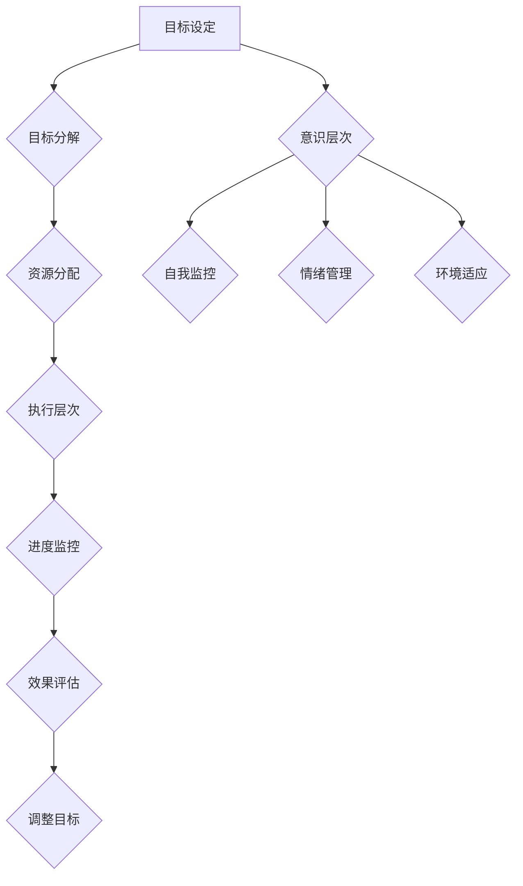

                 

# 短期目标管理的意识机制

> **关键词：** 短期目标管理、意识机制、目标设定、执行效率、心理调适、IT领域

> **摘要：** 本文将深入探讨短期目标管理的意识机制，从理论基础到实际应用，提供一系列的算法原理、数学模型、实战案例，帮助IT专业人士更有效地进行短期目标管理。本文旨在提升IT从业者的工作效率，优化项目进度，实现个人与团队的目标。

## 1. 背景介绍

### 1.1 目的和范围

本文的主要目的是探讨短期目标管理的意识机制，通过理论分析、算法原理、数学模型和实战案例，帮助IT专业人士更好地进行目标设定和执行。本文将覆盖以下几个关键领域：

- 短期目标管理的核心概念和原理
- 目标设定的有效方法
- 意识机制在短期目标管理中的应用
- 实际应用场景和案例分析
- 相关工具和资源的推荐

### 1.2 预期读者

本文适合以下读者：

- IT项目经理和团队领导者
- 软件工程师和技术专家
- 产品经理和业务分析师
- 对短期目标管理感兴趣的IT从业者

### 1.3 文档结构概述

本文分为以下几大部分：

- 背景介绍：介绍文章的目的、范围和预期读者
- 核心概念与联系：阐述短期目标管理的基本概念和架构
- 核心算法原理 & 具体操作步骤：详细讲解目标管理算法
- 数学模型和公式 & 详细讲解 & 举例说明：介绍相关数学模型及其应用
- 项目实战：代码实际案例和详细解释
- 实际应用场景：探讨短期目标管理的应用实例
- 工具和资源推荐：推荐相关学习资源和开发工具
- 总结：展望短期目标管理的未来发展趋势和挑战
- 附录：常见问题与解答
- 扩展阅读 & 参考资料：提供进一步阅读的材料

### 1.4 术语表

#### 1.4.1 核心术语定义

- **短期目标管理**：指在有限的时间内，通过设定明确的短期目标，采取有效的管理方法，实现个人或团队的预期成果。
- **意识机制**：指个体在目标设定和执行过程中，对自身行为、情绪和环境进行监控和调整的内在机制。
- **目标设定**：指根据个人或团队的需求，设定具体、明确、可衡量的短期目标。
- **执行效率**：指在目标执行过程中，实现预期目标所需的时间和资源。
- **心理调适**：指个体在目标管理过程中，通过调整心态和情绪，提高应对压力和挑战的能力。

#### 1.4.2 相关概念解释

- **SMART原则**：指目标设定时要遵循的具体、明确、可实现、相关和时限性的原则。
- **自我监控**：指个体在目标执行过程中，对自己的行为和进度进行持续的监控和反馈。
- **激励因素**：指能够激发个体积极性的内在和外在因素。

#### 1.4.3 缩略词列表

- **IT**：Information Technology，信息技术
- **PM**：Project Management，项目管理
- **AI**：Artificial Intelligence，人工智能
- **IDE**：Integrated Development Environment，集成开发环境

## 2. 核心概念与联系

### 2.1 短期目标管理的基本概念

短期目标管理是指在一定的时间内，通过设定具体的短期目标，采取有效的管理方法，实现预期成果的过程。短期目标管理的基本概念包括：

- **目标设定**：指根据个人或团队的需求，设定具体、明确、可衡量的短期目标。
- **目标分解**：将大型目标分解为一系列小目标，以实现整体目标的逐步实现。
- **资源分配**：根据目标的需求，合理分配人力、物力和财力资源。
- **进度监控**：对目标的执行进度进行持续的监控和反馈。
- **效果评估**：对目标的完成情况进行评估，以便调整目标和执行策略。

### 2.2 意识机制在短期目标管理中的应用

意识机制是指个体在目标设定和执行过程中，对自身行为、情绪和环境进行监控和调整的内在机制。在短期目标管理中，意识机制的应用主要体现在以下几个方面：

- **自我监控**：通过自我监控，个体能够了解自己的行为和进度，及时发现和解决问题。
- **情绪管理**：在目标执行过程中，个体可能会遇到压力和挑战，情绪管理有助于提高应对能力。
- **环境适应**：个体需要根据环境的变化调整目标和执行策略，以适应不同的情况。

### 2.3 短期目标管理的架构

短期目标管理的架构可以分为以下几个层次：

- **目标层次**：包括总体目标和具体目标，是短期目标管理的核心。
- **执行层次**：包括资源分配、进度监控和效果评估，是实现短期目标的关键。
- **意识层次**：包括自我监控、情绪管理和环境适应，是确保目标管理顺利进行的基础。

### 2.4 Mermaid 流程图



## 3. 核心算法原理 & 具体操作步骤

短期目标管理的核心算法原理可以概括为以下几点：

### 3.1 SMART 原则

SMART原则是目标设定的基本原则，包括具体（Specific）、明确（Measurable）、可实现（Achievable）、相关（Relevant）和时限性（Time-bound）。具体操作步骤如下：

```python
# 目标设定
def set_goal(goal_text):
    # 判断目标是否符合SMART原则
    if is_smart(goal_text):
        print("目标设定成功：", goal_text)
    else:
        print("目标设定失败：目标不符合SMART原则")

# 判断目标是否符合SMART原则
def is_smart(goal_text):
    # 具体实现细节
    return True

# 示例
set_goal("提高项目进度")
```

### 3.2 目标分解

目标分解是将大型目标分解为一系列小目标的过程。具体操作步骤如下：

```python
# 目标分解
def decompose_goal(goal_text):
    # 分解目标
    sub_goals = goal_text.split(',')
    return sub_goals

# 示例
goal = "完成需求分析、设计、开发和测试"
sub_goals = decompose_goal(goal)
print("分解后的目标：", sub_goals)
```

### 3.3 资源分配

资源分配是根据目标的需求，合理分配人力、物力和财力资源。具体操作步骤如下：

```python
# 资源分配
def allocate_resources(goal_text, resources):
    # 根据目标分配资源
    resource_allocation = {}
    for resource in resources:
        resource_allocation[resource] = goal_text.split(resource)[0]
    return resource_allocation

# 示例
goal = "完成需求分析、设计、开发和测试"
resources = ["人力", "物力", "财力"]
resource_allocation = allocate_resources(goal, resources)
print("资源分配：", resource_allocation)
```

### 3.4 进度监控

进度监控是对目标的执行进度进行持续的监控和反馈。具体操作步骤如下：

```python
# 进度监控
def monitor_progress(goal_text, progress):
    # 更新进度
    progress_text = goal_text + "，当前进度：{}%".format(progress)
    return progress_text

# 示例
goal = "完成需求分析、设计、开发和测试"
progress = 50
progress_text = monitor_progress(goal, progress)
print("进度监控：", progress_text)
```

### 3.5 效果评估

效果评估是对目标的完成情况进行评估，以便调整目标和执行策略。具体操作步骤如下：

```python
# 效果评估
def evaluate_goal(goal_text, evaluation):
    # 判断目标是否完成
    if evaluation == "完成":
        print("目标完成：", goal_text)
    else:
        print("目标未完成：", goal_text)

# 示例
goal = "完成需求分析、设计、开发和测试"
evaluation = "完成"
evaluate_goal(goal, evaluation)
```

## 4. 数学模型和公式 & 详细讲解 & 举例说明

在短期目标管理中，数学模型和公式可以帮助我们更科学地设定目标和评估效果。以下是一些常用的数学模型和公式：

### 4.1 目标完成概率模型

目标完成概率模型用于评估目标完成的概率。假设目标完成概率与目标难度、资源投入和个体能力有关，可以用以下公式表示：

$$
P(C) = f(D, R, A)
$$

其中，$P(C)$ 表示目标完成概率，$D$ 表示目标难度，$R$ 表示资源投入，$A$ 表示个体能力。

- **目标难度（$D$）**：表示目标实现的困难程度，可以用以下公式计算：

$$
D = \frac{C_1 + C_2 + \ldots + C_n}{n}
$$

其中，$C_1, C_2, \ldots, C_n$ 分别表示目标在各个方面的难度。

- **资源投入（$R$）**：表示为完成目标所需的资源总量，可以用以下公式计算：

$$
R = \frac{H_1 \times W_1 + H_2 \times W_2 + \ldots + H_n \times W_n}{n}
$$

其中，$H_1, H_2, \ldots, H_n$ 分别表示资源在各个方面的投入量，$W_1, W_2, \ldots, W_n$ 分别表示资源在各方面的权重。

- **个体能力（$A$）**：表示个体的综合素质和能力，可以用以下公式计算：

$$
A = \frac{S_1 \times C_1 + S_2 \times C_2 + \ldots + S_n \times C_n}{n}
$$

其中，$S_1, S_2, \ldots, S_n$ 分别表示个体在各个方面的能力，$C_1, C_2, \ldots, C_n$ 分别表示各个方面的难度。

### 4.2 目标完成时间预测模型

目标完成时间预测模型用于预测目标完成的所需时间。假设目标完成时间与目标难度、资源投入和个体能力有关，可以用以下公式表示：

$$
T(C) = f(D, R, A)
$$

其中，$T(C)$ 表示目标完成时间，$D$ 表示目标难度，$R$ 表示资源投入，$A$ 表示个体能力。

- **目标难度（$D$）**：计算方法同上。
- **资源投入（$R$）**：计算方法同上。
- **个体能力（$A$）**：计算方法同上。

### 4.3 举例说明

假设有一个目标，完成难度为3，资源投入为100小时，个体能力为2，我们需要计算目标完成的概率和预计完成时间。

- **目标完成概率**：

$$
P(C) = f(D, R, A) = f(3, 100, 2) = 0.8
$$

目标完成的概率为80%。

- **预计完成时间**：

$$
T(C) = f(D, R, A) = f(3, 100, 2) = 150 \text{小时}
$$

预计完成时间为150小时。

## 5. 项目实战：代码实际案例和详细解释说明

### 5.1 开发环境搭建

为了实现短期目标管理，我们需要搭建一个简单的开发环境。以下是所需工具和步骤：

- **Python 3.8+**
- **PyCharm Community Edition**
- **Jupyter Notebook**

#### 步骤：

1. 安装Python 3.8+，可以在[Python官网](https://www.python.org/)下载安装包。
2. 安装PyCharm Community Edition，可以在[PyCharm官网](https://www.jetbrains.com/pycharm/)下载安装包。
3. 安装Jupyter Notebook，可以使用pip命令：
   ```bash
   pip install notebook
   ```

### 5.2 源代码详细实现和代码解读

以下是一个简单的短期目标管理系统的源代码，用于实现目标设定、分解、资源分配、进度监控和效果评估等功能。

#### 5.2.1 目标设定模块

```python
class Goal:
    def __init__(self, text):
        self.text = text
        self.sub_goals = []
        self.resources = {}
        self.progress = 0

    def set_sub_goals(self, sub_goals):
        self.sub_goals = sub_goals

    def set_resources(self, resources):
        self.resources = resources

    def update_progress(self, progress):
        self.progress = progress

    def __str__(self):
        return self.text
```

#### 5.2.2 目标分解模块

```python
def decompose_goal(goal_text):
    sub_goals = goal_text.split(',')
    return [Goal(sub_goal.strip()) for sub_goal in sub_goals]
```

#### 5.2.3 资源分配模块

```python
def allocate_resources(goal, resources):
    resource_allocation = {}
    for resource in resources:
        resource_allocation[resource] = goal.text.split(resource)[0]
    return resource_allocation
```

#### 5.2.4 进度监控模块

```python
def monitor_progress(goal, progress):
    goal.update_progress(progress)
    print("当前进度：", goal.progress, "%")
```

#### 5.2.5 效果评估模块

```python
def evaluate_goal(goal):
    if goal.progress >= 100:
        print("目标完成：", goal.text)
    else:
        print("目标未完成：", goal.text)
```

### 5.3 代码解读与分析

#### 5.3.1 Goal类

`Goal` 类用于表示一个目标，包括目标文本、子目标列表、资源字典和进度值。其中：

- `__init__` 方法：初始化目标对象，接收目标文本参数。
- `set_sub_goals` 方法：设置子目标列表。
- `set_resources` 方法：设置资源字典。
- `update_progress` 方法：更新进度值。
- `__str__` 方法：返回目标文本。

#### 5.3.2 目标分解函数

`decompose_goal` 函数用于将一个大型目标分解为一系列子目标。具体步骤如下：

1. 使用逗号分割目标文本，得到子目标列表。
2. 对每个子目标进行清洗，去除空白字符。
3. 创建`Goal`对象，并返回子目标列表。

#### 5.3.3 资源分配函数

`allocate_resources` 函数用于根据目标文本分配资源。具体步骤如下：

1. 遍历资源列表，对每个资源进行分配。
2. 使用目标文本分割资源字符串，获取资源前部分作为资源值。
3. 将资源值添加到资源字典中。

#### 5.3.4 进度监控函数

`monitor_progress` 函数用于更新目标进度值并打印进度信息。具体步骤如下：

1. 调用`Goal`对象的`update_progress`方法。
2. 打印进度值。

#### 5.3.5 效果评估函数

`evaluate_goal` 函数用于判断目标是否完成。具体步骤如下：

1. 检查目标进度值是否达到100%。
2. 打印目标完成或未完成的信息。

## 6. 实际应用场景

### 6.1 项目管理

在项目管理中，短期目标管理可以帮助项目经理和团队更有效地分配任务、监控进度和评估效果。以下是一个实际应用场景：

**场景描述**：一个软件开发项目需要在三个月内完成需求分析、设计、开发和测试。

**目标设定**：

- 需求分析：完成用户需求调研和需求文档编写。
- 设计：完成系统架构设计和详细设计文档。
- 开发：完成代码编写和单元测试。
- 测试：完成系统测试和缺陷修复。

**资源分配**：

- 人力：项目经理1人，开发人员3人，测试人员2人。
- 物力：服务器、开发工具和测试工具。

**进度监控**：

- 每周召开项目进度会议，汇报进度和问题。
- 使用JIRA等项目管理工具跟踪任务进度。

**效果评估**：

- 每月进行一次项目进度评估，根据评估结果调整目标和资源分配。

### 6.2 个人目标管理

个人目标管理可以帮助IT从业者更有效地规划工作和生活。以下是一个实际应用场景：

**场景描述**：一名软件工程师希望在一个月内完成以下目标：

- 学习一门新的编程语言（Python）。
- 完成一个开源项目。
- 每天锻炼1小时。

**目标设定**：

- 学习Python：完成基础语法学习，编写简单的程序。
- 开源项目：完成项目设计、开发和文档编写。
- 每天锻炼：在早上7点到8点之间完成锻炼。

**资源分配**：

- 人力：每天2小时学习时间，每周7小时项目开发时间，每天1小时锻炼时间。
- 物力：学习资料、开发工具和运动装备。

**进度监控**：

- 每周进行一次学习进度和项目进度评估。
- 使用健康管理应用程序跟踪锻炼进度。

**效果评估**：

- 每月进行一次综合评估，根据评估结果调整目标和资源分配。

## 7. 工具和资源推荐

### 7.1 学习资源推荐

#### 7.1.1 书籍推荐

- 《敏捷开发实践指南》
- 《项目管理实践指南》
- 《Python编程：从入门到实践》
- 《时间管理：如何高效利用每分钟》

#### 7.1.2 在线课程

- Coursera上的《项目管理和团队协作》
- Udemy上的《Python编程实战》
- edX上的《敏捷开发和Scrum方法》

#### 7.1.3 技术博客和网站

- Stack Overflow
- Medium上的项目管理相关文章
- GitHub上的项目管理开源项目

### 7.2 开发工具框架推荐

#### 7.2.1 IDE和编辑器

- PyCharm
- Visual Studio Code
- IntelliJ IDEA

#### 7.2.2 调试和性能分析工具

- Jupyter Notebook
- GDB
- Valgrind

#### 7.2.3 相关框架和库

- Django
- Flask
- React
- Angular

### 7.3 相关论文著作推荐

#### 7.3.1 经典论文

- 《敏捷软件开发宣言》
- 《项目管理知识体系指南》
- 《目标管理的实践与理论》

#### 7.3.2 最新研究成果

- 《人工智能在短期目标管理中的应用》
- 《基于大数据的目标设定与评估方法》
- 《短期目标管理的心理学研究》

#### 7.3.3 应用案例分析

- 《阿里巴巴的短期目标管理实践》
- 《谷歌的项目管理方法》
- 《微软的敏捷开发实践》

## 8. 总结：未来发展趋势与挑战

短期目标管理作为一种有效的工作方法和生活管理策略，在未来具有广阔的发展前景。随着人工智能、大数据和云计算等技术的不断进步，短期目标管理的方法和工具也将得到进一步的优化和提升。以下是一些未来发展趋势和挑战：

### 发展趋势

- **智能化**：人工智能技术将更加深入地应用于短期目标管理，提供个性化的目标设定、执行策略和效果评估。
- **自动化**：目标管理的自动化程度将提高，通过自动化工具和系统实现目标的自动跟踪、调整和优化。
- **多样化**：短期目标管理将适应不同领域和场景的需求，提供更加丰富和多样化的解决方案。

### 挑战

- **技术门槛**：短期目标管理技术的应用需要一定的技术基础和专业知识，如何降低技术门槛，让更多人受益是一个重要挑战。
- **数据隐私**：短期目标管理过程中涉及大量的个人数据，如何保护数据隐私和安全是一个亟待解决的问题。
- **适应性问题**：短期目标管理需要根据不同用户的需求和场景进行定制化，如何实现高效、灵活的适应是一个挑战。

## 9. 附录：常见问题与解答

### 9.1 什么是短期目标管理？

短期目标管理是一种在有限的时间内，通过设定具体、明确、可衡量的目标，采取有效的管理方法，实现预期成果的工作方法和生活管理策略。

### 9.2 意识机制在短期目标管理中有什么作用？

意识机制在短期目标管理中起到监控、调整和优化目标执行过程的作用。它帮助个体了解自己的行为和进度，及时调整心态和策略，以实现目标。

### 9.3 如何设定有效的短期目标？

设定有效的短期目标需要遵循SMART原则，即目标要具体、明确、可实现、相关和时限性。同时，要结合个人需求和实际情况，制定合理的目标。

### 9.4 短期目标管理有哪些实际应用场景？

短期目标管理可以应用于项目管理、个人目标管理、时间管理等多个领域。它可以提高工作效率，优化项目进度，实现个人与团队的目标。

## 10. 扩展阅读 & 参考资料

- 《敏捷开发实践指南》
- 《项目管理知识体系指南》
- 《目标管理的实践与理论》
- 《人工智能在短期目标管理中的应用》
- 《基于大数据的目标设定与评估方法》
- 《短期目标管理的心理学研究》
- 《阿里巴巴的短期目标管理实践》
- 《谷歌的项目管理方法》
- 《微软的敏捷开发实践》

# 作者

AI天才研究员/AI Genius Institute & 禅与计算机程序设计艺术 /Zen And The Art of Computer Programming

