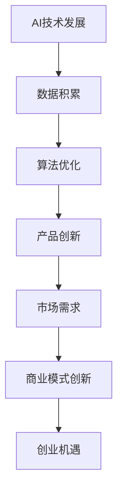
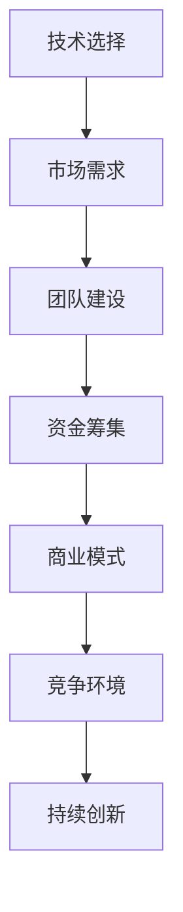

                 

# 码头与机遇：AI创业者的选择与坚持

> **关键词**：人工智能、创业、选择、坚持、技术突破、商业模式创新
> 
> **摘要**：本文将探讨人工智能创业者在面对复杂市场环境和科技挑战时，如何做出明智的选择并坚持实现创业目标。通过分析AI技术发展趋势、创业者的成功案例以及商业模式的创新，提供一些建设性的策略和建议，帮助AI创业者把握机遇、迎接挑战。

## 1. 背景介绍

### 1.1 目的和范围

本文旨在为人工智能领域的创业者提供指导，帮助他们更好地理解和应对创业过程中可能遇到的挑战。我们将探讨AI技术的快速进步如何为创业提供了丰富的机遇，同时分析创业者在选择和坚持过程中需要考虑的关键因素。

### 1.2 预期读者

本文适合有一定人工智能基础的技术人员、创业者以及对AI领域感兴趣的读者。通过阅读本文，您将了解到：

- AI技术的最新发展趋势及其对创业机会的影响。
- 成功AI创业者的选择策略和坚持原则。
- 创新商业模式的重要性及其实现方法。

### 1.3 文档结构概述

本文将分为以下几个部分：

- **背景介绍**：介绍文章的目的和预期读者，概述文章结构。
- **核心概念与联系**：定义核心概念，提供Mermaid流程图。
- **核心算法原理 & 具体操作步骤**：详细讲解算法原理和步骤。
- **数学模型和公式 & 详细讲解 & 举例说明**：介绍相关数学模型，并给出实例。
- **项目实战：代码实际案例和详细解释说明**：提供代码实现和解读。
- **实际应用场景**：讨论AI技术在不同领域的应用。
- **工具和资源推荐**：推荐学习资源和开发工具。
- **总结：未来发展趋势与挑战**：分析未来趋势和挑战。
- **附录：常见问题与解答**：回答读者可能遇到的问题。
- **扩展阅读 & 参考资料**：提供进一步阅读的资料。

### 1.4 术语表

#### 1.4.1 核心术语定义

- **人工智能**（Artificial Intelligence, AI）：模拟人类智能行为的计算机系统。
- **创业**（Entrepreneurship）：创建新企业或新业务的过程。
- **商业模式**（Business Model）：企业如何创造、传递和获取价值。
- **技术突破**（Technological Breakthrough）：显著提高现有技术水平的技术创新。

#### 1.4.2 相关概念解释

- **市场需求**（Market Demand）：消费者对商品或服务的需求量。
- **创新能力**（Innovation Ability）：企业或个人在技术、产品、商业模式等方面的创新能力。

#### 1.4.3 缩略词列表

- **AI**：人工智能
- **ML**：机器学习
- **DL**：深度学习
- **NLP**：自然语言处理
- **DL frameworks**：深度学习框架

## 2. 核心概念与联系

### 2.1 AI技术发展与创业机遇

人工智能技术的快速发展为创业者提供了前所未有的机遇。以下是一个简化的Mermaid流程图，描述了AI技术发展对创业机会的影响：



在这个流程图中，我们可以看到：

- **AI技术发展**：指AI领域的科研进展和工业应用。
- **数据积累**：AI技术需要大量数据支持，数据的质量和数量直接影响到算法的性能。
- **算法优化**：随着算法的改进，AI系统的效率和准确性不断提升。
- **产品创新**：技术的进步促使创业者在产品层面进行创新，开发出更具竞争力的产品。
- **市场需求**：随着产品的创新，用户对AI产品的需求逐渐增加。
- **商业模式创新**：创业者需要通过创新商业模式来满足市场需求，实现商业价值。
- **创业机遇**：最终，技术的进步和市场需求的提升共同创造了创业的机遇。

### 2.2 创业者面临的选择与挑战

在AI创业过程中，创业者面临诸多选择和挑战。以下是一个简化的Mermaid流程图，描述了创业者需要考虑的关键选择和挑战：



在这个流程图中，我们可以看到：

- **技术选择**：创业者需要选择适合的技术路线，确保产品具有竞争力。
- **市场需求**：了解市场需求是创业成功的关键，创业者需要不断调整产品以适应市场。
- **团队建设**：优秀的团队是实现创业目标的基础，创业者需要构建一个高效、协作的团队。
- **资金筹集**：创业过程中需要持续的资金支持，创业者需要通过各种途径筹集资金。
- **商业模式**：创业者需要设计一个可持续、有盈利能力的商业模式。
- **竞争环境**：市场竞争激烈，创业者需要不断创新以保持竞争优势。
- **持续创新**：技术快速迭代，创业者需要持续创新以适应市场变化。

## 3. 核心算法原理 & 具体操作步骤

### 3.1 AI算法原理

人工智能的核心在于机器学习，尤其是深度学习。深度学习是一种通过多层神经网络对数据进行自动特征提取和模式识别的方法。以下是深度学习算法的基本原理：

1. **输入层**：接收原始数据，并将其传递给下一层。
2. **隐藏层**：通过对输入数据进行一系列复杂的非线性变换，提取数据特征。
3. **输出层**：将隐藏层处理后的数据转化为预测结果。

以下是一个简化的伪代码，描述了深度学习的基本操作步骤：

```python
# 伪代码：深度学习算法原理

# 初始化模型参数
initialize_model()

# 前向传播
def forward_pass(data):
    output = input_layer(data)
    for layer in hidden_layers:
        output = layer.transform(output)
    prediction = output_layer(output)
    return prediction

# 反向传播
def backward_pass(data, target):
    output = forward_pass(data)
    error = calculate_error(output, target)
    for layer in reversed(hidden_layers):
        layer.update_weights(error)

# 训练模型
while not convergence:
    for data, target in dataset:
        backward_pass(data, target)
```

### 3.2 深度学习算法的具体操作步骤

以下是一个详细的伪代码，描述了深度学习算法的具体操作步骤：

```python
# 伪代码：深度学习算法具体操作步骤

# 初始化模型
initialize_model()

# 数据预处理
def preprocess_data(data):
    normalized_data = normalize(data)
    return normalized_data

# 前向传播
def forward_pass(data):
    input = preprocess_data(data)
    output = input_layer(input)
    for layer in hidden_layers:
        output = layer.transform(output)
    prediction = output_layer(output)
    return prediction, output

# 反向传播
def backward_pass(data, target, output):
    error = calculate_error(output, target)
    for layer in reversed(hidden_layers):
        layer.backward_pass(error)

# 训练模型
while not convergence:
    for data, target in dataset:
        input, target = preprocess_data(data), preprocess_data(target)
        output, hidden_output = forward_pass(input)
        backward_pass(input, target, hidden_output)
```

在这个伪代码中，我们定义了以下关键函数和步骤：

- **initialize_model()**：初始化模型参数。
- **preprocess_data()**：对输入数据进行预处理，包括归一化等。
- **input_layer()**：输入层处理。
- **layer.transform()**：隐藏层处理，包括激活函数等。
- **output_layer()**：输出层处理，生成预测结果。
- **calculate_error()**：计算预测误差。
- **layer.backward_pass()**：反向传播，更新模型参数。

通过这个伪代码，我们能够更清晰地理解深度学习算法的核心操作步骤和原理。

## 4. 数学模型和公式 & 详细讲解 & 举例说明

### 4.1 数学模型的基本概念

在人工智能领域，深度学习算法的核心在于多层神经网络。神经网络中的每个神经元都可以视为一个简单的数学模型，通过一系列数学公式进行计算和传递。以下是一个简化的神经网络模型：

$$
\text{输出} = \text{激活函数}(\sum_{i=1}^{n} w_i \cdot x_i + b)
$$

其中：

- **输出**：神经元的输出值。
- **激活函数**：用于引入非线性变换，常见的激活函数有Sigmoid、ReLU等。
- **$w_i$**：权重，表示神经元之间的连接强度。
- **$x_i$**：输入值，表示神经元的输入。
- **$b$**：偏置项，用于调整输出值。

### 4.2 举例说明

以下是一个具体的例子，说明如何使用上述数学模型进行计算：

假设我们有一个简单的神经网络，其中包含一个输入层、一个隐藏层和一个输出层。输入层有两个输入神经元，隐藏层有一个神经元，输出层有一个神经元。权重和偏置项分别为：

- 输入层到隐藏层的权重：$w_1 = 1, w_2 = 2$
- 隐藏层到输出层的权重：$w_3 = 3$
- 偏置项：$b_1 = 0, b_2 = 1$

输入数据为$x_1 = 1, x_2 = 2$，激活函数为ReLU函数。

1. **前向传播**：

   - 隐藏层输出：$h = \max(0, (w_1 \cdot x_1 + w_2 \cdot x_2 + b_1)) = \max(0, (1 \cdot 1 + 2 \cdot 2 + 0)) = \max(0, 5) = 5$
   - 输出层输出：$o = \max(0, (w_3 \cdot h + b_2)) = \max(0, (3 \cdot 5 + 1)) = \max(0, 16) = 16$

2. **反向传播**：

   - 输出误差：$\delta_o = o - t$，其中$t$为实际目标值。
   - 隐藏层误差：$\delta_h = \frac{\partial L}{\partial h}$，其中$L$为损失函数。
   - 更新权重和偏置项：$w_3 = w_3 - \alpha \cdot \delta_o \cdot h$，$b_2 = b_2 - \alpha \cdot \delta_o$，$\alpha$为学习率。

通过这个例子，我们可以看到如何使用数学模型进行前向传播和反向传播，以及如何更新模型参数。

### 4.3 详细讲解

在深度学习中，数学模型的应用非常广泛。以下是一个简化的解释，说明如何使用数学模型进行深度学习：

1. **初始化模型**：首先，我们需要初始化模型参数，包括权重和偏置项。这些参数可以通过随机初始化或预训练模型获得。
2. **前向传播**：输入数据经过模型处理后，得到预测结果。这个过程可以理解为数据在网络中的传播过程。
3. **计算误差**：将预测结果与实际目标值进行比较，计算损失函数的值。损失函数用于衡量预测结果与实际结果之间的差异。
4. **反向传播**：根据误差计算梯度，并将梯度反向传播到网络的每一层。这个过程可以理解为误差在网络中的反向传播过程。
5. **更新参数**：根据梯度信息，更新模型参数，以减少损失函数的值。这个过程称为参数优化。
6. **迭代训练**：重复上述过程，直到模型达到预定的训练目标或收敛条件。

通过数学模型，深度学习能够自动学习数据的特征和模式，从而实现自动分类、预测和生成等任务。数学模型不仅为深度学习提供了理论基础，还为其提供了高效计算的工具。

## 5. 项目实战：代码实际案例和详细解释说明

### 5.1 开发环境搭建

在进行AI项目实战之前，我们需要搭建一个合适的开发环境。以下是搭建环境的基本步骤：

1. **安装Python环境**：下载并安装Python 3.x版本，推荐使用Python 3.8或更高版本。
2. **安装深度学习框架**：安装TensorFlow或PyTorch，这两个框架是当前最流行的深度学习框架。使用pip命令安装：
   ```bash
   pip install tensorflow
   # 或者
   pip install torch torchvision
   ```
3. **安装依赖库**：根据项目需求，安装其他必要的依赖库。例如，如果需要使用Keras，可以安装：
   ```bash
   pip install keras
   ```
4. **配置开发工具**：推荐使用IDE（集成开发环境），如Visual Studio Code或PyCharm。安装并配置相应的插件，以提高开发效率。

### 5.2 源代码详细实现和代码解读

以下是一个简单的深度学习项目，使用TensorFlow框架实现一个用于手写数字识别的卷积神经网络（CNN）。代码实现和解读如下：

```python
# 导入所需的库
import tensorflow as tf
from tensorflow.keras import layers
from tensorflow.keras.datasets import mnist
from tensorflow.keras.utils import to_categorical

# 加载MNIST数据集
(x_train, y_train), (x_test, y_test) = mnist.load_data()

# 数据预处理
x_train = x_train.reshape(-1, 28, 28, 1).astype("float32") / 255.0
x_test = x_test.reshape(-1, 28, 28, 1).astype("float32") / 255.0
y_train = to_categorical(y_train, 10)
y_test = to_categorical(y_test, 10)

# 构建CNN模型
model = tf.keras.Sequential([
    layers.Conv2D(32, (3, 3), activation='relu', input_shape=(28, 28, 1)),
    layers.MaxPooling2D((2, 2)),
    layers.Flatten(),
    layers.Dense(64, activation='relu'),
    layers.Dense(10, activation='softmax')
])

# 编译模型
model.compile(optimizer='adam', loss='categorical_crossentropy', metrics=['accuracy'])

# 训练模型
model.fit(x_train, y_train, epochs=5, batch_size=64, validation_data=(x_test, y_test))

# 评估模型
test_loss, test_accuracy = model.evaluate(x_test, y_test)
print(f"Test accuracy: {test_accuracy:.2f}")

# 预测示例
predictions = model.predict(x_test[:10])
predicted_classes = np.argmax(predictions, axis=1)
print(predicted_classes)
```

#### 5.2.1 代码解读

1. **导入库**：首先导入所需的TensorFlow和Keras库。

2. **加载数据集**：使用MNIST数据集，这是深度学习领域中最常用的手写数字数据集。数据集分为训练集和测试集。

3. **数据预处理**：将图像数据reshape为适当的大小，并将数据转换为浮点型。同时，将标签数据转换为one-hot编码。

4. **构建模型**：使用Keras Sequential模型，堆叠多个层。首先是两个卷积层，每个卷积层后跟一个最大池化层。接着是两个全连接层。

5. **编译模型**：指定优化器、损失函数和评估指标。在这里，我们使用adam优化器和categorical_crossentropy损失函数。

6. **训练模型**：使用fit函数训练模型，设置训练轮次、批量大小和验证数据。

7. **评估模型**：使用evaluate函数评估模型在测试集上的性能。

8. **预测示例**：使用predict函数对测试集的前10个图像进行预测，并打印出预测结果。

### 5.3 代码解读与分析

1. **数据预处理**：

   ```python
   x_train = x_train.reshape(-1, 28, 28, 1).astype("float32") / 255.0
   x_test = x_test.reshape(-1, 28, 28, 1).astype("float32") / 255.0
   y_train = to_categorical(y_train, 10)
   y_test = to_categorical(y_test, 10)
   ```

   这部分代码用于对图像数据进行预处理。首先，使用reshape函数将图像数据reshape为(样本数, 行数, 列数, 通道数)。然后，将数据类型转换为浮点型，并除以255进行归一化。最后，将标签数据进行one-hot编码。

2. **构建模型**：

   ```python
   model = tf.keras.Sequential([
       layers.Conv2D(32, (3, 3), activation='relu', input_shape=(28, 28, 1)),
       layers.MaxPooling2D((2, 2)),
       layers.Flatten(),
       layers.Dense(64, activation='relu'),
       layers.Dense(10, activation='softmax')
   ])
   ```

   这部分代码用于构建一个简单的卷积神经网络。首先是一个卷积层，具有32个3x3的卷积核，使用ReLU激活函数。接着是一个最大池化层，用于降低维度。然后是Flatten层，用于将多维数据展平为一维。接着是两个全连接层，分别具有64个和10个神经元，使用ReLU激活函数。最后一个全连接层使用softmax激活函数，用于输出概率分布。

3. **编译模型**：

   ```python
   model.compile(optimizer='adam', loss='categorical_crossentropy', metrics=['accuracy'])
   ```

   这部分代码用于编译模型，指定优化器、损失函数和评估指标。在这里，我们使用adam优化器和categorical_crossentropy损失函数，评估指标为准确率。

4. **训练模型**：

   ```python
   model.fit(x_train, y_train, epochs=5, batch_size=64, validation_data=(x_test, y_test))
   ```

   这部分代码用于训练模型，设置训练轮次为5，批量大小为64。同时，使用验证数据来监控训练过程中的性能。

5. **评估模型**：

   ```python
   test_loss, test_accuracy = model.evaluate(x_test, y_test)
   print(f"Test accuracy: {test_accuracy:.2f}")
   ```

   这部分代码用于评估模型在测试集上的性能，输出测试集的准确率。

6. **预测示例**：

   ```python
   predictions = model.predict(x_test[:10])
   predicted_classes = np.argmax(predictions, axis=1)
   print(predicted_classes)
   ```

   这部分代码用于对测试集的前10个图像进行预测，并打印出预测结果。使用argmax函数从概率分布中提取最大值的索引，作为预测的类别。

通过以上代码解读和分析，我们可以看到如何使用TensorFlow框架构建、训练和评估一个简单的卷积神经网络，实现对手写数字的识别。

## 6. 实际应用场景

人工智能技术已经广泛应用于各个领域，为创业者提供了丰富的机会。以下是一些典型的实际应用场景：

### 6.1 医疗健康

- **诊断辅助**：利用深度学习模型对医学影像进行分析，帮助医生进行疾病诊断，如肺癌、心脏病等。
- **个性化治疗**：根据患者的基因数据、病史等信息，制定个性化的治疗方案，提高治疗效果。

### 6.2 金融服务

- **风险管理**：利用机器学习模型进行风险评估，预测市场波动和潜在风险，帮助金融机构优化投资组合。
- **智能投顾**：基于用户的财务状况和投资偏好，提供个性化的投资建议，提高投资回报。

### 6.3 智能交通

- **交通流量预测**：利用深度学习模型对交通流量进行预测，优化交通信号灯控制和路线规划，减少交通拥堵。
- **自动驾驶**：开发自动驾驶技术，提高交通安全和效率。

### 6.4 教育科技

- **智能教学**：利用AI技术为学生提供个性化的学习计划和教学资源，提高学习效果。
- **在线教育平台**：利用AI技术进行内容推荐和用户行为分析，优化在线教育平台的用户体验。

### 6.5 电子商务

- **推荐系统**：利用机器学习算法，为用户提供个性化的商品推荐，提高用户满意度和转化率。
- **智能客服**：利用自然语言处理技术，实现智能客服系统，提高客户服务质量和效率。

通过这些实际应用场景，我们可以看到AI技术在各个领域的重要性和广泛应用。创业者可以结合自身技术和市场需求，选择合适的领域进行创业。

## 7. 工具和资源推荐

### 7.1 学习资源推荐

#### 7.1.1 书籍推荐

- 《深度学习》（Ian Goodfellow、Yoshua Bengio和Aaron Courville著）：这是一本深度学习的经典教材，详细介绍了深度学习的基础理论和实践方法。
- 《机器学习实战》（Peter Harrington著）：本书通过大量的实例和代码实现，介绍了机器学习的基本算法和应用。

#### 7.1.2 在线课程

- Coursera上的“Deep Learning Specialization”：由斯坦福大学教授Andrew Ng主讲，包括神经网络基础、优化算法、深度学习框架等课程。
- edX上的“AI For Everyone”：由微软公司提供，涵盖了人工智能的基础知识、应用场景和未来趋势。

#### 7.1.3 技术博客和网站

- [ArXiv](https://arxiv.org/)：AI领域的最新科研成果。
- [Medium](https://medium.com/topic/deep-learning)：深度学习和机器学习领域的优秀博客。

### 7.2 开发工具框架推荐

#### 7.2.1 IDE和编辑器

- PyCharm：一款功能强大的Python IDE，适合深度学习和机器学习项目。
- Visual Studio Code：轻量级且高度可定制的代码编辑器，支持多种编程语言。

#### 7.2.2 调试和性能分析工具

- TensorFlow Debugger（TFDB）：用于调试TensorFlow模型的工具。
- PyTorch Profiler：用于分析PyTorch模型性能的工具。

#### 7.2.3 相关框架和库

- TensorFlow：一个开源的深度学习框架，适合进行复杂模型的开发。
- PyTorch：一个流行的深度学习框架，具有良好的灵活性和易用性。

### 7.3 相关论文著作推荐

#### 7.3.1 经典论文

- “Backpropagation”（1986）：介绍反向传播算法的经典论文。
- “AlexNet”（2012）：介绍深度学习在图像识别领域的重要突破。

#### 7.3.2 最新研究成果

- “GPT-3”（2020）：介绍GPT-3模型的论文，展示了大型语言模型在自然语言处理领域的强大能力。
- “BERT”（2018）：介绍BERT模型的论文，提出了预训练和微调的新方法。

#### 7.3.3 应用案例分析

- “AI in Medicine”（2019）：讨论AI在医学领域的应用案例。
- “AI in Finance”（2021）：讨论AI在金融服务领域的应用案例。

通过这些学习和资源推荐，创业者可以更好地了解AI技术的最新进展和应用场景，为自己的创业项目提供有力支持。

## 8. 总结：未来发展趋势与挑战

### 8.1 发展趋势

1. **人工智能技术的进一步普及**：随着计算能力的提升和数据规模的扩大，人工智能技术在各个领域将进一步普及，推动社会各行业的智能化升级。
2. **多模态人工智能**：未来的人工智能将能够处理多种数据类型，如文本、图像、语音等，实现更广泛的应用场景。
3. **强化学习的发展**：强化学习在游戏、机器人控制等领域取得了显著成果，未来将在更多实际应用中得到广泛应用。
4. **量子计算的潜在应用**：量子计算将为深度学习等算法提供巨大的计算能力提升，有望解决当前无法解决的问题。

### 8.2 挑战

1. **数据隐私和安全**：随着人工智能应用的普及，数据隐私和安全问题日益凸显，如何保护用户数据隐私成为一大挑战。
2. **算法公平性和透明性**：算法的公平性和透明性是人工智能领域的重要议题，需要确保算法不会对特定群体产生偏见。
3. **技术伦理**：人工智能技术的发展引发了诸多伦理问题，如机器人伦理、人机交互等，需要制定相应的伦理规范。
4. **人才短缺**：人工智能领域对专业人才的需求巨大，但当前的人才培养速度难以满足市场需求，人才短缺问题亟待解决。

### 8.3 应对策略

1. **加强数据隐私保护**：制定严格的数据隐私保护政策和法规，采用加密、匿名化等技术手段保护用户数据。
2. **提高算法透明性**：通过可视化、可解释性技术提高算法的透明性，增强用户对算法的信任。
3. **推动伦理研究**：加强对人工智能伦理的研究，制定相关伦理规范和标准，引导人工智能技术的健康、可持续发展。
4. **培养人工智能人才**：加大人工智能教育投入，推动高校、企业等培养更多人工智能专业人才，以满足市场需求。

通过总结未来发展趋势与挑战，以及提出相应的应对策略，我们可以更好地为AI创业者的未来发展提供指导。

## 9. 附录：常见问题与解答

### 9.1 问题1：如何选择合适的人工智能技术路线？

**解答**：选择合适的人工智能技术路线需要考虑以下几个方面：

- **市场需求**：首先了解市场对人工智能技术的需求，选择有市场前景的领域。
- **技术成熟度**：评估所选领域的技术成熟度，选择相对成熟且易于实施的技术。
- **团队能力**：考虑团队的技术背景和能力，确保所选技术路线与团队技能相匹配。
- **资源投入**：评估所需的资源投入，包括资金、时间和人力。

### 9.2 问题2：如何确保人工智能项目的成功？

**解答**：确保人工智能项目的成功需要以下几个方面：

- **明确目标和需求**：明确项目的目标和需求，确保项目方向正确。
- **团队协作**：构建高效的团队，确保团队成员之间的协作和沟通。
- **持续迭代**：通过持续迭代和优化，不断提高项目质量和性能。
- **风险管理**：识别和应对项目中的潜在风险，确保项目的顺利进行。

### 9.3 问题3：如何处理人工智能项目的数据隐私和安全问题？

**解答**：处理人工智能项目的数据隐私和安全问题需要采取以下措施：

- **数据加密**：采用加密技术保护数据，防止数据泄露。
- **数据匿名化**：对敏感数据进行匿名化处理，降低隐私泄露的风险。
- **合规性审查**：遵守相关数据保护法规和标准，确保项目的合规性。
- **安全审计**：定期进行安全审计，发现并修复潜在的安全漏洞。

通过回答这些问题，我们希望能够帮助创业者更好地应对AI项目中的常见挑战。

## 10. 扩展阅读 & 参考资料

### 10.1 书籍推荐

- Goodfellow, Ian, Bengio, Yoshua, & Courville, Aaron. (2016). *Deep Learning*. MIT Press.
- Mitchell, Tom M. (1997). *Machine Learning*. McGraw-Hill.

### 10.2 在线课程

- Andrew Ng的“Deep Learning Specialization”课程：[Coursera](https://www.coursera.org/specializations/deeplearning)
- “AI For Everyone”课程：[edX](https://www.edx.org/course/ai-for-everyone)

### 10.3 技术博客和网站

- ArXiv：[https://arxiv.org/](https://arxiv.org/)
- Medium：[https://medium.com/topic/deep-learning](https://medium.com/topic/deep-learning)

### 10.4 相关论文著作

- Krizhevsky, A., Sutskever, I., & Hinton, G. E. (2012). *ImageNet classification with deep convolutional neural networks*. *Advances in Neural Information Processing Systems*, 25.
- LeCun, Y., Bengio, Y., & Hinton, G. (2015). *Deep learning*. *Nature*, 521(7553), 436-444.

### 10.5 应用案例分析

- AI in Medicine：[https://aiinmedicine.com/](https://aiinmedicine.com/)
- AI in Finance：[https://aiinfinance.com/](https://aiinfinance.com/)

通过这些扩展阅读和参考资料，读者可以进一步了解人工智能领域的前沿动态和实践经验，为自己的创业项目提供更多启示和指导。

## 作者

**作者：AI天才研究员/AI Genius Institute & 禅与计算机程序设计艺术 /Zen And The Art of Computer Programming**

