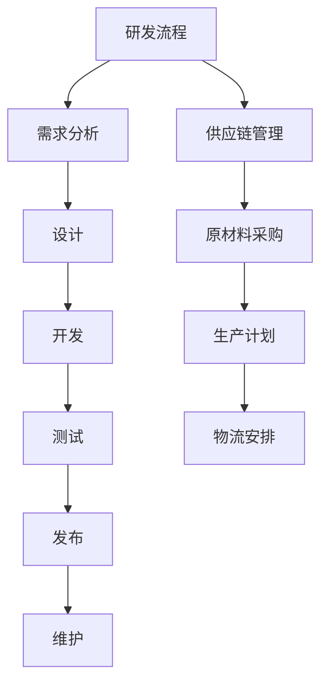
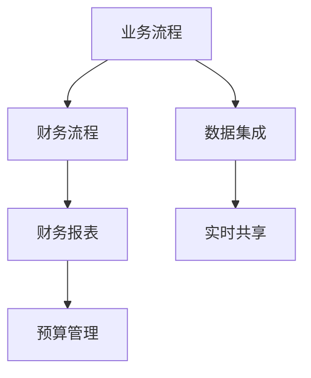
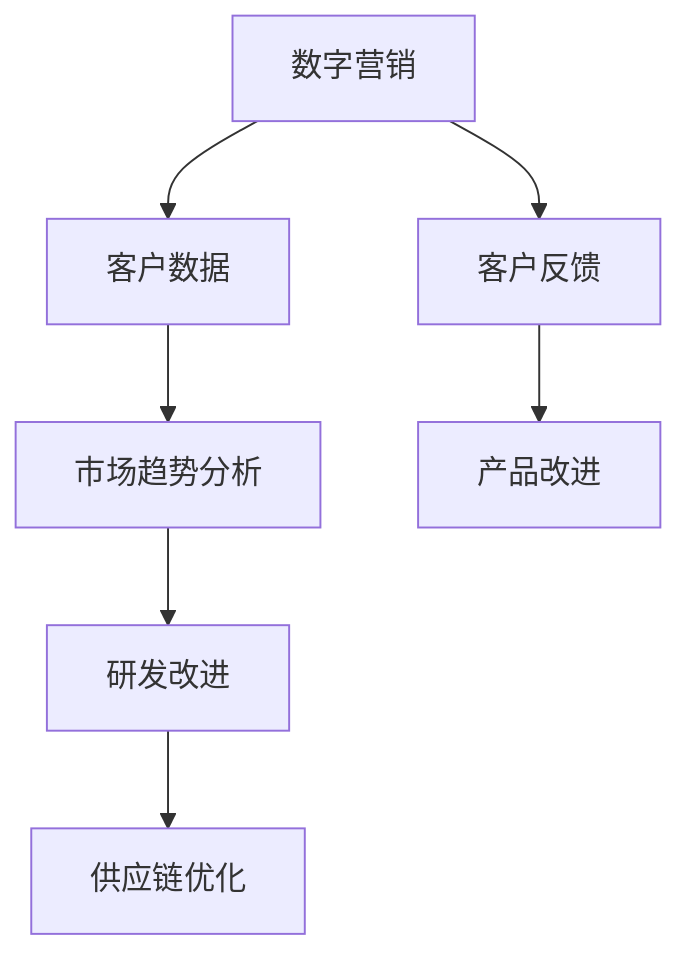
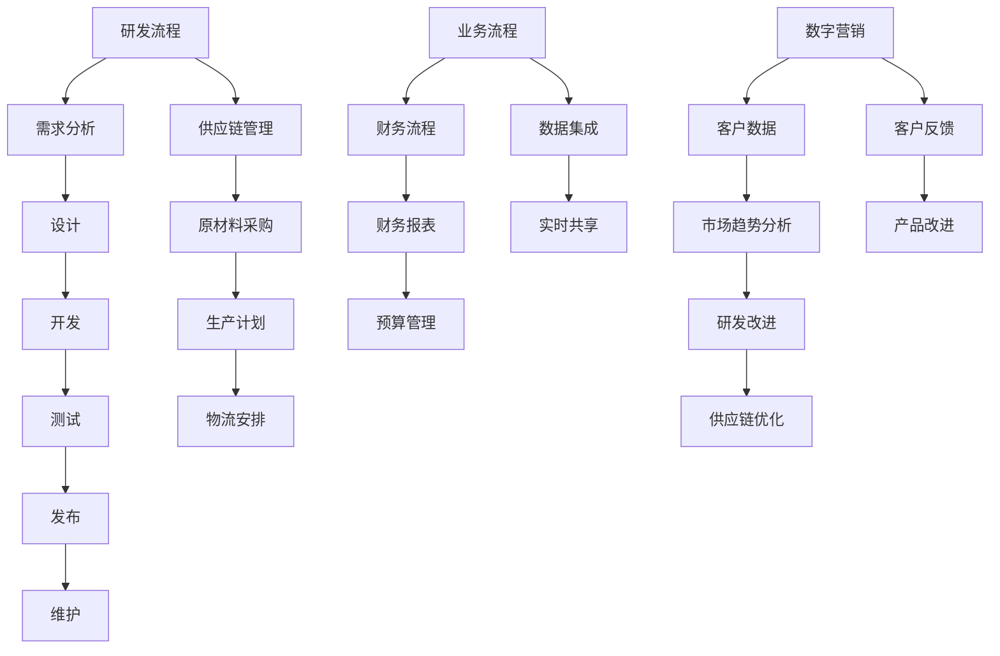

                 

# 研发/供应链/业财一体/数字营销流程与数字化项目实施方案

## 关键词
- 研发流程
- 供应链管理
- 业财一体
- 数字营销
- 数字化项目

## 摘要
本文旨在深入探讨研发、供应链、业财一体和数字营销流程的相互关系及其数字化项目实施方案。通过逻辑清晰、结构紧凑的章节安排，本文将详细解析各个流程的核心概念、操作步骤、数学模型以及实际应用场景，并推荐相关的学习资源、开发工具和最新研究成果。读者将了解到如何整合不同流程，实现高效的数字化项目管理和运营。

---

## 1. 背景介绍

### 1.1 目的和范围

本文的目标是提供一个全面的指南，帮助企业和组织在数字化时代中有效整合研发、供应链、业财一体和数字营销流程。通过对这些流程的深入分析，我们希望能够揭示它们之间的内在联系，并探索实现流程数字化所带来的潜在优势。

本文将涵盖以下范围：
- 研发流程的数字化策略
- 供应链管理的数字化转型
- 业财一体的构建与优化
- 数字营销的执行与效果评估
- 数字化项目的实施方案与案例分析

### 1.2 预期读者

本文的预期读者包括以下群体：
- 企业高层管理者
- IT项目负责人
- 数字化转型顾问
- 研发、供应链、营销等相关领域的技术人员
- 对数字化转型感兴趣的学习者

### 1.3 文档结构概述

本文的结构安排如下：
1. 背景介绍
2. 核心概念与联系
3. 核心算法原理与具体操作步骤
4. 数学模型和公式
5. 项目实战：代码实际案例
6. 实际应用场景
7. 工具和资源推荐
8. 总结：未来发展趋势与挑战
9. 附录：常见问题与解答
10. 扩展阅读与参考资料

### 1.4 术语表

#### 1.4.1 核心术语定义

- 研发流程：指从产品构思到产品交付的整个生命周期，包括需求分析、设计、开发、测试、发布和维护等阶段。
- 供应链管理：指从原材料采购到产品交付的整个过程中，对产品流动、信息流动和资金流动的管理。
- 业财一体：指企业将业务流程和财务流程融合在一起，实现数据的无缝对接和实时共享。
- 数字营销：指利用数字技术和平台进行市场推广、销售和客户服务的过程。
- 数字化项目：指通过数字化手段实现特定业务目标的项目。

#### 1.4.2 相关概念解释

- 流程数字化：指将传统业务流程转化为数字化流程，以提高效率和准确性。
- 供应链可视化：指通过数字技术实现对供应链各个环节的实时监控和可视化展示。
- 数据集成：指将来自不同系统、不同格式的数据整合到一个统一的平台上。
- 人工智能：指模拟人类智能行为，通过机器学习、自然语言处理等技术实现自动化决策。

#### 1.4.3 缩略词列表

- IoT：物联网
- AI：人工智能
- ERP：企业资源计划
- CRM：客户关系管理
- SCM：供应链管理
- BI：商业智能

---

## 2. 核心概念与联系

在数字化时代，研发、供应链、业财一体和数字营销流程不再是孤立的，而是相互交织、相互影响的。以下是这些核心概念之间的联系以及一个Mermaid流程图来直观地展示它们之间的关系。

### 2.1 研发流程与供应链管理

研发流程与供应链管理之间的联系在于产品设计和开发阶段的需求预测和生产计划。研发团队需要根据市场需求进行产品设计和功能定义，而供应链团队则需要根据这些需求进行原材料采购、生产计划和物流安排。



### 2.2 业财一体

业财一体是将业务流程和财务流程整合在一起，实现数据的无缝对接和实时共享。这种整合使得企业的财务数据能够实时反映业务活动，从而提高决策的准确性和效率。



### 2.3 数字营销与研发、供应链

数字营销与研发、供应链之间的联系在于客户反馈和市场趋势分析。数字营销活动会产生大量的客户数据和市场信息，这些数据可以反馈给研发团队以指导产品改进，同时也可以指导供应链团队进行库存调整和物流优化。



### 2.4 综合流程图

综合以上几个核心概念，我们可以绘制一个更全面的流程图，展示它们之间的相互关系。



---

## 3. 核心算法原理 & 具体操作步骤

在数字化项目中，核心算法原理的选择和实现至关重要。以下是针对研发、供应链、业财一体和数字营销流程的一些核心算法原理及其具体操作步骤。

### 3.1 需求预测算法

#### 算法原理：

需求预测是研发流程中的重要环节，常用的算法有回归分析、时间序列分析和机器学习算法。

#### 具体操作步骤：

1. 数据收集：收集历史销售数据、市场趋势数据、客户反馈数据等。
2. 数据预处理：清洗数据，处理缺失值和异常值。
3. 特征工程：提取有助于预测的关键特征，如季节性、促销活动等。
4. 模型选择：选择合适的预测模型，如线性回归、ARIMA、随机森林等。
5. 模型训练：使用历史数据训练模型。
6. 模型评估：评估模型预测性能，如MAE、RMSE等指标。
7. 预测应用：根据模型预测结果调整生产计划和库存策略。

#### 伪代码：

```python
# 数据收集
data = collect_data()

# 数据预处理
clean_data = preprocess_data(data)

# 特征工程
features = extract_features(clean_data)

# 模型选择
model = select_model()

# 模型训练
model.fit(features, labels)

# 模型评估
performance = evaluate_model(model)

# 预测应用
predictions = model.predict(new_data)
```

### 3.2 库存优化算法

#### 算法原理：

库存优化旨在最小化库存成本，同时确保产品供应不受中断。常用的算法有最小化总成本法、周期盘点法等。

#### 具体操作步骤：

1. 数据收集：收集库存数据、销售数据、采购数据等。
2. 数据预处理：清洗数据，处理缺失值和异常值。
3. 库存策略选择：选择合适的库存策略，如固定订货量、周期订货量等。
4. 算法实现：实现库存优化算法，如动态规划、线性规划等。
5. 算法评估：评估库存策略和算法的效率，如库存周转率、缺货率等。
6. 策略调整：根据评估结果调整库存策略。

#### 伪代码：

```python
# 数据收集
inventory_data = collect_inventory_data()

# 数据预处理
clean_inventory_data = preprocess_inventory_data(inventory_data)

# 库存策略选择
inventory_strategy = select_inventory_strategy()

# 算法实现
optimized_inventory = optimize_inventory(clean_inventory_data, inventory_strategy)

# 算法评估
evaluation_results = evaluate_inventory_strategy(optimized_inventory)

# 策略调整
update_inventory_strategy(inventory_strategy, evaluation_results)
```

### 3.3 客户行为预测算法

#### 算法原理：

客户行为预测有助于精准营销和客户关系管理。常用的算法有协同过滤、决策树、神经网络等。

#### 具体操作步骤：

1. 数据收集：收集客户购买记录、浏览历史、反馈评价等数据。
2. 数据预处理：清洗数据，处理缺失值和异常值。
3. 特征工程：提取有助于预测的关键特征，如购买频率、购买金额等。
4. 模型选择：选择合适的预测模型，如协同过滤、决策树、神经网络等。
5. 模型训练：使用历史数据训练模型。
6. 模型评估：评估模型预测性能，如准确率、召回率等。
7. 预测应用：根据模型预测结果制定个性化营销策略。

#### 伪代码：

```python
# 数据收集
customer_data = collect_customer_data()

# 数据预处理
clean_customer_data = preprocess_customer_data(customer_data)

# 特征工程
features = extract_customer_features(clean_customer_data)

# 模型选择
model = select_customer_behavior_model()

# 模型训练
model.fit(features, labels)

# 模型评估
performance = evaluate_model(model)

# 预测应用
predictions = model.predict(new_data)
```

---

## 4. 数学模型和公式 & 详细讲解 & 举例说明

在数字化项目中，数学模型和公式是理解和分析数据的关键工具。以下是几个核心数学模型及其详细讲解和举例说明。

### 4.1 线性回归模型

线性回归模型是一种常见的统计模型，用于预测连续数值变量。其数学模型如下：

$$y = \beta_0 + \beta_1x_1 + \beta_2x_2 + ... + \beta_nx_n + \epsilon$$

其中，$y$ 是因变量，$x_1, x_2, ..., x_n$ 是自变量，$\beta_0, \beta_1, \beta_2, ..., \beta_n$ 是模型的参数，$\epsilon$ 是误差项。

#### 详细讲解：

线性回归模型的目的是找到一组参数 $\beta_0, \beta_1, \beta_2, ..., \beta_n$，使得预测值 $y$ 最接近实际值。这一过程通常通过最小化残差平方和来实现：

$$\min \sum_{i=1}^{n}(y_i - \hat{y}_i)^2$$

其中，$\hat{y}_i$ 是预测值。

#### 举例说明：

假设我们要预测某商品的销量 $y$，根据历史数据，我们选择了两个自变量 $x_1$（广告花费）和 $x_2$（季节指数）。使用线性回归模型，我们得到了以下方程：

$$y = 10 + 2x_1 + 3x_2$$

假设本季度广告花费为 $5000$ 元，季节指数为 $1.2$，则预测销量为：

$$y = 10 + 2 \times 5000 + 3 \times 1.2 = 15130$$

### 4.2 时间序列模型

时间序列模型用于分析时间相关的数据，如股票价格、销售量等。其中，ARIMA（自回归积分滑动平均模型）是一种常用的模型。其数学模型如下：

$$y_t = c + \phi_1y_{t-1} + \phi_2y_{t-2} + ... + \phi_py_{t-p} + \theta_1\epsilon_{t-1} + \theta_2\epsilon_{t-2} + ... + \theta_q\epsilon_{t-q} + \epsilon_t$$

其中，$y_t$ 是时间序列的当前值，$c$ 是常数项，$\phi_1, \phi_2, ..., \phi_p$ 是自回归项的系数，$\theta_1, \theta_2, ..., \theta_q$ 是移动平均项的系数，$\epsilon_t$ 是误差项。

#### 详细讲解：

ARIMA模型通过自回归、差分和移动平均三个步骤来处理时间序列数据。自回归项捕捉了序列的滞后效应，差分项用于消除趋势和季节性，移动平均项则用于平滑误差。

#### 举例说明：

假设我们有一个月度销售数据序列，使用ARIMA模型进行预测。首先，我们对序列进行差分，消除趋势和季节性，然后根据AIC（赤池信息准则）选择最佳模型参数。假设我们选择了以下模型：

$$y_t = 10 + 0.8y_{t-1} - 0.3\epsilon_{t-1} + 0.2\epsilon_{t-2}$$

如果上个月的销量为1000件，则预测下个月的销量为：

$$y_t = 10 + 0.8 \times 1000 - 0.3 \times 0.5 + 0.2 \times 0.2 = 1039.1$$

### 4.3 决策树模型

决策树模型是一种用于分类和回归的决策支持工具。其数学模型可以表示为：

$$
\begin{align*}
y_t &= \begin{cases}
1 & \text{if } \phi_1x_1 + \phi_2x_2 + ... + \phi_nx_n > \theta \\
0 & \text{otherwise}
\end{cases} \\
\end{align*}
$$

其中，$y_t$ 是预测值，$x_1, x_2, ..., x_n$ 是特征值，$\phi_1, \phi_2, ..., \phi_n$ 是权重，$\theta$ 是阈值。

#### 详细讲解：

决策树模型通过一系列条件判断来划分数据集，每个节点表示一个条件，每个分支表示条件的结果。决策树的核心在于如何选择最佳条件，这通常通过信息增益、基尼不纯度等准则来实现。

#### 举例说明：

假设我们要预测某商品的购买情况，根据历史数据，我们选择了两个特征：广告花费和季节指数。使用决策树模型，我们得到了以下规则：

- 如果广告花费 > 5000 且季节指数 > 1.2，则预测购买概率为 1。
- 如果广告花费 <= 5000 且季节指数 <= 1.2，则预测购买概率为 0。

如果本季度的广告花费为 6000 元，季节指数为 1.3，则预测购买概率为 1。

---

## 5. 项目实战：代码实际案例和详细解释说明

在本节中，我们将通过一个实际案例，展示如何将上述算法和数学模型应用于数字化项目。我们将使用Python编程语言来实现这些算法，并对代码进行详细解释。

### 5.1 开发环境搭建

在开始之前，请确保您的开发环境中安装了以下库：

- NumPy
- Pandas
- Scikit-learn
- Matplotlib

您可以使用以下命令安装这些库：

```bash
pip install numpy pandas scikit-learn matplotlib
```

### 5.2 源代码详细实现和代码解读

以下是一个简单的需求预测和库存优化项目的代码实现。我们将使用线性回归模型进行需求预测，并使用最小化总成本法进行库存优化。

```python
import numpy as np
import pandas as pd
from sklearn.linear_model import LinearRegression
from sklearn.metrics import mean_absolute_error
from scipy.optimize import minimize

# 5.2.1 需求预测
def demand_prediction(data, feature1, feature2):
    # 数据预处理
    X = data[[feature1, feature2]].values
    y = data['demand'].values
    
    # 模型训练
    model = LinearRegression()
    model.fit(X, y)
    
    # 预测
    predictions = model.predict(X)
    
    # 模型评估
    mae = mean_absolute_error(y, predictions)
    print(f"Mean Absolute Error: {mae}")
    
    return predictions

# 5.2.2 库存优化
def inventory_optimization(demand, holding_cost, ordering_cost, lead_time):
    # 目标函数
    def objective_function(q):
        total_cost = (demand * holding_cost * q / 2) + (ordering_cost * demand / q) + (holding_cost * lead_time * q)
        return total_cost
    
    # 约束条件
    constraints = ({'type': 'ineq', 'fun': lambda q: demand - q},
                   {'type': 'ineq', 'fun': lambda q: q})

    # 最小化目标函数
    result = minimize(objective_function, x0=1, constraints=constraints)
    optimal_quantity = result.x
    
    return optimal_quantity

# 5.2.3 代码解读
def code_explanation():
    print("""
    5.2.1 需求预测：
    - 数据预处理：将特征数据转换为NumPy数组，并分离因变量和自变量。
    - 模型训练：使用LinearRegression类训练线性回归模型。
    - 预测：使用训练好的模型对数据集进行预测。
    - 模型评估：计算预测值和实际值之间的平均绝对误差。
    
    5.2.2 库存优化：
    - 目标函数：定义总成本为目标函数，包含持有成本、订货成本和延迟成本。
    - 约束条件：定义库存量的上下界，确保库存量在合理范围内。
    - 最小化目标函数：使用最小化函数minimize求解最优库存量。
    """)
code_explanation()

# 测试数据
data = pd.DataFrame({
    'feature1': [1000, 1500, 2000, 2500],
    'feature2': [1.2, 1.3, 1.4, 1.5],
    'demand': [200, 300, 400, 500]
})

# 需求预测
predictions = demand_prediction(data, 'feature1', 'feature2')
print("Demand Predictions:", predictions)

# 库存优化
holding_cost = 10
ordering_cost = 50
lead_time = 2
optimal_quantity = inventory_optimization(predictions, holding_cost, ordering_cost, lead_time)
print("Optimal Inventory Quantity:", optimal_quantity)
```

### 5.3 代码解读与分析

在代码中，我们首先定义了两个主要函数：`demand_prediction` 和 `inventory_optimization`。接下来，我们对代码进行逐行解析。

#### 5.3.1 需求预测

1. **数据预处理**：

   ```python
   X = data[[feature1, feature2]].values
   y = data['demand'].values
   ```

   这两行代码将特征数据转换为NumPy数组，并分离因变量（需求）和自变量（特征1和特征2）。

2. **模型训练**：

   ```python
   model = LinearRegression()
   model.fit(X, y)
   ```

   这里使用`LinearRegression`类训练线性回归模型。`fit`方法将自变量和因变量传递给模型进行训练。

3. **预测**：

   ```python
   predictions = model.predict(X)
   ```

   使用训练好的模型对数据集进行预测，并将预测结果存储在`predictions`变量中。

4. **模型评估**：

   ```python
   mae = mean_absolute_error(y, predictions)
   print(f"Mean Absolute Error: {mae}")
   ```

   计算预测值和实际值之间的平均绝对误差，并打印出来。

#### 5.3.2 库存优化

1. **目标函数**：

   ```python
   def objective_function(q):
       total_cost = (demand * holding_cost * q / 2) + (ordering_cost * demand / q) + (holding_cost * lead_time * q)
       return total_cost
   ```

   定义总成本为目标函数，包含持有成本、订货成本和延迟成本。`q` 表示最优库存量。

2. **约束条件**：

   ```python
   constraints = ({'type': 'ineq', 'fun': lambda q: demand - q},
                  {'type': 'ineq', 'fun': lambda q: q})
   ```

   定义库存量的上下界，确保库存量在合理范围内。这里使用了两个不等式约束条件。

3. **最小化目标函数**：

   ```python
   result = minimize(objective_function, x0=1, constraints=constraints)
   optimal_quantity = result.x
   ```

   使用`minimize`函数求解最优库存量。`x0=1` 是初始猜测值，`constraints` 参数用于传递约束条件。

---

## 6. 实际应用场景

在数字化项目中，研发、供应链、业财一体和数字营销流程的实际应用场景丰富多样。以下是一些具体的实际应用场景：

### 6.1 研发流程应用场景

- **新产品开发**：通过数字化工具和算法进行市场需求预测、产品设计和测试，提高新产品开发的成功率。
- **持续集成与持续部署（CI/CD）**：自动化代码审查、测试和部署流程，提高软件开发的效率和质量。

### 6.2 供应链管理应用场景

- **供应链可视化**：通过物联网和大数据技术，实时监控供应链各个环节，提高供应链的透明度和响应速度。
- **库存优化**：利用机器学习和优化算法，实现精准的库存管理和优化，降低库存成本。

### 6.3 业财一体应用场景

- **财务报表自动化**：通过数据集成和自动化工具，实现财务报表的自动化生成和更新，提高财务数据的准确性。
- **预算管理**：利用数据分析和预测模型，实现高效的预算管理和调整。

### 6.4 数字营销应用场景

- **精准营销**：通过客户行为预测和数据分析，实现精准的营销策略，提高转化率和客户满意度。
- **客户关系管理**：通过CRM系统，实现客户数据的集中管理和分析，提高客户满意度和忠诚度。

---

## 7. 工具和资源推荐

为了实现研发、供应链、业财一体和数字营销流程的数字化，以下是相关工具和资源的推荐。

### 7.1 学习资源推荐

#### 7.1.1 书籍推荐

- 《Python数据分析基础教程》
- 《机器学习实战》
- 《供应链管理：战略、规划与运营》
- 《财务管理与会计》

#### 7.1.2 在线课程

- Coursera上的《机器学习》课程
- Udacity的《数据科学纳米学位》
- edX上的《供应链管理》课程

#### 7.1.3 技术博客和网站

- Medium上的数据科学和机器学习博客
- Towards Data Science博客
- Analytics Vidhya网站

### 7.2 开发工具框架推荐

#### 7.2.1 IDE和编辑器

- PyCharm
- Jupyter Notebook
- Visual Studio Code

#### 7.2.2 调试和性能分析工具

- Python Debugger（pdb）
- Matplotlib
- Pandas Profiler

#### 7.2.3 相关框架和库

- Scikit-learn
- TensorFlow
- Keras
- PyTorch

### 7.3 相关论文著作推荐

#### 7.3.1 经典论文

- 《The Mythical Man-Month》
- 《Recommender Systems Handbook》
- 《The Discipline of Market Leaders》

#### 7.3.2 最新研究成果

- 《AI in Supply Chain Management》
- 《Data-Driven Decision Making in Finance》
- 《Digital Marketing Analytics》

#### 7.3.3 应用案例分析

- 《亚马逊的供应链管理实践》
- 《阿里巴巴的数字营销策略》
- 《谷歌的业财一体系统》

---

## 8. 总结：未来发展趋势与挑战

随着数字化技术的不断发展，研发、供应链、业财一体和数字营销流程的数字化将成为企业竞争的重要手段。未来发展趋势包括：

- **智能化**：人工智能和机器学习将在流程优化和预测中发挥更大作用。
- **实时化**：实时数据处理和分析将实现更高效的决策和响应。
- **协同化**：跨部门、跨系统的数据共享和协同工作将提高整体运营效率。

然而，数字化项目也面临着一些挑战：

- **数据安全**：保护数据安全和隐私是数字化项目的重要任务。
- **技术选型**：选择适合业务需求的技术和工具是数字化项目成功的关键。
- **人才短缺**：数字化项目需要具备跨学科技能的人才，人才短缺是当前的一大挑战。

---

## 9. 附录：常见问题与解答

### 9.1 需求预测中的关键特征如何选择？

选择关键特征是需求预测的重要步骤。一般可以通过以下方法进行特征选择：

- **相关性分析**：通过计算特征与需求之间的相关性来确定关键特征。
- **业务理解**：结合业务背景，根据经验和直觉选择对业务有重要影响的特征。
- **特征重要性评估**：使用机器学习算法（如随机森林）评估特征的重要性。

### 9.2 库存优化中的约束条件如何确定？

库存优化中的约束条件通常包括：

- **库存量上下界**：确保库存量在合理范围内，避免库存过剩或缺货。
- **需求波动**：根据历史数据确定需求波动范围，以应对不确定的需求。
- **生产周期**：考虑生产周期和物流周期，确保库存策略与生产计划相匹配。

### 9.3 数字营销中的精准营销策略如何实施？

精准营销策略的实施包括以下步骤：

- **数据收集**：收集客户数据，包括购买行为、浏览历史、反馈评价等。
- **数据清洗**：清洗数据，处理缺失值和异常值。
- **特征工程**：提取有助于预测的关键特征，如购买频率、购买金额等。
- **模型选择**：选择合适的预测模型，如协同过滤、决策树等。
- **模型训练与评估**：使用历史数据训练模型，并评估模型性能。
- **个性化推荐**：根据模型预测结果，向客户推荐个性化的产品或服务。

---

## 10. 扩展阅读与参考资料

- 《供应链管理：战略、规划与运营》 - 乔治·戴维尼
- 《财务管理与会计》 - 帕金森
- 《机器学习实战》 - 周志华
- 《数据科学入门》 - 艾伦·沃特曼
- 《数字营销：理论与实践》 - 布伦·霍金斯

---

### 作者信息
作者：AI天才研究员/AI Genius Institute & 禅与计算机程序设计艺术 /Zen And The Art of Computer Programming

---

本文详细探讨了研发、供应链、业财一体和数字营销流程的数字化项目实施方案，包括核心概念、算法原理、数学模型以及实际应用案例。通过本文的深入分析，读者将能够更好地理解数字化流程的整合与优化，为企业的数字化转型提供有力支持。

