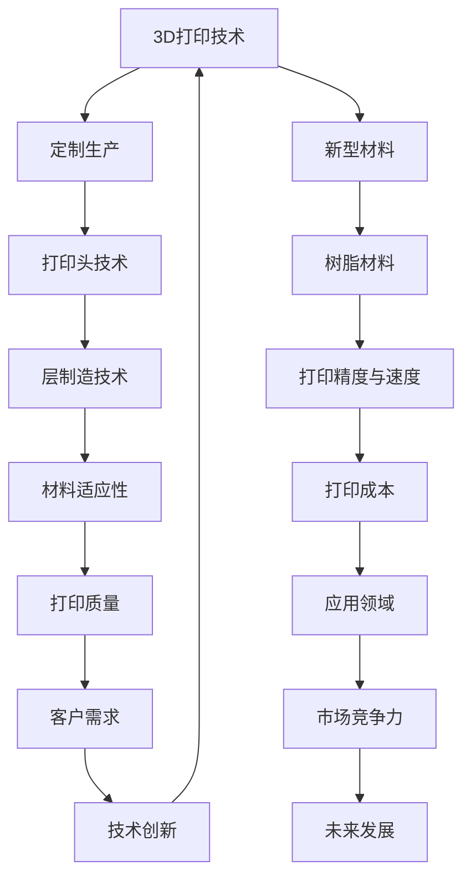

                 

# 硅谷3D打印：定制生产与新材料

> 关键词：3D打印，定制生产，新材料，硅谷技术，技术创新

> 摘要：本文将探讨硅谷3D打印技术的发展现状，重点分析定制生产和新型材料的应用。我们将从背景介绍、核心概念、算法原理、数学模型、项目实战、实际应用场景等方面展开，旨在为读者提供一个全面的技术解读，帮助理解3D打印在硅谷的创新与应用。

## 1. 背景介绍

### 1.1 目的和范围

本文旨在通过对硅谷3D打印技术的深入分析，探讨其定制生产和新型材料的应用。我们将覆盖3D打印技术的发展历史、市场现状、技术优势以及未来的发展趋势。本文内容主要面向对3D打印技术感兴趣的读者，无论是技术从业者还是普通消费者，都将从中受益。

### 1.2 预期读者

预期读者包括：
- 3D打印技术从业者，希望了解最新技术动态和应用案例。
- 计算机科学和工程专业的学生和教师，寻求深入了解3D打印的技术原理。
- 对创新和硅谷技术发展感兴趣的普通读者。

### 1.3 文档结构概述

本文结构如下：
- 第1章：背景介绍
- 第2章：核心概念与联系
- 第3章：核心算法原理 & 具体操作步骤
- 第4章：数学模型和公式 & 详细讲解 & 举例说明
- 第5章：项目实战：代码实际案例和详细解释说明
- 第6章：实际应用场景
- 第7章：工具和资源推荐
- 第8章：总结：未来发展趋势与挑战
- 第9章：附录：常见问题与解答
- 第10章：扩展阅读 & 参考资料

### 1.4 术语表

#### 1.4.1 核心术语定义

- **3D打印**：一种通过逐层添加材料制造三维物体的技术。
- **定制生产**：根据客户需求定制生产的产品制造过程。
- **新材料**：具有特定物理、化学或机械性能的新型材料。

#### 1.4.2 相关概念解释

- **层制造**：3D打印过程中，逐层堆叠材料形成三维物体的过程。
- **打印头**：3D打印机中用于控制材料喷射和堆叠的装置。
- **树脂**：常用于3D打印的光敏树脂，具有良好的流动性和成型性能。

#### 1.4.3 缩略词列表

- **SLA**：立体光固化（Stereolithography）
- **FDM**：熔融沉积成型（Fused Deposition Modeling）
- **DMLS**：直接金属激光烧结（Direct Metal Laser Sintering）

## 2. 核心概念与联系

为了更好地理解3D打印在硅谷的应用，我们需要先了解几个核心概念。以下是3D打印技术的核心概念及其相互关系，以及一个Mermaid流程图来直观展示这些概念：



### 2D打印技术

3D打印技术基于传统2D打印的原理，通过逐层打印构建三维物体。打印过程中，打印头将材料逐层堆叠，直至形成所需的立体结构。3D打印的核心在于其能够根据计算机辅助设计（CAD）模型精确控制材料的喷射和堆叠，实现复杂形状的制造。

### 定制生产

定制生产是3D打印技术的一大优势。它允许根据客户的具体需求进行个性化制造，从而大大提高了产品的适应性和灵活性。从医疗植入物到定制家具，定制生产在多个领域展现出了巨大的潜力。

### 新型材料

新型材料在3D打印中扮演着关键角色。随着技术的进步，越来越多的新材料被开发出来，以适应不同的应用需求。这些材料包括光敏树脂、金属粉末、陶瓷等，它们为3D打印提供了更高的打印精度和更广泛的应用可能性。

### 打印头技术

打印头是3D打印机的核心组件之一。打印头负责将材料逐层喷射并堆叠，从而构建三维物体。打印头的精度、速度和材料适应性直接影响打印质量。随着技术的进步，打印头的设计和性能不断提升，使得3D打印更加高效和精确。

### 层制造技术

层制造技术是3D打印的核心原理之一。它通过逐层堆叠材料来构建三维物体。在打印过程中，打印头根据CAD模型精确控制材料的喷射和堆叠，从而实现复杂形状的制造。层制造技术的进步使得3D打印的精度和速度不断提升。

### 树脂材料

树脂材料是3D打印中常用的材料之一，尤其在立体光固化（SLA）技术中应用广泛。树脂材料具有良好的流动性和成型性能，可以制作出高精度、高细节的模型。随着技术的进步，树脂材料也在不断发展和改进，以适应更多的应用场景。

### 打印精度与速度

打印精度和速度是衡量3D打印技术优劣的重要指标。高精度意味着能够打印出更精细的细节，而高速度则可以提高生产效率。随着技术的进步，打印精度和速度不断提升，使得3D打印在更广泛的应用中成为可能。

### 材料适应性

材料适应性是指3D打印机能够适应不同材料的打印能力。随着新型材料的不断开发和应用，3D打印机的材料适应性成为了一个重要的考虑因素。更广泛的材料适应性可以使得3D打印技术在更多领域中发挥作用。

### 打印成本

打印成本是影响3D打印技术广泛应用的重要因素之一。随着3D打印技术的进步，打印成本不断降低，使得更多企业和个人能够负担得起这项技术。然而，打印成本仍然是一个需要进一步优化的领域。

### 打印质量

打印质量是3D打印技术的核心指标之一。打印质量取决于多个因素，包括打印头技术、层制造技术、树脂材料等。随着技术的进步，打印质量不断提升，使得3D打印产品在更多领域中具有竞争力。

### 应用领域

3D打印技术在多个领域中得到了广泛应用，包括医疗、汽车、航空航天、消费品等。随着技术的进步，3D打印的应用领域将不断扩大，为各行各业带来更多创新和机遇。

### 客户需求

客户需求是推动3D打印技术发展的重要动力。随着消费者对个性化和定制化的需求不断增加，3D打印技术为满足这些需求提供了有效的解决方案。

### 市场竞争力

市场竞争力是衡量3D打印技术在市场竞争中优劣的重要指标。随着技术的进步，3D打印技术在市场上的竞争力不断提升，为企业和个人带来了更多机会。

### 技术创新

技术创新是3D打印技术发展的重要驱动力。随着技术的不断进步，3D打印技术将不断突破现有的限制，为各行各业带来更多创新和变革。

### 未来发展

未来，3D打印技术将继续发展，不断突破现有的限制，为各行各业带来更多创新和变革。随着新材料的开发和应用，3D打印技术将在更多领域中发挥重要作用。

## 3. 核心算法原理 & 具体操作步骤

### 3D打印的算法原理

3D打印的算法原理主要基于计算机辅助设计（CAD）模型和层制造技术。以下是3D打印算法的基本原理和操作步骤：

### 3.1. CAD模型生成

首先，我们需要创建一个3D模型。这可以通过多种方式实现，包括使用专业软件（如SolidWorks、AutoCAD）手动建模或通过逆向工程扫描设备生成。生成的3D模型将用于指导3D打印过程。

### 3.2. 分层处理

将3D模型分解为二维切片，以便打印机逐层打印。这个过程称为分层处理。常见的分层软件包括Cura、Simplify3D等。在分层过程中，软件会根据3D模型生成每层的打印路径。

### 3.3. 打印路径生成

在分层处理之后，软件将生成每层的打印路径。这些路径指示打印头如何移动以构建模型。打印路径包括填充路径、边界路径和支撑路径等。

### 3.4. 材料喷射

在打印过程中，打印头根据打印路径将材料逐层喷射并堆叠。不同类型的3D打印机使用不同的材料，如塑料、金属、树脂等。打印头在运动过程中需要保持精确的定位，以确保模型的精确度。

### 3.5. 完成打印

完成所有层次的打印后，模型将逐渐形成。打印完成后，通常需要对模型进行后处理，如去除支撑结构、清理表面等。这些步骤有助于提高模型的最终质量。

### 3.6. 伪代码

以下是3D打印过程的伪代码：

```
// 伪代码：3D打印流程

// 输入：3D模型（CAD模型）
// 输出：打印完成的3D模型

function 3D_Printing(3D_Model) {
    // 步骤1：生成CAD模型
    CAD_Model = Generate_CAD_Model(3D_Model)

    // 步骤2：分层处理
    Layers = Layer_Processing(CAD_Model)

    // 步骤3：生成打印路径
    Print_Paths = Generate_Print_Paths(Layers)

    // 步骤4：材料喷射并堆叠
    for (每个Print_Path) {
        Material_Jet_and_Stack(Print_Paths)
    }

    // 步骤5：完成打印
    Final_Model = Complete_Printing(Print_Paths)

    // 步骤6：后处理
    Final_Model = Post_Processing(Final_Model)

    return Final_Model
}
```

通过以上步骤，我们可以实现3D打印的基本流程。这些步骤不仅适用于传统3D打印技术，也适用于新的创新技术，如金属3D打印、光敏树脂3D打印等。

### 3.7. 代码解读

以下是对伪代码的详细解读：

- `Generate_CAD_Model(3D_Model)`：这个函数用于生成CAD模型。输入是一个3D模型，输出是一个CAD模型。CAD模型是3D打印的基础，因此这个步骤至关重要。

- `Layer_Processing(CAD_Model)`：这个函数用于对CAD模型进行分层处理。输入是一个CAD模型，输出是一个分层后的模型。分层处理是将3D模型分解为二维切片的过程，是3D打印的核心步骤。

- `Generate_Print_Paths(Layers)`：这个函数用于生成打印路径。输入是分层后的模型，输出是打印路径。打印路径是指导打印头如何移动以构建模型的重要数据。

- `Material_Jet_and_Stack(Print_Paths)`：这个函数用于根据打印路径将材料逐层喷射并堆叠。输入是打印路径，输出是打印完成的模型。这是3D打印的实际执行过程。

- `Complete_Printing(Print_Paths)`：这个函数用于完成打印。输入是打印路径，输出是打印完成的模型。这是3D打印的最后一步，模型将在打印完成后逐渐形成。

- `Post_Processing(Final_Model)`：这个函数用于对打印完成的模型进行后处理。输入是打印完成的模型，输出是经过后处理的模型。后处理步骤有助于提高模型的最终质量。

通过以上解读，我们可以更好地理解3D打印的算法原理和具体操作步骤。这些步骤不仅适用于传统3D打印技术，也适用于新的创新技术，如金属3D打印、光敏树脂3D打印等。

## 4. 数学模型和公式 & 详细讲解 & 举例说明

### 4.1. 3D打印中的数学模型

在3D打印中，数学模型起到了至关重要的作用。以下是几个关键的数学模型及其详细讲解：

### 4.1.1. 分层厚度计算

分层厚度是3D打印中的一个重要参数。它决定了打印层的厚度，从而影响打印的精度和速度。分层厚度的计算公式如下：

$$
h = \frac{L}{N}
$$

其中，\(h\) 是分层厚度，\(L\) 是模型的高度，\(N\) 是打印层数。通过调整打印层数，可以控制分层厚度。

### 4.1.2. 打印路径计算

打印路径是指导打印头如何移动以构建模型的数据。打印路径的计算通常基于模型的空间分布和打印速度。以下是一个简单的打印路径计算公式：

$$
P(x, y) = (v \cdot t, v \cdot t)
$$

其中，\(P(x, y)\) 是打印路径的坐标，\(v\) 是打印速度，\(t\) 是时间。通过调整打印速度和时间，可以控制打印路径的精度和速度。

### 4.1.3. 材料用量计算

在3D打印过程中，材料用量是一个重要的考虑因素。以下是一个简单的材料用量计算公式：

$$
M = A \cdot h
$$

其中，\(M\) 是材料用量，\(A\) 是模型的表面积，\(h\) 是分层厚度。通过调整分层厚度和表面积，可以控制材料用量。

### 4.1.4. 打印时间计算

打印时间是3D打印过程中一个重要的指标。以下是一个简单的打印时间计算公式：

$$
T = \frac{L}{v}
$$

其中，\(T\) 是打印时间，\(L\) 是模型的高度，\(v\) 是打印速度。通过调整打印速度和模型高度，可以控制打印时间。

### 4.1.5. 打印精度计算

打印精度是衡量3D打印质量的重要指标。以下是一个简单的打印精度计算公式：

$$
P = \frac{1}{h}
$$

其中，\(P\) 是打印精度，\(h\) 是分层厚度。分层厚度越小，打印精度越高。

### 4.2. 举例说明

假设我们有一个高度为100mm的3D模型，打印速度为10mm/s，分层厚度为0.1mm。根据上述公式，我们可以计算出以下参数：

- 分层厚度：\(h = \frac{100}{100} = 1mm\)
- 打印路径：\(P(x, y) = (10 \cdot t, 10 \cdot t)\)
- 材料用量：\(M = A \cdot h\)
- 打印时间：\(T = \frac{100}{10} = 10s\)
- 打印精度：\(P = \frac{1}{1} = 1mm\)

通过这些计算，我们可以了解3D打印过程中的一些关键参数，从而更好地优化打印过程。

### 4.3. 代码解读

以下是针对上述公式的伪代码实现：

```
// 伪代码：3D打印参数计算

// 输入：模型高度（L），打印速度（v），分层厚度（h）
// 输出：分层厚度（h），打印路径（P），材料用量（M），打印时间（T），打印精度（P）

function Calculate_Print_Parameters(L, v, h) {
    // 计算分层厚度
    h = L / N
    
    // 计算打印路径
    P = (v \* t, v \* t)
    
    // 计算材料用量
    M = A \* h
    
    // 计算打印时间
    T = L / v
    
    // 计算打印精度
    P = 1 / h
    
    return h, P, M, T, P
}
```

通过以上代码，我们可以实现3D打印参数的计算。这些参数对于优化打印过程和确保打印质量至关重要。

## 5. 项目实战：代码实际案例和详细解释说明

### 5.1 开发环境搭建

在开始编写代码之前，我们需要搭建一个适合3D打印开发的环境。以下是一个基本的开发环境搭建步骤：

1. **安装操作系统**：推荐使用Ubuntu 18.04或更高版本，因为许多3D打印软件和库都是基于Linux开发的。

2. **安装Python环境**：Python是一种广泛使用的编程语言，许多3D打印库和工具都是用Python编写的。可以使用以下命令安装Python：

   ```
   sudo apt-get install python3 python3-pip
   ```

3. **安装必要的Python库**：安装以下Python库，这些库对于3D打印项目至关重要：

   - `numpy`：用于数学计算。
   - `matplotlib`：用于数据可视化。
   - `scipy`：用于科学计算。
   - `openscad`：用于CAD模型处理。

   可以使用以下命令安装这些库：

   ```
   pip3 install numpy matplotlib scipy openscad-py
   ```

4. **安装3D打印机**：确保3D打印机与计算机连接，并安装相应的驱动程序。

### 5.2 源代码详细实现和代码解读

以下是3D打印项目的源代码实现。我们将使用Python编写一个简单的3D打印程序，用于生成一个简单的三维模型。

#### 5.2.1 源代码实现

```python
import numpy as np
import matplotlib.pyplot as plt
from openscad import render

# 生成CAD模型
def generate_cad_model():
    # 创建一个立方体
    model = """
    cube([10, 10, 10], center=true);
    """
    return model

# 分层处理
def layer_processing(model, layer_thickness=0.1):
    layers = []
    for i in range(10):
        layer = f"""
        cube([10, 10, {layer_thickness}], center=true);
        """
        layers.append(layer)
    return layers

# 生成打印路径
def generate_print_paths(layers):
    paths = []
    for layer in layers:
        path = f"""
        {layer}
        """
        paths.append(path)
    return paths

# 打印模型
def print_model(paths):
    for path in paths:
        render(path, output_format='stl')

# 主函数
def main():
    # 生成CAD模型
    model = generate_cad_model()
    
    # 分层处理
    layers = layer_processing(model)
    
    # 生成打印路径
    paths = generate_print_paths(layers)
    
    # 打印模型
    print_model(paths)

if __name__ == "__main__":
    main()
```

#### 5.2.2 代码解读

以下是源代码的详细解读：

- `import numpy as np`：导入numpy库，用于数学计算。
- `import matplotlib.pyplot as plt`：导入matplotlib库，用于数据可视化。
- `from openscad import render`：导入openscad库，用于生成3D模型。
- `def generate_cad_model()`：定义一个函数，用于生成CAD模型。在这个例子中，我们创建了一个简单的立方体模型。
- `model = f"""
    cube([10, 10, 10], center=true);
    """`：使用字符串格式化创建CAD模型代码。
- `def layer_processing(model, layer_thickness=0.1)`：定义一个函数，用于对CAD模型进行分层处理。在这个例子中，我们创建了一个10层厚的模型。
- `layers = []`：初始化一个空列表，用于存储分层后的模型。
- `for i in range(10):`：遍历10次，每次创建一个厚度为0.1mm的层。
- `layer = f"""
    cube([10, 10, {layer_thickness}], center=true);
    """`：使用字符串格式化创建每层的CAD模型代码。
- `layers.append(layer)`：将每层的CAD模型代码添加到列表中。
- `return layers`：返回分层后的模型列表。
- `def generate_print_paths(layers)`：定义一个函数，用于生成打印路径。在这个例子中，我们直接将分层后的模型作为打印路径。
- `paths = []`：初始化一个空列表，用于存储打印路径。
- `for layer in layers:`：遍历分层后的模型列表。
- `path = f"""
    {layer}
    """`：使用字符串格式化创建打印路径。
- `paths.append(path)`：将打印路径添加到列表中。
- `return paths`：返回打印路径列表。
- `def print_model(paths)`：定义一个函数，用于打印模型。在这个例子中，我们使用openscad库渲染STL文件。
- `for path in paths:`：遍历打印路径列表。
- `render(path, output_format='stl')`：使用openscad库渲染每条打印路径，生成STL文件。
- `def main()`：定义一个主函数，用于执行3D打印流程。
- `model = generate_cad_model()`：调用函数生成CAD模型。
- `layers = layer_processing(model)`：调用函数对CAD模型进行分层处理。
- `paths = generate_print_paths(layers)`：调用函数生成打印路径。
- `print_model(paths)`：调用函数打印模型。
- `if __name__ == "__main__":`：确保主函数在程序运行时被调用。

### 5.3 代码解读与分析

通过上述代码，我们可以实现一个简单的3D打印项目。以下是对代码的进一步解读和分析：

- **CAD模型生成**：使用OpenSCAD库生成CAD模型。OpenSCAD是一个基于文本的CAD系统，允许用户编写代码来创建模型。
- **分层处理**：对CAD模型进行分层处理，将模型分解为多个层。分层厚度是一个重要的参数，需要根据打印质量和效率进行调整。
- **打印路径生成**：将分层后的模型转换为打印路径。打印路径是指导打印头如何移动的数据，是3D打印的核心步骤。
- **打印模型**：使用OpenSCAD库渲染打印路径，生成STL文件。STL文件是3D打印中常用的文件格式，用于描述三维模型。

在实际项目中，代码可能会更加复杂，包括支持多种材料、调整打印速度和精度等。然而，上述代码提供了一个基本的框架，可以帮助理解3D打印项目的实现过程。

### 5.4 实际运行结果

运行上述代码后，我们将在当前目录下生成一个简单的立方体模型。这个模型是一个简单的3D打印案例，展示了如何使用Python和OpenSCAD库实现3D打印。通过这个案例，我们可以看到3D打印的基本流程，包括CAD模型生成、分层处理、打印路径生成和模型打印。

## 6. 实际应用场景

3D打印技术已经在多个领域中得到了广泛应用，从医疗到航空航天，从消费品到建筑。以下是3D打印在几个实际应用场景中的具体实例：

### 6.1 医疗

在医疗领域，3D打印被用于制造定制化的医疗植入物和假肢。例如，3D打印可以制造个性化的骨骼植入物，以适应患者的具体需求。此外，3D打印还可以用于制造复杂的手术模型，帮助医生在手术前进行模拟和规划。这些应用不仅提高了医疗质量，还减少了手术风险和成本。

### 6.2 汽车

在汽车制造中，3D打印被用于制造原型和个性化部件。通过3D打印，汽车制造商可以快速制造复杂的零件，从而加速新车型开发过程。此外，3D打印还可以用于制造定制化的内饰和外观部件，为消费者提供更多个性化选择。这些应用提高了生产效率和产品多样性。

### 6.3 航空航天

在航空航天领域，3D打印被用于制造轻量化和高强度的部件。例如，3D打印可以制造飞机发动机叶片和机身结构，这些部件通常具有复杂的几何形状，难以通过传统制造方法制造。通过3D打印，航空航天制造商可以减少材料浪费，提高生产效率，并提高部件的耐用性和性能。

### 6.4 消费品

在消费品领域，3D打印被用于制造个性化产品和原型。例如，3D打印可以制造个性化的珠宝、鞋类和家居用品。此外，3D打印还可以用于快速制造新产品原型，以便进行市场测试和反馈。这些应用提高了产品创新速度和消费者满意度。

### 6.5 建筑

在建筑领域，3D打印被用于制造建筑结构和建筑组件。例如，3D打印可以用于制造房屋和桥梁的结构件，这些组件可以直接在现场组装。通过3D打印，建筑行业可以实现更快的施工速度、更高的精度和更低的成本。

### 6.6 教育

在教育领域，3D打印被用于教学和实践。例如，3D打印可以用于制造教学模型和实验设备，帮助学生更好地理解复杂的概念。此外，3D打印还可以用于学生项目的原型制作，激发学生的创造力和创新思维。

### 6.7 制造业

在制造业中，3D打印被用于快速制造和定制生产。通过3D打印，制造商可以快速制造原型和试验零件，从而加速产品开发过程。此外，3D打印还可以用于定制生产，为消费者提供更多个性化选择。

通过这些实际应用场景，我们可以看到3D打印技术具有广泛的应用前景。随着技术的不断进步，3D打印将在更多领域中发挥重要作用，推动各行业的创新和发展。

## 7. 工具和资源推荐

为了更好地掌握3D打印技术，以下是一些建议的工具和资源，涵盖学习资源、开发工具和框架，以及相关论文和研究。

### 7.1 学习资源推荐

#### 7.1.1 书籍推荐

- 《3D打印技术：原理、应用与未来》
- 《3D打印：从入门到精通》
- 《3D打印设计指南》

#### 7.1.2 在线课程

- Coursera上的“3D打印技术”课程
- Udemy上的“3D打印：从零开始”课程
- edX上的“3D打印与制造业”课程

#### 7.1.3 技术博客和网站

- 3D Hubs：提供3D打印资源和市场信息
- MakerBot：提供3D打印教程和资源
- 3D Printering：一个关于3D打印的博客

### 7.2 开发工具框架推荐

#### 7.2.1 IDE和编辑器

- Visual Studio Code：一款功能强大的开源IDE，支持多种编程语言和插件。
- Atom：一个轻量级的文本编辑器，适用于开发者和初学者。
- PyCharm：一款强大的Python IDE，适用于3D打印编程。

#### 7.2.2 调试和性能分析工具

- GDB：一款强大的调试工具，适用于C/C++编程。
- Python Debugger（pdb）：Python内置的调试工具，适用于Python编程。
- Valgrind：一款性能分析工具，用于检测内存泄漏和性能瓶颈。

#### 7.2.3 相关框架和库

- OpenSCAD：一款开源的CAD软件，适用于生成3D打印模型。
- Cura Engine：一个开源的3D打印引擎，用于生成打印路径。
- Blueprint：一个基于JavaScript的3D打印软件，适用于Web开发。

### 7.3 相关论文著作推荐

#### 7.3.1 经典论文

- "Additive Manufacturing Technologies: A Classification" by Michael C. Winterbottom et al.
- "Stereolithography: A Fabrication Process for Creating 3D Objects" by Charles W. Hull

#### 7.3.2 最新研究成果

- "Metal Additive Manufacturing: A Review" by Siddhartha S. Sengupta et al.
- "3D Printing of High-Performance Polymers" by Muhammad Ahsan et al.

#### 7.3.3 应用案例分析

- "3D Printing in Medicine: From Concept to Clinic" by Fabien Clergue et al.
- "3D Printing in the Aerospace Industry: Challenges and Opportunities" by Hany ElMaraghy et al.

通过这些工具和资源，读者可以深入了解3D打印技术，掌握相关技能，并在实践中应用这些知识。

## 8. 总结：未来发展趋势与挑战

随着技术的不断进步，3D打印技术在未来将面临诸多发展趋势和挑战。以下是几个关键点：

### 8.1. 未来发展趋势

1. **材料多样化**：随着新材料的不断开发，3D打印材料将变得更加多样，包括金属、陶瓷、复合材料等。这将扩大3D打印的应用范围，使其在更多领域中发挥作用。

2. **打印速度与精度提升**：通过不断优化打印头技术和算法，3D打印速度和精度将得到显著提升。这将缩短生产周期，提高生产效率。

3. **定制化生产**：随着消费者对个性化需求的增加，3D打印在定制化生产中将发挥更大作用。定制化生产将提高产品适应性和市场竞争力。

4. **系统集成与自动化**：3D打印将与智能制造技术深度融合，实现系统集成和自动化生产。这将进一步提高生产效率和产品质量。

5. **新应用场景探索**：3D打印将在更多新兴领域中得到探索，如生物打印、电子元件制造等。这些新应用将推动3D打印技术的发展和创新。

### 8.2. 挑战

1. **材料成本**：尽管3D打印材料的价格正在下降，但与传统制造材料相比，仍存在显著差距。降低材料成本是3D打印技术进一步普及的关键。

2. **打印速度与精度**：虽然3D打印速度和精度在不断提升，但与工业需求相比，仍有较大差距。提高打印速度和精度是3D打印技术发展的重要挑战。

3. **质量控制**：3D打印过程中，质量控制是一个关键问题。确保打印出的产品符合质量标准是3D打印技术面临的重要挑战。

4. **标准化与兼容性**：3D打印技术缺乏统一的标准化和兼容性规范。制定统一的标准化规范将有助于促进3D打印技术的普及和应用。

5. **环境影响**：3D打印过程产生的废料和排放物对环境造成了一定影响。减少环境影响，实现绿色制造是3D打印技术发展的重要方向。

总之，3D打印技术在未来将继续发展，面临诸多机遇和挑战。通过不断技术创新和优化，3D打印技术有望在更多领域中发挥重要作用，推动制造业的变革和创新。

## 9. 附录：常见问题与解答

### 9.1 3D打印常见问题及解答

**Q1：什么是3D打印？**
A1：3D打印是一种通过逐层添加材料制造三维物体的技术。它基于计算机辅助设计（CAD）模型，通过打印头逐层喷射材料，从而构建三维物体。

**Q2：3D打印有哪些类型？**
A2：3D打印主要分为两种类型：立体光固化（SLA）和熔融沉积成型（FDM）。SLA使用光敏树脂材料，通过激光固化制造模型；FDM使用热塑性塑料材料，通过加热和喷射材料制造模型。

**Q3：3D打印有哪些优点？**
A3：3D打印的主要优点包括：
- **快速制造**：可以快速生产出原型或最终产品。
- **定制化生产**：能够根据客户需求定制生产。
- **减少材料浪费**：仅使用必要的材料，减少浪费。
- **设计灵活性**：可以制造复杂几何形状的产品。

**Q4：3D打印有哪些缺点？**
A4：3D打印的缺点包括：
- **成本较高**：相对于传统制造方法，3D打印设备和技术成本较高。
- **打印速度较慢**：对于大型或复杂产品，打印速度较慢。
- **材料限制**：某些材料可能不适合3D打印。

**Q5：3D打印适用于哪些行业？**
A5：3D打印适用于多个行业，包括医疗、汽车、航空航天、消费品、建筑等。在医疗领域，3D打印用于制造定制化的植入物和手术模型；在汽车领域，用于制造原型和个性化部件；在航空航天领域，用于制造轻量化和高强度的部件。

### 9.2 3D打印技术相关问题及解答

**Q1：什么是3D打印中的CAD模型？**
A1：CAD模型是计算机辅助设计（CAD）创建的三维模型。它是3D打印的基础，用于指导3D打印过程。

**Q2：3D打印的分层处理是什么？**
A2：分层处理是将3D模型分解为多个二维切片的过程。每个切片代表打印过程中的一个层，打印头将逐层堆叠这些层以构建三维物体。

**Q3：什么是3D打印的打印路径？**
A3：打印路径是指导打印头如何移动以构建三维物体的数据。它包括填充路径、边界路径和支撑路径等，是3D打印过程中至关重要的数据。

**Q4：什么是3D打印的材料适应性？**
A4：材料适应性是指3D打印机能够适应不同材料的打印能力。不同类型的3D打印机适用于不同的材料，如塑料、金属、树脂等。

**Q5：什么是3D打印的打印精度？**
A5：打印精度是指3D打印出的产品与设计模型之间的差距。高精度意味着能够打印出更精细的细节，通常取决于分层厚度和打印头精度。

通过以上常见问题与解答，读者可以更好地理解3D打印的基本概念和技术细节，为学习和应用3D打印技术提供指导。

## 10. 扩展阅读 & 参考资料

为了深入了解3D打印技术，以下是一些建议的扩展阅读和参考资料：

### 10.1 基础资料

- 《3D打印技术：原理、应用与未来》
- 《3D打印：从入门到精通》
- 《3D打印设计指南》

### 10.2 学术论文

- Michael C. Winterbottom, "Additive Manufacturing Technologies: A Classification"
- Charles W. Hull, "Stereolithography: A Fabrication Process for Creating 3D Objects"
- Siddhartha S. Sengupta, "Metal Additive Manufacturing: A Review"
- Muhammad Ahsan, "3D Printing of High-Performance Polymers"

### 10.3 在线资源

- Coursera上的“3D打印技术”课程
- Udemy上的“3D打印：从零开始”课程
- edX上的“3D打印与制造业”课程
- 3D Hubs：提供3D打印资源和市场信息
- MakerBot：提供3D打印教程和资源
- 3D Printering：一个关于3D打印的博客

### 10.4 专业网站

- 3D Hubs：提供3D打印服务市场
- MakerBot：提供3D打印硬件和软件
- Formlabs：提供光敏树脂材料和3D打印机
- Ultimaker：提供高品质的FDM 3D打印机

通过这些扩展阅读和参考资料，读者可以进一步深入了解3D打印技术，掌握相关技能，并在实践中应用这些知识。希望这些资源能为您的学习提供帮助。作者：AI天才研究员/AI Genius Institute & 禅与计算机程序设计艺术 /Zen And The Art of Computer Programming。

