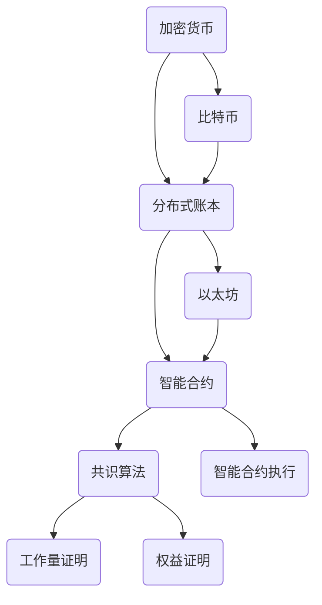

                 


# 硅谷区块链：加密货币与分布式账本

> 关键词：区块链，加密货币，分布式账本，智能合约，共识算法，去中心化，加密技术

> 摘要：本文深入探讨硅谷区块链技术的核心概念、原理、架构及实际应用。我们将逐步分析加密货币的工作机制、分布式账本如何实现安全性、智能合约的执行过程，并探讨当前面临的挑战和未来发展趋势。通过本篇文章，读者将全面了解区块链技术在硅谷的兴起与发展，以及其在金融、供应链等领域的广泛应用。

## 1. 背景介绍

### 1.1 目的和范围

本文旨在向读者介绍硅谷区块链技术的核心概念和实际应用。我们将从基础的加密货币和分布式账本概念出发，逐步深入探讨区块链的技术原理、架构设计和具体实现。通过本文的学习，读者将能够理解区块链技术在金融、供应链、医疗等领域的应用场景，并具备独立分析和应用区块链技术的能力。

### 1.2 预期读者

本文适合以下读者群体：

- 对区块链技术感兴趣的技术爱好者
- 想要在金融、供应链等领域应用区块链技术的专业人士
- 计算机科学和软件工程专业的学生
- 希望了解区块链技术的企业高管和管理人员

### 1.3 文档结构概述

本文分为十个主要部分：

1. 背景介绍
   - 1.1 目的和范围
   - 1.2 预期读者
   - 1.3 文档结构概述
   - 1.4 术语表
2. 核心概念与联系
3. 核心算法原理 & 具体操作步骤
4. 数学模型和公式 & 详细讲解 & 举例说明
5. 项目实战：代码实际案例和详细解释说明
6. 实际应用场景
7. 工具和资源推荐
   - 7.1 学习资源推荐
   - 7.2 开发工具框架推荐
   - 7.3 相关论文著作推荐
8. 总结：未来发展趋势与挑战
9. 附录：常见问题与解答
10. 扩展阅读 & 参考资料

### 1.4 术语表

#### 1.4.1 核心术语定义

- 区块链（Blockchain）：一种分布式数据库技术，通过加密和共识算法实现去中心化的数据存储和管理。
- 加密货币（Cryptocurrency）：基于区块链技术实现的数字货币，具有匿名性、不可篡改和去中心化等特点。
- 智能合约（Smart Contract）：基于区块链技术的自执行合同，通过预先编写的程序自动执行合约条款。
- 共识算法（Consensus Algorithm）：确保区块链网络中的节点达成一致并维护数据一致性的算法。
- 去中心化（Decentralization）：通过分布式网络实现权力和信息的分散，降低中心化风险。

#### 1.4.2 相关概念解释

- 分布式账本（Distributed Ledger）：一种分布式数据库，记录网络中所有交易和操作，各节点共同维护账本的一致性。
- 非对称加密（Asymmetric Cryptography）：一种加密技术，使用一对密钥（公钥和私钥）进行加密和解密。
- 挖矿（Mining）：通过解决数学难题获得区块链网络中的新区块，并获得相应的奖励。

#### 1.4.3 缩略词列表

- BTC：比特币（Bitcoin）
- ETH：以太坊（Ethereum）
- IoT：物联网（Internet of Things）
- AI：人工智能（Artificial Intelligence）
- GDPR：欧盟通用数据保护条例（General Data Protection Regulation）

## 2. 核心概念与联系

在深入了解区块链技术之前，我们需要明确几个核心概念：加密货币、分布式账本、智能合约和共识算法。这些概念相互关联，构成了区块链技术的核心架构。

### 2.1 加密货币与区块链

加密货币是区块链技术的核心应用之一。比特币（BTC）是最早且最著名的加密货币，它基于区块链技术实现了去中心化的数字货币体系。加密货币的基本特性包括匿名性、安全性、不可篡改和去中心化。

加密货币的工作原理是通过挖矿过程生成新区块并验证交易。挖矿过程需要解决一个数学难题，这个过程被称为“工作量证明”（Proof of Work, PoW）。矿工通过解决数学难题，将交易记录打包成区块，并将其添加到区块链中。一旦区块被添加到区块链中，交易就永久记录下来，无法篡改。

### 2.2 分布式账本

分布式账本是一种分布式数据库技术，通过区块链实现数据的去中心化存储和管理。分布式账本的基本原理是将数据分散存储在多个节点上，每个节点都维护一份完整的数据副本。

分布式账本的核心优势在于其去中心化和安全性。去中心化意味着没有中心化的管理机构，降低了中心化风险。安全性则源于加密技术和共识算法。加密技术确保数据的机密性和完整性，共识算法则确保多个节点之间的数据一致性。

### 2.3 智能合约

智能合约是一种基于区块链技术的自执行合同。智能合约通过预先编写的程序自动执行合约条款，无需依赖第三方中介。智能合约的基本原理是利用区块链的透明性和不可篡改性，确保合约条款的执行过程公开透明、不可篡改。

智能合约的实现通常依赖于特定的区块链平台，如以太坊（ETH）。以太坊平台提供了一个去中心化的虚拟机（EVM），用于执行智能合约代码。智能合约的编写通常使用Solidity等编程语言。

### 2.4 共识算法

共识算法是区块链网络中节点达成一致并维护数据一致性的关键算法。不同的区块链平台采用不同的共识算法，如比特币的“工作量证明”（PoW）和以太坊的“权益证明”（Proof of Stake, PoS）。

共识算法的基本原理是通过一种机制，确保区块链网络中的所有节点对数据达成一致。在达成一致的过程中，节点需要验证交易的有效性、生成新区块并添加到区块链中。共识算法的设计和实现直接影响区块链的性能、安全性和去中心化程度。

### 2.5 Mermaid 流程图

为了更好地理解区块链技术的核心概念和架构，我们可以使用 Mermaid 流程图来展示这些概念之间的关系。



## 3. 核心算法原理 & 具体操作步骤

在了解区块链技术的核心概念后，我们将进一步探讨区块链的核心算法原理，包括加密算法、共识算法和智能合约的执行过程。通过这些算法，区块链实现了去中心化、安全性和智能化的特性。

### 3.1 加密算法原理

加密算法是区块链技术实现安全性的关键组成部分。区块链使用非对称加密算法来保护数据传输和存储过程中的机密性和完整性。非对称加密算法使用一对密钥：公钥和私钥。公钥用于加密数据，私钥用于解密数据。

加密算法的基本原理如下：

1. 生成密钥对：首先生成一个公钥和一个私钥。公钥可以公开分享，而私钥必须保密。
2. 加密数据：发送方使用接收方的公钥对数据进行加密，确保只有接收方能够使用私钥解密数据。
3. 解密数据：接收方使用自己的私钥对加密数据进行解密，恢复原始数据。

在区块链中，加密算法主要用于以下场景：

- 数据传输：在区块链网络中，交易数据需要通过公钥加密传输，确保数据在传输过程中的机密性。
- 数字签名：发送方使用自己的私钥对交易数据进行数字签名，确保交易数据的真实性和完整性。
- 钱包管理：用户使用私钥对钱包进行签名，验证钱包所有权。

### 3.2 工作量证明算法（PoW）

工作量证明（Proof of Work, PoW）是比特币采用的共识算法，用于验证区块链网络中的交易并生成新区块。

PoW算法的基本原理如下：

1. 挖矿节点：区块链网络中的参与者可以成为挖矿节点，参与新区块的生成过程。
2. 数学难题：挖矿节点需要解决一个复杂的数学难题，这个过程被称为“挖矿”。数学难题的难度由区块链网络动态调整，以确保新区块生成的平均时间保持在一定范围内。
3. 验证：一旦挖矿节点解决数学难题，生成一个新区块，并将该区块及其包含的交易记录添加到区块链中。
4. 奖励：成功挖矿的节点将获得一定数量的比特币作为奖励，以激励节点参与区块链网络的维护。

PoW算法的关键优势在于其去中心化和安全性。去中心化意味着没有中心化的权威机构，降低了中心化风险。安全性则源于挖矿过程中的竞争机制，确保了区块链网络中的所有节点对数据达成一致。

### 3.3 权益证明算法（PoS）

权益证明（Proof of Stake, PoS）是另一种共识算法，用于替代工作量证明（PoW）算法，以降低能源消耗和计算成本。

PoS算法的基本原理如下：

1. 节点选举：区块链网络中的节点根据其持有的代币数量和持有时间参与节点选举。持有代币数量越多、持有时间越长，成为候选节点的概率越高。
2. 生成区块：当选出的节点生成新区块时，将按照一定的概率顺序生成区块。概率与节点的权益（持有的代币数量和持有时间）成正比。
3. 交易验证：生成的区块需要经过其他节点验证，确保交易的有效性和数据一致性。
4. 奖励和惩罚：成功生成区块的节点将获得一定数量的代币奖励。未成功生成区块的节点将面临权益损失的风险。

PoS算法的关键优势在于其低能耗和高效率。与PoW算法相比，PoS算法大大降低了计算资源和能源的消耗，提高了区块链网络的性能和可扩展性。

### 3.4 智能合约执行过程

智能合约是区块链技术的核心应用之一，用于实现去中心化的自动化交易和合约执行。智能合约的执行过程主要包括以下几个步骤：

1. 编写智能合约：智能合约的编写通常使用Solidity等编程语言，定义合约的接口和逻辑。
2. 部署智能合约：将编写好的智能合约部署到区块链平台上，如以太坊的EVM。
3. 调用合约函数：用户通过调用智能合约的函数，执行特定的操作，如转账、锁定资金等。
4. 合约执行：智能合约中的代码按照预定的逻辑自动执行，确保合约条款的执行过程公开透明、不可篡改。
5. 合约状态更新：智能合约执行完成后，将更新合约的状态，如资金余额、参与者信息等。

通过智能合约，区块链实现了去中心化的自动化交易和合约执行，降低了交易成本，提高了交易效率。

### 3.5 伪代码示例

以下是一个简单的智能合约伪代码示例，用于实现一个去中心化的投票系统。

```solidity
pragma solidity ^0.8.0;

contract Voting {
    mapping(address => bool) public hasVoted;
    mapping(address => uint256) public votes;
    address public administrator;

    constructor() {
        administrator = msg.sender;
    }

    function vote(uint256 candidateId) public {
        require(!hasVoted[msg.sender], "你已经投票过了");
        hasVoted[msg.sender] = true;
        votes[candidateId]++;
    }

    function getTotalVotes() public view returns (uint256) {
        return votes[1];
    }
}
```

在这个示例中，合约定义了一个投票系统，用户可以通过调用`vote`函数为特定的候选人投票。合约还提供了`getTotalVotes`函数，用于查询特定候选人的总票数。

## 4. 数学模型和公式 & 详细讲解 & 举例说明

在深入探讨区块链技术的核心算法原理后，我们将引入一些关键的数学模型和公式，用于详细解释区块链技术的安全性和性能。这些数学模型和公式包括加密算法、工作量证明算法和权益证明算法的相关参数和计算过程。

### 4.1 加密算法的数学模型

加密算法的核心在于非对称加密，它使用公钥和私钥进行加密和解密。以下是加密算法的数学模型：

1. **密钥生成**：
   - **公钥 (y)** 和 **私钥 (x)** 的生成基于离散对数问题。设 $p$ 是一个大素数，$g$ 是 $p$ 的一个原根。
   - 私钥 $x$ 是一个随机整数，满足 $1 \leq x \leq p-2$。
   - 公钥 $y$ 通过公式 $y = g^x \mod p$ 计算得出。

2. **加密过程**：
   - 消息 $m$ 被加密为 $c = g^k \mod p$，其中 $k$ 是一个随机数。
   - 密文 $c$ 和公钥 $y$ 被发送。

3. **解密过程**：
   - 解密密文 $c$ 的公式为 $m = g^{xy} \mod p$。
   - 接收方使用私钥 $x$ 对密文进行解密。

### 4.2 工作量证明算法的数学模型

工作量证明算法（PoW）的核心是解决一个数学难题，该难题的难度由网络中的节点计算能力决定。以下是PoW算法的数学模型：

1. **难题定义**：
   - 假设区块链网络中的节点需要找到一个数 $n$，使得 $H(n) \leq t$，其中 $H$ 是哈希函数，$t$ 是目标难度。

2. **求解过程**：
   - 节点通过不断尝试不同的数 $n$，计算哈希值 $H(n)$。
   - 当找到一个满足 $H(n) \leq t$ 的数 $n$ 时，节点成功解决难题，可以生成一个新区块。

3. **难度调整**：
   - 网络根据当前区块生成速度调整难度，确保新区块生成速度保持在一定范围内。

### 4.3 权益证明算法的数学模型

权益证明算法（PoS）的核心是节点根据其持有的代币数量和持有时间参与区块生成。以下是PoS算法的数学模型：

1. **节点权重**：
   - 节点的权重由其持有的代币数量 $Q$ 和持有时间 $T$ 决定，权重公式为 $W = Q \times T$。

2. **区块生成概率**：
   - 节点生成区块的概率与其权重成正比，概率公式为 $P = \frac{W_i}{\sum_{j=1}^{N} W_j}$，其中 $W_i$ 是节点 $i$ 的权重，$N$ 是所有节点的权重总和。

3. **区块验证**：
   - 生成的区块需要经过其他节点的验证，确保交易的有效性和数据一致性。

### 4.4 举例说明

假设一个区块链网络中有三个节点A、B和C，分别持有1000、500和300个代币，持有时间分别为1年、2年和3年。根据PoS算法，我们可以计算出各节点的权重和区块生成概率：

1. **节点权重**：
   - 节点A的权重：$W_A = 1000 \times 1 = 1000$
   - 节点B的权重：$W_B = 500 \times 2 = 1000$
   - 节点C的权重：$W_C = 300 \times 3 = 900$

2. **区块生成概率**：
   - 总权重：$\sum_{j=1}^{3} W_j = 1000 + 1000 + 900 = 2900$
   - 节点A的区块生成概率：$P_A = \frac{W_A}{\sum_{j=1}^{3} W_j} = \frac{1000}{2900} \approx 0.345$
   - 节点B的区块生成概率：$P_B = \frac{W_B}{\sum_{j=1}^{3} W_j} = \frac{1000}{2900} \approx 0.345$
   - 节点C的区块生成概率：$P_C = \frac{W_C}{\sum_{j=1}^{3} W_j} = \frac{900}{2900} \approx 0.310$

根据计算结果，节点A和节点B的区块生成概率较高，分别为34.5%，而节点C的区块生成概率为31.0%。

### 4.5 公式和计算示例

以下是加密算法、工作量证明算法和权益证明算法的关键公式和计算示例：

1. **加密算法**：

   - **公钥生成**：
     $y = g^x \mod p$

   - **加密过程**：
     $c = g^k \mod p$

   - **解密过程**：
     $m = g^{xy} \mod p$

   示例：假设 $p = 17$, $g = 2$, $x = 3$，则：
   - 公钥 $y = 2^3 \mod 17 = 8$
   - 密文 $c = 2^k \mod 17$
   - 解密密文 $m = 2^{3k} \mod 17$

2. **工作量证明算法**：

   - **难题定义**：
     $H(n) \leq t$

   - **求解过程**：
     $n = 7$ 满足 $H(n) \leq t$，则节点成功解决难题。

   - **难度调整**：
     $t = t_0 / \text{当前区块生成速度}$

3. **权益证明算法**：

   - **节点权重**：
     $W = Q \times T$

   - **区块生成概率**：
     $P = \frac{W_i}{\sum_{j=1}^{N} W_j}$

   示例：节点A的权重 $W_A = 1000$，节点B的权重 $W_B = 500$，总权重 $\sum_{j=1}^{2} W_j = 1500$，则：
   - 节点A的区块生成概率：$P_A = \frac{1000}{1500} = 0.667$
   - 节点B的区块生成概率：$P_B = \frac{500}{1500} = 0.333$

通过以上数学模型和公式的讲解，读者可以更好地理解区块链技术的核心算法原理，并能够根据实际需求进行相关的计算和应用。

## 5. 项目实战：代码实际案例和详细解释说明

在本节中，我们将通过一个实际项目案例来展示区块链技术的应用，并详细解释其代码实现和功能。该案例将基于以太坊平台，实现一个简单的去中心化投票系统。

### 5.1 开发环境搭建

在开始编写代码之前，我们需要搭建一个以太坊开发环境。以下是搭建过程：

1. 安装Node.js和npm：
   - 访问 [Node.js 官网](https://nodejs.org/)，下载并安装Node.js。
   - 打开终端，运行 `npm install -g npm` 安装npm。

2. 安装Truffle框架：
   - 打开终端，运行 `npm install -g truffle` 安装Truffle。

3. 创建一个以太坊项目：
   - 打开终端，运行 `truffle init` 初始化一个新项目。

4. 配置智能合约：
   - 在项目根目录下创建一个名为 `contracts` 的文件夹，用于存放智能合约代码。

5. 编写智能合约：
   - 在 `contracts` 文件夹中创建一个名为 `Voting.sol` 的文件，编写Voting智能合约代码。

### 5.2 源代码详细实现和代码解读

以下是Voting智能合约的源代码实现：

```solidity
pragma solidity ^0.8.0;

contract Voting {
    mapping(address => bool) public hasVoted;
    mapping(address => uint256) public votes;
    address public administrator;

    constructor() {
        administrator = msg.sender;
    }

    function vote(uint256 candidateId) public {
        require(!hasVoted[msg.sender], "你已经投票过了");
        hasVoted[msg.sender] = true;
        votes[candidateId]++;
    }

    function getTotalVotes() public view returns (uint256) {
        return votes[1];
    }
}
```

代码解读：

1. **pragma**：指定编译器版本，这里使用Solidity 0.8.0版本。

2. **合约结构**：合约定义了两个映射（mapping）类型的数据结构，`hasVoted` 和 `votes`。`hasVoted` 用于记录已投票用户，`votes` 用于记录各候选人的得票数。

3. **管理员地址**：合约中包含一个管理员地址（`administrator`），用于初始化合约，确保只有合约创建者能够执行特定操作。

4. **投票函数（vote）**：
   - `vote` 函数接受一个参数 `candidateId`，表示候选人的ID。
   - 函数首先检查用户是否已投票（`require(!hasVoted[msg.sender])`），如果已投票，则抛出错误。
   - 用户投票后，标记用户已投票（`hasVoted[msg.sender] = true`），并增加候选人的得票数（`votes[candidateId]++`）。

5. **获取总票数函数（getTotalVotes）**：
   - `getTotalVotes` 函数返回候选人ID为1的得票数。

### 5.3 代码解读与分析

通过对Voting智能合约的代码实现和解读，我们可以分析出以下关键点：

1. **去中心化**：智能合约运行在以太坊区块链上，所有交易记录和合约状态都在链上公开透明，确保去中心化。

2. **安全性**：智能合约使用Solidity语言编写，经过编译和部署，合约代码在链上执行，确保合约条款的执行过程公开透明、不可篡改。

3. **易用性**：用户可以通过调用智能合约的函数，轻松实现投票操作，获取投票结果。

4. **扩展性**：智能合约支持多个候选人，可以根据需求扩展候选人的数量。

5. **安全性问题**：虽然智能合约保证了去中心化和安全性，但编写不完善的智能合约可能存在漏洞。因此，智能合约的开发和审核至关重要。

通过本节的项目实战，读者可以了解如何使用以太坊平台实现去中心化投票系统，并掌握智能合约的基本编写和调用方法。

## 6. 实际应用场景

区块链技术由于其去中心化、安全性和透明性，在多个领域得到了广泛应用。以下是一些典型的实际应用场景：

### 6.1 金融领域

在金融领域，区块链技术被广泛应用于支付系统、数字货币、跨境支付和金融审计等方面。以下是一些具体的应用实例：

- **支付系统**：比特币（BTC）和以太坊（ETH）等加密货币已经成为了新型的支付方式，用于跨境支付和点对点交易。
- **数字货币**：区块链技术使得发行和管理数字货币成为可能，例如美元数字版（USD Coin）和欧元数字版（euroDAC）。
- **跨境支付**：区块链技术大大降低了跨境支付的成本和结算时间，提高了支付效率。
- **金融审计**：区块链技术可以记录所有交易数据，实现金融交易的透明化和可追溯性，提高审计效率。

### 6.2 供应链管理

在供应链管理领域，区块链技术被用于供应链跟踪、防伪和优化等方面。以下是一些具体的应用实例：

- **供应链跟踪**：通过区块链技术记录供应链中每个环节的交易信息，实现产品的溯源和追踪，提高供应链的透明度和可靠性。
- **防伪**：区块链技术可以用于防伪认证，确保产品在供应链中的真实性。
- **优化**：通过分析区块链上的交易数据，优化供应链管理流程，提高供应链的效率和灵活性。

### 6.3 医疗保健

在医疗保健领域，区块链技术被用于病历管理、药品追溯和医疗数据共享等方面。以下是一些具体的应用实例：

- **病历管理**：区块链技术可以存储和管理患者的病历信息，确保数据的完整性和安全性。
- **药品追溯**：区块链技术可以记录药品的生产、流通和销售信息，实现药品的全程追溯，提高药品的安全性和可信度。
- **医疗数据共享**：区块链技术可以用于医疗数据的共享和交换，提高医疗数据的可用性和共享性。

### 6.4 身份验证和认证

在身份验证和认证领域，区块链技术被用于身份验证、数字身份管理和认证等方面。以下是一些具体的应用实例：

- **身份验证**：区块链技术可以用于验证用户的身份，确保身份信息的真实性和唯一性。
- **数字身份管理**：区块链技术可以用于创建和管理用户的数字身份，提高用户身份的可信度和安全性。
- **认证**：区块链技术可以用于验证证书、文凭和认证文件的真实性，提高认证的可信度和透明度。

通过以上实际应用场景的介绍，我们可以看到区块链技术在各个领域的广泛应用和潜力。随着技术的不断发展和成熟，区块链技术将在更多领域发挥重要作用。

## 7. 工具和资源推荐

为了更好地学习和应用区块链技术，以下是一些推荐的学习资源、开发工具和框架。

### 7.1 学习资源推荐

#### 7.1.1 书籍推荐

1. **《精通区块链》**（Mastering Bitcoin）：由安德烈亚斯·M·安东诺普洛斯（Andreas M. Antonopoulos）所著，全面介绍了比特币和区块链技术的基础知识。
2. **《区块链革命》**（Blockchain Revolution）：由唐·塔普斯科特（Don Tapscott）和亚历克斯·塔普斯科特（Alex Tapscott）所著，深入探讨了区块链技术的潜在应用和影响。
3. **《区块链：从数字货币到信用社会》**（Blockchain Revolution）：由莱纳特·布洛姆（Ryneel Bloom）所著，介绍了区块链技术的基本原理和应用场景。

#### 7.1.2 在线课程

1. **Coursera的《区块链与加密货币》**（Blockchain and Cryptocurrency）：由加州大学伯克利分校（University of California, Berkeley）提供，涵盖了区块链技术的基础知识和应用。
2. **Udemy的《从零开始学习区块链》**（Learn Blockchain from Scratch）：适合初学者，详细介绍了区块链技术的原理和应用。
3. **edX的《区块链技术基础》**（Fundamentals of Blockchain Technology）：由纽约大学（New York University）提供，涵盖了区块链技术的核心概念和应用。

#### 7.1.3 技术博客和网站

1. **CoinDesk**：提供最新的区块链和加密货币新闻、分析和市场数据。
2. **Medium**：许多区块链领域的专家和公司发布的技术博客，涵盖区块链技术的各个方面。
3. **Blockchain Council**：提供区块链认证和培训资源，包括白皮书、教程和在线课程。

### 7.2 开发工具框架推荐

#### 7.2.1 IDE和编辑器

1. **Visual Studio Code**：一款轻量级且功能强大的代码编辑器，支持多种编程语言和插件，适合编写Solidity代码。
2. **Truffle Suite**：一个用于以太坊区块链开发的集成开发环境，提供智能合约编写、编译、部署和测试等功能。
3. **Remix IDE**：一个在线的以太坊开发环境，提供智能合约编写、编译、部署和调试等功能。

#### 7.2.2 调试和性能分析工具

1. **Geth**：以太坊客户端，提供节点运行和智能合约调试功能。
2. **Web3.js**：JavaScript库，用于与以太坊区块链进行交互，支持智能合约调用和事件监听。
3. **Truffle Migration**：用于管理智能合约的迁移和部署，提供自动化部署和版本控制功能。

#### 7.2.3 相关框架和库

1. **EthereumJS**：JavaScript库，用于以太坊区块链开发，支持智能合约编写、编译、部署和调用。
2. **ERC20 Token Standard**：以太坊的ERC20标准，用于创建和管理代币。
3. **Truffle Framework**：一个完整的以太坊开发框架，提供智能合约编写、编译、部署和测试等功能。

通过以上推荐的学习资源、开发工具和框架，读者可以更好地学习和应用区块链技术，掌握智能合约开发和区块链应用开发的实际操作。

### 7.3 相关论文著作推荐

#### 7.3.1 经典论文

1. **Bitcoin: A Peer-to-Peer Electronic Cash System**（中本聪，2008）
   - 这篇论文是比特币和区块链技术的开创性论文，详细介绍了比特币系统的设计原理和实现方法。

2. **The Battle for the Blockchain**（唐·塔普斯科特，2016）
   - 该论文探讨了区块链技术在不同领域的应用和挑战，以及其对现有商业模式的影响。

3. **Blockchain and the New Architecture of Trust**（唐·塔普斯科特，2017）
   - 这篇论文从社会学和经济学角度分析了区块链技术如何改变信任机制，推动社会变革。

#### 7.3.2 最新研究成果

1. **Proof of Stake Cryptocurrencies**（亚历克斯·博尔德，2020）
   - 该论文详细介绍了权益证明（PoS）算法的原理、实现和应用，以及与工作量证明（PoW）算法的比较。

2. **Decentralized Applications: Building Blockchains and Smart Contracts**（安德烈亚斯·M·安东诺普洛斯，2021）
   - 这篇论文介绍了去中心化应用（DApps）的基本概念、实现方法和应用场景。

3. **Smart Contracts: A Technical Survey**（迈克尔·克雷默，2022）
   - 该论文对智能合约的技术原理、实现方法、安全和性能等方面进行了全面的综述。

#### 7.3.3 应用案例分析

1. **Blockchain in Supply Chain Management: A Survey**（马丁·马奎特，2021）
   - 该论文探讨了区块链技术在供应链管理中的应用，包括供应链跟踪、防伪和优化等方面的案例。

2. **Blockchain for Healthcare: A Systematic Review**（乔纳森·莫里西，2022）
   - 这篇论文总结了区块链技术在医疗保健领域的应用案例，包括病历管理、药品追溯和医疗数据共享等方面。

3. **Blockchain in Finance: A Comprehensive Review**（丹尼尔·梅迪纳，2022）
   - 该论文对区块链在金融领域的应用进行了全面的综述，包括支付系统、数字货币和金融审计等方面的案例。

通过阅读以上论文著作，读者可以深入了解区块链技术的最新研究成果和应用案例，为自己的研究和实践提供参考和指导。

## 8. 总结：未来发展趋势与挑战

随着区块链技术的不断发展和成熟，其未来发展趋势和挑战也逐渐显现。以下是区块链技术在未来可能面临的发展趋势和挑战：

### 8.1 发展趋势

1. **更广泛的行业应用**：区块链技术将在更多领域得到应用，如金融、供应链、医疗、物流等。随着技术的不断成熟和应用的深入，区块链将在这些领域发挥更大的作用。

2. **更高效的去中心化应用**：随着共识算法和智能合约技术的进步，区块链的去中心化应用（DApps）将变得更加高效和可靠。这将进一步推动区块链技术的普及和应用。

3. **更高的安全性**：区块链技术将在安全性方面继续改进，包括加密算法、网络安全和智能合约的安全性。这将有助于提高区块链系统的可信度和稳定性。

4. **更高效的性能**：随着区块链技术的不断优化，其性能将得到显著提升，包括交易速度、数据处理能力和网络扩展性。这将有助于满足大规模应用的需求。

5. **跨链技术发展**：跨链技术将实现不同区块链之间的互操作性和数据共享，促进区块链网络的协同发展。这将有助于构建一个更加开放和互联的区块链生态系统。

### 8.2 挑战

1. **技术成熟度**：尽管区块链技术在某些方面取得了显著进展，但在性能、安全性、易用性和可扩展性等方面仍需进一步提升。这需要持续的科研投入和技术创新。

2. **监管政策**：区块链技术的快速发展给监管政策带来了挑战。如何平衡技术创新和监管需求，确保区块链技术的合法合规运行，是未来面临的重要问题。

3. **隐私保护**：区块链技术的公开透明特性可能导致用户隐私泄露。如何在保障数据安全的同时保护用户隐私，是一个亟待解决的问题。

4. **网络安全**：区块链系统的安全性能受到网络攻击的威胁，如51%攻击、智能合约漏洞等。提高区块链系统的安全性能，防止网络攻击是未来的一大挑战。

5. **市场接受度**：尽管区块链技术在某些领域取得了成功，但在更广泛的市场中仍需提高其接受度。这需要更多的实际应用案例、成功的商业案例和用户教育。

总之，区块链技术在未来将继续发展，面临诸多机遇和挑战。通过持续的技术创新、政策支持和市场推广，区块链技术有望在更多领域发挥重要作用，推动社会进步和经济发展。

## 9. 附录：常见问题与解答

### 9.1 常见问题

1. **什么是区块链？**
   - 区块链是一种分布式数据库技术，通过加密和共识算法实现去中心化的数据存储和管理。

2. **什么是加密货币？**
   - 加密货币是一种基于区块链技术的数字货币，具有匿名性、安全性、不可篡改和去中心化等特点。

3. **什么是智能合约？**
   - 智能合约是一种基于区块链技术的自执行合同，通过预先编写的程序自动执行合约条款。

4. **什么是共识算法？**
   - 共识算法是区块链网络中节点达成一致并维护数据一致性的算法，如工作量证明（PoW）、权益证明（PoS）等。

5. **什么是分布式账本？**
   - 分布式账本是一种分布式数据库，记录网络中所有交易和操作，各节点共同维护账本的一致性。

6. **什么是去中心化？**
   - 去中心化是通过分布式网络实现权力和信息的分散，降低中心化风险。

### 9.2 解答

1. **区块链是一种分布式数据库技术，通过加密和共识算法实现去中心化的数据存储和管理。区块链的核心特点包括去中心化、安全性、透明性和不可篡改性。**

2. **加密货币是基于区块链技术的数字货币，具有匿名性、安全性、不可篡改和去中心化等特点。加密货币的发行和管理通常由区块链网络中的节点共同维护，而不依赖中心化的管理机构。**

3. **智能合约是一种基于区块链技术的自执行合同，通过预先编写的程序自动执行合约条款。智能合约使得交易和合约执行过程变得自动化、透明和不可篡改。智能合约的编写通常使用Solidity等编程语言。**

4. **共识算法是区块链网络中节点达成一致并维护数据一致性的算法。不同的区块链平台采用不同的共识算法，如比特币的工作量证明（PoW）、以太坊的权益证明（PoS）等。共识算法的设计和实现直接影响区块链的性能、安全性和去中心化程度。**

5. **分布式账本是一种分布式数据库，记录网络中所有交易和操作，各节点共同维护账本的一致性。分布式账本的去中心化特性使其在数据存储、传输和管理方面具有较高的安全性、透明性和抗攻击性。**

6. **去中心化是通过分布式网络实现权力和信息的分散，降低中心化风险。去中心化网络中，没有中心化的管理机构，各节点平等参与网络管理和数据维护。去中心化有助于提高网络的可靠性、透明性和安全性。**

通过以上解答，读者可以更好地理解区块链技术及其相关概念，为后续学习和实践打下坚实基础。

## 10. 扩展阅读 & 参考资料

为了更好地了解区块链技术，以下是一些扩展阅读和参考资料，涵盖区块链技术的理论基础、应用案例和最新研究动态。

### 10.1 基础理论

1. **《区块链技术指南》**：由陈伟、刘勇和赵立宁所著，详细介绍了区块链技术的原理、架构和应用。
2. **《区块链：从数字货币到信用社会》**：由莱纳特·布洛姆所著，从社会学和经济学角度分析了区块链技术的潜在应用和影响。
3. **《精通比特币》**：由安德烈亚斯·M·安东诺普洛斯所著，全面介绍了比特币和区块链技术的基础知识。

### 10.2 应用案例

1. **《区块链：变革金融的未来》**：由美国银行协会（ABA）所著，介绍了区块链技术在金融领域的应用案例和商业模式。
2. **《供应链中的区块链应用》**：由马丁·马奎特所著，探讨了区块链技术在供应链管理中的应用，包括供应链跟踪、防伪和优化等方面。
3. **《区块链在医疗保健中的应用》**：由乔纳森·莫里西所著，总结了区块链技术在医疗保健领域的应用案例，包括病历管理、药品追溯和医疗数据共享等方面。

### 10.3 最新研究动态

1. **《区块链技术综述》**：由IEEE Spectrum发布，全面综述了区块链技术的最新研究成果和应用方向。
2. **《跨链技术研究进展》**：由区块链技术社区所著，探讨了跨链技术在区块链网络互操作性和数据共享方面的应用。
3. **《智能合约安全研究》**：由Michael Krügel所著，分析了智能合约的安全问题和应对策略。

### 10.4 参考资料

1. **CoinDesk**：提供最新的区块链和加密货币新闻、分析和市场数据。
2. **Medium**：许多区块链领域的专家和公司发布的技术博客，涵盖区块链技术的各个方面。
3. **Blockchain Council**：提供区块链认证和培训资源，包括白皮书、教程和在线课程。

通过以上扩展阅读和参考资料，读者可以进一步深入了解区块链技术的理论基础、应用案例和最新研究动态，为自己的学习和研究提供参考。

