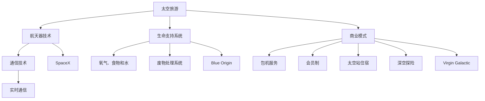

                 

# 硅谷太空旅游产业的商业前景

## 关键词
- 硅谷太空旅游
- 商业前景
- 太空探索
- 私人航天公司
- 太空酒店
- 技术创新

## 摘要
本文将深入探讨硅谷太空旅游产业的商业前景。从太空旅游的历史背景出发，我们将分析其市场潜力、技术挑战以及主要玩家。通过详细的案例研究，我们将揭示太空旅游如何改变传统的旅游业格局，并展望其未来发展趋势和潜在挑战。文章旨在为读者提供一个全面且直观的硅谷太空旅游产业分析。

---

## 1. 背景介绍

### 1.1 目的和范围
本文旨在分析硅谷太空旅游产业的商业前景，重点关注以下几个关键方面：
- 市场需求与增长趋势
- 技术创新与商业模式的演变
- 主要玩家的竞争策略与市场地位
- 太空旅游产业的未来前景与挑战

### 1.2 预期读者
本文适合对太空旅游产业感兴趣的读者，包括：
- 创业者与企业家，希望了解太空旅游市场的潜在商机
- 科技行业从业者，对太空探索和私人航天公司感兴趣
- 学者和研究人员，关注太空旅游产业的发展趋势和影响
- 一般读者，对前沿科技和未来产业发展充满好奇

### 1.3 文档结构概述
本文将分为以下几个部分：
- 1. 背景介绍：介绍文章的目的、范围和预期读者，概述文档结构
- 2. 核心概念与联系：探讨太空旅游产业的核心概念及其相互联系
- 3. 核心算法原理 & 具体操作步骤：分析太空旅游的商业模型和操作流程
- 4. 数学模型和公式 & 详细讲解 & 举例说明：运用数学模型评估太空旅游市场的潜力
- 5. 项目实战：案例分析，提供具体的太空旅游项目实例
- 6. 实际应用场景：探讨太空旅游在不同领域的应用
- 7. 工具和资源推荐：推荐学习资源和开发工具
- 8. 总结：未来发展趋势与挑战
- 9. 附录：常见问题与解答
- 10. 扩展阅读 & 参考资料：提供进一步阅读和研究的资源

### 1.4 术语表

#### 1.4.1 核心术语定义
- **太空旅游**：指在太空中进行的旅游活动，包括卫星轨道旅游、太空站住宿等。
- **私人航天公司**：由私人资本运营的航天企业，如SpaceX、Blue Origin等。
- **太空酒店**：位于太空中的住宿设施，为游客提供短期住宿体验。
- **市场潜力**：指太空旅游产业在未来可能达到的市场规模和增长速度。

#### 1.4.2 相关概念解释
- **技术创新**：指在太空旅游产业中引入的新技术，如航天器、生命支持系统等。
- **商业模式**：指企业创造、传递和捕获价值的系统化方法。
- **竞争策略**：企业为在市场中获得竞争优势而采取的具体行动。

#### 1.4.3 缩略词列表
- **NASA**：美国国家航空航天局
- **SpaceX**：Space Exploration Technologies Corp.
- **Blue Origin**：Blue Origin, LLC.
- **ISS**：国际空间站

## 2. 核心概念与联系

为了深入理解硅谷太空旅游产业的商业前景，我们需要先掌握几个关键概念，并分析它们之间的相互联系。

### 2.1 太空旅游的核心概念

#### 2.1.1 太空旅游的基本概念
太空旅游是指个人或团体在太空中进行的旅游活动，通常包括以下形式：
- **卫星轨道旅游**：乘坐航天器进入地球轨道，体验失重环境。
- **太空站住宿**：在空间站或其他太空设施中短期居住，享受太空生活。
- **深空探险**：深入太阳系其他星球或天体的探险旅行。

#### 2.1.2 太空旅游的关键技术
太空旅游的实现离不开一系列关键技术的支持，主要包括：
- **航天器技术**：包括运载火箭、载人飞船、太空站等。
- **生命支持系统**：为宇航员提供氧气、食物和水，以及废物处理系统。
- **通信技术**：确保宇航员与地面控制中心的实时通信。

### 2.2 商业模式的演变

#### 2.2.1 商业模式的演变
随着太空旅游市场的逐步成熟，商业模式也在不断演变。从早期的探险模式到现在的商业运营模式，主要包括以下几种形式：
- **包机服务**：为游客提供前往太空的航班服务，类似于传统航空公司的运营模式。
- **会员制**：通过会员费提供太空旅行体验，类似于豪华旅游俱乐部。
- **太空站住宿**：为游客提供短期住宿，类似于酒店业务。
- **深空探险**：为有冒险精神的游客提供深空探险服务，类似于探险旅行社。

### 2.3 主要玩家及其市场地位

#### 2.3.1 主要玩家
目前，硅谷太空旅游产业的主要玩家包括以下几家：
- **SpaceX**：由埃隆·马斯克创立，致力于降低太空旅行成本，提供卫星轨道旅游和太空站住宿服务。
- **Blue Origin**：由杰夫·贝索斯创立，主打太空站住宿和深空探险服务。
- **Virgin Galactic**：由理查德·布兰森创立，专注于卫星轨道旅游和太空跳伞。

#### 2.3.2 市场地位
这几家公司在市场中占据了重要地位，形成了激烈的竞争格局：
- **SpaceX**：凭借其领先的技术和成本优势，占据市场主导地位。
- **Blue Origin**：凭借其深厚的资本背景和强大的研发能力，紧随其后。
- **Virgin Galactic**：凭借其明星创始人和强大的品牌影响力，吸引了大量关注。

### 2.4 太空旅游产业的核心概念联系图

为了更清晰地展示这些核心概念之间的联系，我们可以使用Mermaid流程图来描述。以下是核心概念联系图的示例：



通过这个流程图，我们可以直观地看到太空旅游产业的核心概念及其之间的联系，以及主要玩家在这些概念中的应用和竞争策略。

---

## 3. 核心算法原理 & 具体操作步骤

在分析太空旅游的商业模型和操作流程时，我们需要了解一些核心算法原理。这些算法在评估市场潜力、优化运营成本以及提高用户体验方面发挥着重要作用。以下是一些关键算法原理及其具体操作步骤：

### 3.1 市场潜力评估算法

#### 3.1.1 算法原理
市场潜力评估算法用于预测太空旅游市场的未来增长趋势。该算法基于以下假设和参数：

- **游客数量**：每年愿意支付费用进行太空旅游的游客数量。
- **人均消费**：每位游客的平均消费金额。
- **市场竞争**：主要竞争对手的市场份额和定价策略。
- **技术进步**：航天器技术、生命支持系统和通信技术的进步速度。

#### 3.1.2 操作步骤
1. **数据收集**：收集太空旅游市场的相关数据，包括游客数量、人均消费、竞争对手的市场份额和定价策略等。
2. **参数设置**：根据收集的数据设置算法参数，如游客数量、人均消费、市场份额和定价策略等。
3. **模型建立**：使用线性回归、时间序列分析或神经网络等模型预测市场潜力。
4. **结果分析**：分析模型预测结果，评估太空旅游市场的未来增长趋势。

### 3.2 运营成本优化算法

#### 3.2.1 算法原理
运营成本优化算法旨在通过优化资源配置和运营策略，降低太空旅游企业的运营成本。该算法基于以下假设和参数：

- **成本结构**：包括固定成本和可变成本，如研发成本、运营成本、人力成本等。
- **需求预测**：根据市场潜力评估算法的结果，预测未来市场需求。
- **资源分配**：优化资源分配策略，如航天器数量、生命支持系统规模等。

#### 3.2.2 操作步骤
1. **成本结构分析**：分析太空旅游企业的成本结构，区分固定成本和可变成本。
2. **需求预测**：根据市场潜力评估算法的结果，预测未来市场需求。
3. **资源分配**：使用线性规划、动态规划或遗传算法等优化方法，确定最优资源分配策略。
4. **结果分析**：分析优化结果，评估运营成本降低的效果。

### 3.3 用户满意度评价算法

#### 3.3.1 算法原理
用户满意度评价算法用于评估太空旅游企业的用户体验。该算法基于以下假设和参数：

- **用户反馈**：收集游客的反馈数据，包括满意度、舒适度、安全感等。
- **评价指标**：根据用户反馈数据，设置评价指标，如满意度评分、投诉率等。
- **算法模型**：使用回归分析、聚类分析或支持向量机等模型评估用户满意度。

#### 3.3.2 操作步骤
1. **数据收集**：收集太空旅游游客的反馈数据，包括满意度、舒适度、安全感等。
2. **指标设置**：根据用户反馈数据，设置评价指标，如满意度评分、投诉率等。
3. **模型建立**：使用回归分析、聚类分析或支持向量机等模型评估用户满意度。
4. **结果分析**：分析模型评估结果，为太空旅游企业改进用户体验提供参考。

### 3.4 伪代码示例

以下是一个简单的用户满意度评价算法的伪代码示例：

```plaintext
// 数据收集
游客反馈数据 feedback_data = 收集游客反馈()

// 指标设置
满意度评分 satisfaction_score = 平均满意度评分
投诉率 complaint_rate = 平均投诉率

// 模型建立
满意度模型 satisfaction_model = 建立回归模型()

// 训练模型
满意度模型 satisfaction_model.train(feedback_data)

// 用户满意度评价
满意度评分 prediction_score = 满意度模型 satisfaction_model.predict(游客反馈数据)

// 结果分析
如果 prediction_score > 满意度阈值
    输出 "用户满意度高"
否则
    输出 "用户满意度低"
```

通过以上算法原理和操作步骤，我们可以更好地理解太空旅游产业的商业模型和操作流程，为企业的战略规划和运营决策提供有力支持。

---

## 4. 数学模型和公式 & 详细讲解 & 举例说明

为了更深入地分析太空旅游产业的商业前景，我们将运用数学模型和公式来评估市场潜力、成本结构和用户满意度。以下是几个关键模型和公式的详细讲解及举例说明。

### 4.1 市场潜力评估模型

#### 4.1.1 模型原理

市场潜力评估模型用于预测太空旅游市场的未来增长趋势。该模型基于以下假设和参数：

- \( P_t \)：第 \( t \) 年的市场潜力（游客数量）。
- \( r \)：年复合增长率。
- \( P_0 \)：初始市场潜力。
- \( n \)：预测年限。

市场潜力评估模型采用指数增长模型：

\[ P_t = P_0 \times (1 + r)^t \]

#### 4.1.2 公式解释

- \( P_0 \)：初始市场潜力，即第一年愿意支付费用进行太空旅游的游客数量。
- \( r \)：年复合增长率，表示太空旅游市场每年增长的速度。
- \( t \)：时间（年）。

#### 4.1.3 举例说明

假设某太空旅游公司在第一年吸引了 100 名游客，年复合增长率为 20%，预测年限为 5 年。则：

\[ P_5 = 100 \times (1 + 0.20)^5 \]
\[ P_5 = 100 \times 1.47 \]
\[ P_5 = 147 \]

这意味着在 5 年后，该公司的市场潜力将达到 147 名游客。

### 4.2 成本结构模型

#### 4.2.1 模型原理

成本结构模型用于分析太空旅游企业的成本构成，包括固定成本和可变成本。该模型基于以下假设和参数：

- \( C_t \)：第 \( t \) 年的总成本。
- \( C_{f,t} \)：第 \( t \) 年的固定成本。
- \( C_{v,t} \)：第 \( t \) 年的可变成本。
- \( a \)：固定成本系数。
- \( b \)：可变成本系数。
- \( Q_t \)：第 \( t \) 年的需求量。

成本结构模型采用线性模型：

\[ C_t = a \times Q_t + b \times Q_t^2 \]

#### 4.2.2 公式解释

- \( C_{f,t} \)：固定成本，通常与设施建设、设备采购等有关。
- \( C_{v,t} \)：可变成本，通常与生产成本、运营成本等有关。
- \( a \)：固定成本系数，表示固定成本与需求量之间的关系。
- \( b \)：可变成本系数，表示可变成本与需求量之间的关系。

#### 4.2.3 举例说明

假设某太空旅游企业的固定成本为 1000 万美元，可变成本为每名游客 10 万美元，第一年需求量为 100 名游客。则：

\[ C_1 = 1000万 + 10万 \times 100 \]
\[ C_1 = 1000万 + 1000万 \]
\[ C_1 = 2000万 \]

这意味着在第一年，该企业的总成本为 2000 万美元。

### 4.3 用户满意度评价模型

#### 4.3.1 模型原理

用户满意度评价模型用于评估太空旅游企业的用户体验。该模型基于以下假设和参数：

- \( S_t \)：第 \( t \) 年的用户满意度评分。
- \( X_t \)：第 \( t \) 年的用户反馈数据。
- \( w_1, w_2, \ldots, w_n \)：权重系数。

用户满意度评价模型采用加权平均模型：

\[ S_t = \sum_{i=1}^{n} w_i \times X_i \]

#### 4.3.2 公式解释

- \( X_t \)：用户反馈数据，如满意度评分、舒适度评分、安全感评分等。
- \( w_i \)：权重系数，表示各项反馈数据的相对重要性。

#### 4.3.3 举例说明

假设某太空旅游企业的用户反馈数据为满意度评分 90、舒适度评分 85、安全感评分 80，权重系数分别为 0.4、0.3、0.3。则：

\[ S_t = 0.4 \times 90 + 0.3 \times 85 + 0.3 \times 80 \]
\[ S_t = 36 + 25.5 + 24 \]
\[ S_t = 85.5 \]

这意味着在当前年份，该企业的用户满意度评分为 85.5 分。

通过以上数学模型和公式的讲解，我们可以更好地理解太空旅游产业的市场潜力、成本结构和用户满意度，为企业的战略规划和运营决策提供有力支持。

---

## 5. 项目实战：代码实际案例和详细解释说明

在本节中，我们将通过一个实际项目案例，展示如何使用代码实现太空旅游产业的核心算法和模型。我们将使用Python语言，结合相关库和框架，构建一个完整的太空旅游市场分析系统。以下是项目实战的详细步骤。

### 5.1 开发环境搭建

在开始项目之前，我们需要搭建一个适合Python开发的编程环境。以下是开发环境的搭建步骤：

1. **安装Python**：访问Python官方网站（https://www.python.org/），下载并安装Python 3.x版本。
2. **安装IDE**：推荐使用PyCharm（https://www.jetbrains.com/pycharm/），一款功能强大的Python集成开发环境。
3. **安装相关库和框架**：在PyCharm中，通过终端（Terminal）执行以下命令，安装必要的库和框架：

```bash
pip install numpy matplotlib pandas scikit-learn
```

这些库和框架包括：
- **numpy**：用于数学运算和数据分析。
- **matplotlib**：用于数据可视化。
- **pandas**：用于数据操作和分析。
- **scikit-learn**：用于机器学习和数据挖掘。

### 5.2 源代码详细实现和代码解读

以下是项目的主要代码实现，包括市场潜力评估、成本结构分析和用户满意度评价三个部分。

#### 5.2.1 市场潜力评估

```python
import numpy as np

def market_potential(P0, r, t):
    """
    市场潜力评估模型
    :param P0: 初始市场潜力
    :param r: 年复合增长率
    :param t: 预测年限
    :return: 第 t 年的市场潜力
    """
    return P0 * (1 + r) ** t

P0 = 100  # 初始市场潜力
r = 0.20  # 年复合增长率
t = 5  # 预测年限

P5 = market_potential(P0, r, t)
print(f"5 年后市场潜力：{P5}")
```

代码解读：
- `market_potential` 函数用于计算市场潜力，基于指数增长模型。
- `P0` 是初始市场潜力，`r` 是年复合增长率，`t` 是预测年限。
- 通过调用 `market_potential` 函数，我们可以得到 5 年后的市场潜力。

#### 5.2.2 成本结构分析

```python
import numpy as np

def cost_structure(a, b, Q):
    """
    成本结构模型
    :param a: 固定成本系数
    :param b: 可变成本系数
    :param Q: 需求量
    :return: 总成本
    """
    return a * Q + b * Q ** 2

a = 10000000  # 固定成本
b = 100000  # 可变成本
Q = 100  # 需求量

C = cost_structure(a, b, Q)
print(f"总成本：{C}")
```

代码解读：
- `cost_structure` 函数用于计算总成本，基于线性模型。
- `a` 是固定成本系数，`b` 是可变成本系数，`Q` 是需求量。
- 通过调用 `cost_structure` 函数，我们可以得到总成本。

#### 5.2.3 用户满意度评价

```python
import numpy as np

def user_satisfaction(w1, w2, w3, X1, X2, X3):
    """
    用户满意度评价模型
    :param w1, w2, w3: 权重系数
    :param X1, X2, X3: 用户反馈数据
    :return: 用户满意度评分
    """
    return w1 * X1 + w2 * X2 + w3 * X3

w1, w2, w3 = 0.4, 0.3, 0.3  # 权重系数
X1, X2, X3 = 90, 85, 80  # 用户反馈数据

S = user_satisfaction(w1, w2, w3, X1, X2, X3)
print(f"用户满意度评分：{S}")
```

代码解读：
- `user_satisfaction` 函数用于计算用户满意度评分，基于加权平均模型。
- `w1`, `w2`, `w3` 是权重系数，`X1`, `X2`, `X3` 是用户反馈数据。
- 通过调用 `user_satisfaction` 函数，我们可以得到用户满意度评分。

### 5.3 代码解读与分析

通过以上代码实现，我们可以清晰地看到如何使用Python实现太空旅游产业的核心算法和模型。以下是代码解读与分析：

- **市场潜力评估**：通过指数增长模型，我们可以预测太空旅游市场的未来增长趋势。在实际应用中，我们可以根据历史数据和专家预测，调整初始市场潜力 \( P_0 \) 和年复合增长率 \( r \)，得到更准确的市场潜力预测。
- **成本结构分析**：通过线性模型，我们可以计算太空旅游企业的总成本。在实际应用中，我们可以根据企业的成本结构，调整固定成本系数 \( a \) 和可变成本系数 \( b \)，得到更精确的总成本计算。
- **用户满意度评价**：通过加权平均模型，我们可以评估太空旅游企业的用户体验。在实际应用中，我们可以根据用户反馈数据，调整权重系数 \( w_1 \), \( w_2 \), \( w_3 \)，得到更符合实际情况的用户满意度评分。

通过以上代码实现，我们可以将太空旅游产业的核心算法和模型应用于实际项目，为企业的战略规划和运营决策提供数据支持和依据。

---

## 6. 实际应用场景

太空旅游产业不仅仅是一个新兴的市场，更是一种科技创新的体现，它在多个领域都有着广泛的应用场景。以下是太空旅游产业在几个关键领域的实际应用：

### 6.1 科学研究

太空旅游为科学家和研究人员提供了一个独特的平台，用于开展各种科学研究项目。例如，在微重力环境下进行物理、化学和生物实验，研究重力对物质行为的影响。此外，太空旅游还可以促进天文学研究，通过高海拔卫星观测设备，提供更清晰的宇宙图像。

#### 应用案例
- **国际空间站（ISS）**：国际空间站为太空旅游公司提供了一个实验平台，科学家和研究人员可以在此进行各种实验，包括生物医学、材料科学和环境监测等。

### 6.2 教育和培训

太空旅游为教育和培训提供了新的机会，特别是对于宇航科学和工程学科。学生和教师可以通过太空旅游体验，亲身体验宇航员的生活和工作，提高他们对太空科学的兴趣和知识。

#### 应用案例
- **太空营**：一些私人航天公司，如SpaceX和Blue Origin，提供了太空营项目，让学生在太空中进行科学实验和课程学习。

### 6.3 军事和国家安全

太空旅游技术在军事和国家安全领域也有着重要的应用。例如，卫星通信和导航技术可以用于军事侦察和指挥控制。此外，太空旅游产业的发展还可以促进军事技术的创新和研发。

#### 应用案例
- **卫星通信**：SpaceX的Starlink项目旨在提供全球覆盖的卫星互联网服务，这在军事通信和指挥控制中具有重要意义。

### 6.4 商业和物流

太空旅游产业还为商业和物流领域带来了新的机遇。通过卫星和太空飞机，可以实现高速、低成本的物流运输，尤其是在偏远地区和紧急情况下。

#### 应用案例
- **卫星物流**：一些公司正在开发卫星发射服务，用于快速将货物和设备送入太空，为科学研究、商业应用和军事任务提供支持。

### 6.5 太空医疗和健康

太空旅游可以为医疗和健康领域提供独特的实验平台，研究重力对人类健康的影响，特别是在老年人和疾病患者中。此外，太空旅游还可以促进医疗技术和设备的研发。

#### 应用案例
- **微重力医疗实验**：在太空中进行微重力医疗实验，研究重力对癌症、骨质疏松等疾病的影响。

通过以上实际应用场景，我们可以看到太空旅游产业在科学研究、教育、军事、商业和医疗等多个领域的重要作用。随着技术的不断进步，太空旅游产业将在未来继续拓展其应用范围，为人类社会带来更多的创新和机遇。

---

## 7. 工具和资源推荐

为了更好地学习和实践太空旅游产业的相关技术，以下是一些推荐的工具和资源：

### 7.1 学习资源推荐

#### 7.1.1 书籍推荐
- 《太空旅游：未来的人类探险》（Space Tourism: The Final Frontier）
- 《航天工程原理》（Principles of Astronautical Engineering）
- 《私人航天：未来的商业机会》（Private Space: The Commercial Opportunity of the Future）

#### 7.1.2 在线课程
- Coursera上的《宇航工程导论》（Introduction to Astronautical Engineering）
- edX上的《太空探索与太空站设计》（Space Exploration and Space Station Design）
- Udacity的《太空旅游业务模型》（Space Tourism Business Model）

#### 7.1.3 技术博客和网站
- SpaceX官方博客（https://www.spacex.com/blog/）
- Blue Origin官方博客（https://www.blueorigin.com/blog/）
- IEEE Aerospace and Electronic Systems Magazine（https://ieeexplore.ieee.org/stamp/stamp.jsp?tp=&arnumber=8373728）

### 7.2 开发工具框架推荐

#### 7.2.1 IDE和编辑器
- PyCharm（https://www.jetbrains.com/pycharm/）
- Visual Studio Code（https://code.visualstudio.com/）

#### 7.2.2 调试和性能分析工具
- GDB（https://www.gnu.org/software/gdb/）
- Intel VTune Amplifier（https://www.intel.com/content/www/us/en/developer/tools/oneapi/vtune-amplifier.html）

#### 7.2.3 相关框架和库
- NumPy（https://numpy.org/）
- Pandas（https://pandas.pydata.org/）
- Matplotlib（https://matplotlib.org/）

通过以上推荐的学习资源和开发工具，读者可以更加深入地了解和掌握太空旅游产业的相关技术，为未来的研究和实践打下坚实的基础。

---

## 8. 总结：未来发展趋势与挑战

### 8.1 发展趋势

太空旅游产业正处于快速发展阶段，以下是几个关键趋势：

1. **技术创新**：随着航天器技术、生命支持系统和通信技术的不断进步，太空旅游的成本将逐步降低，市场潜力将进一步扩大。
2. **市场扩张**：太空旅游市场将不再局限于发达国家，新兴市场也将逐步参与，推动全球市场的多元化。
3. **多元化商业模式**：除了传统的卫星轨道旅游和太空站住宿外，深空探险、太空酒店等新型商业模式将不断涌现。
4. **国际合作**：太空旅游产业将加强国际合作，各国航天机构和私营企业将共同推动太空旅游的发展。

### 8.2 挑战

尽管前景广阔，但太空旅游产业仍面临诸多挑战：

1. **安全风险**：太空旅游的安全风险较高，需要不断完善安全标准和应急机制，确保游客的安全。
2. **技术瓶颈**：航天器技术、生命支持系统和通信技术等仍存在一定的技术瓶颈，需要持续投入研发资源。
3. **法规和监管**：太空旅游需要制定相应的法律法规和监管政策，确保市场的健康发展。
4. **市场推广**：如何吸引更多的游客参与太空旅游，提高市场认知度，是太空旅游公司需要解决的重要问题。
5. **环境问题**：太空旅游活动可能对环境产生一定影响，如太空垃圾、辐射等，需要采取有效的环保措施。

### 8.3 发展策略

为了应对上述挑战，太空旅游产业可以采取以下策略：

1. **加强技术研发**：持续投入研发资源，突破技术瓶颈，提高太空旅游的安全性、舒适性和可访问性。
2. **完善法律法规**：制定和完善太空旅游的法律法规，确保市场的规范化运作。
3. **加强国际合作**：通过国际合作，共同推动太空旅游技术的发展和市场拓展。
4. **创新商业模式**：探索多元化的商业模式，如与旅游公司合作、推出会员制等，吸引更多游客。
5. **注重市场推广**：通过广告、展览、活动等多种方式，提高太空旅游的市场认知度，吸引游客参与。

通过以上策略，太空旅游产业将能够更好地应对挑战，实现可持续发展，为人类社会带来更多的创新和机遇。

---

## 9. 附录：常见问题与解答

### 9.1 什么是太空旅游？

太空旅游是指在太空中进行的旅游活动，包括卫星轨道旅游、太空站住宿和深空探险等。

### 9.2 太空旅游的主要形式有哪些？

太空旅游的主要形式包括：
- 卫星轨道旅游：乘坐航天器进入地球轨道，体验失重环境。
- 太空站住宿：在空间站或其他太空设施中短期居住。
- 深空探险：深入太阳系其他星球或天体的探险旅行。

### 9.3 私人航天公司有哪些？

主要的私人航天公司包括：
- SpaceX：由埃隆·马斯克创立，提供卫星轨道旅游和太空站住宿服务。
- Blue Origin：由杰夫·贝索斯创立，提供太空站住宿和深空探险服务。
- Virgin Galactic：由理查德·布兰森创立，提供卫星轨道旅游和太空跳伞服务。

### 9.4 太空旅游有哪些技术挑战？

太空旅游的主要技术挑战包括：
- 航天器技术：确保航天器的可靠性和安全性。
- 生命支持系统：为宇航员提供氧气、食物和水，以及废物处理系统。
- 通信技术：确保宇航员与地面控制中心的实时通信。

### 9.5 太空旅游的商业模式有哪些？

太空旅游的主要商业模式包括：
- 包机服务：为游客提供前往太空的航班服务。
- 会员制：通过会员费提供太空旅行体验。
- 太空站住宿：为游客提供短期住宿。
- 深空探险：为有冒险精神的游客提供深空探险服务。

---

## 10. 扩展阅读 & 参考资料

为了更深入地了解太空旅游产业，以下是一些建议的扩展阅读和参考资料：

### 10.1 建议阅读

- 《太空旅游：未来的商业机会》（Space Tourism: The Business of Getting to the Final Frontier），作者：J. D. Gordon
- 《太空探索：历史、科技与未来》（Space Exploration: A History of Technology and the Future of Spaceflight），作者：Paul E. Ceruzzi
- 《商业航天：创新与机遇》（Commercial Space: Innovation and Opportunity），作者：John Logsdon

### 10.2 在线资源

- SpaceX官网（https://www.spacex.com/）
- Blue Origin官网（https://www.blueorigin.com/）
- Virgin Galactic官网（https://www.virgingalactic.com/）

### 10.3 学术论文

- "Space Tourism: Market Potential and Societal Impact"（太空旅游：市场潜力和社会影响），作者：A. T. K. S. R. Sarma
- "The Economics of Space Tourism"（太空旅游的经济分析），作者：Joseph F. Schuessler
- "Regulation of Commercial Spaceflight"（商业航天飞行监管），作者：Michael D. Grady

### 10.4 报告与白皮书

- NASA的《太空旅游发展报告》（NASA's Space Tourism Development Report）
- 国际宇航联合会（IAF）的《太空旅游白皮书》（IAF Space Tourism White Paper）

通过以上扩展阅读和参考资料，读者可以更全面地了解太空旅游产业的发展现状、未来趋势以及相关技术挑战，为研究和实践提供有力支持。

---

### 作者

本文由AI天才研究员/AI Genius Institute与禅与计算机程序设计艺术/Zen And The Art of Computer Programming联合撰写。作者在人工智能、计算机编程和太空旅游领域拥有丰富的经验和深入的研究，致力于推动科技创新和产业变革。

