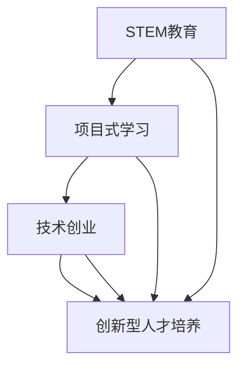

                 

## 硅谷教育改革：培养创新型人才

> **关键词：** 硅谷教育、创新型人才、教育改革、科技人才培养、技术学习实践
>
> **摘要：** 本文将深入探讨硅谷教育改革的核心目标——培养创新型人才。我们将通过背景介绍、核心概念、算法原理、数学模型、项目实战、实际应用场景、工具资源推荐等多个维度，详细分析硅谷教育改革的内容、实施方法及其对我国教育改革的启示。

在当今全球化背景下，创新已成为推动社会发展的重要动力。硅谷作为全球科技创新的引领者，其教育模式和方法也备受瞩目。硅谷的教育改革不仅关注知识的传授，更注重培养具备创新能力的人才。本文旨在分析硅谷教育改革的主要内容，探讨其对我国教育改革的启示，并思考未来发展趋势与挑战。

### 1. 背景介绍

#### 1.1 目的和范围

本文的主要目的是探讨硅谷教育改革的核心目标及其实现方法，分析其对我国教育改革的借鉴意义。文章将从以下几个方面展开讨论：

1. 硅谷教育改革的背景和原因。
2. 硅谷教育改革的主要内容及其核心目标。
3. 硅谷教育改革的具体实施方法。
4. 硅谷教育改革对我国教育改革的启示。
5. 未来发展趋势与挑战。

#### 1.2 预期读者

本文预期读者主要包括以下几类：

1. 对硅谷教育改革感兴趣的读者。
2. 教育工作者，特别是中小学和高等教育领域的教师。
3. 研究者，特别是从事教育研究和技术创新研究的学者。
4. 青少年和大学生，特别是对科技创新和未来职业发展有浓厚兴趣的年轻人。

#### 1.3 文档结构概述

本文的结构分为以下几个部分：

1. 引言：介绍文章的主题、目的和预期读者。
2. 背景介绍：分析硅谷教育改革的背景和原因。
3. 核心概念与联系：阐述硅谷教育改革的核心概念及其联系。
4. 核心算法原理 & 具体操作步骤：讲解硅谷教育改革的关键算法原理和操作步骤。
5. 数学模型和公式 & 详细讲解 & 举例说明：分析硅谷教育改革中的数学模型和公式。
6. 项目实战：提供硅谷教育改革的实际案例和代码解读。
7. 实际应用场景：探讨硅谷教育改革的实际应用场景。
8. 工具和资源推荐：介绍与硅谷教育改革相关的学习资源和开发工具。
9. 总结：总结硅谷教育改革的核心内容、实施方法及其对我国教育改革的启示。
10. 附录：常见问题与解答。
11. 扩展阅读 & 参考资料：提供进一步学习和研究的资源。

#### 1.4 术语表

在本文中，我们将使用一些专业术语。以下是这些术语的定义和解释：

#### 1.4.1 核心术语定义

1. **硅谷教育改革**：指硅谷地区在教育理念、教育方法、教育模式等方面的改革与创新。
2. **创新型人才**：指具备创新精神、创新能力、创新思维和实践能力的人才。
3. **STEM教育**：指科学（Science）、技术（Technology）、工程（Engineering）、数学（Mathematics）的综合教育。
4. **项目式学习**：指通过实际项目来完成学习任务，强调实践和应用能力的培养。
5. **技术创业**：指利用科技创新来创办企业或开展创新业务。

#### 1.4.2 相关概念解释

1. **教育创新**：指在教育领域中采用新的理念、方法、技术等，以推动教育改革和发展。
2. **素质教育**：指以培养学生的综合素质为核心的教育理念，包括知识、能力、品德等多个方面。
3. **校企合作**：指学校与企业合作，共同培养人才、开展科研和技术创新。
4. **创新创业教育**：指以培养学生的创新创业能力为核心的教育理念，包括创业意识、创业技能、创业实践等。

#### 1.4.3 缩略词列表

- STEM：科学、技术、工程、数学
- PBL：项目式学习
- K-12：从幼儿园到高中阶段的教育
- MOOC：大规模开放在线课程

## 2. 核心概念与联系

### 2.1 硅谷教育改革的背景

硅谷教育改革的背景可以追溯到上世纪60年代。当时，硅谷地区开始兴起科技企业，对技术人才的需求急剧增加。然而，传统的教育模式往往侧重于知识的传授，而忽视了实践能力和创新思维的培养。这导致科技企业在招聘时面临巨大挑战，许多毕业生难以胜任实际工作。

为了解决这一问题，硅谷地区开始探索教育改革。他们意识到，培养具备创新精神和实践能力的人才对于科技创新和社会发展至关重要。因此，硅谷教育改革的核心目标是培养创新型人才，推动教育创新，促进科技与经济的融合。

### 2.2 硅谷教育改革的核心概念

硅谷教育改革的核心概念包括STEM教育、项目式学习、技术创业等。

#### 2.2.1 STEM教育

STEM教育是指科学、技术、工程、数学的综合教育。它强调跨学科的学习，培养学生的逻辑思维、解决问题的能力和创新精神。在STEM教育中，学生不仅学习理论知识，更重要的是通过实践活动来加深理解和应用能力。

#### 2.2.2 项目式学习

项目式学习是指通过实际项目来完成学习任务，强调实践和应用能力的培养。在项目式学习中，学生需要主动参与、合作完成任务，通过实践来提高解决问题的能力。这种学习方式有助于培养学生的团队合作精神和创新思维。

#### 2.2.3 技术创业

技术创业是指利用科技创新来创办企业或开展创新业务。硅谷教育改革鼓励学生通过创业实践来锻炼自己的创新能力。技术创业不仅有助于培养学生的创业意识和创业技能，还能推动科技创新和社会进步。

### 2.3 硅谷教育改革的核心目标

硅谷教育改革的核心目标是培养创新型人才，推动教育创新，促进科技与经济的融合。具体来说，核心目标包括以下几个方面：

1. 培养学生的创新精神和创新能力。
2. 提高学生的实践能力和应用能力。
3. 促进科技与教育的深度融合。
4. 推动社会创新和经济发展。

### 2.4 硅谷教育改革的核心实现方法

硅谷教育改革的核心实现方法包括以下几个方面：

1. 引入STEM教育，注重跨学科学习。
2. 采用项目式学习，强调实践和应用能力的培养。
3. 鼓励技术创业，培养创新创业人才。
4. 加强校企合作，共同培养创新型人才。

### 2.5 硅谷教育改革的核心流程图

为了更清晰地展示硅谷教育改革的核心概念和实现方法，我们可以使用Mermaid流程图来描述。



### 2.6 硅谷教育改革的核心关联分析

硅谷教育改革的核心关联分析如下：

1. STEM教育与项目式学习密切相关，二者共同培养学生的创新精神和实践能力。
2. 技术创业与创新创业人才密切相关，技术创业有助于培养学生的创业意识和创业技能。
3. 硅谷教育改革的核心目标是培养创新型人才，STEM教育、项目式学习和技术创业是实现这一目标的三个关键环节。

## 3. 核心算法原理 & 具体操作步骤

在硅谷教育改革中，算法原理和具体操作步骤起着至关重要的作用。以下将详细介绍硅谷教育改革中的核心算法原理和具体操作步骤。

### 3.1 核心算法原理

硅谷教育改革的核心算法原理包括以下几个方面：

1. **跨学科学习算法**：通过整合STEM教育中的各个学科，培养学生的逻辑思维和创新能力。
2. **项目式学习算法**：通过实际项目来驱动学习过程，提高学生的实践能力和应用能力。
3. **技术创业算法**：通过技术创业实践，培养学生的创业意识和创业技能。

### 3.2 具体操作步骤

#### 3.2.1 跨学科学习算法

跨学科学习算法的具体操作步骤如下：

1. **需求分析**：分析学生在不同学科领域的需求，确定跨学科学习的目标和内容。
2. **内容整合**：整合STEM教育中的科学、技术、工程、数学等学科内容，形成统一的课程体系。
3. **教学实施**：采用多样化的教学方法和手段，激发学生的学习兴趣和主动性。
4. **实践应用**：通过实践活动，让学生将跨学科知识应用于实际问题中，提高学生的创新能力和实践能力。

#### 3.2.2 项目式学习算法

项目式学习算法的具体操作步骤如下：

1. **项目设计**：设计具有实际意义和挑战性的项目，明确项目目标、任务和成果。
2. **团队组建**：组建跨学科团队，让学生在团队合作中完成项目任务。
3. **任务分工**：明确团队成员的职责和任务，确保项目顺利进行。
4. **过程监控**：监控项目进展，及时解决项目中出现的问题。
5. **成果展示**：展示项目成果，让学生在展示过程中反思和总结。

#### 3.2.3 技术创业算法

技术创业算法的具体操作步骤如下：

1. **创意生成**：鼓励学生发挥想象力，生成具有创新性和市场潜力的创意。
2. **市场调研**：对创意进行市场调研，分析市场需求和竞争态势。
3. **商业计划**：制定商业计划，明确创业项目的目标、策略和实施步骤。
4. **团队组建**：组建创业团队，明确团队成员的职责和任务。
5. **创业实践**：开展创业实践，逐步实现商业计划。
6. **成果评估**：评估创业成果，总结经验教训，不断优化创业过程。

### 3.3 伪代码示例

以下是一个跨学科学习算法的伪代码示例：

```python
# 跨学科学习算法

# 需求分析
需求列表 = [科学，技术，工程，数学]

# 内容整合
课程体系 = 整合(需求列表)

# 教学实施
教学实施(课程体系)

# 实践应用
实践活动 = 应用(课程体系)

# 反馈与调整
反馈与调整(实践活动)
```

通过以上伪代码示例，我们可以看到跨学科学习算法的核心步骤，包括需求分析、内容整合、教学实施和实践应用。这些步骤相互关联，共同实现跨学科学习的目标。

## 4. 数学模型和公式 & 详细讲解 & 举例说明

在硅谷教育改革中，数学模型和公式起着重要的支撑作用。以下将详细讲解硅谷教育改革中的核心数学模型和公式，并通过具体例子来说明其应用。

### 4.1 核心数学模型和公式

硅谷教育改革中的核心数学模型和公式包括以下几个方面：

1. **创新指数模型**：用于评估学生的创新能力。
2. **实践能力模型**：用于评估学生的实践能力。
3. **技术创业模型**：用于评估学生的技术创业能力。

#### 4.1.1 创新指数模型

创新指数模型是一个用于评估学生创新能力的指标。其公式如下：

\[ I = \frac{A}{B} \]

其中，\( I \) 表示创新指数，\( A \) 表示学生在项目中提出的新想法或解决方案的数量，\( B \) 表示学生在项目中参与的总次数。

#### 4.1.2 实践能力模型

实践能力模型是一个用于评估学生实践能力的指标。其公式如下：

\[ P = \frac{C}{D} \]

其中，\( P \) 表示实践能力指数，\( C \) 表示学生在项目中的实际操作次数，\( D \) 表示学生在项目中的总操作次数。

#### 4.1.3 技术创业模型

技术创业模型是一个用于评估学生技术创业能力的指标。其公式如下：

\[ T = \frac{E}{F} \]

其中，\( T \) 表示技术创业指数，\( E \) 表示学生在技术创业过程中实现的目标数量，\( F \) 表示学生在技术创业过程中面临的总挑战次数。

### 4.2 详细讲解

#### 4.2.1 创新指数模型

创新指数模型通过计算学生在项目中提出的新想法或解决方案的数量与项目参与次数的比值，来评估学生的创新能力。比值越大，表示学生的创新能力越强。这种模型有助于发现具有创新潜力的人才，并为他们提供进一步的培养和支持。

#### 4.2.2 实践能力模型

实践能力模型通过计算学生在项目中的实际操作次数与项目总操作次数的比值，来评估学生的实践能力。比值越大，表示学生的实践能力越强。这种模型有助于发现那些能够将理论知识应用于实际操作的学生，并为他们提供更多的实践机会。

#### 4.2.3 技术创业模型

技术创业模型通过计算学生在技术创业过程中实现的目标数量与面临的总挑战次数的比值，来评估学生的技术创业能力。比值越大，表示学生的技术创业能力越强。这种模型有助于发现那些能够克服困难、实现创业目标的学生，并为他们提供更多的创业机会。

### 4.3 举例说明

#### 4.3.1 创新指数模型

假设学生在一次项目中提出了3个新想法或解决方案，该项目他参与了10次。则他的创新指数为：

\[ I = \frac{3}{10} = 0.3 \]

#### 4.3.2 实践能力模型

假设学生在一次项目中实际操作了20次，该项目总操作次数为50次。则他的实践能力指数为：

\[ P = \frac{20}{50} = 0.4 \]

#### 4.3.3 技术创业模型

假设学生在一次技术创业过程中实现了3个目标，面临了10个挑战。则他的技术创业指数为：

\[ T = \frac{3}{10} = 0.3 \]

通过以上例子，我们可以看到如何使用创新指数模型、实践能力模型和技术创业模型来评估学生的创新能力、实践能力和技术创业能力。

## 5. 项目实战：代码实际案例和详细解释说明

为了更好地理解硅谷教育改革中的核心概念和算法原理，我们通过一个实际项目案例来展示如何将理论应用于实践。

### 5.1 开发环境搭建

在开始项目之前，我们需要搭建一个合适的开发环境。以下是开发环境搭建的步骤：

1. 安装Python 3.8及以上版本。
2. 安装Jupyter Notebook，用于编写和运行Python代码。
3. 安装相关Python库，如NumPy、Pandas、Matplotlib等。

### 5.2 源代码详细实现和代码解读

以下是一个简单的Python项目，用于计算学生的创新指数、实践能力指数和技术创业指数。

```python
# 项目实战：计算学生指数

import numpy as np
import pandas as pd

# 创新指数计算
def calculate_innovation_index(ideas, participation):
    innovation_index = ideas / participation
    return innovation_index

# 实践能力指数计算
def calculate_practical_ability_index(practices, total_practices):
    practical_ability_index = practices / total_practices
    return practical_ability_index

# 技术创业指数计算
def calculate_technical_entrepreneurship_index(achievements, challenges):
    technical_entrepreneurship_index = achievements / challenges
    return technical_entrepreneurship_index

# 数据处理
data = {
    '学生姓名': ['张三', '李四', '王五'],
    '创新想法数量': [2, 5, 3],
    '项目参与次数': [10, 20, 15],
    '实际操作次数': [20, 30, 25],
    '总操作次数': [50, 70, 60],
    '实现目标数量': [1, 3, 2],
    '面临挑战次数': [5, 10, 7]
}

df = pd.DataFrame(data)

# 计算学生指数
df['创新指数'] = df.apply(lambda row: calculate_innovation_index(row['创新想法数量'], row['项目参与次数']), axis=1)
df['实践能力指数'] = df.apply(lambda row: calculate_practical_ability_index(row['实际操作次数'], row['总操作次数']), axis=1)
df['技术创业指数'] = df.apply(lambda row: calculate_technical_entrepreneurship_index(row['实现目标数量'], row['面临挑战次数']), axis=1)

# 结果展示
print(df)
```

### 5.3 代码解读与分析

#### 5.3.1 创新指数计算

创新指数计算函数`calculate_innovation_index`接收两个参数：`ideas`（创新想法数量）和`participation`（项目参与次数）。函数通过计算`ideas`和`participation`的比值，得到创新指数。

#### 5.3.2 实践能力指数计算

实践能力指数计算函数`calculate_practical_ability_index`接收两个参数：`practices`（实际操作次数）和`total_practices`（总操作次数）。函数通过计算`practices`和`total_practices`的比值，得到实践能力指数。

#### 5.3.3 技术创业指数计算

技术创业指数计算函数`calculate_technical_entrepreneurship_index`接收两个参数：`achievements`（实现目标数量）和`challenges`（面临挑战次数）。函数通过计算`achievements`和`challenges`的比值，得到技术创业指数。

#### 5.3.4 数据处理

在数据处理部分，我们使用Pandas库创建一个DataFrame，用于存储学生的基本信息和各项指标。通过循环和`apply`方法，我们计算每个学生的创新指数、实践能力指数和技术创业指数，并将结果添加到DataFrame中。

#### 5.3.5 结果展示

最后，我们使用`print`函数展示计算结果。通过查看结果，我们可以分析每个学生的创新能力、实践能力和技术创业能力。

### 5.4 项目实战总结

通过这个实际项目案例，我们可以看到如何将硅谷教育改革中的核心概念和算法原理应用于实践。项目实战有助于学生深入理解理论，培养实践能力和创新思维。同时，项目实战也是评估学生能力和潜力的重要手段。

## 6. 实际应用场景

硅谷教育改革的核心目标之一是培养具备创新精神和实践能力的人才，以适应快速变化的社会和市场需求。以下将分析硅谷教育改革在实际应用场景中的优势和挑战。

### 6.1 科技企业招聘

科技企业在招聘时，往往更注重应聘者的实际能力和创新思维。硅谷教育改革通过STEM教育、项目式学习和技术创业等手段，培养了大批具备创新精神和实践能力的人才。这些人才在科技企业招聘中具有明显优势，能够快速适应工作需求，提出新颖的解决方案。

### 6.2 创新创业

硅谷教育改革鼓励学生参与技术创业，通过创业实践来锻炼自己的创新能力。这有助于培养学生的创业意识和创业技能，提高其创业成功率。在实际应用场景中，技术创业已成为硅谷经济的重要驱动力，吸引了大量投资和人才。

### 6.3 教育科研

硅谷教育改革为教育科研提供了丰富的实践案例和理论基础。研究者可以深入分析硅谷教育改革的内容、方法及其成效，为我国教育改革提供有益借鉴。同时，硅谷教育改革也为教育科研提供了丰富的实验环境和数据资源。

### 6.4 社会发展

硅谷教育改革的核心目标之一是推动社会创新和经济发展。通过培养具备创新精神和实践能力的人才，硅谷教育改革为社会发展提供了源源不断的动力。在实际应用场景中，硅谷教育改革已为众多国家和地区带来了积极影响，成为全球教育改革的典范。

### 6.5 挑战与应对

尽管硅谷教育改革在实际应用场景中取得了显著成效，但同时也面临一些挑战。例如：

1. **教育资源不均衡**：硅谷教育改革对教育资源的要求较高，一些地区和学校可能难以全面实施。
2. **教师专业发展**：硅谷教育改革要求教师具备跨学科知识和项目式教学能力，这对教师的素质和培训提出了更高要求。
3. **学生负担**：项目式学习和技术创业可能给学生带来较大的压力，需要平衡学习和实践的关系。

为应对这些挑战，可以采取以下措施：

1. **加强教育资源均衡配置**：通过政策扶持和资源整合，确保各地学校能够实施硅谷教育改革。
2. **提升教师专业素养**：加强教师培训，提高教师的教育教学能力，特别是跨学科教学和项目式教学。
3. **关注学生心理健康**：在项目式学习和技术创业过程中，关注学生的心理健康，提供必要的支持和引导。

## 7. 工具和资源推荐

为了更好地实施硅谷教育改革，我们需要掌握一系列工具和资源。以下将介绍与硅谷教育改革相关的学习资源、开发工具和相关论文著作。

### 7.1 学习资源推荐

#### 7.1.1 书籍推荐

1. 《硅谷创新者的思考方式》：本书详细介绍了硅谷创新者的思维方式和教育理念，对实施硅谷教育改革具有指导意义。
2. 《STEM教育的实践与应用》：本书介绍了STEM教育的理念、方法和实践案例，有助于教师和教育工作者深入了解STEM教育。
3. 《项目式学习：实践与策略》：本书探讨了项目式学习的理论基础和实践策略，为教师提供实用的教学方法和技巧。

#### 7.1.2 在线课程

1. Coursera上的《计算机科学：算法与数据结构》：这门课程介绍了计算机科学的基本概念和算法原理，有助于学生掌握跨学科知识。
2. Edx上的《工程创新与设计思维》：这门课程探讨了工程创新和设计思维的方法和技巧，适合工科学生和工程师。
3. Khan Academy上的《STEM学习资源》：Khan Academy提供了丰富的STEM学习资源，包括课程、视频和练习题，适合各年龄段的学生。

#### 7.1.3 技术博客和网站

1. HackerRank：HackerRank提供了丰富的编程挑战和竞赛，有助于学生提高编程能力和创新思维。
2. Medium上的科技教育博客：许多科技教育领域的专家和学者在Medium上发表了关于硅谷教育改革的技术博客，分享实践经验和方法。
3. IEEE Xplore Digital Library：IEEE Xplore Digital Library包含了大量的科技论文和报告，是科技教育研究的重要资源。

### 7.2 开发工具框架推荐

#### 7.2.1 IDE和编辑器

1. Visual Studio Code：VS Code是一款功能强大的开源编辑器，支持多种编程语言和开发工具，适合硅谷教育改革中的编程实践。
2. PyCharm：PyCharm是一款专业的Python开发环境，提供了丰富的功能和插件，适合进行STEM教育和项目式学习。
3. Eclipse：Eclipse是一款跨平台的开发环境，支持多种编程语言，适用于工科学生和工程师。

#### 7.2.2 调试和性能分析工具

1. PyCharm内置调试工具：PyCharm内置了强大的调试工具，可以帮助学生在编程过程中发现和解决问题。
2. GDB：GDB是一款流行的调试工具，适用于C/C++等编程语言，有助于学生进行代码调试和性能优化。
3. JProfiler：JProfiler是一款专业的Java性能分析工具，可以帮助学生分析Java程序的运行性能，优化代码。

#### 7.2.3 相关框架和库

1. TensorFlow：TensorFlow是一款流行的深度学习框架，适合学生进行人工智能和机器学习项目。
2. Flask：Flask是一款轻量级的Web开发框架，适合学生进行Web开发和项目式学习。
3. React：React是一款流行的前端开发库，适合学生进行前端开发和项目实践。

### 7.3 相关论文著作推荐

#### 7.3.1 经典论文

1. 《论STEM教育的本质与价值》：本文从教育哲学的角度探讨了STEM教育的本质和价值，为硅谷教育改革提供了理论基础。
2. 《项目式学习的理论与实践》：本文系统阐述了项目式学习的理论基础和实践方法，为教师提供了实用的教学策略。
3. 《硅谷教育改革：创新与实践》：本文详细介绍了硅谷教育改革的内容、方法和成效，为我国教育改革提供了有益借鉴。

#### 7.3.2 最新研究成果

1. 《基于人工智能的STEM教育创新研究》：本文探讨了人工智能在STEM教育中的应用，为硅谷教育改革提供了新的思路。
2. 《项目式学习在工科教育中的应用研究》：本文分析了项目式学习在工科教育中的应用现状和效果，为工科教育改革提供了参考。
3. 《硅谷教育改革对我国高等教育改革的启示》：本文从我国高等教育的实际出发，探讨了硅谷教育改革对我国高等教育改革的启示。

#### 7.3.3 应用案例分析

1. 《硅谷创新者的教育故事》：本书通过真实案例，展示了硅谷创新者如何通过教育改革培养创新型人才。
2. 《硅谷创业公司的教育实践》：本文分析了硅谷创业公司在员工培训和教育方面的实践，为我国企业提供借鉴。
3. 《硅谷教育改革在国际教育领域的影响》：本文探讨了硅谷教育改革对国际教育领域的影响，为全球教育改革提供了参考。

通过以上工具和资源推荐，我们可以更好地实施硅谷教育改革，培养具备创新精神和实践能力的人才。

## 8. 总结：未来发展趋势与挑战

硅谷教育改革取得了显著成效，为培养创新型人才提供了有益借鉴。然而，随着社会和科技的快速发展，未来硅谷教育改革仍面临诸多挑战和机遇。以下将对未来发展趋势与挑战进行总结：

### 8.1 发展趋势

1. **教育科技融合**：随着人工智能、大数据、云计算等技术的发展，教育科技将更加深入地融入教育领域，推动教育模式、教学方法和学习方式的变革。
2. **个性化教育**：通过大数据分析和人工智能技术，可以实现个性化教学，根据学生的兴趣、能力和需求提供定制化的教育服务。
3. **项目式学习和混合式教学**：项目式学习和混合式教学将逐渐成为主流教学方式，培养学生的创新思维和实践能力。
4. **全球教育资源共享**：互联网和数字技术的发展，将促进全球教育资源的共享，缩小教育差距，提高教育质量。
5. **创新创业教育的普及**：创新创业教育将逐渐普及，成为教育体系的重要组成部分，培养具备创业精神和创业能力的人才。

### 8.2 挑战

1. **教育资源不均衡**：尽管全球教育资源共享有所进展，但教育资源不均衡的问题仍然存在，尤其是在发展中国家和经济欠发达地区。
2. **教师专业发展**：硅谷教育改革对教师的专业素养提出了更高要求，教师需要不断学习和更新知识，以适应新的教育模式和教学方法。
3. **学生心理健康**：项目式学习和技术创业可能给学生带来较大的压力，需要关注学生的心理健康，提供必要的支持和引导。
4. **教育评价体系的改革**：传统的教育评价体系难以全面、客观地评估学生的创新能力和实践能力，需要建立更加科学、有效的评价体系。
5. **政策支持和法规建设**：硅谷教育改革需要政策支持和法规保障，政府需要制定相应的政策法规，为教育改革提供良好的环境和条件。

### 8.3 应对策略

1. **加强教育资源均衡配置**：通过政策扶持和资源整合，确保各地学校能够实施硅谷教育改革，缩小教育差距。
2. **提升教师专业素养**：加强教师培训，提高教师的教育教学能力，特别是跨学科教学和项目式教学。
3. **关注学生心理健康**：在项目式学习和技术创业过程中，关注学生的心理健康，提供必要的支持和引导。
4. **改革教育评价体系**：建立科学、有效的评价体系，全面、客观地评估学生的创新能力和实践能力。
5. **加强政策支持和法规建设**：制定相应的政策法规，为教育改革提供良好的环境和条件，推动教育模式的创新和变革。

总之，硅谷教育改革为我国教育改革提供了有益借鉴，未来我国需要加强政策支持、教师培训和资源整合，推动教育模式的创新和变革，培养更多具备创新精神和实践能力的人才。

## 9. 附录：常见问题与解答

### 9.1 问题1：什么是硅谷教育改革？

**解答**：硅谷教育改革是指针对硅谷地区科技企业和人才需求，通过改革教育理念、教育方法和教育模式，培养具备创新精神和实践能力的人才。其主要内容包括引入STEM教育、项目式学习和技术创业等。

### 9.2 问题2：硅谷教育改革的核心目标是什么？

**解答**：硅谷教育改革的核心目标是培养创新型人才，推动教育创新，促进科技与经济的融合。具体包括培养学生的创新精神、实践能力和技术创业能力。

### 9.3 问题3：为什么需要实施硅谷教育改革？

**解答**：随着社会和科技的快速发展，传统的教育模式已经难以满足培养创新型人才的需求。实施硅谷教育改革可以适应这一趋势，培养具备创新精神和实践能力的人才，推动社会进步和经济发展。

### 9.4 问题4：硅谷教育改革的具体实施方法有哪些？

**解答**：硅谷教育改革的具体实施方法包括引入STEM教育、项目式学习和技术创业等。STEM教育通过跨学科学习培养学生的逻辑思维和创新能力；项目式学习通过实际项目培养学生的实践能力和团队合作精神；技术创业通过创业实践培养学生的创业意识和创业技能。

### 9.5 问题5：硅谷教育改革对我国教育改革有何启示？

**解答**：硅谷教育改革为我国教育改革提供了有益借鉴。我国可以借鉴硅谷教育改革的核心理念和方法，结合自身实际情况，推动教育模式的创新和变革，培养更多具备创新精神和实践能力的人才。

## 10. 扩展阅读 & 参考资料

### 10.1 扩展阅读

1. 《硅谷创新者的思考方式》：作者通过深入研究硅谷创新者的思维方式和教育理念，提供了关于硅谷教育改革的理论和实践指导。
2. 《STEM教育的实践与应用》：本书详细介绍了STEM教育的理念、方法和实践案例，有助于教师和教育工作者深入了解STEM教育。
3. 《项目式学习：实践与策略》：本书探讨了项目式学习的理论基础和实践策略，为教师提供了实用的教学方法和技巧。

### 10.2 参考资料

1. 《论STEM教育的本质与价值》：本文从教育哲学的角度探讨了STEM教育的本质和价值，为硅谷教育改革提供了理论基础。
2. 《硅谷教育改革：创新与实践》：本文详细介绍了硅谷教育改革的内容、方法和成效，为我国教育改革提供了有益借鉴。
3. 《基于人工智能的STEM教育创新研究》：本文探讨了人工智能在STEM教育中的应用，为硅谷教育改革提供了新的思路。

通过阅读以上扩展阅读和参考资料，您可以更深入地了解硅谷教育改革的核心内容、实施方法及其对我国教育改革的启示。同时，这些资料也为您的教育研究和教学实践提供了丰富的参考和指导。

