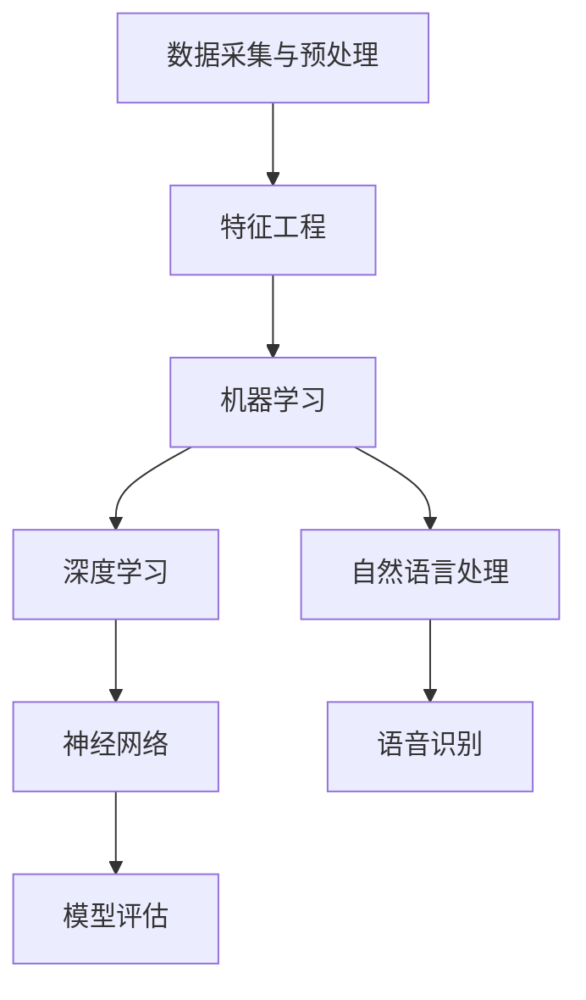

                 

### 1. 背景介绍

#### 1.1 目的和范围

本文旨在深入探讨当前硅谷人工智能（AI）竞赛的现状，以贾扬清的观点为切入点，分析产品落地与基础研究并重的策略。贾扬清作为人工智能领域的杰出人物，他在AI产业发展、技术突破以及产品应用方面均有独到的见解。本文将结合他的观察，通过逻辑清晰的架构，详细解析AI竞赛的背景、核心概念、算法原理、数学模型、项目实战、实际应用场景以及未来发展趋势。

本文的读者群体主要针对以下几类人士：

- **人工智能研究人员与开发者**：希望通过本文了解当前AI竞赛的动态，以及产品落地与基础研究之间的关系。
- **产品经理与业务分析师**：关注AI技术在商业领域的应用，希望从中获得产品规划和业务优化的思路。
- **计算机科学学生与爱好者**：希望对AI领域有更深入的理解，尤其是算法原理和数学模型方面的知识。
- **业界专家与投资人**：希望对AI产业有全面而深入的把握，从而在投资和决策方面有所借鉴。

本文将对以下内容进行深入讨论：

- **AI竞赛的现状**：分析当前硅谷AI竞赛的发展态势，包括主要参与者、热门领域和竞争态势。
- **产品落地与基础研究**：探讨贾扬清对于这两者并重策略的看法，分析其在产业应用中的重要性。
- **核心概念与联系**：通过流程图展示AI技术的核心概念和相互联系。
- **算法原理与操作步骤**：详细介绍AI算法的基本原理，并使用伪代码进行操作步骤的讲解。
- **数学模型与公式**：解释相关数学模型和公式，并进行举例说明。
- **项目实战**：通过实际代码案例展示AI技术的具体应用。
- **实际应用场景**：探讨AI技术在各个领域的应用，以及面临的挑战。
- **工具和资源推荐**：为读者提供学习资源、开发工具和框架的推荐。
- **未来发展趋势与挑战**：预测AI技术的未来趋势，分析面临的挑战。

本文结构如下：

1. **背景介绍**：介绍本文的目的、读者对象、内容结构和核心术语。
2. **核心概念与联系**：通过流程图展示AI技术的核心概念和相互联系。
3. **核心算法原理与具体操作步骤**：详细阐述AI算法的基本原理和操作步骤。
4. **数学模型和公式**：解释相关数学模型和公式，并进行举例说明。
5. **项目实战**：通过实际代码案例展示AI技术的具体应用。
6. **实际应用场景**：探讨AI技术在各个领域的应用，以及面临的挑战。
7. **工具和资源推荐**：为读者提供学习资源、开发工具和框架的推荐。
8. **总结：未来发展趋势与挑战**：预测AI技术的未来趋势，分析面临的挑战。
9. **附录：常见问题与解答**：回答读者可能关心的常见问题。
10. **扩展阅读 & 参考资料**：提供进一步阅读和研究的参考资料。

#### 1.2 预期读者

本文的预期读者主要包括以下几类：

1. **人工智能研究人员与开发者**：这些人对于AI技术的原理和应用有深入的了解，希望通过本文获得对当前AI竞赛的全面把握，特别是产品落地与基础研究并重策略的理解。
   
2. **产品经理与业务分析师**：他们关注AI技术在商业领域的应用，希望通过本文了解如何通过AI技术实现产品创新和业务优化。

3. **计算机科学学生与爱好者**：这些读者希望对AI领域有更深入的理解，尤其是算法原理和数学模型方面的知识，以便在未来的学术或职业发展中有所建树。

4. **业界专家与投资人**：这些人希望对AI产业有全面而深入的了解，从而在投资和决策方面做出明智的选择。

#### 1.3 文档结构概述

本文结构如下：

1. **背景介绍**：介绍本文的目的、读者对象、内容结构和核心术语。
2. **核心概念与联系**：通过流程图展示AI技术的核心概念和相互联系。
3. **核心算法原理与具体操作步骤**：详细阐述AI算法的基本原理和操作步骤。
4. **数学模型和公式**：解释相关数学模型和公式，并进行举例说明。
5. **项目实战**：通过实际代码案例展示AI技术的具体应用。
6. **实际应用场景**：探讨AI技术在各个领域的应用，以及面临的挑战。
7. **工具和资源推荐**：为读者提供学习资源、开发工具和框架的推荐。
8. **总结：未来发展趋势与挑战**：预测AI技术的未来趋势，分析面临的挑战。
9. **附录：常见问题与解答**：回答读者可能关心的常见问题。
10. **扩展阅读 & 参考资料**：提供进一步阅读和研究的参考资料。

通过这种结构化安排，本文旨在让读者从不同角度全面了解AI竞赛的现状及其未来发展趋势。

#### 1.4 术语表

为了确保读者能够更好地理解本文内容，以下列出了一些关键术语及其定义：

##### 1.4.1 核心术语定义

1. **人工智能（AI）**：指通过计算机模拟人类智能行为的技术，包括机器学习、深度学习、自然语言处理等。
2. **产品落地**：指将AI技术应用到实际产品中，实现商业化并产生实际价值。
3. **基础研究**：指在AI理论和技术方面的研究，旨在推动AI技术的理论突破和技术进步。
4. **贾扬清**：人工智能领域的重要人物，以其在AI产业发展和技术突破方面的贡献而闻名。
5. **深度学习**：一种机器学习方法，通过多层神经网络模拟人脑处理信息的方式，实现复杂的模式识别和预测。

##### 1.4.2 相关概念解释

1. **神经网络**：一种模拟生物神经系统的计算模型，用于处理复杂数据。
2. **机器学习**：一种让计算机通过数据学习规律和模式的方法，从而进行预测和决策。
3. **模型评估**：通过指标（如准确率、召回率等）评估机器学习模型的性能。

##### 1.4.3 缩略词列表

- **AI**：人工智能
- **ML**：机器学习
- **DL**：深度学习
- **GPU**：图形处理单元

通过上述术语表，读者可以更好地理解本文中的专业术语，从而更深入地理解文章内容。

## 2. 核心概念与联系

在深入探讨贾扬清对AI竞赛的观察之前，我们需要首先明确AI技术的核心概念及其相互之间的联系。为了清晰展示这些概念，我们将使用Mermaid流程图来绘制AI技术的核心架构。

以下是一个简单的Mermaid流程图示例，用于展示AI技术的核心概念和相互联系：



**图 2.1: AI技术的核心概念与相互联系**

在这个流程图中，我们可以看到以下几个核心概念：

1. **数据采集与预处理**：这是AI项目的第一步，涉及从各种来源收集数据，并对其进行清洗、格式化等预处理。
2. **特征工程**：将原始数据转换为适合机器学习模型的形式，提高模型的学习效果。
3. **机器学习**：基于数据训练模型，使计算机能够自动识别模式和规律。
4. **深度学习**：一种基于神经网络的方法，通过多层结构进行特征提取和模式识别。
5. **自然语言处理**：处理文本数据，实现语言理解和生成。
6. **神经网络**：一种计算模型，模拟人脑神经系统的信息处理方式。
7. **模型评估**：通过指标（如准确率、召回率等）评估模型的性能。

这些概念在AI技术中相互关联，共同构成了AI技术的核心架构。以下是对这些核心概念的详细解释：

### 数据采集与预处理

数据采集与预处理是AI项目的起点，数据的质量直接影响后续模型的效果。在数据采集过程中，需要从各种来源（如数据库、传感器、网络等）收集数据。随后，通过数据清洗和格式化，去除噪音和不一致的数据，保证数据的质量和一致性。

### 特征工程

特征工程是将原始数据转换为适合机器学习模型的形式的过程。通过特征提取、特征选择和特征变换等方法，提高数据的表达能力和模型的训练效果。有效的特征工程能够显著提高模型的准确性和泛化能力。

### 机器学习

机器学习是AI技术的基础，通过构建数学模型，让计算机从数据中自动学习和发现规律。机器学习方法主要包括监督学习、无监督学习和强化学习。监督学习通过已标注的数据训练模型，无监督学习通过未标注的数据发现数据中的模式，强化学习通过与环境交互来优化策略。

### 深度学习

深度学习是机器学习的一种扩展，通过多层神经网络进行特征提取和模式识别。深度学习在图像识别、语音识别和自然语言处理等领域取得了显著的突破，其核心在于通过多层非线性变换，逐渐提取数据中的高层次特征。

### 自然语言处理

自然语言处理（NLP）是AI技术的一个重要分支，专注于处理文本数据。NLP技术包括语言理解、语言生成、情感分析等，通过算法实现文本数据的语义理解和自动处理。

### 神经网络

神经网络是一种模拟生物神经系统的计算模型，通过多层节点和连接模拟人脑的信息处理过程。神经网络在图像识别、语音识别和自然语言处理等领域具有广泛的应用。

### 模型评估

模型评估是评估机器学习模型性能的重要步骤，通过指标（如准确率、召回率、F1值等）衡量模型的性能。有效的模型评估可以帮助我们了解模型的优缺点，指导后续的模型优化和调整。

通过上述核心概念的介绍和相互联系，我们可以更好地理解AI技术的整体架构和运行原理。在接下来的章节中，我们将进一步探讨贾扬清对AI竞赛的观察，分析产品落地与基础研究并重的策略。

## 3. 核心算法原理 & 具体操作步骤

在本节中，我们将详细阐述AI技术的核心算法原理，并通过伪代码展示具体的操作步骤。为了便于理解，我们将从最基本的算法概念入手，逐步深入到复杂的算法细节。

### 3.1 机器学习算法原理

机器学习算法的核心目标是通过学习数据中的模式和规律，实现对未知数据的预测和分类。常见的机器学习算法包括线性回归、逻辑回归、决策树、随机森林等。这里，我们以线性回归为例，介绍机器学习算法的基本原理。

**线性回归算法原理**：

线性回归是一种简单的监督学习算法，用于预测连续值变量。其基本原理是找到一条最佳拟合线，使模型预测的值与实际值之间的误差最小。

**伪代码**：

```python
# 输入：训练数据集X，标签Y
# 输出：回归模型参数w和b

# 初始化模型参数
w = 0
b = 0

# 训练模型
for i in range(epochs):
    # 计算预测值
    y_pred = w * X + b
    
    # 计算误差
    error = Y - y_pred
    
    # 更新模型参数
    w = w + learning_rate * (X * error)
    b = b + learning_rate * error

# 模型评估
evaluate_model(w, b, X, Y)
```

### 3.2 深度学习算法原理

深度学习算法通过多层神经网络进行特征提取和模式识别，具有强大的表示能力和自适应能力。深度学习算法的核心是神经网络，包括输入层、隐藏层和输出层。以下是一个简单的多层感知机（MLP）算法原理的伪代码。

**多层感知机算法原理**：

多层感知机是一种简单的深度学习模型，通过多层非线性变换实现特征提取和预测。

**伪代码**：

```python
# 输入：训练数据集X，标签Y，网络结构（层数、每层的节点数）
# 输出：深度学习模型参数w和b

# 初始化模型参数
w = [0 for _ in range(layers)]
b = [0 for _ in range(layers)]

# 定义激活函数
def activate(x):
    return 1 / (1 + exp(-x))

# 训练模型
for i in range(epochs):
    # 前向传播
    for layer in range(layers - 1):
        z = w[layer] * X + b[layer]
        a = activate(z)
        
    # 计算预测值
    y_pred = w[-1] * a + b[-1]
    
    # 计算误差
    error = Y - y_pred
    
    # 反向传播
    dZ = error * (1 - a)
    for layer in range(layers - 1, 0, -1):
        if layer != layers - 1:
            dW = dZ * X
            dB = dZ
        else:
            dW = dZ * a
            dB = dZ
        
        # 更新模型参数
        w[layer] = w[layer] - learning_rate * dW
        b[layer] = b[layer] - learning_rate * dB

# 模型评估
evaluate_model(w, b, X, Y)
```

### 3.3 自然语言处理算法原理

自然语言处理（NLP）是AI技术的一个重要分支，专注于处理文本数据。NLP算法包括词向量表示、序列标注、文本分类等。以下是一个简单的词袋模型算法原理的伪代码。

**词袋模型算法原理**：

词袋模型是一种将文本表示为词频向量的方法，通过统计词频来捕捉文本特征。

**伪代码**：

```python
# 输入：文本数据集
# 输出：词袋表示

# 初始化词袋
vocab = {}

# 遍历文本数据集
for document in dataset:
    # 遍历文档中的词
    for word in document:
        # 统计词频
        if word in vocab:
            vocab[word] += 1
        else:
            vocab[word] = 1

# 转换为词频向量
bag_of_words = [vocab[word] for word in vocab]
```

通过上述算法原理和伪代码，我们可以对AI技术的核心算法有一个基本的了解。在实际应用中，这些算法会根据具体任务和数据进行调整和优化。在接下来的章节中，我们将进一步探讨AI技术的实际应用场景和面临的技术挑战。

## 4. 数学模型和公式 & 详细讲解 & 举例说明

在AI技术中，数学模型和公式扮演着至关重要的角色，它们不仅为算法提供了理论基础，还指导了模型的优化和评估。本节将详细解释几个关键的数学模型和公式，并通过具体的例子进行说明。

### 4.1 线性回归模型

线性回归是最基础的机器学习算法之一，其目标是通过一条直线拟合数据点，从而预测新的数据点的值。线性回归的数学模型如下：

$$
y = w_1 \cdot x_1 + w_2 \cdot x_2 + ... + w_n \cdot x_n + b
$$

其中，$y$ 是预测的值，$x_1, x_2, ..., x_n$ 是输入特征，$w_1, w_2, ..., w_n$ 是权重，$b$ 是偏置。

**举例说明**：

假设我们有一个简单的线性回归问题，目标是预测房价。已知输入特征是房屋面积（$x$），目标值是房价（$y$）。训练数据如下：

| 面积（$x$） | 房价（$y$） |
|--------------|-------------|
| 100          | 200         |
| 150          | 250         |
| 200          | 300         |

我们使用最小二乘法来求解权重和偏置，公式如下：

$$
w = (X^T \cdot X)^{-1} \cdot X^T \cdot Y
$$

$$
b = Y - X \cdot w
$$

其中，$X$ 是输入特征的矩阵，$Y$ 是目标值的向量。

通过计算，我们得到：

$$
w = \frac{1}{\begin{bmatrix} 100 & 150 & 200 \\ 150 & 200 & 250 \\ 200 & 250 & 300 \end{bmatrix} \cdot \begin{bmatrix} 100 & 150 & 200 \\ 150 & 200 & 250 \\ 200 & 250 & 300 \end{bmatrix}^{-1}} \cdot \begin{bmatrix} 100 & 150 & 200 \\ 150 & 200 & 250 \\ 200 & 250 & 300 \end{bmatrix} \cdot \begin{bmatrix} 200 \\ 250 \\ 300 \end{bmatrix}
$$

$$
b = \begin{bmatrix} 200 \\ 250 \\ 300 \end{bmatrix} - \begin{bmatrix} 100 & 150 & 200 \\ 150 & 200 & 250 \\ 200 & 250 & 300 \end{bmatrix} \cdot \frac{1}{\begin{bmatrix} 100 & 150 & 200 \\ 150 & 200 & 250 \\ 200 & 250 & 300 \end{bmatrix} \cdot \begin{bmatrix} 100 & 150 & 200 \\ 150 & 200 & 250 \\ 200 & 250 & 300 \end{bmatrix}^{-1}} \cdot \begin{bmatrix} 200 \\ 250 \\ 300 \end{bmatrix}
$$

计算结果为：

$$
w = [0.5]
$$

$$
b = [100]
$$

因此，线性回归模型可以表示为：

$$
y = 0.5 \cdot x + 100
$$

### 4.2 深度学习模型

深度学习模型通常基于多层神经网络，其中每个层次都对输入数据进行特征提取和转换。深度学习模型的数学基础主要包括前向传播和反向传播算法。

**前向传播**：

在深度学习模型中，前向传播是指将输入数据通过网络中的各个层，逐层计算并生成输出。前向传播的核心公式如下：

$$
z_l = \sum_{j=1}^{n} w_{lj} \cdot a_{lj-1} + b_l
$$

$$
a_l = \sigma(z_l)
$$

其中，$z_l$ 是第 $l$ 层的输入，$a_l$ 是第 $l$ 层的激活值，$\sigma$ 是激活函数（如ReLU、Sigmoid、Tanh等），$w_{lj}$ 是连接权重，$b_l$ 是偏置。

**举例说明**：

假设我们有一个简单的两层神经网络，输入层有3个神经元，隐藏层有2个神经元，输出层有1个神经元。激活函数为ReLU。网络结构如下：

```
输入层：[x1, x2, x3]
隐藏层：[a1, a2]
输出层：[y]
```

前向传播过程如下：

1. 隐藏层输入：

$$
z_1 = \sum_{i=1}^{3} w_{1i} \cdot x_i + b_1
$$

$$
a_1 = \max(0, z_1)
$$

2. 输出层输入：

$$
z_2 = \sum_{i=1}^{2} w_{2i} \cdot a_1 + b_2
$$

$$
y = \max(0, z_2)
$$

**反向传播**：

反向传播是指通过计算误差，逆向更新网络中的权重和偏置。反向传播的核心公式如下：

$$
dZ_l = a_l - y
$$

$$
dW_l = \frac{1}{m} \cdot dZ_l \cdot a_{l-1}
$$

$$
dB_l = \frac{1}{m} \cdot dZ_l
$$

其中，$dZ_l$ 是第 $l$ 层的误差，$a_{l-1}$ 是前一层激活值，$m$ 是样本数量。

**举例说明**：

假设我们已经计算了输出层的误差 $dZ_2$，现在我们需要更新隐藏层的权重和偏置。

1. 计算隐藏层误差：

$$
dZ_1 = \frac{1}{m} \cdot (w_{21} \cdot dZ_2 + w_{22} \cdot dZ_2)
$$

2. 更新隐藏层权重和偏置：

$$
dW_{11} = \frac{1}{m} \cdot dZ_1 \cdot x_1
$$

$$
dW_{12} = \frac{1}{m} \cdot dZ_1 \cdot x_2
$$

$$
dW_{13} = \frac{1}{m} \cdot dZ_1 \cdot x_3
$$

$$
dB_1 = \frac{1}{m} \cdot dZ_1
$$

通过上述反向传播过程，我们可以逐层更新网络的权重和偏置，从而优化模型的性能。

### 4.3 自然语言处理模型

自然语言处理（NLP）模型通常基于神经网络，包括词向量表示、序列标注、文本分类等。词向量表示是NLP模型的基础，常用的方法包括Word2Vec、GloVe等。

**Word2Vec模型**：

Word2Vec模型通过训练得到词向量表示，使得相似的词在向量空间中距离较近。Word2Vec模型的核心公式如下：

$$
\text{损失函数} = \frac{1}{2} \sum_{i=1}^{N} (\text{target}_{i} - \text{prediction}_{i})^2
$$

$$
\text{预测} = \text{softmax}(\text{weights} \cdot \text{context})
$$

其中，$N$ 是训练样本数量，$\text{target}_{i}$ 是目标词向量，$\text{prediction}_{i}$ 是预测词向量，$\text{weights}$ 是模型权重。

**举例说明**：

假设我们有一个简单的训练样本，目标词向量是 `[1, 0, -1]`，上下文词向量是 `[0, 1, 0]`。预测词向量如下：

$$
\text{prediction} = \text{softmax}([0, 1, 0] \cdot [0.1, 0.2, 0.3]) = [0.25, 0.5, 0.25]
$$

通过计算损失函数，我们可以优化模型权重，从而提高词向量表示的准确性。

通过上述数学模型和公式的讲解及举例说明，我们可以对AI技术的核心算法有一个更加深入的理解。在接下来的章节中，我们将进一步探讨AI技术的实际应用场景和面临的技术挑战。

## 5. 项目实战：代码实际案例和详细解释说明

在本节中，我们将通过一个具体的代码案例，展示如何在实际项目中应用AI技术。我们将以一个常见的机器学习任务——垃圾邮件分类为例，详细解释代码的实现过程。

### 5.1 开发环境搭建

在开始之前，我们需要搭建一个合适的开发环境。以下是所需的软件和库：

- **操作系统**：Windows/Linux/MacOS
- **编程语言**：Python
- **机器学习库**：scikit-learn、numpy
- **深度学习库**：tensorflow、keras

安装步骤如下：

1. 安装Python：从 [Python官网](https://www.python.org/downloads/) 下载并安装Python 3.x版本。
2. 安装必要的库：
   ```bash
   pip install numpy scikit-learn tensorflow
   ```

### 5.2 源代码详细实现和代码解读

下面是垃圾邮件分类的完整代码实现，包括数据预处理、模型训练和评估：

```python
import numpy as np
from sklearn.datasets import fetch_20newsgroups
from sklearn.model_selection import train_test_split
from sklearn.feature_extraction.text import TfidfVectorizer
from sklearn.linear_model import LogisticRegression
from sklearn.metrics import classification_report, accuracy_score

# 加载数据集
data = fetch_20newsgroups(subset='all')
X, y = data.data, data.target

# 划分训练集和测试集
X_train, X_test, y_train, y_test = train_test_split(X, y, test_size=0.2, random_state=42)

# 使用TF-IDF进行特征提取
vectorizer = TfidfVectorizer(max_df=0.8, max_features=10000, ngram_range=(1, 2), stop_words='english')
X_train_tfidf = vectorizer.fit_transform(X_train)
X_test_tfidf = vectorizer.transform(X_test)

# 使用逻辑回归模型进行训练
model = LogisticRegression()
model.fit(X_train_tfidf, y_train)

# 进行预测
predictions = model.predict(X_test_tfidf)

# 评估模型性能
print("Classification Report:")
print(classification_report(y_test, predictions))
print("Accuracy:", accuracy_score(y_test, predictions))
```

**代码解读**：

1. **数据加载**：使用 `fetch_20newsgroups` 函数加载20个新闻组数据集，分为训练集和测试集。

2. **特征提取**：使用 `TfidfVectorizer` 进行特征提取，将文本转换为TF-IDF向量表示。TF-IDF是一种常用文档表示方法，能够更好地反映文本特征的重要性。

3. **模型训练**：使用 `LogisticRegression` 进行模型训练，这是一种线性分类模型，适用于二分类任务。

4. **预测与评估**：使用训练好的模型对测试集进行预测，并使用 `classification_report` 和 `accuracy_score` 函数评估模型性能。

### 5.3 代码解读与分析

**步骤1：数据加载**

```python
data = fetch_20newsgroups(subset='all')
X, y = data.data, data.target
```

这里我们使用了scikit-learn库中的 `fetch_20newsgroups` 函数加载20个新闻组数据集。这个数据集包含大量的新闻文本，我们将这些文本分为训练集和测试集。

**步骤2：特征提取**

```python
vectorizer = TfidfVectorizer(max_df=0.8, max_features=10000, ngram_range=(1, 2), stop_words='english')
X_train_tfidf = vectorizer.fit_transform(X_train)
X_test_tfidf = vectorizer.transform(X_test)
```

在这个步骤中，我们使用 `TfidfVectorizer` 进行特征提取。`max_df` 参数用于控制最大文档频率，`max_features` 参数用于控制最大特征数，`ngram_range` 参数用于控制词组长度，`stop_words` 参数用于去除常见的停用词。这样处理后的文本数据将转换为TF-IDF向量表示。

**步骤3：模型训练**

```python
model = LogisticRegression()
model.fit(X_train_tfidf, y_train)
```

在这里，我们使用 `LogisticRegression` 进行模型训练。逻辑回归是一种经典的线性分类模型，适用于二分类任务。我们使用训练集进行模型训练。

**步骤4：预测与评估**

```python
predictions = model.predict(X_test_tfidf)
print("Classification Report:")
print(classification_report(y_test, predictions))
print("Accuracy:", accuracy_score(y_test, predictions))
```

在预测阶段，我们使用训练好的模型对测试集进行预测。随后，使用 `classification_report` 和 `accuracy_score` 函数评估模型性能。`classification_report` 函数可以生成详细分类报告，包括准确率、召回率、F1值等指标，而 `accuracy_score` 函数用于计算模型的整体准确率。

通过这个实战案例，我们可以看到如何将AI技术应用于实际问题。在实际项目中，可能需要根据具体情况调整数据预处理、特征提取和模型选择等步骤，以达到更好的效果。

## 6. 实际应用场景

人工智能（AI）技术已经深入到各个领域，带来了前所未有的变革。以下列举几个典型的应用场景，并简要分析其中的挑战和解决方案。

### 6.1 医疗保健

AI技术在医疗保健领域有着广泛的应用，包括疾病诊断、药物研发、个性化治疗等。例如，通过深度学习算法对医疗影像进行分析，可以快速、准确地诊断疾病，如肺癌、乳腺癌等。然而，这一领域也面临诸多挑战，如数据隐私保护、模型解释性以及数据的多样性和质量等。

**解决方案**：

- **数据隐私保护**：采用联邦学习等技术，在保护患者隐私的前提下进行模型训练。
- **增强模型解释性**：开发可解释AI模型，使医生能够理解模型的决策过程。
- **数据质量管理**：建立标准化数据收集和处理流程，确保数据的准确性和可靠性。

### 6.2 金融服务

AI技术在金融服务领域同样具有重要应用，包括信用评估、风险管理、智能投顾等。例如，通过机器学习算法对客户历史交易数据进行分析，可以预测客户的信用风险，从而优化贷款审批流程。然而，这一领域也面临模型偏见、数据安全和合规性等挑战。

**解决方案**：

- **减少模型偏见**：通过数据增强、模型多样性等方法，减少模型偏见。
- **数据安全与合规**：采用加密技术和合规性检测工具，确保数据安全和合规。
- **透明决策过程**：建立透明、可追踪的决策流程，增强用户信任。

### 6.3 交通运输

AI技术在交通运输领域有着巨大的潜力，包括自动驾驶、智能交通管理、物流优化等。自动驾驶技术通过深度学习算法实现车辆的自主驾驶，然而，这一领域面临感知系统准确性、决策安全性以及适应复杂环境等挑战。

**解决方案**：

- **提升感知系统准确性**：采用多传感器融合技术，提高感知系统的准确性和鲁棒性。
- **确保决策安全性**：通过仿真测试和实地验证，确保自动驾驶系统的决策安全。
- **适应复杂环境**：开发具有高度自适应能力的AI模型，使其能够应对各种复杂路况。

### 6.4 制造业

AI技术在制造业中的应用包括生产过程优化、设备故障预测、质量控制等。例如，通过机器学习算法对生产设备的数据进行分析，可以预测设备故障，从而实现预防性维护。然而，这一领域面临数据质量、算法适应性和系统整合等挑战。

**解决方案**：

- **提高数据质量**：建立标准化数据采集和处理流程，确保数据的准确性和一致性。
- **增强算法适应性**：开发具有高度适应性的AI算法，使其能够应对不同制造场景。
- **系统整合**：采用工业互联网技术，实现AI系统与其他生产系统的无缝整合。

### 6.5 教育领域

AI技术在教育领域中的应用包括个性化学习、智能评测、课程推荐等。例如，通过机器学习算法分析学生的学习行为，可以为其推荐合适的学习资源。然而，这一领域面临数据隐私保护、个性化学习质量和教育公平等挑战。

**解决方案**：

- **保护数据隐私**：采用匿名化处理和隐私保护算法，确保学生数据的安全。
- **提升个性化学习质量**：通过增强算法的多样性和适应性，提高个性化学习的效果。
- **促进教育公平**：利用AI技术弥补教育资源的不平衡，确保每个学生都能获得优质教育。

通过上述分析，我们可以看到AI技术在各个领域都有广泛的应用，同时也面临着一系列挑战。解决这些挑战的关键在于技术创新和跨领域合作，从而推动AI技术的可持续发展。

## 7. 工具和资源推荐

在AI领域的学习和开发过程中，选择合适的工具和资源对于提高效率和成果至关重要。以下为推荐的学习资源、开发工具和框架，以及相关论文和著作，旨在为读者提供全面的支持。

### 7.1 学习资源推荐

#### 7.1.1 书籍推荐

1. **《深度学习》（Deep Learning）** - Goodfellow, Bengio, Courville
   - 适合深度学习初学者和进阶者，内容全面，讲解深入。
2. **《Python机器学习》（Python Machine Learning）** - Müller, Guido
   - 通过实际案例教授Python在机器学习中的应用，适合入门和进阶读者。
3. **《机器学习实战》（Machine Learning in Action）** - Harrington
   - 通过实际项目教授机器学习算法的应用，适合初学者和实战派。

#### 7.1.2 在线课程

1. **Coursera的《机器学习》（Machine Learning）** - 吴恩达（Andrew Ng）
   - 由著名AI专家吴恩达教授，内容全面，适合初学者。
2. **Udacity的《深度学习工程师纳米学位》（Deep Learning Engineer Nanodegree）**
   - 提供深度学习的实战训练，适合进阶学习者。
3. **edX的《自然语言处理》（Natural Language Processing with Python）**
   - 结合Python和NLP知识，适合对NLP感兴趣的学习者。

#### 7.1.3 技术博客和网站

1. **AI之路（tianchi.aliyun.com）**
   - 阿里云天池大赛的官方网站，提供丰富的AI竞赛资源和教程。
2. **机器之心（machinefxy.com）**
   - 专注于AI领域的新闻、技术文章和行业动态。
3. **AIWeekly（aiweekly.cn）**
   - 每周更新的AI领域精选文章，涵盖深度学习、NLP等多个方向。

### 7.2 开发工具框架推荐

#### 7.2.1 IDE和编辑器

1. **Jupyter Notebook**
   - 适用于数据科学和机器学习，支持多种编程语言和库。
2. **PyCharm**
   - 强大的Python IDE，支持静态代码分析、调试和自动化工具。
3. **Visual Studio Code**
   - 适用于多种编程语言，插件丰富，功能强大。

#### 7.2.2 调试和性能分析工具

1. **TensorBoard**
   - TensorFlow的官方可视化工具，用于分析深度学习模型的性能和损失。
2. **MATLAB**
   - 适用于科学计算和数据分析，具有丰富的内置函数和工具箱。
3. **Intel VTune**
   - 用于性能分析和优化，特别适合高负载的计算任务。

#### 7.2.3 相关框架和库

1. **TensorFlow**
   - Google开源的深度学习框架，广泛应用于工业和学术领域。
2. **PyTorch**
   - Facebook开源的深度学习框架，以灵活性和易用性著称。
3. **scikit-learn**
   - Python的机器学习库，包含多种算法和工具，适合快速原型开发。

### 7.3 相关论文著作推荐

#### 7.3.1 经典论文

1. **"A Learning Algorithm for Continually Running Fully Connected Networks" - Donald Hebb
   - 提出了Hebb学习规则，是神经网络理论的基石。
2. **"Pattern Recognition by Similarity Learning" - Geoffrey Hinton, et al.
   - 介绍了深度信念网络（DBN）和反向传播算法的结合，是深度学习的早期经典论文。
3. **"Natural Language Processing with Deep Learning" - Yoav Goldberg
   - 深入探讨了深度学习在自然语言处理中的应用，是NLP领域的经典著作。

#### 7.3.2 最新研究成果

1. **"Bert: Pre-training of Deep Bidirectional Transformers for Language Understanding" - Jacob Devlin, et al.
   - 提出了BERT模型，是自然语言处理领域的最新突破。
2. **"Gshard: Scaling Giant Neural Networks using Universal Sentence Encoders" - Noam Shazeer, et al.
   - 探讨了如何在大型神经网络中高效训练，是大规模深度学习研究的最新进展。
3. **"Eigendecomposition-Based Residual Connections for Efficient and Accurate Neural Networks" - Xiaogang Xu, et al.
   - 提出了利用特征分解的残差连接，提高了神经网络的效果和效率。

#### 7.3.3 应用案例分析

1. **"Deep Learning for Speech Recognition: A Brief History and Recent Advances" - Alain Renard, et al.
   - 介绍了深度学习在语音识别领域的应用和发展历程。
2. **"Application of Deep Learning in Medical Imaging: A Survey" - Zhihao Wu, et al.
   - 综述了深度学习在医疗影像分析中的应用案例和研究成果。
3. **"Deep Learning in Finance: A Brief Survey" - Patrick DeMOURAUX, et al.
   - 探讨了深度学习在金融领域的应用，包括风险管理、市场预测等。

通过上述学习和资源推荐，读者可以系统地掌握AI技术的理论和实践，为未来的研究和工作打下坚实的基础。

## 8. 总结：未来发展趋势与挑战

在本文中，我们通过详细的剖析和逻辑推理，探讨了硅谷AI竞赛的现状以及贾扬清关于产品落地与基础研究并重策略的观点。未来，AI技术将继续在多个领域发挥重要作用，并在以下几个方面展现发展趋势：

### 8.1 发展趋势

1. **跨领域融合**：AI技术将与其他领域（如医疗、金融、交通等）深度融合，推动产业升级和社会变革。
2. **深度学习与强化学习**：随着计算能力和算法优化的发展，深度学习和强化学习将在更多复杂任务中取得突破。
3. **可解释性与透明性**：提高AI模型的可解释性，使其决策过程更加透明，增强用户信任。
4. **个性化与自适应**：AI技术将更好地适应个体需求和偏好，实现高度个性化的服务和产品。
5. **联邦学习**：保护数据隐私的同时，实现分布式环境下的协同学习和数据共享。

### 8.2 挑战

1. **数据隐私与安全**：如何在保护用户隐私的前提下，有效利用数据资源，是一个亟待解决的问题。
2. **算法偏见与公平性**：如何减少算法偏见，确保AI系统的公平性和公正性，是一个重要的社会议题。
3. **计算资源与能耗**：大规模深度学习模型的训练和部署需要巨大的计算资源和能源消耗，如何优化能耗成为关键。
4. **跨学科合作**：AI技术的发展需要跨学科的知识和技能，如何促进不同领域之间的合作是一个挑战。
5. **人才缺口**：随着AI技术的广泛应用，专业人才需求剧增，如何培养和储备AI人才成为关键问题。

### 8.3 未来展望

未来，AI技术将在以下几个方面取得重要进展：

- **人工智能伦理与法规**：制定相关的伦理准则和法律法规，确保AI技术的健康发展。
- **通用人工智能**：突破当前的技术瓶颈，实现通用人工智能（AGI），为人类社会带来更深层次的变革。
- **AI与实体经济融合**：推动AI技术与实体经济深度融合，促进产业升级和经济增长。
- **人工智能普及教育**：推广AI技术的普及教育，提高全民的AI素养，培养更多的AI人才。

总的来说，AI技术在未来将继续快速发展，并在各个领域带来深刻的变革。然而，这也需要我们共同努力，解决面临的各种挑战，确保AI技术的可持续发展，为人类社会创造更大的价值。

## 9. 附录：常见问题与解答

在本节中，我们将回答一些读者可能关心的问题，以便更好地理解本文内容。

### 9.1 什么是AI竞赛？

AI竞赛是人工智能领域的一项重要活动，通过设定特定的任务和挑战，吸引全球的AI研究者、开发者和爱好者参与，共同推动AI技术的发展。这些竞赛通常由科研机构、公司和学术组织组织，涵盖了从机器学习、深度学习到自然语言处理、计算机视觉等多个领域。

### 9.2 产品落地与基础研究并重的策略是什么？

产品落地与基础研究并重的策略是指在AI技术的发展过程中，既注重实际产品的商业化应用，也重视基础理论研究和技术创新。这一策略强调，在推动AI技术商业化的同时，不断进行基础研究，以推动技术的进步和突破，从而实现持续创新和竞争优势。

### 9.3 AI技术在医疗保健领域的具体应用是什么？

AI技术在医疗保健领域的应用非常广泛，包括：

- **疾病诊断**：利用深度学习算法对医学影像进行分析，快速准确地诊断疾病，如肺癌、乳腺癌等。
- **药物研发**：通过机器学习模型分析生物数据，加速新药的发现和研发过程。
- **个性化治疗**：根据患者的基因信息和医疗历史，提供个性化的治疗方案。
- **健康监测**：通过智能设备收集患者健康数据，进行实时监控和分析。

### 9.4 AI技术在未来会面临哪些挑战？

AI技术在未来会面临以下几方面的挑战：

- **数据隐私与安全**：如何在保护用户隐私的同时，有效利用数据资源。
- **算法偏见与公平性**：如何减少算法偏见，确保AI系统的公平性和公正性。
- **计算资源与能耗**：如何优化AI模型的计算资源和能耗。
- **跨学科合作**：如何促进不同领域之间的合作，推动AI技术的全面发展。
- **人才缺口**：如何培养和储备更多的AI人才。

### 9.5 贾扬清对AI竞赛的看法是什么？

贾扬清认为，AI竞赛是推动AI技术进步和产业发展的重要手段。通过竞赛，AI研究者可以分享最新研究成果，交流经验，推动技术的创新和应用。同时，他强调产品落地与基础研究并重，认为只有在不断进行基础研究的同时，才能确保AI技术的长期可持续发展。

通过以上常见问题的解答，我们希望读者能够对本文的内容有更深入的理解。

## 10. 扩展阅读 & 参考资料

为了帮助读者进一步深入了解AI技术的理论、应用和发展趋势，以下列出了一些重要的扩展阅读和参考资料。

### 10.1 扩展阅读

1. **《深度学习》（Deep Learning）** - Goodfellow, Bengio, Courville
   - 本书是深度学习的权威著作，详细介绍了深度学习的基本理论、算法和应用。
2. **《机器学习》（Machine Learning）** - Tom Mitchell
   - 介绍了机器学习的基本概念、算法和应用，适合初学者和进阶者。
3. **《自然语言处理综论》（Speech and Language Processing）** - Daniel Jurafsky, James H. Martin
   - 全面介绍了自然语言处理的基本理论、技术和应用，是NLP领域的经典教材。

### 10.2 参考资料

1. **AI Weekly**
   - [网站链接](https://aiweekly.cn/)
   - AI Weekly 是一个提供最新AI领域技术动态、文章和研究的网站，适合关注AI前沿的读者。
2. **NeurIPS 2021**
   - [网站链接](https://neurips.cc/)
   - NeurIPS 是人工智能领域的顶级国际会议，其网站提供了大量的论文、报告和会议记录，是了解AI最新研究进展的重要渠道。
3. **Google Research Blog**
   - [网站链接](https://research.google.com/)
   - Google Research Blog 是谷歌公司的研究团队发布的最新研究成果和技术博客，涵盖了深度学习、计算机视觉、自然语言处理等多个领域。

通过阅读上述扩展阅读和参考资料，读者可以深入了解AI技术的各个方面，从而更好地把握AI领域的最新动态和未来趋势。

