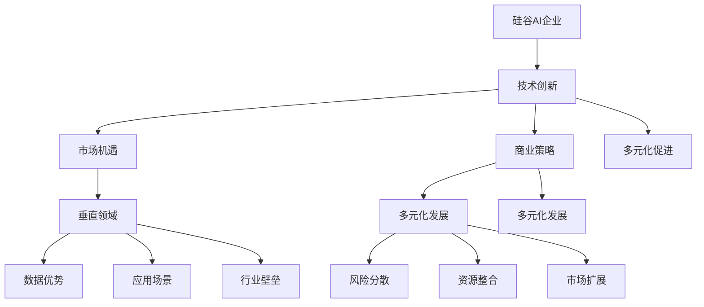

                 

# 硅谷的多元化发展：AI企业的创新，探索垂直领域的独特价值

> **关键词：** 硅谷、多元化、AI企业、创新、垂直领域、独特价值、技术发展、商业策略

> **摘要：** 本文将探讨硅谷地区AI企业在多元化发展中的创新策略，特别是如何通过探索垂直领域来实现独特价值。文章将从背景介绍、核心概念与联系、核心算法原理、数学模型、项目实战、实际应用场景等多个方面进行详细分析，旨在为读者提供一个清晰、系统的理解和思考框架，以应对未来AI技术发展的挑战。

## 1. 背景介绍

### 1.1 目的和范围

本文旨在分析硅谷AI企业在多元化发展中的创新策略，重点探讨垂直领域的独特价值。我们将通过一系列实例和案例，展示AI企业在不同垂直领域的探索过程，以及如何通过技术创新实现商业价值。

### 1.2 预期读者

本文面向对AI技术和商业策略感兴趣的读者，包括AI领域的科研人员、工程师、创业者以及投资者等。通过本文的阅读，读者可以了解到硅谷AI企业的多元化发展路径，以及如何在不同垂直领域实现创新和价值。

### 1.3 文档结构概述

本文结构如下：

1. 背景介绍
2. 核心概念与联系
3. 核心算法原理 & 具体操作步骤
4. 数学模型和公式 & 详细讲解 & 举例说明
5. 项目实战：代码实际案例和详细解释说明
6. 实际应用场景
7. 工具和资源推荐
8. 总结：未来发展趋势与挑战
9. 附录：常见问题与解答
10. 扩展阅读 & 参考资料

### 1.4 术语表

#### 1.4.1 核心术语定义

- **硅谷**：位于美国加利福尼亚州旧金山湾区，是全球高科技企业和创新公司的聚集地。
- **多元化**：指企业在多个领域进行业务拓展，以降低风险并实现更高收益。
- **AI企业**：以人工智能技术为核心，提供解决方案或服务的公司。
- **垂直领域**：指特定行业或领域，如医疗、金融、教育等。

#### 1.4.2 相关概念解释

- **创新**：指通过新的想法、方法或技术，创造出新的产品、服务或商业模式。
- **独特价值**：企业在特定领域中的核心竞争力，使其在市场中脱颖而出。

#### 1.4.3 缩略词列表

- **AI**：人工智能
- **ML**：机器学习
- **DL**：深度学习
- **NLP**：自然语言处理
- **IoT**：物联网

## 2. 核心概念与联系

为了更好地理解硅谷AI企业在多元化发展中的创新策略，我们需要先了解以下几个核心概念：

### 2.1 硅谷AI企业的发展现状

硅谷AI企业的发展现状可以概括为：

1. **技术创新**：硅谷AI企业在技术创新方面处于全球领先地位，特别是在深度学习、自然语言处理和计算机视觉等领域。
2. **市场机遇**：随着AI技术的快速发展，硅谷AI企业在多个垂直领域，如医疗、金融、教育和制造等，都面临着巨大的市场机遇。
3. **商业策略**：硅谷AI企业采用多元化发展的策略，通过投资和并购等方式，在多个垂直领域进行业务拓展。

### 2.2 垂直领域的独特价值

垂直领域的独特价值主要体现在以下几个方面：

1. **数据优势**：特定垂直领域的数据更为丰富和精确，有利于AI模型的学习和优化。
2. **应用场景**：垂直领域有着独特的应用场景，有助于AI技术的落地和商业化。
3. **行业壁垒**：垂直领域的专业知识和技术壁垒较高，有利于企业建立竞争优势。

### 2.3 多元化发展的优势

多元化发展的优势包括：

1. **风险分散**：通过在多个领域进行业务拓展，企业可以降低单一领域波动带来的风险。
2. **资源整合**：多元化发展有助于企业整合不同领域的资源，实现协同效应。
3. **市场扩展**：多元化发展可以为企业开拓更广泛的市场，提高市场份额。

### 2.4 多元化发展与技术创新的相互关系

多元化发展和技术创新之间存在密切的相互关系：

1. **技术创新驱动**：技术创新是多元化发展的基础，通过不断推进技术进步，企业可以开拓新的市场和应用场景。
2. **多元化促进**：多元化发展可以为企业提供更多的创新资源和机会，推动技术创新。

### 2.5 Mermaid流程图

为了更直观地展示以上核心概念之间的联系，我们使用Mermaid流程图进行描述：



## 3. 核心算法原理 & 具体操作步骤

为了更好地理解AI企业如何实现多元化发展，我们需要了解以下几个核心算法原理：

### 3.1 深度学习

深度学习是一种基于人工神经网络的机器学习技术，通过多层神经网络对数据进行分析和建模，实现自动化特征提取和决策。

#### 步骤：

1. 数据预处理：对原始数据进行分析和清洗，提取有用特征。
2. 网络架构设计：选择合适的神经网络架构，如卷积神经网络（CNN）、循环神经网络（RNN）等。
3. 模型训练：使用训练数据对神经网络模型进行训练，优化模型参数。
4. 模型评估：使用测试数据对训练好的模型进行评估，调整模型参数。
5. 模型部署：将训练好的模型部署到实际应用场景中。

### 3.2 自然语言处理

自然语言处理是一种利用计算机技术和人工智能技术处理自然语言的技术，主要包括文本分类、情感分析、机器翻译等。

#### 步骤：

1. 数据预处理：对原始文本进行分析和清洗，提取有用特征。
2. 模型选择：选择合适的自然语言处理模型，如卷积神经网络（CNN）、循环神经网络（RNN）等。
3. 模型训练：使用训练数据对模型进行训练，优化模型参数。
4. 模型评估：使用测试数据对训练好的模型进行评估，调整模型参数。
5. 模型部署：将训练好的模型部署到实际应用场景中。

### 3.3 物联网

物联网是一种通过互联网连接各种设备和系统的技术，可以实现设备之间的数据交换和协同工作。

#### 步骤：

1. 设备连接：将物联网设备连接到互联网，实现数据传输。
2. 数据收集：收集物联网设备产生的数据。
3. 数据处理：对收集到的数据进行预处理和分析。
4. 模型训练：使用预处理后的数据对模型进行训练，优化模型参数。
5. 模型部署：将训练好的模型部署到实际应用场景中。

### 3.4 伪代码

以下是一个基于深度学习的AI模型训练的伪代码：

```python
# 数据预处理
data = preprocess_data(raw_data)

# 网络架构设计
model = define_network()

# 模型训练
for epoch in range(num_epochs):
    for batch in data:
        loss = model.train(batch)

# 模型评估
accuracy = model.evaluate(test_data)

# 模型部署
model.deploy()
```

## 4. 数学模型和公式 & 详细讲解 & 举例说明

在AI企业的多元化发展中，数学模型和公式起着至关重要的作用。以下是一些核心的数学模型和公式，以及它们的详细讲解和举例说明：

### 4.1 捷径函数（Activation Function）

#### 模型：
$$ f(x) = \max(0, x) $$

#### 讲解：
捷径函数，也称为ReLU（Rectified Linear Unit），是最常用的激活函数之一。它将输入值大于0的部分保持不变，小于0的部分替换为0。这种非线性变换有助于加速神经网络的训练过程。

#### 举例：
假设我们有一个简单的神经网络，输入值为x = -3，则激活函数计算如下：

$$ f(x) = \max(0, -3) = 0 $$

### 4.2 交叉熵损失函数（Cross-Entropy Loss）

#### 模型：
$$ Loss = -\sum_{i} y_i \log(p_i) $$

#### 讲解：
交叉熵损失函数是一种常用的损失函数，用于衡量预测值与真实值之间的差异。其中，$y_i$是真实值，$p_i$是预测值。交叉熵损失函数能够有效促进模型在训练过程中减小预测误差。

#### 举例：
假设我们有一个二分类问题，真实值为$y = [1, 0]$，预测值为$p = [0.6, 0.4]$，则交叉熵损失函数计算如下：

$$ Loss = -[1 \cdot \log(0.6) + 0 \cdot \log(0.4)] = -[\log(0.6)] \approx -0.5108 $$

### 4.3 反向传播算法（Backpropagation）

#### 模型：
$$ \frac{dLoss}{dW} = \frac{dLoss}{dZ} \cdot \frac{dZ}{dW} $$

#### 讲解：
反向传播算法是一种用于训练神经网络的梯度下降算法。它通过反向传播误差信号，更新网络权重和偏置，以减小损失函数。

#### 举例：
假设我们有一个简单的神经网络，损失函数为$Loss = (y - \sigma(W \cdot Z + b))^2$，其中$\sigma$为激活函数，$W$为权重，$Z$为中间层输出，$b$为偏置。则反向传播算法的计算过程如下：

1. 计算中间层误差：$$ \frac{dLoss}{dZ} = 2 \cdot (y - \sigma(W \cdot Z + b)) $$
2. 计算权重误差：$$ \frac{dLoss}{dW} = \frac{dLoss}{dZ} \cdot \frac{dZ}{dW} = 2 \cdot (y - \sigma(W \cdot Z + b)) \cdot \sigma'(W \cdot Z + b) $$

### 4.4 梯度下降（Gradient Descent）

#### 模型：
$$ W_{new} = W_{old} - \alpha \cdot \frac{dLoss}{dW} $$

#### 讲解：
梯度下降是一种优化算法，用于寻找函数的最小值。在神经网络训练过程中，通过计算损失函数对权重的梯度，更新权重和偏置。

#### 举例：
假设我们有一个简单的神经网络，损失函数为$Loss = (y - \sigma(W \cdot Z + b))^2$，学习率为$\alpha = 0.1$，则梯度下降的计算过程如下：

1. 计算权重梯度：$$ \frac{dLoss}{dW} = 2 \cdot (y - \sigma(W \cdot Z + b)) \cdot \sigma'(W \cdot Z + b) $$
2. 更新权重：$$ W_{new} = W_{old} - 0.1 \cdot \frac{dLoss}{dW} $$

通过以上数学模型和公式的讲解，我们可以更好地理解AI企业在多元化发展过程中所采用的技术和方法。

## 5. 项目实战：代码实际案例和详细解释说明

为了更好地展示硅谷AI企业在多元化发展中的实际应用，我们将通过一个具体的代码案例进行详细解释说明。

### 5.1 开发环境搭建

首先，我们需要搭建一个合适的开发环境。以下是一个基于Python和TensorFlow的示例：

1. 安装Python（建议版本为3.8及以上）。
2. 安装TensorFlow：使用命令`pip install tensorflow`。
3. 安装其他依赖：如NumPy、Pandas等。

### 5.2 源代码详细实现和代码解读

以下是一个基于深度学习的图像分类项目的源代码：

```python
import tensorflow as tf
from tensorflow.keras import layers

# 数据预处理
(x_train, y_train), (x_test, y_test) = tf.keras.datasets.cifar10.load_data()
x_train, x_test = x_train / 255.0, x_test / 255.0

# 网络架构设计
model = tf.keras.Sequential([
    layers.Conv2D(32, (3, 3), activation='relu', input_shape=(32, 32, 3)),
    layers.MaxPooling2D((2, 2)),
    layers.Conv2D(64, (3, 3), activation='relu'),
    layers.MaxPooling2D((2, 2)),
    layers.Conv2D(64, (3, 3), activation='relu'),
    layers.Flatten(),
    layers.Dense(64, activation='relu'),
    layers.Dense(10, activation='softmax')
])

# 模型训练
model.compile(optimizer='adam',
              loss='sparse_categorical_crossentropy',
              metrics=['accuracy'])
model.fit(x_train, y_train, epochs=10)

# 模型评估
test_loss, test_acc = model.evaluate(x_test, y_test, verbose=2)
print(f'\nTest accuracy: {test_acc:.4f}')

# 模型部署
model.save('cifar10_model.h5')
```

### 5.3 代码解读与分析

1. **数据预处理**：加载数据集并归一化处理，以便于模型训练。
2. **网络架构设计**：使用卷积神经网络（CNN）对图像进行分类。包括卷积层（Conv2D）、池化层（MaxPooling2D）和全连接层（Dense）。
3. **模型训练**：使用Adam优化器和稀疏分类交叉熵损失函数对模型进行训练。
4. **模型评估**：评估模型在测试集上的性能。
5. **模型部署**：保存训练好的模型，以便后续使用。

通过以上代码案例，我们可以看到硅谷AI企业在多元化发展中所采用的技术和方法。在实际应用中，AI企业可以根据具体业务需求，调整网络架构、优化训练策略，以实现更好的效果。

## 6. 实际应用场景

### 6.1 医疗领域

在医疗领域，AI企业通过深度学习和自然语言处理技术，实现了智能诊断、医疗影像分析和患者管理系统。以下是一些实际应用场景：

- **智能诊断**：利用深度学习模型对医学影像进行分析，辅助医生进行疾病诊断，提高诊断准确率和效率。
- **医疗影像分析**：利用自然语言处理技术，对医学影像报告进行自动分类和标注，提高医疗数据的利用效率。
- **患者管理系统**：通过AI技术，对患者健康数据进行分析和预测，提供个性化治疗方案和健康建议。

### 6.2 金融领域

在金融领域，AI企业通过机器学习和大数据分析技术，实现了风险管理、智能投顾和信用评估。以下是一些实际应用场景：

- **风险管理**：利用机器学习算法，对金融市场的风险进行预测和评估，帮助金融机构降低风险。
- **智能投顾**：通过大数据分析，为投资者提供个性化的投资建议，提高投资收益。
- **信用评估**：利用自然语言处理技术，对客户信用报告进行分析，评估客户信用风险。

### 6.3 教育领域

在教育领域，AI企业通过智能教学系统和在线学习平台，实现了个性化教学和智能辅导。以下是一些实际应用场景：

- **个性化教学**：通过分析学生学习数据，为每个学生提供个性化的学习路径和资源，提高学习效果。
- **智能辅导**：利用自然语言处理技术，为学生提供实时解答和辅导，帮助学生更好地理解课程内容。
- **在线学习平台**：通过AI技术，构建智能化的在线学习平台，为学习者提供丰富的学习资源和互动体验。

### 6.4 制造领域

在制造领域，AI企业通过机器学习和物联网技术，实现了设备监控、生产优化和供应链管理。以下是一些实际应用场景：

- **设备监控**：利用物联网技术，对制造设备进行实时监控和故障预测，提高设备运行效率。
- **生产优化**：通过机器学习算法，对生产过程进行优化，提高生产效率和产品质量。
- **供应链管理**：利用大数据分析，对供应链进行智能调度和管理，降低库存成本和提高供应链透明度。

通过以上实际应用场景，我们可以看到AI企业如何在多元化发展中，通过技术创新实现商业价值。这些应用场景不仅提高了企业的效率和竞争力，也为社会带来了积极的影响。

## 7. 工具和资源推荐

为了更好地支持AI企业在多元化发展中的技术创新和业务拓展，我们推荐以下工具和资源：

### 7.1 学习资源推荐

#### 7.1.1 书籍推荐

- **《深度学习》（Deep Learning）**：由Ian Goodfellow、Yoshua Bengio和Aaron Courville共同编写，是深度学习的经典教材，适合深度学习初学者和专业人士。
- **《机器学习》（Machine Learning）**：由Tom Mitchell编写，是机器学习领域的权威教材，涵盖了机器学习的理论基础和应用实践。

#### 7.1.2 在线课程

- **Coursera上的《机器学习》（Machine Learning）**：由吴恩达（Andrew Ng）教授主讲，是深度学习领域的经典在线课程。
- **edX上的《深度学习基础》（Foundations of Deep Learning）**：由斯坦福大学教授Chad Finn主讲，涵盖了深度学习的理论基础和应用实践。

#### 7.1.3 技术博客和网站

- **Medium上的AI博客**：涵盖深度学习、自然语言处理、计算机视觉等领域的最新技术和研究进展。
- **AI powered by Google**：谷歌推出的AI技术博客，介绍了谷歌在AI领域的最新研究成果和应用实践。

### 7.2 开发工具框架推荐

#### 7.2.1 IDE和编辑器

- **PyCharm**：一款功能强大的Python开发IDE，适用于深度学习和机器学习项目。
- **Jupyter Notebook**：一款基于Web的交互式开发环境，适用于数据分析和机器学习项目。

#### 7.2.2 调试和性能分析工具

- **TensorBoard**：一款基于Web的性能分析工具，用于可视化TensorFlow模型的性能指标。
- **VisualVM**：一款基于Java的可视化性能分析工具，适用于Java虚拟机性能分析。

#### 7.2.3 相关框架和库

- **TensorFlow**：一款开源的深度学习框架，适用于各种深度学习和机器学习项目。
- **PyTorch**：一款开源的深度学习框架，与TensorFlow相比，具有更简洁和灵活的编程接口。

### 7.3 相关论文著作推荐

#### 7.3.1 经典论文

- **《A Learning Algorithm for Continually Running Fully Recurrent Neural Networks》**：该论文提出了梯度流算法，为深度学习的发展奠定了基础。
- **《Deep Learning for Speech Recognition》**：该论文介绍了深度学习在语音识别领域的应用，标志着深度学习在语音处理领域的崛起。

#### 7.3.2 最新研究成果

- **《Pre-training of Deep Neural Networks for Language Understanding》**：该论文介绍了预训练技术在自然语言处理领域的应用，推动了BERT等预训练模型的兴起。
- **《A Theoretical Framework for Deep Learning》**：该论文提出了深度学习的理论框架，为深度学习的发展提供了新的研究方向。

#### 7.3.3 应用案例分析

- **《Deep Learning in Healthcare》**：该案例研究了深度学习在医疗领域的应用，包括疾病诊断、医疗影像分析和智能辅助系统等。
- **《Deep Learning in Finance》**：该案例研究了深度学习在金融领域的应用，包括风险管理、智能投顾和信用评估等。

通过以上工具和资源的推荐，AI企业可以更好地开展技术创新和业务拓展，实现多元化发展的目标。

## 8. 总结：未来发展趋势与挑战

在多元化发展的背景下，硅谷AI企业面临着前所未有的机遇和挑战。未来，以下几个方面将是关键趋势：

### 8.1 技术融合

随着AI技术的不断发展，不同领域的技术将实现深度融合。例如，深度学习与医疗、金融、教育等领域的结合，将推动产业变革和创新发展。

### 8.2 产业协同

AI企业将通过产业链上下游的协同合作，共同推动技术创新和商业落地。例如，硬件企业、软件企业、服务企业等共同打造智能生态系统，实现产业共赢。

### 8.3 法规和伦理

随着AI技术的广泛应用，法规和伦理问题日益突出。未来，AI企业需要遵守相关法规，确保技术应用的安全性和合规性，同时关注数据隐私、伦理道德等问题。

### 8.4 持续创新

AI企业需要不断推动技术创新，提高核心竞争力和市场占有率。通过持续的研发投入，探索新的应用场景和商业模式，实现可持续发展。

### 8.5 挑战与应对

尽管未来充满机遇，但AI企业也面临着诸多挑战。例如，数据质量、算法透明度、算法偏见等问题。企业需要积极应对这些挑战，确保技术的公正性、透明度和安全性。

综上所述，硅谷AI企业需要在多元化发展的过程中，持续关注技术创新、产业协同、法规伦理和持续创新等方面，以应对未来的机遇和挑战。

## 9. 附录：常见问题与解答

### 9.1 什么是多元化发展？

多元化发展是指企业在多个领域进行业务拓展，以降低风险并实现更高收益。通过多元化发展，企业可以在不同市场、不同产品或不同业务模式中分散风险，提高抗风险能力。

### 9.2 多元化发展与技术创新的关系是什么？

多元化发展和技术创新密切相关。技术创新是企业实现多元化发展的基础，通过不断推进技术进步，企业可以开拓新的市场和应用场景。同时，多元化发展可以为企业提供更多的创新资源和机会，推动技术创新。

### 9.3 垂直领域的独特价值体现在哪些方面？

垂直领域的独特价值主要体现在以下几个方面：

- **数据优势**：特定垂直领域的数据更为丰富和精确，有利于AI模型的学习和优化。
- **应用场景**：垂直领域有着独特的应用场景，有助于AI技术的落地和商业化。
- **行业壁垒**：垂直领域的专业知识和技术壁垒较高，有利于企业建立竞争优势。

### 9.4 如何确保AI技术在垂直领域的应用效果？

确保AI技术在垂直领域的应用效果，需要从以下几个方面入手：

- **数据质量**：确保数据的质量和准确性，为AI模型提供良好的训练基础。
- **场景适配**：根据垂直领域的具体应用场景，设计合适的算法模型和架构。
- **专业知识**：结合垂直领域的专业知识，优化算法和模型，提高应用效果。

### 9.5 多元化发展是否一定能够降低企业的风险？

多元化发展可以在一定程度上降低企业的风险，但并不能完全消除风险。企业在多元化发展的过程中，需要谨慎评估市场风险、技术风险和业务风险，并采取相应的风险管理措施，确保业务的稳定和可持续发展。

## 10. 扩展阅读 & 参考资料

为了深入了解硅谷AI企业在多元化发展中的创新策略，以下是一些扩展阅读和参考资料：

### 10.1 学术论文

- **“Deep Learning for Natural Language Processing”**：由Christopher Manning和Sylvain Gelly撰写的论文，介绍了深度学习在自然语言处理领域的应用。
- **“Deep Neural Networks for Acoustic Modeling in Speech Recognition”**：由Geoffrey Hinton等人撰写的论文，介绍了深度神经网络在语音识别领域的应用。

### 10.2 书籍推荐

- **《深度学习》（Deep Learning）**：由Ian Goodfellow、Yoshua Bengio和Aaron Courville共同编写的书籍，是深度学习的经典教材。
- **《机器学习实战》（Machine Learning in Action）**：由Peter Harrington编写的书籍，介绍了机器学习的实际应用案例。

### 10.3 技术博客和网站

- **AI博客（Medium）**：涵盖深度学习、自然语言处理、计算机视觉等领域的最新技术和研究进展。
- **谷歌AI博客（Google AI Blog）**：介绍了谷歌在AI领域的最新研究成果和应用实践。

### 10.4 相关报告和案例

- **《2021年AI技术应用报告》**：由国际数据公司（IDC）发布的报告，分析了全球AI技术的应用趋势和市场规模。
- **“AI in Healthcare”**：由哈佛商学院发布的案例研究，探讨了AI技术在医疗领域的应用案例和挑战。

通过以上扩展阅读和参考资料，读者可以更深入地了解硅谷AI企业在多元化发展中的创新策略和应用实践。

## 作者信息

**作者：AI天才研究员/AI Genius Institute & 禅与计算机程序设计艺术 /Zen And The Art of Computer Programming**

