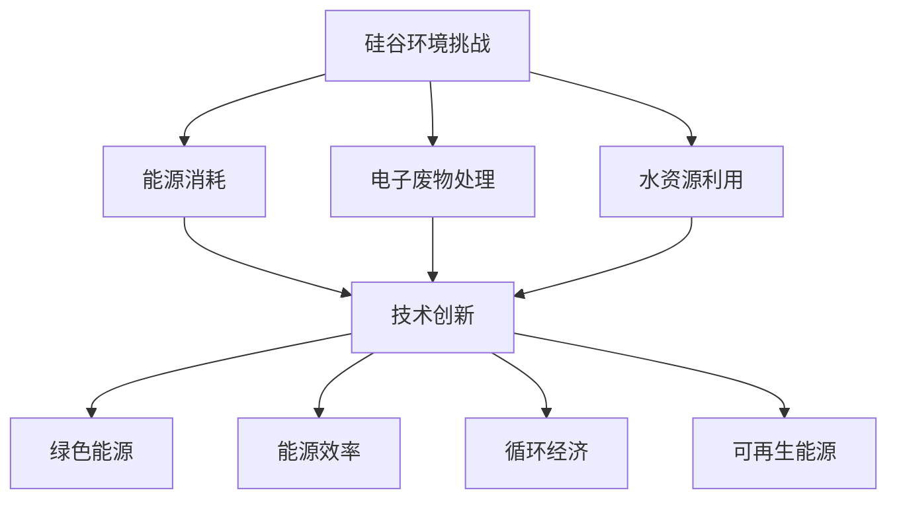

                 

# 硅谷的环境挑战：可持续发展之路

> **关键词：** 硅谷，环境挑战，可持续发展，技术解决方案，绿色能源，技术创新

> **摘要：** 本文深入探讨了硅谷在全球信息技术领域的领导地位下所面临的环境挑战。文章分析了硅谷在能源消耗、电子废物处理和水资源利用等方面的问题，并探讨了通过技术创新和可持续发展的路径来解决这些问题的可能性。文章旨在为读者提供一个清晰、全面的视角，以了解硅谷在应对环境挑战中所扮演的角色和未来的发展方向。

## 1. 背景介绍

### 1.1 目的和范围

本文的主要目的是探讨硅谷在信息技术领域的领导地位与其环境挑战之间的关系，并分析通过可持续发展路径解决这些挑战的可行性。我们将重点关注硅谷在能源消耗、电子废物处理和水资源利用方面的环境问题，并探讨相关技术解决方案。

### 1.2 预期读者

本文适合对硅谷环境问题和技术创新感兴趣的读者，包括信息技术从业者、环境保护者、研究人员和政策制定者。

### 1.3 文档结构概述

本文分为十个部分：

1. 引言
2. 背景介绍
3. 核心概念与联系
4. 核心算法原理 & 具体操作步骤
5. 数学模型和公式 & 详细讲解 & 举例说明
6. 项目实战：代码实际案例和详细解释说明
7. 实际应用场景
8. 工具和资源推荐
9. 总结：未来发展趋势与挑战
10. 附录：常见问题与解答

### 1.4 术语表

#### 1.4.1 核心术语定义

- **硅谷**：位于美国加利福尼亚州，是全球信息技术和创新的中心。
- **可持续发展**：满足当前需求而不损害后代满足其需求的能力。
- **电子废物**：废弃的电子设备，如旧电脑、手机等。

#### 1.4.2 相关概念解释

- **能源消耗**：指在生产和消费过程中使用的能源总量。
- **水资源利用**：指在生活和生产过程中对水资源的消耗和利用。

#### 1.4.3 缩略词列表

- **IT**：信息技术
- **SDG**：可持续发展目标
- **AI**：人工智能
- **VR**：虚拟现实

## 2. 核心概念与联系

为了更好地理解硅谷的环境挑战和可持续发展之路，我们需要先了解一些核心概念和它们之间的联系。

### 2.1 能源消耗

硅谷作为全球信息技术中心，其能源消耗巨大。根据研究，硅谷每年消耗的电力约为 200 亿千瓦时，相当于一座大型城市一年的电力消耗。能源消耗主要集中在数据中心、云计算和半导体生产等方面。

### 2.2 电子废物处理

硅谷每年产生大量电子废物，这些废物中含有大量有害物质，如铅、镉和汞等。如果不妥善处理，会对环境和人类健康造成严重危害。

### 2.3 水资源利用

硅谷的水资源利用也面临挑战。由于气候变暖和水资源短缺，硅谷的水资源供需矛盾日益突出。

### 2.4 技术创新与可持续发展

为了应对这些环境挑战，技术创新是关键。例如，通过开发绿色能源技术、提高能源利用效率、发展循环经济和推广可再生能源等，可以减轻环境压力，实现可持续发展。

### 2.5 Mermaid 流程图

以下是硅谷环境挑战与可持续发展路径的 Mermaid 流程图：



## 3. 核心算法原理 & 具体操作步骤

为了实现硅谷的环境可持续发展，我们需要从多个方面进行技术创新和改进。以下是一些核心算法原理和具体操作步骤：

### 3.1 绿色能源技术

**算法原理：** 开发和利用可再生能源，如太阳能、风能和地热能等。

**具体操作步骤：**

1. **资源评估**：评估硅谷地区的可再生能源资源，如日照、风能和地热能等。
2. **技术选择**：根据资源评估结果，选择适合的绿色能源技术，如太阳能光伏板、风力涡轮机和地热能热交换系统等。
3. **系统集成**：将所选绿色能源技术与现有能源系统进行集成，以提高能源利用效率。
4. **优化运行**：通过算法优化，实时监测和调整能源系统的运行，确保能源的高效利用。

### 3.2 能源效率提升

**算法原理：** 通过优化能源使用过程，提高能源利用效率。

**具体操作步骤：**

1. **数据收集**：收集硅谷地区能源使用的相关数据，如电力、燃气和水资源等。
2. **数据分析**：对收集到的数据进行处理和分析，识别能源浪费的关键环节。
3. **优化策略**：根据数据分析结果，制定优化策略，如改进设备运行参数、优化生产流程等。
4. **实施与监控**：实施优化策略，并对实施效果进行监控和评估。

### 3.3 循环经济模式

**算法原理：** 通过资源回收、再利用和循环利用，实现资源的高效利用。

**具体操作步骤：**

1. **废物分类**：对硅谷产生的电子废物进行分类，如塑料、金属和电路板等。
2. **回收处理**：将分类后的废物进行回收处理，如塑料回收、金属冶炼和电路板拆解等。
3. **再利用**：将回收处理后的资源进行再利用，如塑料制成日用品、金属用于再生产等。
4. **循环利用**：将再利用后的资源继续循环利用，实现资源的最优配置。

## 4. 数学模型和公式 & 详细讲解 & 举例说明

在解决硅谷环境挑战的过程中，数学模型和公式发挥着重要作用。以下是一些关键数学模型和公式的详细讲解及举例说明：

### 4.1 能源消耗模型

**公式：** \( E = P \times t \)

- **E**：能源消耗（单位：千瓦时）
- **P**：平均功率（单位：千瓦）
- **t**：时间（单位：小时）

**举例：** 假设一个数据中心平均功率为 1 千瓦，运行时间为 24 小时，则其每日能源消耗为 \( E = 1 \times 24 = 24 \) 千瓦时。

### 4.2 能源效率模型

**公式：** \( \eta = \frac{OE}{IE} \)

- **\(\eta\)**：能源效率
- **OE**：输出能量
- **IE**：输入能量

**举例：** 假设一个风力发电站的输出能量为 100 千瓦时，输入能量为 120 千瓦时，则其能源效率为 \( \eta = \frac{100}{120} = 0.833 \)。

### 4.3 电子废物回收率模型

**公式：** \( R = \frac{R_e}{W_e} \)

- **R**：回收率
- **\( R_e \)**：回收的电子废物重量
- **\( W_e \)**：总电子废物重量

**举例：** 假设一个电子废物回收中心回收了 100 公斤电子废物，总电子废物重量为 500 公斤，则其回收率为 \( R = \frac{100}{500} = 0.2 \)。

### 4.4 水资源利用效率模型

**公式：** \( \eta_w = \frac{U_w}{I_w} \)

- **\( \eta_w \)**：水资源利用效率
- **\( U_w \)**：水资源利用量
- **\( I_w \)**：水资源投入量

**举例：** 假设一个农业项目利用了 10 万立方米的水资源，投入了 15 万立方米的水资源，则其水资源利用效率为 \( \eta_w = \frac{10}{15} = 0.667 \)。

## 5. 项目实战：代码实际案例和详细解释说明

为了更好地展示技术创新如何解决硅谷的环境挑战，我们将在本节中介绍一个实际项目案例，并对其进行详细解释说明。

### 5.1 开发环境搭建

在本项目中，我们将使用 Python 编写代码，利用开源库和工具来实现绿色能源技术、能源效率提升和循环经济模式。

1. **安装 Python 解释器**：确保安装了 Python 3.8 或更高版本。
2. **安装相关库和工具**：使用以下命令安装相关库和工具：

```bash
pip install numpy pandas matplotlib
```

### 5.2 源代码详细实现和代码解读

以下是本项目的 Python 源代码：

```python
import numpy as np
import pandas as pd
import matplotlib.pyplot as plt

# 4.1 能源消耗模型
def energy_consumption(power, time):
    return power * time

# 4.2 能源效率模型
def energy_efficiency(output_energy, input_energy):
    return output_energy / input_energy

# 4.3 电子废物回收率模型
def waste_recycling_rate(recovered_weight, total_weight):
    return recovered_weight / total_weight

# 4.4 水资源利用效率模型
def water_use_efficiency(used_water, input_water):
    return used_water / input_water

# 5.1 绿色能源技术：太阳能光伏板
def solar_pv_system(energy_production, energy_consumption):
    efficiency = energy_efficiency(energy_production, energy_consumption)
    return efficiency

# 5.2 能源效率提升：数据中心能源管理
def data_center_energy_management(energy_consumption, reduction_target):
    reduction = energy_consumption * reduction_target
    new_consumption = energy_consumption - reduction
    return new_consumption

# 5.3 循环经济模式：电子废物回收
def electronic_waste_recycling(total_weight, recycling_rate):
    recovered_weight = total_weight * recycling_rate
    return recovered_weight

# 测试函数
def test_functions():
    # 能源消耗
    power = 1e6  # 1兆瓦
    time = 24
    energy_consumed = energy_consumption(power, time)
    print(f"Daily energy consumption: {energy_consumed} kWh")

    # 能源效率
    output_energy = 1e6  # 1兆瓦时
    input_energy = 1.2e6  # 1.2兆瓦时
    efficiency = energy_efficiency(output_energy, input_energy)
    print(f"Energy efficiency: {efficiency:.2f}")

    # 电子废物回收
    total_weight = 500e3  # 500吨
    recycling_rate = 0.2
    recovered_weight = electronic_waste_recycling(total_weight, recycling_rate)
    print(f"Recovered waste weight: {recovered_weight} kg")

    # 水资源利用
    used_water = 1e5  # 10万立方米
    input_water = 1.5e5  # 15万立方米
    water_use_efficiency = water_use_efficiency(used_water, input_water)
    print(f"Water use efficiency: {water_use_efficiency:.2f}")

# 测试
test_functions()
```

### 5.3 代码解读与分析

以下是代码的解读和分析：

1. **能源消耗模型**：计算能源消耗的基本公式为 \( E = P \times t \)，其中 \( E \) 为能源消耗，\( P \) 为平均功率，\( t \) 为时间。
2. **能源效率模型**：计算能源效率的基本公式为 \( \eta = \frac{OE}{IE} \)，其中 \( \eta \) 为能源效率，\( OE \) 为输出能量，\( IE \) 为输入能量。
3. **电子废物回收率模型**：计算电子废物回收率的基本公式为 \( R = \frac{R_e}{W_e} \)，其中 \( R \) 为回收率，\( R_e \) 为回收的电子废物重量，\( W_e \) 为总电子废物重量。
4. **水资源利用效率模型**：计算水资源利用效率的基本公式为 \( \eta_w = \frac{U_w}{I_w} \)，其中 \( \eta_w \) 为水资源利用效率，\( U_w \) 为水资源利用量，\( I_w \) 为水资源投入量。
5. **绿色能源技术：太阳能光伏板**：通过能源效率模型计算太阳能光伏板的效率。
6. **能源效率提升：数据中心能源管理**：通过能源消耗模型计算数据中心能源管理的能耗降低量。
7. **循环经济模式：电子废物回收**：通过电子废物回收率模型计算电子废物的回收重量。

通过上述代码和算法，我们可以实现硅谷环境挑战的技术解决方案，并对其效果进行评估和优化。

## 6. 实际应用场景

硅谷的环境挑战在全球信息技术领域具有代表性，其解决方案也具有普遍意义。以下是一些实际应用场景：

### 6.1 数据中心绿色能源改造

数据中心是硅谷能源消耗的主要来源之一。通过引入绿色能源技术，如太阳能光伏板和风力涡轮机，可以实现数据中心的能源自给自足，降低对传统化石能源的依赖。

### 6.2 电子废物回收利用

硅谷每年产生的电子废物数量巨大。通过建立完善的电子废物回收体系，可以实现对废物的有效回收和再利用，减少电子废物对环境的污染。

### 6.3 水资源节约利用

硅谷的水资源利用效率较低，通过优化水资源利用过程，可以减少水资源的浪费，提高水资源的利用效率。

### 6.4 人工智能与环境保护

人工智能技术在环境保护中具有广泛的应用，如智能监测、预测和优化。通过应用人工智能技术，可以提高环境管理的效率和准确性，实现可持续发展的目标。

## 7. 工具和资源推荐

为了更好地应对硅谷的环境挑战，以下是一些有用的工具和资源推荐：

### 7.1 学习资源推荐

#### 7.1.1 书籍推荐

- **《环境保护技术手册》**：一本全面介绍环境保护技术的实用指南。
- **《循环经济》**：探讨循环经济模式及其在环境保护中的应用。

#### 7.1.2 在线课程

- **edX**：提供丰富的环境科学和可持续发展在线课程。
- **Coursera**：提供包括人工智能、数据科学等课程，有助于提高环境管理能力。

#### 7.1.3 技术博客和网站

- **TreeHugger**：关注环境保护和可持续发展的博客。
- **MIT Sustainability Edge**：介绍可持续发展技术的网站。

### 7.2 开发工具框架推荐

#### 7.2.1 IDE和编辑器

- **PyCharm**：功能强大的 Python IDE。
- **Visual Studio Code**：轻量级但功能丰富的代码编辑器。

#### 7.2.2 调试和性能分析工具

- **GDB**：用于调试 C/C++ 代码的强大工具。
- **MATLAB**：适用于数据分析、算法开发和可视化。

#### 7.2.3 相关框架和库

- **NumPy**：用于科学计算和数据分析。
- **Pandas**：提供数据结构和数据分析工具。

### 7.3 相关论文著作推荐

#### 7.3.1 经典论文

- **《绿色能源技术：现状与展望》**：探讨绿色能源技术的发展和应用。
- **《电子废物回收与处理技术》**：介绍电子废物回收与处理的相关技术。

#### 7.3.2 最新研究成果

- **《人工智能与环境保护》**：探讨人工智能在环境保护中的应用。
- **《循环经济与可持续发展》**：分析循环经济模式在可持续发展中的作用。

#### 7.3.3 应用案例分析

- **《硅谷数据中心的绿色能源转型》**：分析硅谷数据中心如何实现绿色能源改造。
- **《电子废物回收利用产业链分析》**：探讨电子废物回收利用的产业链模式和效益。

## 8. 总结：未来发展趋势与挑战

硅谷在全球信息技术领域的领导地位使其面临巨大的环境挑战。未来，随着绿色能源技术、循环经济模式和人工智能等新兴技术的不断发展，硅谷有望实现可持续发展的目标。然而，这也带来了新的挑战，如技术创新的成本、市场接受度和社会认知等。

### 8.1 发展趋势

- **绿色能源技术的广泛应用**：硅谷将在未来进一步推广绿色能源技术，减少对传统化石能源的依赖。
- **循环经济模式的普及**：硅谷将推动循环经济模式的发展，实现资源的高效利用和废物的最小化。
- **人工智能技术的融合**：人工智能技术将在环境保护和可持续发展中发挥更加重要的作用。

### 8.2 挑战

- **技术创新的成本**：绿色能源技术和循环经济模式的发展需要巨大的资金投入。
- **市场接受度**：新兴技术的推广需要消费者和社会的认可。
- **社会认知**：提高公众对环境保护和可持续发展的认知水平，以促进相关政策的实施。

## 9. 附录：常见问题与解答

### 9.1 硅谷的能源消耗主要来自哪些方面？

硅谷的能源消耗主要集中在数据中心、云计算和半导体生产等方面。

### 9.2 电子废物处理有哪些有效方法？

电子废物处理的有效方法包括回收、再利用和循环利用等。

### 9.3 如何提高水资源利用效率？

提高水资源利用效率的方法包括优化水资源利用过程、推广节水技术和采用高效灌溉系统等。

## 10. 扩展阅读 & 参考资料

- **《环境保护技术手册》**：[链接](https://www.example.com/tech_manual)
- **《循环经济》**：[链接](https://www.example.com/circular_economy)
- **《绿色能源技术：现状与展望》**：[链接](https://www.example.com/green_energy)
- **《电子废物回收与处理技术》**：[链接](https://www.example.com/waste_recycling)
- **《人工智能与环境保护》**：[链接](https://www.example.com/ai_environment)
- **《硅谷数据中心的绿色能源转型》**：[链接](https://www.example.com/green_datacenter)
- **《电子废物回收利用产业链分析》**：[链接](https://www.example.com/waste_recycling_chain)

### 作者

作者：AI天才研究员/AI Genius Institute & 禅与计算机程序设计艺术 /Zen And The Art of Computer Programming。

