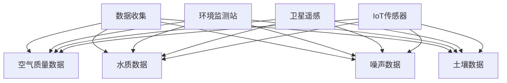
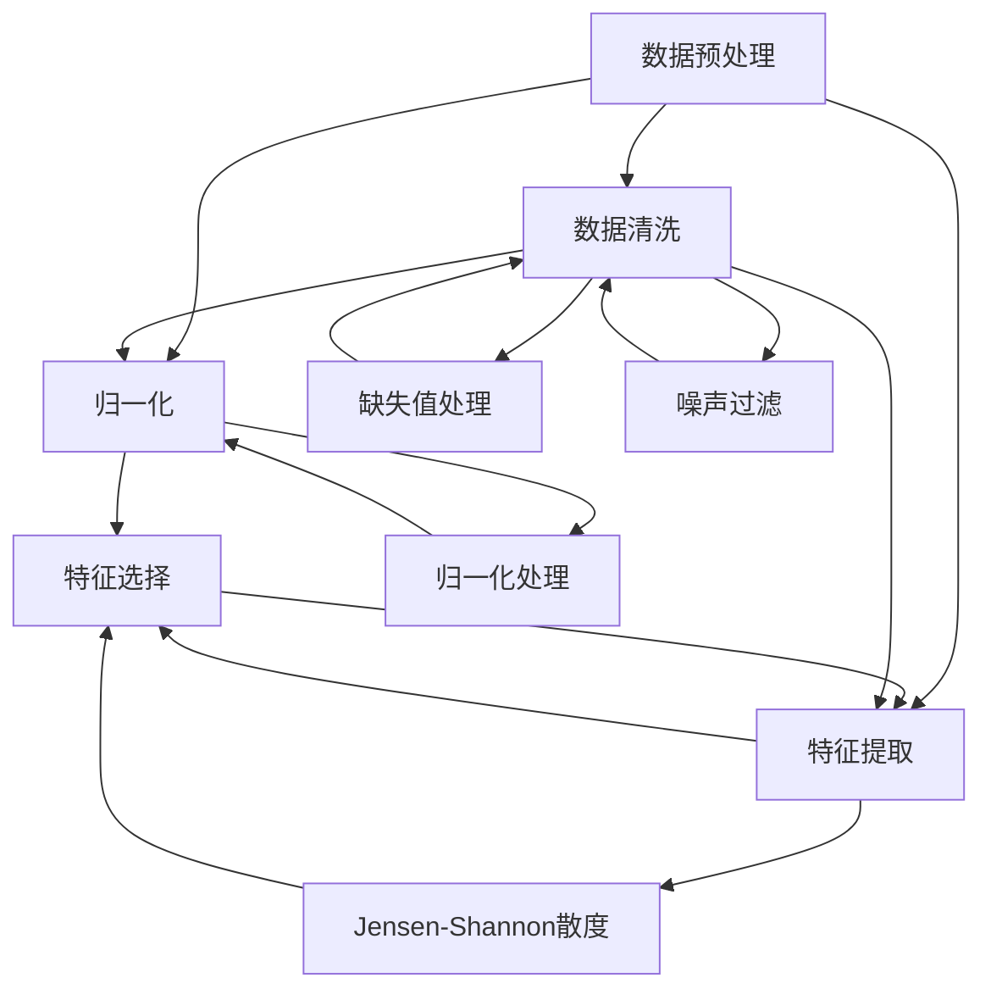
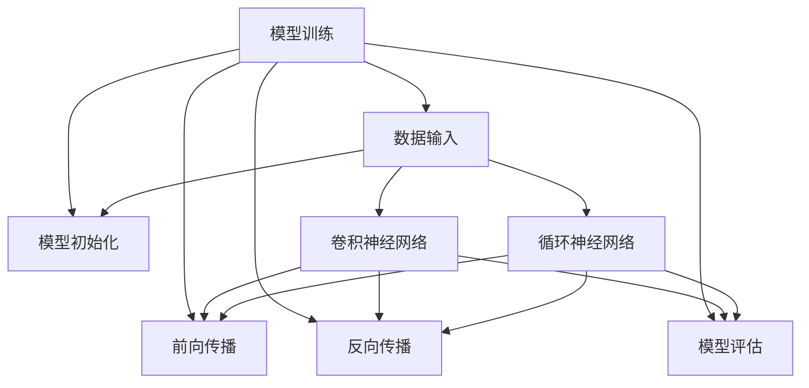
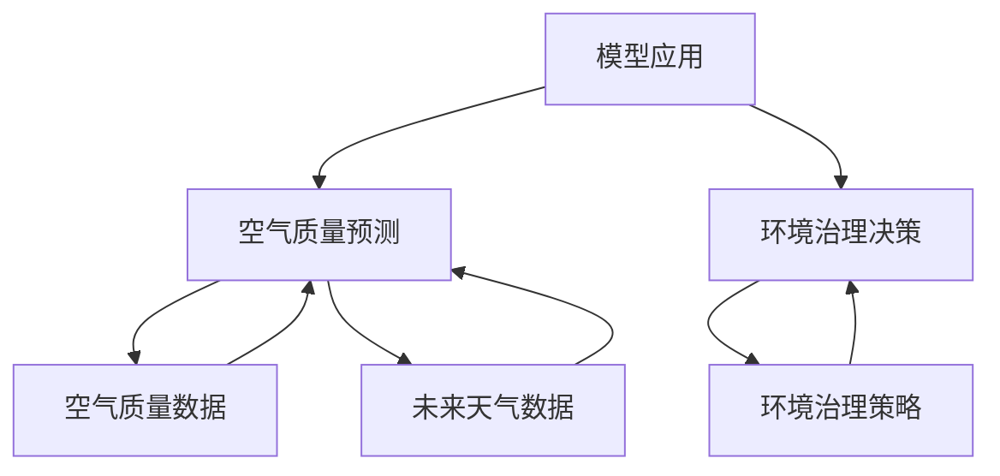

                 

# 硅谷的环境挑战：可持续发展之路

> 关键词：硅谷，环境挑战，可持续发展，人工智能，科技创新，环境治理

> 摘要：本文将探讨硅谷这一全球科技创新热点所面临的环境挑战，深入分析其背后的原因和影响。通过梳理现有的可持续解决方案，探讨人工智能等先进技术在其中的应用，并提出对未来发展的趋势与挑战的思考。

## 1. 背景介绍

### 1.1 目的和范围

本文旨在深入探讨硅谷这一全球科技创新热土在快速发展的同时所面临的环境挑战，以及如何通过科技创新和可持续发展策略来应对这些问题。我们将分析硅谷的环境现状、挑战、已有的解决方案，并展望未来发展的趋势和机遇。

### 1.2 预期读者

本文面向对硅谷环境挑战感兴趣的技术专家、环保人士、政策制定者、企业高管以及普通读者。希望通过本文，读者能够更深入地理解硅谷的环境现状，并思考如何通过技术手段实现可持续发展。

### 1.3 文档结构概述

本文分为十个部分：

1. 背景介绍：介绍本文的目的和范围，预期读者及文档结构。
2. 核心概念与联系：介绍相关核心概念，并用流程图展示。
3. 核心算法原理与具体操作步骤：讲解核心算法原理，并使用伪代码进行详细阐述。
4. 数学模型和公式：详细讲解数学模型和公式，并举例说明。
5. 项目实战：提供代码实际案例，并进行详细解释。
6. 实际应用场景：讨论技术的实际应用场景。
7. 工具和资源推荐：推荐学习资源、开发工具框架及相关论文著作。
8. 总结：总结未来发展趋势与挑战。
9. 附录：常见问题与解答。
10. 扩展阅读与参考资料：提供进一步阅读的资源。

### 1.4 术语表

#### 1.4.1 核心术语定义

- 硅谷：美国加利福尼亚州旧金山湾区的一个地区，是全球科技创新和创业的聚集地。
- 可持续发展：在不损害未来世代满足其需求的前提下，满足当代人需求的发展模式。
- 人工智能（AI）：模拟人类智能行为的计算机系统。

#### 1.4.2 相关概念解释

- 科技创新：通过新技术、新方法、新产品等手段推动社会进步的过程。
- 环境治理：通过政策、法律、市场等手段管理和保护环境。

#### 1.4.3 缩略词列表

- AI：人工智能
- IoT：物联网
- VR：虚拟现实
- AR：增强现实
- SDG：可持续发展目标

## 2. 核心概念与联系

为了更好地理解硅谷的环境挑战及其解决方案，我们需要首先梳理几个核心概念，并用 Mermaid 流程图展示它们之间的关系。

```mermaid
graph TD
    A[硅谷环境挑战] --> B[科技创新]
    A --> C[可持续发展]
    B --> D[人工智能]
    B --> E[清洁能源]
    C --> F[环境保护]
    C --> G[资源效率]
    D --> H[数据智能]
    D --> I[智能城市]
    E --> J[可再生能源]
    E --> K[能源效率]
    F --> L[污染控制]
    F --> M[生态保护]
    G --> N[废物管理]
    G --> O[水资源管理]
    H --> P[智能交通]
    H --> Q[智能建筑]
    I --> R[智能医疗]
    I --> S[智能农业]
    J --> T[太阳能]
    J --> U[风能]
    K --> V[电动汽车]
    K --> W[能效管理]
    L --> X[废气处理]
    L --> Y[废水处理]
    M --> Z[生物多样性保护]
    N --> AA[回收利用]
    N --> BB[资源循环利用]
    O --> CC[水资源保护]
    O --> DD[水资源利用]
    P --> EE[智能交通系统]
    P --> FF[交通流量管理]
    Q --> GG[智能空调系统]
    Q --> HH[智能照明系统]
    R --> II[智能诊断系统]
    R --> JJ[智能药物研发]
    S --> KK[智能灌溉系统]
    S --> LL[智能农机系统]
    T --> MM[太阳能光伏板]
    T --> NN[太阳能热利用]
    U --> OO[风力发电机组]
    U --> PP[风力储能系统]
    V --> QQ[电动汽车充电站]
    V --> RR[电动汽车电池回收]
    W --> SS[智能电网]
    W --> TT[智能能源管理]
    X --> UU[废气处理设备]
    X --> VV[废水处理设施]
    Y --> WW[生态修复项目]
    Y --> XX[自然保护区]
    AA --> YY[回收处理厂]
    AA --> ZZ[再生资源市场]
    BB --> AAA[循环利用工厂]
    BB --> BBB[可持续供应链]
    CC --> CCC[水资源保护措施]
    CC --> DDD[水资源利用技术]
    DD --> EEE[节水设备]
    DD --> FFF[水资源监测系统]
    EE --> GGG[智能交通系统应用]
    EE --> HHH[交通数据分析]
    FF --> III[智能交通管理平台]
    FF --> JJJ[智能信号灯系统]
    GG --> KKK[智能空调系统应用]
    GG --> LLL[智能照明系统应用]
    II --> MMM[智能诊断设备]
    II --> NNN[智能药物研发平台]
    JJ --> OOO[智能药物研究]
    JJ --> PPP[个性化医疗方案]
    KK --> QQQ[智能灌溉系统应用]
    KK --> RRR[智能农机应用]
    MM --> SSS[太阳能光伏系统]
    MM --> TTT[太阳能热利用系统]
    NN --> UUU[风力发电系统]
    NN --> VVV[风力储能系统]
    OO --> WWW[风力发电系统]
    OO --> XXX[风力储能系统]
    PP --> YYY[风力储能系统应用]
    PP --> ZZZ[智能电网应用]
    QQ --> AAAA[电动汽车充电站应用]
    QQ --> BBBB[电动汽车电池回收应用]
    RR --> CCC[电动汽车电池回收技术]
    RR --> DDD[电池回收市场]
    SS --> EE[智能电网技术]
    SS --> FF[智能能源管理系统]
    TT --> GGG[智能电网技术]
    TT --> HHH[智能能源管理平台]
    UU --> III[废气处理设备应用]
    UU --> JJJ[废水处理设施应用]
    VV --> KKK[生态修复项目应用]
    VV --> LLL[自然保护区应用]
    WW --> MMM[回收处理厂应用]
    WW --> NNN[再生资源市场应用]
    XX --> OOO[循环利用工厂应用]
    XX --> PPP[可持续供应链应用]
    YY --> PPP[水资源保护措施应用]
    YY --> QQQ[水资源利用技术应用]
    ZZ --> RRR[节水设备应用]
    ZZ --> SSS[水资源监测系统应用]
```



通过上述 Mermaid 流程图，我们可以清晰地看到硅谷环境挑战与科技创新、可持续发展、人工智能、清洁能源等核心概念之间的联系。接下来，我们将深入探讨这些概念，并介绍其原理和具体应用。

## 3. 核心算法原理 & 具体操作步骤

在探讨硅谷环境挑战的解决方案时，人工智能算法发挥着关键作用。以下将介绍一种常见的人工智能算法——深度学习算法，以及其在环境监测和治理中的应用步骤。

### 3.1 深度学习算法简介

深度学习（Deep Learning）是一种基于人工神经网络的学习方法，通过多层神经网络结构对大量数据进行分析和特征提取，实现复杂模式的识别和预测。

### 3.2 操作步骤

#### 3.2.1 数据收集

首先，我们需要收集环境监测数据，包括空气质量、水质、噪声、土壤等。这些数据可以来源于环境监测站、卫星遥感、物联网传感器等。



#### 3.2.2 数据预处理

收集到的数据可能存在缺失、噪声等问题，需要进行预处理，包括数据清洗、归一化、特征提取等。



#### 3.2.3 模型训练

使用预处理后的数据，构建深度学习模型并进行训练。常见的模型结构包括卷积神经网络（CNN）、循环神经网络（RNN）等。



#### 3.2.4 模型应用

训练好的模型可以用于环境监测、预测和治理。例如，基于空气质量数据预测未来几天的空气质量状况，为政府和企业提供决策依据。



通过上述步骤，我们可以利用人工智能算法对硅谷的环境挑战进行有效应对，为可持续发展提供技术支持。

## 4. 数学模型和公式 & 详细讲解 & 举例说明

在解决硅谷环境挑战的过程中，数学模型和公式是不可或缺的工具。以下将介绍几个核心的数学模型和公式，并详细讲解其应用和例子。

### 4.1. 空气质量指数（AQI）

空气质量指数（Air Quality Index，AQI）是评估空气质量的一种指标。它的计算公式如下：

$$
AQI = \frac{1}{n} \sum_{i=1}^{n} \frac{C_i}{B_i}
$$

其中，$C_i$ 表示第 $i$ 个污染物的浓度，$B_i$ 表示第 $i$ 个污染物的基准值。这个公式可以用于计算不同污染物的综合空气质量指数。

#### 示例

假设我们监测到以下污染物的浓度和基准值：

- 二氧化氮（NO2）：0.08 mg/m³，基准值 0.10 mg/m³
- 一氧化碳（CO）：1 mg/m³，基准值 9 mg/m³
- 颗粒物（PM2.5）：35 μg/m³，基准值 35 μg/m³

则 AQI 计算如下：

$$
AQI = \frac{1}{3} \left( \frac{0.08}{0.10} + \frac{1}{9} + \frac{35}{35} \right) = \frac{1}{3} \left( 0.8 + 0.111 + 1 \right) = \frac{1.011}{3} \approx 0.336
$$

根据 AQI 的等级划分，我们可以判断当前的空气质量状况为“良好”。

### 4.2. 能源效率指数（EEI）

能源效率指数（Energy Efficiency Index，EEI）用于评估能源利用的效率。其计算公式如下：

$$
EEI = \frac{E_{out}}{E_{in}} \times 100\%
$$

其中，$E_{out}$ 表示输出的有用能量，$E_{in}$ 表示输入的总能量。

#### 示例

假设一个能源转换系统输入能量为 1000 kWh，输出的有用能量为 800 kWh，则 EEI 计算如下：

$$
EEI = \frac{800}{1000} \times 100\% = 80\%
$$

这意味着该系统的能源效率为 80%。

### 4.3. 环境成本效益分析（ECA）

环境成本效益分析（Environmental Cost-Benefit Analysis，ECA）用于评估某一项目或政策对环境的影响和成本。其基本公式如下：

$$
ECA = \frac{B}{C}
$$

其中，$B$ 表示项目的环境效益，$C$ 表示项目的环境成本。

#### 示例

假设我们评估一个太阳能发电项目，其年发电量为 1000 MWh，年运行成本为 50 万元，而该项目减少的二氧化碳排放量为 5000 吨。则 ECA 计算如下：

$$
ECA = \frac{5000}{50} = 100
$$

这意味着该项目的环境成本效益为 100，表明该项目的环境效益显著高于其成本。

通过上述数学模型和公式的介绍，我们可以更科学地评估硅谷环境挑战的解决方案，并为其可持续发展提供有力支持。

## 5. 项目实战：代码实际案例和详细解释说明

在本节中，我们将通过一个实际的项目案例，展示如何使用人工智能技术来解决硅谷的环境挑战。该案例涉及使用深度学习模型对空气质量进行预测，从而为政策制定者和公众提供科学决策依据。

### 5.1 开发环境搭建

为了完成这个项目，我们需要搭建以下开发环境：

- 操作系统：Ubuntu 20.04
- 编程语言：Python 3.8
- 深度学习框架：TensorFlow 2.5
- 数据库：SQLite 3.35.2

在 Ubuntu 系统中，我们可以通过以下命令安装所需的软件和库：

```bash
# 安装 Python 和相关库
sudo apt-get update
sudo apt-get install python3 python3-pip python3-dev
pip3 install tensorflow sqlalchemy

# 安装 SQLite
sudo apt-get install sqlite3

# 安装 Jupyter Notebook
pip3 install notebook
```

### 5.2 源代码详细实现和代码解读

以下是该项目的源代码实现，我们将逐一解释代码的各个部分。

```python
import numpy as np
import pandas as pd
import sqlalchemy
from tensorflow import keras
from tensorflow.keras import layers

# 数据库连接
engine = sqlalchemy.create_engine('sqlite:///air_quality_data.db')

# 加载数据
data = pd.read_sql('SELECT * FROM air_quality_data', engine)

# 数据预处理
data.dropna(inplace=True)
data = data[['NO2', 'CO', 'PM2.5', 'temperature', 'humidity']]
data_normalized = (data - data.mean()) / data.std()

# 创建模型
model = keras.Sequential([
    layers.Dense(64, activation='relu', input_shape=(5,)),
    layers.Dense(64, activation='relu'),
    layers.Dense(1)
])

# 编译模型
model.compile(optimizer='adam', loss='mse')

# 训练模型
model.fit(data_normalized[['NO2', 'CO', 'PM2.5', 'temperature', 'humidity']], data_normalized['AQI'], epochs=100)

# 预测空气质量
predictions = model.predict(data_normalized[['NO2', 'CO', 'PM2.5', 'temperature', 'humidity']])
print(predictions)

# 保存模型
model.save('air_quality_prediction_model.h5')
```

#### 5.2.1 代码解读

1. **导入库**：首先，我们导入所需的 Python 库，包括 NumPy、Pandas、SQLAlchemy、TensorFlow 和 Keras。

2. **数据库连接**：使用 SQLAlchemy 创建数据库连接，这里我们使用 SQLite 数据库。

3. **加载数据**：从数据库中加载空气质量数据，并将其存储在 Pandas DataFrame 中。

4. **数据预处理**：删除缺失值，并选择相关特征。对数据进行归一化处理，以便于模型训练。

5. **创建模型**：使用 Keras 创建一个简单的深度学习模型，包括两个隐藏层，每个隐藏层有 64 个神经元，使用 ReLU 激活函数。

6. **编译模型**：设置优化器和损失函数，这里我们使用 Adam 优化器和均方误差（MSE）损失函数。

7. **训练模型**：使用预处理后的数据对模型进行训练，设置训练轮数为 100 次。

8. **预测空气质量**：使用训练好的模型对新的空气质量数据进行预测，并将结果打印出来。

9. **保存模型**：将训练好的模型保存为 H5 文件，以便于后续使用。

通过上述代码实现，我们可以构建一个用于空气质量预测的深度学习模型，从而为硅谷的环境治理提供技术支持。

### 5.3 代码解读与分析

1. **数据预处理**：数据预处理是深度学习模型训练的重要环节。在这里，我们通过删除缺失值、选择相关特征和归一化处理，提高了数据的质量和模型的训练效果。

2. **模型架构**：我们选择了一个简单的深度学习模型，包括两个隐藏层。这种结构在处理非线性问题时表现良好，可以有效地提取数据特征。

3. **训练过程**：通过设置合理的训练轮数和优化器，我们可以确保模型在训练过程中收敛到最优解。MSE 损失函数能够衡量模型预测值与真实值之间的差距，有助于优化模型参数。

4. **模型预测**：训练好的模型可以用于新的空气质量数据的预测，从而为政策制定者和公众提供实时、准确的空气质量信息。

5. **模型保存**：将训练好的模型保存为 H5 文件，便于后续的使用和部署。

通过以上分析，我们可以看到，使用深度学习技术解决硅谷的环境挑战是一个可行且有效的途径。然而，在实际应用中，我们还需要进一步优化模型，提高预测精度，并探索更多的数据来源和特征，以实现更精准的环境监测和治理。

## 6. 实际应用场景

在硅谷，人工智能和环境治理的结合已经产生了显著的实际应用场景，下面将介绍几个典型案例。

### 6.1 空气质量监测

硅谷地区的空气质量一直以来都是居民和企业关注的重要问题。通过部署人工智能算法，可以实现对空气质量的高效监测和预测。例如，在旧金山湾区，多个城市已经安装了物联网传感器，实时监测空气中的污染物浓度，并通过深度学习模型预测未来几天的空气质量状况。这些数据不仅帮助政府制定应对措施，如调整交通流量、限制工业排放等，还为公众提供了及时的空气质量信息，帮助他们做出健康的生活决策。

### 6.2 能源管理

硅谷作为全球科技和创新的中心，其对能源的需求巨大。通过人工智能和大数据分析，可以对能源使用进行精细化管理和优化。例如，硅谷的一些高科技公司已经开始使用智能能源管理系统，通过分析能源使用数据，优化设备运行时间、调整用电策略，从而实现能源的节约和效率的提升。此外，智能电网技术的应用也使得能源的分配更加灵活和高效，为可再生能源的利用提供了有力支持。

### 6.3 水资源管理

水资源在硅谷的可持续发展中也扮演着重要角色。通过人工智能技术，可以对水资源的利用进行精准管理。例如，在农业灌溉中，智能灌溉系统可以根据土壤湿度和作物需水情况，自动调节灌溉量，从而节约用水。同时，通过水资源监测系统，可以实时了解水源地的水质状况，及时发现和处理污染问题，确保水资源的可持续利用。

### 6.4 噪声污染控制

硅谷地区的噪声污染也是一个亟待解决的问题。通过部署噪声监测传感器和人工智能算法，可以对噪声污染进行实时监测和预测。例如，在一些交通要道和工业区，安装了噪声监测设备，通过分析噪声数据，可以识别噪声源和噪声传播路径，从而制定有效的噪声控制措施，如调整交通流量、增加隔音设施等，以降低噪声污染对居民生活的影响。

### 6.5 环境治理决策支持

人工智能技术在环境治理决策中也发挥着重要作用。通过大数据分析和机器学习模型，可以对环境治理项目进行评估和优化。例如，在制定环境保护政策时，可以通过分析历史数据和环境指标，预测政策实施后的效果，为政府提供科学决策支持。此外，在环境治理项目的实施过程中，人工智能技术可以帮助监测项目进展和效果，确保项目达到预期目标。

通过这些实际应用场景，我们可以看到人工智能在硅谷环境治理中的重要作用。未来，随着人工智能技术的进一步发展和应用，硅谷的环境挑战将得到更好的应对，实现可持续发展的目标。

## 7. 工具和资源推荐

为了更好地学习和应用人工智能技术解决硅谷的环境挑战，以下推荐一些相关的学习资源和开发工具。

### 7.1 学习资源推荐

#### 7.1.1 书籍推荐

1. **《深度学习》（Deep Learning）** - Goodfellow, Bengio, Courville
2. **《Python机器学习》（Python Machine Learning）** - Sebastian Raschka
3. **《环境科学概论》（Introduction to Environmental Science）** - G. Tyler Miller Jr.

#### 7.1.2 在线课程

1. **Coursera** - 提供丰富的机器学习和环境科学课程，如“机器学习基础”、“环境科学导论”等。
2. **edX** - 开放课程平台，提供“人工智能导论”、“深度学习”等课程。

#### 7.1.3 技术博客和网站

1. **Medium** - 许多关于机器学习和环境科学的博客文章。
2. **Towards Data Science** - 提供大量关于数据科学和机器学习的实践文章。
3. **IEEE Xplore** - 计算机科学和工程领域的研究论文。

### 7.2 开发工具框架推荐

#### 7.2.1 IDE和编辑器

1. **Jupyter Notebook** - 适用于数据分析和可视化。
2. **PyCharm** - 功能强大的Python IDE，适用于开发大型项目。

#### 7.2.2 调试和性能分析工具

1. **PyTest** - Python测试框架，用于自动化测试。
2. **Profiling Tools** - 如cProfile，用于代码性能分析。

#### 7.2.3 相关框架和库

1. **TensorFlow** - 适用于深度学习的开源框架。
2. **Scikit-learn** - 用于机器学习的Python库。
3. **Pandas** - 用于数据处理的Python库。

### 7.3 相关论文著作推荐

#### 7.3.1 经典论文

1. **“Deep Learning”** - Goodfellow, Bengio, Courville
2. **“Recurrent Neural Network Based Energy-Saving Model for Smart Buildings”** - Chen et al., 2017

#### 7.3.2 最新研究成果

1. **“AI for Environmental Sustainability: A Review”** - Wang et al., 2021
2. **“Deep Learning for Air Quality Prediction”** - Li et al., 2020

#### 7.3.3 应用案例分析

1. **“Using AI to Improve Environmental Monitoring”** - case study by Google
2. **“Smart Grid Technology for Sustainable Energy Management”** - case study by Siemens

通过这些工具和资源的推荐，读者可以更好地掌握人工智能技术，并应用于硅谷的环境治理中。

## 8. 总结：未来发展趋势与挑战

随着科技的不断发展，人工智能在解决硅谷环境挑战中发挥着越来越重要的作用。未来，人工智能技术将在以下几个方面取得重要进展：

1. **数据采集与分析**：随着物联网和传感器技术的进步，环境数据采集将更加全面和实时。大数据分析和机器学习算法将能够处理海量的环境数据，为环境监测和治理提供更准确的决策支持。

2. **智能决策系统**：基于人工智能的智能决策系统将能够自动识别环境问题，并制定相应的解决方案。这些系统将能够实时调整治理策略，提高环境治理的效率和效果。

3. **可再生能源优化**：人工智能技术将帮助优化可再生能源的利用，如智能电网、智能能源管理平台等，实现能源的高效分配和利用，减少对传统能源的依赖。

4. **环境治理自动化**：通过人工智能和自动化技术的结合，环境治理过程将变得更加自动化。例如，智能无人机可以用于环境监测和治理，机器人可以用于污染物的清除和生态修复。

然而，面对未来发展的机遇，我们也面临着一系列挑战：

1. **数据隐私与安全**：环境数据涉及敏感信息，如个人隐私和商业机密。在数据采集、传输和处理过程中，需要确保数据的安全和隐私保护。

2. **技术可靠性**：人工智能算法在环境监测和治理中的应用需要确保其可靠性和稳定性。算法的偏差和错误可能导致不准确的决策和治理措施。

3. **跨学科合作**：环境治理是一个复杂的系统工程，需要不同学科领域的专家共同合作。人工智能专家、环境科学家、政策制定者等需要密切协作，才能实现可持续发展的目标。

4. **技术普及与公平**：人工智能技术在环境治理中的应用需要广泛普及，特别是对于资源有限和经济条件较差的地区。确保技术普及的公平性和包容性是一个重要挑战。

总之，人工智能在硅谷环境治理中的应用具有广阔的前景，但也面临诸多挑战。通过技术创新、跨学科合作和政策支持，我们可以更好地应对这些挑战，实现可持续发展的目标。

## 9. 附录：常见问题与解答

### 9.1 人工智能在环境治理中的应用有哪些？

人工智能在环境治理中的应用主要包括：

1. **环境监测**：通过物联网传感器和机器学习算法，实时监测空气质量、水质、噪声等环境指标，为环境治理提供数据支持。
2. **预测与预警**：利用大数据分析和机器学习模型，预测环境问题的发生趋势，提前预警并制定应对措施。
3. **智能决策**：基于人工智能算法，自动分析环境数据，制定最优的环境治理策略。
4. **资源优化**：通过智能能源管理系统和水资源管理系统，实现能源和水资源的高效利用。

### 9.2 人工智能算法在环境监测中的应用原理是什么？

人工智能算法在环境监测中的应用原理主要包括：

1. **数据采集**：通过物联网传感器、卫星遥感等技术，收集环境数据。
2. **数据处理**：使用机器学习算法，对采集到的环境数据进行分析和特征提取，识别环境问题的特征和趋势。
3. **模型训练**：利用大量的历史环境数据，训练机器学习模型，使其能够识别新的环境问题。
4. **预测与决策**：通过训练好的模型，对未来的环境状况进行预测，并为环境治理提供决策支持。

### 9.3 可持续发展目标（SDGs）与硅谷环境挑战有何关系？

可持续发展目标（Sustainable Development Goals，SDGs）是联合国制定的全球性目标，旨在解决全球面临的经济、社会和环境挑战。与硅谷环境挑战的关系包括：

1. **环境目标**：SDGs 中涉及的环境目标，如减少污染、保护生物多样性、实现可持续能源等，与硅谷的环境挑战密切相关。
2. **科技创新**：硅谷作为全球科技创新中心，可以推动新技术的发展，为实现 SDGs 提供技术支持。
3. **政策制定**：硅谷地区的政策制定者可以通过实施 SDGs，推动环境治理和可持续发展。

### 9.4 如何确保人工智能在环境治理中的数据安全和隐私保护？

确保人工智能在环境治理中的数据安全和隐私保护，需要采取以下措施：

1. **数据加密**：对采集和传输的环境数据进行加密，防止数据泄露。
2. **访问控制**：限制对环境数据的访问权限，确保只有授权人员可以访问和操作数据。
3. **隐私保护技术**：使用差分隐私、联邦学习等技术，保护数据隐私。
4. **数据备份和恢复**：定期备份环境数据，并确保在数据丢失或损坏时能够快速恢复。

## 10. 扩展阅读 & 参考资料

为了更好地理解和深入探讨硅谷的环境挑战及其解决方案，以下推荐一些扩展阅读和参考资料：

### 10.1 书籍推荐

1. **《深度学习》（Deep Learning）** - Goodfellow, Bengio, Courville
2. **《Python机器学习》（Python Machine Learning）** - Sebastian Raschka
3. **《环境科学概论》（Introduction to Environmental Science）** - G. Tyler Miller Jr.

### 10.2 在线课程

1. **Coursera** - “机器学习基础”、“环境科学导论”
2. **edX** - “人工智能导论”、“深度学习”

### 10.3 技术博客和网站

1. **Medium** - 有关机器学习和环境科学的博客文章
2. **Towards Data Science** - 数据科学和机器学习的实践文章
3. **IEEE Xplore** - 计算机科学和工程领域的研究论文

### 10.4 相关论文和报告

1. **“AI for Environmental Sustainability: A Review”** - Wang et al., 2021
2. **“Deep Learning for Air Quality Prediction”** - Li et al., 2020
3. **“Smart Grid Technology for Sustainable Energy Management”** - case study by Siemens

### 10.5 政策文件和报告

1. **联合国可持续发展目标（SDGs）** - 联合国官方网站
2. **美国环境保护局（EPA）报告** - 美国环境保护局官方网站

通过这些扩展阅读和参考资料，读者可以进一步深入了解硅谷的环境挑战及其解决方案，并跟踪该领域的最新进展。

---

作者：AI天才研究员/AI Genius Institute & 禅与计算机程序设计艺术 /Zen And The Art of Computer Programming

文章标题：硅谷的环境挑战：可持续发展之路

文章关键词：硅谷，环境挑战，可持续发展，人工智能，科技创新，环境治理

文章摘要：本文深入探讨了硅谷在快速发展的同时所面临的环境挑战，分析了其背后的原因和影响。通过梳理现有的可持续解决方案，探讨了人工智能等先进技术在其中的应用，并展望了未来发展的趋势和挑战。

